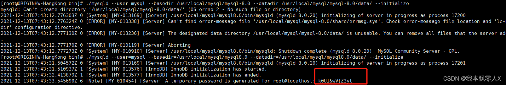
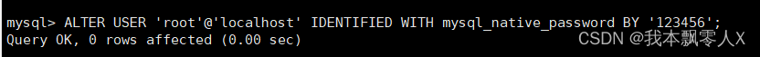

# Linux下安装mysql8.0

### 1、在local创建mysql文件夹

```
cd /usr/local
mkdir mysql
cd mysql
```

### 2、使用wget下载mysql8.0的xz安装包

> wget https://dev.mysql.com/get/Downloads/MySQL-8.0/mysql-8.0.20-linux-glibc2.12-x86_64.tar.xz

## 二、解压mysql8.0安装包

### 1、解压

> tar -xvJf mysql-8.0.20-linux-glibc2.12-x86_64.tar.xz

### 2、重命名解压后的mysql文件夹（名字太长了）

> mv mysql-8.0.20-linux-glibc2.12-x86_64 mysql8.0

### 3、创建data存储文件

```
cd mysql8.0
mkdir data
```

## 三、创建用户和用户组，并赋予权限

### 1、创建用户和用户组

```
groupadd mysql
 
useradd -g mysql mysql
```

### 2、给用户赋予权限

> chown -R mysql.mysql /usr/local/mysql/mysql8.0

## 四、初始化mysql信息

### 1、切换到mysql8.0安装路径下

Tip：绝对路径：cd /usr/local/mysql/mysql8.0/bin

> cd bin

### 2、初始化mysql基本信息

> ./mysqld --user=mysql --basedir=/usr/local/mysql/mysql8.0 --datadir=/usr/local/mysql/mysql8.0/data/ --initialize

### 3、获取到临时mysql密码



## 五、添加mysqld服务到系统

### 1、将mysqld服务添加到系统中

```
cd /usr/local/mysql/mysql8.0
cp -a ./support-files/mysql.server /etc/init.d/mysql
```

### 2、授权以及添加服务

```
chmod +x /etc/init.d/mysql
chkconfig --add mysql
```

### 3、mysql5.7以后就没有my.cnf了，所以我们创建一个。（个人觉得方便一些）

> sudo vim my.cnf

```mysql
# Example MySQL config file for small systems.  
#  
# This is for a system with little memory (<= 64M) where MySQL is only used  
# from time to time and it's important that the mysqld daemon  
# doesn't use much resources.  
#  
# MySQL programs look for option files in a set of  
# locations which depend on the deployment platform.  
# You can copy this option file to one of those  
# locations. For information about these locations, see:  
# http://dev.mysql.com/doc/mysql/en/option-files.html  
#  
# In this file, you can use all long options that a program supports.  
# If you want to know which options a program supports, run the program  
# with the "--help" option.  
  
# The following options will be passed to all MySQL clients  
[client]  
default-character-set=utf8  
#password   = k0Ui&wV(Z3yt
#port        = 3306 
#socket      = /tmp/mysql.sock  
  
# Here follows entries for some specific programs  
  
# The MySQL server   
[mysqld]  
  
#配置mysql的文件夹 和 mysql data目录
basedir=/usr/local/mysql/mysql8.0
datadir=/usr/local/mysql/mysql8.0/data
default-storage-engine=INNODB  
character-set-server=utf8  
collation-server=utf8_general_ci  
port        = 63306 
socket      = /tmp/mysql.sock  
skip-external-locking  
key_buffer_size = 16K  
max_allowed_packet = 1M  
table_open_cache = 4 
sort_buffer_size = 64K  
read_buffer_size = 256K  
read_rnd_buffer_size = 256K  
net_buffer_length = 2K  
thread_stack = 128K  
  
# Don't listen on a TCP/IP port at all. This can be a security enhancement,  
# if all processes that need to connect to mysqld run on the same host.  
# All interaction with mysqld must be made via Unix sockets or named pipes.  
# Note that using this option without enabling named pipes on Windows  
# (using the "enable-named-pipe" option) will render mysqld useless!  
#   
#skip-networking  
server-id   = 1 
  
# Uncomment the following if you want to log updates  
#log-bin=mysql-bin  
  
# binary logging format - mixed recommended  
#binlog_format=mixed  
  
# Causes updates to non-transactional engines using statement format to be  
# written directly to binary log. Before using this option make sure that  
# there are no dependencies between transactional and non-transactional  
# tables such as in the statement INSERT INTO t_myisam SELECT * FROM  
# t_innodb; otherwise, slaves may diverge from the master.  
#binlog_direct_non_transactional_updates=TRUE  
  
# Uncomment the following if you are using InnoDB tables  
#innodb_data_home_dir = /usr/local/mysql/data  
#innodb_data_file_path = ibdata1:10M:autoextend  
#innodb_log_group_home_dir = /usr/local/mysql/data  
# You can set .._buffer_pool_size up to 50 - 80 %  
# of RAM but beware of setting memory usage too high  
#innodb_buffer_pool_size = 16M  
#innodb_additional_mem_pool_size = 2M  
# Set .._log_file_size to 25 % of buffer pool size  
#innodb_log_file_size = 5M  
#innodb_log_buffer_size = 8M  
#innodb_flush_log_at_trx_commit = 1 
#innodb_lock_wait_timeout = 50 
  
[mysqldump]  
quick  
max_allowed_packet = 16M  
  
[mysql]  
no-auto-rehash  
# Remove the next comment character if you are not familiar with SQL  
#safe-updates  
  
[myisamchk]  
key_buffer_size = 8M  
sort_buffer_size = 8M  
  
[mysqlhotcopy]  
interactive-timeout
```

*设置my.cnf权限

> sudo chmod 664 /etc/my.cnf

### 4、启动mysql服务

> service mysql start

**如果出现下面报错**


**解决**

> 将/var/lock/subsys/下mysql文件删除

### 5、查看mysql服务状态

> service mysql status

### 6、将mysql命令添加到服务

> ln -s /usr/local/mysql/mysql8.0/bin/mysql /usr/bin

## 六、登录mysql

### 1、登录 密码使用之前随机生成的密码

> mysql mysql -uroot -p


### 2、修改管理员密码 其中123456是新的密码自己设置（注意SQL复制粘贴单引号问题）

> use mysql;
> ALTER USER ‘root’@‘localhost’ IDENTIFIED WITH mysql_native_password BY ‘123456’;



### 3、重新加载缓存，使密码生效

> flush privileges；

### 4、退出mysql，用新密码尝试登录管理员

## 七、修改mysql配置，使其可以用工具远程登录

> update user set host=’%’ where user=‘root’;
>
> flush privileges;
