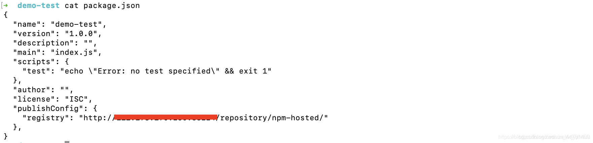

### Windows环境下 Nexus搭建npm私服

**第一步，下载nexus**

下载链接： https://pan.baidu.com/s/1GOYi2M3nT4Wcy7JEYmnqdA 提取码: a9hf


**第二步，解压缩**

我下载的是nexus-3.16.1-02-win64.zip这个版本，解压缩后，进入\nexus-3.16.1-02\bin


再次目录下，用cmd命令行执行：`nexus.exe /run`

启动之后默认地址为 localhost:8081, 默认账号密码 admin/ admin123


------

```
第三步，创建存储空间（如果使用默认的存储空间，此步骤可省略）
```


```
输入空间的名称，点击create创建
```


------

 

```
第四步，创建仓库
```


```
npm的仓库有三种：
```


```
这三种分别是：
hosted（私有仓库）：用于发布个人开发的npm组件
proxy（代理仓库）：可以代理npm和淘宝镜像
group（组合仓库）：对外公开的仓库，集合了hosted和proxy
```

------

1.创建 Hosted npm Registries


输入仓库名称，存储空间选择刚刚创建的，也可以用默认的。点击create创建。

2.创建 Proxy npm Registries


输入仓库名称，选择存储空间，代理的远程地址可以写https://registry.npmjs.org，也可以写淘宝镜像。点击create创建。

3.创建 Group npm Registries


组合仓库中除了输入名称和选择存储空间之外，还要选择要包括的仓库，越靠上优先级越高，如果私有仓库在上，用户下载npm包的时候会优先下载私有仓库中的，如果私有仓库没有再去代理仓库中下载。

------

**第五步，创建用户，设置权限（用于发布npm包）**


然后是设置权限，这一步如果不设置，是不能发布自己的npm包的。


------

**第六步，用户端使用私服**

到这里，nexus的设置都好了，但是用户如何使用私服下载npm和上传npm呢？

**1.用户端设置npm的registry为group仓库**

首先复制出group仓库的链接地址


然后，用户端设置registry。

方法一：

命令行执行：

```
npm config set registry http://npm私服所在服务器的ip地址:8081/repository/npm-group/
```

 

方法二：

修改C:\Users\Administrator下的.npmrc文件，修改为：

registry=http://npm私服所在服务器的ip地址:8081/repository/npm-group/

两种方法都可以，修改后，就可以正常使用npm下载了。

**2.用户端发布自己的npm包到私服（执行的命令均在发布的模块根目录下）**

方法一：

首先，登陆私服：

命令行执行：

```
npm login –registry=http://npm私服所在服务器的ip地址:8081/repository/npm-hosted/
```

 

```
这时候需要输入nexus的用户名、密码和邮箱。
```

 

然后，就可以发布了，要发布的模块，必须保证在根目录下有package.json文件，否则会报错。

命令行执行：

```
npm publish –registry=http://npm私服所在服务器的ip地址:8081/repository/npm-hosted/
```


方法二：
在package.json 中添加

```javascript
"publishConfig": {
    "registry": "仓库地址"
 },
```

即：
然后执行：

```javascript
npm publish
```


到此，可以到nexus验证一下有没有发布成功


