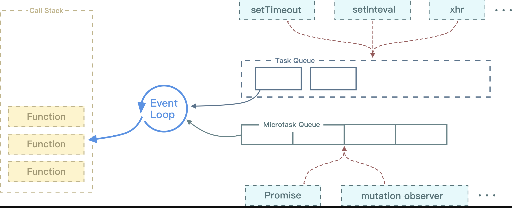

### 1 闭包

- 闭包就是能够读取其他函数内部变量的函数
- 闭包是指有权访问另一个函数作用域中变量的函数，创建闭包的最常见的方式就是在一个函数内创建另一个函数，通过另一个函数访问这个函数的局部变量,利用闭包可以突破作用链域
- 闭包的特性：

  - 函数内再嵌套函数
  - 内部函数可以引用外层的参数和变量
  - 参数和变量不会被垃圾回收机制回收

**说说你对闭包的理解**

- 使用闭包主要是为了设计私有的方法和变量。闭包的优点是可以避免全局变量的污染，缺点是闭包会常驻内存，会增大内存使用量，使用不当很容易造成内存泄露。在 js 中，函数即闭包，只有函数才会产生作用域的概念
- 闭包 的最大用处有两个，一个是可以读取函数内部的变量，另一个就是让这些变量始终保持在内存中
- 闭包的另一个用处，是封装对象的私有属性和私有方法
- **好处**：能够实现封装和缓存等；
- **坏处**：就是消耗内存、不正当使用会造成内存溢出的问题

**使用闭包的注意点**

- 由于闭包会使得函数中的变量都被保存在内存中，内存消耗很大，所以不能滥用闭包，否则会造成网页的性能问题，在 IE 中可能导致内存泄露
- 解决方法是，在退出函数之前，将不使用的局部变量全部删除

**举出闭包实际场景运用的例子**

1. 比如常见的防抖节流

   // 防抖
   function debounce(fn, delay = 300) {
   let timer; //闭包引用的外界变量
   return function () {
   const args = arguments;
   if (timer) {
   clearTimeout(timer);
   }
   timer = setTimeout(() => {
   fn.apply(this, args);
   }, delay);
   };
   }

2. 使用闭包可以在 `JavaScript` 中模拟块级作用域

   function outputNumbers(count) {
   (function () {
   for (var i = 0; i < count; i++) {
   alert(i);
   }
   })();
   alert(i); //导致一个错误！
   }

3. 闭包可以用于在对象中创建私有变量

   var aaa = (function () {
   var a = 1;
   function bbb() {
   a++;
   console.log(a);
   }
   function ccc() {
   a++;
   console.log(a);
   }
   return {
   b: bbb, //json 结构
   c: ccc,
   };
   })();
   console.log(aaa.a); //undefined
   aaa.b(); //2
   aaa.c(); //3

### 2 说说你对作用域链的理解

- 作用域链的作用是保证执行环境里有权访问的变量和函数是有序的，作用域链的变量只能向上访问，变量访问到`window`对象即被终止，作用域链向下访问变量是不被允许的
- 简单的说，作用域就是变量与函数的可访问范围，即作用域控制着变量与函数的可见性和生命周期

### 3 JavaScript 原型，原型链 ? 有什么特点？

- 每个对象都会在其内部初始化一个属性，就是`__proto__`，当我们访问一个对象的属性时

- 如果这个对象内部不存在这个属性，那么他就会去`__proto__`里找这个属性，这个`__proto__`又会有自己的`__proto__`，于是就这样一直找下去，也就是我们平时所说的原型链的概念。按照标准，`__proto__` 是不对外公开的，也就是说是个私有属性

- 关系：`instance.constructor.prototype == instance.__proto__`

  // eg.
  var a = {}

  a.constructor.prototype == a.**proto**

- 特点：

  - `JavaScript`对象是通过引用来传递的，我们创建的每个新对象实体中并没有一份属于自己的原型副本。当我们修改原型时，与之相关的对象也会继承这一改变

- 当我们需要一个属性的时，`Javascript`引擎会先看当前对象中是否有这个属性， 如果没有的

- 就会查找他的`Prototype`对象是否有这个属性，如此递推下去，一直检索到 `Object` 内建对象

- **原型：**

  - `JavaScript`的所有对象中都包含了一个 `[__proto__]` 内部属性，这个属性所对应的就是该对象的原型
  - JavaScript 的函数对象，除了原型 `[__proto__]` 之外，还预置了 `prototype` 属性
  - 当函数对象作为构造函数创建实例时，该 prototype 属性值将被作为实例对象的原型 `[__proto__]`。

- **原型链：**

  - 当一个对象调用的属性/方法自身不存在时，就会去自己 `[__proto__]` 关联的前辈 `prototype` 对象上去找
  - 如果没找到，就会去该 `prototype` 原型 `[__proto__]` 关联的前辈 `prototype` 去找。依次类推，直到找到属性/方法或 `undefined` 为止。从而形成了所谓的“原型链”

- **原型特点：**

  - `JavaScript`对象是通过引用来传递的，当修改原型时，与之相关的对象也会继承这一改变

### 4 请解释什么是事件代理

- 事件代理（`Event Delegation`），又称之为事件委托。是 `JavaScript` 中常用绑定事件的常用技巧。顾名思义，“事件代理”即是把原本需要绑定的事件委托给父元素，让父元素担当事件监听的职务。事件代理的原理是 DOM 元素的事件冒泡。使用事件代理的好处是可以提高性能
- 可以大量节省内存占用，减少事件注册，比如在`table`上代理所有`td`的`click`事件就非常棒
- 可以实现当新增子对象时无需再次对其绑定

### 5 Javascript 如何实现继承？

- 构造继承

- 原型继承

- 实例继承

- 拷贝继承

- 原型`prototype`机制或`apply`和`call`方法去实现较简单，建议使用构造函数与原型混合方式

  function Parent(){
  this.name = 'wang';
  }

  function Child(){
  this.age = 28;
  }

  Child.prototype = new Parent();//继承了 Parent，通过原型

  var demo = new Child();
  alert(demo.age);
  alert(demo.name);//得到被继承的属性

### 6 谈谈 This 对象的理解

- `this`总是指向函数的直接调用者（而非间接调用者）
- 如果有`new`关键字，`this`指向`new`出来的那个对象
- 在事件中，`this`指向触发这个事件的对象，特殊的是，`IE`中的`attachEvent`中的`this`总是指向全局对象`Window`

### 7 事件模型

> `W3C`中定义事件的发生经历三个阶段：捕获阶段（`capturing`）、目标阶段（`targetin`）、冒泡阶段（`bubbling`）

- 冒泡型事件：当你使用事件冒泡时，子级元素先触发，父级元素后触发
- 捕获型事件：当你使用事件捕获时，父级元素先触发，子级元素后触发
- `DOM`事件流：同时支持两种事件模型：捕获型事件和冒泡型事件
- 阻止冒泡：在`W3c`中，使用`stopPropagation()`方法；在 IE 下设置`cancelBubble = true`
- 阻止捕获：阻止事件的默认行为，例如`click - <a>`后的跳转。在`W3c`中，使用`preventDefault()`方法，在`IE`下设置`window.event.returnValue = false`

### 8 new 操作符具体干了什么呢?

- 创建一个空对象，并且 `this` 变量引用该对象，同时还继承了该函数的原型
- 属性和方法被加入到 `this` 引用的对象中
- 新创建的对象由 `this` 所引用，并且最后隐式的返回 `this`

### 9 Ajax 原理

- `Ajax`的原理简单来说是在用户和服务器之间加了—个中间层(`AJAX`引擎)，通过`XmlHttpRequest`对象来向服务器发异步请求，从服务器获得数据，然后用`javascrip`t 来操作`DOM`而更新页面。使用户操作与服务器响应异步化。这其中最关键的一步就是从服务器获得请求数据

- `Ajax`的过程只涉及`JavaScript`、`XMLHttpRequest`和`DOM`。`XMLHttpRequest`是`aja`x 的核心机制

  /** 1. 创建连接 **/
  var xhr = null;
  xhr = new XMLHttpRequest()
  /** 2. 连接服务器 **/
  xhr.open('get', url, true)
  /** 3. 发送请求 **/
  xhr.send(null);
  /** 4. 接受请求 **/
  xhr.onreadystatechange = function(){
  if(xhr.readyState == 4){
  if(xhr.status == 200){
  success(xhr.responseText);
  } else {
  /** false **/
  fail && fail(xhr.status);
  }
  }
  }

**ajax 有那些优缺点?**

- 优点：

  - 通过异步模式，提升了用户体验.
  - 优化了浏览器和服务器之间的传输，减少不必要的数据往返，减少了带宽占用.
  - `Ajax`在客户端运行，承担了一部分本来由服务器承担的工作，减少了大用户量下的服务器负载。
  - `Ajax`可以实现动态不刷新（局部刷新）

- 缺点：

  - 安全问题 `AJAX`暴露了与服务器交互的细节。
  - 对搜索引擎的支持比较弱。
  - 不容易调试。

### 10 如何解决跨域问题?

> 首先了解下浏览器的同源策略 同源策略`/SOP（Same origin policy）`是一种约定，由 Netscape 公司 1995 年引入浏览器，它是浏览器最核心也最基本的安全功能，如果缺少了同源策略，浏览器很容易受到`XSS`、`CSRF`等攻击。所谓同源是指"**协议+域名+端口**"三者相同，即便两个不同的域名指向同一个 ip 地址，也非同源

**那么怎样解决跨域问题的呢？**

- **通过 jsonp 跨域**

  var script = document.createElement('script');
  script.type = 'text/javascript';

  // 传参并指定回调执行函数为 onBack
  script.src = 'http://www.....:8080/login?user=admin&callback=onBack';
  document.head.appendChild(script);

  // 回调执行函数
  function onBack(res) {
  alert(JSON.stringify(res));
  }

- **document.domain + iframe 跨域**

> 此方案仅限主域相同，子域不同的跨域应用场景

1.）父窗口：(http://www.domain.com/a.html)

    <iframe id="iframe" src="http://child.domain.com/b.html"></iframe>
    

2.）子窗口：(http://child.domain.com/b.html)

    document.domain = 'domain.com';
    // 获取父窗口中变量
    alert('get js data from parent ---> ' + window.parent.user);

- **nginx 代理跨域**
- **nodejs 中间件代理跨域**
- **后端在头部信息里面设置安全域名**

### 11 模块化开发怎么做？

- 立即执行函数,不暴露私有成员

  var module1 = (function(){
  　　　　 var \_count = 0;
  　　　　 var m1 = function(){
  　　　　　　//...
  　　　　};
  　　　　 var m2 = function(){
  　　　　　　//...
  　　　　};
  　　　　 return {
  　　　　　　 m1 : m1,
  　　　　　　 m2 : m2
  　　　　};
  })();

### 12 异步加载 JS 的方式有哪些？

- 设置`
    </body>
    </html>

### 67 希望获取到页面中所有的 checkbox 怎么做？

> 不使用第三方框架

    var domList = document.getElementsByTagName(‘input’)
     var checkBoxList = [];
     var len = domList.length;　　//缓存到局部变量
     while (len--) {　　//使用while的效率会比for循环更高
     　　if (domList[len].type == ‘checkbox’) {
         　　checkBoxList.push(domList[len]);
     　　}
     }

### 68 怎样添加、移除、移动、复制、创建和查找节点

**创建新节点**

    createDocumentFragment()    //创建一个DOM片段
    createElement()   //创建一个具体的元素
    createTextNode()   //创建一个文本节点

**添加、移除、替换、插入**

    appendChild()      //添加
    removeChild()      //移除
    replaceChild()      //替换
    insertBefore()      //插入

**查找**

    getElementsByTagName()    //通过标签名称
    getElementsByName()     //通过元素的Name属性的值
    getElementById()        //通过元素Id，唯一性

### 69 正则表达式

> 正则表达式构造函数`var reg=new RegExp(“xxx”)`与正则表达字面量`var reg=//`有什么不同？匹配邮箱的正则表达式？

- 当使用`RegExp()`构造函数的时候，不仅需要转义引号（即`\`”表示”），并且还需要双反斜杠（即`\\`表示一个`\`）。使用正则表达字面量的效率更高

邮箱的正则匹配：

    var regMail = /^([a-zA-Z0-9_-])+@([a-zA-Z0-9_-])+((.[a-zA-Z0-9_-]{2,3}){1,2})$/;

### 70 Javascript 中 callee 和 caller 的作用？

- `caller`是返回一个对函数的引用，该函数调用了当前函数；
- `callee`是返回正在被执行的`function`函数，也就是所指定的`function`对象的正文

> 那么问题来了？如果一对兔子每月生一对兔子；一对新生兔，从第二个月起就开始生兔子；假定每对兔子都是一雌一雄，试问一对兔子，第 n 个月能繁殖成多少对兔子？（使用`callee`完成）

    var result=[];
      function fn(n){  //典型的斐波那契数列
         if(n==1){
              return 1;
         }else if(n==2){
                 return 1;
         }else{
              if(result[n]){
                      return result[n];
             }else{
                     //argument.callee()表示fn()
                     result[n]=arguments.callee(n-1)+arguments.callee(n-2);
                     return result[n];
             }
        }
     }

### 71 window.onload 和$(document).ready

> 原生`JS`的`window.onload`与`Jquery`的`$(document).ready(function(){})`有什么不同？如何用原生 JS 实现 Jq 的`ready`方法？

- `window.onload()`方法是必须等到页面内包括图片的所有元素加载完毕后才能执行。

- `$(document).ready()`是`DOM`结构绘制完毕后就执行，不必等到加载完毕

  function ready(fn){
  if(document.addEventListener) { //标准浏览器
  document.addEventListener('DOMContentLoaded', function() {
  //注销事件, 避免反复触发
  document.removeEventListener('DOMContentLoaded',arguments.callee, false);
  fn(); //执行函数
  }, false);
  }else if(document.attachEvent) { //IE
  document.attachEvent('onreadystatechange', function() {
  if(document.readyState == 'complete') {
  document.detachEvent('onreadystatechange', arguments.callee);
  fn(); //函数执行
  }
  });
  }
  };

### 72 addEventListener()和 attachEvent()的区别

- `addEventListener()`是符合 W3C 规范的标准方法; `attachEvent()`是 IE 低版本的非标准方法
- `addEventListener()`支持事件冒泡和事件捕获; - 而`attachEvent()`只支持事件冒泡
- `addEventListener()`的第一个参数中,事件类型不需要添加`on`; `attachEvent()`需要添加`'on'`
- 如果为同一个元素绑定多个事件, `addEventListener()`会按照事件绑定的顺序依次执行, `attachEvent()`会按照事件绑定的顺序倒序执行

### 73 获取页面所有的 checkbox

    var resultArr= [];
    var input = document.querySelectorAll('input');
    for( var i = 0; i < input.length; i++ ) {
        if( input[i].type == 'checkbox' ) {
            resultArr.push( input[i] );
        }
    }
    //resultArr即中获取到了页面中的所有checkbox

### 74 数组去重方法总结

**方法一、利用 ES6 Set 去重（ES6 中最常用）**

    function unique (arr) {
      return Array.from(new Set(arr))
    }
    var arr = [1,1,'true','true',true,true,15,15,false,false, undefined,undefined, null,null, NaN, NaN,'NaN', 0, 0, 'a', 'a',{},{}];
    console.log(unique(arr))
     //[1, "true", true, 15, false, undefined, null, NaN, "NaN", 0, "a", {}, {}]

**方法二、利用 for 嵌套 for，然后 splice 去重（ES5 中最常用）**

    function unique(arr){
            for(var i=0; i<arr.length; i++){
                for(var j=i+1; j<arr.length; j++){
                    if(arr[i]==arr[j]){         //第一个等同于第二个，splice方法删除第二个
                        arr.splice(j,1);
                        j--;
                    }
                }
            }
    	return arr;
    }
    var arr = [1,1,'true','true',true,true,15,15,false,false, undefined,undefined, null,null, NaN, NaN,'NaN', 0, 0, 'a', 'a',{},{}];
    console.log(unique(arr))
        //[1, "true", 15, false, undefined, NaN, NaN, "NaN", "a", {…}, {…}] //NaN和{}没有去重，两个null直接消失了

- 双层循环，外层循环元素，内层循环时比较值。值相同时，则删去这个值。
- 想快速学习更多常用的`ES6`语法

**方法三、利用 indexOf 去重**

    function unique(arr) {
        if (!Array.isArray(arr)) {
            console.log('type error!')
            return
        }
        var array = [];
        for (var i = 0; i < arr.length; i++) {
            if (array .indexOf(arr[i]) === -1) {
                array .push(arr[i])
            }
        }
        return array;
    }
    var arr = [1,1,'true','true',true,true,15,15,false,false, undefined,undefined, null,null, NaN, NaN,'NaN', 0, 0, 'a', 'a',{},{}];
    console.log(unique(arr))
       // [1, "true", true, 15, false, undefined, null, NaN, NaN, "NaN", 0, "a", {…}, {…}] //NaN、{}没有去重

> 新建一个空的结果数组，`for` 循环原数组，判断结果数组是否存在当前元素，如果有相同的值则跳过，不相同则`push`进数组

**方法四、利用 sort()**

    function unique(arr) {
        if (!Array.isArray(arr)) {
            console.log('type error!')
            return;
        }
        arr = arr.sort()
        var arrry= [arr[0]];
        for (var i = 1; i < arr.length; i++) {
            if (arr[i] !== arr[i-1]) {
                arrry.push(arr[i]);
            }
        }
        return arrry;
    }
    var arr = [1,1,'true','true',true,true,15,15,false,false, undefined,undefined, null,null, NaN, NaN,'NaN', 0, 0, 'a', 'a',{},{}];
    console.log(unique(arr))
    // [0, 1, 15, "NaN", NaN, NaN, {…}, {…}, "a", false, null, true, "true", undefined] //NaN、{}没有去重

> 利用`sort()`排序方法，然后根据排序后的结果进行遍历及相邻元素比对

**方法五、利用对象的属性不能相同的特点进行去重**

    function unique(arr) {
        if (!Array.isArray(arr)) {
            console.log('type error!')
            return
        }
        var arrry= [];
         var  obj = {};
        for (var i = 0; i < arr.length; i++) {
            if (!obj[arr[i]]) {
                arrry.push(arr[i])
                obj[arr[i]] = 1
            } else {
                obj[arr[i]]++
            }
        }
        return arrry;
    }
    var arr = [1,1,'true','true',true,true,15,15,false,false, undefined,undefined, null,null, NaN, NaN,'NaN', 0, 0, 'a', 'a',{},{}];
    console.log(unique(arr))
    //[1, "true", 15, false, undefined, null, NaN, 0, "a", {…}] //两个true直接去掉了，NaN和{}去重

**方法六、利用 includes**

    function unique(arr) {
        if (!Array.isArray(arr)) {
            console.log('type error!')
            return
        }
        var array =[];
        for(var i = 0; i < arr.length; i++) {
                if( !array.includes( arr[i]) ) {//includes 检测数组是否有某个值
                        array.push(arr[i]);
                  }
        }
        return array
    }
    var arr = [1,1,'true','true',true,true,15,15,false,false, undefined,undefined, null,null, NaN, NaN,'NaN', 0, 0, 'a', 'a',{},{}];
    console.log(unique(arr))
        //[1, "true", true, 15, false, undefined, null, NaN, "NaN", 0, "a", {…}, {…}] //{}没有去重

**方法七、利用 hasOwnProperty**

    function unique(arr) {
        var obj = {};
        return arr.filter(function(item, index, arr){
            return obj.hasOwnProperty(typeof item + item) ? false : (obj[typeof item + item] = true)
        })
    }
        var arr = [1,1,'true','true',true,true,15,15,false,false, undefined,undefined, null,null, NaN, NaN,'NaN', 0, 0, 'a', 'a',{},{}];
            console.log(unique(arr))
    //[1, "true", true, 15, false, undefined, null, NaN, "NaN", 0, "a", {…}] //所有的都去重了

> 利用`hasOwnProperty` 判断是否存在对象属性

**方法八、利用 filter**

    function unique(arr) {
      return arr.filter(function(item, index, arr) {
        //当前元素，在原始数组中的第一个索引==当前索引值，否则返回当前元素
        return arr.indexOf(item, 0) === index;
      });
    }
    var arr = [1,1,'true','true',true,true,15,15,false,false, undefined,undefined, null,null, NaN, NaN,'NaN', 0, 0, 'a', 'a',{},{}];
    console.log(unique(arr))
    //[1, "true", true, 15, false, undefined, null, "NaN", 0, "a", {…}, {…}]

**方法九、利用递归去重**

    function unique(arr) {
        var array= arr;
        var len = array.length;

    	array.sort(function(a,b){   //排序后更加方便去重
    		return a - b;
    	})

    	function loop(index){
            if(index >= 1){
                if(array[index] === array[index-1]){
                array.splice(index,1);
                }
                loop(index - 1);    //递归loop，然后数组去重
            }
    	}
    	loop(len-1);
    	return array;
    }
    var arr = [1,1,'true','true',true,true,15,15,false,false, undefined,undefined, null,null, NaN, NaN,'NaN', 0, 0, 'a', 'a',{},{}];
    console.log(unique(arr))
    //[1, "a", "true", true, 15, false, 1, {…}, null, NaN, NaN, "NaN", 0, "a", {…}, undefined]

**方法十、利用 Map 数据结构去重**

    function arrayNonRepeatfy(arr) {
    	let map = new Map();
    		let array = new Array();  // 数组用于返回结果
    		for (let i = 0; i < arr.length; i++) {
    			if(map .has(arr[i])) {  // 如果有该key值
    			map .set(arr[i], true);
    		} else {
    			map .set(arr[i], false);   // 如果没有该key值
    			array .push(arr[i]);
    		}
    	}
    	return array ;
    }
     var arr = [1,1,'true','true',true,true,15,15,false,false, undefined,undefined, null,null, NaN, NaN,'NaN', 0, 0, 'a', 'a',{},{}];
        console.log(unique(arr))
    //[1, "a", "true", true, 15, false, 1, {…}, null, NaN, NaN, "NaN", 0, "a", {…}, undefined]

> 创建一个空`Map`数据结构，遍历需要去重的数组，把数组的每一个元素作为`key`存到`Map`中。由于`Map`中不会出现相同的`key`值，所以最终得到的就是去重后的结果

**方法十一、利用 reduce+includes**

    function unique(arr){
        return arr.reduce((prev,cur) => prev.includes(cur) ? prev : [...prev,cur],[]);
    }
    var arr = [1,1,'true','true',true,true,15,15,false,false, undefined,undefined, null,null, NaN, NaN,'NaN', 0, 0, 'a', 'a',{},{}];
    console.log(unique(arr));
    // [1, "true", true, 15, false, undefined, null, NaN, "NaN", 0, "a", {…}, {…}]

**方法十二、\[...new Set(arr)\]**

    [...new Set(arr)]
    //代码就是这么少----（其实，严格来说并不算是一种，相对于第一种方法来说只是简化了代码）

### 75 （设计题）想实现一个对页面某个节点的拖曳？如何做？（使用原生 JS）

- 给需要拖拽的节点绑定`mousedown`, `mousemove`, `mouseup`事件
- `mousedown`事件触发后，开始拖拽
- `mousemove`时，需要通过`event.clientX`和`clientY`获取拖拽位置，并实时更新位置
- `mouseup`时，拖拽结束
- 需要注意浏览器边界的情况

### 76 Javascript 全局函数和全局变量

**全局变量**

- `Infinity` 代表正的无穷大的数值。
- `NaN` 指示某个值是不是数字值。
- `undefined` 指示未定义的值。

**全局函数**

- `decodeURI()` 解码某个编码的 `URI`。
- `decodeURIComponent()` 解码一个编码的 `URI` 组件。
- `encodeURI()` 把字符串编码为 URI。
- `encodeURIComponent()` 把字符串编码为 `URI` 组件。
- `escape()` 对字符串进行编码。
- `eval()` 计算 `JavaScript` 字符串，并把它作为脚本代码来执行。
- `isFinite()` 检查某个值是否为有穷大的数。
- `isNaN()` 检查某个值是否是数字。
- `Number()` 把对象的值转换为数字。
- `parseFloat()` 解析一个字符串并返回一个浮点数。
- `parseInt()` 解析一个字符串并返回一个整数。
- `String()` 把对象的值转换为字符串。
- `unescape()` 对由`escape()` 编码的字符串进行解码

### 77 使用 js 实现一个持续的动画效果

**定时器思路**

    var e = document.getElementById('e')
    var flag = true;
    var left = 0;
    setInterval(() => {
        left == 0 ? flag = true : left == 100 ? flag = false : ''
        flag ? e.style.left = ` ${left++}px` : e.style.left = ` ${left--}px`
    }, 1000 / 60)

**requestAnimationFrame**

    //兼容性处理
    window.requestAnimFrame = (function(){
        return window.requestAnimationFrame       ||
               window.webkitRequestAnimationFrame ||
               window.mozRequestAnimationFrame    ||
               function(callback){
                    window.setTimeout(callback, 1000 / 60);
               };
    })();

    var e = document.getElementById("e");
    var flag = true;
    var left = 0;

    function render() {
        left == 0 ? flag = true : left == 100 ? flag = false : '';
        flag ? e.style.left = ` ${left++}px` :
            e.style.left = ` ${left--}px`;
    }

    (function animloop() {
        render();
        requestAnimFrame(animloop);
    })();

**使用 css 实现一个持续的动画效果**

    animation:mymove 5s infinite;

    @keyframes mymove {
        from {top:0px;}
        to {top:200px;}
    }

- `animation-name` 规定需要绑定到选择器的 `keyframe`名称。
- `animation-duration` 规定完成动画所花费的时间，以秒或毫秒计。
- `animation-timing-function` 规定动画的速度曲线。
- `animation-delay` 规定在动画开始之前的延迟。
- `animation-iteration-count` 规定动画应该播放的次数。
- `animation-direction` 规定是否应该轮流反向播放动画

### 78 封装一个函数，参数是定时器的时间，.then 执行回调函数

    function sleep (time) {
        return new Promise((resolve) => setTimeout(resolve, time));
    }

### 79 怎么判断两个对象相等？

    obj={
        a:1,
        b:2
    }
    obj2={
        a:1,
        b:2
    }
    obj3={
        a:1,
        b:'2'
    }

> 可以转换为字符串来判断

    JSON.stringify(obj)==JSON.stringify(obj2);//true
    JSON.stringify(obj)==JSON.stringify(obj3);//false

### 80 项目做过哪些性能优化？

- 减少 `HTTP` 请求数
- 减少 `DNS` 查询
- 使用 `CDN`
- 避免重定向
- 图片懒加载
- 减少 `DOM` 元素数量
- 减少`DOM` 操作
- 使用外部 `JavaScript` 和 `CSS`
- 压缩 `JavaScript` 、 `CSS` 、字体、图片等
- 优化 `CSS Sprite`
- 使用 `iconfont`
- 字体裁剪
- 多域名分发划分内容到不同域名
- 尽量减少 `iframe` 使用
- 避免图片 `src` 为空
- 把样式表放在`link` 中
- 把`JavaScript`放在页面底部

### 81 浏览器缓存

> 浏览器缓存分为强缓存和协商缓存。当客户端请求某个资源时，获取缓存的流程如下

- 先根据这个资源的一些 `http header` 判断它是否命中强缓存，如果命中，则直接从本地获取缓存资源，不会发请求到服务器；
- 当强缓存没有命中时，客户端会发送请求到服务器，服务器通过另一些`request header`验证这个资源是否命中协商缓存，称为`http`再验证，如果命中，服务器将请求返回，但不返回资源，而是告诉客户端直接从缓存中获取，客户端收到返回后就会从缓存中获取资源；
- 强缓存和协商缓存共同之处在于，如果命中缓存，服务器都不会返回资源； 区别是，强缓存不对发送请求到服务器，但协商缓存会。
- 当协商缓存也没命中时，服务器就会将资源发送回客户端。
- 当 `ctrl+f5` 强制刷新网页时，直接从服务器加载，跳过强缓存和协商缓存；
- 当 `f5`刷新网页时，跳过强缓存，但是会检查协商缓存；

**强缓存**

- `Expires`（该字段是 `http1.0` 时的规范，值为一个绝对时间的 `GMT` 格式的时间字符串，代表缓存资源的过期时间）
- `Cache-Control:max-age`（该字段是 `http1.1`的规范，强缓存利用其 `max-age` 值来判断缓存资源的最大生命周期，它的值单位为秒）

**协商缓存**

- `Last-Modified`（值为资源最后更新时间，随服务器 response 返回）
- `If-Modified-Since`（通过比较两个时间来判断资源在两次请求期间是否有过修改，如果没有修改，则命中协商缓存）
- `ETag`（表示资源内容的唯一标识，随服务器`response`返回）
- `If-None-Match`（服务器通过比较请求头部的`If-None-Match`与当前资源的`ETag`是否一致来判断资源是否在两次请求之间有过修改，如果没有修改，则命中协商缓存）

### 82 WebSocket

> 由于 `http` 存在一个明显的弊端（消息只能有客户端推送到服务器端，而服务器端不能主动推送到客户端），导致如果服务器如果有连续的变化，这时只能使用轮询，而轮询效率过低，并不适合。于是 `WebSocket`被发明出来

> 相比与 `http` 具有以下有点

- 支持双向通信，实时性更强；
- 可以发送文本，也可以二进制文件；
- 协议标识符是 `ws`，加密后是 `wss` ；
- 较少的控制开销。连接创建后，`ws`客户端、服务端进行数据交换时，协议控制的数据包头部较小。在不包含头部的情况下，服务端到客户端的包头只有`2~10`字节（取决于数据包长度），客户端到服务端的的话，需要加上额外的 4 字节的掩码。而`HTTP`协议每次通信都需要携带完整的头部；
- 支持扩展。ws 协议定义了扩展，用户可以扩展协议，或者实现自定义的子协议。（比如支持自定义压缩算法等）
- 无跨域问题。

> 实现比较简单，服务端库如 `socket.io`、`ws`，可以很好的帮助我们入门。而客户端也只需要参照 `api` 实现即可

### 83 尽可能多的说出你对 Electron 的理解

> 最最重要的一点，`electron` 实际上是一个套了 `Chrome` 的 `nodeJS`程序

**所以应该是从两个方面说开来**

- `Chrome` （无各种兼容性问题）；
- `NodeJS`（`NodeJS` 能做的它也能做）

### 84 深浅拷贝

**浅拷贝**

- `Object.assign`
- 或者展开运算符

**深拷贝**

- 可以通过 `JSON.parse(JSON.stringify(object))` 来解决

  let a = {
  age: 1,
  jobs: {
  first: 'FE'
  }
  }
  let b = JSON.parse(JSON.stringify(a))
  a.jobs.first = 'native'
  console.log(b.jobs.first) // FE

**该方法也是有局限性的**

- 会忽略 `undefined`
- 不能序列化函数
- 不能解决循环引用的对象

### 85 防抖/节流

**防抖**

> 在滚动事件中需要做个复杂计算或者实现一个按钮的防二次点击操作。可以通过函数防抖动来实现

    // 使用 underscore 的源码来解释防抖动

    /** * underscore 防抖函数，返回函数连续调用时，空闲时间必须大于或等于 wait，func 才会执行 * * @param {function} func 回调函数 * @param {number} wait 表示时间窗口的间隔 * @param {boolean} immediate 设置为ture时，是否立即调用函数 * @return {function} 返回客户调用函数 */
    _.debounce = function(func, wait, immediate) {
        var timeout, args, context, timestamp, result;

        var later = function() {
          // 现在和上一次时间戳比较
          var last = _.now() - timestamp;
          // 如果当前间隔时间少于设定时间且大于0就重新设置定时器
          if (last < wait && last >= 0) {
            timeout = setTimeout(later, wait - last);
          } else {
            // 否则的话就是时间到了执行回调函数
            timeout = null;
            if (!immediate) {
              result = func.apply(context, args);
              if (!timeout) context = args = null;
            }
          }
        };

        return function() {
          context = this;
          args = arguments;
          // 获得时间戳
          timestamp = _.now();
          // 如果定时器不存在且立即执行函数
          var callNow = immediate && !timeout;
          // 如果定时器不存在就创建一个
          if (!timeout) timeout = setTimeout(later, wait);
          if (callNow) {
            // 如果需要立即执行函数的话 通过 apply 执行
            result = func.apply(context, args);
            context = args = null;
          }

          return result;
        };
      };

> 整体函数实现

对于按钮防点击来说的实现

- 开始一个定时器，只要我定时器还在，不管你怎么点击都不会执行回调函数。一旦定时器结束并设置为 null，就可以再次点击了
- 对于延时执行函数来说的实现：每次调用防抖动函数都会判断本次调用和之前的时间间隔，如果小于需要的时间间隔，就会重新创建一个定时器，并且定时器的延时为设定时间减去之前的时间间隔。一旦时间到了，就会执行相应的回调函数

**节流**

> 防抖动和节流本质是不一样的。防抖动是将多次执行变为最后一次执行，节流是将多次执行变成每隔一段时间执行

    /** * underscore 节流函数，返回函数连续调用时，func 执行频率限定为 次 / wait * * @param {function} func 回调函数 * @param {number} wait 表示时间窗口的间隔 * @param {object} options 如果想忽略开始函数的的调用，传入{leading: false}。 * 如果想忽略结尾函数的调用，传入{trailing: false} * 两者不能共存，否则函数不能执行 * @return {function} 返回客户调用函数 */
    _.throttle = function(func, wait, options) {
        var context, args, result;
        var timeout = null;
        // 之前的时间戳
        var previous = 0;
        // 如果 options 没传则设为空对象
        if (!options) options = {};
        // 定时器回调函数
        var later = function() {
          // 如果设置了 leading，就将 previous 设为 0
          // 用于下面函数的第一个 if 判断
          previous = options.leading === false ? 0 : _.now();
          // 置空一是为了防止内存泄漏，二是为了下面的定时器判断
          timeout = null;
          result = func.apply(context, args);
          if (!timeout) context = args = null;
        };
        return function() {
          // 获得当前时间戳
          var now = _.now();
          // 首次进入前者肯定为 true
    	  // 如果需要第一次不执行函数
    	  // 就将上次时间戳设为当前的
          // 这样在接下来计算 remaining 的值时会大于0
          if (!previous && options.leading === false) previous = now;
          // 计算剩余时间
          var remaining = wait - (now - previous);
          context = this;
          args = arguments;
          // 如果当前调用已经大于上次调用时间 + wait
          // 或者用户手动调了时间
     	  // 如果设置了 trailing，只会进入这个条件
    	  // 如果没有设置 leading，那么第一次会进入这个条件
    	  // 还有一点，你可能会觉得开启了定时器那么应该不会进入这个 if 条件了
    	  // 其实还是会进入的，因为定时器的延时
    	  // 并不是准确的时间，很可能你设置了2秒
    	  // 但是他需要2.2秒才触发，这时候就会进入这个条件
          if (remaining <= 0 || remaining > wait) {
            // 如果存在定时器就清理掉否则会调用二次回调
            if (timeout) {
              clearTimeout(timeout);
              timeout = null;
            }
            previous = now;
            result = func.apply(context, args);
            if (!timeout) context = args = null;
          } else if (!timeout && options.trailing !== false) {
            // 判断是否设置了定时器和 trailing
    	    // 没有的话就开启一个定时器
            // 并且不能不能同时设置 leading 和 trailing
            timeout = setTimeout(later, remaining);
          }
          return result;
        };
      };

### 86 谈谈变量提升？

> 当执行 JS 代码时，会生成执行环境，只要代码不是写在函数中的，就是在全局执行环境中，函数中的代码会产生函数执行环境，只此两种执行环境

- 接下来让我们看一个老生常谈的例子，`var`

  b() // call b
  console.log(a) // undefined

  var a = 'Hello world'

  function b() {
  console.log('call b')
  }

变量提升

这是因为函数和变量提升的原因。通常提升的解释是说将声明的代码移动到了顶部，这其实没有什么错误，便于大家理解。但是更准确的解释应该是：在生成执行环境时，会有两个阶段。第一个阶段是创建的阶段，JS 解释器会找出需要提升的变量和函数，并且给他们提前在内存中开辟好空间，函数的话会将整个函数存入内存中，变量只声明并且赋值为 `undefined`，所以在第二个阶段，也就是代码执行阶段，我们可以直接提前使用

在提升的过程中，相同的函数会覆盖上一个函数，并且函数优先于变量提升

    b() // call b second

    function b() {
        console.log('call b fist')
    }
    function b() {
        console.log('call b second')
    }
    var b = 'Hello world'

> 复制代码`var` 会产生很多错误，所以在 `ES6`中引入了 `let`。`let` 不能在声明前使用，但是这并不是常说的 `let` 不会提升，`let` 提升了，在第一阶段内存也已经为他开辟好了空间，但是因为这个声明的特性导致了并不能在声明前使用

### 87 什么是单线程，和异步的关系

- 单线程 - 只有一个线程，只能做一件事
- 原因 - 避免 `DOM` 渲染的冲突

  - 浏览器需要渲染 `DOM`
  - `JS` 可以修改 `DOM` 结构
  - `JS` 执行的时候，浏览器 `DOM` 渲染会暂停
  - 两段 JS 也不能同时执行（都修改 `DOM` 就冲突了）
  - `webworker` 支持多线程，但是不能访问 `DOM`

- 解决方案 - 异步

### 88 是否用过 jQuery 的 Deferred

> deferred 对象在初始化的时候是延迟状态的, 任何添加到队列里的回调方法会推迟执行, 调用 resolve()或者
> resolveWith()方法来转换当前实例进入到 resolve 状态, 并且执行对应状态的回调方法, 调用 reject()或 rejectWith()方法
> 来使实例进入 reject 状态, 并执行对应的回调方法, 一个对象实例当进入到不同的状态时, 它会保持状态, 回调方法会添加到当前
> 实例中, 并被立即执行

jQuery 的设计理念是这样的：

- 1 deferred 对象有三种执行状态----完成 失败 进行中。
- 2 每种状态对应一个 Callbacks 实例
- 3 如果执行状态是"完成"（resolved）,deferred 对象立刻调用 done()方法指定的回调函数(也就是执行已完成状态对应的 Callbacks 实例的 fire 方法)；如果执行状态是"失败"，调用 fail()方法指定的回调函数；如果执行状态是"进行中"，则继续等待，或者调用 progress()方法指定的回调函数。

#### Deferred 大体架构：

### 89 前端面试之 hybrid

>

### 90 前端面试之组件化

>

### 91 前端面试之 MVVM 浅析

>

### 92 实现效果，点击容器内的图标，图标边框变成 border 1px solid red，点击空白处重置

    const box = document.getElementById('box');
    function isIcon(target) {
      return target.className.includes('icon');
    }

    box.onClick = function(e) {
      e.stopPropagation();
      const target = e.target;
      if (isIcon(target)) {
        target.style.border = '1px solid red';
      }
    }
    const doc = document;
    doc.onclick = function(e) {
      const children = box.children;
      for(let i; i < children.length; i++) {
        if (isIcon(children[i])) {
          children[i].style.border = 'none';
        }
      }
    }

### 93 请简单实现双向数据绑定`mvvm`

    <input id="input"/>

    const data = {};
    const input = document.getElementById('input');
    Object.defineProperty(data, 'text', {
      set(value) {
        input.value = value;
        this.value = value;
      }
    });
    input.onChange = function(e) {
      data.text = e.target.value;
    }

### 94 实现 Storage，使得该对象为单例，并对`localStorage`进行封装设置值 setItem(key,value)和 getItem(key)

    var instance = null;
    class Storage {
      static getInstance() {
        if (!instance) {
          instance = new Storage();
        }
        return instance;
      }
      setItem = (key, value) => localStorage.setItem(key, value),
      getItem = key => localStorage.getItem(key)
    }

### 95 说说`event loop`

> 首先，`js`是单线程的，主要的任务是处理用户的交互，而用户的交互无非就是响应`DOM`的增删改，使用事件队列的形式，一次事件循环只处理一个事件响应，使得脚本执行相对连续，所以有了事件队列，用来储存待执行的事件，那么事件队列的事件从哪里被`push`进来的呢。那就是另外一个线程叫事件触发线程做的事情了，他的作用主要是在定时触发器线程、异步`HTTP`请求线程满足特定条件下的回调函数`push`到事件队列中，等待`js`引擎空闲的时候去执行，当然 js 引擎执行过程中有优先级之分，首先 js 引擎在一次事件循环中，会先执行 js 线程的主任务，然后会去查找是否有微任务`microtask（promise）`，如果有那就优先执行微任务，如果没有，在去查找宏任务`macrotask（setTimeout、setInterval）`进行执行

> 众所周知 `JS` 是门非阻塞单线程语言，因为在最初 `JS` 就是为了和浏览器交互而诞生的。如果 `JS` 是门多线程的语言话，我们在多个线程中处理 `DOM` 就可能会发生问题（一个线程中新加节点，另一个线程中删除节点）

- `JS` 在执行的过程中会产生执行环境，这些执行环境会被顺序的加入到执行栈中。如果遇到异步的代码，会被挂起并加入到 `Task`（有多种 `task`） 队列中。一旦执行栈为空，`Event` `Loop` 就会从 `Task` 队列中拿出需要执行的代码并放入执行栈中执行，所以本质上来说 `JS` 中的异步还是同步行为

    console.log('script start');

    setTimeout(function() {
      console.log('setTimeout');
    }, 0);

    console.log('script end');

> 不同的任务源会被分配到不同的 `Task` 队列中，任务源可以分为 微任务（`microtask`） 和 宏任务（`macrotask`）。在 `ES6` 规范中，`microtask` 称为 `jobs`，`macrotask` 称为 `task`

    console.log('script start');

    setTimeout(function() {
      console.log('setTimeout');
    }, 0);

    new Promise((resolve) => {
        console.log('Promise')
        resolve()
    }).then(function() {
      console.log('promise1');
    }).then(function() {
      console.log('promise2');
    });

    console.log('script end');
    // script start => Promise => script end => promise1 => promise2 => setTimeout

> 以上代码虽然 `setTimeout` 写在 `Promise` 之前，但是因为 `Promise` 属于微任务而 `setTimeout` 属于宏任务

**微任务**

- `process.nextTick`
- `promise`
- `Object.observe`
- `MutationObserver`

**宏任务**

- `script`
- `setTimeout`
- `setInterval`
- `setImmediate`
- `I/O`
- `UI rendering`

> 宏任务中包括了 `script` ，浏览器会先执行一个宏任务，接下来有异步代码的话就先执行微任务

**所以正确的一次 Event loop 顺序是这样的**

- 执行同步代码，这属于宏任务
- 执行栈为空，查询是否有微任务需要执行
- 执行所有微任务
- 必要的话渲染 UI
- 然后开始下一轮 `Event loop`，执行宏任务中的异步代码

> 通过上述的 `Event loop` 顺序可知，如果宏任务中的异步代码有大量的计算并且需要操作 `DOM` 的话，为了更快的响应界面响应，我们可以把操作 `DOM` 放入微任务中

    setTimeout(function () {
      console.log("1");
    }, 0);
    async function async1() {
      console.log("2");
      const data = await async2();
      console.log("3");
      return data;
    }
    async function async2() {
      return new Promise((resolve) => {
        console.log("4");
        resolve("async2的结果");
      }).then((data) => {
        console.log("5");
        return data;
      });
    }
    async1().then((data) => {
      console.log("6");
      console.log(data);
    });
    new Promise(function (resolve) {
      console.log("7");
      // resolve()
    }).then(function () {
      console.log("8");
    });

> 输出结果：`247536` `async2` 的结果 `1`

### 96 说说事件流

**事件流分为两种，捕获事件流和冒泡事件流**

- 捕获事件流从根节点开始执行，一直往子节点查找执行，直到查找执行到目标节点
- 冒泡事件流从目标节点开始执行，一直往父节点冒泡查找执行，直到查到到根节点

> 事件流分为三个阶段，一个是捕获节点，一个是处于目标节点阶段，一个是冒泡阶段

### 97 JavaScript 对象生命周期的理解

- 当创建一个对象时，`JavaScript` 会自动为该对象分配适当的内存
- 垃圾回收器定期扫描对象，并计算引用了该对象的其他对象的数量
- 如果被引用数量为 `0`，或惟一引用是循环的，那么该对象的内存即可回收

### 98 我现在有一个`canvas`，上面随机布着一些黑块，请实现方法，计算 canvas 上有多少个黑块

> https://www.jianshu.com/p/f54d265f7aa4

### 99 请手写实现一个`promise`

> https://segmentfault.com/a/1190000013396601

### 100 说说从输入 URL 到看到页面发生的全过程，越详细越好

- 首先浏览器主进程接管，开了一个下载线程。
- 然后进行 HTTP 请求（DNS 查询、IP 寻址等等），中间会有三次捂手，等待响应，开始下载响应报文。
- 将下载完的内容转交给 Renderer 进程管理。
- Renderer 进程开始解析 css rule tree 和 dom tree，这两个过程是并行的，所以一般我会把 link 标签放在页面顶部。
- 解析绘制过程中，当浏览器遇到 link 标签或者 script、img 等标签，浏览器会去下载这些内容，遇到时候缓存的使用缓存，不适用缓存的重新下载资源。
- css rule tree 和 dom tree 生成完了之后，开始合成 render tree，这个时候浏览器会进行 layout，开始计算每一个节点的位置，然后进行绘制。
- 绘制结束后，关闭 TCP 连接，过程有四次挥手

### 101 描述一下`this`

> `this`，函数执行的上下文，可以通过`apply`，`call`，`bind`改变`this`的指向。对于匿名函数或者直接调用的函数来说，this 指向全局上下文（浏览器为 window，NodeJS 为`global`），剩下的函数调用，那就是谁调用它，`this`就指向谁。当然还有 es6 的箭头函数，箭头函数的指向取决于该箭头函数声明的位置，在哪里声明，`this`就指向哪里

### 102 说一下浏览器的缓存机制

> 浏览器缓存机制有两种，一种为强缓存，一种为协商缓存

- 对于强缓存，浏览器在第一次请求的时候，会直接下载资源，然后缓存在本地，第二次请求的时候，直接使用缓存。
- 对于协商缓存，第一次请求缓存且保存缓存标识与时间，重复请求向服务器发送缓存标识和最后缓存时间，服务端进行校验，如果失效则使用缓存

**协商缓存相关设置**

- `Exprires`：服务端的响应头，第一次请求的时候，告诉客户端，该资源什么时候会过期。`Exprires`的缺陷是必须保证服务端时间和客户端时间严格同步。
- `Cache-control：max-age`：表示该资源多少时间后过期，解决了客户端和服务端时间必须同步的问题，
- `If-None-Match/ETag`：缓存标识，对比缓存时使用它来标识一个缓存，第一次请求的时候，服务端会返回该标识给客户端，客户端在第二次请求的时候会带上该标识与服务端进行对比并返回`If-None-Match`标识是否表示匹配。
- `Last-modified/If-Modified-Since`：第一次请求的时候服务端返回`Last-modified`表明请求的资源上次的修改时间，第二次请求的时候客户端带上请求头`If-Modified-Since`，表示资源上次的修改时间，服务端拿到这两个字段进行对比

### 103 现在要你完成一个 Dialog 组件，说说你设计的思路？它应该有什么功能？

- 该组件需要提供`hook`指定渲染位置，默认渲染在 body 下面。
- 然后改组件可以指定外层样式，如宽度等
- 组件外层还需要一层`mask`来遮住底层内容，点击`mask`可以执行传进来的`onCancel`函数关闭`Dialog`。
- 另外组件是可控的，需要外层传入`visible`表示是否可见。
- 然后`Dialog`可能需要自定义头 head 和底部`footer`，默认有头部和底部，底部有一个确认按钮和取消按钮，确认按钮会执行外部传进来的`onOk`事件，然后取消按钮会执行外部传进来的`onCancel`事件。
- 当组件的`visible`为`true`时候，设置`body`的`overflow`为`hidden`，隐藏`body`的滚动条，反之显示滚动条。
- 组件高度可能大于页面高度，组件内部需要滚动条。
- 只有组件的`visible`有变化且为`ture`时候，才重渲染组件内的所有内容

### 104 `caller`和`callee`的区别

**callee**

> `caller`返回一个函数的引用，这个函数调用了当前的函数。

**使用这个属性要注意**

- 这个属性只有当函数在执行时才有用
- 如果在`javascript`程序中，函数是由顶层调用的，则返回`null`

> `functionName.caller: functionName`是当前正在执行的函数。

    function a() {
      console.log(a.caller)
    }

**callee**

> `callee`放回正在执行的函数本身的引用，它是`arguments`的一个属性

> 使用 callee 时要注意:

- 这个属性只有在函数执行时才有效

- 它有一个`length`属性，可以用来获得形参的个数，因此可以用来比较形参和实参个数是否一致，即比较`arguments.length`是否等于`arguments.callee.length`

- 它可以用来递归匿名函数。

  function a() {
  console.log(arguments.callee)
  }

### 105 ajax、axios、fetch 区别

**jQuery ajax**

    $.ajax({
       type: 'POST',
       url: url,
       data: data,
       dataType: dataType,
       success: function () {},
       error: function () {}
    });

优缺点：

- 本身是针对`MVC`的编程,不符合现在前端`MVVM`的浪潮
- 基于原生的`XHR`开发，`XHR`本身的架构不清晰，已经有了`fetch`的替代方案
- `JQuery`整个项目太大，单纯使用`ajax`却要引入整个`JQuery`非常的不合理（采取个性化打包的方案又不能享受 CDN 服务）

**axios**

    axios({
        method: 'post',
        url: '/user/12345',
        data: {
            firstName: 'Fred',
            lastName: 'Flintstone'
        }
    })
    .then(function (response) {
        console.log(response);
    })
    .catch(function (error) {
        console.log(error);
    });

优缺点：

- 从浏览器中创建 `XMLHttpRequest`
- 从 `node.js` 发出 `http` 请求
- 支持 `Promise API`
- 拦截请求和响应
- 转换请求和响应数据
- 取消请求
- 自动转换`JSON`数据
- 客户端支持防止`CSRF/XSRF`

**fetch**

    try {
      let response = await fetch(url);
      let data = response.json();
      console.log(data);
    } catch(e) {
      console.log("Oops, error", e);

    }

优缺点：

- `fetcht`只对网络请求报错，对`400`，`500`都当做成功的请求，需要封装去处理
- `fetch`默认不会带`cookie`，需要添加配置项
- `fetch`不支持`abort`，不支持超时控制，使用`setTimeout`及`Promise.reject`的实现的超时控制并不能阻止请求过程继续在后台运行，造成了量的浪费
- `fetch`没有办法原生监测请求的进度，而 XHR 可以

### 106 JavaScript 的组成

- `JavaScript` 由以下三部分组成：

  - `ECMAScript（核心）：`JavaScript\` 语言基础
  - `DOM`（文档对象模型）：规定了访问`HTML`和`XML`的接口
  - `BOM`（浏览器对象模型）：提供了浏览器窗口之间进行交互的对象和方法

### 107 检测浏览器版本版本有哪些方式？

- 根据 `navigator.userAgent` `UA.toLowerCase().indexOf('chrome')`
- 根据 `window` 对象的成员 `'ActiveXObject' in window`

### 108 介绍 JS 有哪些内置对象

- 数据封装类对象：`Object`、`Array`、`Boolean`、`Number`、`String`
- 其他对象：`Function`、`Arguments`、`Math`、`Date`、`RegExp`、`Error`
- ES6 新增对象：`Symbol`、`Map`、`Set`、`Promises`、`Proxy`、`Reflect`

### 109 说几条写 JavaScript 的基本规范

- 代码缩进，建议使用“四个空格”缩进
- 代码段使用花括号`{}`包裹
- 语句结束使用分号;
- 变量和函数在使用前进行声明
- 以大写字母开头命名构造函数，全大写命名常量
- 规范定义`JSON`对象，补全双引号
- 用`{}`和`[]`声明对象和数组

### 110 如何编写高性能的 JavaScript

- 遵循严格模式：`"use strict";`
- 将 js 脚本放在页面底部，加快渲染页面
- 将 js 脚本将脚本成组打包，减少请求
- 使用非阻塞方式下载 js 脚本
- 尽量使用局部变量来保存全局变量
- 尽量减少使用闭包
- 使用 `window` 对象属性方法时，省略 `window`
- 尽量减少对象成员嵌套
- 缓存 `DOM` 节点的访问
- 通过避免使用 `eval()` 和 `Function()` 构造器
- 给 `setTimeout()` 和 `setInterval()` 传递函数而不是字符串作为参数
- 尽量使用直接量创建对象和数组
- 最小化重绘(`repaint`)和回流(`reflow`)

### 111 描述浏览器的渲染过程，DOM 树和渲染树的区别

- 浏览器的渲染过程：

  - 解析`HTML`构建 `DOM`(DOM 树)，并行请求 `css/image/js`
  - `CSS` 文件下载完成，开始构建 `CSSOM`(`CSS`树)
  - `CSSOM` 构建结束后，和 `DOM` 一起生成 `Render Tree`(渲染树)
  - 布局(`Layout`)：计算出每个节点在屏幕中的位置
  - 显示(`Painting`)：通过显卡把页面画到屏幕上

- `DOM`树 和 渲染树 的区别：

  - `DOM`树与`HTML`标签一一对应，包括`head`和隐藏元素
  - 渲染树不包括`head`和隐藏元素，大段文本的每一个行都是独立节点，每一个节点都有对应的`css`属性

### 112 script 的位置是否会影响首屏显示时间

- 在解析 `HTML` 生成 `DOM` 过程中，`js` 文件的下载是并行的，不需要 `DOM` 处理到 `script` 节点。因此，`script`的位置不影响首屏显示的开始时间。
- 浏览器解析 `HTML` 是自上而下的线性过程，`script`作为 `HTML` 的一部分同样遵循这个原则
- 因此，`script` 会延迟 `DomContentLoad`，只显示其上部分首屏内容，从而影响首屏显示的完成时间

### 113 解释 JavaScript 中的作用域与变量声明提升

- `JavaScript`作用域：

  - 在`Java`、`C`等语言中，作用域为 for 语句、`if`语句或`{}`内的一块区域，称为作用域；
  - 而在 `JavaScript` 中，作用域为`function(){}`内的区域，称为函数作用域。

- `JavaScript`变量声明提升：

  - 在`JavaScript`中，函数声明与变量声明经常被`JavaScript`引擎隐式地提升到当前作用域的顶部。
  - 声明语句中的赋值部分并不会被提升，只有名称被提升
  - 函数声明的优先级高于变量，如果变量名跟函数名相同且未赋值，则函数声明会覆盖变量声明
  - 如果函数有多个同名参数，那么最后一个参数（即使没有定义）会覆盖前面的同名参数

### 114 JavaScript 有几种类型的值？，你能画一下他们的内存图吗

- 原始数据类型（`Undefined`，`Null`，`Boolean`，`Number`、`String`）-- 栈
- 引用数据类型（对象、数组和函数）-- 堆
- 两种类型的区别是：存储位置不同：
- 原始数据类型是直接存储在栈(`stack`)中的简单数据段，占据空间小、大小固定，属于被频繁使用数据；
- 引用数据类型存储在堆(`heap`)中的对象，占据空间大、大小不固定，如果存储在栈中，将会影响程序运行的性能；
- 引用数据类型在栈中存储了指针，该指针指向堆中该实体的起始地址。
- 当解释器寻找引用值时，会首先检索其在栈中的地址，取得地址后从堆中获得实体。

### 115 JavaScript 如何实现一个类，怎么实例化这个类

- 构造函数法（`this` \+ `prototype`） -- 用 `new` 关键字 生成实例对象

  - 缺点：用到了 `this` 和 `prototype`，编写复杂，可读性差

  function Mobile(name, price){
  this.name = name;
  this.price = price;
  }
  Mobile.prototype.sell = function(){
  alert(this.name + "，售价 $" + this.price);
  }
  var iPhone7 = new Mobile("iPhone7", 1000);
  iPhone7.sell();

- `Object.create` 法 -- 用 `Object.create()` 生成实例对象

- 缺点：不能实现私有属性和私有方法，实例对象之间也不能共享数据

  var Person = {
  firstname: "Mark",
  lastname: "Yun",
  age: 25,
  introduce: function(){
  alert('I am ' + Person.firstname + ' ' + Person.lastname);
  }
  };

  var person = Object.create(Person);
  person.introduce();

  // Object.create 要求 IE9+，低版本浏览器可以自行部署：
  if (!Object.create) {
  　 Object.create = function (o) {
  　　　 function F() {}
  　　　 F.prototype = o;
  　　　 return new F();
  　　};
  　}

- 极简主义法（消除 `this` 和 `prototype`） -- 调用 `createNew()` 得到实例对象

  - 优点：容易理解，结构清晰优雅，符合传统的"面向对象编程"的构造

  var Cat = {
  age: 3, // 共享数据 -- 定义在类对象内，createNew() 外
  createNew: function () {
  var cat = {};
  // var cat = Animal.createNew(); // 继承 Animal 类
  cat.name = "小咪";
  var sound = "喵喵喵"; // 私有属性--定义在 createNew() 内，输出对象外
  cat.makeSound = function () {
  alert(sound); // 暴露私有属性
  };
  cat.changeAge = function(num){
  Cat.age = num; // 修改共享数据
  };
  return cat; // 输出对象
  }
  };

  var cat = Cat.createNew();
  cat.makeSound();

> `ES6` 语法糖 `class` \-- 用 `new` 关键字 生成实例对象

    class Point {
      constructor(x, y) {
        this.x = x;
        this.y = y;
      }
      toString() {
        return '(' + this.x + ', ' + this.y + ')';
      }
    }

    var point = new Point(2, 3);

### 116 Javascript 如何实现继承

> 构造函数绑定：使用 `call` 或 `apply` 方法，将父对象的构造函数绑定在子对象上

    function Cat(name,color){
     　Animal.apply(this, arguments);
     　this.name = name;
     　this.color = color;
    }

- 实例继承：将子对象的 prototype 指向父对象的一个实例

  Cat.prototype = new Animal();
  Cat.prototype.constructor = Cat;

> 拷贝继承：如果把父对象的所有属性和方法，拷贝进子对象

    function extend(Child, Parent) {
    　　　var p = Parent.prototype;
    　　　var c = Child.prototype;
    　　　for (var i in p) {
    　　　   c[i] = p[i];
    　　　}
    　　　c.uber = p;
    　 }

> 原型继承：将子对象的 `prototype` 指向父对象的 `prototype`

    function extend(Child, Parent) {
        var F = function(){};
      　F.prototype = Parent.prototype;
      　Child.prototype = new F();
      　Child.prototype.constructor = Child;
      　Child.uber = Parent.prototype;
    }

> `ES6` 语法糖 `extends：class ColorPoint extends Point {}`

    class ColorPoint extends Point {
        constructor(x, y, color) {
          super(x, y); // 调用父类的constructor(x, y)
          this.color = color;
        }
        toString() {
          return this.color + ' ' + super.toString(); // 调用父类的toString()
        }
    }

### 117 Javascript 作用链域

- 全局函数无法查看局部函数的内部细节，但局部函数可以查看其上层的函数细节，直至全局细节
- 如果当前作用域没有找到属性或方法，会向上层作用域查找，直至全局函数，这种形式就是作用域链

### 118 介绍 DOM 的发展

- `DOM`：文档对象模型（`Document Object Model`），定义了访问 HTML 和 XML 文档的标准，与编程语言及平台无关
- `DOM0`：提供了查询和操作 Web 文档的内容 API。未形成标准，实现混乱。如：`document.forms['login']`
- `DOM1`：W3C 提出标准化的 DOM，简化了对文档中任意部分的访问和操作。如：`JavaScript中的Document`对象
- `DOM2`：原来 DOM 基础上扩充了鼠标事件等细分模块，增加了对 CSS 的支持。如：`getComputedStyle(elem, pseudo)`
- `DOM3`：增加了 XPath 模块和加载与保存（`Load and Save`）模块。如：`XPathEvaluator`

### 119 介绍 DOM0，DOM2，DOM3 事件处理方式区别

- DOM0 级事件处理方式：

  - `btn.onclick = func;`
  - `btn.onclick = null;`

- DOM2 级事件处理方式：

  - `btn.addEventListener('click', func, false);`
  - `btn.removeEventListener('click', func, false);`
  - `btn.attachEvent("onclick", func);`
  - `btn.detachEvent("onclick", func);`

- DOM3 级事件处理方式：

  - `eventUtil.addListener(input, "textInput", func);`
  - `eventUtil` 是自定义对象，`textInput` 是 DOM3 级事件

**事件的三个阶段**

- 捕获、目标、冒泡

### 120 介绍事件“捕获”和“冒泡”执行顺序和事件的执行次数

- 按照 W3C 标准的事件：首是进入捕获阶段，直到达到目标元素，再进入冒泡阶段
- 事件执行次数（DOM2-addEventListener）：元素上绑定事件的个数

  - 注意 1：前提是事件被确实触发
  - 注意 2：事件绑定几次就算几个事件，即使类型和功能完全一样也不会“覆盖”

- 事件执行顺序：判断的关键是否目标元素

  - 非目标元素：根据 W3C 的标准执行：捕获->目标元素->冒泡（不依据事件绑定顺序）
  - 目标元素：依据事件绑定顺序：先绑定的事件先执行（不依据捕获冒泡标准）
  - 最终顺序：父元素捕获->目标元素事件 1->目标元素事件 2->子元素捕获->子元素冒泡->父元素冒泡
  - 注意：子元素事件执行前提 事件确实“落”到子元素布局区域上，而不是简单的具有嵌套关系

**在一个 DOM 上同时绑定两个点击事件：一个用捕获，一个用冒泡。事件会执行几次，先执行冒泡还是捕获？**

- 该 DOM 上的事件如果被触发，会执行两次（执行次数等于绑定次数）
- 如果该 DOM 是目标元素，则按事件绑定顺序执行，不区分冒泡/捕获
- 如果该 DOM 是处于事件流中的非目标元素，则先执行捕获，后执行冒泡

**事件的代理/委托**

- 事件委托是指将事件绑定目标元素的到父元素上，利用冒泡机制触发该事件

  - 优点：

    - 可以减少事件注册，节省大量内存占用
    - 可以将事件应用于动态添加的子元素上

  - 缺点： 使用不当会造成事件在不应该触发时触发
  - 示例：

  ulEl.addEventListener('click', function(e){
  var target = event.target || event.srcElement;
  if(!!target && target.nodeName.toUpperCase() === "LI"){
  console.log(target.innerHTML);
  }
  }, false);

**W3C 事件的 target 与 currentTarget 的区别？**

- `target` 只会出现在事件流的目标阶段
- `currentTarget` 可能出现在事件流的任何阶段
- 当事件流处在目标阶段时，二者的指向相同
- 当事件流处于捕获或冒泡阶段时：`currentTarget` 指向当前事件活动的对象(一般为父级)

**如何派发事件(dispatchEvent)？（如何进行事件广播？）**

- W3C: 使用 `dispatchEvent` 方法

- IE: 使用 `fireEvent` 方法

  var fireEvent = function(element, event){
  if (document.createEventObject){
  var mockEvent = document.createEventObject();
  return element.fireEvent('on' + event, mockEvent)
  }else{
  var mockEvent = document.createEvent('HTMLEvents');
  mockEvent.initEvent(event, true, true);
  return !element.dispatchEvent(mockEvent);
  }
  }

### 121 什么是函数节流？介绍一下应用场景和原理？

- 函数节流(`throttle`)是指阻止一个函数在很短时间间隔内连续调用。 只有当上一次函数执行后达到规定的时间间隔，才能进行下一次调用。 但要保证一个累计最小调用间隔（否则拖拽类的节流都将无连续效果）
- 函数节流用于 `onresize`, `onscroll` 等短时间内会多次触发的事件
- 函数节流的原理：使用定时器做时间节流。 当触发一个事件时，先用 `setTimout` 让这个事件延迟一小段时间再执行。 如果在这个时间间隔内又触发了事件，就 `clearTimeout` 原来的定时器， 再 `setTimeout` 一个新的定时器重复以上流程。

**函数节流简单实现：**

    function throttle(method, context) {
         clearTimeout(methor.tId);
         method.tId = setTimeout(function(){
             method.call(context);
         }， 100); // 两次调用至少间隔 100ms
    }
    // 调用
    window.onresize = function(){
      throttle(myFunc, window);
    }

### 122 区分什么是“客户区坐标”、“页面坐标”、“屏幕坐标”

- 客户区坐标：鼠标指针在可视区中的水平坐标(`clientX`)和垂直坐标(`clientY`)
- 页面坐标：鼠标指针在页面布局中的水平坐标(`pageX`)和垂直坐标(`pageY`)
- 屏幕坐标：设备物理屏幕的水平坐标(`screenX`)和垂直坐标(`screenY`)

**如何获得一个 DOM 元素的绝对位置？**

- `elem.offsetLef`t：返回元素相对于其定位父级左侧的距离
- `elem.offsetTop`：返回元素相对于其定位父级顶部的距离
- `elem.getBoundingClientRect()`：返回一个`DOMRect`对象，包含一组描述边框的只读属性，单位像素

### 123 解释一下这段代码的意思

    [].forEach.call($$("*"), function(el){
          el.style.outline = "1px solid #" + (~~(Math.random()*(1<<24))).toString(16);
      })

- 解释：获取页面所有的元素，遍历这些元素，为它们添加 1 像素随机颜色的轮廓(outline)
- 1.  `$$(sel)` // $$函数被许多现代浏览器命令行支持，等价于 document.querySelectorAll(sel)
- 1.  `[].forEach.call(NodeLists)` // 使用 call 函数将数组遍历函数 forEach 应到节点元素列表
- 1.  `el.style.outline = "1px solid #333"` // 样式 outline 位于盒模型之外，不影响元素布局位置
- 1.  `(1<<24)` // parseInt("ffffff", 16) == 16777215 == 2^24 - 1 // 1<<24 == 2^24 == 16777216
- 1.  `Math.random()*(1<<24)` // 表示一个位于 0 到 16777216 之间的随机浮点数
- 1.  `~~Math.random()*(1<<24)` // `~~` 作用相当于 parseInt 取整
- 1.  `(~~(Math.random()*(1<<24))).toString(16)` // 转换为一个十六进制-

### 124 Javascript 垃圾回收方法

- 标记清除（mark and sweep）

> - 这是 JavaScript 最常见的垃圾回收方式，当变量进入执行环境的时候，比如函数中声明一个变量，垃圾回收器将其标记为“进入环境”，当变量离开环境的时候（函数执行结束）将其标记为“离开环境”
> - 垃圾回收器会在运行的时候给存储在内存中的所有变量加上标记，然后去掉环境中的变量以及被环境中变量所引用的变量（闭包），在这些完成之后仍存在标记的就是要删除的变量了

**引用计数(reference counting)**

> 在低版本 IE 中经常会出现内存泄露，很多时候就是因为其采用引用计数方式进行垃圾回收。引用计数的策略是跟踪记录每个值被使用的次数，当声明了一个 变量并将一个引用类型赋值给该变量的时候这个值的引用次数就加 1，如果该变量的值变成了另外一个，则这个值得引用次数减 1，当这个值的引用次数变为 0 的时 候，说明没有变量在使用，这个值没法被访问了，因此可以将其占用的空间回收，这样垃圾回收器会在运行的时候清理掉引用次数为 0 的值占用的空间

### 125 请解释一下 JavaScript 的同源策略

- 概念:同源策略是客户端脚本（尤其是 Javascript）的重要的安全度量标准。它最早出自 Netscape Navigator2.0，其目的是防止某个文档或脚本从多个不同源装载。这里的同源策略指的是：协议，域名，端口相同，同源策略是一种安全协议
- 指一段脚本只能读取来自同一来源的窗口和文档的属性

**为什么要有同源限制？**

- 我们举例说明：比如一个黑客程序，他利用 Iframe 把真正的银行登录页面嵌到他的页面上，当你使用真实的用户名，密码登录时，他的页面就可以通过 Javascript 读取到你的表单中 input 中的内容，这样用户名，密码就轻松到手了。
- 缺点

  - 现在网站的 JS 都会进行压缩，一些文件用了严格模式，而另一些没有。这时这些本来是严格模式的文件，被 merge 后，这个串就到了文件的中间，不仅没有指示严格模式，反而在压缩后浪费了字节

### 126 如何删除一个 cookie

- 将时间设为当前时间往前一点

  var date = new Date();

  date.setDate(date.getDate() - 1);//真正的删除

> `setDate()`方法用于设置一个月的某一天

- `expires`的设置

  document.cookie = 'user='+ encodeURIComponent('name') + ';expires = ' + new Date(0)

### 127 页面编码和被请求的资源编码如果不一致如何处理

- 后端响应头设置 `charset`
- 前端页面`<meta>`设置 `charset`

### 128 把`<script>`放在`</body>`之前和之后有什么区别？浏览器会如何解析它们？

- 按照 HTML 标准，在`</body>`结束后出现`<script>`或任何元素的开始标签，都是解析错误
- 虽然不符合 HTML 标准，但浏览器会自动容错，使实际效果与写在`</body>`之前没有区别
- 浏览器的容错机制会忽略`<script>`之前的`</body>`，视作`<script>`仍在 body 体内。省略`</body>`和`</html>`闭合标签符合 HTML 标准，服务器可以利用这一标准尽可能少输出内容

### 129 JavaScript 中，调用函数有哪几种方式

- 方法调用模式 `Foo.foo(arg1, arg2);`
- 函数调用模式 `foo(arg1, arg2);`
- 构造器调用模式 `(new Foo())(arg1, arg2);`
- `call/applay`调用模式 `Foo.foo.call(that, arg1, arg2);`
- `bind`调用模式 `Foo.foo.bind(that)(arg1, arg2)();`

### 130 简单实现 Function.bind 函数

    if (!Function.prototype.bind) {
        Function.prototype.bind = function(that) {
          var func = this, args = arguments;
          return function() {
            return func.apply(that, Array.prototype.slice.call(args, 1));
          }
        }
      }
      // 只支持 bind 阶段的默认参数：
      func.bind(that, arg1, arg2)();

      // 不支持以下调用阶段传入的参数：
      func.bind(that)(arg1, arg2);

### 131 列举一下 JavaScript 数组和对象有哪些原生方法？

**数组：**

- `arr.concat(arr1, arr2, arrn);`
- `arr.join(",");`
- `arr.sort(func);`
- `arr.pop();`
- `arr.push(e1, e2, en);`
- `arr.shift();`
- `unshift(e1, e2, en);`
- `arr.reverse();`
- `arr.slice(start, end);`
- `arr.splice(index, count, e1, e2, en);`
- `arr.indexOf(el);`
- `arr.includes(el);` // ES6

**对象：**

- `object.hasOwnProperty(prop);`
- `object.propertyIsEnumerable(prop);`
- `object.valueOf();`
- `object.toString();`
- `object.toLocaleString();`
- `Class.prototype.isPropertyOf(object);`

### 132 Array.splice() 与 Array.splice() 的区别？

**`slice`**

> “读取”数组指定的元素，不会对原数组进行修改

- 语法：`arr.slice(start, end)`
- `start` 指定选取开始位置（含）
- `end` 指定选取结束位置（不含）

**splice**

- “操作”数组指定的元素，会修改原数组，返回被删除的元素
- 语法：`arr.splice(index, count, [insert Elements])`
- `index` 是操作的起始位置
- `count = 0` 插入元素，`count > 0` 删除元素
- `[insert Elements]` 向数组新插入的元素

### 133 MVVM

**MVVM 由以下三个内容组成**

- `View`：界面
- `Model`：数据模型
- `ViewModel`：作为桥梁负责沟通 `View` 和 `Model`

> - 在 JQuery 时期，如果需要刷新 UI 时，需要先取到对应的 DOM 再更新 UI，这样数据和业务的逻辑就和页面有强耦合
> - 在 MVVM 中，UI 是通过数据驱动的，数据一旦改变就会相应的刷新对应的 UI，UI 如果改变，也会改变对应的数据。这种方式就可以在业务处理中只关心数据的流转，而无需直接和页面打交道。ViewModel 只关心数据和业务的处理，不关心 View 如何处理数据，在这种情况下，View 和 Model 都可以独立出来，任何一方改变了也不一定需要改变另一方，并且可以将一些可复用的逻辑放在一个 ViewModel 中，让多个 View 复用这个 ViewModel

- 在 MVVM 中，最核心的也就是数据双向绑定，例如 Angluar 的脏数据检测，Vue 中的数据劫持

**脏数据检测**

- 当触发了指定事件后会进入脏数据检测，这时会调用 $digest 循环遍历所有的数据观察者，判断当前值是否和先前的值有区别，如果检测到变化的话，会调用 $watch 函数，然后再次调用 $digest 循环直到发现没有变化。循环至少为二次 ，至多为十次
- 脏数据检测虽然存在低效的问题，但是不关心数据是通过什么方式改变的，都可以完成任务，但是这在 Vue 中的双向绑定是存在问题的。并且脏数据检测可以实现批量检测出更新的值，再去统一更新 UI，大大减少了操作 DOM 的次数

**数据劫持**

- `Vue` 内部使用了 `Obeject.defineProperty()` 来实现双向绑定，通过这个函数可以监听到 `set` 和 `get`的事件

  var data = { name: 'yck' }
  observe(data)
  let name = data.name // -> get value
  data.name = 'yyy' // -> change value

  function observe(obj) {
  // 判断类型
  if (!obj || typeof obj !== 'object') {
  return
  }
  Object.keys(data).forEach(key => {
  defineReactive(data, key, data[key])
  })
  }

  function defineReactive(obj, key, val) {
  // 递归子属性
  observe(val)
  Object.defineProperty(obj, key, {
  enumerable: true,
  configurable: true,
  get: function reactiveGetter() {
  console.log('get value')
  return val
  },
  set: function reactiveSetter(newVal) {
  console.log('change value')
  val = newVal
  }
  })
  }

> 以上代码简单的实现了如何监听数据的 set 和 get 的事件，但是仅仅如此是不够的，还需要在适当的时候给属性添加发布订阅

    

        {{name}}
    

> 在解析如上模板代码时，遇到 `{name}` 就会给属性 `name` 添加发布订阅

    // 通过 Dep 解耦
    class Dep {
      constructor() {
        this.subs = []
      }
      addSub(sub) {
        // sub 是 Watcher 实例
        this.subs.push(sub)
      }
      notify() {
        this.subs.forEach(sub => {
          sub.update()
        })
      }
    }
    // 全局属性，通过该属性配置 Watcher
    Dep.target = null

    function update(value) {
      document.querySelector('div').innerText = value
    }

    class Watcher {
      constructor(obj, key, cb) {
        // 将 Dep.target 指向自己
        // 然后触发属性的 getter 添加监听
        // 最后将 Dep.target 置空
        Dep.target = this
        this.cb = cb
        this.obj = obj
        this.key = key
        this.value = obj[key]
        Dep.target = null
      }
      update() {
        // 获得新值
        this.value = this.obj[this.key]
        // 调用 update 方法更新 Dom
        this.cb(this.value)
      }
    }
    var data = { name: 'yck' }
    observe(data)
    // 模拟解析到 `{{name}}` 触发的操作
    new Watcher(data, 'name', update)
    // update Dom innerText
    data.name = 'yyy'

> 接下来,对 defineReactive 函数进行改造

    function defineReactive(obj, key, val) {
      // 递归子属性
      observe(val)
      let dp = new Dep()
      Object.defineProperty(obj, key, {
        enumerable: true,
        configurable: true,
        get: function reactiveGetter() {
          console.log('get value')
          // 将 Watcher 添加到订阅
          if (Dep.target) {
            dp.addSub(Dep.target)
          }
          return val
        },
        set: function reactiveSetter(newVal) {
          console.log('change value')
          val = newVal
          // 执行 watcher 的 update 方法
          dp.notify()
        }
      })
    }

> 以上实现了一个简易的双向绑定，核心思路就是手动触发一次属性的 getter 来实现发布订阅的添加

**Proxy 与 Obeject.defineProperty 对比**

- `Obeject.defineProperty` 虽然已经能够实现双向绑定了，但是他还是有缺陷的。

  - 只能对属性进行数据劫持，所以需要深度遍历整个对象
  - 对于数组不能监听到数据的变化

> 虽然 `Vue` 中确实能检测到数组数据的变化，但是其实是使用了 `hack` 的办法，并且也是有缺陷的

### 134 WEB 应用从服务器主动推送 Data 到客户端有那些方式

- `AJAX` 轮询
- `html5` 服务器推送事件 `(new EventSource(SERVER_URL)).addEventListener("message", func);`
- html5 Websocket

- `(new WebSocket(SERVER_URL)).addEventListener("message", func);`

### 135 继承

- **原型链继承**，将父类的实例作为子类的原型，他的特点是实例是子类的实例也是父类的实例，父类新增的原型方法/属性，子类都能够访问，并且原型链继承简单易于实现，缺点是来自原型对象的所有属性被所有实例共享，无法实现多继承，无法向父类构造函数传参。
- **构造继承**，使用父类的构造函数来增强子类实例，即复制父类的实例属性给子类，构造继承可以向父类传递参数，可以实现多继承，通过`call`多个父类对象。但是构造继承只能继承父类的实例属性和方法，不能继承原型属性和方法，无法实现函数服用，每个子类都有父类实例函数的副本，影响性能
- **实例继承**，为父类实例添加新特性，作为子类实例返回，实例继承的特点是不限制调用方法，不管是 new 子类（）还是子类（）返回的对象具有相同的效果，缺点是实例是父类的实例，不是子类的实例，不支持多继承
- **拷贝继承**：特点：支持多继承，缺点：效率较低，内存占用高（因为要拷贝父类的属性）无法获取父类不可枚举的方法（不可枚举方法，不能使用`for in`访问到）
- **组合继承**：通过调用父类构造，继承父类的属性并保留传参的优点，然后通过将父类实例作为子类原型，实现函数复用
- **寄生组合继承**：通过寄生方式，砍掉父类的实例属性，这样，在调用两次父类的构造的时候，就不会初始化两次实例方法/属性，避免的组合继承的缺点

### 136 this 指向

**1. this 指向有哪几种**

- 默认绑定：全局环境中，`this`默认绑定到`window`
- 隐式绑定：一般地，被直接对象所包含的函数调用时，也称为方法调用，`this`隐式绑定到该直接对象
- 隐式丢失：隐式丢失是指被隐式绑定的函数丢失绑定对象，从而默认绑定到`window`。显式绑定：通过`call()`、`apply()`、`bind()`方法把对象绑定到`this`上，叫做显式绑定
- `new`绑定：如果函数或者方法调用之前带有关键字`new`，它就构成构造函数调用。对于`this`绑定来说，称为`new`绑定

  - 构造函数通常不使用`return`关键字，它们通常初始化新对象，当构造函数的函数体执行完毕时，它会显式返回。在这种情况下，构造函数调用表达式的计算结果就是这个新对象的值
  - 如果构造函数使用`return`语句但没有指定返回值，或者返回一个原始值，那么这时将忽略返回值，同时使用这个新对象作为调用结果
  - 如果构造函数显式地使用`return`语句返回一个对象，那么调用表达式的值就是这个对象

**2. 改变函数内部 this 指针的指向函数（bind，apply，call 的区别）**

- `apply`：调用一个对象的一个方法，用另一个对象替换当前对象。例如：`B.apply(A, arguments)`;即 A 对象应用 B 对象的方法
- `call`：调用一个对象的一个方法，用另一个对象替换当前对象。例如：`B.call(A, args1,args2)`;即 A 对象调用 B 对象的方法
- `bind`除了返回是函数以外，它的参数和`call`一样

**3. 箭头函数**

- 箭头函数没有`this`，所以需要通过查找作用域链来确定`this`的值，这就意味着如果箭头函数被非箭头函数包含，`this`绑定的就是最近一层非箭头函数的`this`，
- 箭头函数没有自己的`arguments`对象，但是可以访问外围函数的`arguments`对象
- 不能通过`new`关键字调用，同样也没有`new.target`值和原型

### 137 判断是否是数组

- `Array.isArray(arr`
- `Object.prototype.toString.call(arr) === '[Object Array]'`
- `arr instanceof Array`
- `array.constructor === Array`

### 138 加载

**1. 异步加载 js 的方法**

- `defer`：只支持 IE 如果您的脚本不会改变文档的内容，可将 `defer` 属性加入到`<script>`标签中，以便加快处理文档的速度。因为浏览器知道它将能够安全地读取文档的剩余部分而不用执行脚本，它将推迟对脚本的解释，直到文档已经显示给用户为止
- `async`：`HTML5` 属性，仅适用于外部脚本；并且如果在 IE 中，同时存在`defer`和`async`，那么`defer`的优先级比较高；脚本将在页面完成时执行

**2. 图片的懒加载和预加载**

- 预加载：提前加载图片，当用户需要查看时可直接从本地缓存中渲染。
- 懒加载：懒加载的主要目的是作为服务器前端的优化，减少请求数或延迟请求数

> 两种技术的本质：两者的行为是相反的，一个是提前加载，一个是迟缓甚至不加载。懒加载对服务器前端有一定的缓解压力作用，预加载则会增加服务器前端压力。

### 139 垃圾回收

> 找出那些不再继续使用的变 量，然后释放其占用的内存。为此，垃圾收集器会按照固定的时间间隔(或代码执行中预定的收集时间)， 周期性地执行这一操作。

**标记清除**

> 先所有都加上标记，再把环境中引用到的变量去除标记。剩下的就是没用的了

**引用计数**

> 跟踪记录每 个值被引用的次数。清除引用次数为 0 的变量 ⚠️ 会有循环引用问题 。循环引用如果大量存在就会导致内存泄露。

### 140 有四个操作会忽略 enumerable 为 false 的属性

- `for...in`循环：只遍历对象自身的和继承的可枚举的属性。
- `Object.keys()`：返回对象自身的所有可枚举的属性的键名。
- `JSON.stringify()`：只串行化对象自身的可枚举的属性。
- `Object.assign()`： 忽略`enumerable`为`false`的属性，只拷贝对象自身的可枚举的属性。

### 141 属性的遍历

> ES6 一共有 5 种方法可以遍历对象的属性。

**（1）for...in**

> `for...in`循环遍历对象自身的和继承的可枚举属性（不含 Symbol 属性）。

**（2）Object.keys(obj)**

> `Object.keys`返回一个数组，包括对象自身的（不含继承的）所有可枚举属性（不含 Symbol 属性）的键名。

**（3）Object.getOwnPropertyNames(obj)**

> `Object.getOwnPropertyNames`返回一个数组，包含对象自身的所有属性（不含 Symbol 属性，但是包括不可枚举属性）的键名。

**（4）Object.getOwnPropertySymbols(obj)**

> `Object.getOwnPropertySymbols`返回一个数组，包含对象自身的所有 Symbol 属性的键名。

**（5）Reflect.ownKeys(obj)**

> `Reflect.ownKeys`返回一个数组，包含对象自身的（不含继承的）所有键名，不管键名是 Symbol 或字符串，也不管是否可枚举。

> 以上的 5 种方法遍历对象的键名，都遵守同样的属性遍历的次序规则。

- 首先遍历所有数值键，按照数值升序排列。

- 其次遍历所有字符串键，按照加入时间升序排列。

- 最后遍历所有 Symbol 键，按照加入时间升序排列。

  Reflect.ownKeys({ [Symbol()]:0, b:0, 10:0, 2:0, a:0 })
  // ['2', '10', 'b', 'a', Symbol()]

> 上面代码中，`Reflect.ownKeys`方法返回一个数组，包含了参数对象的所有属性。这个数组的属性次序是这样的，首先是数值属性 2 和 10，其次是字符串属性 b 和 a，最后是 `Symbol` 属性。

### 142 为什么通常在发送数据埋点请求的时候使用的是 1x1 像素的透明 gif 图片

- 能够完成整个 HTTP 请求+响应（尽管不需要响应内容）
- 触发 GET 请求之后不需要获取和处理数据、服务器也不需要发送数据
- 跨域友好
- 执行过程无阻塞
- 相比 XMLHttpRequest 对象发送 GET 请求，性能上更好
- GIF 的最低合法体积最小（最小的 BMP 文件需要 74 个字节，PNG 需要 67 个字节，而合法的 GIF，只需要 43 个字节）

### 143 在输入框中如何判断输入的是一个正确的网址

    function isUrl(url) {
           try {
               new URL(url);
               return true;
           }catch(err){
         return false;
    }}

### 144 常用设计模式有哪些并举例使用场景

- **工厂模式** \- 传入参数即可创建实例

  - 虚拟 DOM 根据参数的不同返回基础标签的 `Vnode` 和组件 `Vnode`

- **单例模式** \- 整个程序有且仅有一个实例

  - `vuex` 和 `vue-router` 的插件注册方法 `install` 判断如果系统存在实例就直接返回掉

- **发布-订阅模式** (`vue` 事件机制)
- **观察者模式** (响应式数据原理)
- **装饰模式**: (`@`装饰器的用法)
- **策略模式** 策略模式指对象有某个行为,但是在不同的场景中,该行为有不同的实现方案-比如选项的合并策略

### 145 原型链判断

请写出下面的答案

    Object.prototype.__proto__;
    Function.prototype.__proto__;
    Object.__proto__;
    Object instanceof Function;
    Function instanceof Object;
    Function.prototype === Function.__proto__;

答案

    Object.prototype.__proto__; //null
    Function.prototype.__proto__; //Object.prototype
    Object.__proto__; //Function.prototype
    Object instanceof Function; //true
    Function instanceof Object; //true
    Function.prototype === Function.__proto__; //true

> 这道题目深入考察了原型链相关知识点 尤其是 `Function` 和 `Object` 的之间的关系

### 146 RAF 和 RIC 是什么

- `requestAnimationFrame`： 告诉浏览器在下次重绘之前执行传入的回调函数(通常是操纵 dom，更新动画的函数)；由于是每帧执行一次，那结果就是每秒的执行次数与浏览器屏幕刷新次数一样，通常是每秒 `60` 次。
- `requestIdleCallback`：: 会在浏览器空闲时间执行回调，也就是允许开发人员在主事件循环中执行低优先级任务，而不影响一些延迟关键事件。如果有多个回调，会按照先进先出原则执行，但是当传入了 `timeout`，为了避免超时，有可能会打乱这个顺序

### 147 负载均衡

> 多台服务器共同协作，不让其中某一台或几台超额工作，发挥服务器的最大作用

- `http`重定向负载均衡：调度者根据策略选择服务器以 302 响应请求，缺点只有第一次有效果，后续操作维持在该服务器 dns 负载均衡：解析域名时，访问多个`ip`服务器中的一个（可监控性较弱）
- 反向代理负载均衡：访问统一的服务器，由服务器进行调度访问实际的某个服务器，对统一的服务器要求大，性能受到 服务器群的数量

### 148 CDN

> 内容分发网络，基本思路是尽可能避开互联网上有可能影响数据传输速度和稳定性的瓶颈和环节，使内容传输的更快、更稳定。

### 149 内存泄漏

> 定义：程序中己动态分配的堆内存由于某种原因程序未释放或无法释放引发的各种问题。

**js 中可能出现的内存泄漏情况**

> 结果：变慢，崩溃，延迟大等，原因：

- 全局变量
- `dom`清空时，还存在引用
- `ie`中使用闭包
- 定时器未清除
- 子元素存在引起的内存泄露

**避免策略**

- 减少不必要的全局变量，或者生命周期较长的对象，及时对无用的数据进行垃圾回收；
- 注意程序逻辑，避免“死循环”之类的 ；
- 避免创建过多的对象 原则：不用了的东西要及时归还。
- 减少层级过多的引用

### 150 js 自定义事件

> 三要素： `document.createEvent()` `event.initEvent()` `element.dispatchEvent()`

    // (en:自定义事件名称，fn:事件处理函数，addEvent:为DOM元素添加自定义事件，triggerEvent:触发自定义事件)
    window.onload = function(){
        var demo = document.getElementById("demo");
        demo.addEvent("test",function(){console.log("handler1")});
        demo.addEvent("test",function(){console.log("handler2")});
        demo.onclick = function(){
            this.triggerEvent("test");
        }
    }
    Element.prototype.addEvent = function(en,fn){
        this.pools = this.pools || {};
        if(en in this.pools){
            this.pools[en].push(fn);
        }else{
            this.pools[en] = [];
            this.pools[en].push(fn);
        }
    }
    Element.prototype.triggerEvent  = function(en){
        if(en in this.pools){
            var fns = this.pools[en];
            for(var i=0,il=fns.length;i<il;i++){
                fns[i]();
            }
        }else{
            return;
        }
    }

### 151 前后端路由差别

- 后端每次路由请求都是重新访问服务器
- 前端路由实际上只是`JS`根据`URL`来操作`DOM`元素，根据每个页面需要的去服务端请求数据，返回数据后和模板进行组合

### 152 前端性能定位以及优化指标

> 前端性能优化 已经是老生常谈的一项技术了 很多人说起性能优化方案的时候头头是道 但是真正的对于性能分析定位和性能指标这块却一知半解 所以这道题虽然和性能相关 但是考察点在于平常项目如何进行性能定位和分析

- 我们可以从 前端性能监控-埋点以及 `window.performance`相关的 `api` 去回答
- 也可以从性能分析工具 `Performance` 和 `Lighthouse`
- 还可以从性能指标 `LCP` `FCP` `FID` `CLS` 等去着手
