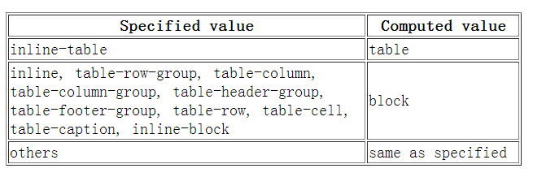

### 1 css sprite 是什么,有什么优缺点

- 概念：将多个小图片拼接到一个图片中。通过`background-position`和元素尺寸调节需要显示的背景图案。
- 优点：

  - 减少`HTTP`请求数，极大地提高页面加载速度
  - 增加图片信息重复度，提高压缩比，减少图片大小
  - 更换风格方便，只需在一张或几张图片上修改颜色或样式即可实现

- 缺点：

  - 图片合并麻烦
  - 维护麻烦，修改一个图片可能需要从新布局整个图片，样式

### 2 `display: none;`与`visibility: hidden;`的区别

- 联系：它们都能让元素不可见
- 区别：

  - `display:none`;会让元素完全从渲染树中消失，渲染的时候不占据任何空间；`visibility: hidden`;不会让元素从渲染树消失，渲染师元素继续占据空间，只是内容不可见
  - `display: none`;是非继承属性，子孙节点消失由于元素从渲染树消失造成，通过修改子孙节点属性无法显示`；visibility: hidden;`是继承属性，子孙节点消失由于继承了`hidden`，通过设置`visibility: visible;`可以让子孙节点显式
  - 修改常规流中元素的`display`通常会造成文档重排。修改`visibility`属性只会造成本元素的重绘。
  - 读屏器不会读取`display: none`;元素内容；会读取`visibility: hidden;`元素内容

### 3 `link`与`@import`的区别

1.  `link`是`HTML`方式， `@import`是 CSS 方式
2.  `link`最大限度支持并行下载，`@import`过多嵌套导致串行下载，出现`FOUC`(文档样式短暂失效)
3.  `link`可以通过`rel="alternate stylesheet"`指定候选样式
4.  浏览器对`link`支持早于`@import`，可以使用`@import`对老浏览器隐藏样式
5.  `@import`必须在样式规则之前，可以在 css 文件中引用其他文件
6.  总体来说：`link`优于`@import`

### 4 什么是 FOUC?如何避免

- `Flash Of Unstyled Content`：用户定义样式表加载之前浏览器使用默认样式显示文档，用户样式加载渲染之后再从新显示文档，造成页面闪烁。
- **解决方法**：把样式表放到文档的`<head>`

### 5 如何创建块级格式化上下文(block formatting context),BFC 有什么用

> BFC(Block Formatting Context)，块级格式化上下文，是一个独立的渲染区域，让处于 BFC 内部的元素与外部的元素相互隔离，使内外元素的定位不会相互影响

**触发条件 (以下任意一条)**

- `float`的值不为`none`
- `overflow`的值不为`visible`
- `display`的值为`table-cell`、`tabble-caption`和`inline-block`之一
- `position`的值不为`static`或则`releative`中的任何一个

> 在`IE`下, `Layout`,可通过`zoom:1` 触发

**.BFC 布局与普通文档流布局区别 普通文档流布局:**

- 浮动的元素是不会被父级计算高度
- 非浮动元素会覆盖浮动元素的位置
- `margin`会传递给父级元素
- 两个相邻元素上下的`margin`会重叠

**BFC 布局规则:**

- 浮动的元素会被父级计算高度(父级元素触发了`BFC`)
- 非浮动元素不会覆盖浮动元素的位置(非浮动元素触发了`BFC`)
- `margin`不会传递给父级(父级触发`BFC`)
- 属于同一个`BFC`的两个相邻元素上下`margin`会重叠

**开发中的应用**

- 阻止`margin`重叠
- 可以包含浮动元素 —— 清除内部浮动(清除浮动的原理是两个 `div`都位于同一个 `BFC` 区域之中)
- 自适应两栏布局
- 可以阻止元素被浮动元素覆盖

### 6 display、float、position 的关系

- 如果`display`取值为`none`，那么`position`和`float`都不起作用，这种情况下元素不产生框
- 否则，如果`position`取值为`absolute`或者`fixed`，框就是绝对定位的，`float`的计算值为`none`，`display`根据下面的表格进行调整。

- 否则，如果`float`不是`none`，框是浮动的，`display`根据下表进行调整
- 否则，如果元素是根元素，`display`根据下表进行调整
- 其他情况下`display`的值为指定值
- 总结起来：**绝对定位、浮动、根元素都需要调整`display`**

### 7 清除浮动的几种方式，各自的优缺点

- 父级`div`定义`height`
- 结尾处加空`div`标签`clear:both`
- 父级`div`定义伪类`:after`和`zoom`
- 父级`div`定义`overflow:hidden`
- 父级`div`也浮动，需要定义宽度
- 结尾处加`br`标签`clear:both`
- 比较好的是第 3 种方式，好多网站都这么用

### 8 为什么要初始化 CSS 样式?

- 因为浏览器的兼容问题，不同浏览器对有些标签的默认值是不同的，如果没对`CSS`初始化往往会出现浏览器之间的页面显示差异。
- 当然，初始化样式会对`SEO`有一定的影响，但鱼和熊掌不可兼得，但力求影响最小的情况下初始化

### 9 css3 有哪些新特性

- 新增选择器 `p:nth-child(n){color: rgba(255, 0, 0, 0.75)}`
- 弹性盒模型 `display: flex;`
- 多列布局 `column-count: 5;`
- 媒体查询 `@media (max-width: 480px) {.box: {column-count: 1;}}`
- 个性化字体 `@font-face{font-family: BorderWeb; src:url(BORDERW0.eot);}`
- 颜色透明度 `color: rgba(255, 0, 0, 0.75);`
- 圆角 `border-radius: 5px;`
- 渐变 `background:linear-gradient(red, green, blue);`
- 阴影 `box-shadow:3px 3px 3px rgba(0, 64, 128, 0.3);`
- 倒影 `box-reflect: below 2px;`
- 文字装饰 `text-stroke-color: red;`
- 文字溢出 `text-overflow:ellipsis;`
- 背景效果 `background-size: 100px 100px;`
- 边框效果 `border-image:url(bt_blue.png) 0 10;`
- 转换

  - 旋转 `transform: rotate(20deg);`
  - 倾斜 `transform: skew(150deg, -10deg);`
  - 位移 `transform: translate(20px, 20px);`
  - 缩放 `transform: scale(.5);`

- 平滑过渡 `transition: all .3s ease-in .1s;`
- 动画 `@keyframes anim-1 {50% {border-radius: 50%;}} animation: anim-1 1s;`

**CSS3 新增伪类有那些？**

- `p:first-of-type` 选择属于其父元素的首个`
`元素的每个`
` 元素。
- `p:last-of-type` 选择属于其父元素的最后 `
` 元素的每个`
` 元素。
- `p:only-of-type` 选择属于其父元素唯一的 `
`元素的每个 `
` 元素。
- `p:only-child` 选择属于其父元素的唯一子元素的每个 `
` 元素。
- `p:nth-child(2)` 选择属于其父元素的第二个子元素的每个 `
` 元素。
- `:after` 在元素之前添加内容,也可以用来做清除浮动。
- `:before` 在元素之后添加内容。
- `:enabled` 已启用的表单元素。
- `:disabled` 已禁用的表单元素。
- `:checked` 单选框或复选框被选中。

### 10 display 有哪些值？说明他们的作用

- `block` 转换成块状元素。
- `inline` 转换成行内元素。
- `none` 设置元素不可见。
- `inline-block` 象行内元素一样显示，但其内容象块类型元素一样显示。
- `list-item` 象块类型元素一样显示，并添加样式列表标记。
- `table` 此元素会作为块级表格来显示
- `inherit` 规定应该从父元素继承 `display` 属性的值

### 11 介绍一下标准的 CSS 的盒子模型？低版本 IE 的盒子模型有什么不同的？

> - 有两种， `IE`盒子模型、`W3C`盒子模型；
> - 盒模型： 内容(content)、填充(`padding`)、边界(`margin`)、 边框(`border`)；
> - 区 别： `IE`的 c`ontent`部分把 `border` 和 `padding`计算了进去;

- 盒子模型构成：内容(`content`)、内填充(`padding`)、 边框(`border`)、外边距(`margin`)
- `IE8`及其以下版本浏览器，未声明 `DOCTYPE`，内容宽高会包含内填充和边框，称为怪异盒模型(`IE`盒模型)
- 标准(`W3C`)盒模型：元素宽度 = `width + padding + border + margin`
- 怪异(`IE`)盒模型：元素宽度 = `width + margin`
- 标准浏览器通过设置 css3 的 `box-sizing: border-box` 属性，触发“怪异模式”解析计算宽高

**box-sizing 常用的属性有哪些？分别有什么作用**

- `box-sizing: content-box;` 默认的标准(W3C)盒模型元素效果
- `box-sizing: border-box;` 触发怪异(IE)盒模型元素的效果
- `box-sizing: inherit;` 继承父元素 `box-sizing` 属性的值

### 12 CSS 优先级算法如何计算？

- 优先级就近原则，同权重情况下样式定义最近者为准
- 载入样式以最后载入的定位为准
- 优先级为: `!important > id > class > tag`; `!important` 比 内联优先级高

### 13 对 BFC 规范的理解？

- 一个页面是由很多个 `Box` 组成的,元素的类型和 `d`isplay\` 属性,决定了这个 Box 的类型
- 不同类型的 `Box`,会参与不同的 `Formatting Context`（决定如何渲染文档的容器）,因此 Box 内的元素会以不同的方式渲染,也就是说 BFC 内部的元素和外部的元素不会互相影响

### 14 谈谈浮动和清除浮动

- 浮动的框可以向左或向右移动，直到他的外边缘碰到包含框或另一个浮动框的边框为止。由于浮动框不在文档的普通流中，所以文档的普通流的块框表现得就像浮动框不存在一样。浮动的块框会漂浮在文档普通流的块框上

### 15 position 的值， relative 和 absolute 定位原点是

- `absolute`：生成绝对定位的元素，相对于 `static` 定位以外的第一个父元素进行定位
- `fixed`：生成绝对定位的元素，相对于浏览器窗口进行定位
- `relative`：生成相对定位的元素，相对于其正常位置进行定位
- `static` 默认值。没有定位，元素出现在正常的流中
- `inherit` 规定从父元素继承 `position` 属性的值

### 16 display:inline-block 什么时候不会显示间隙？(携程)

- 移除空格
- 使用`margin`负值
- 使用`font-size:0`
- `letter-spacing`
- `word-spacing`

### 17 PNG\\GIF\\JPG 的区别及如何选

- `GIF`

  - `8`位像素，`256`色
  - 无损压缩
  - 支持简单动画
  - 支持`boolean`透明
  - 适合简单动画

- `JPEG`

  - 颜色限于`256`
  - 有损压缩
  - 可控制压缩质量
  - 不支持透明
  - 适合照片

- `PNG`

  - 有`PNG8`和`truecolor PNG`
  - `PNG8`类似`GIF`颜色上限为`256`，文件小，支持`alpha`透明度，无动画
  - 适合图标、背景、按钮

### 18 行内元素 float:left 后是否变为块级元素？

> 行内元素设置成浮动之后变得更加像是`inline-block`（行内块级元素，设置成这个属性的元素会同时拥有行内和块级的特性，最明显的不同是它的默认宽度不是`100%`），这时候给行内元素设置`padding-top`和`padding-bottom`或者`width`、`height`都是有效果的

### 19 在网页中的应该使用奇数还是偶数的字体？为什么呢？

- 偶数字号相对更容易和 web 设计的其他部分构成比例关系

### 20 ::before 和 :after 中双冒号和单冒号 有什么区别？解释一下这 2 个伪元素的作用

- 单冒号(`:`)用于`CSS3`伪类，双冒号(`::`)用于`CSS3`伪元素
- 用于区分伪类和伪元素

### 21 如果需要手动写动画，你认为最小时间间隔是多久，为什么？（阿里）

- 多数显示器默认频率是`60Hz`，即`1`秒刷新`60`次，所以理论上最小间隔为`1/60*1000ms ＝ 16.7ms`

### 22 CSS 合并方法

- 避免使用`@import`引入多个`css`文件，可以使用`CSS`工具将`CSS`合并为一个`CSS`文件，例如使用`Sass\Compass`等

### 23 CSS 不同选择器的权重(CSS 层叠的规则)

- `！important`规则最重要，大于其它规则
- 行内样式规则，加`1000`
- 对于选择器中给定的各个`ID`属性值，加`100`
- 对于选择器中给定的各个类属性、属性选择器或者伪类选择器，加`10`
- 对于选择其中给定的各个元素标签选择器，加 1
- 如果权值一样，则按照样式规则的先后顺序来应用，顺序靠后的覆盖靠前的规则

> 以下是权重的规则：标签的权重为 1，class 的权重为 10，id 的权重为 100，以下/// 例子是演示各种定义的权重值：

    /*权重为1*/
    div{
    }
    /*权重为10*/
    .class1{
    }
    /*权重为100*/
    #id1{
    }
    /*权重为100+1=101*/
    #id1 div{
    }
    /*权重为10+1=11*/
    .class1 div{
    }
    /*权重为10+10+1=21*/
    .class1 .class2 div{
    }

> 如果权重相同，则最后定义的样式会起作用，但是应该避免这种情况出现

### 24 列出你所知道可以改变页面布局的属性

- `position`、`display`、`float`、`width`、`height`、`margin`、`padding`、`top`、`left`、`right`、\`

### 25 CSS 在性能优化方面的实践

- `css`压缩与合并、`Gzip`压缩
- `css`文件放在`head`里、不要用`@import`
- 尽量用缩写、避免用滤镜、合理使用选择器

### 26 CSS3 动画（简单动画的实现，如旋转等）

- 依靠`CSS3`中提出的三个属性：`transition`、`transform`、`animation`
- `transition`：定义了元素在变化过程中是怎么样的，包含`transition-property`、`transition-duration`、`transition-timing-function`、`transition-delay`。
- `transform`：定义元素的变化结果，包含`rotate`、`scale`、`skew`、`translate`。
- `animation`：动画定义了动作的每一帧（`@keyframes`）有什么效果，包括`animation-name`，`animation-duration`、`animation-timing-function`、`animation-delay`、`animation-iteration-count`、`animation-direction`

### 27 base64 的原理及优缺点

- 优点可以加密，减少了`HTTTP`请求
- 缺点是需要消耗`CPU`进行编解码

### 28 几种常见的 CSS 布局

#### 流体布局

    .left {
    		float: left;
    		width: 100px;
    		height: 200px;
    		background: red;
    	}
    	.right {
    		float: right;
    		width: 200px;
    		height: 200px;
    		background: blue;
    	}
    	.main {
    		margin-left: 120px;
    		margin-right: 220px;
    		height: 200px;
    		background: green;
    	}

    

        

        

        

    

#### 圣杯布局

- 要求：三列布局；中间主体内容前置，且宽度自适应；两边内容定宽

  - 好处：重要的内容放在文档流前面可以优先渲染
  - 原理：利用相对定位、浮动、负边距布局，而不添加额外标签

  .container {
  padding-left: 150px;
  padding-right: 190px;
  }
  .main {
  float: left;
  width: 100%;
  }
  .left {
  float: left;
  width: 190px;
  margin-left: -100%;
  position: relative;
  left: -150px;
  }
  .right {
  float: left;
  width: 190px;
  margin-left: -190px;
  position: relative;
  right: -190px;
  }

  

  	

  	

  	

  

#### 双飞翼布局

- 双飞翼布局：对圣杯布局（使用相对定位，对以后布局有局限性）的改进，消除相对定位布局

- 原理：主体元素上设置左右边距，预留两翼位置。左右两栏使用浮动和负边距归位，消除相对定位。

  .container {
  /_padding-left:150px;_/
  /_padding-right:190px;_/
  }
  .main-wrap {
  width: 100%;
  float: left;
  }
  .main {
  margin-left: 150px;
  margin-right: 190px;
  }
  .left {
  float: left;
  width: 150px;
  margin-left: -100%;
  /_position: relative;_/
  /_left:-150px;_/
  }
  .right {
  float: left;
  width: 190px;
  margin-left: -190px;
  /_position:relative;_/
  /_right:-190px;_/
  }

  

      

  

  

  

### 29 stylus/sass/less 区别

- 均具有“变量”、“混合”、“嵌套”、“继承”、“颜色混合”五大基本特性
- `Scss`和`LESS`语法较为严谨，`LESS`要求一定要使用大括号“\{\}”，`Scss`和`Stylus`可以通过缩进表示层次与嵌套关系
- `Scss`无全局变量的概念，`LESS`和`Stylus`有类似于其它语言的作用域概念
- `Sass`是基于`Ruby`语言的，而`LESS`和`Stylus`可以基于`NodeJS` `NPM`下载相应库后进行编译；

### 30 postcss 的作用

- 可以直观的理解为：它就是一个平台。为什么说它是一个平台呢？因为我们直接用它，感觉不能干什么事情，但是如果让一些插件在它上面跑，那么将会很强大
- `PostCSS` 提供了一个解析器，它能够将 `CSS` 解析成抽象语法树
- 通过在 `PostCSS` 这个平台上，我们能够开发一些插件，来处理我们的`CSS`，比如热门的：`autoprefixer`
- `postcss`可以对 sass 处理过后的`css`再处理 最常见的就是`autoprefixer`

### 31 css 样式（选择器）的优先级

- 计算权重确定
- `!important`
- 内联样式
- 后写的优先级高

### 32 自定义字体的使用场景

- 宣传/品牌/`banner`等固定文案
- 字体图标

### 33 如何美化 CheckBox

- `<label>` 属性 `for` 和 `id`
- 隐藏原生的 `<input>`
- `:checked + <label>`

### 34 伪类和伪元素的区别

- 伪类表状态
- 伪元素是真的有元素
- 前者单冒号，后者双冒号

### 35 `base64`的使用

- 用于减少 `HTTP` 请求
- 适用于小图片
- `base64`的体积约为原图的`4/3`

### 36 自适应布局

思路：

- 左侧浮动或者绝对定位，然后右侧`margin`撑开
- 使用`
`包含，然后靠负`margin`形成`bfc`
- 使用`flex`

### 37 请用 CSS 写一个简单的幻灯片效果页面

> 知道是要用`CSS3`。使用`animation`动画实现一个简单的幻灯片效果

    /**css**/
    .ani{
      width:480px;
      height:320px;
      margin:50px auto;
      overflow: hidden;
      box-shadow:0 0 5px rgba(0,0,0,1);
      background-size: cover;
      background-position: center;
      -webkit-animation-name: "loops";
      -webkit-animation-duration: 20s;
      -webkit-animation-iteration-count: infinite;
    }
    @-webkit-keyframes "loops" {
        0% {
            background:url(http://d.hiphotos.baidu.com/image/w%3D400/sign=c01e6adca964034f0fcdc3069fc27980/e824b899a9014c08e5e38ca4087b02087af4f4d3.jpg) no-repeat;
        }
        25% {
            background:url(http://b.hiphotos.baidu.com/image/w%3D400/sign=edee1572e9f81a4c2632edc9e72b6029/30adcbef76094b364d72bceba1cc7cd98c109dd0.jpg) no-repeat;
        }
        50% {
            background:url(http://b.hiphotos.baidu.com/image/w%3D400/sign=937dace2552c11dfded1be2353266255/d8f9d72a6059252d258e7605369b033b5bb5b912.jpg) no-repeat;
        }
        75% {
            background:url(http://g.hiphotos.baidu.com/image/w%3D400/sign=7d37500b8544ebf86d71653fe9f9d736/0df431adcbef76095d61f0972cdda3cc7cd99e4b.jpg) no-repeat;
        }
        100% {
            background:url(http://c.hiphotos.baidu.com/image/w%3D400/sign=cfb239ceb0fb43161a1f7b7a10a54642/3b87e950352ac65ce2e73f76f9f2b21192138ad1.jpg) no-repeat;
        }
    }

### 38 什么是外边距重叠？重叠的结果是什么？

> 外边距重叠就是 margin-collapse

- 在 CSS 当中，相邻的两个盒子（可能是兄弟关系也可能是祖先关系）的外边距可以结合成一个单独的外边距。这种合并外边距的方式被称为折叠，并且因而所结合成的外边距称为折叠外边距。

**折叠结果遵循下列计算规则**：

- 两个相邻的外边距都是正数时，折叠结果是它们两者之间较大的值。
- 两个相邻的外边距都是负数时，折叠结果是两者绝对值的较大值。
- 两个外边距一正一负时，折叠结果是两者的相加的和。

### 39 rgba()和 opacity 的透明效果有什么不同？

- `rgba()`和`opacity`都能实现透明效果，但最大的不同是`opacity`作用于元素，以及元素内的所有内容的透明度，
- 而`rgba()`只作用于元素的颜色或其背景色。（设置`rgba`透明的元素的子元素不会继承透明效果！）

### 40 css 中可以让文字在垂直和水平方向上重叠的两个属性是什么？

- 垂直方向：`line-height`
- 水平方向：`letter-spacing`

### 41 如何垂直居中一个浮动元素？

    /**方法一：已知元素的高宽**/

    #div1{
      background-color:#6699FF;
      width:200px;
      height:200px;
      position: absolute;        //父元素需要相对定位
      top: 50%;
      left: 50%;
      margin-top:-100px ;   //二分之一的height，width
      margin-left: -100px;
    }

    /**方法二:**/

    #div1{
      width: 200px;
      height: 200px;
      background-color: #6699FF;
      margin:auto;
      position: absolute;        //父元素需要相对定位
      left: 0;
      top: 0;
      right: 0;
      bottom: 0;
    }

**如何垂直居中一个``?（用更简便的方法。）**

    #container     /**的容器设置如下**/
    {
        display:table-cell;
        text-align:center;
        vertical-align:middle;
    }

### 42 px 和 em 的区别

- `px`和`em`都是长度单位，区别是，`px`的值是固定的，指定是多少就是多少，计算比较容易。`em`得值不是固定的，并且`em`会继承父级元素的字体大小。
- 浏览器的默认字体高都是`16px`。所以未经调整的浏览器都符合: `1em=16px`。那么`12px=0.75em`, `10px=0.625em`。

> - px 相对于显示器屏幕分辨率，无法用浏览器字体放大功能
> - em 值并不是固定的，会继承父级的字体大小： em = 像素值 / 父级 font-size

### 43 Sass、LESS 是什么？大家为什么要使用他们？

- 他们是`CSS`预处理器。他是`CSS`上的一种抽象层。他们是一种特殊的语法/语言编译成`CSS`。
- 例如 Less 是一种动态样式语言. 将 CSS 赋予了动态语言的特性，如变量，继承，运算， 函数. `LESS` 既可以在客户端上运行 (支持`IE 6+`, `Webkit`, `Firefox`)，也可一在服务端运行 (借助 `Node.js`)

**为什么要使用它们？**

- 结构清晰，便于扩展。
- 可以方便地屏蔽浏览器私有语法差异。这个不用多说，封装对- 浏览器语法差异的重复处理，减少无意义的机械劳动。
- 可以轻松实现多重继承。
- 完全兼容 CSS 代码，可以方便地应用到老项目中。LESS 只- 是在 CSS 语法上做了扩展，所以老的 CSS 代码也可以与 LESS 代码一同编译

### 44 知道 css 有个 content 属性吗？有什么作用？有什么应用？

> css 的`content`属性专门应用在 `before/after`伪元素上，用于来插入生成内容。最常见的应用是利用伪类清除浮动。

    /**一种常见利用伪类清除浮动的代码**/
    .clearfix:after {
        content:".";       //这里利用到了content属性
        display:block;
        height:0;
        visibility:hidden;
        clear:both;
     }
    .clearfix {
        *zoom:1;
    }

### 45 水平居中的方法

- 元素为行内元素，设置父元素`text-align:center`
- 如果元素宽度固定，可以设置左右`margin`为`auto`;
- 绝对定位和移动: `absolute + transform`
- 使用`flex-box`布局，指定`justify-content`属性为 center
- `display`设置为`tabel-ceil`

### 46 垂直居中的方法

- 将显示方式设置为表格，`display:table-cell`,同时设置`vertial-align：middle`

- 使用`flex`布局，设置为`align-item：center`

- 绝对定位中设置`bottom:0,top:0`,并设置`margin:auto`

- 绝对定位中固定高度时设置`top:50%，margin-top`值为高度一半的负值

- 文本垂直居中设置`line-height`为`height`值

- 如果是单行文本, line-height 设置成和 height 值

  .vertical {
  height: 100px;
  line-height: 100px;
  }

- 已知高度的块级子元素，采用绝对定位和负边距

  .container {
  position: relative;
  }
  .vertical {
  height: 300px; /_子元素高度_/
  position: absolute;
  top:50%; /_父元素高度 50%_/
  margin-top: -150px; /_自身高度一半_/
  }

- 未知高度的块级父子元素居中，模拟表格布局

- 缺点：IE67 不兼容，父级 overflow：hidden 失效

  .container {
  display: table;
  }
  .content {
  display: table-cell;
  vertical-align: middle;
  }

- 新增 inline-block 兄弟元素，设置 vertical-align

  - 缺点：需要增加额外标签，IE67 不兼容

  .container {
  height: 100%;/_定义父级高度，作为参考_/
  }
  .extra .vertical{
  display: inline-block; /_行内块显示_/
  vertical-align: middle; /_垂直居中_/
  }
  .extra {
  height: 100%; /_设置新增元素高度为 100%_/
  }

- 绝对定位配合 CSS3 位移

  .vertical {
  position: absolute;
  top:50%; /_父元素高度 50%_/
  transform:translateY(-50%, -50%);
  }

- CSS3 弹性盒模型

  .container {
  display:flex;
  justify-content: center; /_子元素水平居中_/
  align-items: center; /_子元素垂直居中_/
  }

### 47 如何使用 CSS 实现硬件加速？

> 硬件加速是指通过创建独立的复合图层，让 GPU 来渲染这个图层，从而提高性能，

- 一般触发硬件加速的`CSS`属性有`transform`、`opacity`、`filter`，为了避免 2D 动画在 开始和结束的时候的`repaint`操作，一般使用`tranform:translateZ(0)`

### 48 重绘和回流（重排）是什么，如何避免？

- 重绘：当渲染树中的元素外观（如：颜色）发生改变，不影响布局时，产生重绘
- 回流：当渲染树中的元素的布局（如：尺寸、位置、隐藏/状态状态）发生改变时，产生重绘回流
- 注意：JS 获取 Layout 属性值（如：`offsetLeft`、`scrollTop`、`getComputedStyle`等）也会引起回流。因为浏览器需要通过回流计算最新值
- 回流必将引起重绘，而重绘不一定会引起回流

**如何最小化重绘(repaint)和回流(reflow)**：

- 需要要对元素进行复杂的操作时，可以先隐藏(`display:"none"`)，操作完成后再显示
- 需要创建多个`DOM`节点时，使用`DocumentFragment`创建完后一次性的加入`document`
- 缓存`Layout`属性值，如：`var left = elem.offsetLeft;` 这样，多次使用 `left` 只产生一次回流
- 尽量避免用`table`布局（`table`元素一旦触发回流就会导致 table 里所有的其它元素回流）
- 避免使用`css`表达式(`expression`)，因为每次调用都会重新计算值（包括加载页面）
- 尽量使用 `css` 属性简写，如：用 `border` 代替 `border-width`, `border-style`, `border-color`
- 批量修改元素样式：`elem.className` 和 `elem.style.cssText` 代替 `elem.style.xxx`

### 49 说一说 css3 的 animation

- css3 的`animation`是 css3 新增的动画属性，这个 css3 动画的每一帧是通过`@keyframes`来声明的，`keyframes`声明了动画的名称，通过`from`、`to`或者是百分比来定义
- 每一帧动画元素的状态，通过`animation-name`来引用这个动画，同时 css3 动画也可以定义动画运行的时长、动画开始时间、动画播放方向、动画循环次数、动画播放的方式，
- 这些相关的动画子属性有：`animation-name`定义动画名、`animation-duration`定义动画播放的时长、`animation-delay`定义动画延迟播放的时间、`animation-direction`定义 动画的播放方向、`animation-iteration-count`定义播放次数、`animation-fill-mode`定义动画播放之后的状态、`animation-play-state`定义播放状态，如暂停运行等、`animation-timing-function`
- 定义播放的方式，如恒速播放、艰涩播放等。

### 50 左边宽度固定，右边自适应

> 左侧固定宽度，右侧自适应宽度的两列布局实现

html 结构

    

        
固定宽度

        
自适应宽度

    

> 在外层`div`（类名为`outer`）的`div`中，有两个子`div`，类名分别为`left`和`right`，其中`left`为固定宽度，而`right`为自适应宽度

**方法 1：左侧 div 设置成浮动：float: left，右侧 div 宽度会自拉升适应**

    .outer {
        width: 100%;
        height: 500px;
        background-color: yellow;
    }
    .left {
        width: 200px;
        height: 200px;
        background-color: red;
        float: left;
    }
    .right {
        height: 200px;
        background-color: blue;
    }

**方法 2：对右侧:div 进行绝对定位，然后再设置 right=0，即可以实现宽度自适应**

> 绝对定位元素的第一个高级特性就是其具有自动伸缩的功能，当我们将 `width`设置为 `auto` 的时候（或者不设置，默认为 `auto` ），绝对定位元素会根据其 `left` 和 `right` 自动伸缩其大小

    .outer {
        width: 100%;
        height: 500px;
        background-color: yellow;
        position: relative;
    }
    .left {
        width: 200px;
        height: 200px;
        background-color: red;
    }
    .right {
        height: 200px;
        background-color: blue;
        position: absolute;
        left: 200px;
        top:0;
        right: 0;
    }

**方法 3：将左侧`div`进行绝对定位，然后右侧`div`设置`margin-left: 200px`**

    .outer {
        width: 100%;
        height: 500px;
        background-color: yellow;
        position: relative;
    }
    .left {
        width: 200px;
        height: 200px;
        background-color: red;
        position: absolute;
    }
    .right {
        height: 200px;
        background-color: blue;
        margin-left: 200px;
    }

**方法 4：使用 flex 布局**

    .outer {
        width: 100%;
        height: 500px;
        background-color: yellow;
        display: flex;
        flex-direction: row;
    }
    .left {
        width: 200px;
        height: 200px;
        background-color: red;
    }
    .right {
        height: 200px;
        background-color: blue;
        flex: 1;
    }

### 51 两种以上方式实现已知或者未知宽度的垂直水平居中

    /** 1 **/
    .wraper {
      position: relative;
      .box {
        position: absolute;
        top: 50%;
        left: 50%;
        width: 100px;
        height: 100px;
        margin: -50px 0 0 -50px;
      }
    }

    /** 2 **/
    .wraper {
      position: relative;
      .box {
        position: absolute;
        top: 50%;
        left: 50%;
        transform: translate(-50%, -50%);
      }
    }

    /** 3 **/
    .wraper {
      .box {
        display: flex;
        justify-content:center;
        align-items: center;
        height: 100px;
      }
    }

    /** 4 **/
    .wraper {
      display: table;
      .box {
        display: table-cell;
        vertical-align: middle;
      }
    }

### 52 如何实现小于 12px 的字体效果

> `transform:scale()`这个属性只可以缩放可以定义宽高的元素，而行内元素是没有宽高的，我们可以加上一个`display:inline-block`;

    transform: scale(0.7);

`css`的属性，可以缩放大小

### 53 css hack 原理及常用 hack

- 原理：利用不同浏览器对 CSS 的支持和解析结果不一样编写针对特定浏览器样式。
- 常见的 hack 有

  - 属性 hack
  - 选择器 hack
  - IE 条件注释

### 54 CSS 有哪些继承属性

- 关于文字排版的属性如：

  - `font`

    - `word-break`
    - `letter-spacing`
    - `text-align`
    - `text-rendering`
    - `word-spacing`
    - `white-space`
    - `text-indent`
    - `text-transform`
    - `text-shadow`

  - `line-height`
  - `color`
  - `visibility`
  - `cursor`

### 55 外边距折叠(collapsing margins)

- 毗邻的两个或多个 `margin` 会合并成一个`margin`，叫做外边距折叠。规则如下：

  - 两个或多个毗邻的普通流中的块元素垂直方向上的`margin`会折叠
  - 浮动元素或`inline-block`元素或绝对定位元素的`margin`不会和垂直方向上的其他元素的 margin 折叠
  - 创建了块级格式化上下文的元素，不会和它的子元素发生 margin 折叠
  - 元素自身的`margin-bottom`和`margin-top`相邻时也会折

### 56 CSS 选择符有哪些？哪些属性可以继承

- id 选择器（ `# myid`）
- 类选择器（`.myclassname`）
- 标签选择器（`div`, `h1`, `p`）
- 相邻选择器（`h1 + p`）
- 子选择器（`ul > li`）
- 后代选择器（`li a`）
- 通配符选择器（ `*` ）
- 属性选择器（`a[rel = "external"]`）
- 伪类选择器（`a:hover, li:nth-child`）

**CSS 哪些属性可以继承？哪些属性不可以继承**

- 可继承的样式： `font-size font-family color, UL LI DL DD DT`
- 不可继承的样式：`border padding margin width height`

### 57 CSS3 新增伪类有那些

- `:root` 选择文档的根元素，等同于 html 元素
- `:empty` 选择没有子元素的元素
- `:target` 选取当前活动的目标元素
- `:not(selector)` 选择除 `selector` 元素意外的元素
- `:enabled` 选择可用的表单元素
- `:disabled` 选择禁用的表单元素
- `:checked` 选择被选中的表单元素
- `:after` 在元素内部最前添加内容
- `:before` 在元素内部最后添加内容
- `:nth-child(n)` 匹配父元素下指定子元素，在所有子元素中排序第 n
- `:nth-last-child(n)` 匹配父元素下指定子元素，在所有子元素中排序第 n，从后向前数
- `:nth-child(odd)`
- `:nth-child(even)`
- `:nth-child(3n+1)`
- `:first-child`
- `:last-child`
- `:only-child`
- `:nth-of-type(n)` 匹配父元素下指定子元素，在同类子元素中排序第 n
- `:nth-last-of-type(n)` 匹配父元素下指定子元素，在同类子元素中排序第 n，从后向前数
- `:nth-of-type(odd)`
- `:nth-of-type(even)`
- `:nth-of-type(3n+1)`
- `:first-of-type`
- `:last-of-type`
- `:only-of-type`
- `::selection` 选择被用户选取的元素部分
- `:first-line` 选择元素中的第一行
- `:first-letter` 选择元素中的第一个字符

### 58 如何居中 div？如何居中一个浮动元素？如何让绝对定位的 div 居中

- 给`div`设置一个宽度，然后添加`margin:0 auto`属性

  div{
  width:200px;
  margin:0 auto;

- 居中一个浮动元素

  /_ 确定容器的宽高 宽 500 高 300 的层 设置层的外边距 _/

  .div {
  width:500px ; height:300px;//高度可以不设
  margin: -150px 0 0 -250px;
  position:relative; //相对定位
  background-color:pink; //方便看效果
  left:50%;
  top:50%;
  }

> 让绝对定位的 div 居中

    position: absolute;
    width: 1200px;
    background: none;
    margin: 0 auto;
    top: 0;
    left: 0;
    bottom: 0;
    right: 0;

### 59 用纯 CSS 创建一个三角形的原理是什么

    /* 把上、左、右三条边隐藏掉（颜色设为 transparent） */
    #demo {
      width: 0;
      height: 0;
      border-width: 20px;
      border-style: solid;
      border-color: transparent transparent red transparent;
    }

### 60 一个满屏 品 字布局 如何设计?

- 简单的方式：

  - 上面的`div`宽`100%`，
  - 下面的两个`div`分别宽`50%`，
  - 然后用`float`或者`inline`使其不换行即可

### 61 li 与 li 之间有看不见的空白间隔是什么原因引起的？有什么解决办法

> 行框的排列会受到中间空白（回车\\空格）等的影响，因为空格也属于字符,这些空白也会被应用样式，占据空间，所以会有间隔，把字符大小设为 0，就没有空格了

### 62 为什么要初始化 CSS 样式

> 因为浏览器的兼容问题，不同浏览器对有些标签的默认值是不同的，如果没对 CSS 初始化往往会出现浏览器之间的页面显示差异

### 63 请列举几种隐藏元素的方法

- `visibility: hidden;` 这个属性只是简单的隐藏某个元素，但是元素占用的空间任然存在
- `opacity: 0;` `CSS3`属性，设置`0`可以使一个元素完全透明
- `position: absolute;` 设置一个很大的 `left` 负值定位，使元素定位在可见区域之外
- `display: none;` 元素会变得不可见，并且不会再占用文档的空间。
- `transform: scale(0);` 将一个元素设置为缩放无限小，元素将不可见，元素原来所在的位置将被保留
- `
` HTML5 属性,效果和`display:none;`相同，但这个属性用于记录一个元素的状态
- `height: 0;` 将元素高度设为 `0` ，并消除边框
- `filter: blur(0);` CSS3 属性，将一个元素的模糊度设置为`0`，从而使这个元素“消失”在页面中

### 64 rgba() 和 opacity 的透明效果有什么不同

- `opacity` 作用于元素以及元素内的所有内容（包括文字）的透明度
- `rgba()` 只作用于元素自身的颜色或其背景色，子元素不会继承透明效果

### 65 css 属性 content 有什么作用

- content 属性专门应用在 before/after 伪元素上，用于插入额外内容或样式

### 66 请解释一下 CSS3 的 Flexbox（弹性盒布局模型）以及适用场景

> 1Flexbox1 用于不同尺寸屏幕中创建可自动扩展和收缩布局

### 67 经常遇到的浏览器的 JS 兼容性有哪些？解决方法是什么

- 当前样式：`getComputedStyle(el, null) VS el.currentStyle`
- 事件对象：`e VS window.event`
- 鼠标坐标：`e.pageX, e.pageY VS window.event.x, window.event.y`
- 按键码：`e.which VS event.keyCode`
- 文本节点：`el.textContent VS el.innerText`

### 68 请写出多种等高布局

- 在列的父元素上使用这个背景图进行 Y 轴的铺放，从而实现一种等高列的假像
- 模仿表格布局等高列效果：兼容性不好，在 ie6-7 无法正常运行
- css3 flexbox 布局： .container\{display: flex; align-items: stretch;\}

### 69 浮动元素引起的问题

- 父元素的高度无法被撑开，影响与父元素同级的元素
- 与浮动元素同级的非浮动元素会跟随其后

### 70 CSS 优化、提高性能的方法有哪些

- 多个`css`合并，尽量减少`HTTP`请求
- 将`css`文件放在页面最上面
- 移除空的`css`规则
- 避免使用`CSS`表达式
- 选择器优化嵌套，尽量避免层级过深
- 充分利用`css`继承属性，减少代码量
- 抽象提取公共样式，减少代码量
- 属性值为`0`时，不加单位
- 属性值为小于`1`的小数时，省略小数点前面的 0
- `css`雪碧图

### 71 浏览器是怎样解析 CSS 选择器的

- 浏览器解析 CSS 选择器的方式是从右到左

### 72 在网页中的应该使用奇数还是偶数的字体

- 在网页中的应该使用“偶数”字体：

  - 偶数字号相对更容易和 web 设计的其他部分构成比例关系
  - 使用奇数号字体时文本段落无法对齐
  - 宋体的中文网页排布中使用最多的就是 12 和 14

### 73 margin 和 padding 分别适合什么场景使用

- 需要在`border`外侧添加空白，且空白处不需要背景（色）时，使用 `margin`
- 需要在`border`内测添加空白，且空白处需要背景（色）时，使用 `padding`

### 74 抽离样式模块怎么写，说出思路

- CSS 可以拆分成 2 部分：公共 CSS 和 业务 CSS：

  - 网站的配色，字体，交互提取出为公共 CSS。这部分 CSS 命名不应涉及具体的业务
  - 对于业务 CSS，需要有统一的命名，使用公用的前缀。可以参考面向对象的 CSS

### 75 元素竖向的百分比设定是相对于容器的高度吗

> 元素竖向的百分比设定是相对于容器的宽度，而不是高度

### 76 全屏滚动的原理是什么？ 用到了 CSS 的那些属性

- 原理类似图片轮播原理，超出隐藏部分，滚动时显示
- 可能用到的 CSS 属性：`overflow:hidden; transform:translate(100%, 100%); display:none;`

### 77 什么是响应式设计？响应式设计的基本原理是什么？如何兼容低版本的 IE

- 响应式设计就是网站能够兼容多个终端，而不是为每个终端做一个特定的版本

- 基本原理是利用 CSS3 媒体查询，为不同尺寸的设备适配不同样式

- 对于低版本的 IE，可采用 JS 获取屏幕宽度，然后通过 resize 方法来实现兼容：

  $(window).resize(function () {
  screenRespond();
  });
  screenRespond();
  function screenRespond(){
  var screenWidth = $(window).width();
  if(screenWidth <= 1800){
  $("body").attr("class", "w1800");
  }
  if(screenWidth <= 1400){
  $("body").attr("class", "w1400");
  }
  if(screenWidth > 1800){
  $("body").attr("class", "");
  }
  }

### 78 什么是视差滚动效果，如何给每页做不同的动画

- 视差滚动是指多层背景以不同的速度移动，形成立体的运动效果，具有非常出色的视觉体验
- 一般把网页解剖为：背景层、内容层和悬浮层。当滚动鼠标滚轮时，各图层以不同速度移动，形成视差的
- 实现原理

  - 以 “页面滚动条” 作为 “视差动画进度条”
  - 以 “滚轮刻度” 当作 “动画帧度” 去播放动画的
  - 监听 mousewheel 事件，事件被触发即播放动画，实现“翻页”效果

### 79 a 标签上四个伪类的执行顺序是怎么样的

> `link > visited > hover > active`

- `L-V-H-A` `love hate` 用喜欢和讨厌两个词来方便记忆

### 80 伪元素和伪类的区别和作用

- 伪元素 -- 在内容元素的前后插入额外的元素或样式，但是这些元素实际上并不在文档中生成。

- 它们只在外部显示可见，但不会在文档的源代码中找到它们，因此，称为“伪”元素。例如：

  p::before {content:"第一章：";}
  p::after {content:"Hot!";}
  p::first-line {background:red;}
  p::first-letter {font-size:30px;}

- 伪类 -- 将特殊的效果添加到特定选择器上。它是已有元素上添加类别的，不会产生新的元素。例如：

  a:hover {color: #FF00FF}
  p:first-child {color: red}

### 81 ::before 和 :after 中双冒号和单冒号有什么区别

- 在 CSS 中伪类一直用 `:` 表示，如 `:hover`, `:active` 等
- 伪元素在 CSS1 中已存在，当时语法是用 `:` 表示，如 `:before` 和 `:after`
- 后来在 CSS3 中修订，伪元素用 `::` 表示，如 `::before` 和 `::after`，以此区分伪元素和伪类
- 由于低版本 IE 对双冒号不兼容，开发者为了兼容性各浏览器，继续使使用 :after 这种老语法表示伪元素
- 综上所述：`::before` 是 `CSS3` 中写伪元素的新语法； `:after` 是 `CSS1` 中存在的、兼容 IE 的老语法

### 82 如何修改 Chrome 记住密码后自动填充表单的黄色背景

- 产生原因：由于 Chrome 默认会给自动填充的 input 表单加上 `input:-webkit-autofill` 私有属性造成的
- 解决方案 1：在 form 标签上直接关闭了表单的自动填充：`autocomplete="off"`
- 解决方案 2：`input:-webkit-autofill { background-color: transparent; }`

**input \[type=search\] 搜索框右侧小图标如何美化？**

    input[type="search"]::-webkit-search-cancel-button{
      -webkit-appearance: none;
      height: 15px;
      width: 15px;
      border-radius: 8px;
      background:url("images/searchicon.png") no-repeat 0 0;
      background-size: 15px 15px;
    }

### 83 网站图片文件，如何点击下载？而非点击预览

`<a href="logo.jpg" download>下载</a>` `<a href="logo.jpg" download="网站LOGO" >下载</a>`

### 63 iOS safari 如何阻止“橡皮筋效果”

    $(document).ready(function(){
          var stopScrolling = function(event) {
              event.preventDefault();
          }
          document.addEventListener('touchstart', stopScrolling, false);
          document.addEventListener('touchmove', stopScrolling, false);
      });

### 84 你对 line-height 是如何理解的

- `line-height` 指一行字的高度，包含了字间距，实际上是下一行基线到上一行基线距离
- 如果一个标签没有定义 `height` 属性，那么其最终表现的高度是由 `line-height` 决定的
- 一个容器没有设置高度，那么撑开容器高度的是 `line-height` 而不是容器内的文字内容
- 把 `line-height` 值设置为 `height` 一样大小的值可以实现单行文字的垂直居中
- `line-height` 和 `height` 都能撑开一个高度，`height` 会触发 `haslayout`，而 `line-height` 不会

### 85 line-height 三种赋值方式有何区别？（带单位、纯数字、百分比）

- 带单位：`px` 是固定值，而 `em` 会参考父元素 `font-size` 值计算自身的行高
- 纯数字：会把比例传递给后代。例如，父级行高为 `1.5`，子元素字体为 `18px`，则子元素行高为 `1.5 * 18 = 27px`
- 百分比：将计算后的值传递给后代

### 86 设置元素浮动后，该元素的 display 值会如何变化

> 设置元素浮动后，该元素的 `display` 值自动变成 `block`

### 87 让页面里的字体变清晰，变细用 CSS 怎么做？（IOS 手机浏览器字体齿轮设置）

    -webkit-font-smoothing: antialiased;

### 88 font-style 属性 oblique 是什么意思

> `font-style: oblique;` 使没有 `italic` 属性的文字实现倾斜

### 89 display:inline-block 什么时候会显示间隙

- 相邻的 `inline-block` 元素之间有换行或空格分隔的情况下会产生间距
- 非 `inline-block` 水平元素设置为 `inline-block` 也会有水平间距
- 可以借助 `vertical-align:top;` 消除垂直间隙
- 可以在父级加 `font-size：0;` 在子元素里设置需要的字体大小，消除垂直间隙
- 把 `li` 标签写到同一行可以消除垂直间隙，但代码可读性差

### 90 一个高度自适应的 div，里面有两个 div，一个高度 100px，希望另一个填满剩下的高度

- 方案 1：

  - `.sub { height: calc(100%-100px); }`

- 方案 2：

  - `.container { position:relative; }`
  - `.sub { position: absolute; top: 100px; bottom: 0; }`

- 方案 3：

  - `.container { display:flex; flex-direction:column; }`
  - `.sub { flex:1; }`

### 91 css 的渲染层合成是什么 浏览器如何创建新的渲染层

> 在 DOM 树中每个节点都会对应一个渲染对象（`RenderObject），当它们的渲染对象处于相同的坐标空间（z 轴空间）时，就会形成一个 RenderLayers，也就是渲染层。渲染层将保证页面元素以正确的顺序堆叠，这时候就会出现层合成（`composite\`），从而正确处理透明元素和重叠元素的显示。对于有位置重叠的元素的页面，这个过程尤其重要，因为一旦图层的合并顺序出错，将会导致元素显示异常

**浏览器如何创建新的渲染层**

- 根元素 `document`
- 有明确的定位属性（`relative`、`fixed`、`sticky`、`absolute`）
- `opacity < 1`
- 有 `CSS fliter` 属性
- 有 `CSS mask` 属性
- 有 `CSS mix-blend-mode` 属性且值不为 `normal`
- 有 `CSS transform` 属性且值不为 `none`
- `backface-visibility` 属性为 `hidden`
- 有 `CSS reflection` 属性
- 有 `CSS column-count` 属性且值不为 `auto` 或者有 `CSS column-width` 属性且值不为 `auto`
- 当前有对于 `opacity`、`transform`、`fliter`、`backdrop-filter` 应用动画
- `overflow` 不为 `visible`
