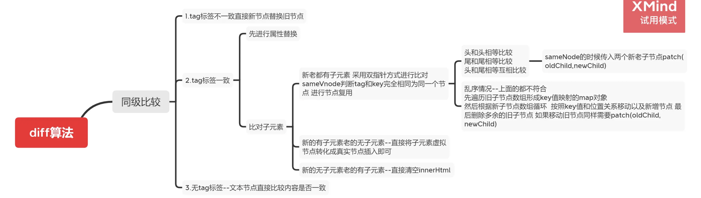

### 1 Vue 响应式原理

整体思路是`数据劫持+观察者模式`

> 对象内部通过 `defineReactive` 方法，使用 `Object.defineProperty` 将属性进行劫持（只会劫持已经存在的属性），数组则是通过重写数组方法来实现。当页面使用对应属性时，每个属性都拥有自己的 `dep` 属性，存放他所依赖的 `watcher`（依赖收集），当属性变化后会通知自己对应的 `watcher` 去更新(派发更新)。

    class Observer {
      // 观测值
      constructor(value) {
        this.walk(value);
      }
      walk(data) {
        // 对象上的所有属性依次进行观测
        let keys = Object.keys(data);
        for (let i = 0; i < keys.length; i++) {
          let key = keys[i];
          let value = data[key];
          defineReactive(data, key, value);
        }
      }
    }
    // Object.defineProperty数据劫持核心 兼容性在ie9以及以上
    function defineReactive(data, key, value) {
      observe(value); // 递归关键
      // --如果value还是一个对象会继续走一遍odefineReactive 层层遍历一直到value不是对象才停止
      // 思考？如果Vue数据嵌套层级过深 >>性能会受影响
      Object.defineProperty(data, key, {
        get() {
          console.log("获取值");

          //需要做依赖收集过程 这里代码没写出来
          return value;
        },
        set(newValue) {
          if (newValue === value) return;
          console.log("设置值");
          //需要做派发更新过程 这里代码没写出来
          value = newValue;
        },
      });
    }
    export function observe(value) {
      // 如果传过来的是对象或者数组 进行属性劫持
      if (
        Object.prototype.toString.call(value) === "[object Object]" ||
        Array.isArray(value)
      ) {
        return new Observer(value);
      }
    }

### 2 Vue nextTick 原理

> `nextTick` 中的回调是在下次 `DOM` 更新循环结束之后执行的延迟回调。在修改数据之后立即使用这个方法，获取更新后的 `DOM`。主要思路就是采用微任务优先的方式调用异步方法去执行 `nextTick` 包装的方法

    let callbacks = [];
    let pending = false;
    function flushCallbacks() {
      pending = false; //把标志还原为false
      // 依次执行回调
      for (let i = 0; i < callbacks.length; i++) {
        callbacks[i]();
      }
    }
    let timerFunc; //定义异步方法 采用优雅降级
    if (typeof Promise !== "undefined") {
      // 如果支持promise
      const p = Promise.resolve();
      timerFunc = () => {
        p.then(flushCallbacks);
      };
    } else if (typeof MutationObserver !== "undefined") {
      // MutationObserver 主要是监听dom变化 也是一个异步方法
      let counter = 1;
      const observer = new MutationObserver(flushCallbacks);
      const textNode = document.createTextNode(String(counter));
      observer.observe(textNode, {
        characterData: true,
      });
      timerFunc = () => {
        counter = (counter + 1) % 2;
        textNode.data = String(counter);
      };
    } else if (typeof setImmediate !== "undefined") {
      // 如果前面都不支持 判断setImmediate
      timerFunc = () => {
        setImmediate(flushCallbacks);
      };
    } else {
      // 最后降级采用setTimeout
      timerFunc = () => {
        setTimeout(flushCallbacks, 0);
      };
    }

    export function nextTick(cb) {
      // 除了渲染watcher 还有用户自己手动调用的nextTick 一起被收集到数组
      callbacks.push(cb);
      if (!pending) {
        // 如果多次调用nextTick 只会执行一次异步 等异步队列清空之后再把标志变为false
        pending = true;
        timerFunc();
      }
    }

### 3 Vue diff 原理

### 4 路由原理 history 和 hash 两种路由方式的特点

**hash 模式**

- `location.hash` 的值实际就是 `URL` 中`#`后面的东西 它的特点在于：`hash` 虽然出现 `URL` 中，但不会被包含在 `HTTP` 请求中，对后端完全没有影响，因此改变 hash 不会重新加载页面

- 可以为 hash 的改变添加监听事件

  window.addEventListener("hashchange", funcRef, false);

- 每一次改变 `hash`（`window.location.hash`），都会在浏览器的访问历史中增加一个记录利用 `hash` 的以上特点，就可以来实现前端路由“更新视图但不重新请求页面”的功能了。

- **特点**：兼容性好但是不美观

**history 模式**

> 利用了 `HTML5 History Interface` 中新增的 `pushState()` 和 `replaceState()` 方法

- 这两个方法应用于浏览器的历史记录站，在当前已有的 `back`、`forward`、`go` 的基础之上，它们提供了对历史记录进行修改的功能。这两个方法有个共同的特点：当调用他们修改浏览器历史记录栈后，虽然当前 `URL` 改变了，但浏览器不会刷新页面，这就为单页应用前端路由“更新视图但不重新请求页面”提供了基础
- **特点**：虽然美观，但是刷新会出现 `404` 需要后端进行配置
