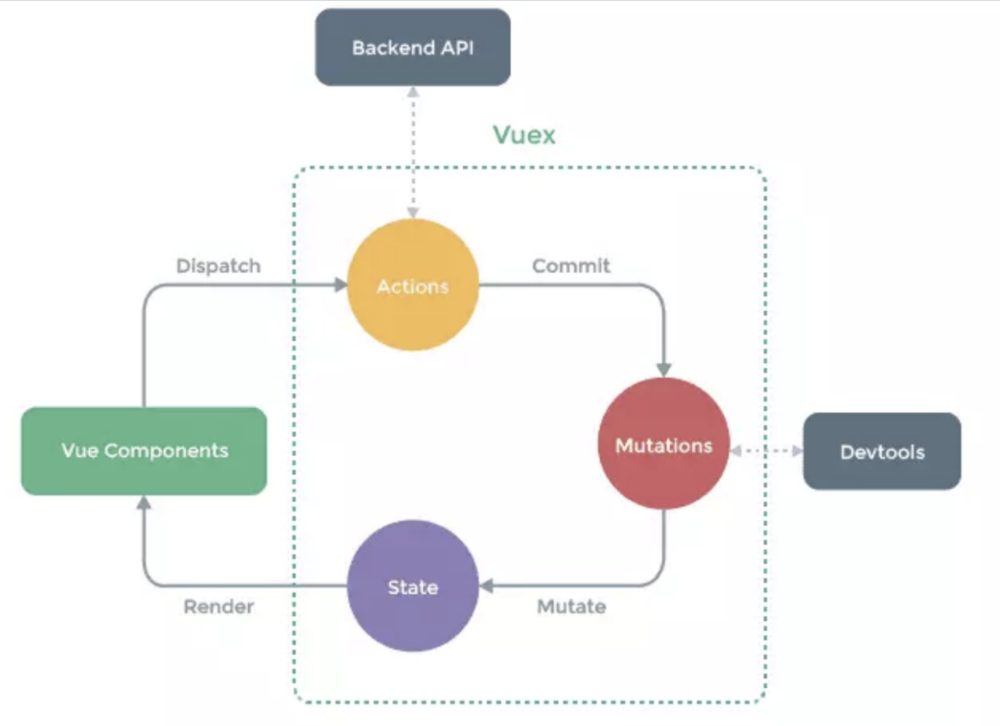
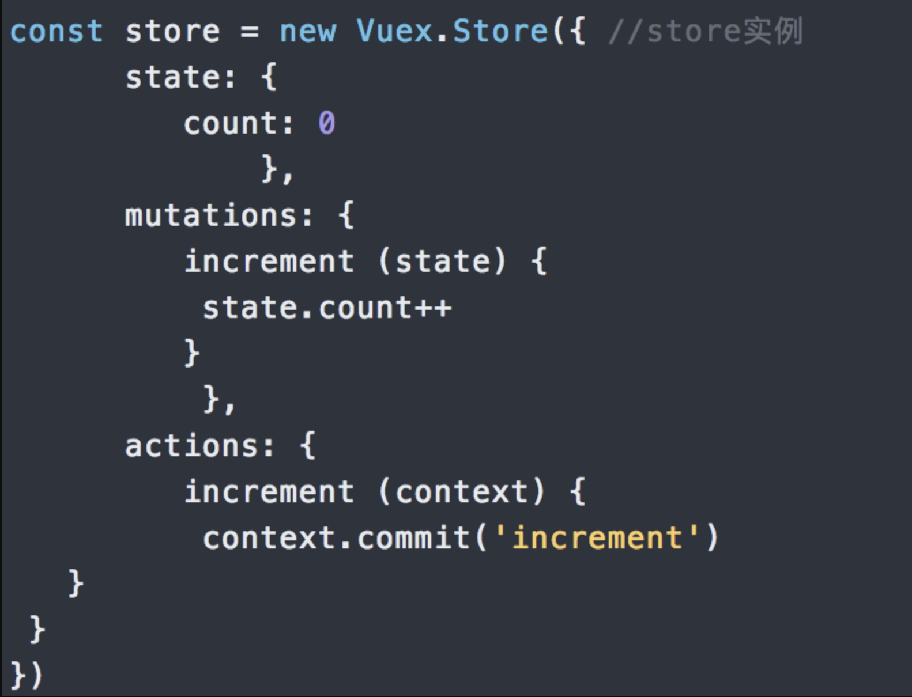
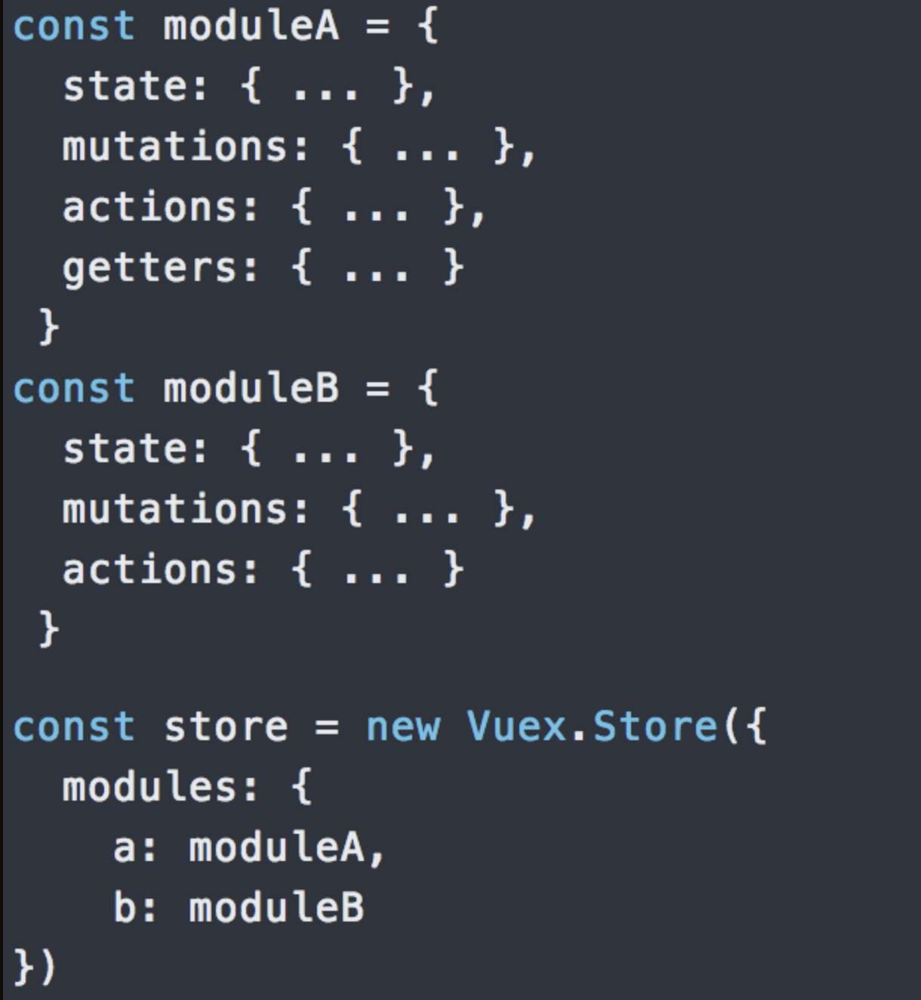
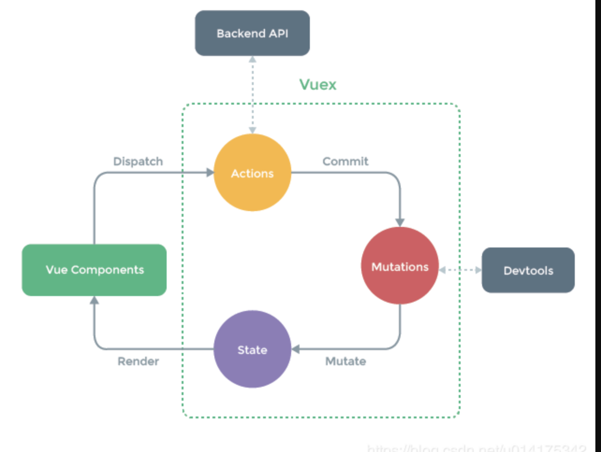
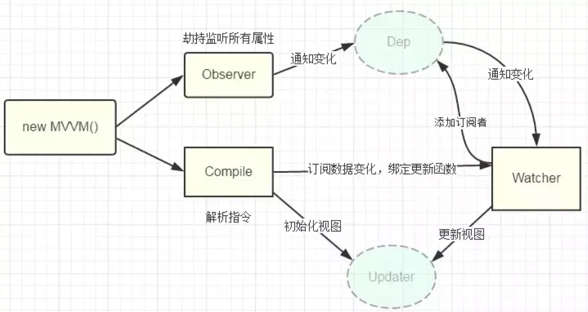
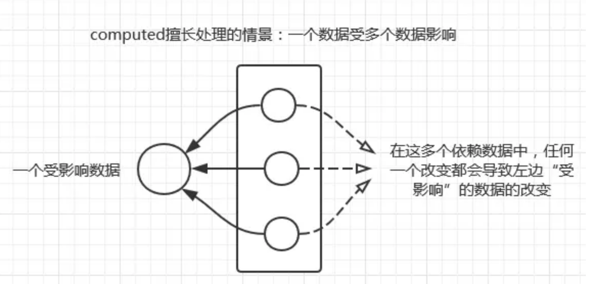
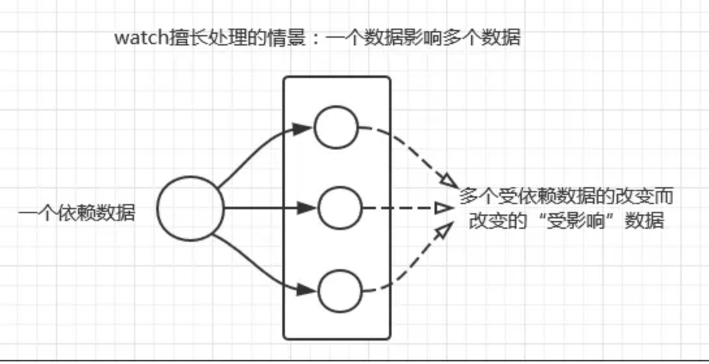
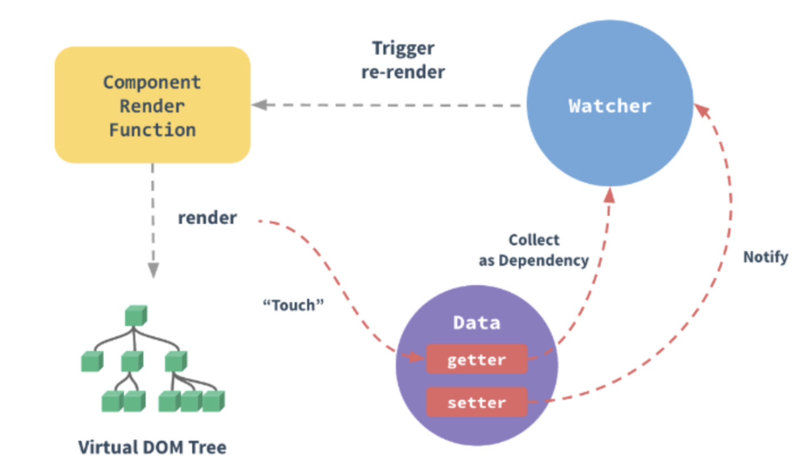

## 1 对于 MVVM 的理解

> `MVVM`是`Model-View-ViewModel`缩写，也就是把 MVC 中的 Controller 演变成`ViewModel`。Model 层代表数据模型，`View`代表 UI 组件，`ViewModel`是`View`和`Model`层的桥梁，数据会绑定到 viewModel 层并自动将数据渲染到页面中，视图变化的时候会通知 viewModel 层更新数据。

- `MVVM` 是 `Model-View-ViewModel` 的缩写
- `Model`: 代表数据模型，也可以在 Model 中定义数据修改和操作的业务逻辑。我们可以把 Model 称为数据层，因为它仅仅关注数据本身，不关心任何行为
- `View`: 用户操作界面。当 ViewModel 对 Model 进行更新的时候，会通过数据绑定更新到 View
- `ViewModel`： 业务逻辑层，View 需要什么数据，ViewModel 要提供这个数据；View 有某些操作，ViewModel 就要响应这些操作，所以可以说它是 Model for View.
- **总结**： `MVVM`模式简化了界面与业务的依赖，解决了数据频繁更新。MVVM 在使用当中，利用双向绑定技术，使得 Model 变化时，`ViewModel` 会自动更新，而 `ViewModel` 变化时，View 也会自动变化。

## 2 请详细说下你对 vue 生命周期的理解

> 答：总共分为 8 个阶段创建前/后，载入前/后，更新前/后，销毁前/后

**生命周期是什么**

> Vue 实例有一个完整的生命周期，也就是从开始创建、初始化数据、编译模版、挂载 Dom -> 渲染、更新 -> 渲染、卸载等一系列过程，我们称这是 Vue 的生命周期

**各个生命周期的作用**

<table> 
 <thead> 
  <tr> 
   <th>生命周期</th> 
   <th>描述</th> 
  </tr> 
 </thead> 
 <tbody> 
  <tr> 
   <td>beforeCreate</td> 
   <td>组件实例被创建之初，组件的属性生效之前</td> 
  </tr> 
  <tr> 
   <td>created</td> 
   <td>组件实例已经完全创建，属性也绑定，但真实dom还没有生成，$el还不可用</td> 
  </tr> 
  <tr> 
   <td>beforeMount</td> 
   <td>在挂载开始之前被调用：相关的 render 函数首次被调用</td> 
  </tr> 
  <tr> 
   <td>mounted</td> 
   <td>el 被新创建的 vm.$el 替换，并挂载到实例上去之后调用该钩子</td> 
  </tr> 
  <tr> 
   <td>beforeUpdate</td> 
   <td>组件数据更新之前调用，发生在虚拟 DOM 打补丁之前</td> 
  </tr> 
  <tr> 
   <td>update</td> 
   <td>组件数据更新之后</td> 
  </tr> 
  <tr> 
   <td>activated</td> 
   <td>keep-alive专属，组件被激活时调用</td> 
  </tr> 
  <tr> 
   <td>deactivated</td> 
   <td>keep-alive专属，组件被销毁时调用</td> 
  </tr> 
  <tr> 
   <td>beforeDestroy</td> 
   <td>组件销毁前调用</td> 
  </tr> 
  <tr> 
   <td>destroyed</td> 
   <td>组件销毁后调用</td> 
  </tr> 
 </tbody> 
</table>

> 由于 Vue 会在初始化实例时对属性执行`getter/setter`转化，所以属性必须在`data`对象上存在才能让`Vue`将它转换为响应式的。Vue 提供了`$set`方法用来触发视图更新

    export default {
        data(){
            return {
                obj: {
                    name: 'fei'
                }
            }
        },
        mounted(){
            this.$set(this.obj, 'sex', 'man')
        }

    }

**什么是 vue 生命周期？**

- 答： Vue 实例从创建到销毁的过程，就是生命周期。从开始创建、初始化数据、编译模板、挂载 Dom→ 渲染、更新 → 渲染、销毁等一系列过程，称之为 Vue 的生命周期。

**vue 生命周期的作用是什么？**

- 答：它的生命周期中有多个事件钩子，让我们在控制整个 Vue 实例的过程时更容易形成好的逻辑。

**vue 生命周期总共有几个阶段？**

- 答：它可以总共分为`8`个阶段：创建前/后、载入前/后、更新前/后、销毁前/销毁后。

**第一次页面加载会触发哪几个钩子？**

- 答：会触发下面这几个`beforeCreate`、`created`、`beforeMount`、`mounted` 。

**DOM 渲染在哪个周期中就已经完成？**

- 答：`DOM` 渲染在 `mounted` 中就已经完成了

## 3 Vue 实现数据双向绑定的原理：Object.defineProperty()

- `vue`实现数据双向绑定主要是：采用数据劫持结合发布者-订阅者模式的方式，通过 `Object.defineProperty()` 来劫持各个属性的`setter`，`getter`，在数据变动时发布消息给订阅者，触发相应监听回调。当把一个普通 `Javascript` 对象传给 Vue 实例来作为它的 `data` 选项时，Vue 将遍历它的属性，用 `Object.defineProperty()` 将它们转为 `getter/setter`。用户看不到 `getter/setter`，但是在内部它们让 `Vue`追踪依赖，在属性被访问和修改时通知变化。
- vue 的数据双向绑定 将`MVVM`作为数据绑定的入口，整合`Observer`，`Compile`和`Watcher`三者，通过`Observer`来监听自己的`model`的数据变化，通过`Compile`来解析编译模板指令（`vue`中是用来解析 `{{}}`），最终利用`watcher`搭起`observer`和`Compile`之间的通信桥梁，达到数据变化 —>视图更新；视图交互变化（`input`）—>数据`model`变更双向绑定效果。

## 4 Vue 组件间的参数传递

**父组件与子组件传值**

> 父组件传给子组件：子组件通过`props`方法接受数据；

- 子组件传给父组件： `$emit` 方法传递参数

**非父子组件间的数据传递，兄弟组件传值**

> `eventBus`，就是创建一个事件中心，相当于中转站，可以用它来传递事件和接收事件。项目比较小时，用这个比较合适（虽然也有不少人推荐直接用`VUEX`，具体来说看需求）

## 5 Vue 的路由实现：hash 模式 和 history 模式

- `hash`模式：在浏览器中符号`“#”`，以及后面的字符称之为`hash`，用 `window.location.hash` 读取。特点：`hash`虽然在`URL`中，但不被包括在`HTTP`请求中；用来指导浏览器动作，对服务端安全无用，`hash`不会重加载页面。
- `history`模式：h`istory`采用`HTML5`的新特性；且提供了两个新方法： `pushState()`， `replaceState()`可以对浏览器历史记录栈进行修改，以及`popState`事件的监听到状态变更

## 5 vue 路由的钩子函数

> 首页可以控制导航跳转，`beforeEach`，`afterEach`等，一般用于页面`title`的修改。一些需要登录才能调整页面的重定向功能。

- `beforeEach`主要有 3 个参数`to`，`from`，`next`。
- `to`：`route`即将进入的目标路由对象。
- `from`：`route`当前导航正要离开的路由。
- `next`：`function`一定要调用该方法`resolve`这个钩子。执行效果依赖 n`ext`方法的调用参数。可以控制网页的跳转

## 6 vuex 是什么？怎么使用？哪种功能场景使用它？

- 只用来读取的状态集中放在`store`中； 改变状态的方式是提交`mutations`，这是个同步的事物； 异步逻辑应该封装在`action`中。
- 在`main.js`引入`store`，注入。新建了一个目录`store`，`… export`
- **场景有**：单页应用中，组件之间的状态、音乐播放、登录状态、加入购物车

- `state`：`Vuex` 使用单一状态树,即每个应用将仅仅包含一个`store` 实例，但单一状态树和模块化并不冲突。存放的数据状态，不可以直接修改里面的数据。
- `mutations`：`mutations`定义的方法动态修改`Vuex` 的 `store` 中的状态或数据
- `getters`：类似`vue`的计算属性，主要用来过滤一些数据。
- `action`：`actions`可以理解为通过将`mutations`里面处里数据的方法变成可异步的处理数据的方法，简单的说就是异步操作数据。`view` 层通过 `store.dispath` 来分发 `action`

> `modules`：项目特别复杂的时候，可以让每一个模块拥有自己的`state`、`mutation`、`action`、`getters`，使得结构非常清晰，方便管理

## 7 v-if 和 v-show 区别

- 答：`v-if`按照条件是否渲染，`v-show`是`display`的`block`或`none`；

## 8 `$route`和`$router`的区别

- `$route`是“路由信息对象”，包括`path`，`params`，`hash`，`query`，`fullPath`，`matched`，`name`等路由信息参数。
- 而`$router`是“路由实例”对象包括了路由的跳转方法，钩子函数等

## 9 如何让 CSS 只在当前组件中起作用?

> 将当前组件的`

   //Child

   <template>
       

   </template>

1. 使用两个 style 标签

   //Parent

   <template>
   

       <Child />
   

   </template>

   
   

   //Child

   <template>
       

   </template>

## 32 ref 的作用

- 获取`dom`元素`this.$refs.box`
- 获取子组件中的`datathis.$refs.box.msg`
- 调用子组件中的方法`this.$refs.box.open()`

## 33 computed 和 watch 区别

1.  当页面中有某些数据依赖其他数据进行变动的时候，可以使用计算属性 computed

> `Computed`本质是一个具备缓存的`watcher`，依赖的属性发生变化就会更新视图。 适用于计算比较消耗性能的计算场景。当表达式过于复杂时，在模板中放入过多逻辑会让模板难以维护，可以将复杂的逻辑放入计算属性中处理

    <template>{{fullName}}</template>
    export default {
        data(){
            return {
                firstName: 'xie',
                lastName: 'yu fei',
            }
        },
        computed:{
            fullName: function(){
                return this.firstName + ' ' + this.lastName
            }
        }
    }

1.  `watch`用于观察和监听页面上的 vue 实例，如果要在数据变化的同时进行异步操作或者是比较大的开销，那么`watch`为最佳选择

> `Watch`没有缓存性，更多的是观察的作用，可以监听某些数据执行回调。当我们需要深度监听对象中的属性时，可以打开`deep：true`选项，这样便会对对象中的每一项进行监听。这样会带来性能问题，优化的话可以使用字符串形式监听，如果没有写到组件中，不要忘记使用`unWatch`手动注销

    <template>{{fullName}}</template>
    export default {
        data(){
            return {
                firstName: 'xie',
                lastName: 'xiao fei',
                fullName: 'xie xiao fei'
            }
        },
        watch:{
            firstName(val) {
                this.fullName = val + ' ' + this.lastName
            },
            lastName(val) {
                this.fullName = this.firstName + ' ' + val
            }
        }
    }

## 34 vue-router 守卫

> 导航守卫 `router.beforeEach` 全局前置守卫

- `to: Route`: 即将要进入的目标（路由对象）

- `from: Route`: 当前导航正要离开的路由

- `next: Function`: 一定要调用该方法来 `resolve` 这个钩子。（一定要用这个函数才能去到下一个路由，如果不用就拦截）

- 执行效果依赖 next 方法的调用参数。

- `next()`: 进行管道中的下一个钩子。如果全部钩子执行完了，则导航的状态就是 confirmed (确认的)。

- `next(false)`:取消进入路由，url 地址重置为 from 路由地址(也就是将要离开的路由地址)

  // main.js 入口文件
  import router from './router'; // 引入路由
  router.beforeEach((to, from, next) => {
  next();
  });
  router.beforeResolve((to, from, next) => {
  next();
  });
  router.afterEach((to, from) => {
  console.log('afterEach 全局后置钩子');
  });

> 路由独享的守卫 你可以在路由配置上直接定义 `beforeEnter` 守卫

    const router = new VueRouter({
      routes: [
        {
          path: '/foo',
          component: Foo,
          beforeEnter: (to, from, next) => {
            // ...
          }
        }
      ]
    })

> 组件内的守卫你可以在路由组件内直接定义以下路由导航守卫

    const Foo = {
      template: `...`,
      beforeRouteEnter (to, from, next) {
        // 在渲染该组件的对应路由被 confirm 前调用
        // 不！能！获取组件实例 `this`
        // 因为当守卫执行前，组件实例还没被创建
      },
      beforeRouteUpdate (to, from, next) {
        // 在当前路由改变，但是该组件被复用时调用
        // 举例来说，对于一个带有动态参数的路径 /foo/:id，在 /foo/1 和 /foo/2 之间跳转的时候，
        // 由于会渲染同样的 Foo 组件，因此组件实例会被复用。而这个钩子就会在这个情况下被调用。
        // 可以访问组件实例 `this`
      },
      beforeRouteLeave (to, from, next) {
        // 导航离开该组件的对应路由时调用，我们用它来禁止用户离开
        // 可以访问组件实例 `this`
        // 比如还未保存草稿，或者在用户离开前，
        将setInterval销毁，防止离开之后，定时器还在调用。
      }
    }

## 35 vue 修饰符

- `stop`：阻止事件的冒泡
- `prevent`：阻止事件的默认行为
- `once`：只触发一次
- `self`：只触发自己的事件行为时，才会执行

## 36 vue 项目中的性能优化

- 不要在模板里面写过多表达式
- 循环调用子组件时添加 key
- 频繁切换的使用 v-show，不频繁切换的使用 v-if
- 尽量少用 float，可以用 flex
- 按需加载，可以用 require 或者 import()按需加载需要的组件
- 路由懒加载

## 37 vue.extend 和 vue.component

- `extend`是构造一个组件的语法器。 然后这个组件你可以作用到 Vue.component 这个全局注册方法里还可以在任意 vue 模板里使用组件。 也可以作用到 vue 实例或者某个组件中的 components 属性中并在内部使用 apple 组件。
- `Vue.component`你可以创建 ，也可以取组件。

## 38 Vue 的 SPA 如何优化加载速度

- 减少入口文件体积
- 静态资源本地缓存
- 开启 Gzip 压缩
- 使用 SSR,nuxt.js

## 39 移动端如何设计一个比较友好的 Header 组件？

> 当时的思路是头部(Header)一般分为左、中、右三个部分，分为三个区域来设计，中间为主标题，每个页面的标题肯定不同，所以可以通过 vue props 的方式做成可配置对外进行暴露，左侧大部分页面可能都是回退按钮，但是样式和内容不尽相同，右侧一般都是具有功能性的操作按钮，所以左右两侧可以通过 vue slot 插槽的方式对外暴露以实现多样化，同时也可以提供 default slot 默认插槽来统一页面风格

## 40 Proxy 与 Object.defineProperty 的优劣对比?

**Proxy 的优势如下:**

- Proxy 可以直接监听对象而非属性
- Proxy 可以直接监听数组的变化
- Proxy 有多达 13 种拦截方法,不限于 apply、ownKeys、deleteProperty、has 等等是 Object.defineProperty 不具备的
- Proxy 返回的是一个新对象,我们可以只操作新的对象达到目的,而 Object.defineProperty 只能遍历对象属性直接修改
- Proxy 作为新标准将受到浏览器厂商重点持续的性能优化，也就是传说中的新标准的性能红利

**Object.defineProperty 的优势如下:**

兼容性好,支持 IE9

## 41 你是如何理解 Vue 的响应式系统的?

**响应式系统简述:**

- 任何一个 Vue Component 都有一个与之对应的 Watcher 实例。
- Vue 的 data 上的属性会被添加 getter 和 setter 属性。
- 当 Vue Component render 函数被执行的时候, data 上会被 触碰(touch), 即被读, getter 方法会被调用, 此时 Vue 会去记录此 Vue component 所依赖的所有 data。(这一过程被称为依赖收集)
- data 被改动时（主要是用户操作）, 即被写, setter 方法会被调用, 此时 Vue 会去通知所有依赖于此 data 的组件去调用他们的 render 函数进行更新。

## 42 既然 Vue 通过数据劫持可以精准探测数据变化,为什么还需要虚拟 DOM 进行 diff 检测差异?

> 现代前端框架有两种方式侦测变化,一种是 pull 一种是 push

- pull: 其代表为 React,我们可以回忆一下 React 是如何侦测到变化的,我们通常会用 setStateAPI 显式更新,然后 React 会进行一层层的 Virtual Dom Diff 操作找出差异,然后 Patch 到 DOM 上,React 从一开始就不知道到底是哪发生了变化,只是知道「有变化了」,然后再进行比较暴力的 Diff 操作查找「哪发生变化了」，另外一个代表就是 Angular 的脏检查操作。
- push: Vue 的响应式系统则是 push 的代表,当 Vue 程序初始化的时候就会对数据 data 进行依赖的收集,一但数据发生变化,响应式系统就会立刻得知,因此 Vue 是一开始就知道是「在哪发生变化了」,但是这又会产生一个问题,如果你熟悉 Vue 的响应式系统就知道,通常一个绑定一个数据就需要一个 Watcher,一但我们的绑定细粒度过高就会产生大量的 Watcher,这会带来内存以及依赖追踪的开销,而细粒度过低会无法精准侦测变化,因此 Vue 的设计是选择中等细粒度的方案,在组件级别进行 push 侦测的方式,也就是那套响应式系统,通常我们会第一时间侦测到发生变化的组件,然后在组件内部进行 Virtual Dom Diff 获取更加具体的差异,而 Virtual Dom Diff 则是 pull 操作,Vue 是 push+pull 结合的方式进行变化侦测的

## 43 Vue 为什么没有类似于 React 中 shouldComponentUpdate 的生命周期？

考点: Vue 的变化侦测原理

前置知识: 依赖收集、虚拟 DOM、响应式系统

> 根本原因是 Vue 与 React 的变化侦测方式有所不同

- React 是 pull 的方式侦测变化,当 React 知道发生变化后,会使用 Virtual Dom Diff 进行差异检测,但是很多组件实际上是肯定不会发生变化的,这个时候需要用 shouldComponentUpdate 进行手动操作来减少 diff,从而提高程序整体的性能.
- Vue 是 pull+push 的方式侦测变化的,在一开始就知道那个组件发生了变化,因此在 push 的阶段并不需要手动控制 diff,而组件内部采用的 diff 方式实际上是可以引入类似于 shouldComponentUpdate 相关生命周期的,但是通常合理大小的组件不会有过量的 diff,手动优化的价值有限,因此目前 Vue 并没有考虑引入 shouldComponentUpdate 这种手动优化的生命周期.

## 44 Vue 中的 key 到底有什么用？

- key 是为 Vue 中的 vnode 标记的唯一 id,通过这个 key,我们的 diff 操作可以更准确、更快速
- diff 算法的过程中,先会进行新旧节点的首尾交叉对比,当无法匹配的时候会用新节点的 key 与旧节点进行比对,然后超出差异.

> diff 程可以概括为：oldCh 和 newCh 各有两个头尾的变量 StartIdx 和 EndIdx，它们的 2 个变量相互比较，一共有 4 种比较方式。如果 4 种比较都没匹配，如果设置了 key，就会用 key 进行比较，在比较的过程中，变量会往中间靠，一旦 StartIdx>EndIdx 表明 oldCh 和 newCh 至少有一个已经遍历完了，就会结束比较,这四种比较方式就是首、尾、旧尾新头、旧头新尾.

> 准确: 如果不加 key,那么 vue 会选择复用节点(Vue 的就地更新策略),导致之前节点的状态被保留下来,会产生一系列的 bug. 快速: key 的唯一性可以被 Map 数据结构充分利用,相比于遍历查找的时间复杂度`O(n)`,`Map`的时间复杂度仅仅为`O(1)`.

## 45 vue 项目性能优化

**代码层面：**

- 合理使用 `v-if` 和 `v-show`
- 区分 `computed` 和 `watch` 的使用
- `v-for` 遍历为 `item` 添加 `key`
- `v-for` 遍历避免同时使用 `v-if`
- 通过 `addEventListener`添加的事件在组件销毁时要用 `removeEventListener` 手动移除这些事件的监听
- 图片懒加载
- 路由懒加载
- 第三方插件按需引入
- `SSR`服务端渲染，首屏加载速度快，`SEO`效果好

**Webpack 层面优化：**

- 对图片进行压缩
- 使用 `CommonsChunkPlugin` 插件提取公共代码
- 提取组件的 CSS
- 优化 `SourceMap`
- 构建结果输出分析，利用 `webpack-bundle-analyzer` 可视化分析工具

## 46 nextTick

> `nextTick` 可以让我们在下次 `DOM` 更新循环结束之后执行延迟回调，用于获得更新后的 `DOM`

`nextTick`主要使用了宏任务和微任务。根据执行环境分别尝试采用

- `Promise`
- `MutationObserver`
- `setImmediate`
- 如果以上都不行则采用`setTimeout`

> 定义了一个异步方法，多次调用`nextTick`会将方法存入队列中，通过这个异步方法清空当前队列

## 47 说一下 vue2.x 中如何监测数组变化

> 使用了函数劫持的方式，重写了数组的方法，`Vue`将`data`中的数组进行了原型链重写，指向了自己定义的数组原型方法。这样当调用数组 api 时，可以通知依赖更新。如果数组中包含着引用类型，会对数组中的引用类型再次递归遍历进行监控。这样就实现了监测数组变化。

## 48 你的接口请求一般放在哪个生命周期中

> 接口请求一般放在`mounted`中，但需要注意的是服务端渲染时不支持`mounted`，需要放到`created`中

## 49 组件中的 data 为什么是一个函数

> 一个组件被复用多次的话，也就会创建多个实例。本质上，这些实例用的都是同一个构造函数。如果`data`是对象的话，对象属于引用类型，会影响到所有的实例。所以为了保证组件不同的实例之间 d`ata`不冲突，data 必须是一个函数

## 50 说一下 v-model 的原理

> `v-model`本质就是一个语法糖，可以看成是`value + input`方法的语法糖。 可以通过`model`属性的`prop`和`event`属性来进行自定义。原生的`v-model`，会根据标签的不同生成不同的事件和属性

    <input v-model='searchData'>

等价于

    <input v-bind:value = 'searchData' v-on:input = 'searchData = $event.target.value' >

当在 input 元素中使用`v-model`实现双数据绑定，其实就是在输入的时候触发元素的 input 事件，通过这个语法糖，实现了数据的双向绑定。

## 51 Vue 事件绑定原理说一下

> 原生事件绑定是通过`addEventListener`绑定给真实元素的，组件事件绑定是通过`Vue`自定义的`$on`实现的

## 52 Vue 模版编译原理知道吗，能简单说一下吗？

> 简单说，`Vue`的编译过程就是将`template`转化为`render`函数的过程。会经历以下阶段：

- 生成`AST`树
- 优化
- `codegen`
- 首先解析模版，生成`AST`语法树(一种用 J`avaScript`对象的形式来描述整个模板)。 使用大量的正则表达式对模板进行解析，遇到标签、文本的时候都会执行对应的钩子进行相关处理。
- `Vue`的数据是响应式的，但其实模板中并不是所有的数据都是响应式的。有一些数据首次渲染后就不会再变化，对应的 DOM 也不会变化。那么优化过程就是深度遍历 AST 树，按照相关条件对树节点进行标记。这些被标记的节点(静态节点)我们就可以跳过对它们的比对，对运行时的模板起到很大的优化作用。
- 编译的最后一步是将优化后的`AST`树转换为可执行的代码

## 53 Vue2.x 和 Vue3.x 渲染器的 diff 算法分别说一下

> 简单来说，`diff`算法有以下过程

- 同级比较，再比较子节点
- 先判断一方有子节点一方没有子节点的情况(如果新的`children`没有子节点，将旧的子节点移除)
- 比较都有子节点的情况(核心`diff`)
- 递归比较子节点
- 正常`Diff`两个树的时间复杂度是`O(n^3)`，但实际情况下我们很少会进行跨层级的移动`DOM`，所以`Vue`将`Diff`进行了优化，从`O(n^3) -> O(n)`，只有当新旧`children`都为多个子节点时才需要用核心的`Diff`算法进行同层级比较。
- `Vue2`的核心`Diff`算法采用了双端比较的算法，同时从新旧`children`的两端开始进行比较，借助`key`值找到可复用的节点，再进行相关操作。相比`React`的`Diff`算法，同样情况下可以减少移动节点次数，减少不必要的性能损耗，更加的优雅
- 在创建`VNode`时就确定其类型，以及在`mount/patch`的过程中采用位运算来判断一个`VNode`的类型，在这个基础之上再配合核心的`Diff`算法，使得性能上较`Vue2.x`有了提升

## 54 再说一下虚拟 Dom 以及 key 属性的作用

- 由于在浏览器中操作`DOM`是很昂贵的。频繁的操作`DOM`，会产生一定的性能问题。这就是虚拟 Dom 的产生原因
- `Virtual DOM`本质就是用一个原生的 JS 对象去描述一个`DOM`节点。是对真实 DOM 的一层抽象
- `VirtualDOM`映射到真实 DOM 要经历`VNode`的`create`、`diff`、`patch`等阶段

**key 的作用是尽可能的复用 DOM 元素**

- 新旧 `children` 中的节点只有顺序是不同的时候，最佳的操作应该是通过移动元素的位置来达到更新的目的
- 需要在新旧 `children` 的节点中保存映射关系，以便能够在旧 `children` 的节点中找到可复用的节点。`key`也就是`children`中节点的唯一标识

## 55 Vue 中组件生命周期调用顺序说一下

- 渲染顺序：先父后子，完成顺序：先子后父
- 更新顺序：父更新导致子更新，子更新完成后父
- 销毁顺序：先父后子，完成顺序：先子后父

**加载渲染过程**

> `父beforeCreate`\->`父created`\->`父beforeMount`\->`子beforeCreate`\->`子created`\->`子beforeMount`\- >`子mounted`\->`父mounted`

**子组件更新过程**

> `父beforeUpdate`\->`子beforeUpdate`\->`子updated`\->`父updated`

**父组件更新过程**

> `父 beforeUpdate` \-> `父 updated`

**销毁过程**

> `父beforeDestroy`\->`子beforeDestroy`\->`子destroyed`\->`父destroyed`

## 56 SSR 了解吗

> `SSR`也就是服务端渲染，也就是将`Vue`在客户端把标签渲染成 HTML 的工作放在服务端完成，然后再把 html 直接返回给客户端

`SSR`有着更好的`SEO`、并且首屏加载速度更快等优点。不过它也有一些缺点，比如我们的开发条件会受到限制，服务器端渲染只支持`beforeCreate`和`created`两个钩子，当我们需要一些外部扩展库时需要特殊处理，服务端渲染应用程序也需要处于`Node.js`的运行环境。还有就是服务器会有更大的负载需求

## 57 你都做过哪些 Vue 的性能优化

**编码阶段**

- 尽量减少`data`中的数据，`data`中的数据都会增加`getter`和`setter`，会收集对应的`watcher`
- `v-if`和`v-for`不能连用
- 如果需要使用`v-for`给每项元素绑定事件时使用事件代理
- `SPA` 页面采用`keep-alive`缓存组件
- 在更多的情况下，使用`v-if`替代`v-show`
- `key`保证唯一
- 使用路由懒加载、异步组件
- 防抖、节流
- 第三方模块按需导入
- 长列表滚动到可视区域动态加载
- 图片懒加载

**SEO 优化**

- 预渲染
- 服务端渲染`SSR`

**打包优化**

- 压缩代码
- `Tree Shaking/Scope Hoisting`
- 使用`cdn`加载第三方模块
- 多线程打包`happypack`
- `splitChunks`抽离公共文件
- `sourceMap`优化

**用户体验**

- 骨架屏
- `PWA`

> 还可以使用缓存(客户端缓存、服务端缓存)优化、服务端开启`gzip`压缩等。

## 58 Vue.js 特点

- 简洁：页面由`HTML`模板+Json 数据+`Vue`实例组成
- 数据驱动：自动计算属性和追踪依赖的模板表达式
- 组件化：用可复用、解耦的组件来构造页面
- 轻量：代码量小，不依赖其他库
- 快速：精确有效批量 DOM 更新
- 模板友好：可通过 npm，bower 等多种方式安装，很容易融入

## 59 请说出 vue.cli 项目中 src 目录每个文件夹和文件的用法

- `assets`文件夹是放静态资源；
- `components`是放组件；
- `router`是定义路由相关的配置;
- `view`视图；
- `app.vue`是一个应用主组件；
- `main.js`是入口文件

## 60 vue 路由传参数

- 使用`query`方法传入的参数使用`this.$route.query`接受
- 使用`params`方式传入的参数使用`this.$route.params`接受

## 61 vuex 是什么？ 有哪几种属性？

> - `Vuex` 是一个专为 `Vue.js` 应用程序开发的状态管理模式。
> - 有 5 种，分别是 `state`、`getter`、`mutation`、`action`、`module`

- `Vuex` 是一个专为 `Vue.js` 应用程序开发的状态管理模式。
- 有 5 种，分别是 `state`、`getter`、`mutation`、`action`、`module`
- `vuex` 的 `store` 是什么？
- `vuex` 就是一个仓库，仓库里放了很多对象。其中 `state` 就是数据源存放地，对应于一般 vue 对象里面的 `datastate` 里面存放的数据是响应式的，`vue` 组件从 `store` 读取数据，若是 `store` 中的数据发生改变，依赖这相数据的组件也会发生更新它通过 `mapState` 把全局的 `state` 和 `getters` 映射到当前组件的 `computed` 计算属性

**vuex 的 getter 是什么？**

- `getter` 可以对 `state` 进行计算操作，它就是 `store` 的计算属性虽然在组件内也可以做计算属性，但是 `getters` 可以在多给件之间复用如果一个状态只在一个组件内使用，是可以不用 `getters`

**vuex 的 mutation 是什么？**

- 更改`Vuex`的`store`中的状态的唯一方法是提交`mutation`

**vuex 的 action 是什么？**

- `action` 类似于 `muation`, 不同在于：`action` 提交的是 `mutation`,而不是直接变更状态`action` 可以包含任意异步操作
- `vue` 中 `ajax` 请求代码应该写在组件的 `methods` 中还是 `vuex` 的 `action` 中
- `vuex` 的 `module` 是什么？

> 面对复杂的应用程序，当管理的状态比较多时；我们需要将`vuex`的`store`对象分割成模块(`modules`)。

> 如果请求来的数据不是要被其他组件公用，仅仅在请求的组件内使用，就不需要放入 `vuex` 的 `state` 里如果被其他地方复用，请将请求放入 `action` 里，方便复用，并包装成 `promise` 返回

## 62 如何让 CSS 只在当前组件中起作用？

> 将当前组件的`<style>`修改为`<style scoped>`

## 63 delete 和 Vue.delete 删除数组的区别？

- `delete`只是被删除的元素变成了 `empty/undefined` 其他的元素的键值还是不变。

- `Vue.delete`直接删除了数组 改变了数组的键值。

  var a=[1,2,3,4]
  var b=[1,2,3,4]
  delete a[0]
  console.log(a) //[empty,2,3,4]
  this.$delete(b,0)
  console.log(b) //[2,3,4]

## 64 v-on 可以监听多个方法吗？

可以

    <input type="text" :value="name" @input="onInput" @focus="onFocus" @blur="onBlur" />

**v-on 常用修饰符**

- `.stop` 该修饰符将阻止事件向上冒泡。同理于调用 `event.stopPropagation()` 方法
- `.prevent` 该修饰符会阻止当前事件的默认行为。同理于调用 `event.preventDefault()` 方法
- `.self` 该指令只当事件是从事件绑定的元素本身触发时才触发回调
- `.once` 该修饰符表示绑定的事件只会被触发一次

## 65 Vue 子组件调用父组件的方法

- 第一种方法是直接在子组件中通过`this.$parent.event`来调用父组件的方法
- 第二种方法是在子组件里用`$emit`向父组件触发一个事件，父组件监听这个事件就行了。

## 66 vue 如何兼容 ie 的问题

> babel-polyfill 插件

## 67 Vue 改变数组触发视图更新

> 以下方法调用会改变原始数组：`push()`, `pop()`, `shift()`, `unshift()`, `splice()`, `sort()`, `reverse()`,`Vue.set( target, key, value )`

- 调用方法：`Vue.set( target, key, value )`

  - `target`：要更改的数据源(可以是对象或者数组)
  - `key`：要更改的具体数据
  - `value` ：重新赋的值

## 68 DOM 渲染在哪个周期中就已经完成？

> 在`mounted`

注意 `mounted` 不会承诺所有的子组件也都一起被挂载。如果你希望等到整个视图都渲染完毕，可以用 `vm.$nextTick` 替换掉 `mounted`

    mounted: function () {
      this.$nextTick(function () {
        // Code that will run only after the
        // entire view has been rendered
      })
    }

## 69 简述每个周期具体适合哪些场景

- `beforecreate` : 可以在这加个`loading`事件，在加载实例时触发
- `created` : 初始化完成时的事件写在这里，如在这结束`loading`事件，异步请求也适宜在这里调用
- `mounted` : 挂载元素，获取到 DOM 节点 `updated` : 如果对数据统一处理，在这里写上相应函数
- `beforeDestroy` : 可以做一个确认停止事件的确认框

**第一次加载会触发哪几个钩子**

> 会触发`beforeCreate` , `created` ,`beforeMount` ,`mounted`

## 70 动态绑定 class

> `active` `classname`， `isActive` 变量

    

## 71 Vue3.0 是如何变得更快的

### diff 方法优化

- `Vue2.x` 中的虚拟 dom 是进行全量的对比。
- `Vue3.0` 中新增了静态标记(PatchFlag):在与上次虚拟结点进行对比的时候，值对比 带有 patch flag 的节点，并且可以通过 flag 的信息得知当前节点要对比的具体内容化

### hoistStatic 静态提升

- `Vue2.x` : 无论元素是否参与更新，每次都会重新创建。
- `Vue3.0` : 对不参与更新的元素，只会被创建一次，之后会在每次渲染时候被不停的复用

### cacheHandlers 事件侦听器缓存

默认情况下 onClick 会被视为动态绑定，所以每次都会去追踪它的变化但是因为是同一 个函数，所以没有追踪变化，直接缓存起来复用即可

## 72 说说你对 proxy 的理解

vue 的数据劫持有两个缺点

- 无法监听通过索引修改数组的值的变化
- 无法监听 object 也就是对象的值的变化
- 所以 vue2.x 中才会有`$set` 属性的存在
- proxy 是 es6 中推出的新 api，可以弥补以上两个缺点，所以 vue3.x 版本用 proxy 替换 `object.defineproperty`。

## 73 生命周期详解

**_init_**

- `initLifecycle/Event`，往 vm 上挂载各种属性
- `callHook: beforeCreated`: 实例刚创建
- `initInjection/initState`: 初始化注入和 `data` 响应性
- `created: 创建完成，属性已经绑定， 但还未生成真实`dom\`
- 进行元素的挂载： `$el / vm.$mount()`
- 是否有`template`: 解析成 `render function`

  - `*.vue`文件: `vue-loader`会将`<template>`编译成`render function`

- `beforeMount`: 模板编译/挂载之前
- 执行`render function`，生成真实的`dom`，并替换到`dom tree`中
- `mounted`: 组件已挂载

**update**

- 执行`diff`算法，比对改变是否需要触发`UI`更新
- `flushScheduleQueue`
- `watcher.before`: 触发`beforeUpdate`钩子 - `watcher.run()`: 执行`watcher`中的 `notify`，通知所有依赖项更新 UI
- 触发`updated`钩子: 组件已更新
- `actived / deactivated(keep-alive)`: 不销毁，缓存，组件激活与失活
- `destroy`

  - `beforeDestroy`: 销毁开始
  - 销毁自身且递归销毁子组件以及事件监听

    - `remove()`: 删除节点
    - `watcher.teardown()`: 清空依赖
    - `vm.$off()`: 解绑监听

  - `destroyed`: 完成后触发钩子

> 上面是 vue 的声明周期的简单梳理，接下来我们直接以代码的形式来完成 vue 的初始化

    new Vue({})

    // 初始化Vue实例
    function _init() {
    	 // 挂载属性
        initLifeCycle(vm)
        // 初始化事件系统，钩子函数等
        initEvent(vm)
        // 编译slot、vnode
        initRender(vm)
        // 触发钩子
        callHook(vm, 'beforeCreate')
        // 添加inject功能
        initInjection(vm)
        // 完成数据响应性 props/data/watch/computed/methods
        initState(vm)
        // 添加 provide 功能
        initProvide(vm)
        // 触发钩子
        callHook(vm, 'created')

    	 // 挂载节点
        if (vm.$options.el) {
            vm.$mount(vm.$options.el)
        }
    }

    // 挂载节点实现
    function mountComponent(vm) {
    	 // 获取 render function
        if (!this.options.render) {
            // template to render
            // Vue.compile = compileToFunctions
            let { render } = compileToFunctions()
            this.options.render = render
        }
        // 触发钩子
        callHook('beforeMounte')
        // 初始化观察者
        // render 渲染 vdom，
        vdom = vm.render()
        // update: 根据 diff 出的 patchs 挂载成真实的 dom
        vm._update(vdom)
        // 触发钩子
        callHook(vm, 'mounted')
    }

    // 更新节点实现
    funtion queueWatcher(watcher) {
    	nextTick(flushScheduleQueue)
    }

    // 清空队列
    function flushScheduleQueue() {
    	 // 遍历队列中所有修改
        for(){
    	    // beforeUpdate
            watcher.before()

            // 依赖局部更新节点
            watcher.update()
            callHook('updated')
        }
    }

    // 销毁实例实现
    Vue.prototype.$destory = function() {
    	 // 触发钩子
        callHook(vm, 'beforeDestory')
        // 自身及子节点
        remove()
        // 删除依赖
        watcher.teardown()
        // 删除监听
        vm.$off()
        // 触发钩子
        callHook(vm, 'destoryed')
    }

## 74 Proxy 相比于 defineProperty 的优势

- 数组变化也能监听到

- 不需要深度遍历监听

  let data = { a: 1 }
  let reactiveData = new Proxy(data, {
  get: function(target, name){
  // ...
  },
  // ...
  })

## 75 vue-router

**mode**

- `hash`
- `history`

**跳转**

- `this.$router.push()`
- `<router-link to=""></router-link>`

**占位**

    <router-view></router-view>

## 76 vuex 总结

- `state`: 状态中心
- `mutations`: 更改状态
- `actions`: 异步更改状态
- `getters`: 获取状态
- `modules`: 将`state`分成多个`modules`，便于管理

## 77 diff 算法

**时间复杂度：** 个树的完全`diff` 算法是一个时间复杂度为`O(n*3）` ，vue 进行优化转化成`O(n)` 。

**理解：**

- 最小量更新，`key` 很重要。这个可以是这个节点的唯一标识，告诉`diff` 算法，在更改前后它们是同一个 DOM 节点

  - 扩展`v-for` 为什么要有`key` ，没有`key` 会暴力复用，举例子的话随便说一个比如移动节点或者增加节点（修改 DOM），加`key` 只会移动减少操作 DOM。

- 只有是同一个虚拟节点才会进行精细化比较，否则就是暴力删除旧的，插入新的。
- 只进行同层比较，不会进行跨层比较。

**diff 算法的优化策略**：四种命中查找，四个指针

1.  旧前与新前（先比开头，后插入和删除节点的这种情况）
2.  旧后与新后（比结尾，前插入或删除的情况）
3.  旧前与新后（头与尾比，此种发生了，涉及移动节点，那么新前指向的节点，移动到旧后之后）
4.  旧后与新前（尾与头比，此种发生了，涉及移动节点，那么新前指向的节点，移动到旧前之前）

## 78 Vue 的响应式原理中 Object.defineProperty 有什么缺陷

- `Object.defineProperty` 无法监控到数组下标的变化，导致通过数组下标添加元素，不能实时响应；
- `Object.defineProperty` 只能劫持对象的属性，从而需要对每个对象，每个属性进行遍历，如果，属性值是对象，还需要深度遍历。Proxy 可以劫持整个对象，并返回一个新的对象
- `Proxy` 不仅可以代理对象，还可以代理数组。还可以代理动态增加的属性

## 79 Composition API

- `Composition API`出现就是为了解决 Options API 导致相同功能代码分散的现象

**compositon api 提供了以下几个函数：**

- `setup`
- `ref`
- `reactive`
- `watchEffect`
- `watch`
- `computed`
- `toRefs`
- 生命周期的`hooks`

## 80 vue 中是如何检测数组变化的呢

> 数组就是使用 `object.defineProperty` 重新定义数组的每一项，那能引起数组变化的方法我们都是知道的， `pop` 、 `push` 、 `shift` 、 `unshift` 、 `splice` 、 `sort` 、 `reverse` 这七种，只要这些方法执行改了数组内容，我就更新内容就好了，是不是很好理解

- 是用函数劫持的方式，重写了数组方法，具体呢就是更改了数组的原型，更改成自己的，用户调数组的一些方法的时候，走的就是自己的方法，然后通知视图去更新
- 数组里每一项可能是对象，那么我就是会对数组的每一项进行观测，（且只有数组里的对象才能进行观测，观测过的也不会进行观测）

> `vue3`：改用 `proxy` ，可直接监听对象数组的变化

## 81 Vue 的事件绑定原理

- 原生 DOM 的绑定：Vue 在创建真实 DOM 时会调用 `createElm` ，默认会调用 `invokeCreateHooks` 。会遍历当前平台下相对的属性处理代码，其中就有 `updateDOMLListeners`方法，内部会传入 `add（）` 方法
- 组件绑定事件，原生事件，自定义事件；组件绑定之间是通过`Vue`中自定义的 `$on` 方法实现的

> 可以理解为：组件的 `nativeOnOn` 等价于 普通元素 on 组件的 on 会单独处理

## 82 v-model 中的实现原理及如何自定义 v-model

> `v-model` 可以看成是 `value+input` 方法的语法糖（组件）。原生的 `v-model` ，会根据标签的不同生成不同的事件与属性。解析一个指令来

自定义：自己写 `model` 属性，里面放上 `prop` 和 `event`

## 83 为什么 Vue 采用异步渲染呢

> Vue 是组件级更新，如果不采用异步更新，那么每次更新数据都会对当前组件进行重新渲染，所以为了性能， Vue 会在本轮数据更新后，在异步更新视图。核心思想 `nextTick`

`dep.notify（）` 通知 `watcher`进行更新， subs\[i\].update 依次调用 `watcher` 的 `update` ， `queueWatcher` 将`watcher` 去重放入队列， nextTick（ flushSchedulerQueue ）在下一`tick`中刷新`watcher`队列（异步）

## 84 Vuex 工作原理

Vuex 是一个专为 Vue.js 应用程序开发的**状态管理模式**。

状态自管理应用包含以下几个部分：

- state，驱动应用的数据源；
- view，以声明方式将 state 映射到视图；
- actions，响应在 view 上的用户输入导致的状态变化。下图单向数据流示意图：

vuex，多组件共享状态，因-单向数据流简洁性很容易被破坏：

- 多个视图依赖于同一状态。
- 来自不同视图的行为需要变更同一状态

## 85 如何从真实 DOM 到虚拟 DOM

涉及到 Vue 中的模板编译原理，主要过程：

1.  将模板转换成`ast` 树，`ast` 用对象来描述真实的 JS 语法（将真实 DOM 转换成虚拟 DOM）
2.  优化树
3.  将`ast` 树生成代码

## 86 Computed watch 和 method

- **computed**：默认`computed`也是一个`watcher`具备缓存，只有当依赖的数据变化时才会计算, 当数据没有变化时, 它会读取缓存数据。如果一个数据依赖于其他数据，使用`computed`
- **watch**：每次都需要执行函数。 `watch` 更适用于数据变化时的异步操作。如果需要在某个数据变化时做一些事情，使用 watch。
- **method**：只要把方法用到模板上了,每次一变化就会重新渲染视图，性能开销大

## 87 为什么要使用异步组件？

1.  节省打包出的结果，异步组件分开打包，采用`jsonp`的方式进行加载，有效解决文件过大的问题。
2.  核心就是包组件定义变成一个函数，依赖`import（）` 语法，可以实现文件的分割加载。

## 88 action 与 mutation 的区别

- `mutation` 是同步更新，`$watch` 严格模式下会报错
- `action` 是同步操作，可以获取数据后调用`mutation` 提交最终数据

## 89 插槽与作用域插槽的区别

**插槽**

- 创建组件虚拟节点时，会将组件儿子的虚拟节点保存起来。当初始化组件时，通过插槽属性将儿子进行分类`{a:[vnode],b[vnode]}`
- 渲染组件时会拿对应的`slot` 属性的节点进行替换操作。（插槽的作用域为父组件）

**作用域插槽**

- 作用域插槽在解析的时候不会作为组件的孩子节点。会解析成函数，当子组件渲染时，会调用此函数进行渲染。
- 普通插槽渲染的作用域是父组件，作用域插槽的渲染作用域是当前子组件。

## 90 vue 中相同逻辑如何抽离

> 其实就是考察`vue.mixin` 用法，给组件每个生命周期，函数都混入一些公共逻辑。

## 91 谈谈对 keep-alive 的了解

> `keep-alive` 可以实现组件的缓存，当组件切换时不会对当前组件进行卸载。常用的 2 个属性`include/exclude` ，2 个生命周期`activated` ，`deactivated`

## 92 Vue 性能优化

**编码优化**：

- 事件代理
- `keep-alive`
- 拆分组件
- `key` 保证唯一性
- 路由懒加载、异步组件
- 防抖节流

**Vue 加载性能优化**

- 第三方模块按需导入（`babel-plugin-component` ）
- 图片懒加载

**用户体验**

- `app-skeleton` 骨架屏
- `shellap` p 壳
- `pwa`

**SEO 优化**

- 预渲染

## 93 Vue3.0 相对于 Vue2.x 有哪些不同？

**performance**

首先在性能(performance)上有了更多的优化，一方面表现在`virtual dom`的生成上更快了，另外在底层还做了一些监听的缓存，也就是事件在被创建的时候会被推进一个缓存中，后续没有改变会直接取缓存。

**tree-shaking**

tree-shaking 它表示的是在打包的时候会去除一些无用的代码。而在 Vue3 中对它的支持更加友好了，例如像 transition、v-model、computed 等功能没有用到的话，那么最后打包产生的代码就会将它们去除。也就是说，如果你的 Vue 项目只写了一个 Hello Word 的话，那么最后打包的代码中就只有一些核心的代码，如更新算法、响应式等，打包生成的文件可能就只有 13.5kb。

**Fragments**

碎片(Fragments)，原本在 Vue2.x 中每个 template 下只能允许有一个根节点，但是在 Vue3 中它可以允许你有多个，用尤大大的话来说就是会将这些内容自动变为一个碎片。

**TS**

再者就是对 TS 的支持度很好。虽然 Vue3 本来就是用 TS 写的，但是不一定要用 TS。另外它也支持 Class Component，不过不是第一推荐。

**Component API**

语法上，对模版语法是零改变的。只不过更加推荐用 Component API 来写 JS 部分。Component API 它并不是语法，而是新增的 API。它带来的好处一个是逻辑重用，方便我们把一些功能的部分抽离出来。另一个它相对于 options 来说更加集中，用 options 来写代码想要追寻一个变量的变化比较麻烦。

**关于兼容性**

目前的 Vue3.beta 版本是不支持 IE11 的，因为核心的响应式原理用到了 ES6 的 Proxy，但是以后会去兼容 IE11。后面我们在创建一个 Vue 项目的时候，可以选择不同的版本，支持 IE11 和不支持 IE11 的。

**什么时候能使用**

现在的 beta 版本其实已经可以用了，对于一些新的小的项目可以试试水，这个可以自己评估。正式能够投入到生产使用中可能要等到年中 (终？)。

## 94 Vue 中 hash 模式和 history 模式的区别

- 最明显的是在显示上，`hash`模式的`URL`中会夹杂着`#`号，而`history`没有。
- `Vue`底层对它们的实现方式不同。`hash`模式是依靠`onhashchange`事件(监听`location.hash`的改变)，而`history`模式是主要是依靠的`HTML5 history`中新增的两个方法，`pushState()`可以改变`url`地址且不会发送请求，`replaceState()`可以读取历史记录栈,还可以对浏览器记录进行修改。
- 当真正需要通过`URL`向后端发送`HTTP`请求的时候，比如常见的用户手动输入`URL`后回车，或者是刷新(重启)浏览器，这时候`history`模式需要后端的支持。因为`history`模式下，前端的`URL`必须和实际向后端发送请求的`URL`一致，例如有一个`URL`是带有路径`path`的(例如`www.lindaidai.wang/blogs/id`)，如果后端没有对这个路径做处理的话，就会返回`404`错误。所以需要后端增加一个覆盖所有情况的候选资源，一般会配合前端给出的一个`404`页面。

`hash:`

    window.onhashchange = function(event){
      // location.hash获取到的是包括#号的，如"#heading-3"
      // 所以可以截取一下
    	let hash = location.hash.slice(1);
    }

## 95 了解 history 有哪些方法吗？说下它们的区别

history 这个对象在 html5 的时候新加入两个 api **history.pushState() 和 history.repalceState()** 这两个 API 可以在不进行刷新的情况下，操作浏览器的历史纪录。唯一不同的是，前者是新增一个历史记录，后者是直接替换当前的历史记录。

从参数上来说：

    window.history.pushState(state,title,url)
    //state：需要保存的数据，这个数据在触发popstate事件时，可以在event.state里获取
    //title：标题，基本没用，一般传null
    //url：设定新的历史纪录的url。新的url与当前url的origin必须是一样的，否则会抛出错误。url可以时绝对路径，也可以是相对路径。
    //如 当前url是 https://www.baidu.com/a/,执行history.pushState(null, null, './qq/')，则变成 https://www.baidu.com/a/qq/，
    //执行history.pushState(null, null, '/qq/')，则变成 https://www.baidu.com/qq/

    window.history.replaceState(state,title,url)
    //与pushState 基本相同，但她是修改当前历史纪录，而 pushState 是创建新的历史纪录

另外还有：

- `window.history.back()` 后退
- `window.history.forward()`前进
- `window.history.go(1)` 前进或者后退几步

从触发事件的监听上来说：

- `pushState()`和`replaceState()`不能被`popstate`事件所监听
- 而后面三者可以，且用户点击浏览器前进后退键时也可以

## 96 如何监听 pushState 和 replaceState 的变化呢？

利用自定义事件`new Event()`创建这两个事件，并全局监听：

    <body>
      <button onclick="goPage2()">去page2</button>
      
Page1

      
    </body>

## 97 Vue 组件内的导航守卫有哪几个？

- `beforeRouteEnter`
- `beforeRouteUpdate`
- `beforeLeave`

## 98 beforeRouteEnter 和另外两个有什么不同吗？

`beforeRouteEnter`是支持给`next`传递参数的唯一守卫，因为在这个路由守卫中还**不能访问 this**，而为了能让我们访问组件实例，可以通过传一个回调给`next`：

    beforeRouteEnter(to, from, next) {
    	next(vm => {
    		// vm 就是组件实例
    	})
    }

而对于另外两个，`this`已经可用，所以**不支持传递回调**：

    beforeRouteUpdate (to, from, next) {
      // just use `this`
      this.name = to.params.name
      next()
    }

离开守卫`beforeRouteLeave`通常用来禁止用户还未保存修改之前离开，可以通过`next(false)`来取消：

    beforeRouteLeave (to, from, next) {
      const answer = window.confirm('Do you really want to leave? you have unsaved changes!')
      if (answer) {
        next()
      } else {
        next(false)
      }
    }

## 99 完整的导航解析流程

1.  导航被触发。
2.  在失活的组件里调用离开守卫。
3.  调用全局的 `beforeEach` 守卫。
4.  在重用的组件里调用 `beforeRouteUpdate` 守卫 (2.2+)。
5.  在路由配置里调用 `beforeEnter`。
6.  解析异步路由组件。
7.  在被激活的组件里调用 `beforeRouteEnter`。
8.  调用全局的 `beforeResolve` 守卫 (2.5+)。
9.  导航被确认。
10. 调用全局的 `afterEach` 钩子。
11. 触发 DOM 更新。
12. 用创建好的实例调用 `beforeRouteEnter` 守卫中传给 `next` 的回调函数。

## 100 你是怎么看 Vue 和 React 的？

首先它们都是当今比较流行的前端框架。

**相同点：**

1.  `Virtual DOM`。其中最大的一个相似之处就是都使用了`Virtual DOM`。(当然`Vue`是在`Vue2.x`才引用的)也就是能让我们通过操作数据的方式来改变真实的`DOM`状态。因为其实`Virtual DOM`的本质就是一个`JS`对象，它保存了对真实`DOM`的所有描述，是真实`DOM`的一个映射，所以当我们在进行频繁更新元素的时候，改变这个`JS`对象的开销远比直接改变真实`DOM`要小得多。
2.  组件化的开发思想。第二点来说就是它们都提倡这种组件化的开发思想，也就是建议将应用分拆成一个个功能明确的模块，再将这些模块整合在一起以满足我们的业务需求。
3.  `Props`。`Vue`和`React`中都有`props`的概念，允许父组件向子组件传递数据。
4.  构建工具、Chrome 插件、配套框架。还有就是它们的构建工具以及 Chrome 插件、配套框架都很完善。比如构建工具，`React`中可以使用`CRA`，`Vue`中可以使用对应的脚手架`vue-cli`。对于配套框架`Vue`中有`vuex、vue-router`，`React`中有`react-router、redux`。

**不同点**

1.  模版的编写。最大的不同就是模版的编写，`Vue`鼓励你去写近似常规`HTML`的模板，`React`推荐你使用`JSX`去书写。
2.  状态管理与对象属性。在`React`中，应用的状态是比较关键的概念，也就是`state`对象，它允许你使用`setState`去更新状态。但是在`Vue`中，`state`对象并不是必须的，数据是由`data`属性在`Vue`对象中进行管理。
3.  虚拟`DOM`的处理方式不同。`Vue`中的虚拟`DOM`控制了颗粒度，组件层面走`watcher`通知，而组件内部走`vdom`做`diff`，这样，既不会有太多`watcher`，也不会让`vdom`的规模过大。而`React`走了类似于`CPU`调度的逻辑，把`vdom`这棵树，微观上变成了链表，然后利用浏览器的空闲时间来做`diff`。

[vue.jpeg]: https://s.poetries.work/gitee/20190922/vue.jpeg
