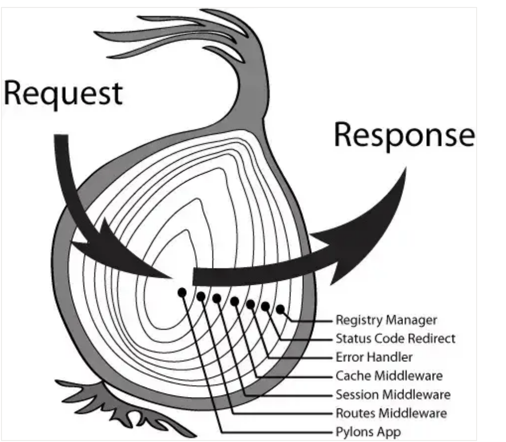
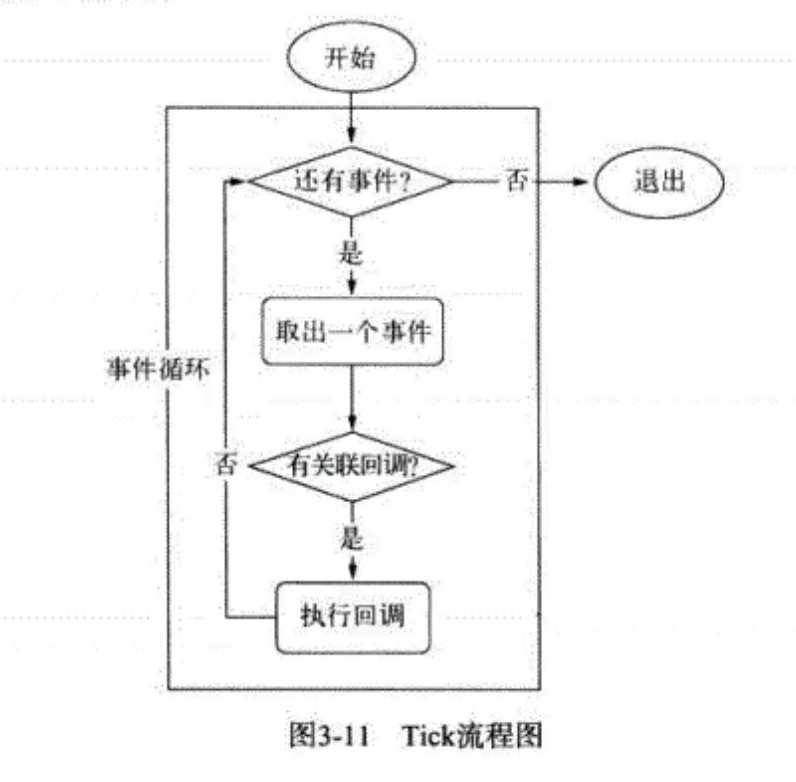
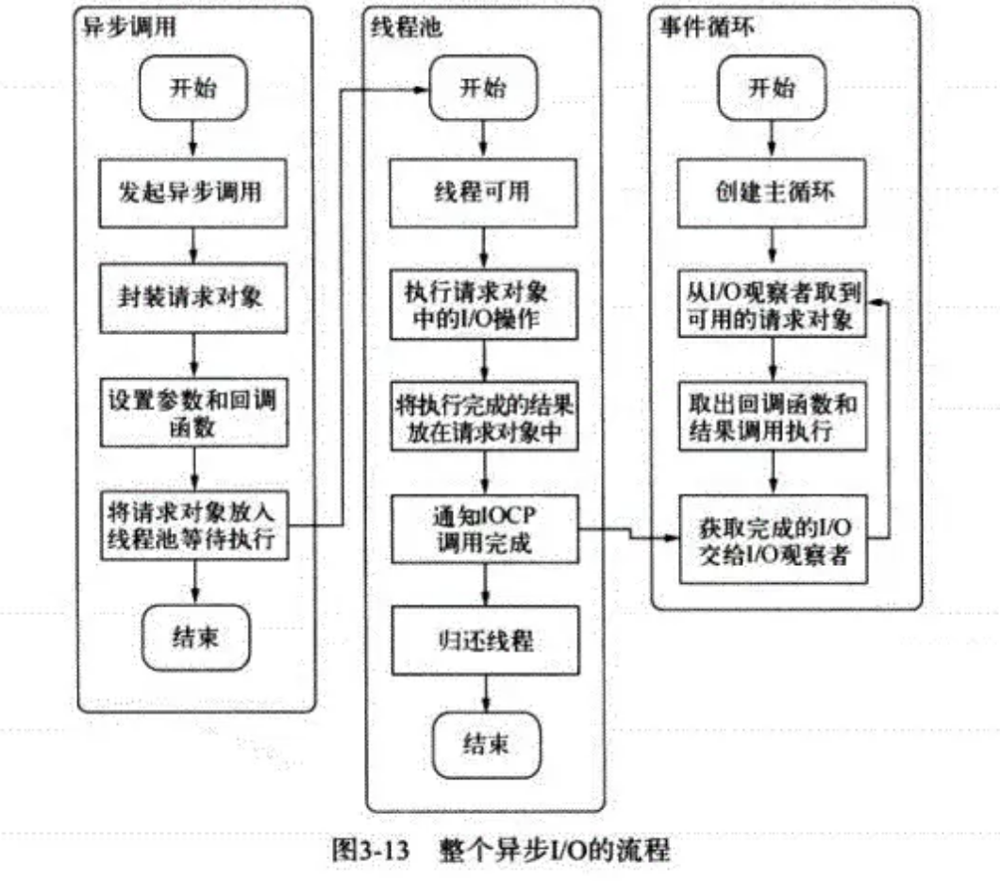
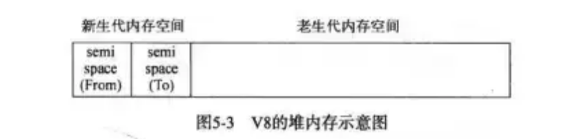
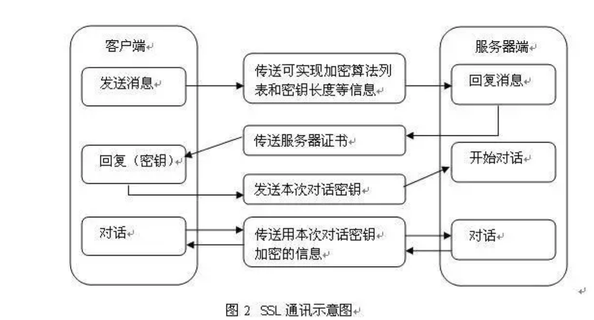
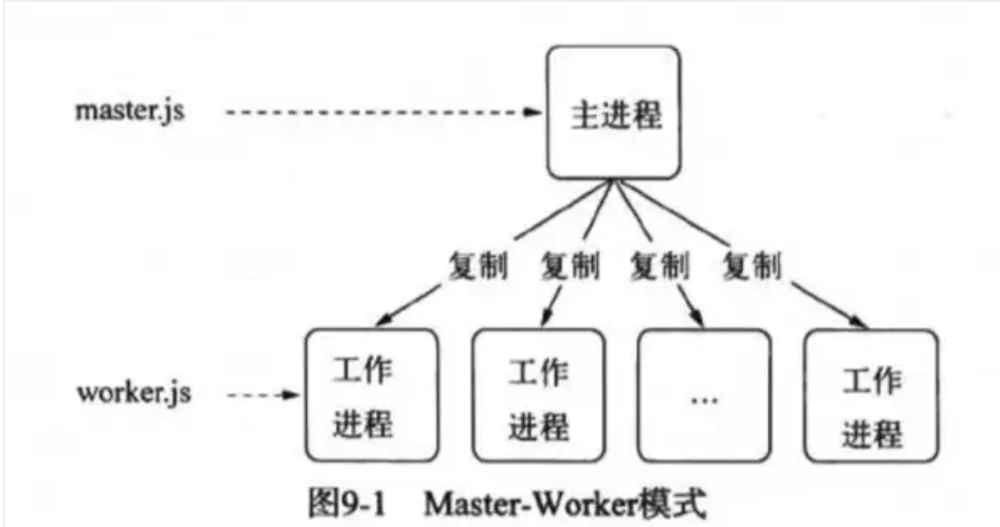
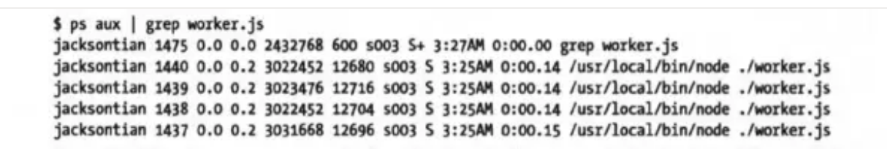

> 当面试官问你`node`的时候，更多引导面试官用`node`做前端工程化，去引导到`webpack`、`npm`、打包工具上面去说说自己的想法，不要引导到自己会后端，后台不是会一点`node`语法就能写的

## 1 package.json 版本号规则

**major.minor.patch**

- 主版本号.次版本号.修补版本号
- `patch`：修复`bug`，兼容老版本
- `minor`：新增功能，兼容老版本
- `major`：新的架构调整，不兼容老版本

**~和^的区别**

- `~`会匹配最近的小版本依赖包，比如`~1.2.3`会匹配所有`1.2.x`版本，但是不包括`1.3.0`
- `^`会匹配最新的大版本依赖包，比如`^1.2.3`会匹配所有`1.x.x`的包，包括`1.3.0`，但是不包括`2.0.0`

## 2 npm 模块安装机制

- 发出 `npm install` 命令 `1` 查询 `node_modules` 目录之中是否已经存在指定模块
- 若存在，不再重新安装
- 若不存在
- `npm` 向 `registry` 查询模块压缩包的网址
- 下载压缩包，存放在根目录下的`.npm` 目录里
- 解压压缩包到当前项目的 `node_modules` 目录

## 3 模块化的差异 AMD CMD COMMONJS ESMODULE

- `AMD`是依赖前置，`define`写法
- `CMD` 语法`require`
- `AMD`和`CMD`是动态引入，运行时才知道的
- `ESMODULE`是静态引入，好处方便`wepback`打包依赖图谱分析
- `CommonJs` 是单个值导出，`ES6 Module` 可以导出多个
- `CommonJs` 是动态语法可以写在判断里，`ES6 Module` 静态语法只能写在顶层
- `CommonJs` 的 `this` 是当前模块，`ES6 Module`的 `this` 是 `undefined`

## 4 Node 的 Event Loop: 6 个阶段

- `timer` 阶段: 执行到期的`setTimeout / setInterval`队列回调

- `I/O` 阶段: 执行上轮循环残流的`callback`

- `idle`, `prepare`

- `poll`: 等待回调

  - 1.  执行回调

  - 1.  执行定时器

    - 如有到期的`setTimeout / setInterval`， 则返回 `timer` 阶段
    - 如有`setImmediate`，则前往 `check` 阶段

- `check`

  - 执行`setImmediate`

- `close callbacks`

## 5 Koa 相关

### koa 洋葱模型怎么实现的

- 中间件执行就像洋葱一样，最早 use 的中间件，就放在最外层。处理顺序从左到右，左边接收一个 request，右边输出返回 response
- 一般的中间件都会执行两次，调用 next 之前为第一次，调用 next 时把控制传递给下游的下一个中间件。当下游不再有中间件或者没有执行 next 函数时，就将依次恢复上游中间件的行为，让上游中间件执行 next 之后的代码

例如下面这段代码

    const Koa = require('koa')
    const app = new Koa()
    app.use((ctx, next) => {
        console.log(1)
        next()
        console.log(3)
    })
    app.use((ctx) => {
        console.log(2)
    })
    app.listen(3001)
    //执行结果是1=>2=>3

> `app.use()` 把中间件函数存储在`middleware`数组中，最终会调用`koa-compose`导出的函数 compose 返回一个 promise，中间函数的第一个参数`ctx`是包含响应和请求的一个对象，会不断传递给下一个中间件。next 是一个函数，返回的是一个`promise`

**koa 中间件实现源码大致思路如下：**

    // 注意其中的compose函数，这个函数是实现中间件洋葱模型的关键
    // 场景模拟
    // 异步 promise 模拟
    const delay = async () => {
      return new Promise((resolve, reject) => {
        setTimeout(() => {
          resolve();
        }, 2000);
      });
    }
    // 中间间模拟
    const fn1 = async (ctx, next) => {
      console.log(1);
      await next();
      console.log(2);
    }
    const fn2 = async (ctx, next) => {
      console.log(3);
      await delay();
      await next();
      console.log(4);
    }
    const fn3 = async (ctx, next) => {
      console.log(5);
    }

    const middlewares = [fn1, fn2, fn3];

    // compose 实现洋葱模型
    const compose = (middlewares, ctx) => {
      const dispatch = (i) => {
        let fn = middlewares[i];
        if(!fn){ return Promise.resolve() }
        return Promise.resolve(fn(ctx, () => {
          return dispatch(i+1);
        }));
      }
      return dispatch(0);
    }

    compose(middlewares, 1);

### 如果中间件中的 next()方法报错了怎么办

> 中间件链错误会由`ctx.onerror`捕获，该函数中会调用`this.app.emit('error', err, this)`（因为 koa 继承自 events 模块，所以有'emit'和 on 等方法），可以使用`app.on('error', (err) => {})`，或者`app.onerror = (err) => {}`进行捕获。

### co 的原理是怎样的

> co 的原理是通过不断调用 generator 函数的`next`方法来达到自动执行 generator 函数的，类似 async、await 函数自动执行

## 6 Express、koa 实现原理以及对比

> 底层建立在`node.js`内置的 http 模块上。http 模块生成服务器的原始代码如下

    var http = require("http");

    var app = http.createServer(function(request, response) {
      response.writeHead(200, {"Content-Type": "text/plain"});
      response.end("Hello world!");
    });

    app.listen(3000, "localhost");

- `Express`框架的核心是对 http 模块的再包装
- `Express`框架等于在 http 模块之上，加了一个中间层
- 它最大的特点就是，一个中间件处理完，再传递给下一个中间件
- 比如自带 `Router`、路由规则等
- `callback`太多

**koa2 特点**

- 洋葱模型
- 没有自带路由，由 koa-router 管理
- 没有 callback

## 7 请介绍一下 require 的模块加载机制

这道题基本上就可以了解到面试者对 Node 模块机制的了解程度 基本上面试提到

- 先计算模块路径

- 如果模块在缓存里面，取出缓存

- 加载模块

- 输出模块的 `exports` 属性即可

  // require 其实内部调用 Module.\_load 方法
  Module.\_load = function(request, parent, isMain) {
  // 计算绝对路径
  var filename = Module.\_resolveFilename(request, parent);

  // 第一步：如果有缓存，取出缓存
  var cachedModule = Module.\_cache[filename];
  if (cachedModule) {
  return cachedModule.exports;

  // 第二步：是否为内置模块
  if (NativeModule.exists(filename)) {
  return NativeModule.require(filename);
  }

  /**\*\***\*\***\*\***\*\*\*\***\*\***\*\***\*\***这里注意了\***\*\*\*\*\*\*\***\*\*\***\*\*\*\*\*\*\***/
  // 第三步：生成模块实例，存入缓存
  // 这里的 Module 就是我们上面的 1.1 定义的 Module
  var module = new Module(filename, parent);
  Module.\_cache[filename] = module;

  /**\*\***\*\***\*\***\*\*\*\***\*\***\*\***\*\***这里注意了\***\*\*\*\*\*\*\***\*\*\***\*\*\*\*\*\*\***/
  // 第四步：加载模块
  // 下面的 module.load 实际上是 Module 原型上有一个方法叫 Module.prototype.load
  try {
  module.load(filename);
  hadException = false;
  } finally {
  if (hadException) {
  delete Module.\_cache[filename];
  }
  }

  // 第五步：输出模块的 exports 属性
  return module.exports;
  };

## 8 exports.xxx=xxx 和 Module.exports=\{\}有什么区别

`exports` 其实就是 `module.exports`

    // module.exports vs exports
    // 很多时候，你会看到，在Node环境中，有两种方法可以在一个模块中输出变量：

    // 方法一：对module.exports赋值：

    // hello.js

    function hello() {
        console.log('Hello, world!');
    }

    function greet(name) {
        console.log('Hello, ' + name + '!');
    }

    module.exports = {
        hello: hello,
        greet: greet
    };

    // 方法二：直接使用exports：

    // hello.js

    function hello() {
        console.log('Hello, world!');
    }

    function greet(name) {
        console.log('Hello, ' + name + '!');
    }

    function hello() {
        console.log('Hello, world!');
    }

    exports.hello = hello;
    exports.greet = greet;

    // 但是你不可以直接对exports赋值：

    // 代码可以执行，但是模块并没有输出任何变量:
    exports = {
        hello: hello,
        greet: greet
    };

    // 如果你对上面的写法感到十分困惑，不要着急，我们来分析Node的加载机制：

    // 首先，Node会把整个待加载的hello.js文件放入一个包装函数load中执行。在执行这个load()函数前，Node准备好了module变量：

    var module = {
        id: 'hello',
        exports: {}
    };

    // load()函数最终返回module.exports：

    var load = function (exports, module) {
        // hello.js的文件内容
        ...
        // load函数返回:
        return module.exports;
    };

    var exportes = load(module.exports, module);

    // 也就是说，默认情况下，Node准备的exports变量和module.exports变量实际上是同一个变量，并且初始化为空对象{}，于是，我们可以写：

    exports.foo = function () { return 'foo'; };
    exports.bar = function () { return 'bar'; };

    // 也可以写：

    module.exports.foo = function () { return 'foo'; };
    module.exports.bar = function () { return 'bar'; };

    // 换句话说，Node默认给你准备了一个空对象{}，这样你可以直接往里面加东西。

    // 但是，如果我们要输出的是一个函数或数组，那么，只能给module.exports赋值：

    module.exports = function () { return 'foo'; };

    // 给exports赋值是无效的，因为赋值后，module.exports仍然是空对象{}。

    // 结论

    // 如果要输出一个键值对象{}，可以利用exports这个已存在的空对象{}，并继续在上面添加新的键值；
    // 如果要输出一个函数或数组，必须直接对module.exports对象赋值。
    // 所以我们可以得出结论：直接对module.exports赋值，可以应对任何情况：

    module.exports = {
        foo: function () { return 'foo'; }
    };

    // 或者：

    module.exports = function () { return 'foo'; };

    // 最终，我们强烈建议使用module.exports = xxx的方式来输出模块变量，这样，你只需要记忆一种方法。

## 9 Node 的异步 I/O

### 请介绍一下 Node 事件循环的流程

- 在进程启动时，Node 便会创建一个类似于 while(true)的循环，每执行一次循环体的过程我们成为 Tick。
- 每个 Tick 的过程就是查看是否有事件待处理。如果有就取出事件及其相关的回调函数。然后进入下一个循环，如果不再有事件处理，就退出进程。

### 在每个 tick 的过程中，如何判断是否有事件需要处理呢

- 每个事件循环中有一个或者多个观察者，而判断是否有事件需要处理的过程就是向这些观察者询问是否有要处理的事件。
- 在 Node 中，事件主要来源于网络请求、文件的 I/O 等，这些事件对应的观察者有文件 I/O 观察者，网络 I/O 的观察者。
- 事件循环是一个典型的生产者/消费者模型。异步 I/O，网络请求等则是事件的生产者，源源不断为 Node 提供不同类型的事件，这些事件被传递到对应的观察者那里，事件循环则从观察者那里取出事件并处理。
- 在 windows 下，这个循环基于 IOCP 创建，在\*nix 下则基于多线程创建

### 描述一下整个异步 I/O 的流程

## 10 V8 的垃圾回收机制

### 如何查看 V8 的内存使用情况

使用 `process.memoryUsage()`,返回如下

    {
      rss: 4935680,
      heapTotal: 1826816,
      heapUsed: 650472,
      external: 49879
    }

> `heapTotal` 和 `heapUsed` 代表 `V8` 的内存使用情况。`external` 代表 `V8` 管理的，绑定到 Javascript 的 C++对象的内存使用情况。rss, 驻留集大小, 是给这个进程分配了多少物理内存(占总分配内存的一部分) 这些物理内存中包含堆，栈，和代码段。

### V8 的内存限制是多少，为什么 V8 这样设计

> 64 位系统下是 `1.4GB`， 32 位系统下是 `0.7GB`。因为 `1.5GB`的垃圾回收堆内存，V8 需要花费 50 毫秒以上，做一次非增量式的垃圾回收甚至要 1 秒以上。这是垃圾回收中引起 Javascript 线程暂停执行的事件，在这样的花销下，应用的性能和影响力都会直线下降。

### V8 的内存分代和回收算法请简单讲一讲

> 在 V8 中，主要将内存分为新生代和老生代两代。新生代中的对象存活时间较短的对象，老生代中的对象存活时间较长，或常驻内存的对象。

**新生代**

> 新生代中的对象主要通过 Scavenge 算法进行垃圾回收。这是一种采用复制的方式实现的垃圾回收算法。它将堆内存一份为二，每一部分空间成为 semispace。在这两个 semispace 空间中，只有一个处于使用中，另一个处于闲置状态。处于使用状态的 semispace 空间称为 From 空间，处于闲置状态的空间称为 To 空间

- 当开始垃圾回收的时候，会检查 From 空间中的存活对象，这些存活对象将被复制到 To 空间中，而非存活对象占用的空间将会被释放。完成复制后，From 空间和 To 空间发生角色对换。
- 应为新生代中对象的生命周期比较短，就比较适合这个算法。
- 当一个对象经过多次复制依然存活，它将会被认为是生命周期较长的对象。这种新生代中生命周期较长的对象随后会被移到老生代中。

**老生代**

> 老生代主要采取的是标记清除的垃圾回收算法。与 Scavenge 复制活着的对象不同，标记清除算法在标记阶段遍历堆中的所有对象，并标记活着的对象，只清理死亡对象。活对象在新生代中只占叫小部分，死对象在老生代中只占较小部分，这是为什么采用标记清除算法的原因

**标记清楚算法的问题**

主要问题是每一次进行标记清除回收后，内存空间会出现不连续的状态

- 这种内存碎片会对后续内存分配造成问题，很可能出现需要分配一个大对象的情况，这时所有的碎片空间都无法完成此次分配，就会提前触发垃圾回收，而这次回收是不必要的。
- 为了解决碎片问题，标记整理被提出来。就是在对象被标记死亡后，在整理的过程中，将活着的对象往一端移动，移动完成后，直接清理掉边界外的内存。

**哪些情况会造成 V8 无法立即回收内存**

闭包和全局变量

**请谈一下内存泄漏是什么，以及常见内存泄漏的原因，和排查的方法**

1.  什么是内存泄漏

- 内存泄漏(Memory Leak)指由于疏忽或错误造成程序未能释放已经不再使用的内存的情况。
- 如果内存泄漏的位置比较关键，那么随着处理的进行可能持有越来越多的无用内存，这些无用的内存变多会引起服务器响应速度变慢。
- 严重的情况下导致内存达到某个极限(可能是进程的上限，如 v8 的上限;也可能是系统可提供的内存上限)会使得应用程序崩溃。常见内存泄漏的原因 内存泄漏的几种情况:

全局变量

    a = 10;
    //未声明对象。
    global.b = 11;
    //全局变量引用
    // 这种比较简单的原因，全局变量直接挂在 root 对象上，不会被清除掉。

闭包

    function out() {
        const bigData = new Buffer(100);
        inner = function () {

        }
    }

> 闭包会引用到父级函数中的变量，如果闭包未释放，就会导致内存泄漏。上面例子是 inner 直接挂在了 root 上，那么每次执行 out 函数所产生的 bigData 都不会释放，从而导致内存泄漏。需要注意的是，这里举得例子只是简单的将引用挂在全局对象上，实际的业务情况可能是挂在某个可以从 root 追溯到的对象上导致的

事件监听

> Node.js 的事件监听也可能出现的内存泄漏。例如对同一个事件重复监听，忘记移除(removeListener)，将造成内存泄漏。这种情况很容易在复用对象上添加事件时出现，所以事件重复监听可能收到如下警告

    emitter.setMaxListeners() to increase limit

**排查方法想要定位内存泄漏，通常会有两种情况**

- 对于只要正常使用就可以重现的内存泄漏，这是很简单的情况只要在测试环境模拟就可以排查了。
- 对于偶然的内存泄漏，一般会与特殊的输入有关系。想稳定重现这种输入是很耗时的过程。如果不能通过代码的日志定位到这个特殊的输入，那么推荐去生产环境打印内存快照了。
- 需要注意的是，打印内存快照是很耗 CPU 的操作，可能会对线上业务造成影响。快照工具推荐使用 heapdump 用来保存内存快照，使用 devtool 来查看内存快照。
- 使用 heapdump 保存内存快照时，只会有 Node.js 环境中的对象，不会受到干扰(如果使用 node-inspector 的话，快照中会有前端的变量干扰)。

> PS：安装 heapdump 在某些 Node.js 版本上可能出错，建议使用 `npm install heapdump -target=Node.js` 版本来安装。

## 11 Buffer 模块

### 新建 Buffer 会占用 V8 分配的内存吗

不会，Buffer 属于堆外内存，不是 V8 分配的。

### Buffer.alloc 和 Buffer.allocUnsafe 的区别

> `Buffer.allocUnsafe` 创建的 Buffer 实例的底层内存是未初始化的。新创建的 Buffer 的内容是未知的，可能包含敏感数据。使用 Buffer.alloc() 可以创建以零初始化的 Buffer 实例。

### Buffer 的内存分配机制

- 为了高效的使用申请来的内存，Node 采用了 slab 分配机制。slab 是一种动态的内存管理机制。Node 以 8kb 为界限来来区分 Buffer 为大对象还是小对象，如果是小于 8kb 就是小 `Buffer`，大于 8kb 就是大 Buffer。例如第一次分配一个 1024 字节的 Buffer，`Buffer.alloc(1024)`,那么这次分配就会- 用到一个 slab，接着如果继续 `Buffer.alloc(1024)`,那么上一次用的 slab 的空间还没有用完，因为总共是 8kb，`1024+1024 = 2048` 个字节，没有 8kb，所以就继续用这个 slab 给 Buffer 分配空间。如果超过 8kb，那么直接用 C++底层地宫的 `SlowBuffer` 来给 `Buffer` 对象提供空间。

### Buffer 乱码问题

例如一个份文件 test.md 里的内容如下：

    床前明月光，疑是地上霜，举头望明月，低头思故乡

我们这样读取就会出现乱码：

    var rs = require('fs').createReadStream('test.md', {highWaterMark: 11});
    // 床前明???光，疑???地上霜，举头???明月，???头思故乡

一般情况下，只需要设置 `rs.setEncoding('utf8')` 即可解决乱码问题

## 12 webSocket

### webSocket 与传统的 http 有什么优势

- 客户端与服务器只需要一个 TCP 连接，比 `http` 长轮询使用更少的连接
- `webSocket` 服务端可以推送数据到客户端
- 更轻量的协议头，减少数据传输量

### webSocket 协议升级简述一下

> 首先，WebSocket 连接必须由浏览器发起，因为请求协议是一个标准的 HTTP 请求，格式如下：

    GET ws://localhost:3000/ws/chat HTTP/1.1
    Host: localhost
    Upgrade: websocket
    Connection: Upgrade
    Origin: http://localhost:3000
    Sec-WebSocket-Key: client-random-string
    Sec-WebSocket-Version: 13

该请求和普通的 HTTP 请求有几点不同：

- `GET` 请求的地址不是类似`/path/`，而是以 `ws://开头的地址`；
- 请求头 `Upgrade: websocket` 和 `Connection: Upgrade`表示这个连接将要被转换为 `WebSocket` 连接；
- `Sec-WebSocket-Key` 是用于标识这个连接，并非用于加密数据；
- `Sec-WebSocket-Version` 指定了 `WebSocket` 的协议版本。

随后，服务器如果接受该请求，就会返回如下响应：

    HTTP/1.1 101 Switching Protocols
    Upgrade: websocket
    Connection: Upgrade
    Sec-WebSocket-Accept: server-random-string

该响应代码 `101` 表示本次连接的 `HTTP` 协议即将被更改，更改后的协议就是 `Upgrade: websocket` 指定的 `WebSocket` 协议

## 13 https

### https 用哪些端口进行通信，这些端口分别有什么用

- `443` 端口用来验证服务器端和客户端的身份，比如验证证书的合法性
- `80` 端口用来传输数据（在验证身份合法的情况下，用来数据传输）

### 身份验证过程中会涉及到密钥， 对称加密，非对称加密，摘要的概念，请解释一下

- **密钥**：密钥是一种参数，它是在明文转换为密文或将密文转换为明文的算法中输入的参数。密钥分为对称密钥与非对称密钥，分别应用在对称加密和非对称加密上。
- **对称加密**：对称加密又叫做私钥加密，即信息的发送方和接收方使用同一个密钥去加密和解密数据。对称加密的特点是算法公开、加密和解密速度快，适合于对大数据量进行加密，常见的对称加密算法有 `DES、3DES、TDEA、Blowfish、RC5` 和 `IDEA`。
- **非对称加密**：非对称加密也叫做公钥加密。非对称加密与对称加密相比，其安全性更好。对称加密的通信双方使用相同的密钥，如果一方的密钥遭泄露，那么整个通信就会被破解。而非对称加密使用一对密钥，即公钥和私钥，且二者成对出现。私钥被自己保存，不能对外泄露。公钥指的是公共的密钥，任何人都可以获得该密钥。用公钥或私钥中的任何一个进行加密，用另一个进行解密。
- **摘要**：摘要算法又称哈希/散列算法。它通过一个函数，把任意长度的数据转换为一个长度固定的数据串（通常用 16 进制的字符串表示）。算法不可逆。

### 为什么需要 CA 机构对证书签名

> 如果不签名会存在中间人攻击的风险，签名之后保证了证书里的信息，比如公钥、服务器信息、企业信息等不被篡改，能够验证客户端和服务器端的“合法性”。

### https 验证身份也就是 TSL/SSL 身份验证的过程

## 14 进程通信

### 请简述一下 node 的多进程架构

> 面对 node 单线程对多核 CPU 使用不足的情况，Node 提供了 `child_process` 模块，来实现进程的复制，node 的多进程架构是主从模式，如下所示：

    var fork = require('child_process').fork;
    var cpus = require('os').cpus();
    for(var i = 0; i < cpus.length; i++){
        fork('./worker.js');
    }

> 在 linux 中，我们通过 `ps aux | grep worker.js` 查看进程

这就是著名的主从模式，`Master-Worker`

### 请问创建子进程的方法有哪些，简单说一下它们的区别

- `spawn()`：启动一个子进程来执行命令
- `exec()`: 启动一个子进程来执行命令，与 spawn()不同的是其接口不同，它有一个回调函数获知子进程的状况
- `execFlie()`: 启动一个子进程来执行可执行文件
- `fork()`: 与 `spawn()`类似，不同电在于它创建 Node 子进程需要执行 js 文件
- `spawn()`与 `exec()`、`execFile()`不同的是，后两者创建时可以指定 `timeout` 属性设置超时时间，一旦创建的进程超过设定的时间就会被杀死
- `exec()`与 `execFile()`不同的是，`exec()`适合执行已有命令，`execFile()`适合执行文件。

### 实现一个 node 子进程被杀死，然后自动重启代码的思路

在创建子进程的时候就让子进程监听 `exit` 事件，如果被杀死就重新 `fork` 一下

    var createWorker = function(){
        var worker = fork(__dirname + 'worker.js')
        worker.on('exit', function(){
            console.log('Worker' + worker.pid + 'exited');
            // 如果退出就创建新的worker
            createWorker()
        })
    }
