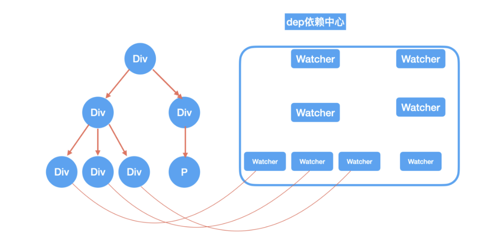
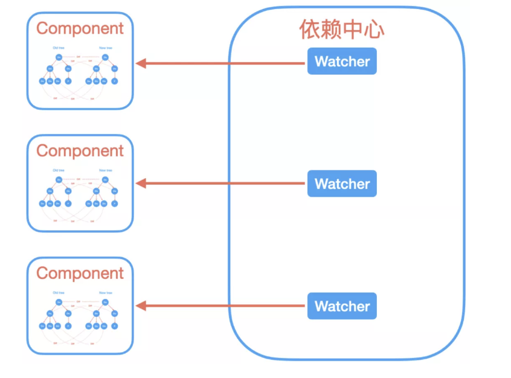
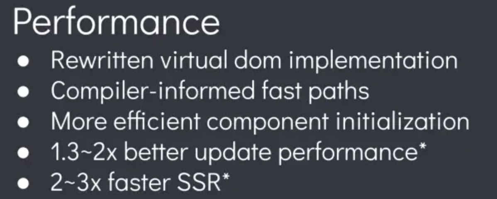

## 1 性能优化方式

### 1.1 DNS 预解析

- `DNS` 解析也是需要时间的，可以通过预解析的方式来预先获得域名所对应的 `IP`

  <link rel="dns-prefetch" href="//blog.poetries.top">

### 1.2 缓存

- 缓存对于前端性能优化来说是个很重要的点，良好的缓存策略可以降低资源的重复加载提高网页的整体加载速度
- 通常浏览器缓存策略分为两种：强缓存和协商缓存

**强缓存**

> 实现强缓存可以通过两种响应头实现：`Expires`和 `Cache-Control` 。强缓存表示在缓存期间不需要请求，`state code`为 `200`

    Expires: Wed, 22 Oct 2018 08:41:00 GMT

> `Expires` 是 `HTTP / 1.0` 的产物，表示资源会在 `Wed, 22 Oct 2018 08:41:00 GMT` 后过期，需要再次请求。并且 `Expires` 受限于本地时间，如果修改了本地时间，可能会造成缓存失效

    Cache-control: max-age=30

> `Cache-Control` 出现于 `HTTP / 1.1`，优先级高于 `Expires` 。该属性表示资源会在 `30` 秒后过期，需要再次请求

**协商缓存**

- 如果缓存过期了，我们就可以使用协商缓存来解决问题。协商缓存需要请求，如果缓存有效会返回 304
- 协商缓存需要客户端和服务端共同实现，和强缓存一样，也有两种实现方式

`Last-Modified` 和 `If-Modified-Since`

- `Last-Modified` 表示本地文件最后修改日期，`If-Modified-Since` 会将 `Last-Modified`的值发送给服务器，询问服务器在该日期后资源是否有更新，有更新的话就会将新的资源发送回来
- 但是如果在本地打开缓存文件，就会造成 `Last-Modified` 被修改，所以在 `HTTP / 1.1` 出现了 `ETag`

`ETag` 和 `If-None-Match`

- `ETag` 类似于文件指纹，`If-None-Match` 会将当前 `ETag` 发送给服务器，询问该资源 ETag 是否变动，有变动的话就将新的资源发送回来。并且 `ETag` 优先级比 `Last-Modified` 高

**选择合适的缓存策略**

> 对于大部分的场景都可以使用强缓存配合协商缓存解决，但是在一些特殊的地方可能需要选择特殊的缓存策略

- 对于某些不需要缓存的资源，可以使用 `Cache-control: no-store` ，表示该资源不需要缓存
- 对于频繁变动的资源，可以使用 `Cache-Control: no-cache` 并配合 `ETag` 使用，表示该资源已被缓存，但是每次都会发送请求询问资源是否更新。
- 对于代码文件来说，通常使用 `Cache-Control: max-age=31536000` 并配合策略缓存使用，然后对文件进行指纹处理，一旦文件名变动就会立刻下载新的文件

### 1.3 使用 HTTP / 2.0

- 因为浏览器会有并发请求限制，在 `HTTP / 1.1` 时代，每个请求都需要建立和断开，消耗了好几个 `RTT` 时间，并且由于 `TCP` 慢启动的原因，加载体积大的文件会需要更多的时间
- 在 `HTTP / 2.0` 中引入了多路复用，能够让多个请求使用同一个 `TCP` 链接，极大的加快了网页的加载速度。并且还支持 `Header` 压缩，进一步的减少了请求的数据大小

### 1.4 预加载

- 在开发中，可能会遇到这样的情况。有些资源不需要马上用到，但是希望尽早获取，这时候就可以使用预加载

- 预加载其实是声明式的 `fetch` ，强制浏览器请求资源，并且不会阻塞 `onload` 事件，可以使用以下代码开启预加载

  <link rel="preload" href="http://example.com">

> 预加载可以一定程度上降低首屏的加载时间，因为可以将一些不影响首屏但重要的文件延后加载，唯一缺点就是兼容性不好

### 1.5 预渲染

> 可以通过预渲染将下载的文件预先在后台渲染，可以使用以下代码开启预渲染

    <link rel="prerender" href="http://poetries.com">

- 预渲染虽然可以提高页面的加载速度，但是要确保该页面百分百会被用户在之后打开，否则就白白浪费资源去渲染

### 1.6 懒执行与懒加载

**懒执行**

- 懒执行就是将某些逻辑延迟到使用时再计算。该技术可以用于首屏优化，对于某些耗时逻辑并不需要在首屏就使用的，就可以使用懒执行。懒执行需要唤醒，一般可以通过定时器或者事件的调用来唤醒

**懒加载**

- 懒加载就是将不关键的资源延后加载

> 懒加载的原理就是只加载自定义区域（通常是可视区域，但也可以是即将进入可视区域）内需要加载的东西。对于图片来说，先设置图片标签的 `src` 属性为一张占位图，将真实的图片资源放入一个自定义属性中，当进入自定义区域时，就将自定义属性替换为 `src` 属性，这样图片就会去下载资源，实现了图片懒加载

- 懒加载不仅可以用于图片，也可以使用在别的资源上。比如进入可视区域才开始播放视频等

### 1.7 文件优化

**图片优化**

> 对于如何优化图片，有 2 个思路

- 减少像素点
- 减少每个像素点能够显示的颜色

**图片加载优化**

- 不用图片。很多时候会使用到很多修饰类图片，其实这类修饰图片完全可以用 `CSS` 去代替。
- 对于移动端来说，屏幕宽度就那么点，完全没有必要去加载原图浪费带宽。一般图片都用 CDN 加载，可以计算出适配屏幕的宽度，然后去请求相应裁剪好的图片
- 小图使用 `base64`格式
- 将多个图标文件整合到一张图片中（雪碧图）
- 选择正确的图片格式：

  - 对于能够显示 `WebP` 格式的浏览器尽量使用 `WebP` 格式。因为 `WebP` 格式具有更好的图像数据压缩算法，能带来更小的图片体积，而且拥有肉眼识别无差异的图像质量，缺点就是兼容性并不好
  - 小图使用 `PNG`，其实对于大部分图标这类图片，完全可以使用 `SVG` 代替
  - 照片使用 `JPEG`

**其他文件优化**

- `CSS`文件放在 `head` 中
- 服务端开启文件压缩功能
- 将 `script` 标签放在 `body` 底部，因为 `JS` 文件执行会阻塞渲染。当然也可以把 `script` 标签放在任意位置然后加上 `defer` ，表示该文件会并行下载，但是会放到 `HTML` 解析完成后顺序执行。对于没有任何依赖的 `JS`文件可以加上 `async` ，表示加载和渲染后续文档元素的过程将和 `JS` 文件的加载与执行并行无序进行。 执行 `JS`代码过长会卡住渲染，对于需要很多时间计算的代码
- 可以考虑使用 `Webworker`。`Webworker`可以让我们另开一个线程执行脚本而不影响渲染。

**CDN**

> 静态资源尽量使用 `CDN` 加载，由于浏览器对于单个域名有并发请求上限，可以考虑使用多个 `CDN` 域名。对于 `CDN` 加载静态资源需要注意 `CDN` 域名要与主站不同，否则每次请求都会带上主站的 `Cookie`

### 1.8 其他

**使用 Webpack 优化项目**

- 对于 `Webpack4`，打包项目使用 `production` 模式，这样会自动开启代码压缩
- 使用 `ES6` 模块来开启 `tree shaking`，这个技术可以移除没有使用的代码
- 优化图片，对于小图可以使用 `base64` 的方式写入文件中
- 按照路由拆分代码，实现按需加载
- 给打包出来的文件名添加哈希，实现浏览器缓存文件

**监控**

> 对于代码运行错误，通常的办法是使用 `window.onerror` 拦截报错。该方法能拦截到大部分的详细报错信息，但是也有例外

- 对于跨域的代码运行错误会显示 `Script error`. 对于这种情况我们需要给 `script` 标签添加 `crossorigin` 属性
- 对于某些浏览器可能不会显示调用栈信息，这种情况可以通过 `arguments.callee.caller` 来做栈递归
- 对于异步代码来说，可以使用 `catch` 的方式捕获错误。比如 `Promise` 可以直接使用 catch 函数，`async await` 可以使用 `try catch`
- 但是要注意线上运行的代码都是压缩过的，需要在打包时生成 `sourceMap` 文件便于 `debug`。
- 对于捕获的错误需要上传给服务器，通常可以通过 `img` 标签的 `src`发起一个请求

## 2 首屏渲染优化

- css / js 分割，使首屏依赖的文件体积最小，内联首屏关键 css / js；
- 非关键性的文件尽可能的 异步加载和懒加载，避免阻塞首页渲染；
- 使用 dns-prefetch / preconnect / prefetch / preload 等浏览器提供的资源提示，加快文件传输；
- 谨慎控制好 Web 字体，一个大字体包足够让你功亏一篑

  - 控制字体包的加载时机；
  - 如果使用的字体有限，那尽可能只将使用的文字单独打包，能有效减少体积； 合理利用 Localstorage / server-worker 等存储方式进行 数据与资源缓存

- **分清轻重缓急**

  - 重要的元素优先渲染；
  - 视窗内的元素优先渲染

- **服务端渲染(SSR)**:

  - 减少首屏需要的数据量，剔除冗余数据和请求；
  - 控制好缓存，对数据/页面进行合理的缓存；
  - 页面的请求使用流的形式进行传递；

- **优化用户感知**

  - 利用一些动画 过渡效果，能有效减少用户对卡顿的感知；
  - 尽可能利用 骨架屏(Placeholder) / Loading 等减少用户对白屏的感知；
  - 动画帧数尽量保证在 30 帧 以上，低帧数、卡顿的动画宁愿不要；
  - js 执行时间避免超过 100ms，超过的话就需要做

    - 寻找可 缓存 的点
    - 任务的 分割异步 或 web worker 执行

**移动端的性能优化**

1.  首屏加载和按需加载，懒加载
2.  资源预加载
3.  图片压缩处理，使用`base64`内嵌图片
4.  合理缓存 dom 对象
5.  使用`touchstart`代替`click`（`click 300`毫秒的延迟）
6.  利用`transform:translateZ(0)`，开启硬件 GUP 加速
7.  不滥用 web 字体，不滥用`float`（布局计算消耗性能），减少`font-size`声明
8.  使用`viewport`固定屏幕渲染，加速页面渲染内容
9.  尽量使用事件代理，避免直接事件绑定

## 3 页面基础优化

- 引入位置: css 文件`<head>`中引入， js 文件`<body>`底部引入

  - 影响首屏的，优先级很高的 js 也可以头部引入，甚至内联

- **减少请求** (http 1.0 - 1.1)，合并请求，正确设置 http 缓存
- **减少文件体积**

  - **删除多余代码:**

    - tree-shaking
    - UglifyJs
    - code-spliting

  - 混淆 / 压缩代码，开启 gzip 压缩；
  - 多份编译文件按条件引入

    - 针对现代浏览器直接给 ES6 文件，只针对低端浏览器引用编译后的 ES5 文件
    - 可以利用`<script type="module"> / <script type="module">`进行条件引入用

  - 动态 `polyfill`，只针对不支持的浏览器引入 `polyfill；`

- 图片优化:

  - 根据业务场景，与 UI 探讨选择 合适质量，合适尺寸；
  - 根据需求和平台，选择 合适格式，例如非透明时可用 jpg；非苹果端，使用 webp；
  - 小图片合成 雪碧图，低于 5K 的图片可以转换成 base64 内嵌
  - 合适场景下，使用 `iconfont` 或者 `svg`；

- **使用缓存**

  - **浏览器缓存**: 通过设置请求的过期时间，合理运用浏览器缓存；
  - **CDN 缓存**: 静态文件合理使用 CDN 缓存技术

    - HTML 放于自己的服务器上；
    - 打包后的图片 / js / css 等资源上传到 CDN 上，文件带上 hash 值；
    - 由于浏览器对单个域名请求的限制，可以将资源放在多个不同域的 CDN 上，可以绕开该限制；

  - **服务器缓存**: 将不变的数据、页面缓存到 内存 或 远程存储(redis 等) 上
  - **数据缓存**: 通过各种存储将不常变的数据进行缓存，缩短数据的获取时间

## 4 性能优化方向

> 前端性能优化分为两个方向，一是工程化方向，另一个是细节方向

### 4.1 工程化方向

- 客户端 Gzip 离线包，服务器资源 Gzip 压缩。
- JS 瘦身，`Tree shaking`，`ES Module`，动态`Import`，动态`Polyfill`
- 图片加载优化，`Webp`，考虑兼容性，可以提前加载一张图片，嗅探是否支持`Webp`
- 服务端渲染，客户端预渲染
- CDN 静态资源
- `Webpack Dll`，通用优先打包抽离，利用浏览器缓存
- 骨架图
- 数据预取，包括接口数据，和加载详情页图片
- Webpack 本身提供的优化，Base64，资源压缩，Tree shaking，拆包 chunk
- 减少重定向

### 4.2 细节方向

- 图片，图片占位，图片懒加载。 雪碧图
- 使用 `prefetch / preload` 预加载等新特性

  - `Preload` 来告诉浏览器预先请求当前页需要的资源，从而提高这些资源的请求优先级。比如，对于那些本来请求优先级较低的关键请求，我们可以通过设置 `Preload` 来提升这些请求的优先级
  - `Prefetch` 来告诉浏览器用户将来可能在其他页面（非本页面）可能使用到的资源，那么浏览器会在空闲时，就去预先加载这些资源放在 `http` 缓存内，最常见的 `dns-prefetch`。比如，当我们在浏览 A 页面，如果会通过 A 页面中的链接跳转到 B 页面，而 B 页面中我们有些资源希望尽早提前加载，那么我们就可以在 A 页面里添加这些资源 `Prefetch` ，那么当浏览器空闲时，就会去加载这些资源
  - 所以，对于那些可能在当前页面使用到的资源可以利用 `Preload`，而对一些可能在将来的某些页面中被使用的资源可以利用 `Prefetch`。如果从加载优先级上看，`Preload` 会提升请求优先级；而`Prefetch`会把资源的优先级放在最低，当浏览器空闲时才去预加载

- 服务器合理设置缓存策略
- `async`（加载完当前 js 立即执行）/ `defer`(所有资源加载完之后执行 js)
- 减少 Dom 的操作，减少重排重绘
- 从客户端层面，首屏减少和客户端交互，合并接口请求
- 数据缓存
- 首页不加载不可视组件
- 防止渲染抖动，控制时序
- 减少组件层级
- 优先使用 Flex 布局

## 5 长列表优化

### vue-virtual-scroll-list 优化长列表

> 虚拟列表的实现原理：只渲染可视区的 dom 节点，其余不可见的数据卷起来，只会渲染可视区域的 dom 节点，提高渲染性能及流畅性，优点是支持海量数据的渲染；

github 地址：https://github.com/tangbc/vue-virtual-scroll-list

### Object.freeze 优化长列表

- `Object.freeze()`方法可以冻结一个对象。一个被冻结的对象再也不能被修改；冻结了一个对象则不能向这个对象添加新的属性，不能删除已有属性，不能修改该对象已有属性的可枚举性、可配置性、可写性，以及不能修改已有属性的值。
- 对于`data()`或 vuex 中冻结的对象，vue 不会做`getter`和`setter`的转换。因此对于一个不变的、大数据量的数组或 Object 数据来说，使用`Object.freeze()`可以有效地提升性能。

## 6 卡顿问题解决

- CSS 动画效率比 JS 高，`css`可以用`GPU`加速，`3d`加速。如果非要用 JS 动画，可以用`requestAnimationFrame`
- 批量进行 DOM 操作，固定图片容器大小，避免屏幕抖动
- 减少重绘重排
- 节流和防抖
- 减少临时大对象产生，利用对象缓存，主要是减少内存碎片
- 异步操作，`IntersectionObserver`，`PostMessage`，`RequestIdleCallback`

## 7 编码优化

> 编码优化，指的就是 在代码编写时的，通过一些 最佳实践，提升代码的执行性能。通常这并不会带来非常大的收益，但这属于 程序猿的自我修养，而且这也是面试中经常被问到的一个方面，考察自我管理与细节的处理。

**数据读取:**

- 通过作用域链 / 原型链 读取变量或方法时，需要更多的耗时，且越长越慢
- 对象嵌套越深，读取值也越慢；
- 最佳实践

  - 尽量在局部作用域中进行 变量缓存；
  - 避免嵌套过深的数据结构，数据扁平化 有利于数据的读取和维护

**循环**: 循环通常是编码性能的关键点；

- 代码的性能问题会再循环中被指数倍放大
- 最佳实践

  - 尽可能 减少循环次数

    - 减少遍历的数据量；
    - 完成目的后马上结束循环

  - 避免在循环中执行大量的运算，避免重复计算，相同的执行结果应该使用缓存；
  - js 中使用 倒序循环 会略微提升性能；
  - 尽量避免使用 for-in 循环，因为它会枚举原型对象，耗时大于普通循环；

**条件流程性能**: Map / Object > switch > if-else

    // 使用 if-else
    if(type === 1) {

    } else if (type === 2) {

    } else if (type === 3) {

    }

    // 使用 switch
    switch (type) {
    	case 1:
    		break;4
    	case 2:
    		break;
    	case 3:
    		break;
        default:
            break;
    }

    // 使用 Map
    const map = new Map([
    	[1, () => {}],
    	[2, () => {}],
    	[3, () => {}],
    ])
    map.get(type)()

    // 使用 Objext
    const obj = {
    	1: () => {},
    	2: () => {},
    	3: () => {},
    }
    obj[type]()

**减少 cookie 体积**: 能有效减少每次请求的体积和响应时间；

- 去除不必要的 `cookie`；
- 压缩 `cookie` 大小；
- 设置 `domain` 与 过期时间；

**dom 优化:**

- 减少访问 dom 的次数，如需多次，将 dom 缓存于变量中；
- 减少重绘与回流:

  - 多次操作合并为一次；
  - 减少对计算属性的访问

    - 例如 offsetTop， getComputedStyle 等
    - 因为浏览器需要获取最新准确的值，因此必须立即进行重排，这样会破坏了浏览器的队列整合，尽量将值进行缓存使用；

  - 大量操作时，可将 dom 脱离文档流或者隐藏，待操作完成后再重新恢复；
  - 使用 DocumentFragment / cloneNode / replaceChild 进行操作；

- 使用事件委托，避免大量的事件绑定；

**css 优化:**

- 层级扁平，避免过于多层级的选择器嵌套；
- 特定的选择器 好过一层一层查找: `.xxx-child-text{}` \- 优于 `.xxx .child .text{}`
- 减少使用通配符与属性选择器；
- 减少不必要的多余属性；
- 使用 动画属性实现动画，动画时脱离文档流，开启硬件加速，优先使用 css 动画；
- 使用 `<link>` 替代原生 `@import`；

**html 优化:**

- 减少 dom 数量，避免不必要的节点或嵌套
- 避免``空标签，能减少服务器压力，因为 src 为空时，浏览器仍然会发起请求

  - IE 向页面所在的目录发送请求；
  - Safari、Chrome、Firefox 向页面本身发送请求；
  - Opera 不执行任何操作。

- 图片提前 指定宽高 或者 脱离文档流，能有效减少因图片加载导致的页面回流；
- 语义化标签 有利于 SEO 与浏览器的解析时间；
- 减少使用 table 进行布局，避免使用` `与`
`

## 8 如何根据 chrome 的 timing 优化

### 8.1 性能优化 API

- `Performance`。`performance.now()`与`new Date()`区别，它是高精度的，且是相对时间，相对于页面加载的那一刻。但是不一定适合单页面场景
- `window.addEventListener("load", "");` `window.addEventListener("domContentLoaded", "");`
- `Img`的`onload`事件，监听首屏内的图片是否加载完成，判断首屏事件
- `RequestFrameAnmation` 和 `RequestIdleCallback`
- `IntersectionObserver`、`MutationObserver`，`PostMessage`
- `Web Worker`，耗时任务放在里面执行

### 8.2 检测工具

- `Chrome Dev Tools`
- `Page Speed`
- `Jspref`

### 8.3 前端指标

    window.onload = function(){
        setTimeout(function(){
            let t = performance.timing
            console.log('DNS查询耗时 ：' + (t.domainLookupEnd - t.domainLookupStart).toFixed(0))
            console.log('TCP链接耗时 ：' + (t.connectEnd - t.connectStart).toFixed(0))
            console.log('request请求耗时 ：' + (t.responseEnd - t.responseStart).toFixed(0))
            console.log('解析dom树耗时 ：' + (t.domComplete - t.domInteractive).toFixed(0))
            console.log('白屏时间 ：' + (t.responseStart - t.navigationStart).toFixed(0))
            console.log('domready时间 ：' + (t.domContentLoadedEventEnd - t.navigationStart).toFixed(0))
            console.log('onload时间 ：' + (t.loadEventEnd - t.navigationStart).toFixed(0))

            if(t = performance.memory){
                console.log('js内存使用占比 ：' + (t.usedJSHeapSize / t.totalJSHeapSize * 100).toFixed(2) + '%')
            }
        })
    }

**DNS 预解析优化**

> dns 解析是很耗时的，因此如果解析域名过多，会让首屏加载变得过慢，可以考虑 dns-prefetch 优化

`DNS Prefetch` 应该尽量的放在网页的前面，推荐放在 后面。具体使用方法如下：

    <meta http-equiv="x-dns-prefetch-control" content="on">
    <link rel="dns-prefetch" href="//www.zhix.net">
    <link rel="dns-prefetch" href="//api.share.zhix.net">
    <link rel="dns-prefetch" href="//bdimg.share.zhix.net">

**request 请求耗时**

- 不请求，用 cache（最好的方式就是尽量引用公共资源，同时设置缓存，不去重新请求资源，也可以运用 PWA 的离线缓存技术，可以帮助 wep 实现离线使用）
- 前端打包时压缩
- 服务器上的 zip 压缩
- 图片压缩（比如 tiny），使用 webp 等高压缩比格式
- 把过大的包，拆分成多个较少的包，防止单个资源耗时过大
- 同一时间针对同一域名下的请求有一定数量限制，超过限制数目的请求会被阻塞。如果资源来自于多个域下，可以增大并行请求和下载速度
- 延迟、异步、预加载、懒加载
- 对于非首屏的资源，可以使用 defer 或 async 的方式引入
- 也可以按需加载，在逻辑中，只有执行到时才做请求
- 对于多屏页面，滚动时才动态载入图片

**解析 dom 树耗时**

## 9 Vue 性能优化

### 9.1 vue 首屏加载优化有哪些方案么

- `Vue-Router`路由懒加载（利用`Webpack`的代码切割）
- 使用`CDN`加速，将通用的库从`vendor`进行抽离
- `Nginx`的`gzip`压缩
- `Vue`异步组件
- 服务端渲染`SSR`
- 如果使用了一些`UI`库，采用按需加载
- `Webpack`开启`gzip`压缩
- `Service Worker`缓存文件处理
- 使用`link`标签的`rel`属性设置 `prefetch`（这段资源将会在未来某个导航或者功能要用到，但是本资源的下载顺序权重比较低，`prefetch`通常用于加速下一次导航）、`preload`（`preload`将会把资源得下载顺序权重提高，使得关键数据提前下载好，优化页面打开速度）

### 9.2 编码阶段

- 尽量减少 data 中的数据，data 中的数据都会增加 getter 和 setter，会收集对应的 watcher；
- 如果需要使用 v-for 给每项元素绑定事件时使用事件代理；
- SPA 页面采用 keep-alive 缓存组件；
- 在更多的情况下，使用 v-if 替代 v-show；
- key 保证唯一；
- 使用路由懒加载、异步组件；
- 防抖、节流；
- 第三方模块按需导入；
- 长列表滚动到可视区域动态加载；
- 图片懒加载；

### 9.3 用户体验：

- 骨架屏；
- PWA；
- 还可以使用缓存(客户端缓存、服务端缓存)优化、服务端开启`gzip`压缩等。

### 9.4 SEO 优化

- 预渲染；
- 服务端渲染 SSR；

### 9.5 打包优化

- 压缩代码；
- `Tree Shaking/Scope Hoisting`；

  - `scope hoisting` 是 `webpack3` 的新功能，直译过来就是「作用域提升」。熟悉 JavaScript 都应该知道「函数提升」和「变量提升」，JavaScript 会把函数和变量声明提升到当前作用域的顶部。「作用域提升」也类似于此，webpack 会把引入的 js 文件“提升到”它的引入者顶部

- 使用 cdn 加载第三方模块；
- 多线程打包`happypack`；
- `splitChunks`抽离公共文件；
- `sourceMap`优化；

## 10 vue1.X，vue2.X，vue3 框架分析性能

### 10.1 Vue1.x （特点：响应式）

> 没有 vdom，完全的响应式，每个数据变化，都通过响应式通知机制来新建 Watcher 干活，项目规模变大后，过多的 Watcher，会导致性能的瓶颈。

### 10.2 Vue2.x （特点：组件级响应式，组件内部 vdom diff）

> 引入`vdom`，控制了颗粒度，组件层面走`watcher`通知， 组件内部走`vdom`做`diff`，既不会有太多 watcher，也不会让 vdom 的规模过大，diff 超过 16ms，真是优秀。

### 10.3 Vue3 （特点：proxy 做响应式：静态标记、按需更新）

> 先说结论，静态标记，upadte 性能提升 1.3~2 倍，ssr 提升 2~3 倍。

Vue3 通过`Proxy响应式+组件内部vdom+静态标记`，把任务颗粒度控制的足够细致，所以也不太需要`time-slice`了。

[image-20210307184052955]: https://s.poetries.work/images/image-20210307184052955.png
[image-20210307183730134]: https://s.poetries.work/images/image-20210307183730134.png
[image-20210307183810844]: https://s.poetries.work/images/image-20210307183810844.png
[image-20210307183845241]: https://s.poetries.work/images/image-20210307183845241.png
