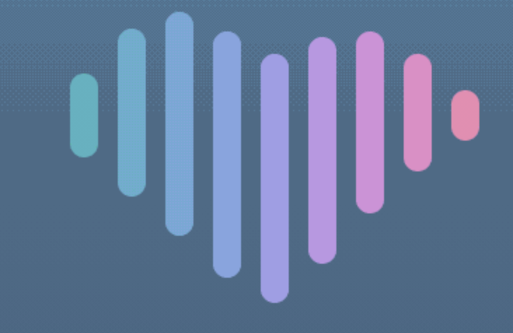
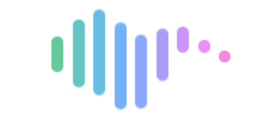
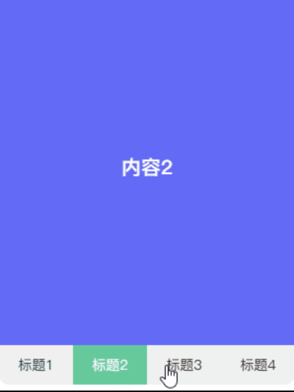
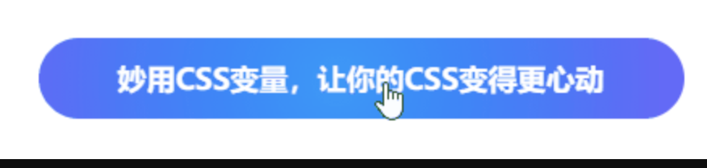
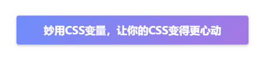
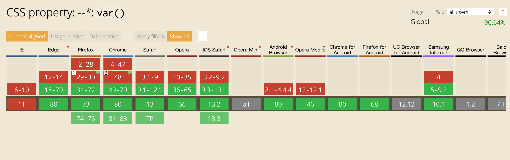

## 变量

> CSS 变量又名 CSS 自定义属性，指可在整个文档中重复使用的值。它由自定义属性`--var`和函数`var()`组成，`var()`用于引用自定义属性。谈到为何会在 CSS 中使用变量，以下上个示例，估计一看就会明白。

    /* 不使用变量 */
    .title {
        background-color: red;
    }
    .desc {
        background-color: red;
    }

    /* 使用变量 */
    :root {
        --bg-color: red;
    }
    .title {
        background-color: var(--bg-color);
    }
    .desc {
        background-color: var(--bg-color);
    }

- 看完可能会觉得使用变量的代码会多了一点，但是有无想到突然某天万恶的策划小哥哥和设计小姐姐说要做一个换肤功能。按照平时思路，估计有些同学就会按照默认颜色主题增加一份对照的新颜色主题样式文件。这样每次增加需求都同时维护几套颜色主题多麻烦啊。
- 此时变量就派上用场了，提前跟设计小姐姐规范好各种需变换的颜色并使用变量定义，通过 JS 批量操作这些定义好的变量即可。这也是变换颜色主题的一种解决方案，好处在于只需维护一套 CSS 代码，第 13 章实战大操作-切换控件会使用纯 CSS 实现暗黑模式换肤。

  ["red", "blue", "green"].forEach(v => {
  const btn = document.getElementById(`${v}-theme-btn`);
  btn.addEventListener("click", () => document.body.style.setProperty("--bg-color", v));
  });

**CSS 使用变量有如下好处**。

- 减少样式代码的重复性
- 增加样式代码的扩展性
- 提高样式代码的灵活性
- 增多一种 CSS 与 JS 的通讯方式
- 不用深层遍历 DOM 改变某个样式

可能有些同学会问，sass 和 less 早就实现了变量该特性，何必再多此一举呢？可是细想一下，变量对比 Sass 变量和 Less 变量又有它的过人之处。

- 浏览器原生特性，无需经过任何转译可直接运行
- DOM 对象一员，极大便利了 CSS 与 JS 间的联系

## 认识

> 本来打算用一半篇幅讲述变量的规范和用法，但是网上一搜一大把就感觉没必要了，贴上阮一峰老师发表的教程[《CSS 变量教程》][css]。同时笔者也对变量的细节作一个整理，方便记忆。

- 声明：`--变量名`
- 读取：`var(--变量名, 默认值)`
- 类型

  - 普通：只能用作属性值不能用作属性名
  - 字符：与字符串拼接 `"Hello, "var(--name)`
  - 数值：使用`calc()`与数值单位连用 `var(--width) * 10px`

- 作用域

  - 范围：在当前节点块作用域及其子节点块作用域下有效
  - 优先级别：`内联样式 = 外联样式` > `ID选择器` > `类选择器 = 伪类选择器 = 属性选择器` > `元素选择器 = 伪元素选择器` > `通配选择器 = 后代选择器 = 兄弟选择器`

接下来使用几个特别的场景展示变量的魅力。还是那句话，一样东西有使用的场景，那自然就会有它的价值，那么用的人也会越来越多。

## 场景

其实变量有一个特别好用的场景，那就是结合 List 集合使用。若不明白这是什么，请继续往下看。

**条形加载条**

一个条形加载条通常由几条线条组成，每条线条对应一个存在不同时延的相同动画，通过时间差运行相同的动画，从而产生加载效果。估计大部分的同学可能会把 CSS 代码编写成以下这样。

    <ul class="strip-loading">
        <li v-for="v in 6" :key="v"></li>
    </ul>

    .strip-loading {
        display: flex;
        justify-content: center;
        align-items: center;
        width: 200px;
        height: 200px;
        li {
            border-radius: 3px;
            width: 6px;
            height: 30px;
            background-color: #f66;
            animation: beat 1s ease-in-out infinite;
            & + li {
                margin-left: 5px;
            }
            &:nth-child(2) {
                animation-delay: 200ms;
            }
            &:nth-child(3) {
                animation-delay: 400ms;
            }
            &:nth-child(4) {
                animation-delay: 600ms;
            }
            &:nth-child(5) {
                animation-delay: 800ms;
            }
            &:nth-child(6) {
                animation-delay: 1s;
            }
        }
    }
    @keyframes beat {
        0%,
        100% {
            transform: scaleY(1);
        }
        50% {
            transform: scaleY(.5);
        }
    }

- 分析代码发现，每个`<li>`只是存在`animation-delay`不同，而其余代码则完全相同，换成其他类似的 List 集合，那岂不是有 10 个`<li>`就写 10 个`:nth-child(n)`。
- 显然这种方法不灵活也不容易封装成组件，若能像 JS 那样封装成一个函数，并根据参数输出不同样式效果，那就更棒了。说到这里，很明显就是为了铺垫变量的开发技巧了。
- 对于 HTML 部分的修改，让每个`<li>`拥有一个自己作用域下的变量。对于 CSS 部分的修改，就需分析哪些属性是随着 index 递增而发生规律变化的，对规律变化的部分使用变量表达式代替即可。

  <ul class="strip-loading">
      <li v-for="v in 6" :key="v" :style="`--line-index: ${v}`"></li>
  </ul>

  .strip-loading {
  display: flex;
  justify-content: center;
  align-items: center;
  width: 200px;
  height: 200px;
  li {
  --time: calc(var(--line-index) \* 200ms);
  border-radius: 3px;
  width: 6px;
  height: 30px;
  background-color: #f66;
  animation: beat 1.5s ease-in-out var(--time) infinite;
  & + li {
  margin-left: 5px;
  }
  }
  }
  @keyframes beat {
  0%,
  100% {
  transform: scaleY(1);
  }
  50% {
  transform: scaleY(.5);
  }
  }

- 代码中的变量`--line-index`和`--time`使每个`<li>`拥有一个属于自己的作用域。例如第二个`<li>`，`--line-index`的值为`2`，`--time`的计算值为`200ms`，换成第三个`<li>`后这两个值又会不同了。
- 这就是变量的作用范围所致(在当前节点块作用域及其子节点块作用域下有效)，因此在`.strip-loading`的块作用域下调用`--line-index`是无效的

  /_ flex 属性无效 _/
  .strip-loading {
  display: flex;
  align-items: center;
  flex: var(--line-index);
  }

> 通过妙用变量，也把 CSS 代码从 41 行缩减到 27 行，对于那些含有 List 集合越多的场景，效果就越明显。而且这样处理也更美观更容易维护，某天说加载效果的时间差不明显，直接将`calc((var(--line-index) - 1) * 200ms)`里的`200ms`调整成`400ms`即可，就无需修改每个`:nth-child(n)`了。

**心形加载条**

通过动图分析，发现每条线条的背景颜色和动画时延不同，另外动画运行时的高度也不同。细心的你可能还会发现，第一条和第九条的高度一致，第二条和第八条的高度一致，依次类推，得到高度变换相同类的公式：对称`index = 总数 + 1 - index`。

背景颜色使用了滤镜的色相旋转`hue-rotate()`，目的是为了使颜色过渡得更自然；动画时延与上述条形加载条一致。以下就用变量根据看到的动图实现一番。

    

        <ul style="--line-count: 9">
            <li v-for="v in 9" :key="v" :class="`line-${v}`" :style="`--line-index: ${v}`"></li>
        </ul>
    

    .heart-loading {
        display: flex;
        justify-content: center;
        align-items: center;
        width: 200px;
        height: 200px;
        ul {
            display: flex;
            justify-content: space-between;
            width: 150px;
            height: 10px;
        }
        li {
            --Θ: calc(var(--line-index) / var(--line-count) * .5turn);
            --time: calc((var(--line-index) - 1) * 40ms);
            border-radius: 5px;
            width: 10px;
            height: 10px;
            background-color: #3c9;
            filter: hue-rotate(var(--Θ));
            animation-duration: 1s;
            animation-delay: var(--time);
            animation-iteration-count: infinite;
            &.line-1,
            &.line-9 {
                animation-name: beat-1;
            }
            &.line-2,
            &.line-8 {
                animation-name: beat-2;
            }
            &.line-3,
            &.line-7 {
                animation-name: beat-3;
            }
            &.line-4,
            &.line-6 {
                animation-name: beat-4;
            }
            &.line-5 {
                animation-name: beat-5;
            }
        }
    }
    @keyframes beat-1 {
        0%,
        10%,
        90%,
        100% {
            height: 10px;
        }
        45%,
        55% {
            height: 30px;
            transform: translate3d(0, -15px, 0);
        }
    }
    @keyframes beat-2 {
        0%,
        10%,
        90%,
        100% {
            height: 10px;
        }
        45%,
        55% {
            height: 60px;
            transform: translate3d(0, -30px, 0);
        }
    }
    @keyframes beat-3 {
        0%,
        10%,
        90%,
        100% {
            height: 10px;
        }
        45%,
        55% {
            height: 80px;
            transform: translate3d(0, -40px, 0);
        }
    }
    @keyframes beat-4 {
        0%,
        10%,
        90%,
        100% {
            height: 10px;
        }
        45%,
        55% {
            height: 90px;
            transform: translate3d(0, -30px, 0);
        }
    }
    @keyframes beat-5 {
        0%,
        10%,
        90%,
        100% {
            height: 10px;
        }
        45%,
        55% {
            height: 90px;
            transform: translate3d(0, -20px, 0);
        }
    }

一波操作后就有了以下效果。与陈大鱼头兄的心形加载条对比一下，颜色、波动曲线和跳动频率有点不同，在暖色调的蔓延和肾上腺素的飙升下，这是一种心动的感觉。

**标签导航**

上述通过两个加载条演示了变量在 CSS 中的运用以及一些妙用技巧，现在通过标签导航演示变量在 JS 中的运用。

- JS 中有 3 个操作变量的 API，看上去简单易记。

  - 读取变量：`elem.style.getPropertyValue()`
  - 设置变量：`elem.style.setProperty()`
  - 删除变量：`elem.style.removeProperty()`

先上效果图，效果中主要是使用变量标记每个 Tab 的背景颜色和切换 Tab 的显示状态。

    

        <nav>
            <a v-for="(v, i) in list" :key="v" :class="{ active: index === i }" @click="select(i)">标题{{i + 1}}</a>
        </nav>
        

            <ul ref="tabs" :style="`--tab-count: ${list.length}`">
                <li v-for="(v, i) in list" :key="v" :style="`--bg-color: ${v}`">内容{{i + 1}}</li>
            </ul>
        

    

    .tab-navbar {
        display: flex;
        overflow: hidden;
        flex-direction: column-reverse;
        border-radius: 10px;
        width: 300px;
        height: 400px;
        nav {
            display: flex;
            height: 40px;
            background-color: #f0f0f0;
            line-height: 40px;
            text-align: center;
            a {
                flex: 1;
                cursor: pointer;
                transition: all 300ms;
                &.active {
                    background-color: #3c9;
                    color: #fff;
                }
            }
        }
        div {
            flex: 1;
            ul {
                --tab-index: 0;
                --tab-width: calc(var(--tab-count) * 100%);
                --tab-move: calc(var(--tab-index) / var(--tab-count) * -100%);
                display: flex;
                flex-wrap: nowrap;
                width: var(--tab-width);
                height: 100%;
                transform: translate3d(var(--tab-move), 0, 0);
                transition: all 300ms;
            }
            li {
                display: flex;
                justify-content: center;
                align-items: center;
                flex: 1;
                background-color: var(--bg-color);
                font-weight: bold;
                font-size: 20px;
                color: #fff;
            }
        }
    }

    export default {
        data() {
            return {
                index: 0,
                list: ["#f66", "#66f", "#f90", "#09f"]
            };
        },
        methods: {
            select(i) {
                this.index = i;
                this.$refs.tabs.style.setProperty("--tab-index", i);
            }
        }
    };

- 在`<ul>`上定义`--tab-index`表示 Tab 当前的索引，当点击按钮时重置`--tab-index`的值，可实现不操作 DOM 移动`<ul>`的位置显示指定的 Tab。不操作 DOM 而可移动`<ul>`是因为定义了`--tab-move`，通过`calc()`计算`--tab-index`与`--tab-move`的关系，从而操控`transform:translate3d()`移动`<ul>`。
- 另外在`<li>`上定义`--bg-color`表示 Tab 的背景颜色，也是一种比较简洁的模板赋值方式，总比写`<li :style="backgroundColor:${color}">`要好看。若多个属性依赖一个变量赋值，那么使用变量赋值到`style`上就更方便了，那些属性可在 css 文件里计算与赋值，这样可帮助 JS 分担一些属性计算工作。

**悬浮跟踪按钮**

- 通过几个示例实践了变量在 CSS 和 JS 上的运用，相信各位同学已经掌握了其用法和技巧。曾经在某个网站看过一个比较酷炫的鼠标悬浮效果，好像也是使用变量实现的。笔者凭着记忆也使用变量实现一番。
- 其实思路也比较简单，先对按钮布局和着色，然后使用伪元素标记鼠标的位置，定义`--x`和`--y`表示伪元素在按钮里的坐标，通过 JS 获取鼠标在按钮上的 offsetX 和`offsetY`分别赋值给`--x`和`--y`，再对伪元素添加径向渐变的背景颜色，大功告成，一个酷炫的鼠标悬浮跟踪效果就这样诞生了。

    <a class="track-btn" @mousemove="move">
        妙用CSS变量，让你的CSS变得更心动
    </a>

    .track-btn {
        overflow: hidden;
        position: relative;
        border-radius: 25px;
        width: 400px;
        height: 50px;
        background-color: #66f;
        cursor: pointer;
        line-height: 50px;
        text-align: center;
        font-weight: bold;
        font-size: 18px;
        color: #fff;
        span {
            position: relative;
            pointer-events: none;
        }
        &::before {
            --size: 0;
            position: absolute;
            left: var(--x);
            top: var(--y);
            width: var(--size);
            height: var(--size);
            background-image: radial-gradient(circle closest-side, #09f, transparent);
            content: "";
            transform: translate3d(-50%, -50%, 0);
            transition: width 200ms ease, height 200ms ease;
        }
        &:hover::before {
            --size: 400px;
        }
    }

    export default {
        name: "track-btn",
        methods: {
            move(e) {
                const x = e.pageX - e.target.offsetLeft;
                const y = e.pageY - e.target.offsetTop;
                e.target.style.setProperty("--x", `${x}px`);
                e.target.style.setProperty("--y", `${y}px`);
            }
        }
    };

> 其实可结合鼠标事件完成更多的酷炫效果，例如动画关联和事件响应等操作。没有做不到只有想不到，尽情发挥你的想象力啦。

**悬浮视差按钮**

曾经在 CodePen 上还看到一个挺不错的示例，一个[悬浮视差按钮][link 1]，具体代码涉及到一些 3D 变换的知识。看完源码后，按照其思路自己也实现一番，顺便对代码稍加改良

- [在线演示：Here][here]

## 兼容

对于现代浏览器来说，变量的兼容性其实还是蛮好的，所以可放心使用。毕竟现在都是各大浏览器厂商快速迭代的时刻，产品对于用户体验来说是占了很大比重，因此在条件允许的情况下还是大胆尝新，不要被一些过去的所谓的规范所约束着。

- 试问现在还有多少人愿意去维护 IExplorer 兼容性，若一个产品的用户体验受限于远古浏览器的压制(可能政务网站和金融网站除外吧)，相信该产品也不会走得很远。
- 在完成一个产品的过程中，不仅仅是为了完成工作任务，若在保证进度的同时能花点心思点缀一下，可能会有意外的收获。用心写好每一段代码，才是享受写代码的真谛。

[css]: http://www.ruanyifeng.com/blog/2017/05/css-variables.html
[202203211348550.png]: https://s.poetries.work/images/202203211348550.png
[202203211348517.png]: https://s.poetries.work/images/202203211348517.png
[202203211348202.png]: https://s.poetries.work/images/202203211348202.png
[202203211348067.png]: https://s.poetries.work/images/202203211348067.png
[link 1]: https://t.co/qE0woiNip8
[202203211338351.png]: https://s.poetries.work/images/202203211338351.png
[here]: https://codepen.io/JowayYoung/pen/RwPdQEz
[202203211338694.png]: https://s.poetries.work/images/202203211338694.png
