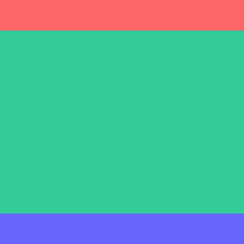
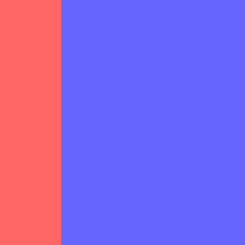
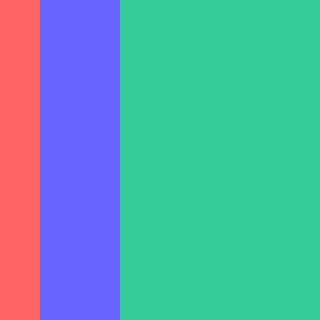
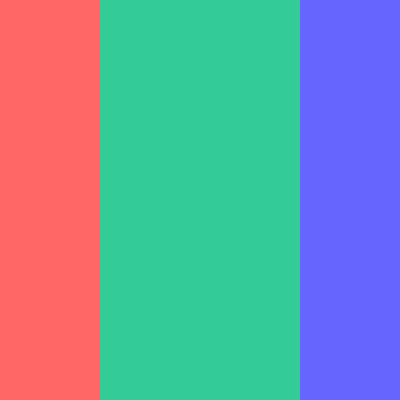
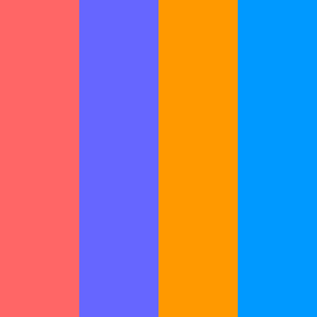
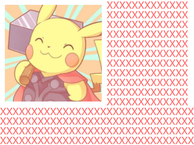

## 布局

为了方便记忆，笔者按照属性聚合度将跟布局有关系的属性分类，并划分为以下 8 种基本布局

- 普通布局：`display:block/inline`
- 浮动布局：`float:left/right`
- 定位布局：`position:relative/absolute/fixed、left/right/top/bottom/z-index`
- 表格布局：`table`系列属性
- 弹性布局：`display:flex/inline-flex`、`flex`系列属性
- 多列布局：`column`系列属性
- 格栅布局：`display:grid/inline-grid`、`grid`系列属性
- 响应式布局：`em/rem/vw/vh/vmin/vmax`、媒体查询

众多跟布局有关的属性，到底要如何结合才能完成想要的布局，具体开发中使用何种属性更为合适，这些都是布局方式中必须得面对的问题。本章也着重从常用的布局技巧说起，怎么样的属性搭配才能玩转网页排版。

在 8 种基本布局中，笔者还是比较推荐浮动布局、定位布局和弹性布局，熟悉这三种布局基本上能解决大部分网页排版问题。表格布局尽量不要使用，在第 3 章回流重绘有提及，可能很小的一个改动就会造成整个`<table>`回流；格栅布局其实是一个很不错的布局方式，无奈兼容性不是很好，所以笔者比较少研究，后续兼容性上来了笔者会更新本章格栅布局相关内容

弹性布局是一个好东西，完全掌握后能创造出很多意想不到的事情

**清除浮动**

> 在各种经典布局方式中，可能会结合浮动布局相关属性。在第 4 章盒模型有提及，使用`float`会使节点脱流导致父节点高度坍塌，若不对父节点显式声明高度则很有必要给父节点清除浮动。定义以下`clearfix`用于清除浮动，给父节点添加即可。值得注意，`clearfix`已占用`::after`，所以使用`clearfix`的父节点就不能再声明`::after`了，可改用`::before`

    .clearfix::after {
        display: block;
        visibility: hidden;
        clear: both;
        height: 0;
        font-size: 0;
        content: "";
    }

笔者就不详细讲解清除浮动的原理和分析了，有兴趣的同学请查看[Clearfix][]

## 全屏布局

> 经典的全屏布局由顶部、底部、主体三部分组成，其特点为三部分左右满屏拉伸、顶部底部高度固定和主体高度自适应，主要应用在主体布局。该布局很常见，也是大部分 Web 应用主体的主流布局。通常使用`<header>`、`<footer>`和`<main>`三个标签语义化排版，`<main>`内还可插入`<aside>`作为侧栏。

    

        <header></header>
        <main></main>
        <footer></footer>
    

**position + left/right/top/bottom**

- 顶部、底部和主体声明`left:0`和`right:0`将其左右部分满屏拉伸；顶部和底部声明`top:0`和`bottom:0`分别将其吸顶和吸底，并声明俩高度为固定值；将主体的`top`和`bottom`分别声明为顶部高度和底部高度。
- 移动端基本都是以该布局为主，不信打开你常用的 App 瞧瞧。实现起来比较简单，基于其左右满屏拉伸这个特点下手即可。

  .fullscreen-layout {
  position: relative;
  width: 400px;
  height: 400px; header, footer, main {
  position: absolute;
  left: 0;
  right: 0;
  }
  header {
  top: 0;
  height: 50px;
  background-color: #f66;
  }
  footer {
  bottom: 0;
  height: 50px;
  background-color: #66f;
  }
  main {
  top: 50px;
  bottom: 50px;
  background-color: #3c9;
  }
  }

**flex**

> 使用 flex 实现会更简洁。`display:flex`默认会令子节点横向排列，需声明 flex-direction:column 改变子节点排列方向为纵向排列；顶部和底部高度固定，所以主体声明 flex:1 让高度自适应即可。

    .fullscreen-layout {
        display: flex;
        flex-direction: column;
        width: 400px;
        height: 400px; header {
            height: 50px;
            background-color: #f66;
        }
        footer {
            height: 50px;
            background-color: #66f;
        }
        main {
            flex: 1;
            background-color: #3c9;
        }
    }

## 多列布局

**两列布局**

经典的两列布局由左右两列组成，其特点为`一列宽度固定`、`另一列宽度自适应`和`两列高度固定且相等`。以下以左列宽度固定和右列宽度自适应为例，反之同理

    

        

        

    

> float + margin-left/right

左列声明`float:left`和固定宽度，由于 float 使节点脱流，右列需声明`margin-left`为左列宽度，以保证两列不会重叠。

    .two-column-layout {
        width: 400px;
        height: 400px;
        .left {
            float: left;
            width: 100px;
            height: 100%;
            background-color: #f66;
        }
        .right {
            margin-left: 100px;
            height: 100%;
            background-color: #66f;
        }
    }

> overflow + float

左列声明同上，右列声明`overflow:hidden`使其形成 BFC 区域与外界隔离，详情可回看第 4 章盒模型

    .two-column-layout {
        width: 400px;
        height: 400px;
        .left {
            float: left;
            width: 100px;
            height: 100%;
            background-color: #f66;
        }
        .right {
            overflow: hidden;
            height: 100%;
            background-color: #66f;
        }
    }

> flex

使用 flex 实现会更简洁。左列声明固定宽度，右列声明`flex:1`自适应宽度。

    .two-column-layout {
        display: flex;
        width: 400px;
        height: 400px;
        .left {
            width: 100px;
            background-color: #f66;
        }
        .right {
            flex: 1;
            background-color: #66f;
        }
    }

**三列布局**

经典的三列布局由左中右三列组成，其特点为连续两列宽度固定、剩余一列宽度自适应和三列高度固定且相等。以下以左中列宽度固定和右列宽度自适应为例，反之同理。整体的实现原理与上述两列布局一致，以下就不啰嗦了，直接贴代码。

    

        

        

        

    

为了让右列宽度自适应计算，就不使用`float + margin-left`的方式了，若使用`margin-left`还得结合左中列宽度计算。

> overflow + float

    .three-column-layout {
        width: 400px;
        height: 400px;
        .left {
            float: left;
            width: 50px;
            height: 100%;
            background-color: #f66;
        }
        .center {
            float: left;
            width: 100px;
            height: 100%;
            background-color: #66f;
        }
        .right {
            overflow: hidden;
            height: 100%;
            background-color: #3c9;
        }
    }

> flex

使用 flex 实现会更简洁，还是 flex 大法好。

    .three-column-layout {
        display: flex;
        width: 400px;
        height: 400px;
        .left {
            width: 50px;
            background-color: #f66;
        }
        .center {
            width: 100px;
            background-color: #66f;
        }
        .right {
            flex: 1;
            background-color: #3c9;
        }
    }

**圣杯布局与双飞翼布局**

> 经典的圣杯布局和双飞翼布局都是由左中右三列组成，其特点为左右两列宽度固定、中间一列宽度自适应和三列高度固定且相等。其实也是上述两列布局和三列布局的变体，整体的实现原理与上述 N 列布局一致，可能就是一些细节需注意

圣杯布局和双飞翼布局在大体相同下也存在一点不同，区别在于双飞翼布局中间列需插入一个子节点。在常规的实现方式中也是在这个中间列里做文章，如何使中间列内容不被左右列遮挡。

- 相同

  - 中间列放首位且声明其宽高占满父节点
  - 被挤出的左右列使用 float 和 margin 负值将其拉回与中间列处在同一水平线上

- 不同

  - 圣杯布局：父节点声明 padding 为左右列留出空位，将左右列固定在空位上
  - 双飞翼布局：中间列插入子节点并声明 margin 为左右列让出空位，将左右列固定在空位上

> 圣杯布局 float + margin-left/right + padding-left/right

由于浮动节点在位置上不能高于前面或平级的非浮动节点，否则会导致浮动节点下沉。因此在编写 HTML 结构时，将中间列节点挪到右列节点后面。

    

        

        

        

    

    .grail-layout {
        padding: 0 100px;
        width: 400px;
        height: 400px;
        .left {
            float: left;
            margin-left: -100px;
            width: 100px;
            height: 100%;
            background-color: #f66;
        }
        .right {
            float: right;
            margin-right: -100px;
            width: 100px;
            height: 100%;
            background-color: #66f;
        }
        .center {
            height: 100%;
            background-color: #3c9;
        }
    }

> 双飞翼布局 float + margin-left/right

HTML 结构大体同上，只是在中间里里插入一个子节点`
`。根据两者区别，CSS 声明会与上述圣杯布局有一点点出入，可观察对比找出不同地方。

    

        

        

        

            

        

    

    .grail-layout {
        width: 400px;
        height: 400px;
        .left {
            float: left;
            width: 100px;
            height: 100%;
            background-color: #f66;
        }
        .right {
            float: right;
            width: 100px;
            height: 100%;
            background-color: #66f;
        }
        .center {
            margin: 0 100px;
            height: 100%;
            background-color: #3c9;
        }
    }

> 圣杯布局/双飞翼布局 flex

使用`flex`实现圣杯布局/双飞翼布局可忽略上述分析，左右两列宽度固定，中间列宽度自适应

    

        

        

        

    

    .grail-layout {
        display: flex;
        width: 400px;
        height: 400px;
        .left {
            width: 100px;
            background-color: #f66;
        }
        .center {
            flex: 1;
            background-color: #3c9;
        }
        .right {
            width: 100px;
            background-color: #66f;
        }
    }

**均分布局**

> 经典的均分布局由多列组成，其特点为每列宽度相等和每列高度固定且相等。总体来说，也是最简单的经典布局，由于每列宽度相等，所以很容易找到合适的方式处理。

    

        

        

        

        

    

    .one {
        background-color: #f66;
    }
    .two {
        background-color: #66f;
    }
    .three {
        background-color: #f90;
    }
    .four {
        background-color: #09f;
    }

> float + width

每列宽度声明为相等的百分比，若有 4 列则声明`width:25%`。N 列就用公式`100 / n`求出最终百分比宽度，记得保留 2 位小数，懒人还可用`width:calc(100% / n)`自动计算呢

    .average-layout {
        width: 400px;
        height: 400px;
        div {
            float: left;
            width: 25%;
            height: 100%;
        }
    }

> column

使用 column 实现会令 CSS 代码语义化更明确。`column`相关属性是为列排版应运而生的，相对 flex 相关属性来说更易懂易学。

    .average-layout {
        column-count: 4;
        column-gap: 0;
        width: 400px;
        height: 400px;
        div {
            height: 100%;
        }
    }

> flex

使用 flex 实现会更简洁。节点声明`display:flex`后，生成的 FFC 容器里所有子节点的高度都相等，因为容器的`align-items`默认为`stretch`，所有子节点将占满整个容器的高度。每列声明`flex:1`自适应宽度。

    .average-layout {
        display: flex;
        width: 400px;
        height: 400px;
        div {
            flex: 1;
        }
    }

## 居中布局

居中布局不管在开发还是面试，都是一个出现率很高频的场景。很多同学可能都会死记硬背，若是根据不同场景使用不同居中布局，那死记硬背也不一定帮得上忙。所以剖析其原理和技巧再自由组合，相信能开发出更多的使用方式，当然死记硬背也不会存在了。

以下是笔者总结的水平居中和垂直居中的实现方式，分开了解水平居中和垂直居中的原理，是玩转居中布局里最重要的一步。

**水平居中**

- `margin:0 auto + width:fit-content：全部元素`
- `块级元素 + margin:0 auto + width：块级元素`

  - 若节点不是块级元素需声明`display:block`
  - 若节点宽度已隐式声明则无需显式声明`width`

- 行内元素 + `text-aligin:center`：行内元素

  - 父节点上声明`text-align`
  - 若节点不是行内元素需声明`display:inline/inline-block`

- `position + left/right + margin-left/right + width`：全部元素
- `position + left/right + transform:translateX(-50%)`：全部元素
- `display:flex + justify-content:center`：全部元素

  - 父节点上声明`display`和`justify-content`

**垂直居中**

- 块级元素 + padding-top/bottom：`块级元素`

  - 父节点高度未声明或自适应
  - 若节点不是块级元素需声明`display:block`

- 行内元素 + line-height：`行内元素`

  - 父节点上声明`line-height`
  - 若节点不是行内元素需声明`display:inline/inline-block`

- display:table + display:table-cell + vertical-align:middle：`全部元素`

  - 父节点上声明`display:table`

- display:table-cell + vertical-align:middle：`全部元素`

  - 父节点上声明`display`和`vertical-align`

- position + top/bottom + margin-top/bottom + height：`全部元素`
- position + top/bottom + transform:translateY(-50%)：`全部元素`
- display:flex + align-items:center：`全部元素`

  - 父节点上声明`display`和`align-items`

- display:flex + margin:auto 0：`全部元素`

  - 父节点上声明 display

> 浏览器会为文本生成一个匿名行内盒，让文本参与 IFC，所以可认为文本是行内元素

- 通过结合上述水平居中和垂直居中的实现方式完成一些常见的水平垂直居中布局，未出现的方式可在评论中补充，方便一起学习。注意，上述任何水平居中和垂直居中方式不是随意组合就能生效，这个需详细分析可行性。以下是一些组合成功的水平垂直居中布局。
- 假设节点是块级元素，意味着隐式声明`display:block`，例如以下的`

`，围绕着该`
`实现各种水平垂直居中布局。

  

      

  

  .center-layout {
  width: 400px;
  height: 400px;
  background-color: #f66;
  div {
  width: 100px;
  height: 100px;
  background-color: #66f;
  }
  }

> display:inline-block

`
`声明`display:inline-block`将其变成行内块级元素，那么可用`text-align`和`line-height`声明水平垂直居中了，但是行内块级元素与匿名行内盒的基线对齐存在很大差异，所以需声明`vertical-align:middle`将其调整到垂直居中的位置，不过这也是近似垂直居中，父节点最后还需声明`font-size:0`消除该差异。

    .center-layout {
        line-height: 400px;
        text-align: center;
        font-size: 0;
        div {
            display: inline-block;
            vertical-align: middle;
        }
    }

**display:table-cell**

> 父节点声明`display:table-cell`模拟表格布局的垂直居中；子节点声明`margin:0 auto`使其水平居中。

    .center-layout {
        display: table-cell;
        vertical-align: middle;
        div {
            margin: 0 auto;
        }
    }

**position**

该方式也是最传统最稳定的水平垂直居中布局了，唯二的缺点就是声明属性稍多和必须已知宽高。要点是使用 margin 负值将节点拉回最中间，所以必须已知宽高才能计算 margin 负值，通常是`margin-left`和`margin-top`，可连写成`margin:-(height/2) 0 0 -(width/2)`。

    .center-layout {
        position: relative;
        div {
            position: absolute;
            left: 50%;
            top: 50%;
            margin: -50px 0 0 -50px;
        }
    }

自从 CSS3 的 transform 普及后，声明`transform:translate(-50%,-50%)`可代替 margin 负值了，这样就无需声明宽高和计算宽高的二分之一是多少，真正做到自适应水平垂直居中。

但是存在一个缺陷，若节点需额外使用`transform`，那么就比较麻烦了。将额外的 transform 合并到水平垂直居中的`transform:translate(-50%,-50%)`里，就会存在有一个比较棘手的变换顺序问题，在第 12 章变换与动画中会详细讲解。解决方式就是在节点外部套上一层`
`，把`transform:translate(-50%,-50%)`转嫁到`
`上，那么节点就能自由使用`transform`了

    .center-layout {
        position: relative;
        div {
            position: absolute;
            left: 50%;
            top: 50%;
            transform: translate(-50%, -50%);
        }
    }

> flex

目前最强大的方式，不用说，常用 flex 的各位同学都会知道。

    .center-layout {
        display: flex;
        justify-content: center;
        align-items: center;
    }

当然还有一个隐藏的终极方式，也是史上最简方式。只需声明两个重要属性！

    .center-layout {
        display: flex;
        div {
            margin: auto;
        }
    }

## 文字布局

**文本环绕**

> 利用 float 使节点脱流的原理实现

    

        
        XXXXX......(很多个X)
    

    .text-wrapping {
        overflow: hidden;
        width: 400px;
        height: 300px;
        font-size: 20px;
        color: #f66;
        word-break: break-all;
        img {
            float: left;
            margin: 10px;
            height: 200px;
        }
    }

**文字溢出**

嘿嘿，最常用的单行文字溢出和多行问题溢出来啦。

    

        
玩转CSS的艺术之美...

        
玩转CSS的艺术之美...

    

    .text-ellipsis {
        width: 400px;
        p {
            padding: 0 10px;
            line-height: 40px;
            text-align: justify;
            font-size: 20px;
            color: #fff;
            &.s-line {
                background-color: #f66;
            }
            &.m-line {
                background-color: #66f;
            }
        }
    }

> 单行文字溢出 overflow + text-overflow

    .s-ellipsis {
        overflow: hidden;
        text-overflow: ellipsis;
        white-space: nowrap;
    }

> 多行文字溢出 flex + overflow + text-overflow

使用旧版弹性布局模拟多行文字溢出，只能在 Webkit 内核中使用，局限性太大了

- `display:-webkit-box`：将容器作为弹性伸缩盒模型
- `-webkit-box-orient`：弹性伸缩盒模型子节点的排列方式
- `-webkit-line-clamp`：限制容器最多显示多少行文本

  .m-ellipsis {
  display: -webkit-box;
  overflow: hidden;
  text-overflow: ellipsis;
  word-break: break-all;
  -webkit-box-orient: vertical;
  -webkit-line-clamp: 3;
  }

> 所以得通过一些兼容性稳定的属性模拟该溢出省略号，当然是使用伪元素`::after`胜任这个工作了。结合 max-height 和 line-height 计算最大显示行数，通过定位布局把省略号定位到整段文字的右下角，使用`linear-gradient()`调整渐变背景颜色稍微润色下省略号使其看上去自然一些。

    .m-ellipsis {
        overflow: hidden;
        position: relative;
        max-height: 120px;
        line-height: 40px;
        &::after {
            position: absolute;
            right: 0;
            bottom: 0;
            padding-left: 20px;
            background: linear-gradient(to right, transparent, #fff 50%);
            content: "...";
        }
    }

虽然该方式兼容性比较好，但是单行文字也会出现省略号，只能结合 JS 额外处理了。

[clearfix]: https://stackoverflow.com/questions/211383/what-methods-of-clearfix-can-i-use
[202203211337696.png]: https://s.poetries.work/images/202203211337696.png
[202203211337632.png]: https://s.poetries.work/images/202203211337632.png
[202203211346871.png]: https://s.poetries.work/images/202203211346871.png
[202203211337636.png]: https://s.poetries.work/images/202203211337636.png
[202203211346970.png]: https://s.poetries.work/images/202203211346970.png
[202203211347265.png]: https://s.poetries.work/images/202203211347265.png
