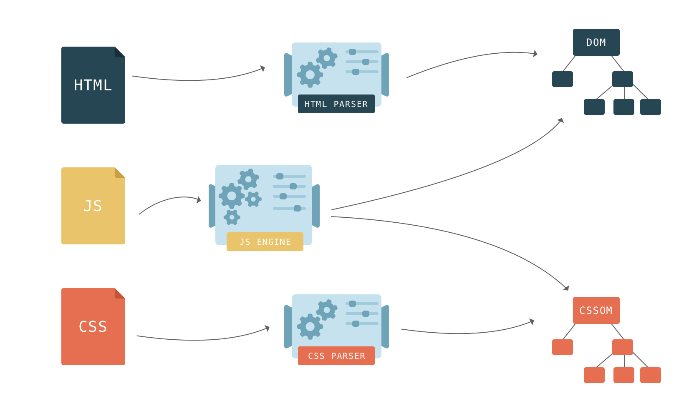

> 谈到 CSS，就会想到兼容性，想到兼容性就会涉及到浏览器，浏览器是一切 CSS 的运行环境

## 浏览器

浏览器这家伙是前端开发者每天都打交道的工具，正是它，才有了前端这个职业。浏览器指显示万维网上的媒体信息(文字、图像、音频、视频等)和处理用户交互操作的软件。

浏览器正是 Internet 时代的产物，随着各种设备操作系统的普及、网络技术的全球化以及人们对信息需求的爆炸式增长，为浏览器的诞生和兴起提供了强大的动力，同时它也标志着互联网时代的来临。

### 组成

> 虽然目前市场上的浏览器品牌众多，但是浏览器的结构还是由以下几部分组成。

- 地址栏：用于输入网站地址，通过识别地址信息跳转到对应网站
- 菜单栏：包含设置内容和常用快捷操作，用户可自定义设置内容
- 标签栏：包含一个或多个窗口，窗口的内容互不干扰，独立运行
- 窗口栏：显示当前网站地址的访问内容，可为用户提供各种交互操作
- 状态栏：用于实时显示当前操作和下载 Web 页面的进度情况

## 历史

> 浏览器作为一个跨时代的科技产物，为现代网络人机交互的发展提供了强而有力的支持，历史的时刻不应该被忘记，以下简单列举一些浏览器的历史时刻。

- 1993 年，NCSA 组织发布了 Mosaic 浏览器
- 1994 年，网景公司发布了 Navigator 浏览器
- 1995 年，微软公司发布了 IExplorer 浏览器，并掀起了浏览器之战
- 1996 年，Navigator 浏览器的市场份额达到 86%，微软公司开始将 IExplorer 浏览器整合到 Windows 操作系统中
- 1996 年，ASA 公司发布了 Opera 浏览器
- 1998 年，网景公司启动其开源产品，开始推出 Mozilla
- 2001 年，为人诟病的 IExplorer 6 发布，这货霸占国内市场十多年
- 2002 年，网景公司发布了 Firefox 浏览器
- 2003 年，苹果公司发布了 Safari 浏览器
- 2004 年，IExplorer 浏览器的市场份额达到了历史顶峰 92%，自此以后其市场份额开始下滑
- 2006 年，Firefox 3 的发布创下了吉尼斯世界纪录，一天 800 万下载量
- 2008 年，谷歌公司发布了 Chrome 浏览器

> 至此，世界五大浏览器鼎立的格局逐渐形成，也为后期浏览器市场的多变提供了广大的技术支持。浏览器发展史并不久远，虽然只有短短的 20 多年，但是却不断在更新迭代，为广大互联网用户提供越来越强大的人机交互功能。

> 世界五大浏览器：Chrome、Safari、Firefox、Opera、IExplorer/Edge

## 渲染引擎

> 渲染引擎又名浏览器内核，指负责对网页语法解析并渲染成一张可视化页面的解析器。它是浏览器最核心最重要的部位，不同内核对网页语法的解析也有不同，因此同一网页语法在不同内核的浏览器中的渲染效果也可能不同，这就是常说的浏览器差异性。

上述提到的世界五大浏览器，在自身的发展过程中都使用了一种或多种浏览器内核作为自身的渲染引擎。

- Google Chrome：Webkit(前期)、Blink(后期)
- Apple Safari：Webkit
- Mozilla Firefox：Gecko
- ASA Opera：Presto(前期)、Blink(后期)
- Microsoft IExplorer：Trident
- Microsoft Edge：Trident(前期)、Blink(后期)

> IExplorer 和 Edge 同是微软公司开发的浏览器产品，鉴于 IExplorer 存在很多为人诟病的问题，在后续的系统升级中逐渐使用 Edge 取代 IExplorer 在 Windows 上的位置

**因此 20 多年的浏览器发展史里，被大规模使用的浏览器内核也就这五个。**

- Blink 内核：由谷歌公司和欧朋公司合作自研的内核，同时谷歌公司也将其作为开源内核架构 Chromium 的一部分发布，在 Chrome 28+和 Opear 15+中被使用。
- Webkit 内核：由苹果公司自研的内核，同时也是 Blink 内核的原型，在 Chrome 1 ~ 28 和 Safari 1+中被使用。
- Gecko 内核：由网景公司自研的内核，先期在 Navigator 中使用，后期推广到 Firefox 上，在 Firefox 1+中被使用。
- Presto 内核：由欧朋公司自研的内核，其渲染性能达到极致但是牺牲了兼容性，目前已经废弃，在 Opear 7 ~ 14 中被使用。
- Trident 内核：由微软公司自研的内核，由于其被包含在全世界使用率最高的 Windows 操作系统中，导致十多年时间里一直称霸浏览器内核界，在 IExplorer 4+中被使用。

## 渲染过程

> 要了解浏览器页面的渲染过程，首先得知道关键渲染路径。关键渲染路径指浏览器从最初接收请求得到 HTML、CSS、JS 等资源，然后解析、构建、渲染、布局、绘制、合成，到最后呈现在用户眼前界面的整个过程。

**笔者将关键渲染路径划分理解，页面的渲染过程分为以下几部分。**

- 解析文件

  - 将 html 文件转换为 DOM 树
  - 将 css 文件转换为 CSSOM 树
  - 将 DOM 树和 CSSOM 树合并生成渲染树

- 绘制图层

  - 根据渲染树布局(回流)
  - 根据布局绘制(重绘)

- 合成图层：合成图层显示在屏幕上

**解析文件**

HTML 文档描述一个页面的结构，浏览器通过 HTML 解析器将 HTML 解析成 DOM 树结构。HTML 文档中所有内容皆为节点，各节点间拥有层级关系，彼此相连，构成 DOM 树。构建 DOM 树的过程：读取 HTML 文档的字节(Bytes)，将字节转换成字符(Chars)，依据字符确定标签(Tokens)，将标签转换成节点(Nodes)，以节点为基准构建 DOM 树。

CSS 文档描述一个页面的表现，浏览器通过 CSS 解析器将 CSS 解析成 CSSOM 树结构，与 DOM 树结构比较像。CSS 文档中所有内容皆为节点，与 HTML 文档中的节点一一对应，各节点间拥有层级关系，彼此相连，构成 CSSOM 树。构建 CSSOM 树的过程：读取 CSS 文档的字节(Bytes)，将字节转换成字符(Chars)，依据字符确定标签(Tokens)，将标签转换成节点(Nodes)，以节点为基准构建 CSSOM 树。与 DOM 树的构建过程完全一致。

在构建 DOM 树的过程中，当 HTML 解析器遇到`<script>`时会立即阻塞 DOM 树的构建，将控制权移交给浏览器的 JS 引擎，等到 JS 引擎运行完毕，浏览器才会从中断的地方恢复 DOM 树的构建。`<script>`的脚本加载完成后，JS 引擎通过 DOM API 和 CSSOM API 操作 DOM 树和 CSSOM 树。为何会产生渲染阻塞呢？其根本原因在于：JS 操作 DOM 后，浏览器无法预测未来 DOM 的具体内容，为了防止无效操作和节省资源，只能阻塞 DOM 树的构建。

> 浏览器的渲染引擎将 DOM 树和 CSSOM 树合并生成渲染树，只渲染需显示的节点及其样式。DOM 树、CSSOM 树和渲染树三者的构建并无先后条件和先后顺序，并非完全独立而是会有交叉并行构建的情况。因此会形成一边加载，一边解析，一边渲染的工作现象

**绘制图层**

> 进入绘制阶段，遍历渲染树，调用渲染器的 paint()在屏幕上绘制内容。根据渲染树布局计算样式，即每个节点在页面中的布局、尺寸等几何属性。HTML 默认是流式布局，CSS 和 JS 会打破这种布局，改变 DOM 的几何属性和外观属性。在绘制过程中，根据渲染树布局，再根据布局绘制，这就是常听常说的回流重绘。

在此涉及到两个核心概念：回流、重绘。笔者用两句精简的话分别概括它们。

- 回流：几何属性需改变的渲染
- 重绘：更改外观属性而不影响几何属性的渲染

> 当生成渲染树后，至少会渲染一次。在后续交互过程中，还会不断地重新渲染。这时只会回流重绘或只有重绘。因此引出一个定向法则：回流必定引发重绘，重绘不一定引发回流。

**合成图层**

> 将回流重绘生成的图层逐张合并并显示在屏幕上。上述几个步骤并不是一次性顺序完成的，若 DOM 或 CSSOM 被修改，上述过程会被重复执行。实际上，CSS 和 JS 往往会多次修改 DOM 或 CSSOM，简单来说就是用户的交互操作引发了网页的重渲染

## 兼容性

兼容性又名网站兼容性或网页兼容性，指网页在各种浏览器上的显示效果可能不同而产生浏览器和网页间的兼容问题。

说到兼容性，就不得不推荐一个专门为前端开发者定制可查询 CSS/JS 特性在各种浏览器中兼容性的网站 Caniuse，它可很好地保障网页在不同浏览器间的兼容性。有了这个工具可快速地了解使用到的代码在各个浏览器中的效果。所以后续使用 VScode 编码的过程中都会顺带使用 Caniuse 查看 CSS 属性以及选择器的兼容性。

产生浏览器间的兼容问题，正是上述谈到的渲染引擎而导致的。在网站的设计和开发中，做好浏览器兼容才能让网站在不同浏览器间都能显示正常。浏览器对标准的更好兼容能够给用户带来更好的使用体验，当然无法奢求浏览器厂商能统一所有浏览器标准，所以前端开发者只能自己着手解决。

以下聊聊处理 CSS 兼容性的三种方法，相对处理 JS 兼容性来说简单到不得了，这也是普遍前端开发者认为 CSS 简单的原因之一。通过以下方法处理，后续编码时就不会编写 CSS 私有属性了

**磨平浏览器默认样式**

> 每个浏览器的 CSS 默认样式不尽相同，所以最简单最有效的方法就是对其默认样式初始化。以下贴一个各位同学都会的初始化代码。简单暴力但是不明确，\*通配符可是有执行性能问题的。

    * {
        margin: 0;
        padding: 0;
    }

> 以下推荐两种磨平浏览器默认样式的方法，在接入其他 css 文件前将其导入

- `normalize.css`：懒人必备的浏览器默认样式库，接近 40k 的 Star，说明大部分人都是懒人
- `reset.css`：其实就是笔者自定义的默认样式，各位同学也可自行为项目撰写一份默认样式

> 在项目入口文件的其他 css 文件前导入，若使用 burce-cli，可能发现在 index.js 里已经提前导入了 reset.css

    import "path/to/normalize.css";
    // 或
    import "path/to/reset.css";

**插入浏览器私有属性**

通常编写 CSS 都会在一些 CSS3 属性前加入-webkit-、-moz-、-ms-或-o-，这些奇形怪状写到手软的东西就是浏览器私有属性。样式少还好，样式多那就欲哭无泪了 😂。

出现这些私有属性，是因为制定 CSS 标准的 W3C 其动作就像蜗牛一样慢，量产一个 CSS 属性是需走一个很严格很复杂的流程。一个成熟且被大众肯定的属性，浏览器厂商会加大其支持力度而铺路，但是为了避免日后 W3C 公布标准时有所变更，就加入一个本厂商的私有属性提前支持该属性，待 W3C 公布该属性标准后，再让新版浏览器支持标准属性。

对于编写私有属性的顺序需特别注意：兼容性写法放到前面，标准写法放到最后。在浏览器解析 CSS 过程中，若标准属性无法使用则使用当前浏览器对应的私有属性

    /* Chrome、Safari、New Opera、New Edge */
    -webkit-transform: translate(10px, 10px);
    /* Firefox */
    -moz-transform: translate(10px, 10px);
    /* IExplorer、Old Edge */
    -ms-transform: translate(10px, 10px);
    /* Old Opera */
    -o-transform: translate(10px, 10px);
    /* 标准 */
    transform: translate(10px, 10px);

- 当然不是所有的 CSS3 属性都需补齐-webkit-、-moz-、-ms-或-o-，上述 Demo 只是一个示例，真正的 transform 私有属性只有-webkit-和-ms-。这些需查看 Caniuse 确保正确的编写，若想偷懒也可全部写上。
- 每个 CSS3 属性都编写这么一堆兼容性代码，无疑是对生命最大的浪费。在使用 Webpack 打包项目代码的过程中，可接入 postcss-loader 和 postcss-preset-env，postcss-preset-env 内置了 autoprefixer，它会依据 Caniuse 所提供的数据对代码里的 CSS3 属性批量添加私有属性。
- 若使用 bruce-cli，那么也无需关注 CSS 私有属性的插入，因为其内置了 postcss-loader 和 postcss-preset-env。自动化工具的好处就是为了解决一些重复而无趣的工作

**CSS Hack**

CSS Hack 指针对不同浏览器编写不同 CSS，让它能够同时兼容不同浏览器，在不同浏览器中渲染想要的效果。当然也可反过来利用 CSS Hack 为不同版本的浏览器定制不同效果。

在一些老旧网站的 html 文件或 css 文件里可能会看到以下代码，没错，这就是 CSS Hack。现在可能很多同学都不会遇到这种写法，毕竟很多公司的产品都放弃了 IExplorer 8 以下的兼容，这些痕迹都已经成为历史。很多同学没想过 5 年到 10 年前的前端开发者是多么苦逼的，光兼容 IExplorer 就已经够烦了，还连续兼容几个版本。

    <head>
        <!--[if IE]>  <![endif]-->
    </head>

    .elem {
        background-color: #f66; /* IExplorer 8+ */
        *background-color: #f66; /* IExplorer 7 */
        _background-color: #f66; /* IExplorer 6 */
    }

> 所以现在也不会推荐去学习这些 CSS Hack，有一个基本的了解即可。上述 CSS Hack 写法只是最简单的几行代码，其实还存在一些更难的表达式。当然也不推荐这种写法，毕竟不符合大名鼎鼎的雅虎军规的 Avoid CSS Expressions。

综上所述，结合【磨平浏览器默认样式】和【插入浏览器私有属性】这两种方法完成浏览器兼容性的处理即可

**IExplorer 兼容性**

在此也顺带提一个众多前端开发者觉得很头疼的问题，就是 IExplorer 兼容性。试问一下，兼容一个 90 年代末 00 年代初的浏览器版本，是一个多费劲的事情啊，刚好又遇上 HTML5 和 CSS3 的迅速发展，是一个技术的取舍问题，要么原地踏步要么紧跟潮流，笔者最终还是选择了后者。

正是 IExplorer 的垄断性和大部分网站在早期是基于 IExplorer 6 开发和维护的，导致了后期的用户都是优先使用 IExplorer 6 浏览，也就造成了很多公司招聘前端开发者都是要标配处理 IExplorer 6 兼容性

IExplorer 的垄断性使得 Trident 内核在十多年时间里一家独大，微软公司可能很有信心吧，在很长时间内都无更新 Trident 内核，导致其曾经与 W3C 标准完全脱节和大量安全隐患无法得到解决。看过 Jquery 源码的同学应该都知道，源码里包含了大量的 IExplorer 兼容代码，所以在移动端上使用 Jquery 操作 DOM 是一件很费力不讨好的事情，后面才出现一个叫 Zepto 的库代替 Jquery 在移动端上的使用，该库很小，因为删除了所有的 IExplorer 兼容代码

在此笔者也建议，在业务需求允许的范围内尽量不要兼容 IExplorer，毕竟兼容 IExplorer 需花费很多时间去维护，更何况微软公司已经宣布不再支持 IExplorer 的维护而转向 Edge。

目前大部分国产浏览器是基于开源内核架构 Chromium 二次开发的，可认为是 Chrome 外面又包了一层外壳。另外可能有些国产浏览器打着双内核的旗号，在 Blink 内核的基础上又增加一个 Trident 内核。Blink 内核对应着浏览器的极速模式，可访问一些比较现代化和超前技术的网站，例如特效网站和可视化网站；Trident 内核对应着浏览器的兼容模式，可访问一些久经不衰的 OG 网站，例如政务网站和金融网站。

[202203211336595.png]: https://s.poetries.work/images/202203211336595.png
