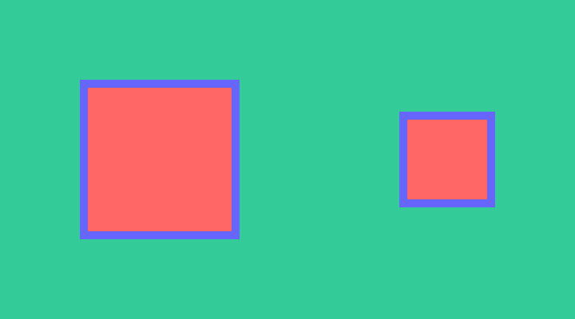
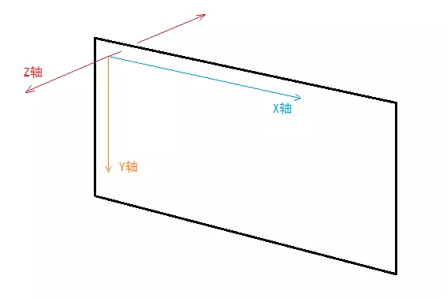
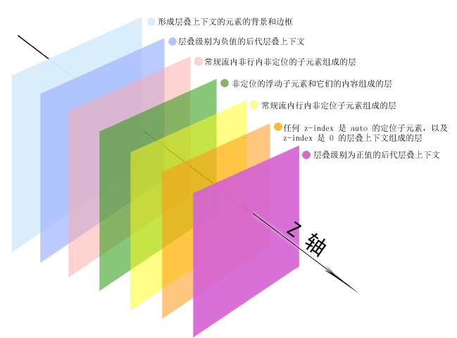

## 盒模型

> 盒模型又名框模型，是一种网页设计思维模型，它把文档节点看成一个盒子。

在 HTML 文档解析过程中，每个节点都会被描述为一个盒模型，然后一个盒子套进另一个盒子中，再依据各个节点对应的 CSS 规则，最后渲染成一个井井有条的页面。

**组成**

> 盒模型由以下属性组成，由外到内用公式表示就是：`box = margin + border + padding + content`。除了 content(不是属性，作为盒模型扩展理解使用)，其余属性都包含 left、right、top 和 bottom 等扩展属性。

- `margin`：边距，外部透明区域，负责隔离相邻盒子
- `border`：边框，内部着色区域，负责隔离边距和填充，包含 width、style、color 三个扩展属性
- `padding`：填充，内部着色区域，负责扩展盒子内部尺寸
- `content`：内容，以文本或节点存在的占用位置

> 重点提醒，padding 着色随`background-color`而变，可用`background-clip`隔离，该情况在第 10 章背景与遮罩中会详细讲解。

节点由外到内一层一层深入，通过上述公式组成了一个完整的盒模型。所以在理解盒模型时记住这 4 个属性及其从外到内的顺序即可。换另一种方式理解，可把它看做你的快递包裹。两个快递包裹间的距离就是 margin，快递包裹的纸皮就是 border，打开快递包裹，填充物料就是 padding，把填充物料打开看到了你的物品，那就是 content。这样理解是不是特别容易呢？

**类型**

由于历史原因，盒模型分化成两种类型，分别是标准盒模型和怪异盒模型。具体原因在第 2 章浏览器有提及。

> 所以 CSS3 里提供一个属性用于声明盒模型的类型，它就是 box-sizing

- `content-box`：标准盒模型(默认)
- `border-box`：怪异盒模型

> 它不具备继承性，若全局统一盒模型，那只能使用\*声明 box-sizing 了。建议使用[reset.css][]里的方式声明。

**标准盒模型**

> 标准盒模型是 W3C 规范的标准，由`margin + border + padding + content`组成。与上述提到的公式一模一样，节点的`width/height`只包含 content，不包含 padding 和 border。

- 节点的尺寸计算公式如下。

  - 横向：`margin-[left/right] + border-[left/right]+ padding-[left/right] + width`
  - 纵向：`margin-[top/bottom] + border-[top/bottom]+ padding-[top/bottom] + height`

- 节点的宽高计算公式如下。

  - 横向：`width = width`
  - 纵向：`height = height`

**怪异盒模型**

> 怪异盒模型又名 IE 盒子模型，是 IExplore 制定的标准，由 margin + content 组成。与上述提到的公式一不同，节点的 width/height 包含 border、padding 和 content。

- 节点的尺寸计算公式如下

  - 横向：`margin-[left/right] + width`(包含`border-[left/right]`和`padding-[left/right]`)
  - 纵向：`margin-[top/bottom] + height`(包含`border-[top/bottom]`和`padding-[top/bottom]`)

- 节点的宽高计算公式如下

  - 横向：`width = border + padding + width`
  - 纵向：`height = border + padding + height`

> 在 IExplore 中，若 HTML 文档缺失`<!doctype html>`声明则会触发怪异盒模型

**两者区别**

> 通过代码演示可能会更清晰，width 和 height 的范围也一目了然，其实两者区别在于 width 和 height 包不包含 border 和 padding。把上述公式记清楚，两者区别就迎刃而解了

    .content-box {
        box-sizing: content-box;
        margin: 100px;
        padding: 50px;
        border: 10px solid #66f;
        width: 80px;
        height: 80px;
        background-color: #f66;
    }
    .border-box {
        box-sizing: border-box;
        margin: 100px;
        padding: 50px;
        border: 10px solid #66f;
        width: 80px;
        height: 80px;
        background-color: #f66;
    }

## 视觉格式化模型

- 上述盒模型都是平时了解到的概念，若使用 display 对这个简单盒模型稍微加工则会进化到视觉格式化模型
- 视觉格式化模型指在视觉媒体上处理和显示文档而使用的计算规则。它是一种 CSS 机制，由大量 CSS 规范组成，规定了节点在页面中的排版。

**块级元素**

- 当节点的 display 声明为 block、list-item、table、flex 或 grid 时，该节点被标记为块级元素。块级元素默认宽度为 100%，在垂直方向上按顺序放置，同时参与块格式化上下文。
- 每个块级元素都至少生成一个块级盒，或一个块容器盒，块级盒描述它与兄弟节点间的表现方式，块容器盒描述它与子节点间的表现方式。
- 一个块容器盒只包含其他块级盒，或生成一个行内格式化上下文只包含行内盒。或许一段代码中某一个块容器盒同时包含块级盒和行内盒的情况，但实质上在这种情况下会产生一种新的匿名块盒解决该问题。

**行内元素**

- 当节点的 display 声明为 inline、inline-block、inline-table、inline-flex 或 inline-grid 时，该节点被标记为行内元素。行内元素默认宽度为 auto，在水平方向上按顺序放置，同时参与行内格式化上下文。
- 当行内级盒参与行内格式化上下文后就会变成行内盒。另外还有一个叫做匿名行内盒的概念，匿名行内盒与匿名块盒的原理类似，都是浏览器自动生成的补充性盒

上述概念可能有点绕口，若从两者的区别理解可能更容易消化

- 互相转换

  - 块级元素转换行内元素：`display:inline`
  - 行内元素转换块级元素：`display:block`

- 占位表现

  - 块级元素默认独占一行，默认宽度为父元素的 100%，可声明边距、填充、宽高
  - 行内元素默认不独占一行(一行可多个)，默认宽度随内容自动撑开，可声明水平边距和填充，不可声明垂直边距和宽高

- 包含关系

  - 块级元素可包含块级元素和行内元素
  - 行内元素可包含行内元素，不能包含块级元素

## 格式化上下文

- 概念内容多次提到了格式化上下文的字眼，那么格式化上下文又是何方神圣呢？了解格式化上下文，或许就能了解上述内容了。
- 格式化上下文指决定渲染区域里节点的排版、关系和相互作用的渲染规则。简单来说就是页面中有一个`<ul>`及其多个子节点`<li>`，格式上下文决定这些`<li>`如何排版，`<li>`与`<li>`间处于什么关系，以及`<li>`与`<li>`间如何互相影响。
- 格式上下文由以下几部分组成，其中最重要的是块格式化上下文和行内格式化上下文，也频繁出现在大厂面试题中，了解其原理与特性，相信面试时被问到也无什么难度了。

<table> 
 <thead> 
  <tr> 
   <th>上下文</th> 
   <th>缩写</th> 
   <th>版本</th> 
   <th>声明</th> 
  </tr> 
 </thead> 
 <tbody> 
  <tr> 
   <td>块格式化上下文</td> 
   <td>BFC</td> 
   <td>2</td> 
   <td>块级盒子容器</td> 
  </tr> 
  <tr> 
   <td>行内格式化上下文</td> 
   <td>IFC</td> 
   <td>2</td> 
   <td>行内盒子容器</td> 
  </tr> 
  <tr> 
   <td>弹性格式化上下文</td> 
   <td>FFC</td> 
   <td>3</td> 
   <td>弹性盒子容器</td> 
  </tr> 
  <tr> 
   <td>格栅格式化上下文</td> 
   <td>GFC</td> 
   <td>3</td> 
   <td>格栅盒子容器</td> 
  </tr> 
 </tbody> 
</table>

> 为了防止有些同学对格式化上下文的概念越看越混乱，本章不会过多解说格式化上下文，但是笔者会抽丝剥茧把格式化上下文的概念清晰化，更多的解读可自行查找相关资料深入学习。有时学习点到即止也未尝不是一件好事，过多解读反而达不到想要的效果。

**块格式化上下文**

- BFC 是页面上一个独立且隔离的渲染区域，容器里的子节点不会在布局上影响到外面的节点，反之亦然。
- 以下是笔者意译 W3C 文档和平时一些开发经验的总结所得，也结合一些自身对 BFC 的理解。

规则

- 子节点在垂直方向上按顺序放置
- 子节点的垂直方向距离由 margin 决定，相邻节点的 margin 会发生重叠，以最大 margin 为合并值
- 每个节点的`margin-left/right`与父节点的左边/右边相接触，即使处于浮动也如此，除非自行形成 BFC
- BFC 区域不会与同级浮动区域重叠
- BFC 是一个隔离且不受外界影响的独立容器
- 计算 BFC 高度时其浮动子节点也参与计算

成因

- 根节点：`html`
- 非溢出可见节点：`overflow:!visible`
- 浮动节点：`float:left/right`
- 绝对定位节点：`position:absolute/fixed`
- 被定义成块级的非块级节点：`display:inline-block/table-cell/table-caption/flex/inline-flex`
- 父节点与正常文档流的子节点(非浮动)自动形成`BFC`

场景

- 清除浮动
- 已知宽度水平居中
- 防止浮动节点被覆盖
- 防止垂直`margin`合并

> 面试中常问到的 margin 塌陷问题，可用 BFC 的概念回答了。所谓的塌陷其实是两个 BFC 的相邻盒或父子盒相互作用时产生的效果，两个盒子会取相邻边最大 margin 作为相邻边的共用 margin。

- **在此笔者补充一些 margin 折叠的计算问题，相信在笔试上会遇到**

  - 两个盒子相邻边的 margin 都为正值，取最大值
  - 两个盒子相邻边的 margin 都为负值，取最小值，两者会互相重合
  - 两个盒子相邻边的 margin 一正一负，取两者相加值，若结果为负，两者会互相重合

**行内格式化上下文**

> IFC 的宽高由行内子元素中最大的实际高度确定，不受垂直方向的 margin 和 padding 影响。另外，IFC 中不能存在块元素，若插入块元素则会产生对应个数的匿名块并互相隔离，即产生对应个数的 IFC，每个 IFC 对外表现为块级元素，并垂直排列。

以下是笔者意译 W3C 文档和平时一些开发经验的总结所得，也结合一些自身对 IFC 的理解。

规则

- 节点在水平方向上按顺序放置
- 节点无法指定宽高，其 margin 和 padding 在水平方向有效在垂直方向无效
- 节点在垂直方向上以不同形式对齐
- 节点的宽度由包含块和浮动决定，高度由行高决定

成因

- 行内元素：`display:inline[-x]`
- 声明 `line-height`
- 声明 `vertical-align`
- 声明 `font-size`

**弹性格式化上下文**

声明 display 为 flex 或 inline-flex 时，节点会生成一个 FFC 的独立容器，主要用于响应式布局。

**格栅格式化上下文**

- 声明`display`为`grid`或`inline-grid`时，节点会生成一个 GFC 的独立容器，主要用于响应式布局。
- 细心的同学会发现，GFC 有点像`<table>`，同为二维表格，但是 GFC 会有更丰富的属性控制行列、对齐以及更为精细的渲染语义和控制。不过由于兼容性不是特别好，所以笔者也不会讲解基于 GFC 的格栅布局。

## 文档流

> 文档流指节点在排版布局过程中默认使用从左往右从上往下的流式排列方式。在窗体自上而下分成一行行，且每行按照从左至右的顺序排列节点，其显著特点就是从左往右从上往下。

**类型**

对于一个标准的文档流，可根据其特性对节点分类。

- HTML 级别

  - 容器级元素：`
`、`<ul>`、`<li>`等
  - 文本级元素：`<a>`、`
`、``等

- CSS 级别

  - 块级元素：`
`、`<ul>`、`<li>`等
  - 行内元素：`<a>`、`
`、``等

**微观现象**

即使是标准的文档流，也不排除有一些小小的缺陷，笔者罗列三个常见缺陷。

- 空白折叠：HTML 中换行编写行内元素，排版会出现 5px 空隙
- 高矮不齐：行内元素统一以底边垂直对齐
- 自动换行：排版若一行无法完成则换行接着排版

> 空白折叠解决方式

空白折叠也许是最容易出现的文档流微观现象，可能各位同学都会遇过。

    <ul>
        <li></li>
        <li></li>
        <li></li>
    </ul>

    ul {
        text-align: center;
    }
    li {
        display: inline-block;
    }

此时，很多浏览器就会出现`5px`空隙，解决方式也有很多种的。

第一种，必须紧密连接节点。

    <ul>
        <li></li><li></li><li></li>
    </ul>

第二种，子节点声明`margin-left:-5px`。

    li {
        display: inline-block;
        margin-left: -5px;
    }

第三种，使用`Flex布局`居中显示。

    ul {
        display: flex;
        justify-content: center;
    }

**脱流文档流**

> 脱流文档流指节点脱流正常文档流后，在正常文档流中的其他节点将忽略该节点并填补其原先空间。文档一旦脱流，计算其父节点高度时不会将其高度纳入，脱流节点不占据空间，因此添加浮动或定位后会对周围节点布局产生或多或少的影响。

- 文档流的脱流有两种方式

  - 浮动布局：`float:left/right`
  - 定位布局：`position:absolute/fixed`

> Float 方式

节点使用 float 脱流时，会让其跳出正常文档流，其他节点会忽略该节点并填补其原先空间。但是该节点文本可不参与这个脱流效果，却会认同该节点所占据的空间并围绕它布局，这个就是常说的文字环绕效果的原理。

一句话概括：`节点参与浮动布局后，自身脱流但其文本不脱流`

> Position 方式

节点使用 position 脱流时(只有 absolute 和 fixed)，会让其及其文本一起跳出正常文档流，其他节点会忽略该节点并填补其原先空间。absolute 绝对定位是相对往上遍历第一个包含 position:relative 的祖先节点定位，若无此节点则相对`<body>`定位；fixed 固定定位是相对浏览器窗口定位。

一句话概括：`节点参与定位布局后，自身及其文本一起脱流`

**显隐影响**

> 在正常文档流排版过程中，经常会使用 display:none 和 visibility:hidden 控制节点的隐藏，display:none 简称 DN，visibility:hidden 简称 VH。上一章有提及 DN 和 VH 的区别，这次看看节点切入隐藏状态后，会存在什么差别。

- 节点不可见但占据空间，显隐时可过渡：`visibility:hidden`
- 节点不可见但占据空间，不可点击：`visibility:hidden`
- 节点不可见不占据空间，可访问 DOM：`display:none`
- 节点不可见但占据空间，可点击：`opacity:0`
- 节点不可见不占据空间，可点击：`position:absolute; opacity:0`
- 节点不可见但占据空间，不可点击：`position:relative; z-index:-1`
- 节点不可见不占据空间，不可点击：`position:absolute; z-index:-1`

当然这个问题也经常在大厂面试题中出现，结合 DN 和 VH 的区别，相信就能完美解答面试官的问题了。

## 层叠上下文

- 层叠上下文指盒模型在三维空间 Z 轴上所表现的行为。每个盒模型存在于一个三维空间中，分别是平面画布的 X 轴 Y 轴和表示层叠的 Z 轴。
- 通常情况下，节点在页面上沿着 X 轴和 Y 轴平铺，很难察觉它们在 Z 轴上的层叠关系。一旦节点发生堆叠，最终表现就是节点间互相覆盖。若一个节点包含层叠上下文，那么该节点就拥有绝对的制高点，用一个成语贴切表示就是鹤立鸡群，最终表现就是离屏幕观察者更近。

> 此时想起 position 和 z-index 的结合使用可生成层叠上下文，大部分同学可能一直认为 z-index 只是定义一个节点在三维空间 Z 轴的层叠顺序，值越高离屏幕观察者就越近。其实这个认识不全面，还需注意以下两点。

- z-index 只在声明定位的节点上起效
- 节点在 Z 轴的层叠顺序依据 z-index、层叠上下文和层叠等级共同决定

**层叠等级**

- 层叠等级又名层叠级别，指节点在三维空间 Z 轴上的上下顺序。在同一层叠上下文中，它描述了层叠上下文节点在 Z 轴上的上下顺序；在普通节点中，它描述普通节点在 Z 轴上的上下顺序。
- 普通节点的层叠等级优先由其所在的层叠上下文决定，层叠等级的比较只有在当前层叠上下文中才有意义，脱离当前层叠上下文的比较就变得无意义了。

> 成因

很多同学可能认为只有`position`和`z-index`才能让节点生成一个层叠上下文，其实不仅只有这两个属性，还有一些条件也能让节点生成层叠上下文。

- `<html>`根结点
- 声明`position:relative/absolute`和`z-index`不为`auto`的节点
- 声明`position:fixed/sticky`的节点
- Flex 布局下声明`z-index`不为`auto`的节点
- Grid 布局下声明`z-index`不为`auto`的节点
- 声明`mask/mask-image/mask-border`不为`none`的节点
- 声明`filter`不为`none`的节点
- 声明`mix-blend-mode`不为`normal`的节点
- 声明`opacity`不为`1`的节点
- 声明`clip-path`不为`none`的节点
- 声明`will-change`不为`initial`的节点
- 声明`perspective`不为`none`的节点
- 声明`transform`不为`none`的节点
- 声明`isolation`为`isolate`的节点
- 声明-webkit-overflow-scrolling`为`touch\`的节点

**层叠顺序**

> 层叠顺序指节点发生层叠时按照特定的顺序规则在`Z`轴上垂直显示

脱流元素的层叠顺序

> 在同一个层叠上下文中，节点会按照`z-index`的大小从上到下层叠，若`z-index`一致则后面的节点层叠等级要大于前面。脱流元素的层叠顺序就是看`z-index`的大小

标准流元素的层叠顺序

> 标准流元素的层叠顺序稍微有点难记，笔者也未找到特别的记忆方法，只能死记硬背了。以下是层叠顺序从低到高的排列。

- 层叠上下文的`border`和`background`
- `z-index<0`的子节点
- 标准流内块级非定位的子节点
- 浮动非定位的子节点
- 标准流内行内非定位的子节点
- `z-index:auto/0`的子节点
- `z-index>0`的子节点

[reset.css]: https://github.com/JowayYoung/idea-css/blob/master/css/reset.css#L123
[202203211337489.png]: https://s.poetries.work/images/202203211337489.png
[202203211346217.png]: https://s.poetries.work/images/202203211346217.png
[202203211337954.png]: https://s.poetries.work/images/202203211337954.png
