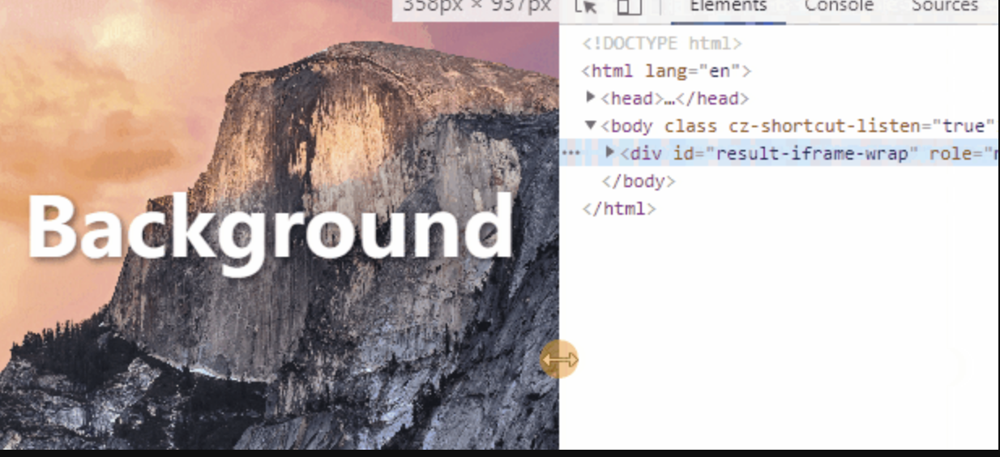
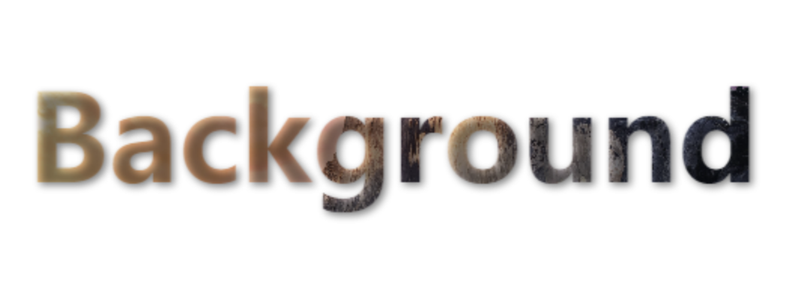
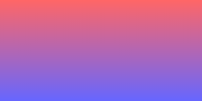
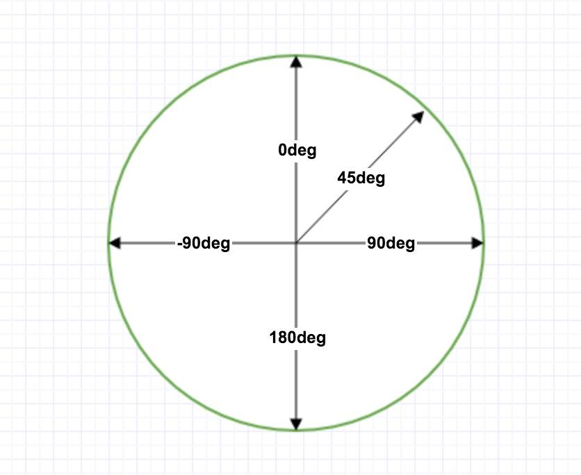
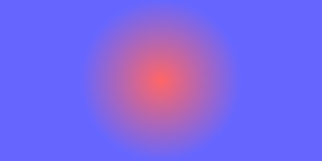
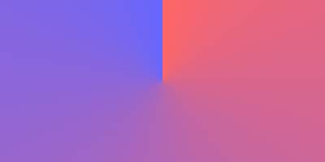
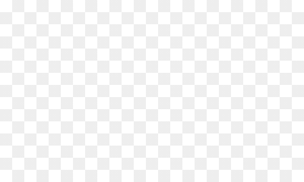
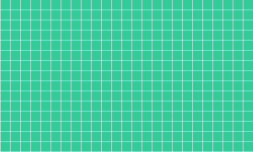
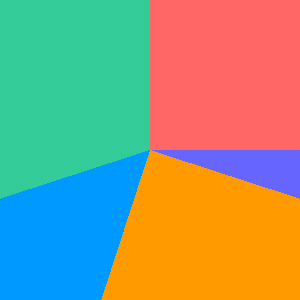

> background 是使用最多的属性之一，mask 是使用最少的属性之一。为何要拿 background 和 mask 一起说呢？因为它们的格式和用法大部分相似，作用效果也相似，是少有的兄弟属性。另外，margin 和 padding 也是一对常见的兄弟属性，何时使用 margin 何时使用 padding，这个就自行探讨了

## 属性连写

> background 是一个大家庭，包含着众多子属性，这些子属性可拆开声明也可合并声明。拆开与合并也是看个人编码习惯，无特别的标准说一定要怎样处理。合并声明有一个标准称呼，叫做属性连写。

`background`包含以下子属性，而 mask 子属性也大部分与`background`一致。

- `background-color`：背景颜色
- `background-image`：背景图像
- `background-repeat`：背景图像平铺方式
- `background-attachment`：背景图像依附方式
- `background-position`：背景图像起始位置
- `background-size`：背景图像尺寸模式
- `background-origin`：定位区域
- `background-clip`：绘制区域
- `background-blend-mode`：混合模式

> 除了`background`，以下属性也包含众多子属性，它们单独声明也能代替单个子属性声明。例如`padding-top:10px`等价于`padding:10px 0 0 0`

- `margin`
- `padding`
- `border`
- `outline`
- `mask`
- `font`
- `transition`
- `animation`

最常使用的 background，有些同学喜欢简写，有些同学喜欢连写。建议只声明一个子属性时使用简写，声明两个或以上子属性时使用连写。这样是为了规范代码，增加代码的可读性。

    /* 简写 */
    .elem {
        background-color: #f66;
        background-image: url("./img.png");
        background-repeat: no-repeat;
        background-position: center;
        background-size: 100px 100px;
    }
    /* 连写 */
    .elem {
        background: #f66 url("./img.png") no-repeat center/100px 100px;
    }

细心的同学可能发现`position`和`size`在连写时使用`/`衔接起来了。

刚开始的`background`只有`color`、`image`、`repeat`、`attachment`和`position`这五个子属性，CSS3 发布后增加了`size`、`origin`和`clip`这三个子属性，而`position`和`size`都能使用长度单位作为值，连写时就无法区分两者的位置了，所以使用/将两者衔接起来。

通用格式是`position/size`，若声明`background:#f66 100px 100px，100px 100px`对应是`position`，而`size`不会被声明。

属性连写的好处是比单个子属性声明要简洁得多，可少写很多代码。而 background 子属性众多，到底如何安排子属性连写顺序也是一个难题。刚好 CSS2 推荐了一条子属性连写顺序规则。

    background: color image repeat attachment position/size

- `origin`和`clip`不能加入到属性连写中，因为其取值都是一致的，有些浏览器无法区分它们的取值。
- 若某些值缺省则往前补充即可。background 子属性连写顺序并无强制标准，若不喜欢上述规范，也可自行制定。以下涉及到 mask 子属性连写顺序与 background 子属性连写顺序一致，就不再啰嗦了

## 背景

> `background`子属性众多，其属性取值也很多。

- **background-color：颜色**

  - `transparent`：透明(默认)
  - `Keyword`：颜色关键字
  - `HEX`：十六进制色彩模式
  - `RGB`或`RGBA`：RGB/A 色彩模式
  - `HSL`或`HSLA`：HSL/A 色彩模式
  - `Color1/Color2`：覆盖颜色，背景颜色可能是`Color1`，若背景图像无效则使用`Color2`代替`Color1`

- **background-image：图像**

  - `none`：无图像(默认)
  - `url()`：图像路径

- **background-repeat：图像平铺方式**

  - `repeat`：图像在水平方向和垂直方向重复(默认)
  - `repeat-x`：图像在水平方向重复
  - `repeat-y`：图像在垂直方向重复
  - `no-repeat`：图像仅重复一次
  - `space`：图像以相同间距平铺且填充整个节点
  - `round`：图像自动缩放直到适应且填充整个节点

- **background-attachment：图像依附方式**

  - `scroll`：图像随页面滚动而移动(默认)
  - `fixed`：图像不会随页面滚动而移动

- **background-position：图像起始位置**

  - `Position`：位置，可用任何长度单位，第二个位置(Y 轴)不声明默认是 50%(默认 0% 0%)
  - `Keyword`：位置关键字`left`、`right`、`top`、`bottom`、`center`，可单双使用，第二个关键字不声明默认是`center`

- **background-size：图像尺寸模式**

  - `auto`：自动设置尺寸(默认)
  - `cover`：图像扩展至足够大，使其完全覆盖整个区域，图像某些部分也许无法显示在区域中
  - `contain`：图像扩展至最大尺寸，使其宽度和高度完全适应整个区域
  - `Size`：尺寸，可用任何长度单位，第二个尺寸(高)不声明默认是`auto`

- **background-origin：定位区域(与 background-position 结合使用)**

  - `padding-box`：图像相对填充定位(默认)
  - `border-box`：图像相对边框定位
  - `content-box`：图像相对内容定位

- **background-clip：绘制区域**

  - `border-box`：图像被裁剪到边框与边距的交界处(默认)
  - `padding-box`：图像被裁剪到填充与边框的的交界处
  - `content-box`：图像被裁剪到内容与填充的交界处

- **background-blend-mode：混合模式**

  - `normal`：正常(默认)
  - `color-burn`：颜色加深
  - `color-dodge`：颜色减淡
  - `color`：颜色
  - `darken`：变暗
  - `difference`：差值
  - `exclusion`：排除
  - `hard-light`：强光
  - `hue`：色相
  - `lighten`：变亮
  - `luminosity`：亮度
  - `multiply`：正片叠底
  - `overlay`：叠加
  - `saturation`：饱和度
  - `screen`：滤色
  - `soft-light`：柔光

> 总体来说，`background`简单易用，以下三点可能需加注意。

- `repeat`和`position`包含后缀为`-x`和`-y`这两个子属性，若单独声明使用 x 或 y 即可
- `position`的`x`和`y`允许负值，当赋值 x 时正值向右负值向左，当赋值 y 时正值向下负值向上
- `background`声明多个图像路径时，若不声明`position`，那么首个图像定位在节点最顶部，剩余图像依次顺序显示 对于兼容性比较低的浏览器，`size`不能在`background`中连写，需单独编写

**贴顶背景**

这个需求可能是使用 background 最多的场景，没有之一。需求的定位很简单，就是背景图像贴着最顶部且水平居中显示，不管屏幕怎么拉伸都始终保持在最顶部最中间

    $bg: "https://static.yangzw.vip/codepen/mountain.jpg"; .pasted-bg {
        display: flex;
        justify-content: center;
        align-items: center;
        height: 300px;
        background: #000 url($bg) no-repeat center top/auto 300px;
        text-shadow: 2px 2px 5px rgba(#000, .5);
        font-weight: bold;
        font-size: 50px;
        color: #fff;
    }

> 该需求通常都会定死高度，声明`background-size:auto 300px`让背景图像高度跟节点高度一致但宽度自适应，千万别写死 100%，这样在浏览器窗口变化过程中就会让背景图像变形了。声明`background-position:center top`是为了让背景图像水平居中且贴着最顶部，无论浏览器窗口怎样变化都始终保持这个定位。

**多重背景**

CSS3 的 background 不仅仅增加了 size、origin 和 clip 这三个子属性，还增加了多重背景这个强大功能。多重背景可从上到下从左到右拼接背景图像，也可叠加背景图像。

    $bg-1: "https://static.yangzw.vip/codepen/ab-1.jpg";
    $bg-2: "https://static.yangzw.vip/codepen/ab-2.jpg";
    $bg-3: "https://static.yangzw.vip/codepen/mountain.jpg";
    $bg-4: "https://static.yangzw.vip/codepen/logo.svg";
    .spliced-bg {
        width: 300px;
        height: 200px;
        background-color: #3c9;
        background-image: url($bg-1), url($bg-2);
        background-repeat: no-repeat, no-repeat;
        background-position: left, right;
        background-size: auto 200px, auto 200px;
    }
    .overlying-bg {
        margin-left: 20px;
        width: 300px;
        height: 200px;
        background-image: url($bg-4), url($bg-3);
        background-repeat: repeat, no-repeat;
        background-position: left, center;
        background-size: auto 80px, auto 200px;
    }

声明顺序靠前的背景图像的层叠等级比较高，叠加背景图像时，靠前的背景图像尽量使用 png 格式才能让靠后的背景图像显示，否则可能遮挡靠后的背景图像

**镂空文本**

> `background-clip`是一个很巧妙的属性，除了专有的三个取值，在 Webkit 内核中还可裁剪到文本与内容的交界处，也就是说背景只作用于文本中。

有了`background-clip:text`，再结合`text-shadow`描绘文本阴影，让文字变得更立体更动感。

    $bg: "https://static.yangzw.vip/codepen/mountain.jpg"; .hollow-text {
        display: flex;
        justify-content: center;
        align-items: center;
        height: 200px;
        background: #000 url($bg) no-repeat center top/auto 300px;
        background-clip: text;
        text-shadow: 2px 2px 5px rgba(#000, .5);
        font-weight: bold;
        font-size: 80px;
        color: transparent;
    }

## 渐变

渐变一直以来在页面中都是一种常见的视觉元素。设计师都是通过图形软件设计这些渐变效果，然后以图像的形式被前端开发者运用到页面中。

> 渐变指两种或多种颜色在特定区域内平滑过渡的效果。曾经渲染带有渐变的背景只能使用图像实现。如今 CSS3 增加了以下几个渐变函数，让代码渲染渐变成为了可能

- `linear-gradient()`：线性渐变
- `radial-gradient()`：径向渐变
- `conic-gradient()`：锥形渐变
- `repeating-linear-gradient()`：重复线性渐变
- `repeating-radial-gradient()`：重复径向渐变
- `repeating-conic-gradient()`：重复锥形渐变

> 重点讲解`linear-gradient()`、`radial-gradient()`和`conic-gradient()`，`repeating-*`也是在原有函数的基础上延伸，就不再啰嗦了。

**CSS 渐变分为三种，每一种都有自身的特点**。

- 线性渐变：沿着指定方向从起点到终点逐渐改变颜色，渐变形状是一条直线
- 径向渐变：沿着任意方向从圆心往外面逐渐改变颜色，渐变形状是一个圆形或椭圆形
- 锥形渐变：沿着顺时针方向从圆心往外面逐渐改变颜色，渐变形状是一个圆锥体
- 每个渐变函数都必须在`background`或`background-image`上使用，可认为`gradient()`就是一个图像，只不过是通过函数产生的图像。

**线性渐变**

> 线性渐变是三种渐变效果里最简单的一种，以直线的方式向指定方向扩散，使用频率很高，是渐变函数里最好用的一个函数。掌握它几乎能应付大部分需求，其使用语法如下

    background-image: linear-gradient(direction, color-stop)

- **Direction：方向**

  - `Keyword`：方向关键字`to left/right/top/bottom/top left/top right/bottom left/bottom right`(默认`to bottom`)
  - `Angle`：角度，以顺时针方向的垂直线和渐变线的夹角计算，超出 N 圈则计算剩余角度

- **ColorStop：色标**

  - `Color`：颜色，可参考`background-color`取值，在指定位置产生渐变效果所使用的颜色
  - `Position`：位置，可参考`background-position`的`Position`取值，在指定位置产生渐变效果

    .elem {
        width: 400px;
        height: 200px;
        background-image: linear-gradient(to bottom, #f66, #66f);
        /* 等价于 */
        background-image: linear-gradient(to bottom, #f66 0, #66f 100%);
    }

> `color-stop()`在指定位置使用指定颜色，可用多个色标，其连写方式如下。第一个值为`Color`，第二个值为`Position`，编写形式为`#f66 30%`，若第二个值不声明则浏览器会自动分配位置。

    .elem {
        background-image: linear-gradient(to bottom, #f66 0, #66f 20%, #f90, 40%, #09f 60%, #9c3 80%, #3c9 100%);
    }

很多同学对线性渐变的方向搞不清，若`Direction`缺省则默认从上到下，也就是参数默认值`to bottom`。

可能使用方向关键字比较容易理解，`to xxx`就知道是什么意思了。千万不要使用单独的方向关键字，例如`left`、`right`、`top`和`bottom`等，因为 Sarafi 相对其他浏览器对这些单独的方向关键字的解释可能是不同的。

若以角度声明方向，上述角度解析可能有点拗口，可参考以下的角度演示图。

- `0deg：to top`
- `90deg：to right`
- `180deg：to bottom`
- `270deg：to left`

> 从形式上可联想到盒模型的`margin`、`padding`和`border`。`padding:10px 20px 30px 40px`可拆分为以下形式

- `padding-top：10px`
- `padding-right：20px`
- `padding-bottom：30px`
- `padding-left：40px`

其实 CSS 的方向顺序都是符合上右下左这个规则，若跟方向有关的声明都可联想到这个规则

**径向渐变**

> 径向渐变是一个很奇妙的渐变效果，以圆形或椭圆形的方式向任意方向扩散。参数有点奇葩，但是解构其参数后用起来也很方便，其使用语法如下。

    background-image: radial-gradient(shape size at position, color-stop)

- **Shape：形状**

  - `ellipse`：椭圆形(默认)
  - `circle`：圆形

- **Size：尺寸**

  - `farthest-corner`：从圆心到离圆心最远的角为半径(默认)
  - `farthest-side`：从圆心到离圆心最远的边为半径
  - `closest-corner`：从圆心到离圆心最近的角为半径
  - `closest-side`：从圆心到离圆心最近的边为半径
  - `Size`：尺寸，可用任何长度单位，宽和高必须同时声明

- **Position：位置**

  - Keyword：位置关键字`left、right、top、bottom、center`(默认 center)
  - Position：位置，可用任何长度单位

- **ColorStop：色标**

  - `Color`：颜色，可参考`background-color`取值，在指定位置产生渐变效果所使用的颜色
  - `Position`：位置，可参考`background-position`的 Position 取值，在指定位置产生渐变效果

    .elem {
        width: 400px;
        height: 200px;
        background-image: radial-gradient(100px 100px, #f66, #66f);
        /* 等价于 */
        background-image: radial-gradient(ellipse 100px 100px at center, #f66, #66f);
    }

> 径向渐变的`color-stop()`与线性渐变的`color-stop()`完全一致，其细节可回看上述详情。虽然径向渐变比线性渐变更复杂，只要了解其基本语法以及参数，基本也没什么大问题。

**锥形渐变**

> 锥形渐变比其他两个渐变效果更新潮，，以圆锥体的方式向顺时针方向扩散，产生的渐变效果就像俯视圆锥体的顶部。由于兼容性比较差也没什么实际应用，不过认识它也是一件很不错的事情，其使用语法如下。

    background-image: conic-gradient(color-stop)

- ColorStop：色标

  - Color：颜色，可参考 background-color 取值，在指定位置产生渐变效果所使用的颜色
  - Position：位置，可参考 background-position 的 Position 取值，在指定位置产生渐变效果

细心的同学可能发现锥形渐变无方向感，因为其无参数可声明。锥形渐变确实无参数用于声明方向，其渐变的起始位置是垂直线与向上方向的夹角(可参照上述线性渐变的`0deg`)，再沿着顺时针方向旋转产生渐变效果。

    .elem {
        width: 400px;
        height: 200px;
        background-image: conic-gradient(#f66, #66f);
        /* 等价于 */
        background-image: conic-gradient(#f66 0, #66f 100%);
    }

> 锥形渐变的`color-stop()`与线性渐变的`color-stop()`完全一致，其细节可回看上述详情。貌似锥形渐变比线性渐变更简单，其参数比线性渐变更少。

**渐变背景**

> 声明`linear-gradient()`产生从左上角往右下角的渐变效果，将背景定位在左边，通过`animation`控制背景定位左右徘徊产生动态的渐变背景。其实这是一种障眼法，好比在电视机前看电视，电视机不动，但镜头却一直在移动

    
iCSS

    .gradient-bg {
        display: flex;
        justify-content: center;
        align-items: center;
        height: 100%;
        background: linear-gradient(135deg, #f66, #f90, #3c9, #09f, #66f) left center/400% 400%;
        font-weight: bold;
        font-size: 100px;
        color: #fff;
        animation: move 10s infinite;
    }
    @keyframes move {
        0%, 100% {
            background-position-x: left;
        }
        50% {
            background-position-x: right;
        }
    }

**渐变文本**

> 实现原理与上述镂空文本和渐变背景一致，在声明`background-image`时由图像路径改成`linear-gradient()`，再通过`filter:hue-rotate()`在指定时间内改变背景色相。

    <h1 class="gradient-text">Full Stack Developer</h1>

    .gradient-text {
        background-image: linear-gradient(90deg, #f66, #f90);
        background-clip: text;
        line-height: 60px;
        font-size: 60px;
        color: transparent;
        animation: hue 5s linear infinite;
    }
    @keyframes hue {
        from {
            filter: hue-rotate(0);
        }
        to {
            filter: hue-rotate(-1turn);
        }
    }

**闪烁文本**

> 实现原理与上述渐变文本一致，额外声明`background-blend-mode`为强光模式是为了模拟闪烁效果。

    
🔥若对CSS技巧很感兴趣，请关注我喔

    .blink-text {
        width: 100%;
        background-image: linear-gradient(-45deg, #f66 30%, #fff 50%, #f66 70%);
        background-size: 200%;
        background-clip: text;
        background-blend-mode: hard-light;
        font-weight: bold;
        font-size: 20px;
        color: transparent;
        animation: shine 2s infinite;
    }
    @keyframes shine {
        from {
            background-position: 100%;
        }
        to {
            background-position: 0;
        }
    }

**方格背景**

> 曾经渲染方格背景需在图形软件下切出重复主体的图层，再声明`background-repeat:repeat`让该图像重复平铺到整个背景区域。

其实可用`linear-gradient()`完成上述效果，减少图像渲染。分析方格背景的特点可知，其主体部分由 4 个交错的正方形组成，两个白色两个灰色，声明`linear-gradient()`渲染出这个主体图像，再声明`background-repeat:repeat`让该主体图像重复平铺到整个背景区域。

> 首先声明`background-image:linear-gradient(45deg,#eee 25%,transparent 25%,transparent 75%,#eee 75%)`产生下图。有无发现把该图像复制一份并向上位移`20px`向右位移 2`0px`就得到上图

> 上述有提及`background`可用多重背景，那么此时就可用上了。声明两个`linear-gradient()`产生两个图像，声明`background-position:0 0, 20px 20px`让两个图像错位排列，声明`background-size:40px 40px`固定两个图像的大小。由于`background-repeat`的默认值是`repeat`，因此无需声明重复平铺了。

    

    .square-bg {
        width: 500px;
        height: 300px;
        background-image: linear-gradient(45deg, #eee 25%, transparent 25%, transparent 75%, #eee 75%),
            linear-gradient(45deg, #eee 25%, transparent 25%, transparent 75%, #eee 75%);
        background-position: 0 0, 20px 20px;
        background-size: 40px 40px;
    }

**网格背景**

实现原理与上述方格背景一致，各位同学可试试该效果的实现。

    

    .grid-bg {
        width: 500px;
        height: 300px;
        background-color: #3c9;
        background-image: linear-gradient(0deg, #fff 5%, transparent 5%, transparent),
            linear-gradient(90deg, #fff 5%, transparent 5%, transparent);
        background-position: 0 0, 20px 20px;
        background-size: 20px 20px;
    }

**彩色饼图**

平时绘制饼图需引入第三方图表库，仅仅绘制一个饼图而引入一个图表库，岂不是很浪费资源。若要求不高的话，其实 CSS 也能完成一个常规的饼图。

上述提及的`conic-gradient()`能产生锥形渐变，若控制每个颜色的渐变范围就能产生以下效果。该渐变范围指颜色渲染的边界，具体到哪个百分比。以下代码分别声明了`0~25%`、`25~30%`、`30~55%`、`55~70%`、`70~100%`这五个区间，每个区间渲染一种指定颜色。

    .elem {
        background-image: conic-gradient(#f66 0, #f66 25%, #66f 25% #66f, 30%, #f90 30%, #f90 55%, #09f 55%, #09f 70%, #3c9 70%, #3c9 100%);
    }

整个饼图在 0deg(可参照上述线性渐变的 0deg)的位置沿着顺时针方向依次渲染颜色，先定义的颜色先渲染。声明\`border-radius:100%让节点变成圆形，就能完成一个常规的饼图了

上述写法导致`background-image`过长，可用`color start end`代替`color start`, `color end`。

    

    .pie-chart {
        border-radius: 100%;
        width: 300px;
        height: 300px;
        background-image: conic-gradient(#f66 0 25%, #66f 25% 30%, #f90 30% 55%, #09f 55% 70%, #3c9 70% 100%);
    }

## 遮罩

> mask 子属性比 background 子属性还要多，其属性取值也很多，但是总体使用情况和 background 差不多。

- **mask-mode：模式**

  - `match-source`：根据图像类型采用合适的遮罩模式(默认)
  - `alpha`：根据图像透明度采用合适的遮罩模式
  - `luminance`：根据图像亮度采用合适的遮罩模式

- **mask-image**：图像

  - `none`：无图像(默认)
  - `url()`：图像路径

- **`mask-repeat`：图像平铺方式**

  - `repeat`：图像在水平方向和垂直方向重复(默认)
  - `repeat-x`：图像在水平方向重复
  - `repeat-y`：图像在垂直方向重复
  - `no-repeat`：图像仅重复一次
  - `space`：图像以相同间距平铺且填充整个节点
  - `round`：图像自动缩放直到适应且填充整个节点

- **mask-position：图像起始位置**

  - `Position`：位置，可用任何长度单位，第二个位置(Y 轴)不声明默认是 50%(默认`0% 0%`)
  - `Keyword`：位置关键字`left`、`right`、`top`、`bottom`、`center`，可单双使用，第二个关键字不声明默认是 center

- **mask-size：图像尺寸模式**

  - `auto`：自动设置尺寸(默认)
  - `cover`：图像扩展至足够大，使其完全覆盖整个区域，图像某些部分也许无法显示在区域中
  - `contain`：图像扩展至最大尺寸，使其宽度和高度完全适应整个区域
  - \`Size：尺寸，可用任何长度单位，第二个尺寸(高)不声明默认是 auto

- **mask-origin：定位区域(与 background-position 结合使用)**

  - `padding-box`：图像相对填充定位(默认)
  - `border-box`：图像相对边框定位
  - `content-box`：图像相对内容定位

- **mask-clip：绘制区域**

  - `border-box`：图像被裁剪到边框与边距的交界处(默认)
  - `padding-box`：图像被裁剪到填充与边框的的交界处
  - `content-box`：图像被裁剪到内容与填充的交界处

- **mask-composite：混合模式**

  - `source-over`：叠加，显示遮罩图像合并处
  - `subtract`：相减，不显示遮罩图像重合处
  - `intersect`：相交，显示遮罩图像重合处
  - `exclude`：排除，显示遮罩图像合并处但不显示重合处

> 总体来说，`mask`和 b`ackground`的格式和用法大部分相似，作用效果也相似。认识它的难度不大，当作`background`的另一种效果使用即可。

- `repeat`和`position`包含后缀为`-x`和`-y`这两个子属性，若单独声明使用 x 或 y 即可
- `position`的 x 和 y 允许负值，当赋值 x 时正值向右负值向左，当赋值 y 时正值向下负值向上
- mask 声明多个图像路径时，若不声明 position，那么首个图像定位在节点最顶部，剩余图像依次顺序显示
- 若要声明 mask 生效，节点的`background-image`必须使用透明格式的图像
- 目前多个浏览器还没统`一composite`的取值，上述取值均为 Firefox 标准，是极大可能被 W3C 标准化的取值，Chrome 标准请参照[这里][link 1]

**镂空背景**

实现原理与上述镂空文本一致，只不过是把`background-clip`改成`mask`。

- `background-clip:text`针对文本镂空
- `mask`针对图像镂空
- 实现镂空背景有两个要点。声明 background 时可选纯色、图像或渐变，声明 mask 时必须选择透明格式的图像才能用该图像的透明区域遮挡背景。

    

        

    

    $mask-bg: "https://static.yangzw.vip/codepen/mountain.jpg";
    $mask-text: "https://static.yangzw.vip/codepen/snow.jpg";
    $logo: "https://static.yangzw.vip/codepen/logo.png";
    .mask-bg {
        display: flex;
        overflow: hidden;
        justify-content: center;
        align-items: center;
        position: relative;
        height: 100%;
        &::after {
            position: absolute;
            left: -20px;
            right: -20px;
            top: -20px;
            bottom: -20px;
            background: url($mask-bg) no-repeat center/cover;
            filter: blur(10px);
            content: "";
        }
        div {
            position: relative;
            z-index: 9;
            width: 600px;
            height: 300px;
            background: url($mask-text) left center/150% auto;
            mask: url($logo) center/cover;
            animation: move 10s infinite;
        }
    }
    @keyframes move {
        0% {
            background-position-x: 0;
        }
        50% {
            background-position-x: 100%;
        }
    }

[202203211349861.png]: https://s.poetries.work/images/202203211349861.png
[202203211338573.png]: https://s.poetries.work/images/202203211338573.png
[202203211349955.png]: https://s.poetries.work/images/202203211349955.png
[202203211350287.png]: https://s.poetries.work/images/202203211350287.png
[202203211350687.png]: https://s.poetries.work/images/202203211350687.png
[202203211350751.png]: https://s.poetries.work/images/202203211350751.png
[202203211350565.png]: https://s.poetries.work/images/202203211350565.png
[202203211339604.png]: https://s.poetries.work/images/202203211339604.png
[202203211350442.png]: https://s.poetries.work/images/202203211350442.png
[202203211350151.png]: https://s.poetries.work/images/202203211350151.png
[202203211350674.png]: https://s.poetries.work/images/202203211350674.png
[202203211351156.png]: https://s.poetries.work/images/202203211351156.png
[202203211339251.png]: https://s.poetries.work/images/202203211339251.png
[202203211351918.png]: https://s.poetries.work/images/202203211351918.png
[202203211351732.png]: https://s.poetries.work/images/202203211351732.png
[202203211339392.png]: https://s.poetries.work/images/202203211339392.png
[link 1]: https://www.canvasapi.cn/CanvasRenderingContext2D/globalCompositeOperation
[202203211351260.png]: https://s.poetries.work/images/202203211351260.png
