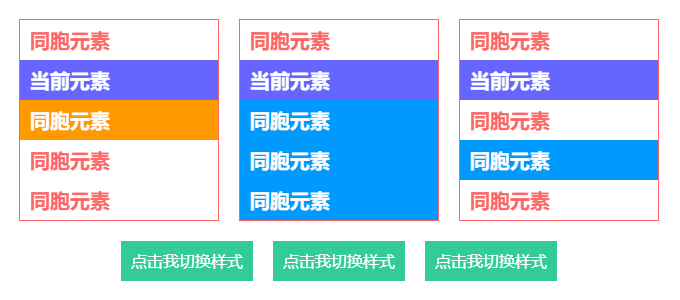
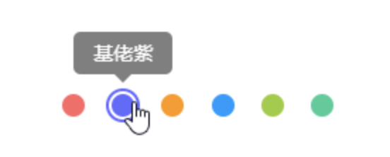
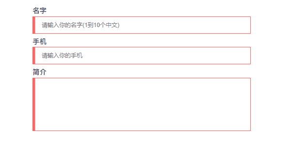
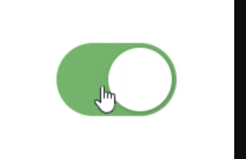
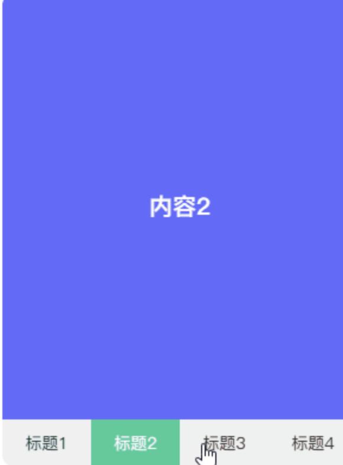
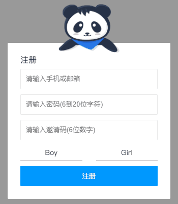
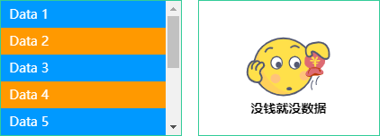
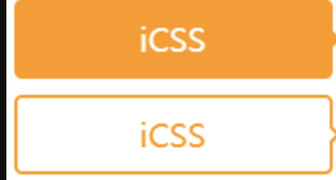

## 分类

在讲解选择器的奇妙用处前，还是先把选择器分类记忆吧。没错，笔者就是喜欢总结。由于选择器的标准概念上无作出明确的分类，以下的分类是为了方便记忆而整理的。

**基础选择器**

<table> 
 <thead> 
  <tr> 
   <th>选择器</th> 
   <th>别名</th> 
   <th>说明</th> 
   <th>版本</th> 
  </tr> 
 </thead> 
 <tbody> 
  <tr> 
   <td><code>tag</code></td> 
   <td>标签选择器</td> 
   <td>指定类型的标签</td> 
   <td>1</td> 
  </tr> 
  <tr> 
   <td><code>#id</code></td> 
   <td>ID选择器</td> 
   <td>指定身份的标签</td> 
   <td>1</td> 
  </tr> 
  <tr> 
   <td><code>.class</code></td> 
   <td>类选择器</td> 
   <td>指定类名的标签</td> 
   <td>1</td> 
  </tr> 
  <tr> 
   <td><code>*</code></td> 
   <td>通配选择器</td> 
   <td>所有类型的标签</td> 
   <td>2</td> 
  </tr> 
 </tbody> 
</table>

**层次选择器**

<table> 
 <thead> 
  <tr> 
   <th>选择器</th> 
   <th>别名</th> 
   <th>说明</th> 
   <th>版本</th> 
  </tr> 
 </thead> 
 <tbody> 
  <tr> 
   <td><code>elemP elemC</code></td> 
   <td>后代选择器</td> 
   <td>元素的后代元素</td> 
   <td>1</td> 
  </tr> 
  <tr> 
   <td><code>elemP&gt;elemC</code></td> 
   <td>子代选择器</td> 
   <td>元素的子代元素</td> 
   <td>2</td> 
  </tr> 
  <tr> 
   <td><code>elem1+elem2</code></td> 
   <td>相邻同胞选择器</td> 
   <td>元素相邻的同胞元素</td> 
   <td>2</td> 
  </tr> 
  <tr> 
   <td><code>elem1~elem2</code></td> 
   <td>通用同胞选择器</td> 
   <td>元素后面的同胞元素</td> 
   <td>3</td> 
  </tr> 
 </tbody> 
</table>

**集合选择器**

<table> 
 <thead> 
  <tr> 
   <th>选择器</th> 
   <th>别名</th> 
   <th>说明</th> 
   <th>版本</th> 
  </tr> 
 </thead> 
 <tbody> 
  <tr> 
   <td><code>elem1,elem2</code></td> 
   <td>并集选择器</td> 
   <td>多个指定的元素</td> 
   <td>1</td> 
  </tr> 
  <tr> 
   <td><code>elem.class</code></td> 
   <td>交集选择器</td> 
   <td>指定类名的元素</td> 
   <td>1</td> 
  </tr> 
 </tbody> 
</table>

**条件选择器**

<table> 
 <thead> 
  <tr> 
   <th>选择器</th> 
   <th>说明</th> 
   <th>版本</th> 
  </tr> 
 </thead> 
 <tbody> 
  <tr> 
   <td><code>:lang</code></td> 
   <td>指定标记语言的元素</td> 
   <td>2</td> 
  </tr> 
  <tr> 
   <td><code>:dir()</code></td> 
   <td>指定编写方向的元素</td> 
   <td>4</td> 
  </tr> 
  <tr> 
   <td><code>:has</code></td> 
   <td>包含指定元素的元素</td> 
   <td>4</td> 
  </tr> 
  <tr> 
   <td><code>:is</code></td> 
   <td>指定条件的元素</td> 
   <td>4</td> 
  </tr> 
  <tr> 
   <td><code>:not</code></td> 
   <td>非指定条件的元素</td> 
   <td>4</td> 
  </tr> 
  <tr> 
   <td><code>:where</code></td> 
   <td>指定条件的元素</td> 
   <td>4</td> 
  </tr> 
  <tr> 
   <td><code>:scope</code></td> 
   <td>指定元素作为参考点</td> 
   <td>4</td> 
  </tr> 
  <tr> 
   <td><code>:any-link</code></td> 
   <td>所有包含href的链接元素</td> 
   <td>4</td> 
  </tr> 
  <tr> 
   <td><code>:local-link</code></td> 
   <td>所有包含href且属于绝对地址的链接元素</td> 
   <td>4</td> 
  </tr> 
 </tbody> 
</table>

**行为选择器**

<table> 
 <thead> 
  <tr> 
   <th>选择器</th> 
   <th>说明</th> 
   <th>版本</th> 
  </tr> 
 </thead> 
 <tbody> 
  <tr> 
   <td><code>:active</code></td> 
   <td>鼠标激活的元素</td> 
   <td>1</td> 
  </tr> 
  <tr> 
   <td><code>:hover</code></td> 
   <td>鼠标悬浮的元素</td> 
   <td>1</td> 
  </tr> 
  <tr> 
   <td><code>::selection</code></td> 
   <td>鼠标选中的元素</td> 
   <td>3</td> 
  </tr> 
 </tbody> 
</table>

**状态选择器**

<table> 
 <thead> 
  <tr> 
   <th>选择器</th> 
   <th>说明</th> 
   <th>版本</th> 
  </tr> 
 </thead> 
 <tbody> 
  <tr> 
   <td><code>:target</code></td> 
   <td>当前锚点的元素</td> 
   <td>3</td> 
  </tr> 
  <tr> 
   <td><code>:link</code></td> 
   <td>未访问的链接元素</td> 
   <td>1</td> 
  </tr> 
  <tr> 
   <td><code>:visited</code></td> 
   <td>已访问的链接元素</td> 
   <td>1</td> 
  </tr> 
  <tr> 
   <td><code>:focus</code></td> 
   <td>输入聚焦的表单元素</td> 
   <td>2</td> 
  </tr> 
  <tr> 
   <td><code>:required</code></td> 
   <td>输入必填的表单元素</td> 
   <td>3</td> 
  </tr> 
  <tr> 
   <td><code>:valid</code></td> 
   <td>输入合法的表单元素</td> 
   <td>3</td> 
  </tr> 
  <tr> 
   <td><code>:invalid</code></td> 
   <td>输入非法的表单元素</td> 
   <td>3</td> 
  </tr> 
  <tr> 
   <td><code>:in-range</code></td> 
   <td>输入范围以内的表单元素</td> 
   <td>3</td> 
  </tr> 
  <tr> 
   <td><code>:out-of-range</code></td> 
   <td>输入范围以外的表单元素</td> 
   <td>3</td> 
  </tr> 
  <tr> 
   <td><code>:checked</code></td> 
   <td>选项选中的表单元素</td> 
   <td>3</td> 
  </tr> 
  <tr> 
   <td><code>:optional</code></td> 
   <td>选项可选的表单元素</td> 
   <td>3</td> 
  </tr> 
  <tr> 
   <td><code>:enabled</code></td> 
   <td>事件启用的表单元素</td> 
   <td>3</td> 
  </tr> 
  <tr> 
   <td><code>:disabled</code></td> 
   <td>事件禁用的表单元素</td> 
   <td>3</td> 
  </tr> 
  <tr> 
   <td><code>:read-only</code></td> 
   <td>只读的表单元素</td> 
   <td>3</td> 
  </tr> 
  <tr> 
   <td><code>:read-write</code></td> 
   <td>可读可写的表单元素</td> 
   <td>3</td> 
  </tr> 
  <tr> 
   <td><code>:target-within</code></td> 
   <td>内部锚点元素处于激活状态的元素</td> 
   <td>4</td> 
  </tr> 
  <tr> 
   <td><code>:focus-within</code></td> 
   <td>内部表单元素处于聚焦状态的元素</td> 
   <td>4</td> 
  </tr> 
  <tr> 
   <td><code>:focus-visible</code></td> 
   <td>输入聚焦的表单元素</td> 
   <td>4</td> 
  </tr> 
  <tr> 
   <td><code>:blank</code></td> 
   <td>输入为空的表单元素</td> 
   <td>4</td> 
  </tr> 
  <tr> 
   <td><code>:user-invalid</code></td> 
   <td>输入合法的表单元素</td> 
   <td>4</td> 
  </tr> 
  <tr> 
   <td><code>:indeterminate</code></td> 
   <td>选项未定的表单元素</td> 
   <td>4</td> 
  </tr> 
  <tr> 
   <td><code>:placeholder-shown</code></td> 
   <td>占位显示的表单元素</td> 
   <td>4</td> 
  </tr> 
  <tr> 
   <td><code>:current()</code></td> 
   <td>浏览中的元素</td> 
   <td>4</td> 
  </tr> 
  <tr> 
   <td><code>:past()</code></td> 
   <td>已浏览的元素</td> 
   <td>4</td> 
  </tr> 
  <tr> 
   <td><code>:future()</code></td> 
   <td>未浏览的元素</td> 
   <td>4</td> 
  </tr> 
  <tr> 
   <td><code>:playing</code></td> 
   <td>开始播放的媒体元素</td> 
   <td>4</td> 
  </tr> 
  <tr> 
   <td><code>:paused</code></td> 
   <td>暂停播放的媒体元素</td> 
   <td>4</td> 
  </tr> 
 </tbody> 
</table>

**结构选择器**

<table> 
 <thead> 
  <tr> 
   <th>选择器</th> 
   <th>说明</th> 
   <th>版本</th> 
  </tr> 
 </thead> 
 <tbody> 
  <tr> 
   <td><code>:root</code></td> 
   <td>文档的根元素</td> 
   <td>3</td> 
  </tr> 
  <tr> 
   <td><code>:empty</code></td> 
   <td>无子元素的元素</td> 
   <td>3</td> 
  </tr> 
  <tr> 
   <td><code>:first-letter</code></td> 
   <td>元素的首字母</td> 
   <td>1</td> 
  </tr> 
  <tr> 
   <td><code>:first-line</code></td> 
   <td>元素的首行</td> 
   <td>1</td> 
  </tr> 
  <tr> 
   <td><code>:nth-child(n)</code></td> 
   <td>元素中指定顺序索引的元素</td> 
   <td>3</td> 
  </tr> 
  <tr> 
   <td><code>:nth-last-child(n)</code></td> 
   <td>元素中指定逆序索引的元素</td> 
   <td>3</td> 
  </tr> 
  <tr> 
   <td><code>:first-child</code></td> 
   <td>元素中为首的元素</td> 
   <td>2</td> 
  </tr> 
  <tr> 
   <td><code>:last-child</code></td> 
   <td>元素中为尾的元素</td> 
   <td>3</td> 
  </tr> 
  <tr> 
   <td><code>:only-child</code></td> 
   <td>父元素仅有该元素的元素</td> 
   <td>3</td> 
  </tr> 
  <tr> 
   <td><code>:nth-of-type(n)</code></td> 
   <td>标签中指定顺序索引的标签</td> 
   <td>3</td> 
  </tr> 
  <tr> 
   <td><code>:nth-last-of-type(n)</code></td> 
   <td>标签中指定逆序索引的标签</td> 
   <td>3</td> 
  </tr> 
  <tr> 
   <td><code>:first-of-type</code></td> 
   <td>标签中为首的标签</td> 
   <td>3</td> 
  </tr> 
  <tr> 
   <td><code>:last-of-type</code></td> 
   <td>标签中为尾标签</td> 
   <td>3</td> 
  </tr> 
  <tr> 
   <td><code>:only-of-type</code></td> 
   <td>父元素仅有该标签的标签</td> 
   <td>3</td> 
  </tr> 
 </tbody> 
</table>

**属性选择器**

<table> 
 <thead> 
  <tr> 
   <th>选择器</th> 
   <th>说明</th> 
   <th>版本</th> 
  </tr> 
 </thead> 
 <tbody> 
  <tr> 
   <td><code>[attr]</code></td> 
   <td>指定属性的元素</td> 
   <td>2</td> 
  </tr> 
  <tr> 
   <td><code>[attr=val]</code></td> 
   <td>属性等于指定值的元素</td> 
   <td>2</td> 
  </tr> 
  <tr> 
   <td><code>[attr*=val]</code></td> 
   <td>属性包含指定值的元素</td> 
   <td>3</td> 
  </tr> 
  <tr> 
   <td><code>[attr^=val]</code></td> 
   <td>属性以指定值开头的元素</td> 
   <td>3</td> 
  </tr> 
  <tr> 
   <td><code>[attr$=val]</code></td> 
   <td>属性以指定值结尾的元素</td> 
   <td>3</td> 
  </tr> 
  <tr> 
   <td><code>[attr~=val]</code></td> 
   <td>属性包含指定值(完整单词)的元素(不推荐使用)</td> 
   <td>2</td> 
  </tr> 
  <tr> 
   <td><code>[attr|=val]</code></td> 
   <td>属性以指定值(完整单词)开头的元素(不推荐使用)</td> 
   <td>2</td> 
  </tr> 
 </tbody> 
</table>

**伪元素**

<table> 
 <thead> 
  <tr> 
   <th>选择器</th> 
   <th>说明</th> 
   <th>版本</th> 
  </tr> 
 </thead> 
 <tbody> 
  <tr> 
   <td><code>::before</code></td> 
   <td>在元素前插入的内容</td> 
   <td>2</td> 
  </tr> 
  <tr> 
   <td><code>::after</code></td> 
   <td>在元素后插入的内容</td> 
   <td>2</td> 
  </tr> 
 </tbody> 
</table>

## 优势

话说选择器若无用处，那 W3C 还干嘛把它纳入到标准里呢？选择器的劣势就不啰嗦了，使用不当可能会引起解析性能问题，这个对于现代浏览器来说几乎可忽略，除非你还是 IExplorer 的忠实粉丝。使用选择器有什么好处呢？笔者给各位同学总结一下。

- 对于那些结构与行为分离的写法，使用 sass/less 编写属性时结构会更清晰易读
- 减少很多无用或少用的类，保持 css 文件的整洁性和观赏性，代码也是一门艺术
- 减少修改类而有可能导致样式失效的问题，有时修改类但无确保 HTML 中和 CSS 中的一致而导致样式失效
- 减少无实质性使用的类，例如很多层嵌套的标签，这些标签可能只使用到一个 CSS 属性，就没必要建个类关联
- 使用选择器可实现一些看似只能由 JS 才能实现的效果，既可减少代码量也可减少 JS 对 DOM 的操作，使得交互效果更流畅

## 场景

由于选择器太多，笔者选择几个最具代表性的耍耍，通过选择器的妙用实现一些看似只能由 JS 才能实现的效果。未提到的选择器可能在其他地方穿插着讲解，请各位同学放心学习。

**+和~**

- `+/~`都是作用于当前节点后的同胞节点，但是两者有一个明显的区别，+是针对紧随该节点的节点，而~是针对后面所有的节点，包括紧随该节点的节点。`~`还可针对一些特定类和选择器的节点，所以其使用性更广泛。
- 另外，`+/~`通常都会结合`:checked`完成一些高难度的纯 CSS 效果，当`<input>`触发了`:checked`选中状态后可通过`+/~`带动后面指定的节点声明一些特别属性。

通常其 CSS 代码形式如下。

    input:checked + div {}
    input:checked ~ div {}

> `+/~`的用途很广，静态效果和动态效果都能用上它，是两个很关键的选择器。以下通过动静结合的方式展示`+/~`的用途。

    

        <ul class="list">
            <li>同胞元素</li>
            <li class="next">当前元素</li>
            <li>同胞元素</li>
            <li>同胞元素</li>
            <li>同胞元素</li>
        </ul>
        <ul class="list">
            <li>同胞元素</li>
            <li class="next-all">当前元素</li>
            <li>同胞元素</li>
            <li>同胞元素</li>
            <li>同胞元素</li>
        </ul>
        <ul class="list">
            <li>同胞元素</li>
            <li class="next-filter">当前元素</li>
            <li>同胞元素</li>
            <li class="filter">同胞元素</li>
            <li>同胞元素</li>
        </ul>
    

    

        

            <input id="btn1" type="radio" name="btns" hidden>
            <label for="btn1">点击我切换样式</label>
        

        

            <input id="btn2" type="radio" name="btns" hidden>
            <label for="btn2">点击我切换样式</label>
        

        

            <input id="btn3" type="radio" name="btns" hidden>
            <label for="btn3">点击我切换样式</label>
        

    

    .specify-selector {
        display: flex; & + .specify-selector {
            margin-top: 20px;
        }
        .list {
            border: 1px solid #f66;
            width: 200px;
            line-height: 2;
            font-weight: bold;
            font-size: 20px;
            color: #f66; & + .list {
                margin-left: 20px;
            }
            li {
                padding: 0 10px;
            }
            .next {
                background-color: #66f;
                color: #fff; & + li {
                    background-color: #f90;
                    color: #fff;
                }
            }
            .next-all {
                background-color: #66f;
                color: #fff; & ~ li {
                    background-color: #09f;
                    color: #fff;
                }
            }
            .next-filter {
                background-color: #66f;
                color: #fff; & ~ .filter {
                    background-color: #09f;
                    color: #fff;
                }
            }
        }
        .button {
            & + .button {
                margin-left: 20px;
            }
            label {
                display: block;
                padding: 0 10px;
                height: 40px;
                background-color: #3c9;
                cursor: pointer;
                line-height: 40px;
                font-size: 16px;
                color: #fff;
                transition: all 300ms;
            }
            input:checked + label {
                padding: 0 20px;
                border-radius: 20px;
                background-color: #f66;
            }
        }
    }

**:hover**

- `:hover`作用于鼠标悬浮的节点，是一个很好用的选择器。在特定场景可代替`mouseenter`和`mouseleave`两个鼠标事件，加上`transtion`让节点的动画更丝滑。

结合`attr()`有一个很好用的场景，就是鼠标悬浮在某个节点上显示提示浮层，提示浮层里包含着该动作的文本。

- 给节点标记一个用户属性`data-*`
- 当鼠标悬浮在该节点上触发`:hover`
- 通过`attr()`获取`data-*`的内容
- 将`data-*`的内容赋值到伪元素的`content`上

    <ul class="hover-tips">
        <li data-name="姨妈红"></li>
        <li data-name="基佬紫"></li>
        <li data-name="箩底橙"></li>
        <li data-name="姣婆蓝"></li>
        <li data-name="大粪青"></li>
        <li data-name="原谅绿"></li>
    </ul>

    $color-list: #f66 #66f #f90 #09f #9c3 #3c9; .hover-tips {
        display: flex;
        justify-content: space-between;
        width: 200px; li {
            position: relative;
            padding: 2px;
            border: 2px solid transparent;
            border-radius: 100%;
            width: 24px;
            height: 24px;
            background-clip: content-box;
            cursor: pointer;
            transition: all 300ms; &::before, &::after {
                position: absolute;
                left: 50%;
                bottom: 100%;
                opacity: 0;
                transform: translate3d(0, -30px, 0);
                transition: all 300ms;
            }
            &::before {
                margin: 0 0 12px -35px;
                border-radius: 5px;
                width: 70px;
                height: 30px;
                background-color: rgba(#000, .5);
                line-height: 30px;
                text-align: center;
                color: #fff;
                content: attr(data-name);
            }
            &::after {
                margin-left: -6px;
                border: 6px solid transparent;
                border-top-color: rgba(#000, .5);
                width: 0;
                height: 0;
                content: "";
            }
            @each $color in $color-list {
                $index: index($color-list, $color); &:nth-child(#{$index}) {
                    background-color: $color; &:hover {
                        border-color: $color;
                    }
                }
            }
            &:hover {
                &::before, &::after {
                    opacity: 1;
                    transform: translate3d(0, 0, 0);
                }
            }
        }
    }

**:valid 和:invalid**

很多同学可能还会使用 JS 去判断表单输入内容是否合法，其实 HTML5 发布后，可用纯 CSS 完成这些工作，正确搭配一些属性能大大减少校验表单的代码量。

完成一个完整的表单验证，需以下 HTML 属性和选择器搭配。

- `placeholder`：占位，在未输入内容时显示提示文本
- `pattern`：正则，在输入内容时触发正则验证
- `:valid`：作用于输入合法的表单节点
- `:invalid`：作用于输入非法的表单节点

  <input type="text" placeholder="" pattern="">

  input:valid {}
  input:invalid {}

> 这个`pattern`与 JS 正则有点不同，JS 的正则形式是`/regexp/`，而`pattern`的正则形式只需`/regexp/`里的`regexp`。这个校验过程是动态触发的，监听了 input 这个键盘事件，当输入内容合法时触发`:valid`，当输入内容非法时触发:`invalid`。

    <form class="form-validation">
        

            <label>名字</label>
            <input type="text" placeholder="请输入你的名字(1到10个中文)" pattern="^[\u4e00-\u9fa5]{1,10}$" required>
        

        

            <label>手机</label>
            <input type="text" placeholder="请输入你的手机" pattern="^1[3456789]\d{9}$" required>
        

        

            <label>简介</label>
            <textarea required></textarea>
        

    </form>

    .form-validation {
        width: 500px; div + div {
            margin-top: 10px;
        }
        label {
            display: block;
            padding-bottom: 5px;
            font-weight: bold;
            font-size: 16px;
        }
        input, textarea {
            display: block;
            padding: 0 20px;
            border: 1px solid #ccc;
            width: 100%;
            height: 40px;
            outline: none;
            caret-color: #09f;
            transition: all 300ms; &:valid {
                border-color: #3c9;
            }
            &:invalid {
                border-color: #f66;
            }
        }
        textarea {
            height: 122px;
            resize: none;
            line-height: 30px;
            font-size: 16px;
        }
    }

**:checked**

> `:checked`作用于选项选中的表单节点，当`<input>`的 type 设置成 radio 和`checkbox`时可用。在 CSS 神操作骚技巧中是一个很重要的技巧，主要是用于模拟鼠标点击事件

    <input class="ios-switch" type="checkbox">

    .btn {
        border-radius: 31px;
        width: 102px;
        height: 62px;
        background-color: #e9e9eb;
    }
    .ios-switch {
        position: relative;
        appearance: none;
        cursor: pointer;
        transition: all 100ms;
        @extend .btn;
        &::before {
            position: absolute;
            content: "";
            transition: all 300ms cubic-bezier(.45, 1, .4, 1);
            @extend .btn;
        }
        &::after {
            position: absolute;
            left: 4px;
            top: 4px;
            border-radius: 27px;
            width: 54px;
            height: 54px;
            background-color: #fff;
            box-shadow: 1px 1px 5px rgba(#000, .3);
            content: "";
            transition: all 300ms cubic-bezier(.4, .4, .25, 1.35);
        }
        &:checked {
            background-color: #5eb662; &::before {
                transform: scale(0);
            }
            &::after {
                transform: translateX(40px);
            }
        }
    }

> `<input>`与`<label>`的巧妙搭配

上述有提到与`+/~`的搭配使用，在此还有一个很重要的技巧，就是结合`<label>`使用。为何要结合`<label>`呢？因为要让`input:checked + div {}`或`input:checked ~ div {}`起效，其 HTML 结构必须像以下那样。

    <input type="radio">
    

> 这样就无法分离结构与行为了，导致 CSS 必须跟着 HTML 走，只能使用绝对定位将`input>`固定到指定位置。使用`<label>`绑定`<input>`，可将`<input>`的鼠标选择事件转移到`<label>`上，由`<label>`控制选中状态。那么 HTML 结构可改为以下那样，此时的`<input>`可设置`hidden`隐藏起来，不参与任何排版。

    <input type="radio" id="btn" hidden>
    

        <label for="btn">
    

> `<input>`使用 id 与`<label>`使用`for`关联起来，而`hidden`使`<input>`隐藏起来，不占用页面任何位置，此时`<label>`放置在页面任何位置都行。

    input:checked + div {}
    input:checked ~ div {}

笔者使用纯 CSS 实现的标签导航是一个很好的学习用例，在第 8 章变量计算有提及。

**:focus-within**

- `:focus-within`作用于内部表单节点处于聚焦状态的节点。它监听当前节点里是否有表单节点，且该表单节点是否处于聚焦状态。
- 有些同学听上去可能觉得拗口，其实它是一个简单易用的属性。表单控件触发`focus`和`blur`两个鼠标事件后往祖先节点冒泡，在祖先节点上通过`:focus-within`捕获该冒泡事件声明样式

    <form class="bubble-distribution">
        <h3>注册</h3>
        

            <input type="text" placeholder="请输入手机或邮箱" pattern="^1[3456789]\d{9}$|^[\w-]+(\.[\w-]+)*@[\w-]+(\.[\w-]+)+$" required>
            
        

        

            <input type="password" placeholder="请输入密码(6到20位字符)" pattern="^[\dA-Za-z_]{6,20}$" required>
            
        

        

            <input type="text" placeholder="请输入邀请码(6位数字)" pattern="^[\d]{6}$" maxLength="6" required>
            <button type="button">查询</button>
            
        

        
        <ul>
            <li>
                <input id="male" type="radio" name="sex">
                <label for="male">Boy</label>
            </li>
            <li>
                <input id="female" type="radio" name="sex">
                <label for="female">Girl</label>
            </li>
        </ul>
        <button type="button">注册</button>
    </form>

    .bubble-distribution {
        position: relative;
        margin-top: 50px;
        padding: 25px;
        border-radius: 2px;
        width: 320px;
        background-color: #fff; h3 {
            font-size: 16px;
            color: #333;
        }
        div {
            margin-top: 10px;
        }
        img {
            position: absolute;
            left: 50%;
            bottom: 100%;
            margin: 0 0 -20px -60px;
            width: 120px;
        }
        ul {
            display: flex;
            justify-content: space-between;
            align-items: center;
            margin-top: 10px;
            height: 30px;
            line-height: 30px;
        }
        li {
            position: relative;
            width: 45%;
            transition: all 300ms; &:focus-within {
                background: linear-gradient(90deg, #09f 50%, transparent 0) repeat-x,
                    linear-gradient(90deg, #09f 50%, transparent 0) repeat-x,
                    linear-gradient(0deg, #09f 50%, transparent 0) repeat-y,
                    linear-gradient(0deg, #09f 50%, transparent 0) repeat-y;
                background-position: 0 0, 0 100%, 0 0, 100% 0;
                background-size: 8px 1px, 8px 1px, 1px 8px, 1px 8px;
                animation: move 500ms infinite linear;
            }
        }
        input[type=text], input[type=password] {
            padding: 10px;
            border: 1px solid #e9e9e9;
            border-radius: 2px;
            width: 100%;
            height: 40px;
            outline: none;
            transition: all 300ms; &:focus:valid {
                border-color: #09f;
            }
            &:focus:invalid {
                border-color: #f66;
            }
        }
        input[type=radio] {
            position: absolute;
            width: 0;
            height: 0; &:checked + label {
                border: 3px solid transparent;
                background-color: #09f;
                color: #fff;
            }
        }
        label {
            display: block;
            border-bottom: 1px solid #ccc;
            width: 100%;
            background-clip: padding-box;
            cursor: pointer;
            text-align: center;
            transition: all 300ms;
        }
        button {
            overflow: hidden;
            margin-top: 10px;
            border: none;
            border-radius: 2px;
            width: 100%;
            height: 40px;
            outline: none;
            background-color: #09f;
            cursor: pointer;
            color: #fff;
            transition: all 300ms;
        }
        .accout, .password, .code {
            img {
                display: none;
                margin-bottom: -27px;
            }
            &:focus-within {
                img {
                    display: block;
                }
                & ~ img {
                    display: none;
                }
            }
        }
        .code {
            display: flex;
            justify-content: space-between; button {
                margin-top: 0;
            }
            input {
                &:not(:placeholder-shown) {
                    width: 70%; & + button {
                        width: 25%;
                    }
                }
                &:placeholder-shown {
                    width: 100%; & + button {
                        width: 0;
                        opacity: 0;
                    }
                }
            }
        }
    }
    @keyframes move {
        to {
            background-position: 6% 0, -6% 100%, 0 -6%, 100% 6%;
        }
    }

**:empty**

> 还有使用 JS 判断列表集合为空时显示占位符吗？相信很多使用 MVVM 框架开发的同学都会使用条件判断的方式渲染虚拟 DOM，若列表长度不为 0 则渲染列表，否则渲染占位符。然而 CSS 提供了一个空判断的选择器`:empty`，这应该很少同学会注意到。

`:empty`作用于无子节点的节点，这个子节点也包括行内匿名盒(单独的文本内容)，匿名盒在第 4 章盒模型有提及。以下三种情况均为非空状态，若不出现这三种状态则为空状态，此时`:empty`才会触发。

- 仅存在节点：`

CSS

`
- 仅存在文本：`
CSS
`
- 同时存在节点和文本：`
Hello 
CSS

`

    <ul class="empty-list">
        <li v-for="v in 10" :key="v">Data {{v}}</li>
    </ul>
    <ul class="empty-list"></ul>

    $empty: "https://yangzw.vip/img/empty.svg"; .empty-list {
        overflow: auto;
        width: 200px;
        height: 150px;
        outline: 1px solid #3c9; &:empty {
            display: flex;
            justify-content: center;
            align-items: center;
            background: url($empty) no-repeat center/100px auto; &::after {
                margin-top: 90px;
                font-weight: bold;
                content: "没钱就没数据";
            }
        }
        & + .empty-list {
            margin-left: 20px;
        }
        li {
            padding: 0 10px;
            height: 30px;
            background-color: #09f;
            line-height: 30px;
            color: #fff; &:nth-child(even) {
                background-color: #f90;
            }
        }
    }

**::before 和::after**

- 有时为了实现某个效果而往页面里反复添加标签变得很繁琐，添加太多标签反而不好处理而变得难以维护。此时会引入伪元素这个概念解决上述问题。
- 伪元素指页面里不存在的元素。伪元素在 HTML 代码里未声明，却能正常显示，在页面渲染时看到这些本来不存在的元素发挥着重要作用。`:before`和`:after`是两个很重要的伪元素，早在 CSS2 就出现了。

> 起初伪元素的前缀使用单冒号语法。随着 CSS 改革，伪元素的前缀被修改成双冒号语法，`:before/:after`从此变成`::before/::after`，用来区分伪类。若兼容低版本浏览器，还需使用`:before`和`:after`，但是本小册均以`::before/::after`编写 CSS 代码。

**伪元素和伪类虽然都是选择器，但是它们还是存在一丝丝的差别**。

- 伪元素通常是一些实体选择器，选择满足指定条件的 DOM，例如`::selection`、`:nth-child(n)`和`:first-child`
- 伪类通常是一些状态选择器，选择处于特定状态的 DOM，例如:`hover`、`:focus`和`:checked`
- `::before/::after`必须结合`content`使用，通常用作修饰节点，为节点- 插入一些多余的东西，但又不想内嵌一些其他标签。若插入 2 个以下(包含`2`个)的修饰，建议使用`::before/::after`。

以下两个 HTML 结构是等效的

    

        :before
        CSS
        :after
    

    
CSS

    // 接上一个HTML结构 p {
        &::before {
            content: ":before";
        }
        &::after {
            content: ":after";
        }
    }

> `::before/::after`最常用的场景就是气泡对话框，圆滚滚的身子带上一个三角形的尾巴。像以下第二个挖空的气泡对话框，其实使用白色填充背景颜色，而小尾巴使用白色的`::after`叠加橙色的`::before`形成障眼法。

    
iCSS

    
iCSS

    .bubble-box {
        position: relative;
        border-radius: 5px;
        width: 200px;
        height: 50px;
        background-color: #f90;
        line-height: 50px;
        text-align: center;
        font-size: 20px;
        color: #fff; &::after {
            position: absolute;
            left: 100%;
            top: 50%;
            margin-top: -5px;
            border: 5px solid transparent;
            border-left-color: #f90;
            content: "";
        }
    }
    .bubble-empty-box {
        position: relative;
        margin-top: 10px;
        border: 2px solid #f90;
        border-radius: 5px;
        width: 200px;
        height: 50px;
        line-height: 46px;
        text-align: center;
        font-size: 20px;
        color: #f90; &::before {
            position: absolute;
            left: 100%;
            top: 50%;
            margin: -5px 0 0 2px;
            border: 5px solid transparent;
            border-left-color: #f90;
            content: "";
        }
        &::after {
            position: absolute;
            left: 100%;
            top: 50%;
            margin-top: -4px;
            border: 4px solid transparent;
            border-left-color: #fff;
            content: "";
        }
    }

[202203211338053.png]: https://s.poetries.work/images/202203211338053.png
[202203211348333.png]: https://s.poetries.work/images/202203211348333.png
[202203211338040.png]: https://s.poetries.work/images/202203211338040.png
[202203211349403.png]: https://s.poetries.work/images/202203211349403.png
[202203211349241.png]: https://s.poetries.work/images/202203211349241.png
[202203211338065.png]: https://s.poetries.work/images/202203211338065.png
[202203211349692.png]: https://s.poetries.work/images/202203211349692.png
[202203211349223.png]: https://s.poetries.work/images/202203211349223.png
