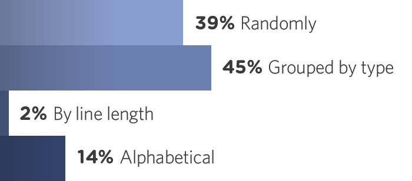

## 前言

上一章梳理了浏览器三大核心内容：渲染引擎、渲染过程、兼容性。其中渲染过程里的回流和重绘是 CSS 中很重要的概念。了解和认识它们，可编写出性能更好的 CSS 代码。

有些同学说，怎么不开发完 CSS 再找时间优化呢？试问有多少同学开发完一个项目后会拿出空余时间重构或优化你的代码。何必不在编码时对 CSS 代码进行一次完美的编写呢？接下来隆重介绍本章的两位主角。

## 回流

> 回流又名重排，指几何属性需改变的渲染。但是感觉回流这个词比较高大上，后续统称回流吧。

可理解成，将整个网页填白，对内容重新渲染一次。只不过以人眼的感官速度去看浏览器回流是不会有任何变化的，若你拥有闪电侠的感官速度去看浏览器回流(实质是将时间调慢)，就会发现每次回流都会将页面清空，再从左上角第一个像素点从左到右从上到下这样一点一点渲染，直至右下角最后一个像素点。每次回流都会呈现该过程，只是感受不到而已。

> 渲染树的节点发生改变，影响了该节点的几何属性，导致该节点位置发生变化，此时就会触发浏览器回流并重新生成渲染树。回流意味着节点的几何属性改变，需重新计算并生成渲染树，导致渲染树的全部或部分发生变化。

## 重绘

> 重绘指更改外观属性而不影响几何属性的渲染。相比回流，重绘在两者中会温和一些，后续谈到的 CSS 性能优化就会基于该特点展开。

渲染树的节点发生改变，但是不影响该节点的几何属性。由此可见，**回流对浏览器性能的消耗是高于重绘的，而且回流一定会伴随重绘，重绘却不一定伴随回流**。

为何回流一定会伴随重绘呢？整个节点的位置都变了，肯定要重新渲染它的外观属性啊！

## 属性分类

> 以下对一些常用的几何属性和外观属性分类，其实同种分类的属性都有一些共同点，各位同学可自行感受。推荐一个查询 CSS 属性渲染状态的网站[CssTriggers][]，可查看每个属性在渲染过程中发生了什么影响了什么

- 几何属性：包括布局、尺寸等可用数学几何衡量的属性

  - 布局：display、float、position、list、table、flex、columns、grid
  - 布局：display、float、position、list、table、flex、columns、grid

- 外观属性：包括界面、文字等可用状态向量描述的属性

  - 界面：appearance、outline、background、mask、box-shadow、box-reflect、filter、opacity、clip
  - 文字：text、font、word

**如何理解回流重绘**

有无更好的方法可帮助理解回流重绘呢？答案是有的。

某一天星巴克发行一套很有纪念价值的杯子，男同胞们为了买到心仪的杯子给女友当惊喜礼物，通宵达旦搬张板凳去星巴克门口排队。此时形成的队伍是有序的，毕竟大家都是文明人，不可能随便插队吧，先到先拿，这个道理谁都懂！

可是总有一些人不按常理出牌，别人排队排得那么辛苦，他一到来就仗着自己有钱有势人多马多，插队到最前面。若他插队成功，那么后面的人都要往后挪一位。此时队伍就要重新往后挪，甚至引发多人斗殴。但是混乱的情况总会被控制下来，此时就得重新排队，而原先的队伍顺序经过这次斗殴就可能不按照原先的队伍顺序排队了。几何属性变了，就要重新排队，这个就是回流或重排。重新排队啊 😂！

一位漂亮妹纸排队排得久肚子呱呱叫，就与另一位同伴交换，她去买早餐，而这位同伴代替她的位置。各位男同胞可能发现这位妹纸更漂亮了。没错，外观属性改变了，变漂亮了，但是除了妹纸，其余人的位置和顺序都无发生变化，所以肯定不会发生上述重新排队的情况。外观属性变了，但是几何属性没变，这个就是重绘。不用重新排队，还有漂亮妹纸看，大家都很乐意 🤔！

## 性能优化

回流重绘在操作节点样式时频繁出现，同时也存在很大程度上的性能问题。回流成本比重绘成本高得多，一个节点的回流很有可能导致子节点、兄弟节点或祖先节点的回流。在一些高性能电脑上也许无什么影响，但是回流发生在手机上(明摆说某些安卓手机)，就会减缓加载速度和增加电量消耗。

在上一章中引出一个定向法则：回流必定引发重绘，重绘不一定引发回流，可利用该法则解决一些因为回流重绘而引发的性能问题。在优化性能前，需了解什么情况可能产生性能问题，**以下罗列一些常见的情况**。

- 改变窗口大小
- 修改盒模型
- 增删样式
- 重构布局
- 重设尺寸
- 改变字体
- 改动文字

> 很多同学可能不知，回流重绘其实与浏览器的事件循环有关，以下源自对[HTML 文档的理解][html]

- 浏览器刷新频率为`60Hz`，即每`16.6ms`更新一次
- 事件循环执行完成微任务
- 判断`document`是否需更新
- 判断`resize/scroll`事件是否存在，存在则触发事件
- 判断`Media Query`是否触发
- 更新动作并发送事件
- 判断`document.isFullScreen`是否为`true`(全屏)
- 执行`requestAnimationFrame`回调
- 执行`IntersectionObserver`回调
- 更新界面

> 上述就是浏览器每一帧中可能会做到的事情，若在一帧中有空闲时间，就会执行`requestIdleCallback`回调。

回到正题，通过定向法则回流必定引发重绘，重绘不一定引发回流可知道，尽量减少回流重绘，就是 CSS 性能优化中一个很好的指标。

> 如何减少和避免回流重绘

**1. 使用 transform 代替 top**

> top 是几何属性，操作 top 会改变节点位置从而引发回流，使用`transform:translate3d(x,0,0)`代替 top，只会引发图层重绘，还会间接启动 GPU 加速，该情况在第 12 章变换与动画中会详细讲解。

**2. 使用 visibility:hidden 替换 display:none**

> 笔者从以下四方面对比`display:none`和`visibility:hidden，display:none`简称 DN，`visibility:hidden`简称 VH

- 占位表现

  - DN 不占据空间
  - VH 占据空间

- 触发影响

  - DN 触发回流重绘
  - VH 触发重绘

- 过渡影响

  - DN 影响过渡不影响动画
  - VH 不影响过渡不影响动画

- 株连效果

  - DN 后自身及其子节点全都不可见
  - VH 后自身及其子节点全都不可见但可声明子节点`visibility:visible`单独显示

> 两者的占位表现、触发影响和株连效果就能说明 VH 代替 DN 的好处，从两者区别中就能找出恰当的答案了

**3. 避免使用 Table 布局**

> 牵一发而动全身用在 Table 布局身上就很适合了，可能很小的一个改动就会造成整个`<table>`回流，有兴趣的同学可用 Chrome Devtools 的 Performance 调试看看，在此就不演示了。

通常可用`<ul>`、`<li>`和``等标签取代`<table>`系列标签生成表格。

**4. 避免样式节点层级过多**

> 浏览器的 CSS 解析器解析 css 文件时，对 CSS 规则是从右到左匹配查找，样式层级过多会影响回流重绘效率，建议保持 CSS 规则在 3 层左右。

**5. 将频繁回流或重绘的节点设置为图层**

上一章的渲染过程最后一步，提到将回流重绘生成的图层逐张合并并显示在屏幕上。可将其理解成 Photoshop 的图层，若不对图层添加关联，图层间是不会互相影响的。同理，在浏览器中设置频繁回流或重绘的节点为一张新图层，那么新图层就能够阻止节点的渲染行为影响别的节点，这张图层里怎样变化都无法影响到其他图层

> 设置新图层有两种方法，将节点设置为`<video>`或`<iframe>`，为节点添加`will-change`。`will-change`是一个很叼的属性，在第 12 章变换与动画中会详细讲解

**6. 动态改变类名而不改变样式**

- 不要尝试每次操作 DOM 去改变节点样式，这样会频繁触发回流。
- 更好的方法是使用新的类名预定义节点样式，在执行逻辑操作时收集并确认最终更换的类名集合，在适合时机一次性动态替换原来的类名集合。有点像 vue 的依赖收集机制，不知这样描述会不会更容易理解。

各位同学可研究下这个强大的[classList][]，它能满足笔者所说的需求。

**7. 避免节点属性值放在循环里当成循环变量**

    for (let i = 0; i < 10000; i++) {
        const top = document.getElementById("css").style.top;
        console.log(top);
    }

> 每次循环操作 DOM 都会发生回流，应该在循环外使用变量保存一些不会变化的 DOM 映射值

    const top = document.getElementById("css").style.top;
    for (let i = 0; i < 10000; i++) {
        console.log(top);
    }

**8. 使用 requestAnimationFrame 作为动画速度帧**

> 动画速度越快，回流次数越多，上述有提到浏览器刷新频率为 60Hz，即每 16.6ms 更新一次，而 requestAnimationFrame()正是以 16.6ms 的速度更新一次。所以可用 requestAnimationFrame()代替 setInterval()。

## 属性排序

> 在进入属性排序这个话题前，先来看看以下两段 CSS 代码。

    .elem {
        width: 200px;
        background-color: #f66;
        align-items: center;
        color: #fff;
        height: 200px;
        justify-content: center;
        font-size: 20px;
        display: flex;
    }

    .elem {
        display: flex;
        justify-content: center;
        align-items: center;
        width: 200px;
        height: 200px;
        background-color: #f66;
        font-size: 20px;
        color: #fff;
    }

若不特别指明，可能各位同学觉得这两段代码无异样，顶多就是属性顺序不同。但是仔细观察两段代码，就会发现第一段代码好像无依据地随便排列，而第二段代码好像按照某些规范顺序排列。

> 属性排序指按照预设规范排列 CSS 属性。提供一个预设的约定规范，依据该规范以一定的顺序排列所有属性。

曾经笔者也是随机排列属性顺序，想到什么写什么，反正能实现就行。但是反过来看，随意真的好吗，每次维护代码都需反复确认某个属性是否已经存在，混乱的属性排序让笔者有时无法在脑海里构思出更好的排版。所以笔者下意识去了解和认识属性排序，利用一些约定规范合理管理我的 CSS 代码。

曾经有一个著名的 CSS 网站 CSSTricks 做了一份属性排序的调查问卷，调查结果如下。

- A：随意排序占 39%
- B：按照类型排序占 45%
- C：按照单行代码长度排序占 2%
- D：按照属性字母排序占 14%

> 发现 B 选项占比最多

**属性排序有很多优点，笔者着重罗列一些。**

- 突出 CSS 艺术之美
- 防止属性重复编写
- 可快速定位到问题代码
- 可快速在脑海里构思出节点
- 可锻炼无视图架构页面能力
- 提高代码的可读性和可维护性

大部分前端开发者都会给属性做排序，可见业内大部分人对属性排序持有肯定的态度，只是在排序方式上会有一定的分歧。按照长度排序和按照字母排序是比较简单易用的排序方式，但是忽略了属性间的关联性。而按照类型排序又会分为很多种，主要还是围绕着盒模型。

- 按照类型排序
- 按照长度排序
- 按照字母排序

属性排序并不会影响样式的功能和性能，只是让代码看起来更简洁和规范。

> 笔者将属性排序按照布局 → 尺寸 → 界面 → 文字 → 交互的方式顺序定义。把交互属性放到后面是因为 transform 和 animation 会让节点重新生成新图层，上述有提到新图层不会对其他图层造成影响。

**布局属性**

- 显示：`display` `visibility`
- 溢出：`overflow` `overflow-x` `overflow-y`
- 浮动：`float` `clear`
- 定位：`position` `left` `right` `top` `bottom` `z-index`
- 列表：`list-style` `list-style-type` `list-style-position` `list-style-image`
- 表格：`table-layout` `border-collapse` `border-spacing` `caption-side` `empty-cells`
- 弹性：`flex-flow` `flex-direction` `flex-wrap` `justify-content` `align-content` `align-items` `align-self` `flex` `flex-grow` `flex-shrink` `flex-basis` `order`
- 多列：`columns` `column-width` `column-count` `column-gap` `column-rule` `column-rule-width` `column-rule-style` `column-rule-color` `column-span` `column-fill` `column-break-before` `column-break-after` `column-break-inside`
- 格栅：`grid-columns` `grid-rows`

**尺寸属性**

- 模型：box-sizing
- 边距：margin margin-left margin-right margin-top margin-bottom
- 填充：padding padding-left padding-right padding-top padding-bottom
- 边框：border border-width border-style border-color border-colors `border-[direction]-<param>`
- 圆角：border-radius border-top-left-radius border-top-right-radius border-bottom-left-radius border-bottom-right-radius
- 框图：border-image border-image-source border-image-slice border-image-width border-image-outset border-image-repeat
- 大小：width min-width max-width height min-height max-height

**界面属性**

- 外观：appearance
- 轮廓：outline outline-width outline-style outline-color outline-offset outline-radius `outline-radius-[direction]`
- 背景：background background-color background-image background-repeat background-repeat-x background-repeat-y background-position background-position-x background-position-y background-size background-origin background-clip background-attachment bakground-composite
- 遮罩：mask mask-mode mask-image mask-repeat mask-repeat-x mask-repeat-y mask-position mask-position-x mask-position-y mask-size mask-origin mask-clip mask-attachment mask-composite mask-box-image mask-box-image-source mask-box-image-width mask-box-image-outset mask-box-image-repeat mask-box-image-slice
- 滤镜：box-shadow box-reflect filter mix-blend-mode opacity,
- 裁剪：object-fit clip
- 事件：resize zoom cursor pointer-events touch-callout user-modify user-focus user-input user-select user-drag

**文字属性**

- 模式：line-height line-clamp vertical-align direction unicode-bidi writing-mode ime-mode
- 文本：text-overflow text-decoration text-decoration-line text-decoration-style text-decoration-color text-decoration-skip text-underline-position text-align text-align-last text-justify text-indent text-stroke text-stroke-width text-stroke-color text-shadow text-transform text-size-adjust
- 字体：src font font-family font-style font-stretch font-weight font-variant font-size font-size-adjust color
- 内容：overflow-wrap word-wrap word-break word-spacing letter-spacing white-space caret-color tab-size content counter-increment counter-reset quotes page page-break-before page-break-after page-break-inside

**交互属性**

- 模式：will-change perspective perspective-origin backface-visibility
- 变换：transform transform-origin transform-style
- 过渡：transition transition-property transition-duration transition-timing-function transition-delay
- 动画：animation animation-name animation-duration animation-timing-function animation-delay animation-iteration-count animation-direction animation-play-state animation-fill-mode

> 在此已经整合了 95%的属性，可满足 95%的属性排序。其他未列入的属性，可根据自身使用习惯添加。当然笔者的属性分类只提供参考。

**配置**

> 纯粹靠在编码过程中按照约定规范排列属性肯定是有难度的，也不方便频繁修改代码。每次编码时都记住这些属性排序估计也挺费脑力的，这么多属性，肯定使用工具自动化处理啊！推荐一个自动排列 CSS 属性的网站 Csscomb，在学前准备那章已经安装了 VSCode 的 Csscomb，接下来就配置一键排序

该插件貌似只有存档，主软件包已经无维护者了，后续估计也不会再更新

官网内容已经不复存在，以前是一步一步显示配置再选择适合自己的配置，最终生成一个 json 文件。配置详情请戳这里，以下的全局配置也是依据文档处理的，当然你也可对工作区设置。

> 打开 VSCode，Window 系统选择 ctrl+, → 用户 → 右上角第二个图标(打开设置)，Mac 系统选择 cmd+, → 用户 → 右上角第二个图标(打开设置)，在 json 文件里插入以下配置。

> sort-order 是一个数组，由于属性太多就不一一插入了，按照上述分类好的排序逐个插入即可，"sort-order":\["display", "visibility", ...\]

配置详情

    {
    	"csscomb.formatOnSave": true, // 保存代码时自动格式化
    	"csscomb.preset": {
    		"always-semicolon": true, // 分号结尾
    		"block-indent": "\t", // 换行格式
    		"color-case": "lower", // 颜色格式
    		"color-shorthand": true, // 颜色缩写
    		"element-case": "lower", // 元素格式
    		// "eof-newline": false, // 结尾空行
    		"leading-zero": false, // 保留前导零位
    		// "lines-between-rulesets": 0, // 规则间隔行数
    		"quotes": "double", // 引号格式
    		"remove-empty-rulesets": true, // 剔除空规则
    		"space-between-declarations": "\n", // 属性换行
    		"space-before-closing-brace": "\n", // 后花括号前插入
    		"space-after-colon": " ", // 冒号后插入
    		"space-before-colon": "", // 冒号前插入
    		"space-after-combinator": " ", // 大于号后插入
    		"space-before-combinator": " ", // 大于号前插入
    		"space-after-opening-brace": "\n", // 前花括号后插入
    		"space-before-opening-brace": " ", // 前花括号前插入
    		"space-after-selector-delimiter": "\n", // 逗号后插入
    		"space-before-selector-delimiter": "", // 逗号前插入
    		"strip-spaces": true, // 剔除空格
    		"tab-size": true, // 缩进大小
    		"unitless-zero": true, // 剔除零单位
    		"vendor-prefix-align": false, // 前缀缩进
    		"sort-order": [
    			// 布局属性
    			"display",
    			"visibility",
    			"overflow",
    			"overflow-x",
    			"overflow-y",
    			// 布局属性：浮动
    			"float",
    			"clear",
    			// 布局属性：定位
    			"position",
    			"left",
    			"right",
    			"top",
    			"bottom",
    			"z-index",
    			// 布局属性：列表
    			"list-style",
    			"list-style-type",
    			"list-style-position",
    			"list-style-image",
    			// 布局属性：表格
    			"table-layout",
    			"border-collapse",
    			"border-spacing",
    			"caption-side",
    			"empty-cells",
    			// 布局属性：弹性
    			"flex-flow",
    			"flex-direction",
    			"flex-wrap",
    			"justify-content",
    			"align-content",
    			"align-items",
    			"align-self",
    			"flex",
    			"flex-grow",
    			"flex-shrink",
    			"flex-basis",
    			"order",
    			// 布局属性：多列
    			"columns",
    			"column-width",
    			"column-count",
    			"column-gap",
    			"column-rule",
    			"column-rule-width",
    			"column-rule-style",
    			"column-rule-color",
    			"column-span",
    			"column-fill",
    			"column-break-before",
    			"column-break-after",
    			"column-break-inside",
    			// 布局属性：格栅
    			"grid-columns",
    			"grid-rows",
    			// 尺寸属性
    			"box-sizing",
    			"margin",
    			"margin-left",
    			"margin-right",
    			"margin-top",
    			"margin-bottom",
    			"padding",
    			"padding-left",
    			"padding-right",
    			"padding-top",
    			"padding-bottom",
    			"border",
    			"border-width",
    			"border-style",
    			"border-color",
    			"border-colors",
    			"border-left",
    			"border-left-width",
    			"border-left-style",
    			"border-left-color",
    			"border-left-colors",
    			"border-right",
    			"border-right-width",
    			"border-right-style",
    			"border-right-color",
    			"border-right-colors",
    			"border-top",
    			"border-top-width",
    			"border-top-style",
    			"border-top-color",
    			"border-top-colors",
    			"border-bottom",
    			"border-bottom-width",
    			"border-bottom-style",
    			"border-bottom-color",
    			"border-bottom-colors",
    			"border-radius",
    			"border-top-left-radius",
    			"border-top-right-radius",
    			"border-bottom-left-radius",
    			"border-bottom-right-radius",
    			"border-image",
    			"border-image-source",
    			"border-image-slice",
    			"border-image-width",
    			"border-image-outset",
    			"border-image-repeat",
    			"width",
    			"min-width",
    			"max-width",
    			"height",
    			"min-height",
    			"max-height",
    			// 界面属性
    			"appearance",
    			"outline",
    			"outline-width",
    			"outline-style",
    			"outline-color",
    			"outline-offset",
    			"outline-radius",
    			"outline-radius-topleft",
    			"outline-radius-topright",
    			"outline-radius-bottomleft",
    			"outline-radius-bottomright",
    			"background",
    			"background-color",
    			"background-image",
    			"background-repeat",
    			"background-repeat-x",
    			"background-repeat-y",
    			"background-position",
    			"background-position-x",
    			"background-position-y",
    			"background-size",
    			"background-origin",
    			"background-clip",
    			"background-attachment",
    			"bakground-composite",
    			"background-blend-mode",
    			"mask",
    			"mask-mode",
    			"mask-image",
    			"mask-repeat",
    			"mask-repeat-x",
    			"mask-repeat-y",
    			"mask-position",
    			"mask-position-x",
    			"mask-position-y",
    			"mask-size",
    			"mask-origin",
    			"mask-clip",
    			"mask-attachment",
    			"mask-composite",
    			"mask-box-image",
    			"mask-box-image-source",
    			"mask-box-image-width",
    			"mask-box-image-outset",
    			"mask-box-image-repeat",
    			"mask-box-image-slice",
    			"box-shadow",
    			"box-reflect",
    			"filter",
    			"mix-blend-mode",
    			"opacity",
    			"object-fit",
    			"clip",
    			"clip-path",
    			"resize",
    			"zoom",
    			"cursor",
    			"pointer-events",
    			"touch-callout",
    			"user-modify",
    			"user-focus",
    			"user-input",
    			"user-select",
    			"user-drag",
    			// 文字属性
    			"line-height",
    			"line-clamp",
    			"vertical-align",
    			"direction",
    			"unicode-bidi",
    			"writing-mode",
    			"ime-mode",
    			"text-overflow",
    			"text-decoration",
    			"text-decoration-line",
    			"text-decoration-style",
    			"text-decoration-color",
    			"text-decoration-skip",
    			"text-underline-position",
    			"text-align",
    			"text-align-last",
    			"text-justify",
    			"text-indent",
    			"text-stroke",
    			"text-stroke-width",
    			"text-stroke-color",
    			"text-shadow",
    			"text-transform",
    			"text-size-adjust",
    			"src",
    			"font",
    			"font-family",
    			"font-style",
    			"font-stretch",
    			"font-weight",
    			"font-variant",
    			"font-size",
    			"font-size-adjust",
    			"color",
    			// 内容属性
    			"overflow-wrap",
    			"word-wrap",
    			"word-break",
    			"word-spacing",
    			"letter-spacing",
    			"white-space",
    			"caret-color",
    			"tab-size",
    			"content",
    			"counter-increment",
    			"counter-reset",
    			"quotes",
    			"page",
    			"page-break-before",
    			"page-break-after",
    			"page-break-inside",
    			// 交互属性
    			"will-change",
    			"perspective",
    			"perspective-origin",
    			"backface-visibility",
    			"transform",
    			"transform-origin",
    			"transform-style",
    			"transition",
    			"transition-property",
    			"transition-duration",
    			"transition-timing-function",
    			"transition-delay",
    			"animation",
    			"animation-name",
    			"animation-duration",
    			"animation-timing-function",
    			"animation-delay",
    			"animation-iteration-count",
    			"animation-direction",
    			"animation-play-state",
    			"animation-fill-mode"
    		] // 属性排序
    	}
    }

> 配置完成后，若觉得每次保存时格式化 CSS 代码会影响编辑器性能，可为 Csscomb 配置快捷键，在有需时再格式化 CSS 代码。Window 系统选择 ctrl+K+S → 用户 → 右上角第一个图标(打开键盘快捷方式)，Mac 系统选择 cmd+K+S → 用户 → 右上角第一个图标(打开键盘快捷方式)，在 json 文件里插入以下配置

    [{
        "key": "ctrl+alt+c", // "cmd+alt+c"
        "command": "csscomb.execute"
    }]

全选代码或选择局部代码，执行`ctrl/cmd+alt+c`，自动格式化代码且自动排列属性，一个字，爽 🤔！

[csstriggers]: https://csstriggers.com/
[html]: https://html.spec.whatwg.org/multipage/webappapis.html#event-loop-processing-model
[classlist]: https://www.runoob.com/jsref/prop-element-classlist.html
[202203211337716.png]: https://s.poetries.work/images/202203211337716.png
