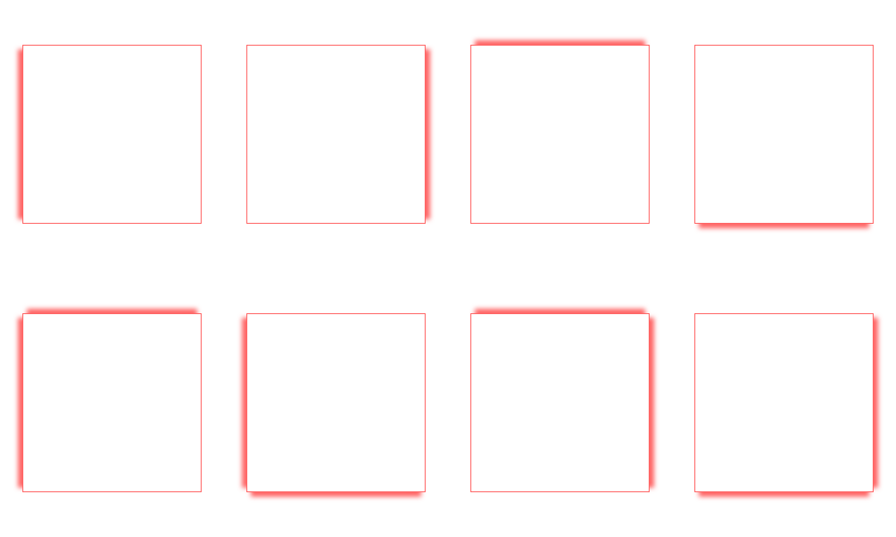
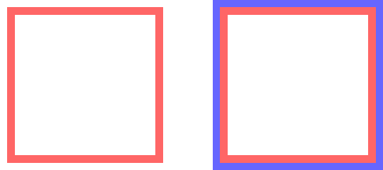
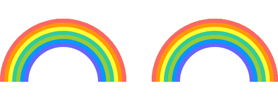
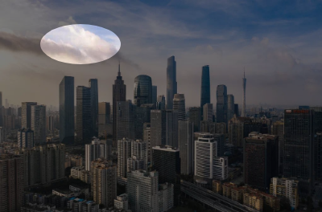
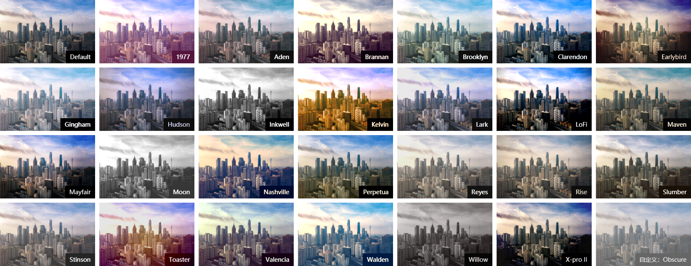
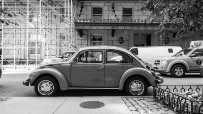

## 前言

阴影和滤镜能让视觉元素看上去更具立体感，阴影为视觉元素提供了边界轮廓，滤镜为视觉元素提供了多变外观。随着浏览器不断升级，阴影和滤镜的兼容性得到了大大提升。

阴影和滤镜在一般情况下可有可无，它们更多是为了点缀视觉元素而存在。早期的视觉元素为了实现这两种效果，只能使用图像实现，每次维护都需重新切图重新替换，确实麻烦。

如今 CSS3 为阴影和滤镜提供了对应的属性，可通过编码的方式完成这些效果，就无须使用图像实现了。

## 阴影

> 阴影效果有三剑客，分别是`box-shadow`、`text-shadow`、`drop-shadow()`。`box-shadow`和`text-shadow`都是一个属性，而`drop-shadow()`是`filter`里的滤镜函数。

三者都能产生阴影效果，如何区分它们的使用场景呢。其实从字面意思也大概能猜出各自的使用场景了。

- 想要盒子轮廓产生阴影效果，使用`box-shadow`
- 想要文本轮廓产生阴影效果，使用`text-shadow`
- 想要透明图像的非透明部分轮廓产生阴影效果，使用`fliter:drop-shadow()`

三个阴影都具备以下大部分参数，只要认识以下参数，阴影效果随时能上手

- **OffsetX：水平偏移，阴影的水平位置(必选)**

  - Offset：偏移，可用任何长度单位，允许负值，正值向右负值向左(默认 0)

- **OffsetY：垂直偏移，阴影的垂直位置(必选)**

  - Offset：偏移，可用任何长度单位，允许负值，正值向下负值向上(默认 0)

- **Blur：模糊半径，阴影的清晰程度(虚色)**

  - Length：长度，可用任何长度单位，值越大边缘越模糊(默认 0)

- **Spread：扩展距离，阴影的实体尺寸(实色)**

  - Length：长度，可用任何长度单位，允许负值，正值扩大负值缩小(默认 0)

- **Color：投影颜色**

  - `transparent`：透明(默认)
  - `Keyword`：颜色关键字
  - `HEX`：十六进制色彩模式
  - `RGB`或 RGBA：RGB/A 色彩模式
  - `HSL`或 HSLA：HSL/A 色彩模式

- **Position：投影位置**

  - `outset`：阴影显示在外部(默认)
  - `inset`：阴影显示在内部

上述参数都是`box-shadow`标配的，而`text-shadow`和`drop-shadow()`除了`spread`和`position`，其余全部标配。三个阴影的用法都一致，无什么特殊区别，以下着重讲解`box-shadow`的技巧，另外两个属性也可参照该属性适当扩展使用场景

    box-shadow: offset-x offset-y blur spread color position
    text-shadow: offset-x offset-y blur color
    drop-shadow(offset-x, offset-y, blur, color)

**多重阴影**

> 与 backgound 和 mask 一致可声明多重效果，使用逗号隔开。先声明的阴影层叠等级最高，会遮挡后面声明的阴影，排列方向由 position 决定。后面声明的阴影接着上一个排列下去，此时需将 blur 或 spread 增大，防止被先声明的阴影遮挡。

**定向阴影**

> 巧妙声明 spread 为 blur 的负值可产生定向阴影，这样是为了抵消阴影的扩散。还记得`offset-x`和`offset-y`的取值吗，正负决定了偏移方向。当然这个技巧只适用于`box-shadow`。

- `offset-x`：正值向右负值向左
- `offset-y`：正值向下负值向上

> 根据上述`offset-x`和`offset-y`的偏移方向，可确定以下定向阴影的方向对应的参数。

- 向左：`offset-x`为负，`offset-y`为 0
- 向右：`offset-x`为正，`offset-y`为 0
- 向上：`offset-x`为 0，`offset-y`为负
- 向下：`offset-x`为 0，`offset-y`为正

若想多几个方向产生定向阴影，可结合多重阴影的规则实现。

    .shadow {
        margin-left: 50px;
        border: 1px solid #f66;
        width: 200px;
        height: 200px; &:nth-child(4n-3) {
            margin-left: 0;
        }
        &.left {
            box-shadow: -10px 0 5px -5px #f66;
        }
        &.right {
            box-shadow: 10px 0 5px -5px #f66;
        }
        &.up {
            box-shadow: 0 -10px 5px -5px #f66;
        }
        &.down {
            box-shadow: 0 10px 5px -5px #f66;
        }
        &.left-up {
            box-shadow: -10px 0 5px -5px #f66, 0 -10px 5px -5px #f66;
        }
        &.left-down {
            box-shadow: -10px 0 5px -5px #f66, 0 10px 5px -5px #f66;
        }
        &.right-up {
            box-shadow: 10px 0 5px -5px #f66, 0 -10px 5px -5px #f66;
        }
        &.right-down {
            box-shadow: 10px 0 5px -5px #f66, 0 10px 5px -5px #f66;
        }
    }

**模拟边框**

> 众所周知，border 参与到盒模型的计算和布局中，占据了一定的位置。若希望边框只是一件附属物，不纳入盒模型的计算和布局中，可用 outline 代替 border，而 outline 的用法和参数与 border 一致，效果上无太大区别，唯一的却别是 outline 描绘的轮廓不纳入盒模型的计算和布局中。

本章认识的 box-shadow 也能代替 border 产生边框效果，当然也不纳入盒模型的计算和布局中。当然这个技巧只适用于 box-shadow。

- 阴影不影响布局，可能会覆盖其他节点及其阴影
- 阴影不触发滚动条，也不会增加滚动区域大小

> blur 渲染阴影是虚色，而 spread 渲染阴影是实色，所以可将其余参数声明为 0，spread 声明为正值，编写形式为`box-shadow:0 0 0 10px #f66`。还可结合`border-radius`让阴影变成圆角

    .shadow {
        border: 1px solid #f66;
        width: 200px;
        height: 200px;
        box-shadow: 0 0 0 10px #f66;
    }
    .shadow {
        width: 200px;
        height: 200px;
        box-shadow: 0 0 0 10px #f66; &.borders {
            margin-left: 100px;
            box-shadow: 0 0 0 10px #f66, 0 0 0 20px #66f;
        }
    }

**彩虹色带**

彩虹色带很漂亮，可用 box-shadow 将其渲染得淋漓尽致。实现原理主要是使用了多重阴影，另外也可用第 7 章函数计算的 clip-path 实现一番。

    

    

    $rainbow: 0 0 0 8px #f66 inset,
        0 0 0 16px #f90 inset,
        0 0 0 24px #ff3 inset,
        0 0 0 32px #3c9 inset,
        0 0 0 40px #9c3 inset,
        0 0 0 48px #09f inset,
        0 0 0 56px #66f inset;
    .rainbow-bar {
        width: 250px;
        &.bar-1 {
            overflow: hidden;
            position: relative;
            height: 125px;
            &::after {
                display: block;
                border-radius: 100%;
                width: 100%;
                height: 200%;
                box-shadow: $rainbow;
                content: "";
            }
        }
        &.bar-2 {
            margin: 125px 0 0 50px;
            border-radius: 100%;
            height: 250px;
            box-shadow: $rainbow;
            clip-path: polygon(0 0, 100% 0, 100% 50%, 0 50%);
        }
    }

**专栏头像**

> 上述谈到阴影和滤镜能让视觉元素看上去更具立体感，实际上阴影起了最大作用。`box-shadow`和`text-shadow`结合起来能让视觉元素更立体更动感。

    

        
JowayYoung

        
谈前端

    

    .article-avatar {
        display: flex;
        flex-flow: column wrap;
        justify-content: center;
        align-items: center;
        border-radius: 100%;
        width: 250px;
        height: 250px;
        background-color: #f66;
        box-shadow: 0 0 50px 5px rgba(#000, .2) inset;
        line-height: 50px;
        text-shadow: 5px 5px 10px rgba(#000, .5);
        font-weight: bold;
        font-size: 30px;
        color: #fff; .left {
            border-top: 3px solid #fff;
            text-indent: -1em;
        }
        .right {
            text-indent: 2em;
            font-size: 40px;
        }
    }

**聚焦区域**

有无遇过一些迭代新功能的网站，进去时会有一些导航提示，告诉你网站增加了哪些内容。

这个导航提示通常都是一个矩形区域定位在增加内容上方，区域内部透明，凸显增加内容，而区域外部会带上一层蒙层，兼容其他内容。当然这个效果可用 box-shadow 实现，还记得阴影可调制各种透明颜色吗？将 spread 延长到 9999px 足以覆盖整个网站了

    

        
        <i></i>
    

    .img-cliper {
        overflow: hidden;
        position: relative;
        img {
            width: 400px;
        }
        i {
            position: absolute;
            left: 50px;
            top: 30px;
            border-radius: 100%;
            width: 100px;
            height: 50px;
            box-shadow: 0 0 0 9999px rgba(#000, .5);
        }
    }

## 滤镜

玩过 Photoshop 的同学都知道，其内置的强大滤镜能让图像焕然一新。曾经只能切图完成这些图像滤镜效果，如今可用 CSS3 提供的 filter 完成这些滤镜效果了。

> 以前每次修改网页滤镜效果都需重新切图，再换上新的图像，使用 CSS 滤镜就免去这些烦恼。不妨看看 filter 提供的那些滤镜属性吧。

- blur()：模糊

  - Length：长度，可用任何长度单位，值为 0 显示原图，值越大越模糊

- brightness()：亮度

  - Percentage：百分比，可用 0~1 代替，值为 0 显示全黑，值为 100%显示原图

- contrast()：对比度

  - Percentage：百分比，可用 0~1 代替，值为 0 显示全黑，值为 100%显示原图

- drop-shadow()：阴影

  - 参考上述阴影

- grayscale()：灰度

  - Percentage：百分比，可用 0~1 代替，值为 0 显示原图，值为 100%显示全灰

- hue-rotate()：色相旋转

  - Angle：角度，值为 0 显示原图，值为 0~360deg 减弱原图色彩，值超过 360deg 则相当绕 N 圈再计算剩余的值

- invert()：反相

  - Percentage：百分比，可用 0~1 代替，值为 0 显示原图，值为 100%完全反转原图色彩

- opacity()：透明度

  - Percentage：百分比，可用 0~1 代替，值为 0 显示透明，值为 100%显示原图

- saturate()：饱和度

  - Percentage：百分比，可用 0~1 代替，值为 0 完全不饱和原图，值为 100%显示原图

- sepia()：褐色

  - Percentage：百分比，可用 0~1 代替，值为 0 显示原图，值为 100%显示褐

滤镜更偏向设计方向，若学过设计课程的同学可能对滤镜的调制会更顺手。其实 filter 怎么用呢？问设计师索取图像在图像软件的滤镜参数声明 filter 即可。当然 filter 与 backgound 和 mask 一致可声明多重效果。

**滤镜调制**

其实 filter 上手不难，难就难在每个人的审美不同，很难做出比较唯美的滤镜效果，更多是看个人在设计方向的进修程度。

所以无设计基础的同学，可参照 Cssarm 的[官网][link 1]和[源码][link 2]学习滤镜调制，其源码通过 filter 复现了 Instagram 网站内置的图像滤镜效果。

**悼念模式**

> 一行代码全站进入悼念模式，把`<html>`替换成<`html style="filter:grayscale(1)">`即可，简单粗暴。当然核心代码是`filter:grayscale(1)`，意思是把当前节点及其后代节点设置成 100%的灰度模式。

    

    .mourning-mode {
        width: 400px;
        filter: grayscale(100%);
    }

- 可能有些同学在使用上述技巧时会发现声明`position:absolute/fixed`的节点会出现异常，导致某些布局排版错乱。因为节点声明不为`none`的`filter`时，若自身及其后代节点声明了`position:absolute/fixed`，则为其创建一个新容器，使得这些定位节点其定位基准相对这个新容器进行。

> 相信遇到上述问题的同学，应该都是在`<body>`或某个主要节点上声明`filter`吧。根据上述原理，把`filter:grayscale(1)`声明到`<html>`上就行。

- 因为不管怎样设置定位基准，`<html>`都是最顶层的容器，即使创建了新的定位基准节点，也不会对自身及其后代节点产生不符合预期的影响。
- 这也就是为何开头直接把`<html>`替换成`<html style="filter:grayscale(1)">`，当然笔者贴出来的示例也是为了讲解声明`filter:grayscale(1)`后出现的坑，同样原理，也可解决其他因为声明`filter`而导致布局排版错乱的问题

[202203211339139.png]: https://s.poetries.work/images/202203211339139.png
[202203211351406.png]: https://s.poetries.work/images/202203211351406.png
[202203211339690.png]: https://s.poetries.work/images/202203211339690.png
[202203211339711.png]: https://s.poetries.work/images/202203211339711.png
[202203211351577.png]: https://s.poetries.work/images/202203211351577.png
[link 1]: https://una.im/CSSgram/
[link 2]: https://una.im/CSSgram/css/cssgram.min.css
[202203211352587.png]: https://s.poetries.work/images/202203211352587.png
[202203211352192.png]: https://s.poetries.work/images/202203211352192.png
