### 0 对虚拟 DOM 的理解

> `虚拟dom从来不是用来和直接操作dom对比的`，它们俩最终殊途同归。`虚拟dom只不过是局部更新的一个环节而已`，整个环节的对比对象是全量更新。虚拟 dom 对于 state ＝ UI 的意义是，虚拟 dom 使 diff 成为可能（理论上也可以直接用 dom 对象 diff，但是太臃肿），促进了新的开发思想，又不至于性能太差。但是性能再好也不可能好过直接操作 dom，人脑连 diff 都省了。还有一个很重要的意义是，`对视图抽象，为跨平台助力`

其实我最终希望你明白的事情只有一件：`虚拟 DOM 的价值不在性能，而在别处`。因此想要从性能角度来把握虚拟 DOM 的优势，无异于南辕北辙。偏偏在面试场景下，10 个人里面有 9 个都走这条歧路，最后 9 个人里面自然没有一个能自圆其说，实在让人惋惜。

[真正理解虚拟 DOM(opens new window)][dom_opens new window]

### 1 谈谈你对 React 的理解

> React 是一个网页 UI 框架，通过组件化的方式解决视图层开发复用的问题，本质是一个组件化框架。

- 它的核心设计思路有三点，分别是`声明式、组件化与 通用性`。
- 声明式的优势在于直观与组合。
- 组件化的优势在于视图的拆分与模块复用，可以更容易做到高内聚低耦合。
- 通用性在于一次学习，随处编写。比如 React Native，React 360 等， 这里主要靠虚拟 DOM 来保证实现。
- 这使得 React 的适用范围变得足够广，无论是 Web、Native、VR，甚至 Shell 应用都可以进行开发。这也是 React 的优势。
- 但作为一个视图层的框架，React 的劣势也十分明显。它并没有提供完整的一揽子解决方 案，在开发大型前端应用时，需要向社区寻找并整合解决方案。虽然一定程度上促进了社区的繁荣，但也为开发者在技术选型和学习适用上造成了一定的成本。
- 承接在优势后，可以再谈一下自己对于 React 优化的看法、对虚拟 DOM 的看法

### 2 如何避免 React 生命周期中的坑

**16.3 版本**

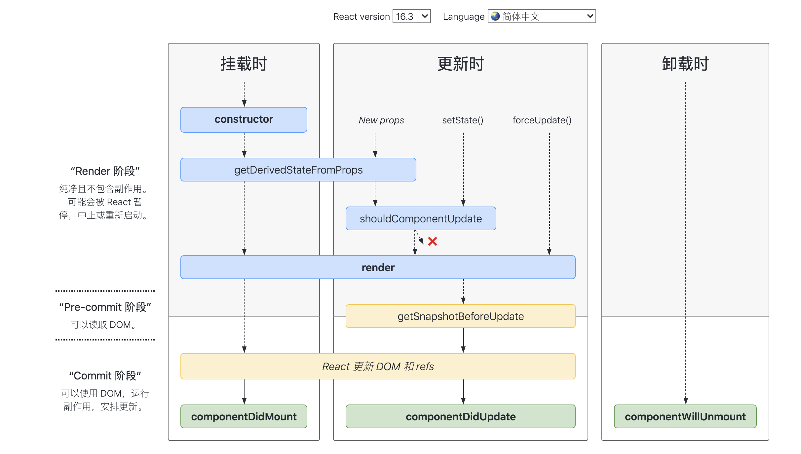

**>=16.4 版本**


**在线查看**：[https://projects.wojtekmaj.pl/react-lifecycle-methods-diagram]


- 避免生命周期中的坑需要做好两件事：不在恰当的时候调用了不该调用的代码；在需要调用时，不要忘了调用。
- 那么主要有这么 7 种情况容易造成生命周期的坑

  - `getDerivedStateFromProps` 容易编写反模式代码，使受控组件与非受控组件区分模糊
  - `componentWillMount` 在 React 中已被标记弃用，不推荐使用，主要原因是`新的异步渲染架构会导致它被多次调用`。所以网络请求及事件绑定代码应移至 `componentDidMount` 中。
  - `componentWillReceiveProps` 同样被标记弃用，被 `getDerivedStateFromProps` 所取代，主要原因是性能问题
  - `shouldComponentUpdate` 通过返回 `true` 或者 `false` 来确定是否需要触发新的渲染。主要用于性能优化
  - `componentWillUpdate` 同样是由于新的异步渲染机制，而被标记废弃，不推荐使用，原先的逻辑可结合 `getSnapshotBeforeUpdate` 与 `componentDidUpdate` 改造使用。
  - 如果在 `componentWillUnmount` 函数中忘记解除事件绑定，取消定时器等清理操作，容易引发 bug
  - 如果没有添加错误边界处理，当渲染发生异常时，用户将会看到一个无法操作的白屏，所以一定要添加

**“React 的请求应该放在哪里，为什么?” 这也是经常会被追问的问题。你可以这样回答。**

对于异步请求，应该放在 `componentDidMount` 中去操作。从时间顺序来看，除了 `componentDidMount` 还可以有以下选择：

- constructor：可以放，但从设计上而言不推荐。constructor 主要用于初始化 state 与函数绑定，并不承载业务逻辑。而且随着类属性的流行，constructor 已经很少使用了
- componentWillMount：已被标记废弃，在新的异步渲染架构下会触发多次渲染，容易引发 Bug，不利于未来 React 升级后的代码维护。
- 所以 React 的请求放在 `componentDidMount 里是最好的选择`。

**透过现象看本质：React 16 缘何两次求变？**

Fiber 架构简析

> Fiber 是 React 16 对 React 核心算法的一次重写。你只需要 get 到这一个点：`Fiber 会使原本同步的渲染过程变成异步的`。

在 React 16 之前，每当我们触发一次组件的更新，React 都会构建一棵新的虚拟 DOM 树，通过与上一次的虚拟 DOM 树进行 diff，实现对 DOM 的定向更新。这个过程，是一个递归的过程。下面这张图形象地展示了这个过程的特征：


如图所示，`同步渲染的递归调用栈是非常深的，只有最底层的调用返回了，整个渲染过程才会开始逐层返回`。这个漫长且不可打断的更新过程，将会带来用户体验层面的巨大风险：`同步渲染一旦开始，便会牢牢抓住主线程不放，直到递归彻底完成`。在这个过程中，浏览器没有办法处理任何渲染之外的事情，会进入一种无法处理用户交互的状态。因此若渲染时间稍微长一点，页面就会面临卡顿甚至卡死的风险。

而 React 16 引入的 Fiber 架构，恰好能够解决掉这个风险：`Fiber 会将一个大的更新任务拆解为许多个小任务`。`每当执行完一个小任务时，渲染线程都会把主线程交回去`，看看有没有优先级更高的工作要处理，确保不会出现其他任务被“饿死”的情况，进而避免同步渲染带来的卡顿。在这个过程中，渲染线程不再“一去不回头”，而是可以被打断的，这就是所谓的“异步渲染”，它的执行过程如下图所示：


**换个角度看生命周期工作流**

Fiber 架构的重要特征就是可以被打断的异步渲染模式。但这个“打断”是有原则的，根据“能否被打断”这一标准，`React 16 的生命周期被划分为了 render 和 commit 两个阶段`，而 commit 阶段又被细分为了 `pre-commit 和 commit`。每个阶段所涵盖的生命周期如下图所示：


我们先来看下三个阶段各自有哪些特征

- `render 阶段`：纯净且没有副作用，可能会被 React 暂停、终止或重新启动。
- `pre-commit 阶段`：可以读取 DOM。
- `commit 阶段`：可以使用 DOM，运行副作用，安排更新。

总的来说，render 阶段在执行过程中允许被打断，而 commit 阶段则总是同步执行的。

> 为什么这样设计呢？简单来说，`由于 render 阶段的操作对用户来说其实是“不可见”的，所以就算打断再重启，对用户来说也是零感知`。而 `commit 阶段的操作则涉及真实 DOM 的渲染`，所以`这个过程必须用同步渲染来求稳`。

**为什么 React 16 要更改组件的生命周期详解**

> - [React16 为什么要更改生命周期(opens new window)][react16_opens new window]
> - [React16 为什么要更改生命周期(opens new window)][react16_opens new window 1]

### 3 React Fiber 架构

**最主要的思想就是将任务拆分**。

- DOM 需要渲染时暂停，空闲时恢复。
- `window.requestIdleCallback`
- React 内部实现的机制

> React 追求的是 “快速响应”，那么，“快速响应“的制约因素都有什么呢

- `CPU`的瓶颈：当项目变得庞大、组件数量繁多、遇到大计算量的操作或者设备性能不足使得页面掉帧，导致卡顿。
- `IO`的瓶颈：发送网络请求后，由于需要等待数据返回才能进一步操作导致不能快速响应。

> `fiber` 架构主要就是用来解决 `CPU` 和网络的问题，这两个问题一直也是最影响前端开发体验的地方，一个会造成卡顿，一个会造成白屏。为此 react 为前端引入了两个新概念：Time Slicing `时间分片`和`Suspense`。

**1. React 都做过哪些优化**

- **React 渲染页面的两个阶段**

  - 调度阶段（reconciliation）：在这个阶段 React 会更新数据生成新的 `Virtual DOM`，然后通过`Diff`算法，快速找出需要更新的元素，放到更新队列中去，得到新的更新队列。
  - 渲染阶段（commit）：这个阶段 React 会遍历更新队列，将其所有的变更一次性更新到 DOM 上

- **React 15 架构**

  - React15 架构可以分为两层

    - Reconciler（协调器）—— 负责找出变化的组件；
    - Renderer（渲染器）—— 负责将变化的组件渲染到页面上；

> - 在 React15 及以前，Reconciler 采用递归的方式创建虚拟 DOM，递归过程是不能中断的。如果组件树的层级很深，递归会占用线程很多时间，递归更新时间超过了 16ms，用户交互就会卡顿。
> - 为了解决这个问题，React16 将递归的无法中断的更新重构为异步的可中断更新，由于曾经用于递归的虚拟 DOM 数据结构已经无法满足需要。于是，全新的 Fiber 架构应运而生。

- **React 16 架构**

  - 为了解决同步更新长时间占用线程导致页面卡顿的问题，也为了探索运行时优化的更多可能，React 开始重构并一直持续至今。重构的目标是实现 Concurrent Mode（并发模式）。
  - 从 v15 到 v16，React 团队花了两年时间将源码架构中的 Stack Reconciler 重构为 Fiber Reconciler
  - `React16架构可以分为三层`：

    - Scheduler（调度器）—— 调度任务的优先级，高优任务优先进入 Reconciler；
    - Reconciler（协调器）—— 负责找出变化的组件：更新工作从递归变成了可以中断的循环过程。Reconciler 内部采用了 Fiber 的架构；
    - Renderer（渲染器）—— 负责将变化的组件渲染到页面上。

- **React 17 优化**

  - 使用 Lane 来管理任务的优先级。Lane 用二进制位表示任务的优先级，方便优先级的计算（位运算），不同优先级占用不同位置的“赛道”，而且存在批的概念，优先级越低，“赛道”越多。高优先级打断低优先级，新建的任务需要赋予什么优先级等问题都是 Lane 所要解决的问题。
  - Concurrent Mode 的目的是实现一套可中断/恢复的更新机制。其由两部分组成：

    - 一套协程架构：Fiber Reconciler
    - 基于协程架构的启发式更新算法：控制协程架构工作方式的算法

**2. 浏览器一帧都会干些什么以及 requestIdleCallback 的启示**

> 我们都知道，页面的内容都是一帧一帧绘制出来的，浏览器刷新率代表浏览器一秒绘制多少帧。原则上说 1s 内绘制的帧数也多，画面表现就也细腻。目前浏览器大多是 60Hz（60 帧/s），每一帧耗时也就是在 16.6ms 左右。那么在这一帧的（16.6ms） 过程中浏览器又干了些什么呢


通过上面这张图可以清楚的知道，浏览器一帧会经过下面这几个过程：

1.  接受输入事件
2.  执行事件回调
3.  开始一帧
4.  执行 RAF (RequestAnimationFrame)
5.  页面布局，样式计算
6.  绘制渲染
7.  执行 RIC (RequestIdelCallback)

> 第七步的 RIC 事件不是每一帧结束都会执行，只有在一帧的 16.6ms 中做完了前面 6 件事儿且还有剩余时间，才会执行。如果一帧执行结束后还有时间执行 RIC 事件，那么下一帧需要在事件执行结束才能继续渲染，所以 RIC 执行不要超过 30ms，如果长时间不将控制权交还给浏览器，会影响下一帧的渲染，导致页面出现卡顿和事件响应不及时。

> `requestIdleCallback 的启示`：我们以浏览器是否有剩余时间作微任务中断的标准，那么我们需要一种机制，当浏览器有剩余时间时通知我们。

```js
requestIdleCallback((deadline) => {
  // deadline 有两个参数
  // timeRemaining(): 当前帧还剩下多少时间
  // didTimeout: 是否超时
  // 另外 requestIdleCallback 后如果跟上第二个参数 {timeout: ...} 则会强制浏览器在当前帧执行完后执行。
  if (deadline.timeRemaining() > 0) {
    // TODO
  } else {
    requestIdleCallback(otherTasks)
  }
})
```

```js
// 用法示例
var tasksNum = 10000
requestIdleCallback(unImportWork)
function unImportWork(deadline) {
  while (deadline.timeRemaining() && tasksNum > 0) {
    console.log(`执行了${10000 - tasksNum + 1}个任务`)
    tasksNum--
  }
  if (tasksNum > 0) {
    // 在未来的帧中继续执行
    requestIdleCallback(unImportWork)
  }
}
```

​

> 其实部分浏览器已经实现了这个 API，这就是 requestIdleCallback。但是由于以下因素，Facebook 抛弃了 `requestIdleCallback`的原生 API：

- 浏览器兼容性；
- 触发频率不稳定，受很多因素影响。比如当我们的浏览器切换 tab 后，之前 tab 注册的`requestIdleCallback`触发的频率会变得很低。

> 基于以上原因，在 React 中实现了功能更完备的`requestIdleCallbackpolyfill`，这就是`Scheduler`。除了在空闲时触发回调的功能外，Scheduler 还提供了多种调度优先级供任务设置

**3. React Fiber 是什么**

> `React Fiber`是对核心算法的一次重新实现。`React Fiber`把更新过程碎片化，把一个耗时长的任务分成很多小片，每一个小片的运行时间很短，虽然总时间依然很长，但是在每个小片执行完之后，都给其他任务一个执行的机会，这样唯一的线程就不会被独占，其他任务依然有运行的机会

1.  在`React Fiber`中，一次更新过程会分成多个分片完成，所以完全有可能一个更新任务还没有完成，就被另一个更高优先级的更新过程打断，这时候，优先级高的更新任务会优先处理完，而低优先级更新任务所做的工作则会完全作废，然后等待机会重头再来
2.  因为一个更新过程可能被打断，所以`React Fiber`一个更新过程被分为两个阶段(`Phase`)：第一个阶段`Reconciliation Phase`和第二阶段`Commit Phase`
3.  在第一阶段`Reconciliation Phase`，`React Fiber`会找出需要更新哪些`DOM`，这个阶段是可以被打断的；但是到了第二阶段`Commit Phase`，那就一鼓作气把`DOM`更新完，绝不会被打断
4.  这两个阶段大部分工作都是`React Fiber`做，和我们相关的也就是生命周期函数

> `React Fiber`改变了之前`react`的组件渲染机制，新的架构使原来同步渲染的组件现在可以异步化，可中途中断渲染，执行更高优先级的任务。释放浏览器主线程

**关键特性**

- 增量渲染（把渲染任务拆分成块，匀到多帧）
- 更新时能够暂停，终止，复用渲染任务
- 给不同类型的更新赋予优先级
- 并发方面新的基础能力

> 增量渲染用来解决掉帧的问题，渲染任务拆分之后，每次只做一小段，做完一段就把时间控制权交还给主线程，而不像之前长时间占用

**4. 组件的渲染顺序**

> 假如有 A,B,C,D 组件，层级结构为：

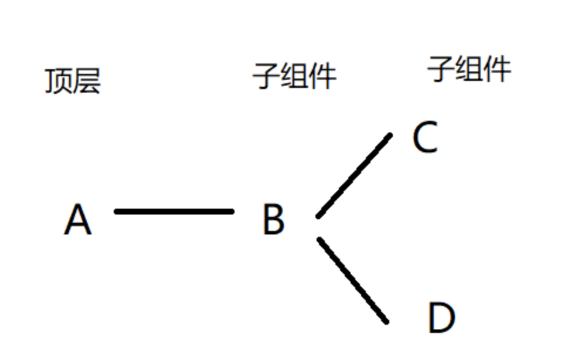

我们知道组件的生命周期为：

**挂载阶段**：

- `constructor()`
- `componentWillMount()`
- `render()`
- `componentDidMount()`

**更新阶段为**：

- `componentWillReceiveProps()`
- `shouldComponentUpdate()`
- `componentWillUpdate()`
- `render()`
- `componentDidUpdate`

> 那么在挂载阶段，`A,B,C,D`的生命周期渲染顺序是如何的呢？

那么在挂载阶段，A,B,C,D 的生命周期渲染顺序是如何的呢？

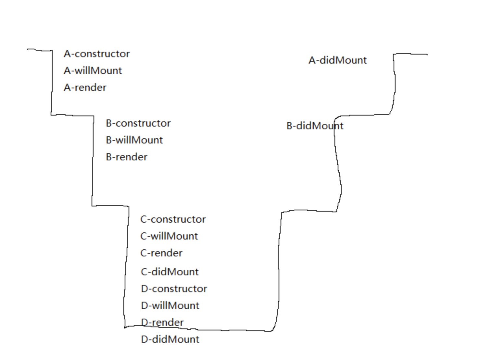

> 以`render()`函数为分界线。从顶层组件开始，一直往下，直至最底层子组件。然后再往上

组件`update`阶段同理

前面是`react16`以前的组建渲染方式。这就存在一个问题

> 如果这是一个很大，层级很深的组件，`react`渲染它需要几十甚至几百毫秒，在这期间，`react`会一直占用浏览器主线程，任何其他的操作（包括用户的点击，鼠标移动等操作）都无法执行

**Fiber 架构就是为了解决这个问题**

> 看一下 fiber 架构 组建的渲染顺序


> 加入`fiber`的`react`将组件更新分为两个时期

**这两个时期以 render 为分界**

- `render`前的生命周期为`phase1`,
- `render`后的生命周期为`phase2`

> - `phase1`的生命周期是可以被打断的，每隔一段时间它会跳出当前渲染进程，去确定是否有其他更重要的任务。此过程，`React`在 `workingProgressTree` （并不是真实的`virtualDomTree`）上复用 `current` 上的 `Fiber` 数据结构来一步地（通过`requestIdleCallback`）来构建新的 tree，标记处需要更新的节点，放入队列中
> - `phase2`的生命周期是不可被打断的，`React` 将其所有的变更一次性更新到`DOM`上

**这里最重要的是 phase1 这是时期所做的事。因此我们需要具体了解 phase1 的机制**

- 如果不被打断，那么`phase1`执行完会直接进入`render`函数，构建真实的`virtualDomTree`
- 如果组件再`phase1`过程中被打断，即当前组件只渲染到一半（也许是在`willMount`,也许是`willUpdate`~反正是在 render 之前的生命周期），那么`react`会怎么干呢？ `react`会放弃当前组件所有干到一半的事情，去做更高优先级更重要的任务（当然，也可能是用户鼠标移动，或者其他 react 监听之外的任务），当所有高优先级任务执行完之后，`react`通过`callback`回到之前渲染到一半的组件，从头开始渲染。（看起来放弃已经渲染完的生命周期，会有点不合理，反而会增加渲染时长，但是`react`确实是这么干的）

**所有 phase1 的生命周期函数都可能被执行多次，因为可能会被打断重来**

> 这样的话，就和`react16`版本之前有很大区别了，因为可能会被执行多次，那么我们最好就得保证`phase1`的生命周期每一次执行的结果都是一样的，否则就会有问题，因此，最好都是纯函数

- 如果高优先级的任务一直存在，那么低优先级的任务则永远无法进行，组件永远无法继续渲染。这个问题 facebook 目前好像还没解决
- 所以，facebook 在`react16`增加`fiber`结构，其实并不是为了减少组件的渲染时间，事实上也并不会减少，最重要的是现在可以使得一些更高优先级的任务，如用户的操作能够优先执行，提高用户的体验，至少用户不会感觉到卡顿

**5 React Fiber 架构总结**

**React Fiber 如何性能优化**

- **更新的两个阶段**

  - 调度算法阶段-执行 diff 算法，纯 js 计算
  - Commit 阶段-将 diff 结果渲染 dom

- 可能会有性能问题

  - JS 是单线程的，且和 DOM 渲染公用一个线程
  - 当组件足够复杂，组件更新时计算和渲染压力都大
  - 同时再有 DOM 操作需求（动画、鼠标拖拽等），将卡顿

- **解决方案 fiber**

  - 将调度算法阶段阶段任务拆分（Commit 无法拆分）
  - DOM 需要渲染时暂停，空闲时恢复
  - **分散执行:** 任务分割后，就可以把小任务单元分散到浏览器的空闲期间去排队执行，而实现的关键是两个新 API: `requestIdleCallback` 与 `requestAnimationFrame`

    - 低优先级的任务交给`requestIdleCallback`处理，这是个浏览器提供的事件循环空闲期的回调函数，需要 `pollyfill`，而且拥有 `deadline` 参数，限制执行事件，以继续切分任务；
    - 高优先级的任务交给`requestAnimationFrame`处理；

**React 的核心流程可以分为两个部分:**

- `reconciliation` (调度算法，也可称为 `render`)

  - 更新 `state` 与 `props`；
  - 调用生命周期钩子；
  - 生成 `virtual dom`

    - 这里应该称为 `Fiber Tree` 更为符合；

  - 通过新旧 vdom 进行 diff 算法，获取 vdom change
  - 确定是否需要重新渲染

- `commit`

  - 如需要，则操作 `dom` 节点更新

> 要了解 Fiber，我们首先来看为什么需要它

- **问题**: 随着应用变得越来越庞大，整个更新渲染的过程开始变得吃力，大量的组件渲染会导致主进程长时间被占用，导致一些动画或高频操作出现卡顿和掉帧的情况。而关键点，便是 同步阻塞。在之前的调度算法中，React 需要实例化每个类组件，生成一颗组件树，使用 同步递归 的方式进行遍历渲染，而这个过程最大的问题就是无法 暂停和恢复。

- **解决方**案: 解决同步阻塞的方法，通常有两种: 异步 与 任务分割。而 React Fiber 便是为了实现任务分割而诞生的

- **简述**

  - 在 `React V16` 将调度算法进行了重构， 将之前的 `stack reconciler` 重构成新版的 fiber `reconciler`，变成了具有链表和指针的 单链表树遍历算法。通过指针映射，每个单元都记录着遍历当下的上一步与下一步，从而使遍历变得可以被暂停和重启
  - 这里我理解为是一种 任务分割调度算法，主要是 将原先同步更新渲染的任务分割成一个个独立的 小任务单位，根据不同的优先级，将小任务分散到浏览器的空闲时间执行，充分利用主进程的事件循环机制

- **核心**

  - `Fiber` 这里可以具象为一个 数据结构

  ```js
  class Fiber {
    constructor(instance) {
      this.instance = instance
      // 指向第一个 child 节点
      this.child = child
      // 指向父节点
      this.return = parent
      // 指向第一个兄弟节点
      this.sibling = previous
    }
  }
  ```

  ​

- **链表树遍历算法**: 通过 节点保存与映射，便能够随时地进行 停止和重启，这样便能达到实现任务分割的基本前提

  - 首先通过不断遍历子节点，到树末尾；
  - 开始通过 `sibling` 遍历兄弟节点；
  - return 返回父节点，继续执行 2；
  - 直到 root 节点后，跳出遍历；

- **任务分割**，React 中的渲染更新可以分成两个阶段

  - **reconciliation 阶段**: vdom 的数据对比，是个适合拆分的阶段，比如对比一部分树后，先暂停执行个动画调用，待完成后再回来继续比对
  - **Commit 阶段**: 将 change list 更新到 dom 上，并不适合拆分，才能保持数据与 UI 的同步。否则可能由于阻塞 UI 更新，而导致数据更新和 UI 不一致的情况

- **分散执行:** 任务分割后，就可以把小任务单元分散到浏览器的空闲期间去排队执行，而实现的关键是两个新 API: `requestIdleCallback` 与 `requestAnimationFrame`

  - 低优先级的任务交给`requestIdleCallback`处理，这是个浏览器提供的事件循环空闲期的回调函数，需要 `pollyfill`，而且拥有 `deadline` 参数，限制执行事件，以继续切分任务；
  - 高优先级的任务交给`requestAnimationFrame`处理；

  ```js
  // 类似于这样的方式
  requestIdleCallback((deadline) => {
    // 当有空闲时间时，我们执行一个组件渲染；
    // 把任务塞到一个个碎片时间中去；
    while (
      (deadline.timeRemaining() > 0 || deadline.didTimeout) &&
      nextComponent
    ) {
      nextComponent = performWork(nextComponent)
    }
  })
  ```

  ​

- **优先级策略:** 文本框输入 > 本次调度结束需完成的任务 > 动画过渡 > 交互反馈 > 数据更新 > 不会显示但以防将来会显示的任务

> - Fiber 其实可以算是一种编程思想，在其它语言中也有许多应用(Ruby Fiber)。
> - 核心思想是 任务拆分和协同，主动把执行权交给主线程，使主线程有时间空挡处理其他高优先级任务。
> - 当遇到进程阻塞的问题时，任务分割、异步调用 和 缓存策略 是三个显著的解决思路。

### 4 createElement 过程

> React.createElement()： 根据指定的第一个参数创建一个 React 元素

    React.createElement(  type,  [props],  [...children])

​

- 第一个参数是必填，传入的是似 HTML 标签名称，eg: ul, li

- 第二个参数是选填，表示的是属性，eg: className

- 第三个参数是选填, 子节点，eg: 要显示的文本内容

  ```js
  //写法一：
  var child1 = React.createElement('li', null, 'one');
  var child2 = React.createElement('li', null, 'two');
  var content = React.createElement('ul', { className: 'teststyle' }, child1, child2); // 第三个参数可以分开也可以写成一个数组
  ReactDOM.render(
      content,
      document.getElementById('example')
  );
  //写法二：
  ar child1 = React.createElement('li', null, 'one');
  var child2 = React.createElement('li', null, 'two');
  var content = React.createElement('ul', { className: 'teststyle' }, [child1, child2]);
  ReactDOM.render(
      content,
      document.getElementById('example')
  );
  ```

  ​

### 5 调和阶段 setState 内部干了什么

- 当调用 setState 时，React 会做的第一件事情是将传递给 setState 的对象合并到组件的当前状态
- 这将启动一个称为和解（`reconciliation`）的过程。和解（`reconciliation`）的最终目标是以最有效的方式，根据这个新的状态来更新`UI`。 为此，`React`将构建一个新的 `React` 元素树（您可以将其视为 `UI` 的对象表示）
- 一旦有了这个树，为了弄清 UI 如何响应新的状态而改变，React 会将这个新树与上一个元素树相比较（ diff ）

> 通过这样做， React 将会知道发生的确切变化，并且通过了解发生什么变化，只需在绝对必要的情况下进行更新即可最小化 UI 的占用空间

### 6 setState

> 在了解 setState 之前，我们先来简单了解下 React 一个包装结构: Transaction:

**事务 (Transaction)**

> 是 React 中的一个调用结构，用于包装一个方法，结构为: initialize - perform(method) - close。通过事务，可以统一管理一个方法的开始与结束；处于事务流中，表示进程正在执行一些操作

- setState: React 中用于修改状态，更新视图。它具有以下特点:

**异步与同步:** setState 并不是单纯的异步或同步，这其实与调用时的环境相关:

- 在**合成事件** 和 **生命周期钩子**(除 componentDidUpdate) 中，setState 是"异步"的；

  - 原因: 因为在 setState 的实现中，有一个判断: 当更新策略正在事务流的执行中时，该组件更新会被推入 dirtyComponents 队列中等待执行；否则，开始执行 batchedUpdates 队列更新；

    - 在生命周期钩子调用中，更新策略都处于更新之前，组件仍处于事务流中，而 componentDidUpdate 是在更新之后，此时组件已经不在事务流中了，因此则会同步执行；
    - 在合成事件中，React 是基于 事务流完成的事件委托机制 实现，也是处于事务流中；

  - 问题: 无法在 setState 后马上从 this.state 上获取更新后的值。
  - 解决: 如果需要马上同步去获取新值，setState 其实是可以传入第二个参数的。setState(updater, callback)，在回调中即可获取最新值；

- 在 **原生事件** 和 setTimeout 中，setState 是同步的，可以马上获取更新后的值；

  - 原因: 原生事件是浏览器本身的实现，与事务流无关，自然是同步；而 setTimeout 是放置于定时器线程中延后执行，此时事务流已结束，因此也是同步；

- **批量更新**: 在 合成事件 和 生命周期钩子 中，setState 更新队列时，存储的是 合并状态(Object.assign)。因此前面设置的 key 值会被后面所覆盖，最终只会执行一次更新；
- **函数式**: 由于 Fiber 及 合并 的问题，官方推荐可以传入 函数 的形式。setState(fn)，在 fn 中返回新的 state 对象即可，例如 this.setState((state, props) => newState)；

  - 使用函数式，可以用于避免 setState 的批量更新的逻辑，传入的函数将会被 顺序调用；

**注意事项:**

- setState 合并，在 合成事件 和 生命周期钩子 中多次连续调用会被优化为一次；
- 当组件已被销毁，如果再次调用 setState，React 会报错警告，通常有两种解决办法

  - 将数据挂载到外部，通过 props 传入，如放到 Redux 或 父级中；
  - 在组件内部维护一个状态量 (isUnmounted)，componentWillUnmount 中标记为 true，在 setState 前进行判断；

**总结**

> setState 并非真异步，只是看上去像异步。在源码中，通过 `isBatchingUpdates` 来判断

- `setState` 是先存进 `state` 队列还是直接更新，如果值为 true 则执行异步操作，为 false 则直接更新。
- 那么什么情况下 `isBatchingUpdates` 会为 `true` 呢？在 React 可以控制的地方，就为 true，比如在 React 生命周期事件和合成事件中，都会走合并操作，延迟更新的策略。
- 但在 React 无法控制的地方，比如原生事件，具体就是在 `addEventListener` 、`setTimeout`、`setInterval` 等事件中，就只能同步更新。

> 一般认为，`做异步设计是为了性能优化、减少渲染次数`，React 团队还补充了两点。

- 保持内部一致性。如果将 state 改为同步更新，那尽管 state 的更新是同步的，但是 props 不是。
- 启用并发更新，完成异步渲染。


1.  `setState` 只有在 React 自身的合成事件和钩子函数中是异步的，在原生事件和 setTimeout 中都是同步的
2.  `setState` 的异步并不是说内部由异步代码实现，其实本身执行的过程和代码都是同步的，只是合成事件和钩子函数中没法立马拿到更新后的值，形成了所谓的异步。当然可以通过 setState 的第二个参数中的 callback 拿到更新后的结果
3.  `setState` 的批量更新优化也是建立在异步（合成事件、钩子函数）之上的，在原生事件和 setTimeout 中不会批量更新，在异步中如果对同一个值进行多次 setState，setState 的批量更新策略会对其进行覆盖，去最后一次的执行，如果是同时 setState 多个不同的值，在更新时会对其进行合并批量更新

- 合成事件中是异步
- 钩子函数中的是异步
- 原生事件中是同步
- setTimeout 中是同步


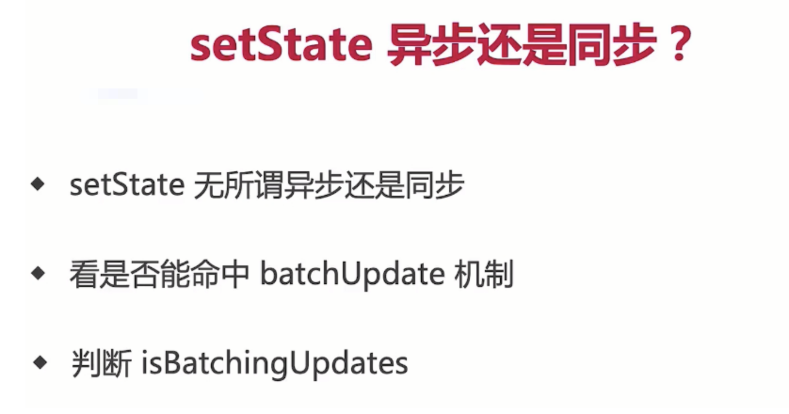

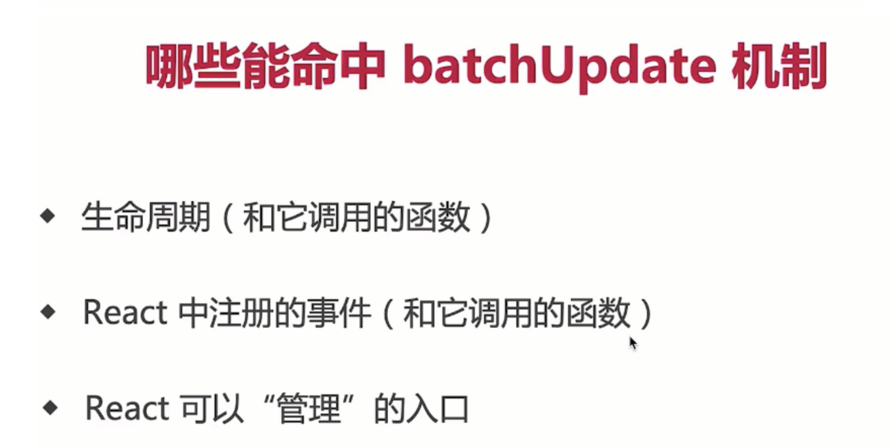

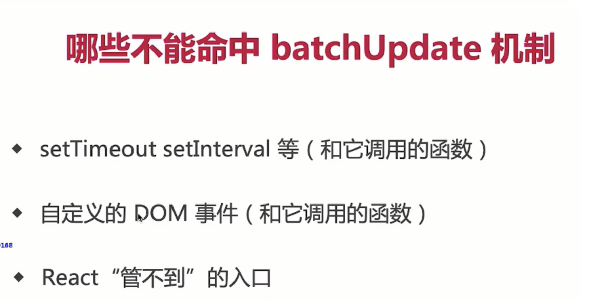

**这是一道经常会出现的 React setState 笔试题：下面的代码输出什么呢？**

```js
class Test extends React.Component {
  state = { count: 0 }
  componentDidMount() {
    this.setState({ count: this.state.count + 1 })
    console.log(this.state.count)
    this.setState({ count: this.state.count + 1 })
    console.log(this.state.count)
    setTimeout(() => {
      this.setState({ count: this.state.count + 1 })
      console.log(this.state.count)
      this.setState({ count: this.state.count + 1 })
      console.log(this.state.count)
    }, 0)
  }
  render() {
    return null
  }
}
```

​

我们可以进行如下的分析：

- 首先第一次和第二次的 `console.log`，都在 React 的生命周期事件中，所以是异步的处理方式，则输出都为 `0`；
- 而在 `setTimeout` 中的 `console.log` 处于原生事件中，所以会同步的处理再输出结果，但需要注意，虽然 `count` 在前面经过了两次的 `this.state.count + 1`，但是每次获取的 `this.state.count` 都是初始化时的值，也就是 `0`；
- 所以此时 `count` 是 `1`，那么后续在 `setTimeout`中的输出则是 `2` 和 `3`。

所以完整答案是 `0,0,2,3`

**同步场景**

异步场景中的案例使我们建立了这样一个认知：setState 是异步的，但下面这个案例又会颠覆你的认知。如果我们将 setState 放在 setTimeout 事件中，那情况就完全不同了。

```js
class Test extends Component {
    state = {        count: 0    }
    componentDidMount(){
        this.setState({ count: this.state.count + 1 });
        console.log(this.state.count);
        setTimeout(() => {
            this.setState({ count: this.state.count + 1 });
            console.log("setTimeout: " + this.state.count);
        }, 0);
    }
    render(){
        ...
    }
}
```

​

那这时输出的应该是什么呢？如果你认为是 0,0，那么又错了。

正确的结果是 `0,2`。因为 `setState` 并不是真正的异步函数，它实际上是通过队列延迟执行操作实现的，通过 isBatchingUpdates 来判断 setState 是先存进 state 队列还是直接更新。值为 true 则执行异步操作，false 则直接同步更新

**接下来这个案例的答案是什么呢**

```js
class Test extends Component {
    state = {
        count: 0
    }
	componentDidMount(){
        this.setState({
            count: this.state.count + 1 },  () => {
            console.log(this.state.count)
        })
        this.setState({
            count: this.state.count + 1 }, () => {
            console.log(this.state.count)
        })
    }
    render(){
        ...
    }
}
```

​

如果你觉得答案是 `1,2`，那肯定就错了。这种迷惑性极强的考题在面试中非常常见，因为它反直觉。

如果重新仔细思考，你会发现当前拿到的 `this.state.count` 的值并没有变化，都是 `0`，所以输出结果应该是 `1,1`。

当然，也可以在 `setState` 函数中获取修改后的 `state` 值进行修改。

```js
class Test extends Component {
    state = {
        count: 0
    }
	componentDidMount(){
        this.setState( preState=> ({ count:preState.count + 1 }),
                      ()=>{
            console.log(this.state.count)
        })
        this.setState( preState=>({count:preState.count + 1 }),
                      ()=>{
            console.log(this.state.count)
        })
    }
	render(){
        ...
    }
}
```

​

这些通通是异步的回调，如果你以为输出结果是 1,2，那就又错了，`实际上是 2,2`。

为什么会这样呢？当调用 `setState` 函数时，就会`把当前的操作放入队列中`。React 根据队列内容，合并 state 数据，完成后再逐一执行回调，根据结果更新虚拟 DOM，触发渲染。所以`回调时，state 已经合并计算完成了`，输出的结果就是 `2,2` 了。

### 7 setState 原理分析

**1. setState 异步更新**

- 我们都知道，`React`通过`this.state`来访问`state`，通过`this.setState()`方法来更新`state`。当`this.setState()`方法被调用的时候，`React`会重新调用`render`方法来重新渲染`UI`
- 首先如果直接在`setState`后面获取`state`的值是获取不到的。在`React`内部机制能检测到的地方， `setState`就是异步的；`在React`检测不到的地方，例如`setInterval`,`setTimeout`，`setState`就是同步更新的

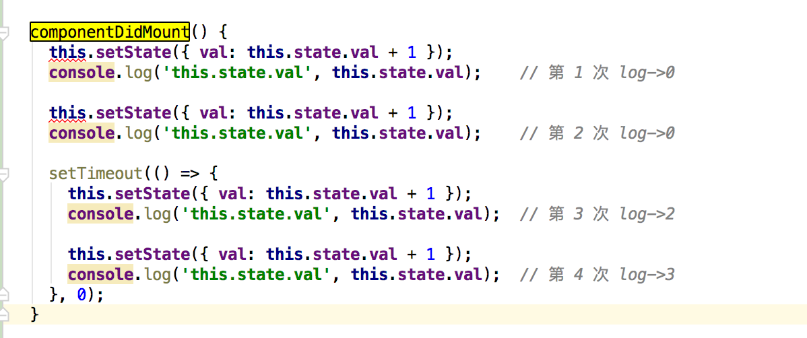

> 因为`setState`是可以接受两个参数的，一个`state`，一个回调函数。因此我们可以在回调函数里面获取值


- `setState`方法通过一个队列机制实现`state`更新，当执行`setState`的时候，会将需要更新的`state`合并之后放入状态队列，而不会立即更新`this.state`
- 如果我们不使用`setState`而是使用`this.state.key`来修改，将不会触发组件的`re-render`。
- 如果将`this.state`赋值给一个新的对象引用，那么其他不在对象上的`state`将不会被放入状态队列中，当下次调用`setState`并对状态队列进行合并时，直接造成了`state`丢失

**1.1 setState 批量更新的过程**

> 在`react`生命周期和合成事件执行前后都有相应的钩子，分别是`pre`钩子和`post`钩子，`pre`钩子会调用`batchedUpdate`方法将`isBatchingUpdates`变量置为`true`，开启批量更新，而`post`钩子会将`isBatchingUpdates`置为`false`

- `isBatchingUpdates`变量置为`true`，则会走批量更新分支，`setState`的更新会被存入队列中，待同步代码执行完后，再执行队列中的`state`更新。 `isBatchingUpdates`为 `true`，则把当前组件（即调用了 `setState`的组件）放入 `dirtyComponents` 数组中；否则 `batchUpdate` 所有队列中的更新
- 而在原生事件和异步操作中，不会执行`pre`钩子，或者生命周期的中的异步操作之前执行了`pre`钩子，但是`pos`钩子也在异步操作之前执行完了，`isBatchingUpdates`必定为`false`，也就不会进行批量更新

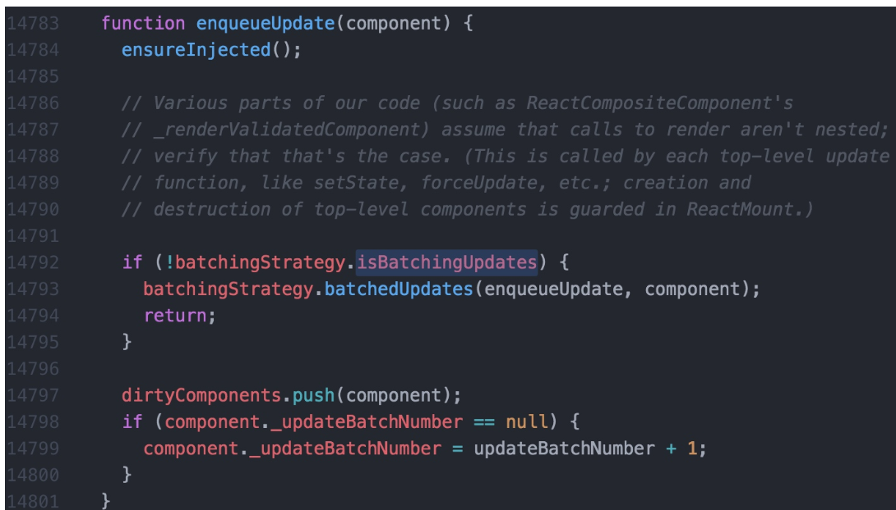

> `enqueueUpdate`包含了`React`避免重复`render`的逻辑。`mountComponent`和`updateComponent`方法在执行的最开始，会调用到`batchedUpdates`进行批处理更新，此时会将`isBatchingUpdates`设置为`true`，也就是将状态标记为现在正处于更新阶段了。 `isBatchingUpdates`为 `true`，则把当前组件（即调用了 `setState` 的组件）放入`dirtyComponents` 数组中；否则 `batchUpdate` 所有队列中的更新

**1.2 为什么直接修改 this.state 无效**

- 要知道`setState`本质是通过一个队列机制实现`state`更新的。 执行`setState`时，会将需要更新的 state 合并后放入状态队列，而不会立刻更新`state`，队列机制可以批量更新`state`。
- 如果不通过`setState`而直接修改`this.state`，那么这个`state`不会放入状态队列中，下次调用`setState`时对状态队列进行合并时，会忽略之前直接被修改的`state`，这样我们就无法合并了，而且实际也没有把你想要的`state`更新上去

**1.3 什么是批量更新 Batch Update**

> 在一些`mv*`框架中，，就是将一段时间内对`model`的修改批量更新到`view`的机制。比如那前端比较火的`React`、`vue`（`nextTick`机制,视图的更新以及实现）

**1.4 setState 之后发生的事情**

- `setState`操作并不保证是同步的，也可以认为是异步的
- `React`在`setState`之后，会经对`state`进行`diff`，判断是否有改变，然后去`diff dom`决定是否要更新`UI`。如果这一系列过程立刻发生在每一个`setState`之后，就可能会有性能问题
- 在短时间内频繁`setState`。`React`会将`state`的改变压入栈中，在合适的时机，批量更新`state`和视图，达到提高性能的效果

**1.5 如何知道 state 已经被更新**

> 传入回调函数

    setState({    index: 1}}, function(){    console.log(this.state.index);})

> 在钩子函数中体现

    componentDidUpdate(){    console.log(this.state.index);}

​

**2. setState 循环调用风险**

- 当调用`setState`时，实际上会执行`enqueueSetState`方法，并对`partialState`以及`_pending-StateQueue`更新队列进行合并操作，最终通过`enqueueUpdate`执行`state`更新
- 而`performUpdateIfNecessary`方法会获`取_pendingElement`,`_pendingStateQueue`，`_pending-ForceUpdate`，并调用`receiveComponent`和`updateComponent`方法进行组件更新
- 如果在`shouldComponentUpdate`或者`componentWillUpdate`方法中调用`setState`，此时`this._pending-StateQueue != null`，就会造成循环调用，使得浏览器内存占满后崩溃

**3 事务**

- 事务就是将需要执行的方法使用`wrapper`封装起来，再通过事务提供的`perform`方法执行，先执行`wrapper`中的`initialize`方法，执行完`perform`之后，在执行所有的`close`方法，一组`initialize`及`close`方法称为一个`wrapper`。
- 那么事务和`setState`方法的不同表现有什么关系，首先我们把`4`次`setStat`e 简单归类，前两次属于一类，因为它们在同一调用栈中执行，`setTimeout`中的两次`setState`属于另一类
- 在`setState`调用之前，已经处在`batchedUpdates`执行的事务中了。那么这次`batchedUpdates`方法是谁调用的呢，原来是`ReactMount.js`中的`_renderNewRootComponent`方法。也就是说，整个将`React`组件渲染到`DOM`中的过程就是处于一个大的事务中。而在`componentDidMount`中调用`setState`时，`batchingStrategy`的`isBatchingUpdates`已经被设为了`true`，所以两次`setState`的结果没有立即生效
- 再反观`setTimeout`中的两次`setState`，因为没有前置的`batchedUpdates`调用，所以导致了新的`state`马上生效

**4. 总结**

- 通过`setState`去更新`this.state`，不要直接操作`this.state`，请把它当成不可变的
- 调用`setState`更新`this.state`不是马上生效的，它是异步的，所以不要天真以为执行完`setState`后`this.state`就是最新的值了
- 多个顺序执行的`setState`不是同步地一个一个执行滴，会一个一个加入队列，然后最后一起执行，即批处理

### 8 React 事务机制


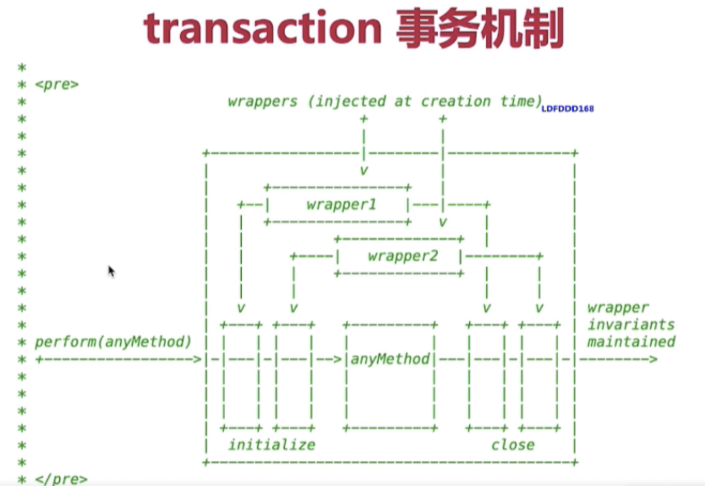

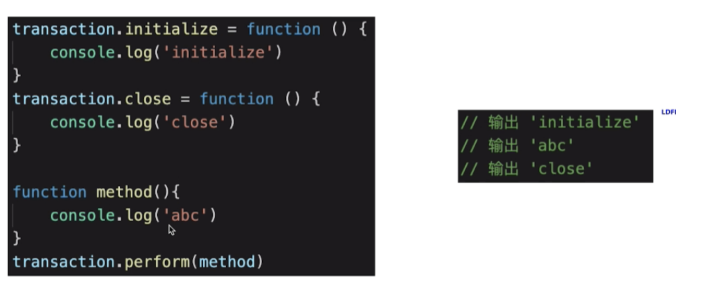

### 9 React 组件和渲染更新过程

**渲染和更新过程**

- jsx 如何渲染为页面
- setState 之后如何更新页面
- 面试考察全流程

**JSX 本质和 vdom**

- JSX 即`createElement`函数
- 执行生成 vnode
- `patch(elem,vnode)`和`patch(vnode,newNode)`

**组件渲染过程**

- `props state`
- `render()`生成`vnode`
- `patch(elem, vnode)`

**组件更新过程**

- `setState-->dirtyComponents`(可能有子组件)
- `render`生成`newVnode`
- `patch(vnode, newVnode)`

### 10 如何解释 React 的渲染流程


- React 的渲染过程大致一致，但协调并不相同，以 `React 16` 为分界线，分为 `Stack Reconciler` 和 `Fiber Reconciler`。这里的协调从狭义上来讲，特指 React 的 diff 算法，广义上来讲，有时候也指 React 的 `reconciler` 模块，它通常包含了 `diff` 算法和一些公共逻辑。
- 回到 `Stack Reconciler` 中，`Stack Reconciler` 的`核心调度方式是递归`。`调度的基本处理单位是事务`，它的事务基类是 `Transaction`，这里的`事务是 React 团队从后端开发中加入的概念`。在 React 16 以前，`挂载主要通过 ReactMount 模块完成`，更新通过 `ReactUpdate` 模块完成，模块之间相互分离，落脚执行点也是事务。
- 在 `React 16` 及以后，协调改为了 `Fiber Reconciler`。它的调度方式主要有两个特点，`第一个是协作式多任务模式`，在这个模式下，线程会定时放弃自己的运行权利，交还给主线程，通过`requestIdleCallback` 实现。`第二个特点是策略优先级`，调度任务通过标记 `tag` 的方式分优先级执行，比如动画，或者标记为 `high` 的任务可以优先执行。`Fiber Reconciler`的基本单位是 `Fiber`，`Fiber` 基于过去的 `React Element` 提供了二次封装，提供了指向父、子、兄弟节点的引用，为 `diff` 工作的双链表实现提供了基础。
- 在新的架构下，整个生命周期被划分为 `Render 和 Commit 两个阶段`。`Render 阶段的执行特点是可中断、可停止、无副作用`，主要是通过构造 `workInProgress` 树计算出 `diff`。以 `current` 树为基础，将每个 `Fiber`作为一个基本单位，自下而上逐个节点检查并构造 workInProgress 树。这个过程不再是递归，而是基于循环来完成
- 在执行上通过 `requestIdleCallback` 来调度执行每组任务，每组中的每个计算任务被称为 `work`，每个 `work` 完成后确认是否有优先级更高的 `work` 需要插入，如果有就让位，没有就继续。优先级通常是标记为动画或者 `high` 的会先处理。每完成一组后，将调度权交回主线程，直到下一次 `requestIdleCallback` 调用，再继续构建 `workInProgress` 树
- 在 `commit` 阶段需要处理 `effect` 列表，这里的 `effect` 列表包含了根据 `diff 更新 DOM 树`、`回调生命周期`、`响应 ref` 等。
- 但一定要注意，这个阶段是同步执行的，不可中断暂停，所以不要在 `componentDidMount`、`componentDidUpdate`、`componentWiilUnmount`中去执行重度消耗算力的任务
- 如果只是一般的应用场景，比如管理后台、H5 展示页等，两者性能差距并不大，但在动画、画布及手势等场景下，`Stack Reconciler` 的设计会占用占主线程，造成卡顿，而 `fiber reconciler` 的设计则能带来高性能的表现

### 11 diff 算法是怎么运作

> 每一种节点类型有自己的属性，也就是 prop，每次进行 diff 的时候，react 会先比较该节点类型，假如节点类型不一样，那么 react 会直接删除该节点，然后直接创建新的节点插入到其中，假如节点类型一样，那么会比较 prop 是否有更新，假如有 prop 不一样，那么 react 会判定该节点有更新，那么重渲染该节点，然后在对其子节点进行比较，一层一层往下，直到没有子节点

- 把树形结构按照层级分解，只比较同级元素。
- 给列表结构的每个单元添加唯一的`key`属性，方便比较。
- `React` 只会匹配相同 `class` 的 `component`（这里面的`class`指的是组件的名字）
- 合并操作，调用 `component` 的 `setState` 方法的时候, `React` 将其标记为 - `dirty`.到每一个事件循环结束, `React` 检查所有标记 `dirty`的 `component`重新绘制.
- 选择性子树渲染。开发人员可以重写`shouldComponentUpdate`提高`diff`的性能

**优化 ⬇️**

> 为了降低算法复杂度，`React`的`diff`会预设三个限制：

1.  只对同级元素进行`Diff`。如果一个`DOM节点`在前后两次更新中跨越了层级，那么`React`不会尝试复用他。
2.  两个不同类型的元素会产生出不同的树。如果元素由`div`变为`p`，React 会销毁`div`及其子孙节点，并新建`p`及其子孙节点。
3.  开发者可以通过 `key prop`来暗示哪些子元素在不同的渲染下能保持稳定。考虑如下例子：

**Diff 的思路**

该如何设计算法呢？如果让我设计一个`Diff算法`，我首先想到的方案是：

1.  判断当前节点的更新属于哪种情况
2.  如果是`新增`，执行新增逻辑
3.  如果是`删除`，执行删除逻辑
4.  如果是`更新`，执行更新逻辑

- 按这个方案，其实有个隐含的前提——**不同操作的优先级是相同的**
- 但是`React团队`发现，在日常开发中，相较于`新增`和`删除`，`更新`组件发生的频率更高。所以`Diff`会优先判断当前节点是否属于`更新`。

基于以上原因，`Diff算法`的整体逻辑会经历两轮遍历：

- 第一轮遍历：处理`更新`的节点。
- 第二轮遍历：处理剩下的不属于`更新`的节点。

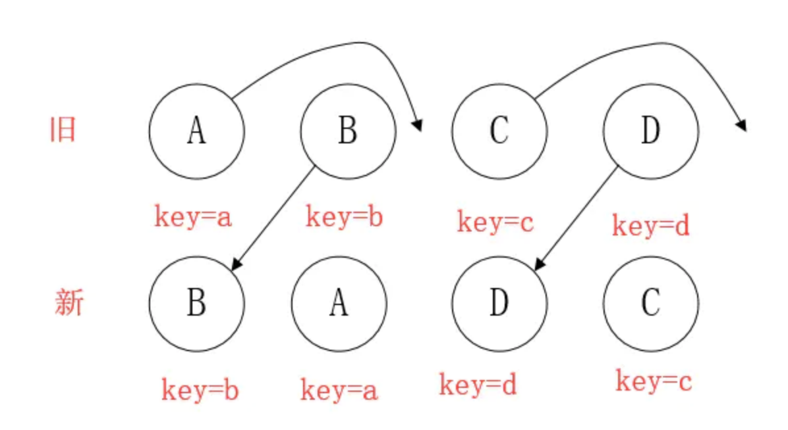

**diff 算法的作用**

计算出 Virtual DOM 中真正变化的部分，并只针对该部分进行原生 DOM 操作，而非重新渲染整个页面。

**传统 diff 算法**

> 通过循环递归对节点进行依次对比，算法复杂度达到 `O(n^3)` ，n 是树的节点数，这个有多可怕呢？——如果要展示 1000 个节点，得执行上亿次比较。。即便是 CPU 快能执行 30 亿条命令，也很难在一秒内计算出差异。

**React 的 diff 算法**

1.  什么是调和？

> 将 Virtual DOM 树转换成 actual DOM 树的最少操作的过程 称为 调和 。

1.  什么是 React diff 算法？

> `diff`算法是调和的具体实现。

**diff 策略**

> React 用 三大策略 将 O(n^3)复杂度 转化为 O(n)复杂度

**策略一（tree diff）：**

- Web UI 中 DOM 节点跨层级的移动操作特别少，可以忽略不计。

**策略二（component diff）：**

- 拥有相同类的两个组件 生成相似的树形结构，
- 拥有不同类的两个组件 生成不同的树形结构。

**策略三（element diff）：**

对于同一层级的一组子节点，通过唯一 id 区分。

**tree diff**

- React 通过 updateDepth 对 Virtual DOM 树进行层级控制。
- 对树分层比较，两棵树 只对同一层次节点 进行比较。如果该节点不存在时，则该节点及其子节点会被完全删除，不会再进一步比较。
- 只需遍历一次，就能完成整棵 DOM 树的比较。


那么问题来了，如果 DOM 节点出现了跨层级操作,diff 会咋办呢？

> 答：diff 只简单考虑同层级的节点位置变换，如果是跨层级的话，只有创建节点和删除节点的操作。


> 如上图所示，以 A 为根节点的整棵树会被重新创建，而不是移动，因此 官方建议不要进行 DOM 节点跨层级操作，可以通过 CSS 隐藏、显示节点，而不是真正地移除、添加 DOM 节点

**component diff**

> React 对不同的组件间的比较，有三种策略

1.  同一类型的两个组件，按原策略（层级比较）继续比较 Virtual DOM 树即可。
2.  同一类型的两个组件，组件 A 变化为组件 B 时，可能 Virtual DOM 没有任何变化，如果知道这点（变换的过程中，Virtual DOM 没有改变），可节省大量计算时间，所以 用户 可以通过 `shouldComponentUpdate()` 来判断是否需要 判断计算。
3.  不同类型的组件，将一个（将被改变的）组件判断为`dirty component`（脏组件），从而替换 整个组件的所有节点。

> 注意：如果组件 D 和组件 G 的结构相似，但是 React 判断是 不同类型的组件，则不会比较其结构，而是删除 组件 D 及其子节点，创建组件 G 及其子节点。

**element diff**

> 当节点处于同一层级时，diff 提供三种节点操作：删除、插入、移动。

- 插入：组件 C 不在集合（A,B）中，需要插入
- 删除：

  - 组件 D 在集合（A,B,D）中，但 D 的节点已经更改，不能复用和更新，所以需要删除 旧的 D ，再创建新的。
  - 组件 D 之前在 集合（A,B,D）中，但集合变成新的集合（A,B）了，D 就需要被删除。

- 移动：组件 D 已经在集合（A,B,C,D）里了，且集合更新时，D 没有发生更新，只是位置改变，如新集合（A,D,B,C），D 在第二个，无须像传统 diff，让旧集合的第二个 B 和新集合的第二个 D 比较，并且删除第二个位置的 B，再在第二个位置插入 D，而是 （对同一层级的同组子节点） 添加唯一 key 进行区分，移动即 ��。

**总结**

1.  `tree diff`：只对比同一层的 dom 节点，忽略 dom 节点的跨层级移动

如下图，react 只会对相同颜色方框内的 DOM 节点进行比较，即同一个父节点下的所有子节点。当发现节点不存在时，则该节点及其子节点会被完全删除掉，不会用于进一步的比较。

这样只需要对树进行一次遍历，便能完成整个 DOM 树的比较。


这就意味着，如果 dom 节点发生了跨层级移动，react 会删除旧的节点，生成新的节点，而不会复用。

1.  `component diff`：如果不是同一类型的组件，会删除旧的组件，创建新的组件


1.  `element diff`：对于同一层级的一组子节点，需要通过唯一 id 进行来区分

- 如果没有 id 来进行区分，一旦有插入动作，会导致插入位置之后的列表全部重新渲染
- 这也是为什么渲染列表时为什么要使用唯一的 key。

**diff 的不足与待优化的地方**

> 尽量减少类似将最后一个节点移动到列表首部的操作，当节点数量过大或更新操作过于频繁时，会影响 React 的渲染性能

**与其他框架相比，React 的 diff 算法有何不同？**


> diff 算法探讨的就是虚拟 DOM 树发生变化后，生成 DOM 树更新补丁的方式。它通过对比新旧两株虚拟 DOM 树的变更差异，将更新补丁作用于真实 DOM，以最小成本完成视图更新


具体的流程是这样的：

- 真实 DOM 与虚拟 DOM 之间存在一个映射关系。这个映射关系依靠初始化时的 JSX 建立完成；
- 当虚拟 DOM 发生变化后，就会根据差距计算生成 patch，这个 patch 是一个结构化的数据，内容包含了增加、更新、移除等；
- 最后再根据 patch 去更新真实的 DOM，反馈到用户的界面上。


在回答有何不同之前，首先需要说明下什么是 diff 算法。

- `diff 算法是指生成更新补丁的方式`，主要应用于`虚拟 DOM 树变化后，更新真实 DOM`。所以 diff 算法一定存在这样一个过程：`触发更新 → 生成补丁 → 应用补丁`
- React 的 diff 算法，触发更新的时机主要在 state 变化与 hooks 调用之后。此时触发虚拟 DOM 树变更遍历，采用了深度优先遍历算法。但传统的遍历方式，效率较低。为了优化效率，使用了分治的方式。`将单一节点比对转化为了 3 种类型节点的比对`，分别是`树、组件及元素`，以此提升效率。

  - `树比对`：由于网页视图中较少有跨层级节点移动，两株虚拟 DOM 树只对同一层次的节点进行比较。
  - `组件比对`：如果组件是同一类型，则进行树比对，如果不是，则直接放入到补丁中。
  - `元素比对`：主要发生在同层级中，通过标记节点操作生成补丁，节点操作对应真实的 DOM 剪裁操作。同一层级的子节点，可以通过标记 key 的方式进行列表对比。

- 以上是经典的 React diff 算法内容。`自 React 16 起，引入了 Fiber 架构`。为了使整个更新过程`可随时暂停恢复`，节点与树分别采用了 `FiberNode 与 FiberTree 进行重构`。`fiberNode 使用了双链表的结构`，可以直接找到兄弟节点与子节点
- 然后拿 Vue 和 Preact 与 React 的 diff 算法进行对比

  - `Preact` 的 `Diff` 算法相较于 `React`，整体设计思路相似，但最底层的元素采用了真实 `DOM` 对比操作，也没有采用 `Fiber` 设计。Vue 的 `Diff` 算法整体也与 `React` 相似，同样未实现 `Fiber` 设计

- 然后进行横向比较，`React 拥有完整的 Diff 算法策略，且拥有随时中断更新的时间切片能力`，在大批量节点更新的极端情况下，拥有更友好的交互体验。
- Preact 可以在一些对性能要求不高，仅需要渲染框架的简单场景下应用。
- Vue 的整体 `diff 策略与 React 对齐`，虽然缺乏时间切片能力，但这并不意味着 Vue 的性能更差，因为在 Vue 3 初期引入过，后期因为收益不高移除掉了。除了高帧率动画，在 Vue 中其他的场景几乎都可以使用防抖和节流去提高响应性能。

\*\*学习原理的目的就是应用。那如何根据 React diff 算法原理优化代码呢？\*\*这个问题其实按优化方式逆向回答即可。

- 根据 `diff` 算法的设计原则，应尽量避免跨层级节点移动。
- 通过设置唯一 `key` 进行优化，尽量减少组件层级深度。因为过深的层级会加深遍历深度，带来性能问题。
- 设置 `shouldComponentUpdate` 或者 `React.pureComponet` 减少 `diff` 次数。

### 12 合成事件原理

> 为了解决跨浏览器兼容性问题，`React` 会将浏览器原生事件（`Browser Native Event`）封装为合成事件（`SyntheticEvent`）传入设置的事件处理器中。这里的合成事件提供了与原生事件相同的接口，不过它们屏蔽了底层浏览器的细节差异，保证了行为的一致性。另外有意思的是，`React` 并没有直接将事件附着到子元素上，而是以单一事件监听器的方式将所有的事件发送到顶层进行处理。这样 `React` 在更新 `DOM` 的时候就不需要考虑如何去处理附着在 `DOM` 上的事件监听器，最终达到优化性能的目的

- 所有的事件挂在 document 上，DOM 事件触发后冒泡到 document；React 找到对应的组件，造出一个合成事件出来；并按组件树模拟一遍事件冒泡。
- event 不是原生的，是 SyntheticEvent 合成事件对象
- 和 Vue 事件不同,和 DOM 事件也不同

**React 17 之前的事件冒泡流程图**


> 所以这就造成了，在一个页面中，只能有一个版本的 React。如果有多个版本，事件就乱套了。值得一提的是，这个问题在 React 17 中得到了解决，事件委托不再挂在 document 上，而是挂在 DOM 容器上，也就是 `ReactDom.Render` 所调用的节点上。

**React 17 后的事件冒泡流程图**


> 那到底哪些事件会被捕获生成合成事件呢？可以从 React 的源码测试文件中一探究竟。下面的测试快照中罗列了大量的事件名，也只有在这份快照中的事件，才会被捕获生成合成事件。

```js
// react/packages/react-dom/src/__tests__/__snapshots__/ReactTestUtils-test.js.snapArray;
;[
  'abort',
  'animationEnd',
  'animationIteration',
  'animationStart',
  'auxClick',
  'beforeInput',
  'blur',
  'canPlay',
  'canPlayThrough',
  'cancel',
  'change',
  'click',
  'close',
  'compositionEnd',
  'compositionStart',
  'compositionUpdate',
  'contextMenu',
  'copy',
  'cut',
  'doubleClick',
  'drag',
  'dragEnd',
  'dragEnter',
  'dragExit',
  'dragLeave',
  'dragOver',
  'dragStart',
  'drop',
  'durationChange',
  'emptied',
  'encrypted',
  'ended',
  'error',
  'focus',
  'gotPointerCapture',
  'input',
  'invalid',
  'keyDown',
  'keyPress',
  'keyUp',
  'load',
  'loadStart',
  'loadedData',
  'loadedMetadata',
  'lostPointerCapture',
  'mouseDown',
  'mouseEnter',
  'mouseLeave',
  'mouseMove',
  'mouseOut',
  'mouseOver',
  'mouseUp',
  'paste',
  'pause',
  'play',
  'playing',
  'pointerCancel',
  'pointerDown',
  'pointerEnter',
  'pointerLeave',
  'pointerMove',
  'pointerOut',
  'pointerOver',
  'pointerUp',
  'progress',
  'rateChange',
  'reset',
  'scroll',
  'seeked',
  'seeking',
  'select',
  'stalled',
  'submit',
  'suspend',
  'timeUpdate',
  'toggle',
  'touchCancel',
  'touchEnd',
  'touchMove',
  'touchStart',
  'transitionEnd',
  'volumeChange',
  'waiting',
  'wheel',
]
```

​

> 如果 DOM 上绑定了过多的事件处理函数,整个页面响应以及内存占用可能都会受到影响。React 为了避免这类 DOM 事件滥用,同时屏蔽底层不同浏览器之间的事件系统的差异,实现了一个中间层 - SyntheticEvent

1.  当用户在为 onClick 添加函数时,React 并没有将 Click 绑定到 DOM 上面
2.  而是在 document 处监听所有支持的事件,当事件发生并冒泡至 document 处时,React 将事件内容封装交给中间层 SyntheticEvent (负责所有事件合成)
3.  所以当事件触发的时候, 对使用统一的分发函数 dispatchEvent 将指定函数执行


**为何要合成事件**

- 兼容性和跨平台
- 挂在统一的 document 上，减少内存消耗，避免频繁解绑
- 方便事件的统一管理（事务机制）
- dispatchEvent 事件机制

### 13 JSX 语法糖本质

> JSX 是语法糖，通过 babel 转成`React.createElement`函数，在 babel 官网上可以在线把 JSX 转成 React 的 JS 语法

- 首先解析出来的话，就是一个`createElement`函数
- 然后这个函数执行完后，会返回一个`vnode`
- 通过 vdom 的 patch 或者是其他的一个方法，最后渲染一个页面

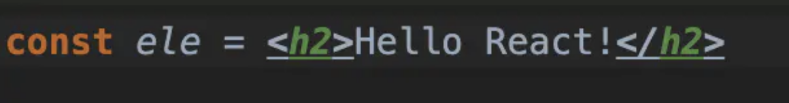

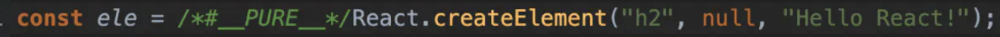

> script 标签中不添加`text/babel`解析 jsx 语法的情况下

```js
<script>
  const ele = React.createElement("h2", null, "Hello React!");
  ReactDOM.render(ele, document.getElementById("app"));
</script>
```

**JSX 的本质是 React.createElement()函数**

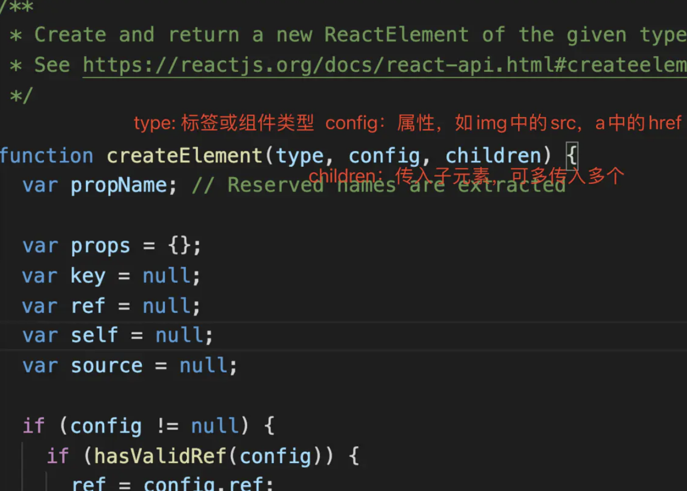

> `createElement`函数返回的对象是`ReactEelement`对象。

`createElement`的写法如下

```js
class App extends React.Component {
  constructor() {
    super()
    this.state = {}
  }
  render() {
    return React.createElement(
      'div',
      null,
      /*第一个子元素，header*/
      React.createElement(
        'div',
        { className: 'header' },
        React.createElement(
          'h1',
          { title: '\u6807\u9898' },
          '\u6211\u662F\u6807\u9898'
        )
      ),
      /*第二个子元素，content*/
      React.createElement(
        'div',
        { className: 'content' },
        React.createElement(
          'h2',
          null,
          '\u6211\u662F\u9875\u9762\u7684\u5185\u5BB9'
        ),
        React.createElement('button', null, '\u6309\u94AE'),
        React.createElement('button', null, '+1'),
        React.createElement(
          'a',
          { href: 'http://www.baidu.com' },
          '\u767E\u5EA6\u4E00\u4E0B'
        )
      ),
      /*第三个子元素，footer*/
      React.createElement(
        'div',
        { className: 'footer' },
        React.createElement(
          'p',
          null,
          '\u6211\u662F\u5C3E\u90E8\u7684\u5185\u5BB9'
        )
      )
    )
  }
}
ReactDOM.render(<App />, document.getElementById('app'))
```

​

实际开发中不会使用`createElement`来创建`ReactElement`的，一般都是使用 JSX 的形式开发。

`ReactElement`在程序中打印一下

```js
render() {
    let ele = (
        <div>
        <div className="header">
        <h1 title="标题">我是标题</h1>
        </div>
        <div className="content">
        <h2>我是页面的内容</h2>
        <button>按钮</button>
        <button>+1</button>
        <a href="http://www.baidu.com">百度一下</a>
        </div>
        <div className="footer">
        <p>我是尾部的内容</p>
        </div>
        </div>
    )
    console.log(ele);  return ele;}
```

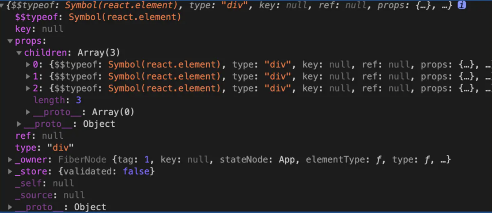

> react 通过 babel 把 JSX 转成`createElement`函数，生成`ReactElement`对象，然后通过`ReactDOM.render函`数把`ReactElement`渲染成真实的`DOM`元素

**为什么 React 使用 JSX**


- 在回答问题之前，我首先解释下什么是 JSX 吧。JSX 是一个 `JavaScript` 的语法扩展，结构类似 XML。
- JSX 主要用于声明 `React` 元素，但 React 中并不强制使用 `JSX`。即使使用了 `JSX`，也会在构建过程中，通过 Babel 插件编译为 `React.createElement`。所以 JSX 更像是 `React.createElement` 的一种语法糖
- 接下来与 JSX 以外的三种技术方案进行对比

  - 首先是模板，React 团队认为模板不应该是开发过程中的关注点，因为引入了模板语法、模板指令等概念，是一种不佳的实现方案
  - 其次是模板字符串，模板字符串编写的结构会造成多次内部嵌套，使整个结构变得复杂，并且优化代码提示也会变得困难重重
  - 所以 React 最后选用了 JSX，因为 JSX 与其设计思想贴合，不需要引入过多新的概念，对编辑器的代码提示也极为友好。

**Babel 插件如何实现 JSX 到 JS 的编译？ 在 React 面试中，这个问题很容易被追问，也经常被要求手写。**

它的实现原理是这样的。Babel 读取代码并解析，生成 AST，再将 AST 传入插件层进行转换，在转换时就可以将 JSX 的结构转换为 `React.createElement` 的函数。如下代码所示：

```jsx
module.exports = function (babel) {
  var t = babel.types
  return {
    name: 'custom-jsx-plugin',
    visitor: {
      JSXElement(path) {
        var openingElement = path.node.openingElement
        var tagName = openingElement.name.name
        var args = []
        args.push(t.stringLiteral(tagName))
        var attribs = t.nullLiteral()
        args.push(attribs)
        var reactIdentifier = t.identifier('React')
        //object
        var createElementIdentifier = t.identifier('createElement')
        var callee = t.memberExpression(
          reactIdentifier,
          createElementIdentifier
        )
        var callExpression = t.callExpression(callee, args)
        callExpression.arguments = callExpression.arguments.concat(
          path.node.children
        )
        path.replaceWith(callExpression, path.node)
      },
    },
  }
}
```

**React.createElement 源码分析**

```jsx
/** 101. React的创建元素方法 */
export function createElement(type, config, children) {
  // propName 变量用于储存后面需要用到的元素属性
  let propName
  // props 变量用于储存元素属性的键值对集合
  const props = {}
  // key、ref、self、source 均为 React 元素的属性，此处不必深究
  let key = null
  let ref = null
  let self = null
  let source = null
  // config 对象中存储的是元素的属性
  if (config != null) {
    // 进来之后做的第一件事，是依次对 ref、key、self 和 source 属性赋值
    if (hasValidRef(config)) {
      ref = config.ref
    }
    // 此处将 key 值字符串化
    if (hasValidKey(config)) {
      key = '' + config.key
    }
    self = config.__self === undefined ? null : config.__self
    source = config.__source === undefined ? null : config.__source
    // 接着就是要把 config 里面的属性都一个一个挪到 props 这个之前声明好的对象里面
    for (propName in config) {
      if (
        // 筛选出可以提进 props 对象里的属性
        hasOwnProperty.call(config, propName) &&
        !RESERVED_PROPS.hasOwnProperty(propName)
      ) {
        props[propName] = config[propName]
      }
    }
  }
  // childrenLength 指的是当前元素的子元素的个数，减去的 2 是 type 和 config 两个参数占用的长度
  const childrenLength = arguments.length - 2
  // 如果抛去type和config，就只剩下一个参数，一般意味着文本节点出现了
  if (childrenLength === 1) {
    // 直接把这个参数的值赋给props.children
    props.children = children
    // 处理嵌套多个子元素的情况
  } else if (childrenLength > 1) {
    // 声明一个子元素数组
    const childArray = Array(childrenLength)
    // 把子元素推进数组里
    for (let i = 0; i < childrenLength; i++) {
      childArray[i] = arguments[i + 2]
    }
    // 最后把这个数组赋值给props.children
    props.children = childArray
  }
  // 处理 defaultProps
  if (type && type.defaultProps) {
    const defaultProps = type.defaultProps
    for (propName in defaultProps) {
      if (props[propName] === undefined) {
        props[propName] = defaultProps[propName]
      }
    }
  } // 最后返回一个调用ReactElement执行方法，并传入刚才处理过的参数
  return ReactElement(
    type,
    key,
    ref,
    self,
    source,
    ReactCurrentOwner.current,
    props
  )
}
```

​

**入参解读：创造一个元素需要知道哪些信息**

    export function createElement(type, config, children)

createElement 有 3 个入参，这 3 个入参囊括了 React 创建一个元素所需要知道的全部信息。

- `type`：用于标识节点的类型。它可以是类似“h1”“div”这样的标准 HTML 标签字符串，也可以是 React 组件类型或 `React fragment` 类型。
- `config`：以对象形式传入，组件所有的属性都会以键值对的形式存储在 config 对象中。
- `children`：以对象形式传入，它记录的是组件标签之间嵌套的内容，也就是所谓的“子节点”“子元素”

  React.createElement("ul", { // 传入属性键值对 className: "list" // 从第三个入参开始往后，传入的参数都是 children}, React.createElement("li", { key: "1"}, "1"), React.createElement("li", { key: "2"}, "2"));

这个调用对应的 DOM 结构如下：

    <ul className="list">  <li key="1">1</li>  <li key="2">2</li></ul>

**createElement 函数体拆解**


> createElement 中并没有十分复杂的涉及算法或真实 DOM 的逻辑，它的每一个步骤几乎都是在格式化数据。


> 现在看来，`createElement` 原来只是个“参数中介”。此时我们的注意力自然而然地就聚焦在了 `ReactElement` 上

**出参解读：初识虚拟 DOM**

> `createElement` 执行到最后会 return 一个针对 ReactElement 的调用。这里关于 ReactElement，我依然先给出源码 + 注释形式的解析

```js
const ReactElement = function (type, key, ref, self, source, owner, props) {
  const element = {
    // REACT_ELEMENT_TYPE是一个常量，用来标识该对象是一个ReactElement
    $$typeof: REACT_ELEMENT_TYPE,
    // 内置属性赋值
    type: type,
    key: key,
    ref: ref,
    props: props,
    // 记录创造该元素的组件
    _owner: owner,
  } //
  if (__DEV__) {
    // 这里是一些针对 __DEV__ 环境下的处理，对于大家理解主要逻辑意义不大，此处我直接省略掉，以免混淆视听
  }
  return element
}
```

​

> `ReactElement` 其实只做了一件事情，那就是“创建”，说得更精确一点，是“组装”：`ReactElement` 把传入的参数按照一定的规范，“组装”进了 `element` 对象里，并把它返回给了 `eact.createElement`，最终 `React.createElement` 又把它交回到了开发者手中


```jsx
const AppJSX = (
  <div className="App">
    <h1 className="title">I am the title</h1>
    <p className="content">I am the content</p>
  </div>
)
console.log(AppJSX)
```

​

你会发现它确实是一个标准的 `ReactElement` 对象实例


这个 `ReactElement` 对象实例，本质上是以 JavaScript 对象形式存在的对 `DOM` 的描述，也就是老生常谈的“虚拟 DOM”（准确地说，是虚拟 `DOM` 中的一个节点)

### 14 为什么 React 元素有一个 $$typeof 属性


> 目的是为了防止 XSS 攻击。因为 Synbol 无法被序列化，所以 React 可以通过有没有 $$typeof 属性来断出当前的 element 对象是从数据库来的还是自己生成的。

- 如果没有 $$typeof 这个属性，react 会拒绝处理该元素。

- 在 React 的古老版本中，下面的写法会出现 XSS 攻击：

  ```jsx
  // 服务端允许用户存储
  JSONlet expectedTextButGotJSON = {
      type: 'div',
      props: {
          dangerouslySetInnerHTML: {
              __html: '/* 把你想的搁着 */'
          },
      },
      // ...
  };
  let message = { text: expectedTextButGotJSON };
  // React 0.13 中有风险<p>  {message.text}</p>
  ```

  ​

### 15 Virtual DOM 的工作原理是什么


- 虚拟 DOM 的工作原理是`通过 JS 对象模拟 DOM 的节点`。在 Facebook 构建 React 初期时，考虑到要提升代码抽象能力、避免人为的 DOM 操作、降低代码整体风险等因素，所以引入了虚拟 DOM
- 虚拟 DOM 在实现上通常是 `Plain Object`，以 React 为例，在 `render` 函数中写的 `JSX` 会在 `Babel` 插件的作用下，编译为 `React.createElement` 执行 `JSX` 中的属性参数
- `React.createElement` 执行后会返回一个 `Plain Object`，它会描述自己的 `tag` 类型、`props` 属性以及 `children` 情况等。这些 `Plain Object` 通过树形结构组成一棵虚拟 `DOM` 树。当状态发生变更时，将变更前后的虚拟 `DOM` 树进行差异比较，这个过程称为 `diff`，生成的结果称为 `patch`。计算之后，会渲染 `Patch` 完成对真实 `DOM` 的操作。
- 虚拟 DOM 的优点主要有三点：`改善大规模`DOM`操作的性能`、`规避 XSS 风险`、`能以较低的成本实现跨平台开发`。
- 虚拟 DOM 的缺点在社区中主要有两点

  - 内存占用较高，因为需要模拟整个网页的真实 `DOM`
  - 高性能应用场景存在难以优化的情况，类似像 Google Earth 一类的高性能前端应用在技术选型上往往不会选择 React

**除了渲染页面，虚拟 DOM 还有哪些应用场景？**

> 这个问题考验面试者的想象力。通常而言，我们只是将虚拟 DOM 与渲染绑定在一起，但实际上虚拟 DOM 的应用更为广阔。比如，只要你记录了真实 DOM 变更，它甚至可以应用于埋点统计与数据记录等。

**SSR 原理**

> 借助虚拟 dom,服务器中没有 dom 概念的，react 巧妙的借助虚拟 dom，然后可以在服务器中 nodejs 可以运行起来 react 代码。

### 16 React 有哪些优化性能的手段

**类组件中的优化手段**

- 使用纯组件 `PureComponent` 作为基类。
- 使用 `shouldComponentUpdate` 生命周期函数来自定义渲染逻辑。

**方法组件中的优化手段**

- 使用 `React.memo` 高阶函数包装组件，`React.memo` 可以实现类似于 `shouldComponentUpdate` 或者 `PureComponent` 的效果
- 使用 `useMemo`

  - 使用`React.useMemo`精细化的管控，`useMemo 控制的则是是否需要重复执行某一段逻辑`，而`React.memo 控制是否需要重渲染一个组件`

- 使用 `useCallBack`。

**其他方式**

- 在列表需要频繁变动时，使用唯一 id 作为 key，而不是数组下标。

- 必要时通过改变 CSS 样式隐藏显示组件，而不是通过条件判断显示隐藏组件。

- 使用 `Suspense` 和 lazy 进行懒加载，例如：

  ```jsx
  import React, { lazy, Suspense } from 'react'
  export default class CallingLazyComponents extends React.Component {
    render() {
      var ComponentToLazyLoad = null
      if (this.props.name == 'Mayank') {
        ComponentToLazyLoad = lazy(() => import('./mayankComponent'))
      } else if (this.props.name == 'Anshul') {
        ComponentToLazyLoad = lazy(() => import('./anshulComponent'))
      }
      return (
        <div>
          <h1>This is the Base User: {this.state.name}</h1>
          <Suspense fallback={<div>Loading...</div>}>
            <ComponentToLazyLoad />
          </Suspense>
        </div>
      )
    }
  }
  ```

### 17 Redux 实现原理解析

> `在 Redux 的整个工作过程中，数据流是严格单向的`。这一点一定一定要背下来，面试的时候也一定一定要记得说

**为什么要用 redux**

> 在`React`中，数据在组件中是单向流动的，数据从一个方向父组件流向子组件（通过`props`）,所以，两个非父子组件之间通信就相对麻烦，`redux`的出现就是为了解决`state`里面的数据问题

**Redux 设计理念**

> `Redux`是将整个应用状态存储到一个地方上称为`store`,里面保存着一个状态树`store tree`,组件可以派发(`dispatch`)行为(`action`)给`store`,而不是直接通知其他组件，组件内部通过订阅`store`中的状态`state`来刷新自己的视图

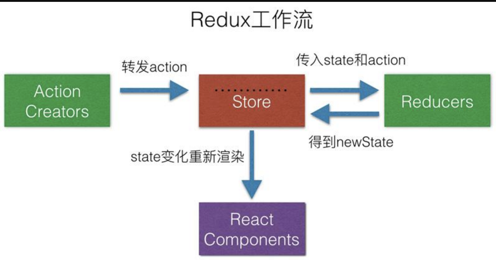

> 如果你想对数据进行修改，`只有一种途径：派发 action`。action 会被 reducer 读取，进而根据 action 内容的不同对数据进行修改、生成新的 state（状态），这个新的 state 会更新到 store 对象里，进而驱动视图层面做出对应的改变。

**Redux 三大原则**

- 唯一数据源

> 整个应用的 state 都被存储到一个状态树里面，并且这个状态树，只存在于唯一的 store 中

- 保持只读状态

> `state`是只读的，唯一改变`state`的方法就是触发`action`，`action`是一个用于描述以发生时间的普通对象

- 数据改变只能通过纯函数来执行

> 使用纯函数来执行修改，为了描述`action`如何改变`state`的，你需要编写`reducers`

**从编码的角度理解 Redux 工作流**

1.  使用 `createStore 来完成 store 对象的创建`

    ```jsx
    // 引入
    reduximport { createStore } from 'redux'
    // 创建
    storeconst store = createStore(    reducer,    initial_state,    applyMiddleware(middleware1, middleware2, ...));
    ```

createStore 方法是一切的开始，它接收三个入参：

- reducer；
- 初始状态内容；
- 指定中间件

1.  `reducer 的作用是将新的 state 返回给 store`

一个 reducer 一定是一个纯函数，它可以有各种各样的内在逻辑，但它最终一定要返回一个 state：

    const reducer = (state, action) => {
        // 此处是各种样的 state处理逻辑
        return new_state
    }

​

当我们基于某个 reducer 去创建 store 的时候，其实就是给这个 store 指定了一套更新规则：

    // 更新规则全都写在 reducer 里 const store = createStore(reducer)

​

1.  action 的作用是通知 reducer “让改变发生”

> 要想让 state 发生改变，就必须用正确的 action 来驱动这个改变。

    const action = {  type: "ADD_ITEM",  payload: '<li>text</li>'}

> action 对象中允许传入的属性有多个，但只有 type 是必传的。type 是 action 的唯一标识，reducer 正是通过不同的 type 来识别出需要更新的不同的 state，由此才能够实现精准的“定向更新”。

1.  派发 action，靠的是 dispatch

action 本身只是一个对象，要想让 reducer 感知到 action，还需要“派发 action”这个动作，`这个动作是由 store.dispatch 完成的`。这里我简单地示范一下：

```js
import { createStore } from 'redux'
// 创建 reducer
const reducer = (state, action) => {
  // 此处是各种样的 state处理逻辑
  return new_state
}
// 基于 reducer 创建 state
const store = createStore(reducer)
// 创建一个 action，这个 action 用 “ADD_ITEM” 来标识
const action = { type: 'ADD_ITEM', payload: '<li>text</li>' }
// 使用 dispatch 派发 action，action 会进入到 reducer 里触发对应的更新store.dispatch(action)
```

​

以上这段代码，是从编码角度对 Redux 主要工作流的概括，这里我同样为你总结了一张对应的流程图：


**Redux 源码**

```js
let createStore = (reducer) => {
  let state
  //获取状态对象
  //存放所有的监听函数
  let listeners = []
  let getState = () => state
  //提供一个方法供外部调用派发action
  let dispath = (action) => {
    //调用管理员reducer得到新的state
    state = reducer(state, action)
    //执行所有的监听函数
    listeners.forEach((l) => l())
  }
  //订阅状态变化事件，当状态改变发生之后执行监听函数
  let subscribe = (listener) => {
    listeners.push(listener)
  }
  dispath()
  return {
    getState,
    dispath,
    subscribe,
  }
}
let combineReducers = (renducers) => {
  //传入一个renducers管理组，返回的是一个renducer
  return function (state = {}, action = {}) {
    let newState = {}
    for (var attr in renducers) {
      newState[attr] = renducers[attr](state[attr], action)
    }
    return newState
  }
}
export { createStore, combineReducers }
```

**聊聊 Redux 和 Vuex 的设计思想**

- **共同点**

> 首先两者都是处理全局状态的工具库，大致实现思想都是：全局`state`保存状态---->`dispatch(action)`\------>`reducer`(`vuex`里的`mutation`)----> 生成`newState`; 整个状态为同步操作；

- **区别**

> 最大的区别在于处理异步的不同，vuex 里面多了一步`commit`操作，在`action`之后`commit(mutation)`之前处理异步，而`redux`里面则是通过中间件处理

**redux 中间件**

> 中间件提供第三方插件的模式，自定义拦截 action -> reducer 的过程。变为 action -> middlewares -> reducer 。这种机制可以让我们改变数据流，实现如异步 action ，action 过 滤，日志输出，异常报告等功能

常见的中间件:

- `redux-logger`:提供日志输出;
- `redux-thunk`:处理异步操作;
- `redux-promise`: 处理异步操作;
- `actionCreator` 的返回值是 `promise`

**redux 中间件的原理是什么**

`applyMiddleware`

**为什么会出现中间件？**

- 它只是一个用来加工 dispatch 的工厂，而要加工什么样的 dispatch 出来，则需要我们传入对应的中间件函数

- 让每一个中间件函数，接收一个 dispatch，然后返回一个改造后的 dispatch，来作为下一个中间件函数的 next，以此类推。

  ```js
  function applyMiddleware(middlewares) {
    middlewares = middlewares.slice()
    middlewares.reverse()
    let dispatch = store.dispatch
    middlewares.forEach(
      (middleware) => (dispatch = middleware(store)(dispatch))
    )
    return Object.assign({}, store, { dispatch })
  }
  ```

> 上面的`middleware(store)(dispatch)` 就相当于是 `const logger = store => next => {}`，这就是构造后的 dispatch，继续向下传递。这里`middlewares.reverse()`，进行数组反转的原因，是最后构造的`dispatch`，实际上是最先执行的。因为在`applyMiddleware`串联的时候，每个中间件只是返回一个新的`dispatch`函数给下一个中间件，实际上这个`dispatch`并不会执行。只有当我们在程序中通过`store.dispatch(action)`，真正派发的时候，才会执行。而此时的`dispatch`是最后一个中间件返回的包装函数。然后依次向前递推执行。

[浅析中间件(opens new window)][opens new window 3]

**action、store、reducer 分析**

> redux 的核心概念就是 store、action、reducer，从调用关系来看如下所示

    store.dispatch(action) --> reducer(state, action) --> final state

```js
// reducer方法, 传入的参数有两个
// state: 当前的state
// action: 当前触发的行为, {type: 'xx'}
// 返回值: 新的state
var reducer = function (state, action) {
  switch (action.type) {
    case 'add_todo':
      return state.concat(action.text)
    default:
      return state
  }
}
// 创建store, 传入两个参数
// 参数1: reducer 用来修改state
// 参数2(可选): [], 默认的state值,如果不传, 则为undefined
var store = redux.createStore(reducer, [])
// 通过 store.getState() 可以获取当前store的状态(state)
// 默认的值是 createStore 传入的第二个参数
console.log('state is: ' + store.getState())
// state is:
// 通过 store.dispatch(action) 来达到修改 state 的目的
// 注意: 在redux里,唯一能够修改state的方法,就是通过 store.dispatch(action)store.dispatch({type: 'add_todo', text: '读书'});
// 打印出修改后的state
console.log('state is: ' + store.getState())
// state is: 读书store.dispatch({type: 'add_todo', text: '写作'});
console.log('state is: ' + store.getState()) // state is: 读书,写作
```

​

1.  store、reducer、action 关联

**store**

- `store`在这里代表的是数据模型，内部维护了一个`state`变量
- `store`有两个核心方法，分别是`getState`、`dispatch`。前者用来获取`store`的状态（`state`），后者用来修改`store`的状态

  // 创建 store, 传入两个参数// 参数 1: reducer 用来修改 state// 参数 2(可选): [], 默认的 state 值,如果不传, 则为 undefinedvar store = redux.createStore(reducer, []);// 通过 store.getState() 可以获取当前 store 的状态(state)// 默认的值是 createStore 传入的第二个参数 console.log('state is: ' + store.getState()); // state is:// 通过 store.dispatch(action) 来达到修改 state 的目的// 注意: 在 redux 里,唯一能够修改 state 的方法,就是通过 store.dispatch(action)store.dispatch({type: 'add_todo', text: '读书'});

  ​

**action**

- 对行为（如用户行为）的抽象，在`redux`里是一个普通的`js`对象
- `action`必须有一个`type`字段来标识这个行为的类型

  {type:'add_todo', text:'读书'}{type:'add_todo', text:'写作'}{type:'add_todo', text:'睡觉', time:'晚上'}

**reducer**

- 一个普通的函数，用来修改`store`的状态。传入两个参数 `state`、`action`
- 其中，`state`为当前的状态（可通过`store.getState()`获得），而`action`为当前触发的行为（通过`store.dispatch(action)`调用触发）
- `reducer(state, action)` 返回的值，就是`store`最新的`state`值

  // reducer 方法, 传入的参数有两个// state: 当前的 state// action: 当前触发的行为, {type: 'xx'}// 返回值: 新的 statevar reducer = function(state, action){ switch (action.type) { case 'add_todo': return state.concat(action.text); default: return state; }};

  ​

1.  关于`actionCreator`

    actionCreator(args) => action

```js
var addTodo = function (text) {
  return {
    type: 'add_todo',
    text: text,
  }
}
addTodo('睡觉')
// 返回：{type: 'add_todo', text: '睡觉'}
```

​

**异步 Action 及操作**

1.  创建同步 Action

> `Action`是数据从应用传递到 `store`/`state` 的载体，也是开启一次完成数据流的开始

**普通的 action 对象**

    const action = {	type:'ADD_TODO',	name:'poetries'}dispatch(action)

​

**封装 action creator**

```js
function actionCreator(data) {
  return {
    type: 'ADD_TODO',
    data: data,
  }
}
dispatch(actionCreator('poetries'))
```

​

**bindActionCreators 合并**

```js
function a(name,id){
    reurn {
        type:'a',
            name,
            id
    }
}
function b(name,id){
    reurn {
        type:'b',
            name,
            id	}}
let actions = Redux.bindActionCreators({a,b},store.dispatch)
//调用
actions.a('poetries','id001')actions.b('jing','id002')
```

**action 创建的标准**

> 在 Flux 的架构中，一个 Action 要符合 FSA(Flux Standard Action) 规范，需要满足如下条件

- 是一个纯文本对象
- 只具备 `type` 、`payload`、`error` 和 `meta`中的一个或者多个属性。`type` 字段不可缺省，其它字段可缺省
- 若 `Action` 报错，`error` 字段不可缺省，切必须为 `true`

> `payload` 是一个对象，用作 Action 携带数据的载体

**标准 action 示例**

- A basic Flux Standard Action:

  { type: 'ADD_TODO', payload: { text: 'Do something.' }}

- An FSA that represents an error, analogous to a rejected Promise

  { type: 'ADD_TODO', payload: new Error(), error: true}

> https://github.com/acdlite/flux-standard-action

- 可以采用如下一个简单的方式检验一个`Action`是否符合 FSA 标准

  // every 有一个匹配不到返回 falselet isFSA = Object.keys(action).every((item)=>{ return ['payload','type','error','meta'].indexOf(item) > -1})

1.  创建异步 action 的多种方式

> 最简单的方式就是使用同步的方式来异步，将原来同步时一个`action`拆分成多个异步的`action`的，在异步开始前、异步请求中、异步正常返回（异常）操作分别使用同步的操作，从而模拟出一个异步操作了。这样的方式是比较麻烦的，现在已经有`redux-saga`等插件来解决这些问题了

**异步 action 的实现方式一：setTimeout**

> `redux-thunk`中间处理解析

```js
function thunkAction(data) {
    reutrn (dispatch)=>{
        setTimeout(function(){
            dispatch({
                type:'ADD_TODO',
                data
            })
        },3000)
    }
}
```

​

**异步 action 的实现方式二：promise 实现异步 action**

> `redux-promise`中间处理这种`action`

```js
function promiseAction(name) {
  return new Promise((resolve, reject) => {
    setTimeout((param) => {
      resolve({
        type: 'ADD_TODO',
        name,
      })
    }, 3000)
  })
    .then((param) => {
      dispatch(action('action2'))
      return
    })
    .then((param) => {
      dispatch(action('action3'))
    })
}
```

1.  redux 异步流程


- 首先发起一个 action，然后通过中间件，这里为什么要用中间件呢，因为这样`dispatch`的返回值才能是一个函数。
- 通过`store.dispatch`，将状态的的改变传给`store`的小弟`reducer`，`reducer`根据`action`的改变，传递新的状态`state`。
- 最后将所有的改变告诉给它的大哥，`store`。`store`保存着所有的数据，并将数据注入到组件的顶部，这样组件就可以获得它需要的数据了

1.  Redux 异步方案选型

**redux-thunk**

> `Redux`本身只能处理同步的`Action`，但可以通过中间件来拦截处理其它类型的`action`，比如函数(`Thunk`)，再用回调触发普通`Action`，从而实现异步处理

- 发送异步的`action`其实是被中间件捕获的，函数类型的 action 就被`middleware`捕获。至于怎么定义异步的`action`要看你用哪个中间件，根据他们的实例来定义，这样才会正确解析`action`

> `Redux` 本身不处理异步行为，需要依赖中间件。结合 `redux-actions` 使用，`Redux` 有两个推荐的异步中间件

- `redux-thunk`
- `redux-promise`

> `redux-thunk` 的源码如下

```js
function createThunkMiddleware(extraArgument) {
  return ({ dispatch, getState }) =>
    (next) =>
    (action) => {
      if (typeof action === 'function') {
        return action(dispatch, getState, extraArgument)
      }
      return next(action)
    }
}
const thunk = createThunkMiddleware()
thunk.withExtraArgument = createThunkMiddleware
export default thunk
```

> 源码可知，`action creator` 需要返回一个函数给 `redux-thunk` 进行调用，示例如下

```js
export let addTodoWithThunk = (val) => async (dispatch, getState) => {
  //请求之前的一些处理
  let value = await Promise.resolve(val + ' thunk')
  dispatch({
    type: CONSTANT.ADD_TO_DO_THUNK,
    payload: {
      value,
    },
  })
}
```

- 而它使用起来最大的问题，就是重复的模板代码太多

  ```js
  //action types
  const GET_DATA = 'GET_DATA',
        GET_DATA_SUCCESS = 'GET_DATA_SUCCESS',
        GET_DATA_FAILED = 'GET_DATA_FAILED';
  //action creator
  const getDataAction = (id) => (dispatch, getState) => {
      dispatch({
          type: GET_DATA,
          payload: id
      })
      api.getData(id)
      //注：本文所有示例的api.getData都返回promise对象
          .then(response => {
          dispatch({
              type: GET_DATA_SUCCESS,
              payload: response
          })
      })
          .catch(error => {
          dispatch({
              type: GET_DATA_FAILED,
              payload: error
          })
      })
  }}
  //reducer
  const reducer = (oldState, action) => {
      switch(action.type) {
          case GET_DATA :
              return oldState;
          case GET_DATA_SUCCESS :
              return successState;
          case GET_DATA_FAILED :
              return errorState;
      }
  }
  ```

  ​

> 这已经是最简单的场景了，请注意：我们甚至还没写一行业务逻辑，如果每个异步处理都像这样，重复且无意义的工作会变成明显的阻碍

- 另一方面，像`GET_DATA_SUCCESS`、`GET_DATA_FAILED`这样的字符串声明也非常无趣且易错上例中，`GET_DATA`这个`action`并不是多数场景需要的

**redux-promise**

> 由于`redux-thunk`写起来实在是太麻烦了，社区当然会有其它轮子出现。`redux-promise`则是其中比较知名的

- 它自定义了一个`middleware`，当检测到有`action`的`payload`属性是`Promise`对象时，就会

  - 若`resolve`，触发一个此`action`的拷贝，但`payload`为`promise`的`value`，并设`status`属性为`"success"`
  - 若`reject`，触发一个此`action`的拷贝，但`payload`为`promise`的`reason`，并设`status`属性为`"error"`

  ```js
  //action types
  const GET_DATA = 'GET_DATA'
  //action creator
  const getData = function (id) {
    return {
      type: GET_DATA,
      payload: api.getData(id),
      //payload为promise对象
    }
  }
  //reducer
  function reducer(oldState, action) {
    switch (action.type) {
      case GET_DATA:
        if (action.status === 'success') {
          return successState
        } else {
          return errorState
        }
    }
  }
  ```

  ​

> `redux-promise`为了精简而做出的妥协非常明显：无法处理乐观更新

**场景解析之：乐观更新**

> 多数异步场景都是悲观更新的，即等到请求成功才渲染数据。而与之相对的乐观更新，则是不等待请求成功，在发送请求的同时立即渲染数据

- 由于乐观更新发生在用户操作时，要处理它，意味着必须有 action 表示用户的初始动作
- 在上面`redux-thunk`的例子中，我们看到了`GET_DATA`, `GET_DATA_SUCCESS`、`GET_DATA_FAILED`三个`action`，分别表示初始动作、异步成功和异步失败，其中第一个`action`使得`redux-thunk`具备乐观更新的能力
- 而在`redux-promise`中，最初触发的 action 被中间件拦截然后过滤掉了。原因很简单，`redux`认可的`action`对象是 `plain JavaScript objects`，即简单对象，而在`redux-promise`中，初始`action`的`payload`是个`Promise`

**redux-promise-middleware**

> `redux-promise-middleware`相比`redux-promise`，采取了更为温和和渐进式的思路，保留了和`redux-thunk`类似的三个`action`

```js
//action types
const GET_DATA = 'GET_DATA',
  GET_DATA_PENDING = 'GET_DATA_PENDING',
  GET_DATA_FULFILLED = 'GET_DATA_FULFILLED',
  GET_DATA_REJECTED = 'GET_DATA_REJECTED'
//action creator
const getData = function (id) {
  return {
    type: GET_DATA,
    payload: {
      promise: api.getData(id),
      data: id,
    },
  }
} //reducer
const reducer = function (oldState, action) {
  switch (action.type) {
    case GET_DATA_PENDING:
      return oldState
    // 可通过action.payload.data获取id
    case GET_DATA_FULFILLED:
      return successState
    case GET_DATA_REJECTED:
      return errorState
  }
}
```

1.  redux 异步操作代码演示

- 根据官网的 async 例子分析 https://github.com/lewis617/react-redux-tutorial/tree/master/redux-examples/async

**action/index.js**

```js
import fetch from 'isomorphic-fetch'
export const RECEIVE_POSTS = 'RECEIVE_POSTS'
//获取新闻成功的action
function receivePosts(reddit, json) {
  return {
    type: RECEIVE_POSTS,
    reddit: reddit,
    posts: json.data.children.map((child) => child.data),
  }
}
function fetchPosts(subreddit) {
  return function (dispatch) {
    return fetch(`http://www.subreddit.com/r/${subreddit}.json`)
      .then((response) => response.json())
      .then((json) => dispatch(receivePosts(subreddit, json)))
  }
}
//如果需要则开始获取文章
export function fetchPostsIfNeeded(subreddit) {
  return (dispatch, getState) => {
    return dispatch(fetchPosts(subreddit))
  }
}
```

​

> `fetchPostsIfNeeded`这里就是一个中间件。`redux-thunk`会拦截`fetchPostsIfNeeded`这个`action`，会先发起数据请求，如果成功，就将数据传给`action`从而到达`reducer`那里

**reducers/index.js**

```js
import { combineReducers } from 'redux'
import { RECEIVE_POSTS } from '../actions'
function posts(state = { items: [] }, action) {
  switch (action.type) {
    case RECEIVE_POSTS:
      // Object.assign是ES6的一个语法。合并对象，将对象合并为一个，前后相同的话，后者覆盖强者。详情可以看这里
      // https://developer.mozilla.org/en-US/docs/Web/JavaScript/Reference/Global_Objects/Object/assign
      return Object.assign({}, state, {
        items: action.posts,
        //数据都存在了这里
      })
    default:
      return state
  }
}
// 将所有的reducer结合为一个,传给store
const rootReducer = combineReducers({ postsByReddit })
export default rootReducer
```

​

> 这个跟正常的`reducer`差不多。判断`action`的类型，从而根据`action`的不同类型，返回不同的数据。这里将数据存储在了`items`这里。这里的`reducer`只有一个。最后结合成`rootReducer`,传给`store`

**store/configureStore.js**

```js
import { createStore, applyMiddleware } from 'redux'
import thunkMiddleware from 'redux-thunk'
import createLogger from 'redux-logger'
import rootReducer from '../reducers'
const createStoreWithMiddleware = applyMiddleware(
  thunkMiddleware,
  createLogger()
)(createStore)
export default function configureStore(initialState) {
  const store = createStoreWithMiddleware(rootReducer, initialState)
  if (module.hot) {
    // Enable Webpack hot module replacement for reducers
    module.hot.accept('../reducers', () => {
      const nextRootReducer = require('../reducers')
      store.replaceReducer(nextRootReducer)
    })
  }
  return store
}
```

​

- 我们是如何在 `dispatch` 机制中引入 `Redux Thunk middleware` 的呢？我们使用了`applyMiddleware()`
- 通过使用指定的 `middleware`，`action creator` 除了返回 `action` 对象外还可以返回函数
- 这时，这个 `action creator` 就成为了 `thunk`

**界面上的调用：在 containers/App.js**

```js
//初始化渲染后触发
componentDidMount() {
    const { dispatch} = this.props
    // 这里可以传两个值，一个是 reactjs 一个是 frontend
    dispatch(fetchPostsIfNeeded('frontend'))
}
```

​

> 改变状态的时候也是需要通过`dispatch`来传递的

- 数据的获取是通过`provider`,将`store`里面的数据注入给组件。让顶级组件提供给他们的子孙组件调用。代码如下：

  ```jsx
  import 'babel-core/polyfill'
  import React from 'react'
  import { render } from 'react-dom'
  import { Provider } from 'react-redux'
  import App from './containers/App'
  import configureStore from './store/configureStore'
  const store = configureStore()
  render(
    <Provider store={store}>
      <App />
    </Provider>,
    document.getElementById('root')
  )
  ```

  ​

> 这样就完成了`redux`的异步操作。其实最主要的区别还是`action`里面还有中间件的调用，其他的地方基本跟同步的`redux`差不多的。搞懂了中间件，就基本搞懂了`redux`的异步操作


### 18 谈谈你对状态管理的理解

- 首先介绍 Flux，Flux 是一种使用单向数据流的形式来组合 React 组件的应用架构。
- Flux 包含了 4 个部分，分别是 `Dispatcher`、 `Store`、`View`、`Action`。`Store` 存储了视图层所有的数据，当 `Store` 变化后会引起 View 层的更新。如果在视图层触发一个 `Action`，就会使当前的页面数据值发生变化。Action 会被 Dispatcher 进行统一的收发处理，传递给 Store 层，Store 层已经注册过相关 Action 的处理逻辑，处理对应的内部状态变化后，触发 View 层更新。
- `Flux 的优点是单向数据流，解决了 MVC 中数据流向不清的问题`，使开发者可以快速了解应用行为。从项目结构上简化了视图层设计，明确了分工，数据与业务逻辑也统一存放管理，使在大型架构的项目中更容易管理、维护代码。
- `其次是 Redux`，Redux 本身是一个 JavaScript 状态容器，提供可预测化状态的管理。社区通常认为 Redux 是 Flux 的一个简化设计版本，它提供的状态管理，简化了一些高级特性的实现成本，比如撤销、重做、实时编辑、时间旅行、服务端同构等。
- Redux 的核心设计包含了三大原则：`单一数据源、纯函数 Reducer、State 是只读的`。
- Redux 中整个数据流的方案与 Flux 大同小异
- Redux 中的另一大核心点是处理“副作用”，AJAX 请求等异步工作，或不是纯函数产生的第三方的交互都被认为是 “副作用”。这就造成在纯函数设计的 Redux 中，处理副作用变成了一件至关重要的事情。社区通常有两种解决方案：

  - 第一类是在 `Dispatch` 的时候会有一个 `middleware 中间件层`，拦截分发的 `Action 并添加额外的复杂行为`，还可以添加副作用。第一类方案的流行框架有 `Redux-thunk、Redux-Promise、Redux-Observable、Redux-Saga` 等。
  - 第二类是允许 `Reducer` 层中直接处理副作用，采取该方案的有 `React Loop`，`React Loop` 在实现中采用了 Elm 中分形的思想，使代码具备更强的组合能力。
  - 除此以外，社区还提供了更为工程化的方案，比如 `rematch 或 dva`，提供了更详细的模块架构能力，提供了拓展插件以支持更多功能。

- Redux 的优点很多：

  - 结果可预测；
  - 代码结构严格易维护；
  - 模块分离清晰且小函数结构容易编写单元测试；
  - `Action` 触发的方式，可以在调试器中使用时间回溯，定位问题更简单快捷；
  - 单一数据源使服务端同构变得更为容易；社区方案多，生态也更为繁荣。

- `最后是 Mobx`，Mobx 通过监听数据的属性变化，可以直接在数据上更改触发 UI 的渲染。在使用上更接近 Vue，比起 `Flux 与 Redux` 的手动挡的体验，更像开自动挡的汽车。`Mobx 的响应式实现原理与 Vue 相同`，以 `Mobx 5` 为分界点，5 以前采用 `Object.defineProperty` 的方案，5 及以后使用 `Proxy` 的方案。`它的优点是样板代码少、简单粗暴、用户学习快、响应式自动更新数据`让开发者的心智负担更低。
- Mobx 在开发项目时简单快速，但应用 Mobx 的场景 ，其实完全可以用 Vue 取代。如果纯用 Vue，体积还会更小巧


### 19 connect 组件原理分析

**1. connect 用法**

> 作用：连接`React`组件与 `Redux store`

```js
connect([mapStateToProps], [mapDispatchToProps], [mergeProps], [options])
// 这个函数允许我们将 store 中的数据作为 props 绑定到组件上
const mapStateToProps = (state) => {
  return { count: state.count }
}
```

​

- 这个函数的第一个参数就是 `Redux` 的 `store`，我们从中摘取了 `count` 属性。你不必将 `state` 中的数据原封不动地传入组件，可以根据 `state` 中的数据，动态地输出组件需要的（最小）属性
- 函数的第二个参数 `ownProps`，是组件自己的 `props`

> 当 `state` 变化，或者 `ownProps` 变化的时候，`mapStateToProps` 都会被调用，计算出一个新的 `stateProps`，（在与 `ownProps merge` 后）更新给组件

    mapDispatchToProps(dispatch, ownProps): dispatchProps

> `connect` 的第二个参数是 `mapDispatchToProps`，它的功能是，将 `action` 作为 `props`绑定到组件上，也会成为 `MyComp` 的 \`props

**2. 原理解析**

> 首先`connect`之所以会成功，是因为`Provider`组件

- 在原应用组件上包裹一层，使原来整个应用成为`Provider`的子组件
- 接收`Redux`的`store`作为`props`，通过`context`对象传递给子孙组件上的`connect`

**connect 做了些什么**

> 它真正连接 `Redux` 和 `React`，它包在我们的容器组件的外一层，它接收上面 `Provider`提供的 `store` 里面的 `state`和 `dispatch`，传给一个构造函数，返回一个对象，以属性形式传给我们的容器组件

**3. 源码**

> `connect`是一个高阶函数，首先传入`mapStateToProps`、`mapDispatchToProps`，然后返回一个生产`Component`的函数(`wrapWithConnect`)，然后再将真正的`Component`作为参数传入`wrapWithConnect`，这样就生产出一个经过包裹的`Connect`组件，该组件具有如下特点

- 通过`props.store`获取祖先`Component`的`store props`包括`stateProps`、`dispatchProps`、`parentProps`,合并在一起得到`nextState`，作为`props`传给真正的`Component`

- `componentDidMount`时，添加事件`this.store.subscribe(this.handleChange)`，实现页面交互

- `shouldComponentUpdate`时判断是否有避免进行渲染，提升页面性能，并得到`nextState`

- `componentWillUnmount`时移除注册的事件`this.handleChange`

  ```jsx
  // 主要逻辑
  export default function connect(mapStateToProps, mapDispatchToProps, mergeProps, options = {}) {
      return function wrapWithConnect(WrappedComponent) {
          class Connect extends Component {
              constructor(props, context) {
                  // 从祖先Component处获得store
                  this.store = props.store || context.store
                  this.stateProps = computeStateProps(this.store, props)
                  this.dispatchProps = computeDispatchProps(this.store, props)
                  this.state = { storeState: null }
                  // 对stateProps、dispatchProps、parentProps进行合并
                  this.updateState()
              }
              shouldComponentUpdate(nextProps, nextState) {
                  // 进行判断，当数据发生改变时，Component重新渲染
                  if (propsChanged || mapStateProducedChange || dispatchPropsChanged) {
                      this.updateState(nextProps)
                      return true
                  }
              }
              componentDidMount() {
                  // 改变Component的state
                  this.store.subscribe(() = {
                      this.setState({
                      storeState: this.store.getState()
              })
          })
      }
      render() {
          // 生成包裹组件Connect
          return (
              <WrappedComponent {...this.nextState} />
          )
      }
      }
      Connect.contextTypes = {
          store: storeShape
      }
      return Connect;
      }
  }
  ```

### 20 React Hooks

- 代码逻辑聚合，逻辑复用
- HOC 嵌套地狱
- 代替 class

> React 中通常使用 类定义 或者 函数定义 创建组件:

在类定义中，我们可以使用到许多 React 特性，例如 state、 各种组件生命周期钩子等，但是在函数定义中，我们却无能为力，因此 React 16.8 版本推出了一个新功能 (React Hooks)，通过它，可以更好的在函数定义组件中使用 React 特性。

**函数组件与类组件的对比：无关“优劣”，只谈“不同”**

- 类组件需要继承 class，函数组件不需要；
- 类组件可以访问生命周期方法，函数组件不能；
- 类组件中可以获取到实例化后的 this，并基于这个 this 做各种各样的事情，而函数组件不可以；
- 类组件中可以定义并维护 state（状态），而函数组件不可以；

> 但是类组件它太重了，对于解决许多问题来说，编写一个类组件实在是一个过于复杂的姿势。复杂的姿势必然带来高昂的理解成本，这也是我们所不想看到的

**react hooks 的好处:**

1.  跨组件复用: 其实 render props / HOC 也是为了复用，相比于它们，Hooks 作为官方的底层 API，最为轻量，而且改造成本小，不会影响原来的组件层次结构和传说中的嵌套地狱；
2.  类定义更为复杂

- 不同的生命周期会使逻辑变得分散且混乱，不易维护和管理；
- 时刻需要关注 this 的指向问题；
- 代码复用代价高，高阶组件的使用经常会使整个组件树变得臃肿；

1.  状态与 UI 隔离: 正是由于 Hooks 的特性，状态逻辑会变成更小的粒度，并且极容易被抽象成一个自定义 Hooks，组件中的状态和 UI 变得更为清晰和隔离。

**注意:**

- 避免在 循环/条件判断/嵌套函数 中调用 hooks，保证调用顺序的稳定；
- 只有 函数定义组件 和 hooks 可以调用 hooks，避免在 类组件 或者 普通函数 中调用；
- 不能在 useEffect 中使用 useState，React 会报错提示；
- 类组件不会被替换或废弃，不需要强制改造类组件，两种方式能并存；

**重要钩子**

1.  状态钩子 (useState): 用于定义组件的 State，其到类定义中 this.state 的功能；

    ```js
    // useState 只接受一个参数: 初始状态
    // 返回的是组件名和更改该组件对应的函数
    const [flag, setFlag] = useState(true);
    // 修改状态setFlag(false)
    // 上面的代码映射到类定义中:
    this.state = {	flag: true	}
    const flag = this.state.flagconst setFlag = (bool) => {
    	this.setState({        flag: bool,    })
    }
    ```

    ​

1.  生命周期钩子 (useEffect):

> 类定义中有许多生命周期函数，而在 React Hooks 中也提供了一个相应的函数 (useEffect)，这里可以看做 componentDidMount、componentDidUpdate 和 componentWillUnmount 的结合。

**useEffect(callback, \[source\])接受两个参数**

- callback: 钩子回调函数；

- source: 设置触发条件，仅当 source 发生改变时才会触发；

- useEffect 钩子在没有传入\[source\]参数时，默认在每次 render 时都会优先调用上次保存的回调中返回的函数，后再重新调用回调；

  ```js
  useEffect(() => {
    // 组件挂载后执行事件绑定
    console.log('on')
    addEventListener()
    // 组件 update 时会执行事件解绑
    return () => {
      console.log('off')
      removeEventListener()
    }
  }, [source])
  // 每次 source 发生改变时，执行结果(以类定义的生命周期，便于大家理解):
  // --- DidMount ---
  // 'on'
  // --- DidUpdate ---
  // 'off'
  // 'on'
  // --- DidUpdate ---
  // 'off'
  // 'on'
  // --- WillUnmount ---
  // 'off'
  ```

  ​  
  ​  
  ​

**通过第二个参数，我们便可模拟出几个常用的生命周期:**

- componentDidMount: 传入\[\]时，就只会在初始化时调用一次

  const useMount = (fn) => useEffect(fn, [])

  ​

- componentWillUnmount: 传入\[\]，回调中的返回的函数也只会被最终执行一次

  const useUnmount = (fn) => useEffect(() => fn, [])

  ​

- mounted: 可以使用 useState 封装成一个高度可复用的 mounted 状态；

  const useMounted = () => { const [mounted, setMounted] = useState(false); useEffect(() => { !mounted && setMounted(true); return () => setMounted(false); }, []); return mounted;}

  ​

- componentDidUpdate: useEffect 每次均会执行，其实就是排除了 DidMount 后即可；

  const mounted = useMounted() useEffect(() => { mounted && fn()})

  ​

1.  其它内置钩子:

- `useContext`: 获取 context 对象
- `useReducer`: 类似于 Redux 思想的实现，但其并不足以替代 Redux，可以理解成一个组件内部的 redux:

  - 并不是持久化存储，会随着组件被销毁而销毁；
  - 属于组件内部，各个组件是相互隔离的，单纯用它并无法共享数据；
  - 配合 useContext\`的全局性，可以完成一个轻量级的 Redux；(easy-peasy)

- `useCallback`: 缓存回调函数，避免传入的回调每次都是新的函数实例而导致依赖组件重新渲染，具有性能优化的效果；
- `useMemo`: 用于缓存传入的 props，避免依赖的组件每次都重新渲染；
- `useRef`: 获取组件的真实节点；
- `useLayoutEffect`

  - DOM 更新同步钩子。用法与 useEffect 类似，只是区别于执行时间点的不同
  - useEffect 属于异步执行，并不会等待 DOM 真正渲染后执行，而 useLayoutEffect 则会真正渲染后才触发；
  - 可以获取更新后的 state；

1.  自定义钩子(useXxxxx): 基于 Hooks 可以引用其它 Hooks 这个特性，我们可以编写自定义钩子，如上面的 useMounted。又例如，我们需要每个页面自定义标题:

    ```jsx
    function useTitle(title) {
      useEffect(() => {
        document.title = title
      })
    }
    // 使用:
    function Home() {
      const title = '我是首页'
      useTitle(title)
      return <div>{title}</div>
    }
    ```

**React Hooks 的限制**


- 不要在`循环、条件`或`嵌套函数中调用 Hook`；
- 在 React 的函数组件中调用 `Hook`

> 那为什么会有这样的限制呢？就得从 Hooks 的设计说起。Hooks 的设计初衷是为了改进 React 组件的开发模式。在旧有的开发模式下遇到了三个问题。

- 组件之间难以复用状态逻辑。过去常见的解决方案是高阶组件、`render props` 及状态管理框架。
- 复杂的组件变得难以理解。生命周期函数与业务逻辑耦合太深，导致关联部分难以拆分。
- 常见的有 this 的问题，但在 React 团队中还有类难以优化的问题，他们希望在编译优化层面做出一些改进。

> 这三个问题在一定程度上阻碍了 React 的后续发展，所以为了解决这三个问题，Hooks 基于函数组件开始设计。然而第三个问题决定了 Hooks 只支持函数组件。

那为什么不要在循环、条件或嵌套函数中调用 Hook 呢？`因为 Hooks 的设计是基于数组实现`。在`调用时按顺序加入数组中`，如果使用循环、条件或嵌套函数很有可能导致数组取值错位，执行错误的 Hook。当然，`实质上 React 的源码里不是数组，是链表`。

这些限制会在编码上造成一定程度的心智负担，新手可能会写错，为了避免这样的情况，可以引入 ESLint 的 Hooks 检查插件进行预防。

**useEffect 与 useLayoutEffect 区别在哪里**


- 它们的共同点很简单，底层的函数签名是完全一致的，都是调用的 `mountEffectImpl`，在使用上也没什么差异，基本可以直接替换，也都是用于处理副作用。
- 那不同点就很大了，`useEffect` 在 React 的渲染过程中是被异步调用的，用于绝大多数场景，而 `LayoutEffect` 会在所有的 DOM 变更之后同步调用，主要用于处理 DOM 操作、调整样式、避免页面闪烁等问题。也正因为是同步处理，所以需要避免在 `LayoutEffect` 做计算量较大的耗时任务从而造成阻塞。
- 在未来的趋势上，两个 API 是会长期共存的，暂时没有删减合并的计划，需要开发者根据场景去自行选择。React 团队的建议非常实用，如果实在分不清，先用 `useEffect`，一般问题不大；如果页面有异常，再直接替换为 `useLayoutEffect` 即可。

### 21 受控组件和非受控组件

    <FInput value = {x} onChange = {fn} /> // 上面的是受控组件 下面的是非受控组件<FInput defaultValue = {x} />

- 当你一个组件同时传递一个 value 以及 onChange 事件时，它就是一个受控组件，收入输出都是我来控制的。
- 第二个只是传递了默认的初时值，并没有传 onchange 事件，
- 非受控组件是一种反模式，它的值不受组件自身的 state 或 props 控制

### 22 如何避免 ajax 数据请求重新获取

> 一般而言，ajax 请求的数据都放在 redux 中存取。

### 23 组件之间通信

- 父子组件通信
- 自定义事件
- redux 和 context

**context 如何运用**

- 父组件向其下所有子孙组件传递信息
- 如一些简单的信息：主题、语言
- 复杂的公共信息用 redux

> 在跨层级通信中，主要分为一层或多层的情况

- 如果只有一层，那么按照 React 的树形结构进行分类的话，主要有以下三种情况：`父组件向子组件通信`，`子组件向父组件通信`以及`平级的兄弟组件间互相通信`。
- **在父与子的情况下**，因为 React 的设计实际上就是传递 `Props` 即可。那么场景体现在容器组件与展示组件之间，通过 `Props` 传递 `state`，让展示组件受控。
- **在子与父的情况下**，有两种方式，分别是回调函数与实例函数。回调函数，比如输入框向父级组件返回输入内容，按钮向父级组件传递点击事件等。实例函数的情况有些特别，主要是在父组件中`通过 React 的 ref API 获取子组件的实例`，然后是`通过实例调用子组件的实例函数`。这种方式在过去常见于 Modal 框的显示与隐藏
- **多层级间的数据通信，有两种情况**。第一种是一个容器中包含了多层子组件，需要最底部的子组件与顶部组件进行通信。在这种情况下，如果不断透传 Props 或回调函数，不仅代码层级太深，后续也很不好维护。第二种是两个组件不相关，在整个 React 的组件树的两侧，完全不相交。那么基于多层级间的通信一般有三个方案。

  - 第一个是使用 React 的 `Context API`，最常见的用途是做语言包国际化
  - 第二个是使用全局变量与事件。
  - 第三个是使用状态管理框架，比如 Flux、Redux 及 Mobx。优点是由于引入了状态管理，使得项目的开发模式与代码结构得以约束，缺点是学习成本相对较高


### 24 类组件与函数组件有什么区别呢？

- 作为组件而言，类组件与函数组件在使用与呈现上没有任何不同，性能上在现代浏览器中也不会有明显差异
- 它们在开发时的心智模型上却存在巨大的差异。类组件是基于面向对象编程的，它主打的是继承、生命周期等核心概念；而函数组件内核是函数式编程，主打的是 immutable、没有副作用、引用透明等特点。
- 之前，在使用场景上，如果存在需要使用生命周期的组件，那么主推类组件；设计模式上，如果需要使用继承，那么主推类组件。
- 但现在由于 React Hooks 的推出，生命周期概念的淡出，函数组件可以完全取代类组件。
- 其次继承并不是组件最佳的设计模式，官方更推崇“组合优于继承”的设计概念，所以类组件在这方面的优势也在淡出。
- 性能优化上，类组件主要依靠 `shouldComponentUpdate` 阻断渲染来提升性能，而函数组件依靠 `React.memo` 缓存渲染结果来提升性能。
- 从上手程度而言，类组件更容易上手，从未来趋势上看，由于 React Hooks 的推出，函数组件成了社区未来主推的方案。
- 类组件在未来时间切片与并发模式中，由于生命周期带来的复杂度，并不易于优化。而函数组件本身轻量简单，且在 Hooks 的基础上提供了比原先更细粒度的逻辑组织与复用，更能适应 React 的未来发展。


### 25 如何设计 React 组件

React 组件应从`设计与工程实践`两个方向进行探讨

> 从设计上而言，社区主流分类的方案是展示组件与灵巧组件

- `展示组件内部没有状态管理，仅仅用于最简单的展示表达`。展示组件中最基础的一类组件称作代理组件。代理组件常用于封装常用属性、减少重复代码。很经典的场景就是引入 Antd 的 Button 时，你再自己封一层。如果未来需要替换掉 Antd 或者需要在所有的 Button 上添加一个属性，都会非常方便。基于代理组件的思想还可以继续分类，分为样式组件与布局组件两种，分别是将样式与布局内聚在自己组件内部。
- 从工程实践而言，通过文件夹划分的方式切分代码。我初步常用的分割方式是将页面单独建立一个目录，将复用性略高的 components 建立一个目录，在下面分别建立 basic、container 和 hoc 三类。这样可以保证无法复用的业务逻辑代码尽量留在 Page 中，而可以抽象复用的部分放入 components 中。其中 basic 文件夹放展示组件，由于展示组件本身与业务关联性较低，所以可以使用 Storybook 进行组件的开发管理，提升项目的工程化管理能力


### 26 组件的协同及（不）可控组件

**为什么要进行组件的协同**

- 我们在实际的开发项目的时候，不会只用几个组件，有时候遇到大型的项目，可能会有成千上百的组件，难免会遇到有功能重复的组件。要进行修改，就会修改大部分的文件。所以我们需要进行组件的协同开发。


**什么是组件的协同使用？**

- 组件的协同本质上是对组件的一种组织、管理的方式。
- 目的：

  - 逻辑清晰：这是组件与组件之间的逻辑
  - 代码模块化
  - 封装细节：像面向对象一样将常用的方法以及数据封装起来
  - 提高代码的复用性：因为是组件，相当于一个封装好的东西，用的时候直接调用

**如何实现组件的协同使用**

- 第一种：增加一个父组件，将其他的组件进行嵌套，更多的是实现代码的封装
- 第二种：通过一些操作从后台获取数据，`React`中的`Mixin`，更多的是实现代码的复用

**组件嵌套的含义**

- 组件嵌套的本质是父子关系


**组件嵌套的优缺点**

- 优点：

  - 逻辑清晰：父子关系类似于人类中的父子关系
  - 模块化开发：每个模块对应一个功能，不同的模块可以同步开发
  - 封装细节：开发者必须要关注组件的功能，不需要了解细节

- 缺点：

  - 编写难度高：父子组件的关系需要经过深思熟虑，贸然编写可能导致关系混乱，代码难以维护
  - 无法掌握所有细节：使用者只知道组件的用法，不知道实现细节，遇到问题难以修复

**Mixin**

**Mixin 的含义**

- `Mixin=一组方法`。
- 他的目的是横向抽离出组件的相似代码，把组件的共同作用以及效果的代码提出来


**Mixin 的优缺点**

- 优点

  - 代码复用：抽离出通用的代码，减少开发成本，提高开发效率
  - 即插即用：可以使用许多现有的`Mixin`来开发自己的代码
  - 适应性强：改动一次代码，影响多个组件

- 缺点

  - 编写难度高：`Mixin`可能被用在各种环境中，想要兼容多种环境就需要更多的 - 码与逻辑，通用的代价是提高复杂度
  - 降低代码的可读性：组件的优势在于将逻辑与是界面直接结合在一起，`Mixin`本质上会分散逻辑，理解起来难度大

**不可控组件**


- 上图：`defaultValue`的值是固定的，这就是一个不可控组件
- 如果要获取`input`的`value`值，只有使用`ref`获取节点来获取值

**可控组件**


- `defaultValue`的值是根据状态确定了，只需要拿到`this.state.value`的值就可以了
- 这里需要注意一下：使用`value`的值是不可修改的，`defaultValue`的值是可以修改的

**可控组件的优点**

- 符合`React`的数据流
- 数据存储在`state`中，便于获取
- 便于处理数据

### 27 React-Router 的实现原理及工作方式分别是什么

- `React Router` 路由的基础实现原理分为两种，如果是`切换 Hash` 的方式，那么依靠浏览器 `Hash` 变化即可；如果是切换网址中的 `Path`，就要用到 `HTML5 History API` 中的 `pushState`、`replaceState` 等。在使用这个方式时，还需要在服务端完成 `historyApiFallback` 配置
- 在 `React Router` 内部主要依靠 `history` 库完成，这是由 `React Router` 自己封装的库，为了实现跨平台运行的特性，内部提供两套基础 `history`，一套是直接使用浏览器的 `History API`，用于支持 `react-router-dom`；另一套是基于内存实现的版本，这是自己做的一个数组，用于支持 `react-router-native`。
- `React Router` 的工作方式可以分为设计模式与关键模块两个部分。从设计模式的角度出发，在架构上通过 `Monorepo`进行库的管理。`Monorepo` 具有团队间透明、迭代便利的优点。其次在整体的数据通信上使用了 Context API 完成上下文传递。
- 在关键模块上，主要分为三类组件：`第一类是 Context 容器`，比如 Router 与 MemoryRouter；`第二类是消费者组件，用以匹配路由`，主要有 Route、Redirect、Switch 等；`第三类是与平台关联的功能组件`，比如 `Link、NavLink、DeepLinking` 等。


[React router 原理分析(opens new window)][react router_opens new window]

### 28 React 17 带来了哪些改变

> 最重要的是以下三点：

- 新的 `JSX` 转换逻辑
- 事件系统重构
- `Lane 模型`的引入

**1. 重构 JSX 转换逻辑**

在过去，如果我们在 React 项目中写入下面这样的代码：

    function MyComponent() {  return <p>这是我的组件</p>}

​

React 是会报错的，原因是 React 中对 JSX 代码的转换依赖的是 `React.createElement` 这个函数。因此但凡我们在代码中包含了 JSX，那么就必须在文件中引入 React，像下面这样：

    import React from 'react';
    function MyComponent() {  return <p>这是我的组件</p>}

而 `React 17 则允许我们在不引入 React 的情况下直接使用 JSX`。这是因为在 React 17 中，编译器会自动帮我们引入 JSX 的解析器，也就是说像下面这样一段逻辑：

    function MyComponent() {  return <p>这是我的组件</p>}

​

会被编译器转换成这个样子：

```js
import { jsx as _jsx } from 'react/jsx-runtime'
function MyComponent() {
  return _jsx('p', {
    children: '这是我的组件',
  })
}
```

​

`react/jsx-runtime` 中的 JSX 解析器将取代 `React.createElement` 完成 `JSX` 的编译工作，这个过程对开发者而言是自动化、无感知的。因此，新的 JSX 转换逻辑带来的最显著的改变就是降低了开发者的学习成本。

`react/jsx-runtime` 中的 JSX 解析器看上去似乎在调用姿势上和 `React.createElement` 区别不大，那么它是否只是 `React.createElement` 换了个马甲呢？当然不是，它在内部实现了 `React.createElement` 无法做到的性能优化和简化。在一定情况下，它可能会略微改善编译输出内容的大小

**2. 事件系统重构**

事件系统在 React 17 中的重构要从以下两个方面来看：

- 卸掉历史包袱
- 拥抱新的潮流

**2.1 卸掉历史包袱：放弃利用 document 来做事件的中心化管控**

> React 16.13.x 版本中的事件系统会通过将所有事件冒泡到 document 来实现对事件的中心化管控

这样的做法虽然看上去已经足够巧妙，但仍然有它不聪明的地方——document 是整个文档树的根节点，操作 document 带来的影响范围实在是太大了，这将会使事情变得更加不可控

> 在 React 17 中，React 团队终于正面解决了这个问题：事件的中心化管控不会再全部依赖 `document`，管控相关的逻辑被转移到了每个 React 组件自己的容器 DOM 节点中。比如说我们在 ID 为 root 的 DOM 节点下挂载了一个 React 组件，像下面代码这样：

    const rootElement = document.getElementById("root");ReactDOM.render(<App />, rootElement);

​

那么事件管控相关的逻辑就会被安装到 `root 节点`上去。这样一来， React 组件就能够自己玩自己的，再也无法对全局的事件流构成威胁了

**2.2 拥抱新的潮流：放弃事件池**

在 React 17 之前，合成事件对象会被放进一个叫作“事件池”的地方统一管理。这样做的目的是能够实现事件对象的复用，进而提高性能：每当事件处理函数执行完毕后，其对应的合成事件对象内部的所有属性都会被置空，意在为下一次被复用做准备。这也就意味着事件逻辑一旦执行完毕，我们就拿不到事件对象了，React 官方给出的这个例子就很能说明问题，请看下面这个代码

```js
function handleChange(e) {
  // This won't work because the event object gets reused.
  setTimeout(() => {
    console.log(e.target.value)
    // Too late!
  }, 100)
}
```

​

> 异步执行的 `setTimeout` 回调会在 `handleChange` 这个事件处理函数执行完毕后执行，因此它拿不到想要的那个事件对象 `e`。

要想拿到目标事件对象，必须显式地告诉 React——我永远需要它，也就是调用 `e.persist()` 函数，像下面这样：

```js
function handleChange(e) {
  // Prevents React from resetting its properties:  e.persist();
  setTimeout(() => {
    console.log(e.target.value)
    // Works
  }, 100)
}
```

在 React 17 中，我们不需要 `e.persist()`，也可以随时随地访问我们想要的事件对象。

**3. Lane 模型的引入**

初学 React 源码的同学由此可能会很自然地认为：`优先级就应该是用 Lane 来处理的`。但事实上，`React 16 中处理优先级采用的是 expirationTime 模型`。

> `expirationTime` 模型使用 `expirationTime`（一个时间长度） 来描述任务的优先级；而 `Lane 模型`则使用`二进制数来表示任务的优先级`：

`lane 模型`通过将不同优先级赋值给一个位，通过 `31 位的位运算`来操作优先级。

`Lane 模型`提供了一个新的优先级排序的思路，相对于 `expirationTime` 来说，它对优先级的处理会更细腻，能够覆盖更多的边界条件。
