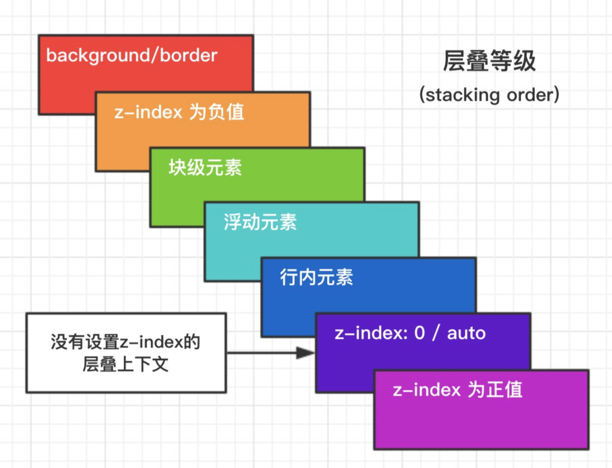

### 1 盒模型

> content（元素内容） + padding（内边距） + border（边框） + margin（外边距）

延伸：`box-sizing`

- `content-box`：默认值，总宽度 = `margin` \+ `border` \+ `padding` \+ `width`
- `border-box`：盒子宽度包含 `padding` 和 `border`，`总宽度 = margin + width`
- `inherit`：从父元素继承 `box-sizing` 属性

### 2 BFC

> 块级格式化上下文，是一个独立的渲染区域，让处于 `BFC` 内部的元素与外部的元素相互隔离，使内外元素的定位不会相互影响。

> IE 下为 `Layout`，可通过 `zoom:1` 触发

**触发条件:**

- 根元素
- `position: absolute/fixed`
- `display: inline-block / table`
- `float` 元素
- `ovevflow !== visible`

**规则:**

- 属于同一个 `BFC` 的两个相邻 `Box` 垂直排列
- 属于同一个 `BFC` 的两个相邻 `Box` 的 `margin` 会发生重叠
- `BFC` 中子元素的 `margin box` 的左边， 与包含块 (BFC) `border box`的左边相接触 (子元素 `absolute` 除外)
- `BFC` 的区域不会与 `float` 的元素区域重叠
- 计算 `BFC` 的高度时，浮动子元素也参与计算
- 文字层不会被浮动层覆盖，环绕于周围

**应用:**

- 阻止`margin`重叠
- 可以包含浮动元素 —— 清除内部浮动(清除浮动的原理是两个`div`都位于同一个 `BFC` 区域之中)
- 自适应两栏布局
- 可以阻止元素被浮动元素覆盖

### 3 层叠上下文

> 元素提升为一个比较特殊的图层，在三维空间中 (z 轴) 高出普通元素一等。

**触发条件**

- 根层叠上下文(`html`)
- `position`
- `css3`属性

  - `flex`
  - `transform`
  - `opacity`
  - `filter`
  - `will-change`
  - `webkit-overflow-scrolling`

**层叠等级：层叠上下文在 z 轴上的排序**

- 在同一层叠上下文中，层叠等级才有意义
- `z-index`的优先级最高

### 4 左右居中方案

- 行内元素: `text-align: center`
- 定宽块状元素: 左右 `margin` 值为 `auto`
- 不定宽块状元素: `table`布局，`position + transform`

  /_ 方案 1 _/
  .wrap {
  text-align: center
  }
  .center {
  display: inline;
  /_ or _/
  /_ display: inline-block; _/
  }
  /_ 方案 2 _/
  .center {
  width: 100px;
  margin: 0 auto;
  }
  /_ 方案 2 _/
  .wrap {
  position: relative;
  }
  .center {
  position: absulote;
  left: 50%;
  transform: translateX(-50%);
  }

### 5 上下垂直居中方案

- 定高：`margin`，`position + margin`(负值)
- 不定高：`position` \+ `transform`，`flex`，`IFC + vertical-align:middle`

  /_ 定高方案 1 _/
  .center {
  height: 100px;
  margin: 50px 0;  
  }
  /_ 定高方案 2 _/
  .center {
  height: 100px;
  position: absolute;
  top: 50%;
  margin-top: -25px;
  }
  /_ 不定高方案 1 _/
  .center {
  position: absolute;
  top: 50%;
  transform: translateY(-50%);
  }
  /_ 不定高方案 2 _/
  .wrap {
  display: flex;
  align-items: center;
  }
  .center {
  width: 100%;
  }
  /_ 不定高方案 3 _/
  /_ 设置 inline-block 则会在外层产生 IFC，高度设为 100% 撑开 wrap 的高度 _/
  .wrap::before {
  content: '';
  height: 100%;
  display: inline-block;
  vertical-align: middle;
  }
  .wrap {
  text-align: center;
  }
  .center {
  display: inline-block;  
   vertical-align: middle;
  }

### 6 选择器权重计算方式

> !important > 内联样式 = 外联样式 > ID 选择器 > 类选择器 = 伪类选择器 = 属性选择器 > 元素选择器 = 伪元素选择器 > 通配选择器 = 后代选择器 = 兄弟选择器

1.  属性后面加`!import`会覆盖页面内任何位置定义的元素样式
2.  作为`style`属性写在元素内的样式
3.  `id`选择器
4.  类选择器
5.  标签选择器
6.  通配符选择器（`*`）
7.  浏览器自定义或继承

**同一级别：后写的会覆盖先写的**

> css 选择器的解析原则：选择器定位 DOM 元素是从右往左的方向，这样可以尽早的过滤掉一些不必要的样式规则和元素

### 7 清除浮动

1.  在浮动元素后面添加 `clear:both`的空 `div` 元素

    

        

        

        

    

1.  给父元素添加 `overflow:hidden` 或者 `auto` 样式，触发`BFC`

    

        

        

    

    .container{
    width: 300px;
    background-color: #aaa;
    overflow:hidden;
    zoom:1; /_IE6_/
    }

1.  使用伪元素，也是在元素末尾添加一个点并带有 `clear: both` 属性的元素实现的。

    

        

        

    

    .clearfix{
    zoom: 1; /_IE6_/
    }
    .clearfix:after{
    content: ".";
    height: 0;
    clear: both;
    display: block;
    visibility: hidden;
    }

> 推荐使用第三种方法，不会在页面新增 div，文档结构更加清晰

### 8 左边定宽，右边自适应方案

> float + margin，float + calc

    /* 方案1 */
    .left {
      width: 120px;
      float: left;
    }
    .right {
      margin-left: 120px;
    }
    /* 方案2 */
    .left {
      width: 120px;
      float: left;
    }
    .right {
      width: calc(100% - 120px);
      float: left;
    }

### 9 左右两边定宽，中间自适应

> float，`float + calc`, 圣杯布局（设置 BFC，margin 负值法），flex

    .wrap {
      width: 100%;
      height: 200px;
    }
    .wrap > div {
      height: 100%;
    }
    /* 方案1 */
    .left {
      width: 120px;
      float: left;
    }
    .right {
      float: right;
      width: 120px;
    }
    .center {
      margin: 0 120px;
    }
    /* 方案2 */
    .left {
      width: 120px;
      float: left;
    }
    .right {
      float: right;
      width: 120px;
    }
    .center {
      width: calc(100% - 240px);
      margin-left: 120px;
    }
    /* 方案3 */
    .wrap {
      display: flex;
    }
    .left {
      width: 120px;
    }
    .right {
      width: 120px;
    }
    .center {
      flex: 1;
    }

### 10 CSS 动画和过渡

**animation / keyframes**

- `animation-name`: 动画名称，对应`@keyframes`
- `animation-duration`: 间隔
- `animation-timing-function`: 曲线
- `animation-delay`: 延迟
- `animation-iteration-count`: 次数

  - `infinite`: 循环动画

- `animation-direction`: 方向

  - `alternate`: 反向播放

- `animation-fill-mode`: 静止模式

  - `forwards`: 停止时，保留最后一帧
  - `backwards`: 停止时，回到第一帧
  - `both`: 同时运用 `forwards / backwards`

- 常用钩子: `animationend`

> 动画属性: 尽量使用动画属性进行动画，能拥有较好的性能表现

- `translate`
- `scale`
- `rotate`
- `skew`
- `opacity`
- `color`

**transform**

- 位移属性 `translate( x , y )`
- 旋转属性 `rotate()`
- 缩放属性 `scale()`
- 倾斜属性 `skew()`

**transition**

- `transition-property`（过渡的属性的名称）。
- `transition-duration`（定义过渡效果花费的时间,默认是 `0`）。
- `transition-timing-function:linear(匀速) ease`(慢速开始，然后变快，然后慢速结束)（规定过渡效果的时间曲线，最常用的是这两个）。
- `transition-delay`（规定过渡效果何时开始。默认是 0）

> 般情况下，我们都是写一起的，比如：`transition： width 2s ease 1s`

**关键帧动画 animation**

> 一个关键帧动画，最少包含两部分，animation 属性及属性值（动画的名称和运行方式运行时间等）。@keyframes（规定动画的具体实现过程）

**animation 属性可以拆分为**

- `animation-name` 规定@keyframes 动画的名称。
- `animation-duration` 规定动画完成一个周期所花费的秒或毫秒。默认是 `0`。
- `animation-timing-function` 规定动画的速度曲线。默认是 “ease”，常用的还有`linear`，同`transtion` 。
- `animation-delay` 规定动画何时开始。默认是 0。
- `animation-iteration-count` 规定动画被播放的次数。默认是 1，但我们一般用`infinite`，一直播放

> 而`@keyframes`的使用方法，可以是`from->to`（等同于 0%和 100%），也可以是从`0%->100%`之间任意个的分层设置。我们通过下面一个稍微复杂点的`demo`来看一下，基本上用到了上面说到的大部分知识

    eg:
       @keyframes mymove
      {
          from {top:0px;}
          to {top:200px;}
      }
    
    /* 等同于： */
    
    @keyframes mymove
    {
     0%   {top:0px;}
     25%  {top:200px;}
     50%  {top:100px;}
     75%  {top:200px;}
     100% {top:0px;}
    }

**用 css3 动画使一个图片旋转**

    #loader {
    
        display: block;
    
        position: relative;
    
        -webkit-animation: spin 2s linear infinite;
    
        animation: spin 2s linear infinite;
    
    }
    
    @-webkit-keyframes spin {
    
        0%   {
    
            -webkit-transform: rotate(0deg);
    
            -ms-transform: rotate(0deg);
    
            transform: rotate(0deg);
    
        }
    
        100% {
    
            -webkit-transform: rotate(360deg);
    
            -ms-transform: rotate(360deg);
    
            transform: rotate(360deg);
    
        }
    
    }
    
    @keyframes spin {
    
        0%   {
    
            -webkit-transform: rotate(0deg);
    
            -ms-transform: rotate(0deg);
    
            transform: rotate(0deg);
    
        }
    
        100% {
    
            -webkit-transform: rotate(360deg);
    
            -ms-transform: rotate(360deg);
    
            transform: rotate(360deg);
    
        }
    
    }

### 11 CSS3 的新特性

- `transition`：过渡
- `transform`: 旋转、缩放、移动或倾斜
- `animation`: 动画
- `gradient`: 渐变
- `box-shadow`: 阴影
- `border-radius`: 圆角
- `word-break`: `normal|break-all|keep-all`; 文字换行(默认规则|单词也可以换行|只在半角空格或连字符换行)
- `text-overflow`: 文字超出部分处理
- `text-shadow`: 水平阴影，垂直阴影，模糊的距离，以及阴影的颜色。
- `box-sizing`: `content-box|border-box` 盒模型
- 媒体查询 `@media screen and (max-width: 960px) {}`还有打印`print`

### 12 列举几个 css 中可继承和不可继承的元素

- 不可继承的：`display、margin、border、padding、background、height、min-height、max-height、width、min-width、max-width、overflow、position、left、right、top、bottom、z-index、float、clear、table-layout、vertical-align`
- 所有元素可继承：`visibility`和`cursor`。
- 内联元素可继承：`letter-spacing、word-spacing、white-space、line-height、color、font、font-family、font-size、font-style、font-variant、font-weight、text-decoration、text-transform、direction`。
- 终端块状元素可继承：`text-indent和text-align`。
- 列表元素可继承：`list-style、list-style-type、list-style-position、list-style-imag`e\`。

**transition 和 animation 的区别**

> `Animation`和`transition`大部分属性是相同的，他们都是随时间改变元素的属性值，他们的主要区别是`transition`需要触发一个事件才能改变属性，而`animation`不需要触发任何事件的情况下才会随时间改变属性值，并且`transition`为 2 帧，从`from .... to`，而`animation`可以一帧一帧的