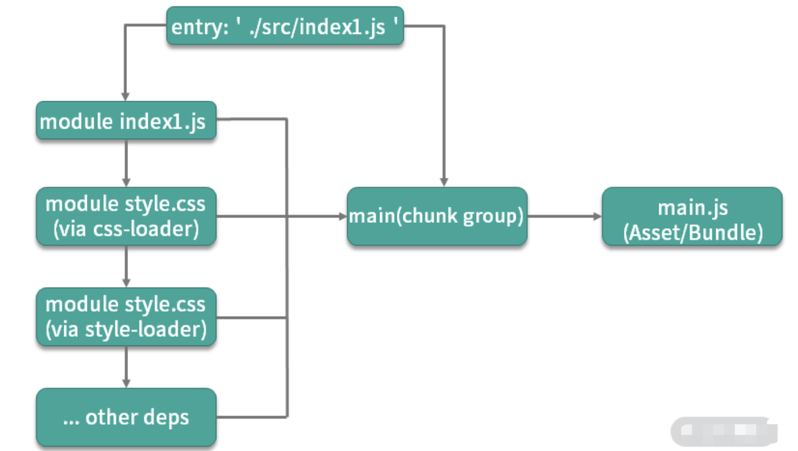

### 1 介绍一下 webpack 的构建流程

**核心概念**

- `entry`：入口。webpack 是基于模块的，使用 webpack 首先需要指定模块解析入口(entry)，webpack 从入口开始根据模块间依赖关系递归解析和处理所有资源文件。
- `output`：输出。源代码经过 webpack 处理之后的最终产物。
- `loader`：模块转换器。本质就是一个函数，在该函数中对接收到的内容进行转换，返回转换后的结果。因为 Webpack 只认识 JavaScript，所以 Loader 就成了翻译官，对其他类型的资源进行转译的预处理工作。
- `plugin`：扩展插件。基于事件流框架 `Tapable`，插件可以扩展 Webpack 的功能，在 Webpack 运行的生命周期中会广播出许多事件，Plugin 可以监听这些事件，在合适的时机通过 Webpack 提供的 API 改变输出结果。
- `module`：模块。除了 js 范畴内的`es module、commonJs、AMD`等，`css @import、url(...)`、图片、字体等在 webpack 中都被视为模块。

**解释几个 webpack 中的术语**

- `module`：指在模块化编程中我们把应用程序分割成的独立功能的代码模块
- `chunk`：指模块间按照引用关系组合成的代码块，一个 `chunk` 中可以包含多个 `module`
- `chunk group`：指通过配置入口点（`entry point`）区分的块组，一个 `chunk group` 中可包含一到多个 chunk
- `bundling`：webpack 打包的过程
- `asset/bundle`：打包产物

**webpack 的打包思想可以简化为 3 点：**

- 一切源代码文件均可通过各种 `Loader` 转换为 JS 模块 （`module`），模块之间可以互相引用。
- webpack 通过入口点（`entry point`）递归处理各模块引用关系，最后输出为一个或多个产物包 `js(bundle)` 文件。
- 每一个入口点都是一个块组（`chunk group`），在不考虑分包的情况下，一个 `chunk group` 中只有一个 `chunk`，该 chunk 包含递归分析后的所有模块。每一个 `chunk` 都有对应的一个打包后的输出文件（`asset/bundle`）



**打包流程**

1.  初始化参数：从配置文件和 Shell 语句中读取并合并参数，得出最终的配置参数。
2.  开始编译：从上一步得到的参数初始化 `Compiler` 对象，加载所有配置的插件，执行对象的 `run` 方法开始执行编译。
3.  确定入口：根据配置中的 `entry` 找出所有的入口文件。
4.  编译模块：从入口文件出发，调用所有配置的 `loader` 对模块进行翻译，再找出该模块依赖的模块，这个步骤是递归执行的，直至所有入口依赖的模块文件都经过本步骤的处理。
5.  完成模块编译：经过第 4 步使用 loader 翻译完所有模块后，得到了每个模块被翻译后的最终内容以及它们之间的依赖关系。
6.  输出资源：根据入口和模块之间的依赖关系，组装成一个个包含多个模块的 `chunk`，再把每个 `chunk` 转换成一个单独的文件加入到输出列表，这一步是可以修改输出内容的最后机会。
7.  输出完成：在确定好输出内容后，根据配置确定输出的路径和文件名，把文件内容写入到文件系统。


**简版**

- Webpack CLI 启动打包流程；
- 载入 Webpack 核心模块，创建 `Compiler` 对象；
- 使用 `Compiler` 对象开始编译整个项目；
- 从入口文件开始，解析模块依赖，形成依赖关系树；
- 递归依赖树，将每个模块交给对应的 Loader 处理；
- 合并 Loader 处理完的结果，将打包结果输出到 dist 目录。

> 在以上过程中，`Webpack 会在特定的时间点广播出特定的事件`，插件在监听到相关事件后会执行特定的逻辑，并且插件可以调用 Webpack 提供的 API 改变 Webpack 的运行结果

**构建流程核心概念：**

- `Tapable`：一个基于发布订阅的事件流工具类，`Compiler` 和 `Compilation` 对象都继承于 `Tapable`
- `Compiler`：compiler 对象是一个全局单例，他负责把控整个 webpack 打包的构建流程。在编译初始化阶段被创建的全局单例，包含完整配置信息、`loaders`、plugins 以及各种工具方法
- `Compilation`：代表一次 webpack 构建和生成编译资源的的过程，在`watch`模式下每一次文件变更触发的重新编译都会生成新的 `Compilation` 对象，包含了当前编译的模块 `module`, 编译生成的资源，变化的文件, 依赖的状态等
- 而每个模块间的依赖关系，则依赖于`AST`语法树。每个模块文件在通过 Loader 解析完成之后，会通过`acorn`库生成模块代码的 AST 语法树，通过语法树就可以分析这个模块是否还有依赖的模块，进而继续循环执行下一个模块的编译解析。

最终`Webpack`打包出来的`bundle`文件是一个`IIFE`的执行函数。

```js
// webpack 5 打包的bundle文件内容
(() => {
// webpackBootstrap
    var __webpack_modules__ = ({
        'file-A-path': ((modules) => { // ... })
            'index-file-path': ((__unused_webpack_module, __unused_webpack_exports, __webpack_require__) => {
                // ...
            })
        })
        // The module cache
        var __webpack_module_cache__ = {};
                               // The require function
                               function __webpack_require__(moduleId) {
        // Check if module is in cache
        var cachedModule = __webpack_module_cache__[moduleId];
        if (cachedModule !== undefined) {
            return cachedModule.exports;
        }
        // Create a new module (and put it into the cache)
        var module = __webpack_module_cache__[moduleId] = {
            // no module.id needed
            // no module.loaded needed
            exports: {}
        };
        // Execute the module function
        __webpack_modules__[moduleId](module, module.exports, __webpack_require__);
        // Return the exports of the module
        return module.exports;
    }
    // startup
    // Load entry module and return exports
    // This entry module can't be inlined because the eval devtool is used.
    var __webpack_exports__ = __webpack_require__("./src/index.js");
})
```


**webpack 详细工作流程**


### 2 介绍 Loader

**常用 Loader:**

- `file-loader`: 加载文件资源，如 字体 / 图片 等，具有移动/复制/命名等功能；
- `url-loader`: 通常用于加载图片，可以将小图片直接转换为 Date Url，减少请求；
- `babel-loader`: 加载 js / jsx 文件， 将 ES6 / ES7 代码转换成 ES5，抹平兼容性问题；
- `ts-loader`: 加载 ts / tsx 文件，编译 TypeScript；
- `style-loader`: 将 css 代码以`<style>`标签的形式插入到 html 中；
- `css-loader`: 分析@import 和 url()，引用 css 文件与对应的资源；
- `postcss-loader`: 用于 css 的兼容性处理，具有众多功能，例如 添加前缀，单位转换 等；
- `less-loader / sass-loader`: css 预处理器，在 css 中新增了许多语法，提高了开发效率；

**编写原则:**

- 单一原则: 每个 Loader 只做一件事；
- 链式调用: Webpack 会按顺序链式调用每个 Loader；
- 统一原则: 遵循 Webpack 制定的设计规则和结构，输入与输出均为字符串，各个 Loader 完全独立，即插即用；

### 3 介绍 plugin

> 插件系统是 Webpack 成功的一个关键性因素。在编译的整个生命周期中，Webpack 会触发许多事件钩子，Plugin 可以监听这些事件，根据需求在相应的时间点对打包内容进行定向的修改。

**一个最简单的 plugin 是这样的:**

```js
class Plugin {
  // 注册插件时，会调用 apply 方法
  // apply 方法接收 compiler 对象
  // 通过 compiler 上提供的 Api，可以对事件进行监听，执行相应的操作
  apply(compiler) {
    // compilation 是监听每次编译循环
    // 每次文件变化，都会生成新的 compilation 对象并触发该事件
    compiler.plugin('compilation', function (compilation) {})
  }
}
```

**注册插件:**

```js
// webpack.config.js
module.export = { plugins: [new Plugin(options)] }
```

​

**事件流机制:**

> Webpack 就像工厂中的一条产品流水线。原材料经过 Loader 与 Plugin 的一道道处理，最后输出结果。

- 通过链式调用，按顺序串起一个个 Loader；
- 通过事件流机制，让 Plugin 可以插入到整个生产过程中的每个步骤中；

> Webpack 事件流编程范式的核心是基础类 Tapable，是一种 观察者模式 的实现事件的订阅与广播：

```js
const { SyncHook } = require('tapable')
const hook = new SyncHook(['arg'])
// 订阅
hook.tap('event', (arg) => {
  // 'event-hook'
  console.log(arg)
})
// 广播
hook.call('event-hook')
```

​

> `Webpack` 中两个最重要的类 `Compiler` 与 `Compilation` 便是继承于 `Tapable`，也拥有这样的事件流机制。

- **Compiler**: 可以简单的理解为 Webpack 实例，它包含了当前 Webpack 中的所有配置信息，如 options， loaders, plugins 等信息，全局唯一，只在启动时完成初始化创建，随着生命周期逐一传递；
- `Compilation`: 可以称为 编译实例。当监听到文件发生改变时，Webpack 会创建一个新的 Compilation 对象，开始一次新的编译。它包含了当前的输入资源，输出资源，变化的文件等，同时通过它提供的 api，可以监听每次编译过程中触发的事件钩子；
- **区别:**

  - `Compiler` 全局唯一，且从启动生存到结束；
  - `Compilation`对应每次编译，每轮编译循环均会重新创建；

- **常用 Plugin:**

  - UglifyJsPlugin: 压缩、混淆代码；
  - CommonsChunkPlugin: 代码分割；
  - ProvidePlugin: 自动加载模块；
  - html-webpack-plugin: 加载 html 文件，并引入 css / js 文件；
  - extract-text-webpack-plugin / mini-css-extract-plugin: 抽离样式，生成 css 文件；DefinePlugin: 定义全局变量；
  - optimize-css-assets-webpack-plugin: CSS 代码去重；
  - webpack-bundle-analyzer: 代码分析；
  - compression-webpack-plugin: 使用 gzip 压缩 js 和 css；
  - happypack: 使用多进程，加速代码构建；
  - EnvironmentPlugin: 定义环境变量；

- 调用插件 `apply` 函数传入 `compiler` 对象
- 通过 `compiler` 对象监听事件

**loader 和 plugin 有什么区别？**

> webapck 默认只能打包 JS 和 JOSN 模块，要打包其它模块，需要借助 loader，loader 就可以让模块中的内容转化成 webpack 或其它 laoder 可以识别的内容。

- `loader`就是模块转换化，或叫加载器。不同的文件，需要不同的`loader`来处理。
- `plugin`是插件，可以参与到整个 webpack 打包的流程中，不同的插件，在合适的时机，可以做不同的事件。

**webpack 中都有哪些插件，这些插件有什么作用？**

- `html-webpack-plugin` 自动创建一个 HTML 文件，并把打包好的 JS 插入到 HTML 文件中
- `clean-webpack-plugin` 在每一次打包之前，删除整个输出文件夹下所有的内容
- `mini-css-extrcat-plugin` 抽离 CSS 代码，放到一个单独的文件中
- `optimize-css-assets-plugin` 压缩 css

### 4 webpack 热更新实现原理


**HMR 的基本流程图**


- 当修改了一个或多个文件；
- 文件系统接收更改并通知 `webpack`；
- `webpack` 重新编译构建一个或多个模块，并通知 HMR 服务器进行更新；
- `HMR Server` 使用 `webSocket` 通知 `HMR runtime` 需要更新，`HMR` 运行时通过 `HTTP` 请求更新 `jsonp`
- `HMR` 运行时替换更新中的模块，如果确定这些模块无法更新，则触发整个页面刷新

### 5 webpack 层面如何做性能优化

**优化前的准备工作**

- 准备基于时间的分析工具：我们需要一类插件，来帮助我们统计项目构建过程中在编译阶段的耗时情况。`speed-measure-webpack-plugin` 分析插件加载的时间
- 使用 `webpack-bundle-analyzer` 分析产物内容

**代码优化:**

> 无用代码消除，是许多编程语言都具有的优化手段，这个过程称为 DCE (dead code elimination)，即 删除不可能执行的代码；

例如我们的 `UglifyJs`，它就会帮我们在生产环境中删除不可能被执行的代码，例如:

```js
var fn = function () {
  return 1
  // 下面代码便属于 不可能执行的代码；
  // 通过 UglifyJs (Webpack4+ 已内置) 便会进行 DCE；
  var a = 1
  return a
}
```

​

> 摇树优化 (Tree-shaking)，这是一种形象比喻。我们把打包后的代码比喻成一棵树，这里其实表示的就是，通过工具 "摇" 我们打包后的 js 代码，将没有使用到的无用代码 "摇" 下来 (删除)。即 消除那些被 引用了但未被使用 的模块代码。

- 原理: 由于是在编译时优化，因此最基本的前提就是语法的静态分析，ES6 的模块机制 提供了这种可能性。不需要运行时，便可进行代码字面上的静态分析，确定相应的依赖关系。
- 问题: 具有 副作用 的函数无法被 `tree-shaking`

  - 在引用一些第三方库，需要去观察其引入的代码量是不是符合预期；
  - 尽量写纯函数，减少函数的副作用；
  - 可使用 `webpack-deep-scope-plugin`，可以进行作用域分析，减少此类情况的发生，但仍需要注意；

**code-spliting: 代码分割技术**，将代码分割成多份进行 懒加载 或 异步加载，避免打包成一份后导致体积过大，影响页面的首屏加载；

- `Webpack` 中使用 `SplitChunksPlugin` 进行拆分；
- 按 页面 拆分: 不同页面打包成不同的文件；
- 按 功能 拆分:

  - 将类似于播放器，计算库等大模块进行拆分后再懒加载引入；
  - 提取复用的业务代码，减少冗余代码；

- 按 文件修改频率 拆分: 将第三方库等不常修改的代码单独打包，而且不改变其文件 hash 值，能最大化运用浏览器的缓存；

**scope hoisting**: 作用域提升，将分散的模块划分到同一个作用域中，避免了代码的重复引入，有效减少打包后的代码体积和运行时的内存损耗；

**编译性能优化:**

- 升级至 最新 版本的 `webpack`，能有效提升编译性能；
- 使用 `dev-server` / 模块热替换 (`HMR`) 提升开发体验；

  - 监听文件变动 忽略 node_modules 目录能有效提高监听时的编译效率；

- 缩小编译范围

  - `modules`: 指定模块路径，减少递归搜索；
  - `mainFields`: 指定入口文件描述字段，减少搜索；
  - `noParse`: 避免对非模块化文件的加载；
  - `includes/exclude`: 指定搜索范围/排除不必要的搜索范围；
  - `alias`: 缓存目录，避免重复寻址；

- `babel-loader`

  - 忽略`node_moudles`，避免编译第三方库中已经被编译过的代码
  - 使用`cacheDirectory`，可以缓存编译结果，避免多次重复编译

- 多进程并发

  - `webpack-parallel-uglify-plugin`: 可多进程并发压缩 js 文件，提高压缩速度；
  - `HappyPack`: 多进程并发文件的 `Loader` 解析；

- 第三方库模块缓存:

  - `DLLPlugin` 和 `DLLReferencePlugin` 可以提前进行打包并缓存，避免每次都重新编译；

- 使用分析

  - `Webpack Analyse / webpack-bundle-analyzer` 对打包后的文件进行分析，寻找可优化的地方
  - 配置 profile：true，对各个编译阶段耗时进行监控，寻找耗时最多的地方

- `source-map`:

  - 开发: `cheap-module-eval-source-map`
  - 生产: `hidden-source-map`；

**优化 webpack 打包速度**

- 减少文件搜索范围

  - 比如通过别名
  - `loader` 的 `test`，`include & exclude`

- `Webpack4` 默认压缩并行
- `Happypack` 并发调用
- `babel` 也可以缓存编译
- `Resolve` 在构建时指定查找模块文件的规则
- 使用`DllPlugin`，不用每次都重新构建
- `externals` 和 `DllPlugin` 解决的是同一类问题：将依赖的框架等模块从构建过程中移除。它们的区别在于

  - 在 Webpack 的配置方面，`externals` 更简单，而 `DllPlugin` 需要独立的配置文件。
  - `DllPlugin` 包含了依赖包的独立构建流程，而 `externals` 配置中不包含依赖框架的生成方式，通常使用已传入 CDN 的依赖包
  - `externals` 配置的依赖包需要单独指定依赖模块的加载方式：全局对象、CommonJS、AMD 等
  - 在引用依赖包的子模块时，`DllPlugin` 无须更改，而 `externals` 则会将子模块打入项目包中

**优化打包体积**

- 提取第三方库或通过引用外部文件的方式引入第三方库
- 代码压缩插件`UglifyJsPlugin`
- 服务器启用`gzip`压缩
- 按需加载资源文件 `require.ensure`
- 优化`devtool`中的`source-map`
- 剥离`css`文件，单独打包
- 去除不必要插件，通常就是开发环境与生产环境用同一套配置文件导致
- `Tree Shaking` 在构建打包过程中，移除那些引入但未被使用的无效代码
- 开启 `scope hosting`

  - 体积更小
  - 创建函数作用域更小
  - 代码可读性更好


### 6 介绍一下 Tree Shaking

**对 tree-shaking 的了解**

**作用：**

它表示在打包的时候会去除一些无用的代码

**原理**：

- `ES6`的模块引入是静态分析的，所以在编译时能正确判断到底加载了哪些模块
- 分析程序流，判断哪些变量未被使用、引用，进而删除此代码

**特点：**

- 在生产模式下它是默认开启的，但是由于经过`babel`编译全部模块被封装成`IIFE`，它存在副作用无法被`tree-shaking`掉
- 可以在`package.json`中配置`sideEffects`来指定哪些文件是有副作用的。它有两种值，一个是布尔类型，如果是`false`则表示所有文件都没有副作用；如果是一个数组的话，数组里的文件路径表示改文件有副作用
- `rollup`和`webpack`中对`tree-shaking`的层度不同，例如对`babel`转译后的`class`，如果`babel`的转译是宽松模式下的话(也就是`loose`为`true`)，`webpack`依旧会认为它有副作用不会`tree-shaking`掉，而`rollup`会。这是因为`rollup`有程序流分析的功能，可以更好的判断代码是否真正会产生副作用。

**原理**

- `ES6 Module` 引入进行静态分析，故而编译的时候正确判断到底加载了那些模块
- 静态分析程序流，判断那些模块和变量未被使用或者引用，进而删除对应代码

> 依赖于`import/export`

通过导入所有的包后再进行条件获取。如下：

```js
import foo from 'foo'
import bar from 'bar'
if (condition) {
  // foo.xxxx
} else {
  // bar.xxx
}
```

​

> ES6 的 import 语法完美可以使用 tree shaking，因为可以在代码不运行的情况下就能分析出不需要的代码

**CommonJS 的动态特性模块意味着 tree shaking 不适用**。因为它是不可能确定哪些模块实际运行之前是需要的或者是不需要的。在 ES6 中，进入了完全静态的导入语法：import。这也意味着下面的导入是不可行的：

```js
// 不可行，ES6 的import是完全静态的
if (condition) {
  myDynamicModule = require('foo')
} else {
  myDynamicModule = require('bar')
}
```

### 7 介绍一下 webpack scope hosting

> 作用域提升，将分散的模块划分到同一个作用域中，避免了代码的重复引入，有效减少打包后的代码体积和运行时的内存损耗；

### 8 Webpack Proxy 工作原理？为什么能解决跨域

**1. 是什么**

`webpack proxy`，即`webpack`提供的代理服务

基本行为就是接收客户端发送的请求后转发给其他服务器

其目的是为了便于开发者在开发模式下解决跨域问题（浏览器安全策略限制）

想要实现代理首先需要一个中间服务器，`webpack`中提供服务器的工具为`webpack-dev-server`

**2. webpack-dev-server**

`webpack-dev-server`是 `webpack` 官方推出的一款开发工具，将自动编译和自动刷新浏览器等一系列对开发友好的功能全部集成在了一起

目的是为了提高开发者日常的开发效率，「只适用在开发阶段」

关于配置方面，在`webpack`配置对象属性中通过`devServer`属性提供，如下：

```js
// ./webpack.config.js
const path = require('path')
module.exports = {
  // ...
  devServer: {
    contentBase: path.join(__dirname, 'dist'),
    compress: true,
    port: 9000,
    proxy: {
      '/api': {
        target: 'https://api.github.com',
      },
    },
    // ...
  },
}
```

​

`devServetr`里面`proxy`则是关于代理的配置，该属性为对象的形式，对象中每一个属性就是一个代理的规则匹配

属性的名称是需要被代理的请求路径前缀，一般为了辨别都会设置前缀为`/api`，值为对应的代理匹配规则，对应如下：

- `target`：表示的是代理到的目标地址
- `pathRewrite`：默认情况下，我们的 `/api-hy` 也会被写入到 URL 中，如果希望删除，可以使用`pathRewrite`
- `secure`：默认情况下不接收转发到`https`的服务器上，如果希望支持，可以设置为`false`
- `changeOrigin`：它表示是否更新代理后请求的 `headers` 中`host`地址

**2. 工作原理**

> `proxy`工作原理实质上是利用`http-proxy-middleware` 这个`http`代理中间件，实现请求转发给其他服务器

举个例子：

在开发阶段，本地地址为`http://localhost:3000`，该浏览器发送一个前缀带有`/api`标识的请求到服务端获取数据，但响应这个请求的服务器只是将请求转发到另一台服务器中

```js
const express = require('express')
const proxy = require('http-proxy-middleware')
const app = express()
app.use('/api', proxy({ target: 'http://www.example.org', changeOrigin: true }))
app.listen(3000) // http://localhost:3000/api/foo/bar -> http://www.example.org/api/foo/bar
```

**3. 跨域**

> 在开发阶段， `webpack-dev-server` 会启动一个本地开发服务器，所以我们的应用在开发阶段是独立运行在 `localhost`的一个端口上，而后端服务又是运行在另外一个地址上

所以在开发阶段中，由于浏览器同源策略的原因，当本地访问后端就会出现跨域请求的问题

通过设置`webpack proxy`实现代理请求后，相当于浏览器与服务端中添加一个代理者

当本地发送请求的时候，代理服务器响应该请求，并将请求转发到目标服务器，目标服务器响应数据后再将数据返回给代理服务器，最终再由代理服务器将数据响应给本地


在代理服务器传递数据给本地浏览器的过程中，两者同源，并不存在跨域行为，这时候浏览器就能正常接收数据

> 注意：`「服务器与服务器之间请求数据并不会存在跨域行为，跨域行为是浏览器安全策略限制」`

### 9 介绍一下 babel 原理

> `babel` 的编译过程分为三个阶段：**parsing**、**transforming**、**generating**，以 ES6 编译为 ES5 作为例子：

1.  `ES6` 代码输入；
2.  `babylon` 进行解析得到 AST；
3.  `plugin` 用 `babel-traverse` 对 `AST`树进行遍历编译，得到新的 `AST`树；
4.  用 `babel-generator` 通过 `AST`树生成 `ES5` 代码。

[Babel 原理及其使用(opens new window)][babel_opens new window]

### 10 介绍一下 Rollup

> Rollup 是一款 ES Modules 打包器。它也可以将项目中散落的细小模块打包为整块代码，从而使得这些划分的模块可以更好地运行在浏览器环境或者 Node.js 环境。

**Rollup 优势：**

- 输出结果更加扁平，执行效率更高；
- 自动移除未引用代码；
- 打包结果依然完全可读。

**缺点**

- 加载非 ESM 的第三方模块比较复杂；
- 因为模块最终都被打包到全局中，所以无法实现 `HMR`；
- 浏览器环境中，代码拆分功能必须使用 `Require.js` 这样的 `AMD` 库

> - 我们发现如果我们开发的是一个应用程序，需要大量引用第三方模块，同时还需要 HMR 提升开发体验，而且应用过大就必须要分包。那这些需求 Rollup 都无法满足。
> - 如果我们是开发一个 JavaScript 框架或者库，那这些优点就特别有必要，而缺点呢几乎也都可以忽略，所以在很多像 React 或者 Vue 之类的框架中都是使用的 Rollup 作为模块打包器，而并非 Webpack

**总结一下**：`Webpack 大而全，Rollup 小而美`。

在对它们的选择上，我的基本原则是：`应用开发使用 Webpack，类库或者框架开发使用 Rollup`。

不过这并不是绝对的标准，只是经验法则。因为 Rollup 也可用于构建绝大多数应用程序，而 Webpack 同样也可以构建类库或者框架。


