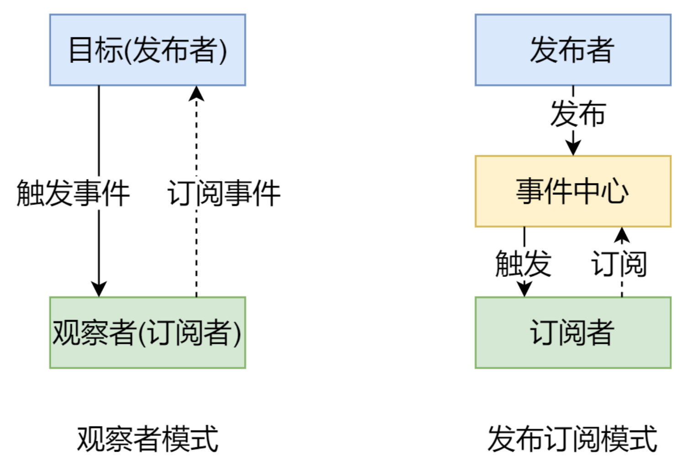
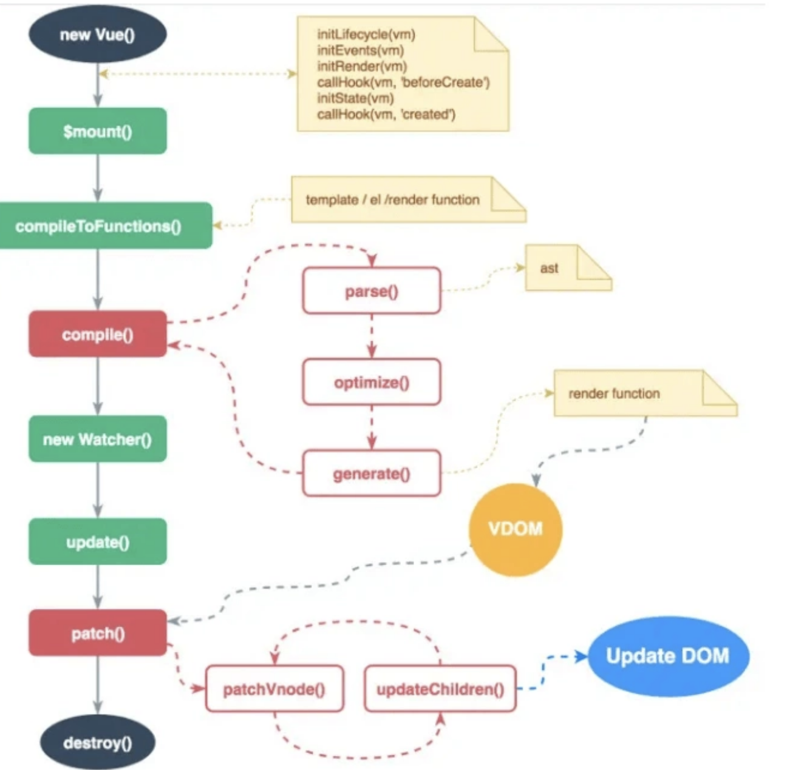

### 1 Vue 响应式原理

> Vue 的响应式原理是核心是通过 ES5 的保护对象的 `Object.defindeProperty` 中的访问器属性中的 get 和 set 方法，data 中声明的属性都被添加了访问器属性，当读取 data 中的数据时自动调用 get 方法，当修改 data 中的数据时，自动调用 set 方法，检测到数据的变化，会通知观察者 Wacher，观察者 Wacher 自动触发重新 render 当前组件（子组件不会重新渲染）,生成新的虚拟 DOM 树，Vue 框架会遍历并对比新虚拟 DOM 树和旧虚拟 DOM 树中每个节点的差别，并记录下来，最后，加载操作，将所有记录的不同点，局部修改到真实 DOM 树上。

- 虚拟 DOM (Virtaul DOM): 用 js 对象模拟的，保存当前视图内所有 DOM 节点对象基本描述属性和节点间关系的树结构。用 js 对象，描述每个节点，及其父子关系，形成虚拟 DOM 对象树结构。
- 因为只要在 `data` 中声明的基本数据类型的数据，基本不存在数据不响应问题，所以重点介绍数组和对象在`vue`中的数据响应问题，vue 可以检测对象属性的修改，但无法监听数组的所有变动及对象的新增和删除，只能使用数组变异方法及`$set`方法。

> 可以看到，`arrayMethods` 首先继承了 `Array`，然后对数组中所有能改变数组自身的方法，如 `push`、`pop` 等这些方法进行重写。重写后的方法会先执行它们本身原有的逻辑，并对能增加数组长度的 3 个方法 `push`、`unshift`、`splice` 方法做了判断，获取到插入的值，然后把新添加的值变成一个响应式对象，并且再调用 `ob.dep.notify()` 手动触发依赖通知，这就很好地解释了用 `vm.items.splice`(`newLength`) 方法可以检测到变化

> 总结：Vue 采用数据劫持结合发布—订阅模式的方法，通过 `Object.defineProperty()` 来劫持各个属性的 setter，getter，在数据变动时发布消息给订阅者，触发相应的监听回调。

- `Observer` 遍历数据对象，给所有属性加上 `setter` 和 `getter`，监听数据的变化
- `compile` 解析模板指令，将模板中的变量替换成数据，然后初始化渲染页面视图，并将每个指令对应的节点绑定更新函数，添加监听数据的订阅者，一旦数据有变动，收到通知，更新视图

> `Watcher` 订阅者是 `Observer` 和 `Compile` 之间通信的桥梁，主要做的事情

- 在自身实例化时往属性订阅器 (`dep`) 里面添加自己
- 待属性变动 `dep.notice()` 通知时，调用自身的 `update()` 方法，并触发 `Compile` 中绑定的回调

**Object.defineProperty()**，那么它的用法是什么，以及优缺点是什么呢？

- 可以检测对象中数据发生的修改
- 对于复杂的对象，层级很深的话，是不友好的，需要经行深度监听，这样子就需要递归到底，这也是它的缺点。
- 对于一个对象中，如果你新增加属性，删除属性，\*\*Object.defineProperty()\*\*是不能观测到的，那么应该如何解决呢？可以通过`Vue.set()`和`Vue.delete()`来实现。

  // 模拟 Vue 中的 data 选项
  let data = {
  msg: 'hello'
  }
  // 模拟 Vue 的实例
  let vm = {}
  // 数据劫持:当访问或者设置 vm 中的成员的时候，做一些干预操作
  Object.defineProperty(vm, 'msg', {
  // 可枚举(可遍历)
  enumerable: true,
  // 可配置(可以使用 delete 删除，可以通过 defineProperty 重新定义)
  configurable: true,
  // 当获取值的时候执行
  get () {
  console.log('get: ', data.msg)
  return data.msg
  },
  // 当设置值的时候执行
  set (newValue) {
  console.log('set: ', newValue)
  if (newValue === data.msg) {
  return
  }
  data.msg = newValue
  // 数据更改，更新 DOM 的值
  document.querySelector('#app').textContent = data.msg
  }
  })

  // 测试
  vm.msg = 'Hello World'
  console.log(vm.msg)

**Vue3.x 响应式数据原理**

> `Vue3.x`改用`Proxy`替代`Object.defineProperty`。因为`Proxy`可以直接监听`对象和数组`的变化，并且有多达 13 种拦截方法。并且作为新标准将受到浏览器厂商重点持续的性能优化。

`Proxy`只会代理对象的第一层，那么`Vue3`又是怎样处理这个问题的呢？

> 判断当前`Reflect.get的`返回值是否为`Object`，如果是则再通过`reactive`方法做代理， 这样就实现了深度观测。

**监测数组的时候可能触发多次 get/set，那么如何防止触发多次呢？**

> 我们可以判断`key`是否为当前被代理对象`target`自身属性，也可以判断旧值与新值是否相等，只有满足以上两个条件之一时，才有可能执行`trigger`

    // 模拟 Vue 中的 data 选项
    let data = {
      msg: 'hello',
      count: 0
    }
    // 模拟 Vue 实例
    let vm = new Proxy(data, {
      // 当访问 vm 的成员会执行
      get (target, key) {
        console.log('get, key: ', key, target[key])
        return target[key]
      },
      // 当设置 vm 的成员会执行
      set (target, key, newValue) {
        console.log('set, key: ', key, newValue)
        if (target[key] === newValue) {
          return
        }
        target[key] = newValue
        document.querySelector('#app').textContent = target[key]
      }
    })

    // 测试
    vm.msg = 'Hello World'
    console.log(vm.msg)

**Proxy 相比于 defineProperty 的优势**

- 数组变化也能监听到
- 不需要深度遍历监听

> `Proxy` 是 `ES6` 中新增的功能，可以用来自定义对象中的操作

    let p = new Proxy(target, handler);
    // `target` 代表需要添加代理的对象
    // `handler` 用来自定义对象中的操作
    // 可以很方便的使用 Proxy 来实现一个数据绑定和监听

    let onWatch = (obj, setBind, getLogger) => {
      let handler = {
        get(target, property, receiver) {
          getLogger(target, property)
          return Reflect.get(target, property, receiver);
        },
        set(target, property, value, receiver) {
          setBind(value);
          return Reflect.set(target, property, value);
        }
      };
      return new Proxy(obj, handler);
    };

    let obj = { a: 1 }
    let value
    let p = onWatch(obj, (v) => {
      value = v
    }, (target, property) => {
      console.log(`Get '${property}' = ${target[property]}`);
    })
    p.a = 2 // bind `value` to `2`
    p.a // -> Get 'a' = 2

**总结**

- Vue

  - 记录传入的选项，设置 `$data/$el`
  - 把 `data` 的成员注入到 `Vue` 实例
  - 负责调用 `Observer` 实现数据响应式处理(数据劫持)
  - 负责调用 `Compiler` 编译指令/插值表达式等

- `Observer`

  - 数据劫持

    - 负责把 `data` 中的成员转换成 `getter/setter`
    - 负责把多层属性转换成 `getter/setter`
    - 如果给属性赋值为新对象，把新对象的成员设置为 `getter/setter`

  - 添加 `Dep` 和 `Watcher` 的依赖关系
  - 数据变化发送通知

- `Compiler`

  - 负责编译模板，解析指令/插值表达式
  - 负责页面的首次渲染过程
  - 当数据变化后重新渲染

- `Dep`

  - 收集依赖，添加订阅者(`watcher`)
  - 通知所有订阅者

- `Watcher`

  - 自身实例化的时候往`dep`对象中添加自己
  - 当数据变化`dep`通知所有的 `Watcher` 实例更新视图

### 2 发布订阅模式和观察者模式

**1. 发布/订阅模式**

- **发布/订阅模式**

  - 订阅者
  - 发布者
  - 信号中心

> 我们假定，存在一个"信号中心"，某个任务执行完成，就向信号中心"发布"(publish)一个信 号，其他任务可以向信号中心"订阅"(subscribe)这个信号，从而知道什么时候自己可以开始执 行。这就叫做"发布/订阅模式"(publish-subscribe pattern)

> Vue 的自定义事件

    let vm = new Vue()
    vm.$on('dataChange', () => { console.log('dataChange')})
    vm.$on('dataChange', () => {
      console.log('dataChange1')
    })
    vm.$emit('dataChange')

兄弟组件通信过程

    // eventBus.js
    // 事件中心
    let eventHub = new Vue()

    // ComponentA.vue
    // 发布者
    addTodo: function () {
      // 发布消息(事件)
      eventHub.$emit('add-todo', { text: this.newTodoText })
      this.newTodoText = ''
    }
    // ComponentB.vue
    // 订阅者
    created: function () {
      // 订阅消息(事件)
      eventHub.$on('add-todo', this.addTodo)
    }

> 模拟 Vue 自定义事件的实现

    class EventEmitter {
      constructor(){
        // { eventType: [ handler1, handler2 ] }
        this.subs = {}
      }
      // 订阅通知
      $on(eventType, fn) {
        this.subs[eventType] = this.subs[eventType] || []
        this.subs[eventType].push(fn)
      }
      // 发布通知
      $emit(eventType) {
        if(this.subs[eventType]) {
          this.subs[eventType].forEach(v=>v())
        }
      }
    }

    // 测试
    var bus = new EventEmitter()

    // 注册事件
    bus.$on('click', function () {
      console.log('click')
    })

    bus.$on('click', function () {
      console.log('click1')
    })

    // 触发事件
    bus.$emit('click')

**2. 观察者模式**

- 观察者(订阅者) -- `Watcher`

  - `update()`:当事件发生时，具体要做的事情

- 目标(发布者) -- `Dep`

  - `subs` 数组:存储所有的观察者
  - `addSub()`:添加观察者
  - `notify()`:当事件发生，调用所有观察者的 `update()` 方法

- 没有事件中心

  // 目标(发布者)
  // Dependency
  class Dep {
  constructor () {
  // 存储所有的观察者
  this.subs = []
  }
  // 添加观察者
  addSub (sub) {
  if (sub && sub.update) {
  this.subs.push(sub)
  }
  }
  // 通知所有观察者
  notify () {
  this.subs.forEach(sub => sub.update())
  }
  }

  // 观察者(订阅者)
  class Watcher {
  update () {
  console.log('update')
  }
  }

  // 测试
  let dep = new Dep()
  let watcher = new Watcher()
  dep.addSub(watcher)
  dep.notify()

**3. 总结**

- **观察者模式**是由具体目标调度，比如当事件触发，`Dep` 就会去调用观察者的方法，所以观察者模 式的订阅者与发布者之间是存在依赖的
- **发布/订阅模式**由统一调度中心调用，因此发布者和订阅者不需要知道对方的存在

### 3 为什么使用 Virtual DOM

- 手动操作 `DOM` 比较麻烦，还需要考虑浏览器兼容性问题，虽然有 `jQuery` 等库简化 `DOM` 操作，但是随着项目的复杂 DOM 操作复杂提升
- 为了简化 `DOM` 的复杂操作于是出现了各种 `MVVM` 框架，`MVVM` 框架解决了视图和状态的同步问题
- 为了简化视图的操作我们可以使用模板引擎，但是模板引擎没有解决跟踪状态变化的问题，于是`Virtual DOM` 出现了
- `Virtual DOM` 的好处是当状态改变时不需要立即更新 DOM，只需要创建一个虚拟树来描述`DOM`，`Virtual DOM` 内部将弄清楚如何有效(`diff`)的更新 `DOM`
- 虚拟 `DOM` 可以维护程序的状态，跟踪上一次的状态
- 通过比较前后两次状态的差异更新真实 `DOM`

**虚拟 DOM 的作用**

- 维护视图和状态的关系
- 复杂视图情况下提升渲染性能
- 除了渲染 `DOM` 以外，还可以实现 `SSR(Nuxt.js/Next.js)`、原生应用(`Weex/React Native`)、小程序(`mpvue/uni-app`)等

### 4 VDOM：三个 part

- 虚拟节点类，将真实 `DOM`节点用 `js` 对象的形式进行展示，并提供 `render` 方法，将虚拟节点渲染成真实 `DOM`
- 节点 `diff` 比较：对虚拟节点进行 `js` 层面的计算，并将不同的操作都记录到 `patch` 对象
- `re-render`：解析 `patch` 对象，进行 `re-render`

**补充 1��VDOM 的必要性？**

- **创建真实 DOM 的代价高**：真实的 `DOM` 节点 `node` 实现的属性很多，而 `vnode` 仅仅实现一些必要的属性，相比起来，创建一个 `vnode` 的成本比较低。
- **触发多次浏览器重绘及回流**：使用 `vnode` ，相当于加了一个缓冲，让一次数据变动所带来的所有 `node` 变化，先在 `vnode` 中进行修改，然后 `diff` 之后对所有产生差异的节点集中一次对 `DOM tree` 进行修改，以减少浏览器的重绘及回流。

**补充 2：vue 为什么采用 vdom？**

> 引入 `Virtual DOM` 在性能方面的考量仅仅是一方面。

- 性能受场景的影响是非常大的，不同的场景可能造成不同实现方案之间成倍的性能差距，所以依赖细粒度绑定及 `Virtual DOM` 哪个的性能更好还真不是一个容易下定论的问题。
- `Vue` 之所以引入了 `Virtual DOM`，更重要的原因是为了解耦 `HTML`依赖，这带来两个非常重要的好处是：

> - 不再依赖 `HTML` 解析器进行模版解析，可以进行更多的 `AOT` 工作提高运行时效率：通过模版 `AOT` 编译，`Vue` 的运行时体积可以进一步压缩，运行时效率可以进一步提升；
> - 可以渲染到 `DOM` 以外的平台，实现 `SSR`、同构渲染这些高级特性，`Weex`等框架应用的就是这一特性。

> 综上，`Virtual DOM` 在性能上的收益并不是最主要的，更重要的是它使得 `Vue` 具备了现代框架应有的高级特性。

### 5 vue 和 react 技术选型

**相同点：**

1.  数据驱动页面，提供响应式的试图组件
2.  都有 virtual DOM,组件化的开发，通过 props 参数进行父子之间组件传递数据，都实现了 webComponents 规范
3.  数据流动单向，都支持服务器的渲染 SSR
4.  都有支持 native 的方法，react 有 React native， vue 有 wexx

**不同点：**

1.  数据绑定：Vue 实现了双向的数据绑定，react 数据流动是单向的
2.  数据渲染：大规模的数据渲染，react 更快
3.  使用场景：React 配合 Redux 架构适合大规模多人协作复杂项目，Vue 适合小快的项目
4.  开发风格：react 推荐做法 jsx + inline style 把 html 和 css 都写在 js 了

> vue 是采用 webpack +vue-loader 单文件组件格式，html, js, css 同一个文件

### 6 nextTick

> `nextTick` 可以让我们在下次 `DOM` 更新循环结束之后执行延迟回调，用于获得更新后的 `DOM`

`nextTick`主要使用了宏任务和微任务。根据执行环境分别尝试采用

- `Promise`
- `MutationObserver`
- `setImmediate`
- 如果以上都不行则采用`setTimeout`

> 定义了一个异步方法，多次调用`nextTick`会将方法存入队列中，通过这个异步方法清空当前队列

### 7 生命周期

**_init_**

- `initLifecycle/Event`，往 vm 上挂载各种属性
- `callHook: beforeCreated`: 实例刚创建
- `initInjection/initState`: 初始化注入和 `data` 响应性
- `created: 创建完成，属性已经绑定， 但还未生成真实`dom\`
- 进行元素的挂载： `$el / vm.$mount()`
- 是否有`template`: 解析成 `render function`

  - `*.vue`文件: `vue-loader`会将`<template>`编译成`render function`

- `beforeMount`: 模板编译/挂载之前
- 执行`render function`，生成真实的`dom`，并替换到`dom tree`中
- `mounted`: 组件已挂载

**update**

- 执行`diff`算法，比对改变是否需要触发`UI`更新
- `flushScheduleQueue`
- `watcher.before`: 触发`beforeUpdate`钩子 - `watcher.run()`: 执行`watcher`中的 `notify`，通知所有依赖项更新 UI
- 触发`updated`钩子: 组件已更新
- `actived / deactivated(keep-alive)`: 不销毁，缓存，组件激活与失活
- `destroy`

  - `beforeDestroy`: 销毁开始
  - 销毁自身且递归销毁子组件以及事件监听

    - `remove()`: 删除节点
    - `watcher.teardown()`: 清空依赖
    - `vm.$off()`: 解绑监听

  - `destroyed`: 完成后触发钩子

<table> 
 <thead> 
  <tr> 
   <th style="text-align:left;">Vue2</th> 
   <th style="text-align:left;">Vue3</th> 
  </tr> 
 </thead> 
 <tbody> 
  <tr> 
   <td style="text-align:left;"><code>beforeCreate</code></td> 
   <td style="text-align:left;">❌<code>setup</code>(替代)</td> 
  </tr> 
  <tr> 
   <td style="text-align:left;"><code>created</code></td> 
   <td style="text-align:left;">❌<code>setup</code>(替代)</td> 
  </tr> 
  <tr> 
   <td style="text-align:left;"><code>beforeMount</code></td> 
   <td style="text-align:left;"><code>onBeforeMount</code></td> 
  </tr> 
  <tr> 
   <td style="text-align:left;"><code>mounted</code></td> 
   <td style="text-align:left;"><code>onMounted</code></td> 
  </tr> 
  <tr> 
   <td style="text-align:left;"><code>beforeUpdate</code></td> 
   <td style="text-align:left;"><code>onBeforeUpdate</code></td> 
  </tr> 
  <tr> 
   <td style="text-align:left;"><code>updated</code></td> 
   <td style="text-align:left;"><code>nUpdated</code></td> 
  </tr> 
  <tr> 
   <td style="text-align:left;"><code>beforeDestroy</code></td> 
   <td style="text-align:left;"><code>onBeforeUnmount</code></td> 
  </tr> 
  <tr> 
   <td style="text-align:left;"><code>destroyed</code></td> 
   <td style="text-align:left;"><code>onUnmounted</code></td> 
  </tr> 
  <tr> 
   <td style="text-align:left;"><code>errorCaptured</code></td> 
   <td style="text-align:left;"><code>onErrorCaptured</code></td> 
  </tr> 
  <tr> 
   <td style="text-align:left;">-</td> 
   <td style="text-align:left;">🎉<code>onRenderTracked</code></td> 
  </tr> 
  <tr> 
   <td style="text-align:left;">-</td> 
   <td style="text-align:left;">🎉<code>onRenderTriggered</code></td> 
  </tr> 
 </tbody> 
</table>

> 上面是 vue 的声明周期的简单梳理，接下来我们直接以代码的形式来完成 vue 的初始化

    new Vue({})

    // 初始化Vue实例
    function _init() {
    	 // 挂载属性
        initLifeCycle(vm)
        // 初始化事件系统，钩子函数等
        initEvent(vm)
        // 编译slot、vnode
        initRender(vm)
        // 触发钩子
        callHook(vm, 'beforeCreate')
        // 添加inject功能
        initInjection(vm)
        // 完成数据响应性 props/data/watch/computed/methods
        initState(vm)
        // 添加 provide 功能
        initProvide(vm)
        // 触发钩子
        callHook(vm, 'created')

    	 // 挂载节点
        if (vm.$options.el) {
            vm.$mount(vm.$options.el)
        }
    }

    // 挂载节点实现
    function mountComponent(vm) {
    	 // 获取 render function
        if (!this.options.render) {
            // template to render
            // Vue.compile = compileToFunctions
            let { render } = compileToFunctions()
            this.options.render = render
        }
        // 触发钩子
        callHook('beforeMounte')
        // 初始化观察者
        // render 渲染 vdom，
        vdom = vm.render()
        // update: 根据 diff 出的 patchs 挂载成真实的 dom
        vm._update(vdom)
        // 触发钩子
        callHook(vm, 'mounted')
    }

    // 更新节点实现
    funtion queueWatcher(watcher) {
    	nextTick(flushScheduleQueue)
    }

    // 清空队列
    function flushScheduleQueue() {
    	 // 遍历队列中所有修改
        for(){
    	    // beforeUpdate
            watcher.before()

            // 依赖局部更新节点
            watcher.update()
            callHook('updated')
        }
    }

    // 销毁实例实现
    Vue.prototype.$destory = function() {
    	 // 触发钩子
        callHook(vm, 'beforeDestory')
        // 自身及子节点
        remove()
        // 删除依赖
        watcher.teardown()
        // 删除监听
        vm.$off()
        // 触发钩子
        callHook(vm, 'destoryed')
    }

### 8 vue-router

**mode**

- `hash`
- `history`

**跳转**

- `this.$router.push()`
- `<router-link to=""></router-link>`

**占位**

    <router-view></router-view>

**vue-router 源码实现**

- 作为一个插件存在:实现`VueRouter`类和`install`方法
- 实现两个全局组件:`router-view`用于显示匹配组件内容，`router-link`用于跳转
- 监控`url`变化:监听`hashchange`或`popstate`事件
- 响应最新`url`:创建一个响应式的属性`current`，当它改变时获取对应组件并显示

  // 我们的插件：
  // 1.实现一个 Router 类并挂载期实例
  // 2.实现两个全局组件 router-link 和 router-view
  let Vue;

  class VueRouter {
  // 核心任务：
  // 1.监听 url 变化
  constructor(options) {
  this.$options = options;

      // 缓存path和route映射关系
      // 这样找组件更快
      this.routeMap = {}
      this.$options.routes.forEach(route => {
        this.routeMap[route.path] = route
      })

      // 数据响应式
      // 定义一个响应式的current，则如果他变了，那么使用它的组件会rerender
      Vue.util.defineReactive(this, 'current', '')

      // 请确保onHashChange中this指向当前实例
      window.addEventListener('hashchange', this.onHashChange.bind(this))
      window.addEventListener('load', this.onHashChange.bind(this))

  }

  onHashChange() {
  // console.log(window.location.hash);
  this.current = window.location.hash.slice(1) || '/'
  }
  }

  // 插件需要实现 install 方法
  // 接收一个参数，Vue 构造函数，主要用于数据响应式
  VueRouter.install = function (\_Vue) {
  // 保存 Vue 构造函数在 VueRouter 中使用
  Vue = \_Vue

  // 任务 1：使用混入来做 router 挂载这件事情
  Vue.mixin({
  beforeCreate() {
  // 只有根实例才有 router 选项
  if (this.$options.router) {
            Vue.prototype.$router = this.$options.router
  }

      }

  })

  // 任务 2：实现两个全局组件
  // router-link: 生成一个 a 标签，在 url 后面添加#
  // <a href="#/about">aaaa</a>
  // <router-link to="/about">aaa</router-link>
  Vue.component('router-link', {
  props: {
  to: {
  type: String,
  required: true
  },
  },
  render(h) {
  // h(tag, props, children)
  return h('a',
  { attrs: { href: '#' + this.to } },
  this.$slots.default
          )
          // 使用jsx
          // return <a href={'#'+this.to}>{this.$slots.default}</a>
  }
  })
  Vue.component('router-view', {
  render(h) {
  // 根据 current 获取组件并 render
  // current 怎么获取?
  // console.log('render',this.$router.current);
          // 获取要渲染的组件
          let component = null
          const { routeMap, current } = this.$router
  if (routeMap[current]) {
  component = routeMap[current].component
  }
  return h(component)
  }
  })
  }

  export default VueRouter

### 9 vuex

> Vuex 集中式存储管理应用的所有组件的状态，并以相应的规则保证状态以可预测的方式发生变化

**核心概念**

- `state`: 状态中心
- `mutations`: 更改状态
- `actions`: 异步更改状态
- `getters`: 获取状态
- `modules`: 将`state`分成多个`modules`，便于管理

1.  状态 **- state**

state 保存应用状态

    export default new Vuex.Store({ state: { counter:0 },})

1.  状态变更 **- mutations**

> `mutations`用于修改状态，`store.js`

    export default new Vuex.Store({
        mutations:
        {
          add(state) {
            state.counter++
          }
        }
      })

1.  派生状态 **- getters**

> 从 state 派生出新状态，类似计算属性

    export default new Vuex.Store({
        getters:
        {
          doubleCounter(state) { // 计算剩余数量 return state.counter * 2;
          }
        }
      })

1.  动作 **- actions**

加业务逻辑，类似于`controller`

    export default new Vuex.Store({
        actions:
        {
          add({ commit }) {
            setTimeout(() = >{}
          }
        })

测试代码:

    
counter: {{$store.state.counter}}

    
async counter: {{$store.state.counter}}

    
double:{{$store.getters.doubleCounter}}

**vuex 原理解析**

- 实现一个插件:声明`Store`类，挂载`$store`
- `Store`具体实现:

  - 创建响应式的`state`，保存`mutations`、`actions`和`getters`
  - 实现`commit`根据用户传入`type`执行对应`mutation`
  - 实现`dispatch`根据用户传入`type`执行对应`action`，同时传递上下文
  - 实现`getters`，按照`getters`定义对`state`做派生

  // 目标 1：实现 Store 类，管理 state（响应式的），commit 方法和 dispatch 方法
  // 目标 2：封装一个插件，使用更容易使用
  let Vue;

  class Store {
  constructor(options) {
  // 定义响应式的 state
  // this.$store.state.xx
        // 借鸡生蛋
        this._vm = new Vue({
          data: {
            $$state: options.state
  }
  })

      this._mutations = options.mutations
      this._actions = options.actions

      // 绑定this指向
      this.commit = this.commit.bind(this)
      this.dispatch = this.dispatch.bind(this)

  }

  // 只读
  get state() {
  return this.\_vm.\_data.$$state
  }

  set state(val) {
  console.error('不能直接赋值呀，请换别的方式！！天王盖地虎！！');

  }

  // 实现 commit 方法，可以修改 state
  commit(type, payload) {
  // 拿出 mutations 中的处理函数执行它
  const entry = this.\_mutations[type]
  if (!entry) {
  console.error('未知 mutaion 类型');
  return
  }

      entry(this.state, payload)

  }

  dispatch(type, payload) {
  const entry = this.\_actions[type]

      if (!entry) {
        console.error('未知action类型');
        return
      }

      // 上下文可以传递当前store实例进去即可
      entry(this, payload)

  }
  }

  function install(\_Vue){
  Vue = \_Vue

  // 混入 store 实例
  Vue.mixin({
  beforeCreate() {
  if (this.$options.store) {
            Vue.prototype.$store = this.$options.store
  }
  }
  })
  }

  // { Store, install }相当于 Vuex
  // 它必须实现 install 方法
  export default { Store, install }

### 10 vue3 带来的新特性/亮点

**1. 压缩包体积更小**

> 当前最小化并被压缩的 Vue 运行时大小约为 20kB（2.6.10 版为 22.8kB）。Vue 3.0 捆绑包的大小大约会减少一半，即只有 10kB！

**2. Object.defineProperty -> Proxy**

- `Object.defineProperty`是一个相对比较昂贵的操作，因为它直接操作对象的属性，颗粒度比较小。将它替换为 es6 的`Proxy`，在目标对象之上架了一层拦截，代理的是对象而不是对象的属性。这样可以将原本对对象属性的操作变为对整个对象的操作，颗粒度变大。
- javascript 引擎在解析的时候希望对象的结构越稳定越好，如果对象一直在变，可优化性降低，proxy 不需要对原始对象做太多操作。

**3. Virtual DOM 重构**

> vdom 的本质是一个抽象层，用 javascript 描述界面渲染成什么样子。react 用 jsx，没办法检测出可以优化的动态代码，所以做时间分片，vue 中足够快的话可以不用时间分片

- **传统 vdom 的性能瓶颈：**

  - 虽然 Vue 能够保证触发更新的组件最小化，但在单个组件内部依然需要遍历该组件的整个 vdom 树。
  - 传统 vdom 的性能跟模版大小正相关，跟动态节点的数量无关。在一些组件整个模版内只有少量动态节点的情况下，这些遍历都是性能的浪费。
  - JSX 和手写的 render function 是完全动态的，过度的灵活性导致运行时可以用于优化的信息不足

- **那为什么不直接抛弃 vdom 呢？**

  - 高级场景下手写 `render function` 获得更强的表达力
  - 生成的代码更简洁
  - 兼容 2.x

> vue 的特点是底层为 Virtual DOM，上层包含有大量静态信息的模版。为了兼容手写 render function，最大化利用模版静态信息，`vue3.0采用了动静结合的解决方案`，将 vdom 的操作颗粒度变小，每次触发更新不再以组件为单位进行遍历，主要更改如下

- 将模版基于动态节点指令切割为嵌套的区块
- 每个区块内部的节点结构是固定的
- 每个区块只需要以一个 `Array` 追踪自身包含的动态节点

> vue3.0 将 vdom 更新性能由与模版整体大小相关提升为与动态内容的数量相关

**Vue 3.0 动静结合的 Dom diff**

> - Vue3.0 提出动静结合的 DOM diff 思想，动静结合的 DOM diff 其实是在预编译阶段进行了优化。之所以能够做到预编译优化，是因为 Vue core 可以静态分析 template，在解析模版时，整个 parse 的过程是利用正则表达式顺序解析模板，当解析到开始标签、闭合标签和文本的时候都会分别执行对应的回调函数，来达到构造 AST 树的目的。
> - 借助预编译过程，Vue 可以做到的预编译优化就很强大了。比如在预编译时标记出模版中可能变化的组件节点，再次进行渲染前 diff 时就可以跳过“永远不会变化的节点”，而只需要对比“可能会变化的动态节点”。这也就是动静结合的 DOM diff 将 diff 成本与模版大小正相关优化到与动态节点正相关的理论依据。

**4. Performance**

> vue3 在性能方面比 vue2 快了 2 倍。

- 重写了虚拟 DOM 的实现
- 运行时编译
- update 性能提高
- SSR 速度提高

**5. Tree-shaking support**

> vue3 中的核心 api 都支持了 tree-shaking，这些 api 都是通过包引入的方式而不是直接在实例化时就注入，只会对使用到的功能或特性进行打包（按需打包），这意味着更多的功能和更小的体积。

**6. Composition API**

> vue2 中，我们一般会采用 mixin 来复用逻辑代码，用倒是挺好用的，不过也存在一些问题：例如代码来源不清晰、方法属性等冲突。基于此在 vue3 中引入了 Composition API（组合 API），使用纯函数分隔复用代码。和 React 中的`hooks`的概念很相似

- 更好的逻辑复用和代码组织
- 更好的类型推导

  <template>
      
X: {{ x }}

      
Y: {{ y }}

  </template>

  

**7. 新增的三个组件 Fragment、Teleport、Suspense**

**Fragment**

> 在书写 vue2 时，由于组件必须只有一个根节点，很多时候会添加一些没有意义的节点用于包裹。Fragment 组件就是用于解决这个问题的（这和 React 中的 Fragment 组件是一样的）。

这意味着现在可以这样写组件了。

    /* App.vue */
    <template>
      <header>...</header>
      <main v-bind="$attrs">...</main>
      <footer>...</footer>
    </template>

    

或者这样

    // app.js
    import { defineComponent, h, Fragment } from 'vue';

    export default defineComponent({
        render() {
            return h(Fragment, {}, [
                h('header', {}, ['...']),
                h('main', {}, ['...']),
                h('footer', {}, ['...']),
            ]);
        }
    });

**Teleport**

> Teleport 其实就是 React 中的 Portal。Portal 提供了一种将子节点渲染到存在于父组件以外的 DOM 节点的优秀的方案。

一个 portal 的典型用例是当父组件有 overflow: hidden 或 z-index 样式时，但你需要子组件能够在视觉上“跳出”其容器。例如，对话框、悬浮卡以及提示框。

    /* App.vue */
    <template>
        
123

        <Teleport to="#container">
            Teleport
        </Teleport>
    </template>

    

    /* index.html */
    

    

**Suspense**

同样的，这和 React 中的 Supense 是一样的。

> `Suspense` 让你的组件在渲染之前进行“等待”，并在等待时显示 fallback 的内容

    // App.vue
    <template>
        <Suspense>
            <template #default>
                <AsyncComponent />
            </template>
            <template #fallback>
                Loading...
            </template>
        </Suspense>
    </template>

    

    // AsyncComponent.vue
    <template>
        
Async Component

    </template>

    

**8. Better TypeScript support**

> 在 vue2 中使用过 TypesScript 的童鞋应该有过体会，写起来实在是有点难受。vue3 则是使用 ts 进行了重写，开发者使用 vue3 时拥有更好的类型支持和更好的编写体验。

### 11 Compositon api

`Composition API`也叫组合式 API，是 Vue3.x 的新特性。

> 通过创建 Vue 组件，我们可以将接口的可重复部分及其功能提取到可重用的代码段中。仅此一项就可以使我们的应用程序在可维护性和灵活性方面走得更远。然而，我们的经验已经证明，光靠这一点可能是不够的，尤其是当你的应用程序变得非常大的时候——想想几百个组件。在处理如此大的应用程序时，共享和重用代码变得尤为重要

- Vue2.0 中，随着功能的增加，组件变得越来越复杂，越来越难维护，而难以维护的根本原因是 Vue 的 API 设计迫使开发者使用`watch，computed，methods`选项组织代码，而不是实际的业务逻辑。
- 另外 Vue2.0 缺少一种较为简洁的低成本的机制来完成逻辑复用，虽然可以`minxis`完成逻辑复用，但是当`mixin`变多的时候，会使得难以找到对应的`data、computed`或者`method`来源于哪个`mixin`，使得类型推断难以进行。
- 所以`Composition API`的出现，主要是也是为了解决 Option API 带来的问题，第一个是代码组织问题，`Compostion API`可以让开发者根据业务逻辑组织自己的代码，让代码具备更好的可读性和可扩展性，也就是说当下一个开发者接触这一段不是他自己写的代码时，他可以更好的利用代码的组织反推出实际的业务逻辑，或者根据业务逻辑更好的理解代码。
- 第二个是实现代码的逻辑提取与复用，当然`mixin`也可以实现逻辑提取与复用，但是像前面所说的，多个`mixin`作用在同一个组件时，很难看出`property`是来源于哪个`mixin`，来源不清楚，另外，多个`mixin`的`property`存在变量命名冲突的风险。而`Composition API`刚好解决了这两个问题。

**通俗的讲：**

没有`Composition API`之前 vue 相关业务的代码需要配置到 option 的特定的区域，中小型项目是没有问题的，但是在大型项目中会导致后期的维护性比较复杂，同时代码可复用性不高。Vue3.x 中的 composition-api 就是为了解决这个问题而生的

**compositon api 提供了以下几个函数：**

- `setup`
- `ref`
- `reactive`
- `watchEffect`
- `watch`
- `computed`
- `toRefs`
- 生命周期的`hooks`

**都说 Composition API 与 React Hook 很像，说说区别**

> 从 React Hook 的实现角度看，React Hook 是根据 useState 调用的顺序来确定下一次重渲染时的 state 是来源于哪个 useState，所以出现了以下限制

- 不能在循环、条件、嵌套函数中调用 Hook
- 必须确保总是在你的 React 函数的顶层调用 Hook
- `useEffect、useMemo`等函数必须手动确定依赖关系

> 而 Composition API 是基于 Vue 的响应式系统实现的，与 React Hook 的相比

- 声明在`setup`函数内，一次组件实例化只调用一次`setup`，而 React Hook 每次重渲染都需要调用 Hook，使得 React 的 GC 比 Vue 更有压力，性能也相对于 Vue 来说也较慢
- `Compositon API`的调用不需要顾虑调用顺序，也可以在循环、条件、嵌套函数中使用
- 响应式系统自动实现了依赖收集，进而组件的部分的性能优化由 Vue 内部自己完成，而`React Hook`需要手动传入依赖，而且必须必须保证依赖的顺序，让`useEffect`、`useMemo`等函数正确的捕获依赖变量，否则会由于依赖不正确使得组件性能下降。

> 虽然`Compositon API`看起来比`React Hook`好用，但是其设计思想也是借鉴`React Hook`的。

### 12 computed 的实现原理

> `computed` 本质是一个惰性求值的观察者`computed watcher`。其内部通过 `this.dirty` 属性标记计算属性是否需要重新求值。

- 当 computed 的依赖状态发生改变时,就会通知这个惰性的 watcher,`computed watcher` 通过 `this.dep.subs.length` 判断有没有订阅者,
- 有的话,会重新计算,然后对比新旧值,如果变化了,会重新渲染。 (Vue 想确保不仅仅是计算属性依赖的值发生变化，而是当计算属性`最终计算的值`发生变化时才会`触发渲染 watcher` 重新渲染，本质上是一种优化。)
- 没有的话,仅仅把 `this.dirty = true` (当计算属性依赖于其他数据时，属性并不会立即重新计算，只有之后其他地方需要读取属性的时候，它才会真正计算，即具备 lazy（懒计算）特性。)

### 13 watch 的理解

`watch`没有缓存性，更多的是观察的作用，可以监听某些数据执行回调。当我们需要`深度监听对象中`的属性时，可以打开 deep：true 选项，这样便会对对象中的每一项进行监听。这样会带来性能问题，优化的话可以使用字符串形式监听

> 注意：Watcher : 观察者对象 , 实例分为`渲染 watcher` (render watcher),`计算属性 watcher` (computed watcher),`侦听器 watcher`（user watcher）三种

### 14 vue 渲染过程

- 调用 `compile` 函数,生成 render 函数字符串 ,编译过程如下:

  - parse 使用大量的正则表达式对 template 字符串进行解析，将标签、指令、属性等转化为抽象语法树 AST。`模板 -> AST （最消耗性能）`
  - optimize 遍历 AST，找到其中的一些静态节点并进行标记，方便在页面重渲染的时候进行 diff 比较时，直接跳过这一些静态节点，`优化runtime的性能`
  - generate 将最终的 AST 转化为 render 函数字符串

- 调用 `new Watcher` 函数,监听数据的变化,当数据发生变化时，Render 函数执行生成 vnode 对象
- 调用 `patch` 方法,对比新旧 vnode 对象,通过 DOM diff 算法,添加、修改、删除真正的 DOM 元素

### 15 说一说 keep-alive 实现原理

> keep-alive`组件接受三个属性参数：`include`、`exclude`、`max

- `include` 指定需要缓存的`组件name`集合，参数格式支持`String, RegExp, Array。`当为字符串的时候，多个组件名称以逗号隔开。
- `exclude` 指定不需要缓存的`组件name`集合，参数格式和 include 一样。
- `max` 指定最多可缓存组件的数量,超过数量删除第一个。参数格式支持 String、Number。

**原理**

`keep-alive`实例会缓存对应组件的`VNode`,如果命中缓存，直接从缓存对象返回对应`VNode`

`LRU（Least recently used）` 算法根据数据的历史访问记录来进行淘汰数据，其核心思想是“如果数据最近被访问过，那么将来被访问的几率也更高”。(墨菲定律：越担心的事情越会发生)

### 16 为什么访问 data 属性不需要带 data

> vue 中访问属性代理 `this.data.xxx` 转换 `this.xxx` 的实现

    /** 将 某一个对象的属性 访问 映射到 对象的某一个属性成员上 */
    function proxy( target, prop, key ) {
      Object.defineProperty( target, key, {
        enumerable: true,
        configurable: true,
        get () {
          return target[ prop ][ key ];
        },
        set ( newVal ) {
          target[ prop ][ key ] = newVal;
        }
      } );
    }

### 17 template 预编译是什么

对于 Vue 组件来说，模板编译只会在组件实例化的时候编译一次，生成渲染函数之后在也不会进行编译。因此，编译对组件的 runtime 是一种性能损耗。

> 而模板编译的目的仅仅是将 template 转化为 render function，这个过程，正好可以在项目构建的过程中完成，这样可以让实际组件在 runtime 时直接跳过模板渲染，进而提升性能，这个在项目构建的编译 template 的过程，就是预编译。

### 18 介绍一下 Vue 中的 Diff 算法

在新老虚拟 DOM 对比时

- 首先，对比节点本身，判断是否为同一节点，如果不为相同节点，则删除该节点重新创建节点进行替换
- 如果为相同节点，进行 patchVnode，判断如何对该节点的子节点进行处理，先判断一方有子节点一方没有子节点的情况(如果新的 children 没有子节点，将旧的子节点移除)
- 比较如果都有子节点，则进行 updateChildren，判断如何对这些新老节点的子节点进行操作（diff 核心）。 匹配时，找到相同的子节点，递归比较子节点

> 在 diff 中，只对同层的子节点进行比较，放弃跨级的节点比较，使得时间复杂从 O(n^3)降低值 O(n)，也就是说，只有当新旧 children 都为多个子节点时才需要用核心的 Diff 算法进行同层级比较。

### 19 说说 Vue2.0 和 Vue3.0 有什么区别

- 重构响应式系统，使用`Proxy`替换`Object.defineProperty`，使用`Proxy`优势：

  - 可直接监听数组类型的数据变化
  - 监听的目标为对象本身，不需要像`Object.defineProperty`一样遍历每个属性，有一定的性能提升
  - 可拦截`apply、ownKeys、has`等 13 种方法，而`Object.defineProperty`不行
  - 直接实现对象属性的新增/删除

- 新增`Composition API`，更好的逻辑复用和代码组织
- 重构 `Virtual DOM`

  - 模板编译时的优化，将一些静态节点编译成常量
  - `slot`优化，将`slot`编译为`lazy`函数，将`slot`的渲染的决定权交给子组件
  - 模板中内联事件的提取并重用（原本每次渲染都重新生成内联函数）

- 代码结构调整，更便于 Tree shaking，使得体积更小
- 使用 Typescript 替换 Flow
