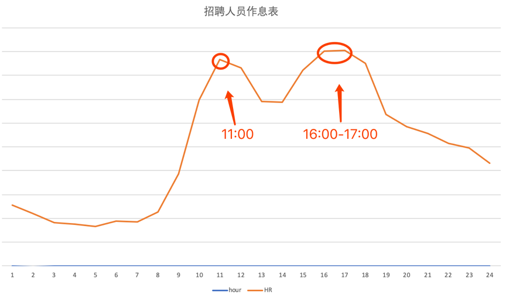
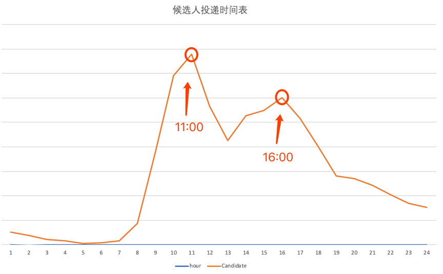

**经历**

- 整个经历自我介绍，越详细越好，什么时候接触计算机，什么时候接触前端。
- 整个经历中，你认为最值得骄傲的事情，最难的事情是什么。
- 什么事情让你自豪，什么事情让你有挫败感。
- 未来的发展，自己的规划。

**项目相关**

- 项目难点。（如何发现问题，解决思路，最后结果）
- 项目考虑过优化吗，你是如何优化的，思路是什么。
- 项目的组织架构，你对它的现有架构的理解，哪些优点值得借鉴，哪些缺点需要改进。
- 如果让你从 0 到 1 建一个项目，你考虑的点是什么，有哪些流程需要注意的。
- 如何进行技术选型，需要考虑哪些点。
- 项目中代码规范，你们项目有方案吗，你了解的代码规范有哪些方案。
- 说一说项目中你们是如何测试的，有哪些单元测试方案，能不能说一说。
- 项目中引入 TS 的原因，为什么这么做。

### 把握投递简历的黄金时间段

> 大家从事不同种类的工作，每天也在不断地制定自己的工作时间表。每个月总结的时候会发现有些事情总是在一个固定的时间去做，也可能在这个时间段发起同一件事情的几率非常的大，而且不止自己这样做，做同样工作的小伙伴亦如此。这就是工作种类作息时间的安排，招聘人员也一样，他们也有固定看简历和电话沟通的时间段。如果抓住这个“黄金投递点”，就等于抓住了招聘人员的视线，进而获得更多关注的可能性会更大。

**HR 工作作息时间表**

每个公司特别是互联网公司都有大量的招聘需求，而面对这么多的需求，公司 HR 是如何应对的？每天的工作作息时间是否有规律可循呢？

下面通过曲线图的形式来展示拉勾网 HR 的工作作息表：

由上图可知，每天 HR 最活跃的时间段为`上午 11 ~ 12 点、下午 4 点 ~ 5 点`。也就是说在这两个时间段里，我们的招聘小伙伴在疯狂的筛选简历，即在招聘平台上筛选来自不同候选人的简历。

如果`面试者投递简历的时间为上午的 10 ~ 11 点 或者下午的 3 ~ 4 点`，那么简历有可能会被优先处理。相信你也有过体验：一天当中，上午的工作心情以及认真度普遍是最高的，也就是说投递的简历是最容易被招聘人员筛选出来的。

**候选人投递时间表**

上面分析了 HR 最活跃的时间段，那求职者是不是也有个投递简历的高峰期？如何错开高峰期呢？调取了拉勾网投递简历的数据。

下面通过曲线图的形式来展示候选人投递简历的时间表：

> 由上图可知，候选人投递简历的高峰期是在`上午 11 点和下午 4 点`这两个时间段，也就是说和 HR 筛选简历的时间段完全重合。相信你也有过类似的体验：当专心做某一件事情的时候，肯定不会注意到投递来的新简历，这就是为什么简历石沉大海的原因。

通过上面两个数据的分析，相信你也应该知道了 HR 筛选简历的时间段，由此可知，`投递简历的“黄金时间段”在上午的 10 ~ 11 点 或者下午的 3 ~ 4 点`。因此，从现在起，调整投递简历的时间吧，在更好的时间段将自己的简历呈现到 HR 的面前。

### 把握面试时的关键点

**面试前的准备工作**

先说说面试前的准备吧。常规的准备相信你一定知道，比如制作一份吸引 HR 的简历、穿一身体面的衣服、整理一下自己的发型等。简历相关的准备前面已经详细讲过，这里就不多介绍了。

下面说说穿着相关的准备，很多小伙伴认为面试时的穿着并不是很重要，面试官肯定更看重个人魅力和知识的储备。当然这么说是没错的，但如果你和面试官首次见面，在还没有开始正式聊天之前，他是无法感知你的个人魅力或者知识储备的。

假如第一次见面就看到邋遢的外表或者奇怪的着装，面试官会怎么给你贴标签呢？首先他一定会认为你并不尊重这次面试，给他造成一种没有礼貌的印象；然后就是被你身上的味道熏倒无法和你多交流；最后根本来不及了解你的个人魅力和知识储备就草草地结束了这次面试。相信这个结果一定不是你想碰到的吧？所以，干净得体的着装是面试非常重要的一个环节。

面试官也会通过你的着装去判断你的性格，以及判断与公司的文化、团队的气氛是否匹配。这时可能你会问：我也没有进入到这家公司和团队，该如何判断面试当天穿什么衣服才符合这个公司的文化或者符合这个团队的气氛呢？当然，我们没有办法做到“把面试官的感受照顾到很细”的层面。

但是不同的穿着一定会表现出你的性格，有些表现出来的性格可能不会被大众所接受的，希望可以回避一下。下面简单说说几种可以表现性格的穿着：

喜欢穿简单朴素衣服的人，往往给人的印象是性格比较沉着稳重、为人比较真诚和随和，无论是在工作或学习上，还是在生活中，会给人一种勤奋好学、诚实肯干的感觉；

喜欢穿样式繁杂、颜色多样、花里胡哨的衣服的人，多是虚荣心比较强，爱表现自己而且又是乐于炫耀的人，会给人一种性格有些飞扬跋扈的感觉；

喜欢穿浅色衣服的人，性格比较活泼好动，十分健谈，会给人一种喜欢交朋友的感觉；

喜欢穿深色衣服的人，性格比较稳重，显得城府很深，会给人一种比较沉默，做人做事深谋远虑的感觉。

如果你希望在面试中表现的不是那么具有攻击力或者给人比较亲和、稳重性格的话，建议穿简单、朴素、纯色的衣服，会显得整个人比较清爽，且比较容易亲近，相信面试官也愿意和你多聊几句。当然不仅穿着干净，而且一定要注意个人卫生，最好不要让自己身上的体味过重或者使用太重味道的香水。化妆时，不建议浓妆艳抹，自然的淡妆让自己看起来很精神就可以。

**如何全面的介绍自己**

接下来就是面试的过程了，首先面试官会说：“请简单介绍一下自己。”

> 面试官有两个目的：（1）希望通过你的简单描述可以和简历上的经历做校对；（2）通过简单地介绍来看看你的逻辑和总结能力如何。所以自我介绍也是非常重要的一个环节，好的自我介绍一定要做到以下几点。

1.  面试时的自我介绍

> 一定要把握住时间。面试时的自我介绍一般`控制3～5分钟`最合适，尽量不要超过 10 分钟。时间过短说明你根本没有清晰的介绍自己，这时面试官很难了解你到底做了什么；时间过长可能很多内容不是面试官需要的信息，这时大部分的面试官会主动打断你，从而留下了不太好的印象。

那如何把握好时间呢？建议在介绍时包含以下几个部分就好：`（1）情况介绍，包括教育经历；（2）工作经验的介绍；（3）介绍最有价值的经历`。这样的一个自我介绍应该可以很好的控制在 5 分钟左右了，既可以让面试官清晰的了解你的情况，也能表现出你的优势。

1.  面试过程中需突出的几个点

> 在面试过程中一定要突出以下几个点：做过什么、有哪些工作业绩、优势是什么，这样可以很好的突出自己。

做过什么：介绍自己，把自己曾经做过的事情说清楚，每段工作对应时间节点的公司名称、担任职务、工作内容等，尤其是对最近两份工作做过的事情要重点说说，较早之前的工作经验，或者学习的经验可以一带而过，要把握“重点突出”的原则。

有哪些工作业绩：把自己在不同阶段做成的有代表性的项目经验介绍清楚，但是一定要注意：（1） 应与应聘岗位需要的能力相关的业绩多介绍，不相关的一笔带过或不介绍，因为面试官关注的是对用人单位有用的业绩；（2）要注意介绍你个人的业绩而不是团队业绩，要把自己最精彩的一两段业绩加以重点呈现。当然也要做好充足的准备，可以迎接面试官的提问。

> 突出自己的优势：注意介绍自己的优势一定要与应聘的岗位密切相关，主要是围绕自己专业特长来介绍。除专业特长以外的特长，特别突出可以介绍，但要点到为止。

举个例子：你好，我是某某，2018 年 3 月加入 XXX 公司，担任产品经理一职，主要负责公司核心产品的规划和设计工作；在这段期间，我独立完成过 XX 项目的产品跟进和上线的工作，将产品的数据提升了 30%，业绩突出，获得了公司的认可。在项目中，我通过学习和与外部专家的沟通，获许了 XXX 新策略的信息，并积极尝试，达成了我的目标。

1.  每段工作的离职原因

> 在面试的过程中一定要突出自己职业规划的逻辑性，也就是说需要让面试官感受到你的每次工作变动都是为了个人成长以及有规划的进行变动。所以在表述的时候最好可以清晰地说出你在每段工作中的收获和成长点，当然如果在陈述这些内容时可以体现出你的个人思考，就更是画龙点睛了。

**如何回答面试中的问题**

相信你经常会碰到面试官问以下的问题，这些问题也是面试官给你的一些考验，如果更好地回答这些问题可能会成为你入职心仪公司的敲门砖。

1.  你为什么选择我们公司？

这个问题相信不少小伙伴遇到过，可能你的原因是随便投递、公司离自己住的地方近、工资给的高、公司不加班、公司有各种补助等。如果这些答案出现在你的面试回答中，那 HR 会重新考虑是否要录用你了。

**所以在回答这个问题时需要有一些准备：**

- 可以先描述一下自己的能力与岗位要求的契合度，表现出在公司提供的岗位上有机会可以一展所长；
- 说出几个被企业所吸引的优点，这些优点能为以后的工作带来什么好处；
- 自己的职业发展与公司前景作出总结。

相信这些回答可以很容易抓住面试官的心，不过前期也是需要你对这家企业，以及所招聘的岗位做了一定的功课。

1.  你为什么从上家公司离职？

> 也许你在前公司受到了委屈、也许前公司人事关系复杂所以离职，但无论前公司有多么的糟糕，都千万不能在面试时说出来。因为你在上家公司离职的原因，会使面试官联想到你会不会因为在新公司受到委屈而轻易离职？再者，面试官其实并不关心你为什么要离职，所以面试时只需要给在场所有的人一个都可以接受的答案就可以了。

例如，可以这样回答：为了更好的发展，所以选择离职。切记在回答这个问题的时候，不能贬低前公司、不要损害前领导的形象。

1.  你的优点和缺点是什么？

> 相信很多小伙伴对这个问题都很头疼，自己的优点说的太多会让面试官感觉过于自大，可在面试的过程中又有谁愿意说自己的缺点呢？下面列举几个简单的方向，希望可以帮助你解决这个尴尬的困境。

- 优点：可以`结合过往的工作经历`和`工作业绩`等讲述一下自己的优势。例如，我曾经参加过某某项目，相信我的这个工作经验可以很好的帮助到公司解决什么方面的问题等。当然也可以通过一些例子说明自己的人品或性格方面的优势，哪家企业可以拒绝一位性格和能力都很好的候选人呢？
- 缺点：金无足赤、人无完人，要勇敢的面对自己的缺点，可以向面试官说明，你针对自己的缺点做了哪些改变，以此来说明你正在积极地改变自己去成为更优秀的人。

1.  未来 3 年或 5 年，你的职业规划是什么？

> 当面试官问到这个问题时，是希望看到你的自我学习力和未来牵引你的职业动力是什么。对职业规划不清晰的人，很难获得成功，也不会在一个岗位上待很久，所以也不是公司最合适的人选。

**当被问到你的职业规划是什么的时候，此时可以设定一个短期就能实现的规划和一个未来希望实现的目标**。

例如，我希望可以在未来的 1 ~ 2 年内，梳理和参与到几个完整的项目中，从中学习和看到整个项目进度是什么样的，从而提升自己的工作能力和项目经验。在未来的 3 ~ 5 年内我希望可以独立承担项目，做一个可以让大家都能使用并且体验良好的产品出来。

> 这样的回答，在短期规划上会让面试官认为你是一个脚踏实地，希望可以通过学习而成长的人，而且也在积极的改变自己；在长期规划上也能让面试官感受到你对这份工作的热情，具有很强的成就动机。

1.  在选工作中更看重的是什么？

很多小伙伴反馈，这个问题很难回答，其实也能想到面试官肯定更看重你的是个人成长和发展空间。当然也许你的内心想的是涨薪或者培训，虽然薪资是一定的，但是如果让面试官认为你是一个物质的人，并没有长久的培养空间，那面试的结果就可想而知了。

1.  你还有什么问题吗？

这是面试结束前的最后一个问题，也可以认为是个形式问题或走个流程，此时可根据前面面试过程中的表现程度来适当的提问，比如`公司福利、上下班时间、团队氛围、个人岗位发展`等，但尽量不要问从网上就能查到公司信息的问题。

### 工作交接流程 & 福利衔接

**工作交接流程**

如何不伤和气的提出辞呈

> 终于拿到了自己心仪公司的 Offer 了，可能有很多小伙伴又开始发愁了：如何与领导顺利提出辞呈，又不伤和气呢？这个时候一定要做好最坏的打算，你要明白，心软拖着不说会更伤害自己与前公司的关系，不如直截了当、当机立断。

**一般提出离职的方式分为两种：**

- 通过邮件的形式提出辞呈；
- 直接找直属 leader 沟通。

> 具体采用哪种方式，可根据自己的个性来判断，比如不太擅长沟通、偏内向的可以通过邮件的方式；如果已经想好了怎么和上级沟通，也可以直接找 leader 阐明心意。那在写邮件或直接沟通时需要注意哪些呢？

- 首先，可以先表达出对公司和领导在工作中的指导和帮助的感激，以及这段时间在公司的工作和成长的开心，同时说明一下做出辞职的决定对自己来说是多么难的一次选择。相信这样的表达可以让领导对你有个不错的印象。
- 其次，`不论你的离职原因是不满意薪资、不适应团队的管理风格还是发展空间到达了上限等，都不要在这里抱怨出来，因为每个公司的 leader 都清楚公司里的问题`，与其这样，不如直接告诉 leader，辞职的原因是希望可以有更好的发展，或者是让自己有更好的学习成长的空间。相信你的决心加上这样的理由，leader 一定会领会里面的意思。

> 如果这时 leader 突然问：找到下家了么？该怎么回答？建议这样委婉地回答：手里有好几个 Offer，还没确定好去哪家

最不建议的离职理由：经常会有小伙伴为了避免双方尴尬，会选择“家人生病需要较长的时间照顾”、“家人要求我回老家工作”等类似这样的理由，如果是真实的当然不会有问题，如果是虚构的，以后万一被发现，则会给前公司留下一个不诚信的印象，以后再相见时会更尴尬。

当然也有小伙伴提出离职是为了通过拿到的 Offer 要求涨薪，这样的“小聪明”玩不好可能就把自己“玩”进去了，不但在拿到 Offer 的公司名声坏了，也不会被现在的公司重用的。

最后，可以和前司表示一下，自己一定会负责任地把手里的工作交接清楚，站好最后一班岗，这样也可以给前司 leader 留下一个让人踏实的印象。毕竟你的面试背调还在人家手里，总不希望闹得不可开交，拿不到一个好的背调反馈吧。

**合理安排交接工作**

> 一般来说，如果你是一位已经转正的全职员工，那么交接的时间为一个月，所以公司也会要求你在这一个月里正常工作，那么，如何清晰地在这一个月里合理安排交接工作呢？

- 先和直属 leader 协商找到一个靠谱的工作交接人；
- 把自己以往的项目文档整理好，分类发给交接人；
- 如果你手里还有未结束的项目，可以带着交接人熟悉一下，一起对这个项目做收尾工作；
- 通知同事或者项目对接人自己已经离职，接下来的项目由被交接人负责；
- 空出两周的时间，协助交接人熟悉你手里的工作内容，在旁做好支持工作。
- 如果新的公司期望你能尽快入职的话，多数情况下会担心你拒绝入职，此时建议你诚恳地向新公司解释，并和新公司同步交接工作的进度。

交接文档有以下注意事项，比如：

- 清晰的文档归类，发现问题可以马上与你沟通；
- 尽可能将相关的文档都涉及到，让你的交接文档更容易查找；
- 记得文档转出时抄送给领导，这个很重要，一定要记得；

我相信这样的交接流程不会让自己手忙脚乱，也可以给前司留下不错的印象。

离职最后一天走的时候，记得和同事们一一打招呼，感谢大家以往的照顾和帮助，以后要常保持联系。`更重要的一点是，一定要拿到“离职证明”文件或“解除 / 终止劳动合同报告书”`。

**福利衔接**

> 交接工作都做完了，很多小伙伴会问：我的社保、公积金怎么办？下面来讲讲 3 种常用的福利交接事项。

**社保公积金**

- 各个公司的社保、公积金都是以`每个月的 15 日作为分界点`，如果你是在 `15 号前入职`的新公司，那么就会帮你交当月的社保和公积金，如果你是在 `15 号后`从前公司离职，社保、公积金会由前公司承担。当然也会有特殊情况，要看人才局的具体安排。
- 如果你正好是 `15 号前离职`，中间休息了一段时间，`15 号后入职新公司的`，可能需要你自己`找第三方保险代缴公司`自行缴纳社保公积金了。

**年假**

通常，公司会按照你出勤的月份帮你做年假的换算，然后与你协商安排延后几天离职，或结算成工资，或者按照公司的规定有其他操作。
