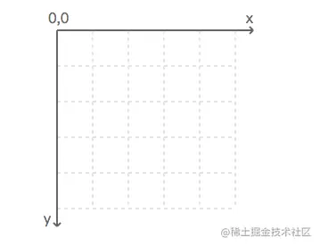
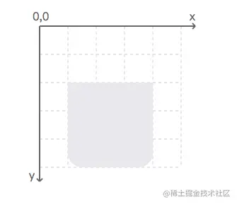
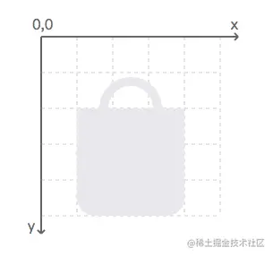
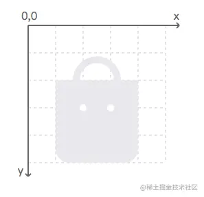
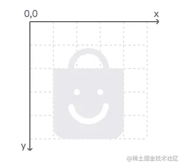
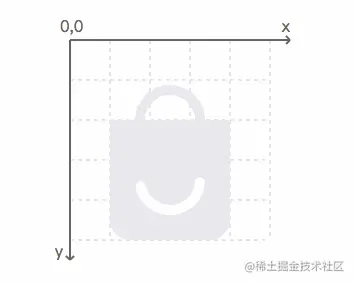
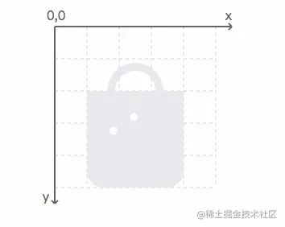
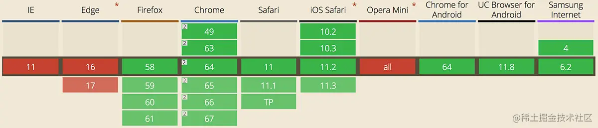

# 动效开发 5：SVG 动画

CSS3 动画已然足够强大，不过还是有一些它做不到的地方，例如轨迹（路径）动画的实现。配合 SVG，可以让 Web 动效有更多的可能性。

## 案例实战 - 实现一个购物袋的 loading 动效

下面以一个购物袋的 loading 动效为示例，带领大家上手 SVG 动画。

其中旋转通过 CSS 来完成，但是旋转之后圆弧缩短变成笑脸的嘴巴需要借助 SVG 来实现。

### 步骤 1 - 声明 SVG 视窗

    <svg width="100" height=“100”></svg>

指定一个宽高都为 100 像素的区域，`width="100"` 和 `width="100px"` 是等价的，当然也可以使用其他的合法单位，例如 cm、mm、em 等。

阅读器会设置一个默认的坐标系统，见下图：左上角为原点，其中水平（x）坐标向右递增，垂直（y）坐标向下递增。

在没有指定的情况下，所有数值的默认单位都是像素。

### 步骤 2 - 绘制购物袋

购物袋由两个部分组成，先画下面的主体：

    <path d="M 20 40 L 80 40 L 80 90 A 10 10 90 0 1 70 100 L 30 100 A 10 10 90 0 1 20 90" style="fill: #e9e8ee;" />

任何形状都可以使用路径元素画出，描述轮廓的数据放在它的 `d` 属性中。

- 样式中的 `fill` 用来设置填充色
- 路径数据由命令和坐标构成

  指令

  说明

  M 20 40

  表示移动画笔到 (20,40)

  L 80 40

  表示绘制一条线到 (80, 40)

  A 10 10 90 0 1 70 100

  绘制一个椭圆弧

圆弧命令以字母 A 开始，后面紧跟着 7 个参数，这 7 个参数分别用来表示：

1.  椭圆的 x 半径和 y 半径
2.  椭圆的 x 轴旋转角度
3.  圆弧的角度小于 180 度，为 0；大于或等于 180 度，则为 1
4.  以负角度绘制为 0，否则为 1
5.  终点的 x、y 坐标

接下来绘制购物袋上面的部分：

    <path d="M 35 40 A 15 15 180 1 1 65 40" style="fill: none; stroke: #e9e8ee; stroke-width: 5;” />

上面的部分是一个半圆弧，同样用路径来画出，当然也可以使用基础形状来完成。

样式中的 `stoke` 和 `stroke-width` 分别用来设置描边色和描边的宽度。

### 步骤 3 - 绘制眼睛

    <circle cx=“40" cy="60" r="2.5" style="fill: #fff;" />
    <circle cx="60" cy="60" r="2.5" style="fill: #fff;" />

使用基础形状，画两个小圆点。四个属性分别是位置坐标、半径和填充颜色。

### 步骤 4 - 绘制嘴巴

    <circle cx="50" cy="70" r="15" style="fill: none; stroke: #fff; stroke-width: 5; stroke-linecap: round;transform: rotate(280deg); transform-origin: 50% 50%; stroke-dashoffset: -23; stroke-dasharray: 42, 95;”>

嘴巴是一段圆弧，我绘制了一个圆，然后描边了其中的一段，并且做了一个旋转，来让它的角度处于正确的位置。

> 1.  `stroke-linecap`：用来定义开放路径的终结,可选 `round|butt|square`
> 2.  `stroke-dasharray`：用来创建虚线
> 3.  `stroke-dashoffset`：设置虚线位置的起始偏移值，在下一个步骤里，它会和 `stroke-dasharray` 一起用来实现动效

### 步骤 5 - 给嘴巴部分添加动效

    @keyframes mouth {
     0% {
      transform: rotate(-80deg);
      stroke-dasharray: 60, 95;
      stroke-dashoffset: 0;
     }
     40% {
      transform: rotate(280deg);
      stroke-dasharray: 60, 95;
      stroke-dashoffset: 0;
     }
     70%, 100% {
      transform: rotate(280deg);
      stroke-dashoffset: -23;
      stroke-dasharray: 42, 95;
     }
    }

动画分为两个部分：

1.  圆弧旋转
2.  旋转之后缩短变形

在一个循环里，最后留有 30% 的时间保持一个停留状态。

### 步骤 6 - 给眼睛添加动画

两只眼睛都是沿着圆弧运动 ，例如左眼，首先用一个路径来规定它的运动轨迹：

    <path id="eyeright" d="M 40 60 A 15 15 180 0 1 60 60" style="fill: none; stroke-width: 0;" />

然后使用 `animateMotion` 来设置动画：

    <circle class="eye" cx="" cy="" r="2.5" style="fill: #fff;">
     <animateMotion
      dur="0.8s"
      repeatCount="indefinite"
      keyPoints="0;0;1;1"
      keyTimes="0;0.3;0.9;1"
      calcMode="linear">
      <mpath xlink:href="#eyeleft"/>
     </animateMotion>
    </circle>

> 1.  `dur`：动画的时间
> 2.  `repeatCount`：重复次数
> 3.  `keyPoints`：运动路径的关键点
> 4.  `timePoints`：时间的关键点
> 5.  `calcMode`：控制动画的运动速率的变化，`discrete` | `linear` | `paced` | `spline` 四个属性可选
> 6.  `mpath`：指定一个外部定义的路径

### 步骤 7 - 将不同部位的动画组合到一起

- 眼睛的动画是从嘴巴旋转完成开始，到嘴巴变形完成结束，因此和嘴巴的动画一样，设置了四个对应的关键时间点。
- 为了让衔接更顺畅，眼睛的动画开始比嘴巴变形开始稍微提前了一点点。

Bingo！小功告成！[查看 DEMO][demo]

## 初探 SMIL

[SMIL][] 的全称为 Synchronized Multimedia Integration Language（同步多媒体集成语言），按照 W3C 规范对 SMIL 的描述，它是一种允许用户在网页上定义可交互多媒体内容的 XML 语言，可结合 XHTML 和 SVG 一起使用来实现网页动态效果。

在上面的案例中，我们使用了一个名为 `animateMotion` 的元素来实现眼睛的轨迹动画，其实便属于 SMIL 的知识范畴。

除了 `animationMotion` 用于实现轨迹动画之外，SMIL 还提供了另外两个元素来定义父级对象的动画，分别为：

- `animate`：用于设置父元素的数值属性（如 `width`、`height`、`color` 等）的过渡动画
- `animateTransform`：用于设置父元素的 `transform` 属性的过渡动画

### SMIL 的兼容性

除了微软系浏览器 及 Opera Mini 外，其他主流浏览器均支持 SMIL。

_（数据来源：[caniuse.com][]，截至 2018 年 3 月 14 日）_

> Chrome 45 版本曾声称准备弃用 SMIL ，但随后撤回了弃用计划。

### SMIL 的一个小例子

如下利用 SMIL 同时改变圆的位置和颜色：

    <svg width="100%" height="90" viewPort="0 0 90 90" class="demo-item">
        <circle cx="55" cy="45" r="45">
          <animate attributeType="XML" attributeName="cx" from="55" to="100%"
              dur="5s" repeatCount="indefinite"/>
          <animate attributeType="XML" attributeName="fill" from="#6190e8" to="#23232e"
              dur="5s" repeatCount="indefinite"/>
        </circle>
    </svg>

可见 SMIL 的动画元素是可以叠加使用的，[查看 DEMO][demo 1]。

## 扩展阅读

- [Animating SVG with CSS][]：利用 SVG 结合 CSS 实现一个动态广告图
- [Creating Cel Animations With SVG][]：利用 SVG 结合 CSS 实现逐帧（定格）动画
- [Cel Animation][]：用于辅助实现 SVG 逐帧（定格）动画的一个 SASS @mixin 函数
- [SVG - animationMotion][]：了解 `animationMotion` 元素
- [SVG animation with SMIL][]：了解使用 SMIL 实现 SVG 动画的方法

## 小结

SVG 在网页中的角色更像是类似图片一样的媒体对象，其动画也常常和 CSS 有关联，当然利用 [SMIL][svg animation with smil] 仍然可以为 SVG 添加独立的动效，除了微软系的浏览器不支持之外，其兼容性还是相当可观的。在平时工作过程中，矢量图标的动画、轨迹动画特别适合使用 SVG 来实现。

[202202221043499.png]: https://s.poetries.work/images/202202221043499.png
[202202221043875.png]: https://s.poetries.work/images/202202221043875.png
[202202221043154.png]: https://s.poetries.work/images/202202221043154.png
[202202221044247.png]: https://s.poetries.work/images/202202221044247.png
[202202221044307.png]: https://s.poetries.work/images/202202221044307.png
[202202221044692.png]: https://s.poetries.work/images/202202221044692.png
[202202221044673.png]: https://s.poetries.work/images/202202221044673.png
[202202221044397.png]: https://s.poetries.work/images/202202221044397.png
[demo]: http://jdc.jd.com/demo/simba/loading/index.html
[smil]: https://www.w3.org/TR/REC-smil/
[202202221044723.png]: https://s.poetries.work/images/202202221044723.png
[caniuse.com]: https://caniuse.com/#search=SMIL
[demo 1]: https://codepen.io/mamboer/full/MVKRZJ
[animating svg with css]: https://css-tricks.com/animating-svg-css/
[creating cel animations with svg]: https://www.smashingmagazine.com/2015/09/creating-cel-animations-with-svg/
[cel animation]: https://github.com/Heydon/cel-animation
[svg - animationmotion]: https://developer.mozilla.org/en-US/docs/Web/SVG/Element/animateMotion
[svg animation with smil]: https://developer.mozilla.org/en-US/docs/Web/SVG/SVG_animation_with_SMIL
