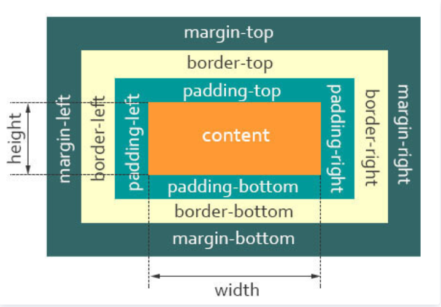
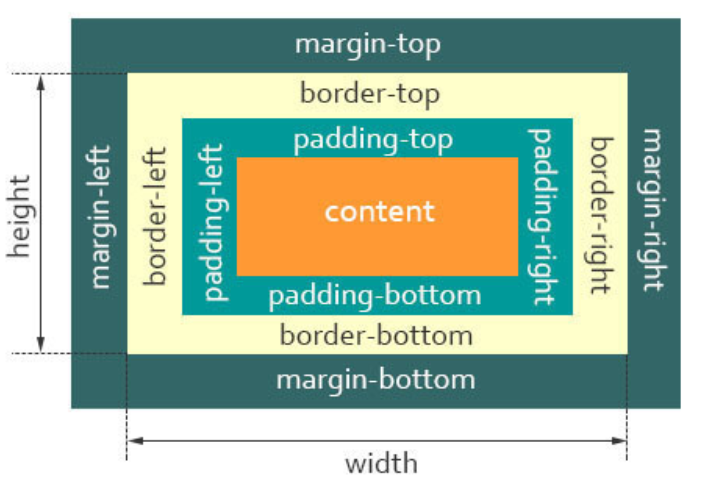
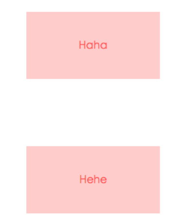
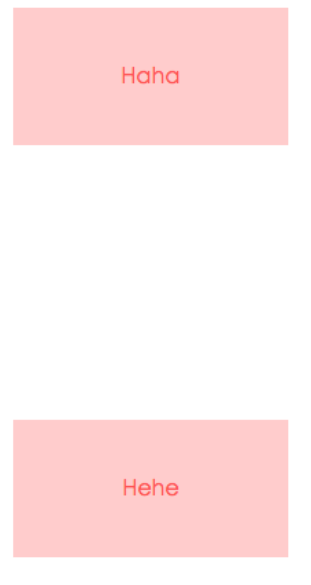
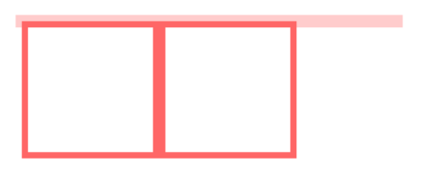
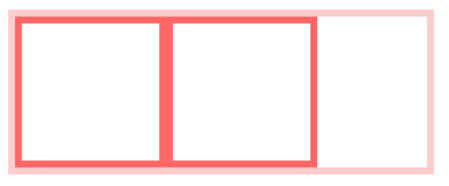
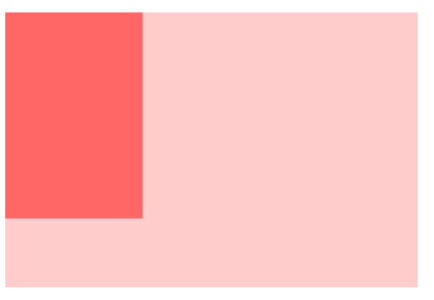
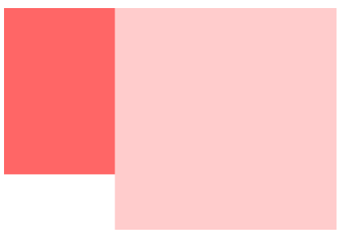
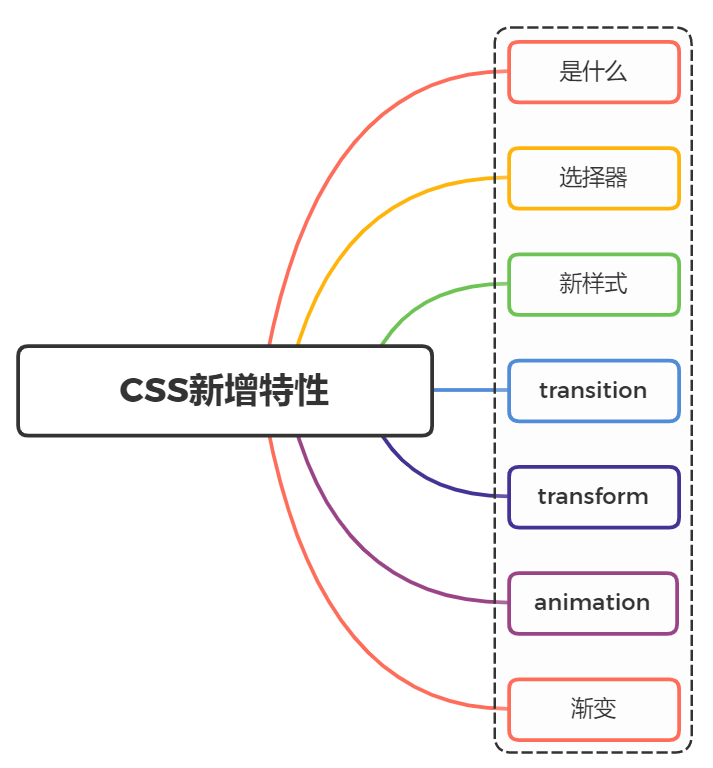
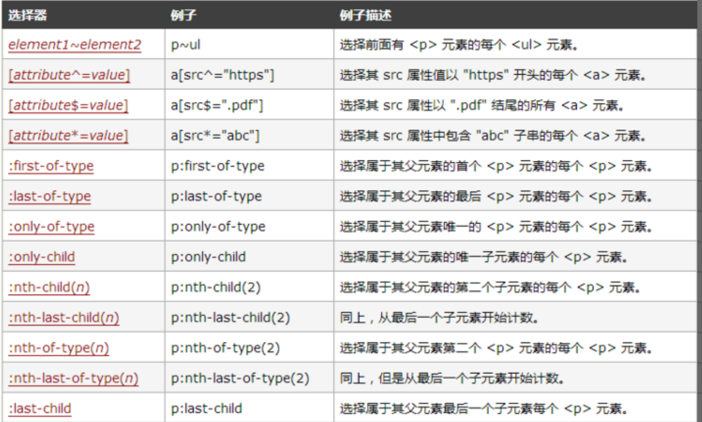

> 一天快速复习完高频面试题

## 1 CSS

## 盒模型

> - 有两种， `IE`盒子模型、`W3C`盒子模型；
> - 盒模型： 内容(`content`)、填充(`padding`)、边界(`margin`)、 边框(`border`)；
> - 区 别： `IE`的`content`部分把 `border` 和 `padding`计算了进去;

**标准盒子模型的模型图**



从上图可以看到：

- 盒子总宽度 = `width` + `padding` + `border` + `margin`;
- 盒子总高度 = `height` + `padding` + `border` + `margin`

也就是，`width/height` 只是内容高度，不包含 `padding` 和 `border` 值

**IE 怪异盒子模型**



从上图可以看到：

- 盒子总宽度 = `width` + `margin`;
- 盒子总高度 = `height` + `margin`;

也就是，`width/height` 包含了 `padding` 和 `border`值

> 页面渲染时，`dom` 元素所采用的 布局模型。可通过`box-sizing`进行设置

**通过 box-sizing 来改变元素的盒模型**

CSS 中的 `box-sizing` 属性定义了引擎应该如何计算一个元素的总宽度和总高度

- `box-sizing: content-box;` 默认的标准(W3C)盒模型元素效果，元素的 `width/height` 不包含`padding`，`border`，与标准盒子模型表现一致
- `box-sizing: border-box;` 触发怪异(IE)盒模型元素的效果，元素的 `width/height` 包含 `padding`，`border`，与怪异盒子模型表现一致
- `box-sizing: inherit;` 继承父元素 `box-sizing` 属性的值

**小结**

- 盒子模型构成：内容(`content`)、内填充(`padding`)、 边框(`border`)、外边距(`margin`)
- `IE8`及其以下版本浏览器，未声明 `DOCTYPE`，内容宽高会包含内填充和边框，称为怪异盒模型(`IE`盒模型)
- 标准(`W3C`)盒模型：元素宽度 = `width + padding + border + margin`
- 怪异(`IE`)盒模型：元素宽度 = `width + margin`
- 标准浏览器通过设置 css3 的 `box-sizing: border-box` 属性，触发"怪异模式"解析计算宽高

## BFC

> 块级格式化上下文，是一个独立的渲染区域，让处于 `BFC` 内部的元素与外部的元素相互隔离，使内外元素的定位不会相互影响。 `IE`下为 `Layout`，可通过 `zoom:1` 触发

**触发条件:**

- 根元素，即 HTML 元素
- 绝对定位元素 `position: absolute/fixed`
- 行内块元素 `display`的值为`inline-block`、`table`、`flex`、`inline-flex`、`grid`、`inline-grid`
- 浮动元素：`float`值为`left`、`right`
- `overflow值`不为 `visible`，为 `auto`、`scroll`、`hidden`

**规则:**

1. 属于同一个 `BFC` 的两个相邻 `Box` 垂直排列
2. 属于同一个 `BFC` 的两个相邻 `Box` 的 `margin` 会发生重叠
3. `BFC` 中子元素的 `margin box` 的左边， 与包含块 (BFC) `border box`的左边相接触 (子元素 `absolute` 除外)

在 CSS 中，BFC 代表"块级格式化上下文"（Block Formatting Context），是一个用于布局元素的概念。一个元素形成了 BFC 之后，会根据 BFC 的规则来进行布局和定位。在理解 BFC 中子元素的`margin box`与包含块（BFC）的`border box`相接触的概念时，可以考虑以下要点：

- **外边距折叠（Margin Collapsing）：** 在正常情况下，块级元素的外边距会折叠，即相邻元素的外边距会取两者之间的最大值，而不是简单相加。但是，当一个元素形成了 BFC 时，它的外边距不会和其内部的子元素的外边距折叠。
- **相邻边界情况：** BFC 中子元素的`margin box`的左边会与包含块的`border box`的左边相接触，这意味着子元素的外边距不会穿过包含块的边界，从而保证布局的合理性。

下面是一个示例代码，帮助你更好地理解这个概念：

    <!DOCTYPE html>
    <html>
    <head>
      <link rel="stylesheet" type="text/css" href="styles.css">
    </head>
    <body>
      <div class="container">
        <div class="child">Child Element</div>
      </div>
    </body>
    </html>

CSS (`styles.css`):

    .container {
      border: 2px solid black; /* 包含块的边框 */
      overflow: hidden; /* 创建 BFC */
    }

    .child {
      margin: 20px; /* 子元素的外边距 */
      padding: 10px; /* 子元素的内边距 */
      background-color: lightgray;
    }

在这个示例中，`.container`元素创建了一个 BFC（通过设置`overflow: hidden;`），而`.child`是`.container`的子元素。由于`.child`的外边距和内边距，我们可以看到以下效果：

- `.child`元素的`margin box`的外边界会与`.container`的`border box`的左边界相接触，这意味着`.child`的外边距不会超出`.container`的边界。
- 由于`.container`创建了 BFC，`.child`的外边距不会与`.container`的外边距折叠。

通过这个示例，你可以更好地理解 BFC 中子元素的`margin box`与包含块的`border box`之间的关系，以及 BFC 对布局的影响。

1. `BFC` 的区域不会与 `float` 的元素区域重叠
2. 计算 `BFC` 的高度时，浮动子元素也参与计算
3. 文字层不会被浮动层覆盖，环绕于周围

**应用:**

- 利用`2`：阻止`margin`重叠
- 利用`4`：自适应两栏布局
- 利用 `5` ，可以避免高度塌陷
- 可以包含浮动元素 ------ 清除内部浮动(清除浮动的原理是两个`div`都位于同一个 `BFC` 区域之中)

**示例**

**1. 防止 margin 重叠（塌陷）**

    <style> p { color: #f55; background: #fcc; width: 200px; line-height: 100px; text-align:center; margin: 100px; } </style>
    <body>
      <p>Haha</p >
      <p>Hehe</p >
    </body>



- 两个`p`元素之间的距离为`100px`，发生了`margin`重叠（塌陷），以最大的为准，如果第一个`P`的`margin`为`80`的话，两个`P`之间的距离还是`100`，以最大的为准。
- 同一个`BFC`的俩个相邻的盒子的`margin`会发生重叠
- 可以在`p`外面包裹一层容器，并触发这个容器生成一个`BFC`，那么两个`p`就不属于同一个`BFC`，则不会出现`margin`重叠

  ```
  <style>
    .wrap { overflow: hidden;// 新的BFC }
    p { color: #f55; background: #fcc; width: 200px; line-height: 100px; text-align:center; margin: 100px; }
  </style>
  <body>
      <p>Haha</p >
      <div class="wrap">
          <p>Hehe</p >
      </div>
  </body>
  ```

这时候，边距则不会重叠：



**2. 清除内部浮动**

    <style> .par { border: 5px solid #fcc; width: 300px; } .child { border: 5px solid #f66; width:100px; height: 100px; float: left; } </style>
    <body>
        <div class="par">
          <div class="child"></div>
          <div class="child"></div>
        </div>
    </body>



而`BFC`在计算高度时，浮动元素也会参与，所以我们可以触发`.par`元素生成`BFC`，则内部浮动元素计算高度时候也会计算

    .par {
        overflow: hidden;
    }



**3. 自适应多栏布局**

这里举个两栏的布局

    <style> body { width: 300px; position: relative; } .aside { width: 100px; height: 150px; float: left; background: #f66; } .main { height: 200px; background: #fcc; } </style>
    <body>
        <div class="aside"></div>
        <div class="main"></div>
    </body>



- 每个元素的左外边距与包含块的左边界相接触
- 因此，虽然`.aslide`为浮动元素，但是 main 的左边依然会与包含块的左边相接触，而`BFC`的区域不会与浮动盒子重叠
- 所以我们可以通过触发`main`生成`BFC`，以此适应两栏布局

  .main { overflow: hidden; }

这时候，新的`BFC`不会与浮动的`.aside`元素重叠。因此会根据包含块的宽度，和`.aside`的宽度，自动变窄



## 选择器权重计算方式

> !important \> 内联样式 = 外联样式 \> ID 选择器 \> 类选择器 = 伪类选择器 = 属性选择器 \> 元素选择器 = 伪元素选择器 \> 通配选择器 = 后代选择器 = 兄弟选择器

1. 属性后面加`!important`会覆盖页面内任何位置定义的元素样式
2. 作为`style`属性写在元素内的样式
3. `id`选择器
4. 类选择器
5. 标签选择器
6. 通配符选择器（`*`）
7. 浏览器自定义或继承

**同一级别：后写的会覆盖先写的**

> css 选择器的解析原则：选择器定位 DOM 元素是从右往左的方向，这样可以尽早的过滤掉一些不必要的样式规则和元素

## 清除浮动

1. 在浮动元素后面添加 `clear:both` 的空 `div` 元素

<div class="container">
    <div class="left"></div>
    <div class="right"></div>
    <div style="clear:both"></div>
</div>

2. 给父元素添加 `overflow:hidden` 或者 `auto` 样式，触发`BFC`

   <div class="container">
       <div class="left"></div>
       <div class="right"></div>
   </div>

   .container{ width: 300px; background-color: #aaa; overflow:hidden; zoom:1; /_IE6_/ }

3. 使用伪元素，也是在元素末尾添加一个点并带有 `clear: both` 属性的元素实现的。

   <div class="container clearfix">
       <div class="left"></div>
       <div class="right"></div>
   </div>

   .clearfix{ zoom: 1; /_IE6_/ } .clearfix:after{ content: "."; height: 0; clear: both; display: block; visibility: hidden; }

> 推荐使用第三种方法，不会在页面新增 div，文档结构更加清晰

## 垂直居中的方案

1. **利用绝对定位+transform** ，设置 `left: 50%` 和 `top: 50%` 现将子元素左上角移到父元素中心位置，然后再通过 `translate` 来调整子元素的中心点到父元素的中心。该方法可以**不定宽高**

   .father { position: relative; } .son { position: absolute; left: 50%; top: 50%; transform: translate(-50%, -50%); }

2. **利用绝对定位+margin:auto** ，子元素所有方向都为 `0` ，将 `margin` 设置为 `auto` ，由于宽高固定，对应方向实现平分，该方法必须**盒子有宽高**

   .father { position: relative; } .son { position: absolute; top: 0; left: 0; right: 0; bottom: 0px; margin: auto; height: 100px; width: 100px; }

3. **利用绝对定位+margin:负值** ，设置 `left: 50%` 和 `top: 50%` 现将子元素左上角移到父元素中心位置，然后再通过 `margin-left` 和 `margin-top` 以子元素自己的一半宽高进行负值赋值。该方法必须定宽高

   .father { position: relative; } .son { position: absolute; left: 50%; top: 50%; width: 200px; height: 200px; margin-left: -100px; margin-top: -100px; }

4. **利用 flex** ，最经典最方便的一种了，不用解释，**定不定宽高无所谓**

   <style> .father { display: flex; justify-content: center; align-items: center; width: 200px; height: 200px; background: skyblue; } .son { width: 100px; height: 100px; background: red; } </style>
   <div class="father">
       <div class="son"></div>
   </div>

5. **grid 网格布局**

   <style> .father { display: grid; align-items:center; justify-content: center; width: 200px; height: 200px; background: skyblue; } .son { width: 10px; height: 10px; border: 1px solid red } </style>
   <div class="father">
     <div class="son"></div>
   </div>

6. **table 布局**

设置父元素为`display:table-cell`，子元素设置 `display: inline-block`。利用`vertical`和`text-align`可以让所有的行内块级元素水平垂直居中

    <style> .father { display: table-cell; width: 200px; height: 200px; background: skyblue; vertical-align: middle; text-align: center; } .son { display: inline-block; width: 100px; height: 100px; background: red; } </style>
    <div class="father">
        <div class="son"></div>
    </div>

**小结**

不知道元素宽高大小仍能实现水平垂直居中的方法有：

- `利用绝对定位+transform`
- `flex`布局
- `grid`布局

**根据元素标签的性质，可以分为：**

- 内联元素居中布局
- 块级元素居中布局

**内联元素居中布局**

- 水平居中
  - 行内元素可设置：`text-align: center`
  - `flex`布局设置父元素：`display: flex; justify-content: center`
- 垂直居中
  - 单行文本父元素确认高度：`height === line-height`
  - 多行文本父元素确认高度：`display: table-cell; vertical-align: middle`

**块级元素居中布局**

- 水平居中
  - 定宽: `margin: 0 auto`
  - `绝对定位+left:50%+margin:负自身一半`
- 垂直居中
  - `position: absolute`设置`left`、`top`、`margin-left`、`margin-top`(定高)
  - `display: table-cell`
  - `transform: translate(x, y)`
  - `flex`(不定高，不定宽)
  - `grid`(不定高，不定宽)，兼容性相对比较差

## CSS3 的新特性



**1. 是什么**

css，即层叠样式表（Cascading Style Sheets）的简称，是一种标记语言，由浏览器解释执行用来使页面变得更美观

`css3`是 css 的最新标准，是向后兼容的，`CSS1/2`的特性在 `CSS3` 里都是可以使用的

而 `CSS3` 也增加了很多新特性，为开发带来了更佳的开发体验

**2. 选择器**

`css3`中新增了一些选择器，主要为如下图所示：



**3. 新样式**

- **边框** `css3`新增了三个边框属性，分别是：
  - `border-radius`：创建圆角边框
  - `box-shadow`：为元素添加阴影
  - `border-image`：使用图片来绘制边框
- **box-shadow** 设置元素阴影，设置属性如下（其中水平阴影和垂直阴影是必须设置的）
  - 水平阴影
  - 垂直阴影
  - 模糊距离(虚实)
  - 阴影尺寸(影子大小)
  - 阴影颜色
  - 内/外阴影
- **背景** 新增了几个关于背景的属性，分别是`background-clip`、`background-origin`、`background-size`和`background-break`
  - **`background-clip`** 用于确定背景画区，有以下几种可能的属性：通常情况，背景都是覆盖整个元素的，利用这个属性可以设定背景颜色或图片的覆盖范围
    - `background-clip: border-box`; 背景从`border`开始显示
    - `background-clip: padding-box`; 背景从`padding`开始显示
    - `background-clip: content-box`; 背景显`content`区域开始显示
    - `background-clip: no-clip`; 默认属性，等同于 b`order-box`
  - **`background-origin`** 当我们设置背景图片时，图片是会以左上角对齐，但是是以`border`的左上角对齐还是以`padding`的左上角或者`content`的左上角对齐? `border-origin`正是用来设置这个的
    - `background-origin: border-box`; 从`border`开始计算`background-position`
    - `background-origin: padding-box`; 从`padding`开始计算`background-position`
    - `background-origin: content-box`; 从`content`开始计算`background-position`
    - 默认情况是`padding-box`，即以`padding`的左上角为原点
  - **`background-size`** 常用来调整背景图片的大小，主要用于设定图片本身。有以下可能的属性：
    - `background-size: contain`; 缩小图片以适合元素（维持像素长宽比）
    - `background-size: cover`; 扩展元素以填补元素（维持像素长宽比）
    - `background-size: 100px 100px`; 缩小图片至指定的大小
    - `background-size: 50% 100%`; 缩小图片至指定的大小，百分比是相对包 含元素的尺寸
  - **`background-break`** 元素可以被分成几个独立的盒子（如使内联元素`span`跨越多行），`background-break` 属性用来控制背景怎样在这些不同的盒子中显示
    - `background-break: continuous`; 默认值。忽略盒之间的距离（也就是像元素没有分成多个盒子，依然是一个整体一样）
    - `background-break: bounding-box`; 把盒之间的距离计算在内；
    - `background-break: each-box`; 为每个盒子单独重绘背景
- **文字**
  - **`word-wrap: normal|break-word`**
    - `normal`：使用浏览器默认的换行
    - `break-all`：允许在单词内换行
  - **`text-overflow`** 设置或检索当当前行超过指定容器的边界时如何显示，属性有两个值选择
    - `clip`：修剪文本
    - `ellipsis`：显示省略符号来代表被修剪的文本
  - **`text-shadow`** 可向文本应用阴影。能够规定水平阴影、垂直阴影、模糊距离，以及阴影的颜色
  - **`text-decoration`** CSS3 里面开始支持对文字的更深层次的渲染，具体有三个属性可供设置：
    - `text-fill-color`: 设置文字内部填充颜色
    - `text-stroke-color`: 设置文字边界填充颜色
    - `text-stroke-width`: 设置文字边界宽度
- **颜色**
  - `css3`新增了新的颜色表示方式`rgba`与`hsla`
  - `rgba`分为两部分，`rgb`为颜色值，`a`为透明度
  - `hala`分为四部分，`h`为色相，`s`为饱和度，`l`为亮度，`a`为透明度

**4. transition 过渡**

`transition`属性可以被指定为一个或多个 CSS 属性的过渡效果，多个属性之间用逗号进行分隔，必须规定两项内容：

- 过度效果
- 持续时间

  transition： CSS 属性，花费时间，效果曲线(默认 ease)，延迟时间(默认 0)

上面为简写模式，也可以分开写各个属性

    transition-property: width;
    transition-duration: 1s;
    transition-timing-function: linear;
    transition-delay: 2s;

**5. transform 转换**

- `transform`属性允许你旋转，缩放，倾斜或平移给定元素
- `transform-origin`：转换元素的位置（围绕那个点进行转换），默认值为`(x,y,z):(50%,50%,0)`

使用方式：

- `transform: translate(120px, 50%)`：位移
- `transform: scale(2, 0.5)`：缩放
- `transform: rotate(0.5turn)`：旋转
- `transform: skew(30deg, 20deg)`：倾斜

**6. animation 动画**

动画这个平常用的也很多，主要是做一个预设的动画。和一些页面交互的动画效果，结果和过渡应该一样，让页面不会那么生硬

`animation`也有很多的属性

- `animation-name`：动画名称
- `animation-duration`：动画持续时间
- `animation-timing-function`：动画时间函数
- `animation-delay`：动画延迟时间
- `animation-iteration-count`：动画执行次数，可以设置为一个整数，也可以设置为 infinite，意思是无限循环
- `animation-direction`：动画执行方向
- `animation-paly-state`：动画播放状态
- `animation-fill-mode`：动画填充模式

**7. 渐变**

颜色渐变是指在两个颜色之间平稳的过渡，`css3`渐变包括

- `linear-gradient`：线性渐变 `background-image: linear-gradient(direction, color-stop1, color-stop2, ...)`;
- `radial-gradient`：径向渐变 `linear-gradient(0deg, red, green)`

**8. 其他**

- `Flex`弹性布局
- `Grid`栅格布局
- 媒体查询 `@media screen and (max-width: 960px) {}`还有打印`print`

**transition 和 animation 的区别**

> `Animation`和`transition`大部分属性是相同的，他们都是随时间改变元素的属性值，他们的主要区别是`transition`需要触发一个事件才能改变属性，而`animation`不需要触发任何事件的情况下才会随时间改变属性值，并且`transition`为 2 帧，从`from .... to`，而`animation`可以一帧一帧的

## CSS 动画和过渡

常见的动画效果有很多，如`平移`、`旋转`、`缩放`等等，复杂动画则是多个简单动画的组合

**css 实现动画的方式，有如下几种：**

- `transition` 实现渐变动画
- `transform` 转变动画
- `animation` 实现自定义动画

**1. transition 实现渐变动画**

**transition 的属性如下：**

- `transition-property:填写需要变化的css属性`
- `transition-duration:完成过渡效果需要的时间单位(s或者ms)默认是 0`
- `transition-timing-function:完成效果的速度曲线`
- `transition-delay: （规定过渡效果何时开始。默认是`0`）`

> 一般情况下，我们都是写一起的，比如：`transition： width 2s ease 1s`

其中`timing-function`的值有如下：

| 值                              | 描述                                                                   |
| ------------------------------- | ---------------------------------------------------------------------- |
| `linear`                        | 匀速（等于 `cubic-bezier(0,0,1,1)`）                                   |
| `ease`                          | 从慢到快再到慢（`cubic-bezier(0.25,0.1,0.25,1)`）                      |
| `ease-in`                       | 慢慢变快（等于 `cubic-bezier(0.42,0,1,1)`）                            |
| `ease-out`                      | 慢慢变慢（等于 `cubic-bezier(0,0,0.58,1)`）                            |
| `ease-in-out`                   | 先变快再到慢（等于 `cubic-bezier(0.42,0,0.58,1)`），渐显渐隐效果       |
| `cubic-bezier(*n*,*n*,*n*,*n*)` | 在 `cubic-bezier` 函数中定义自己的值。可能的值是 `0` 至 `1` 之间的数值 |

注意：并不是所有的属性都能使用过渡的，如`display:none<->display:block`

举个例子，实现鼠标移动上去发生变化动画效果

    <style> .base { width: 100px; height: 100px; display: inline-block; background-color: #0EA9FF; border-width: 5px; border-style: solid; border-color: #5daf34; transition-property: width, height, background-color, border-width; transition-duration: 2s; transition-timing-function: ease-in; transition-delay: 500ms; } /*简写*/ /*transition: all 2s ease-in 500ms;*/ .base:hover { width: 200px; height: 200px; background-color: #5daf34; border-width: 10px; border-color: #3a8ee6; } </style>
    <div class="base"></div>

**2. transform 转变动画**

包含四个常用的功能：

- `translate(x,y)`：位移
- `scale`：缩放
- `rotate`：旋转
- `skew`：倾斜

一般配合`transition`过度使用

> 注意的是，`transform`不支持`inline元`素，使用前把它变成`block`

举个例子

    <style> .base { width: 100px; height: 100px; display: inline-block; background-color: #0EA9FF; border-width: 5px; border-style: solid; border-color: #5daf34; transition-property: width, height, background-color, border-width; transition-duration: 2s; transition-timing-function: ease-in; transition-delay: 500ms; } .base2 { transform: none; transition-property: transform; transition-delay: 5ms; } .base2:hover { transform: scale(0.8, 1.5) rotate(35deg) skew(5deg) translate(15px, 25px); } </style>
    <div class="base base2"></div>

可以看到盒子发生了旋转，倾斜，平移，放大

**3. animation 实现自定义动画**

> 一个关键帧动画，最少包含两部分，`animation` 属性及属性值（动画的名称和运行方式运行时间等）`@keyframes`（规定动画的具体实现过程）

`animation`是由 `8` 个属性的简写，分别如下：

| 属性                                     | 描述                                                                    | 属性值                                                 |
| ---------------------------------------- | ----------------------------------------------------------------------- | ------------------------------------------------------ |
| `animation-duration`                     | 指定动画完成一个周期所需要时间，单位秒（`s`）或毫秒（`ms`），默认是 `0` |                                                        |
| `animation-timing-function`              | 指定动画计时函数，即动画的速度曲线，默认是 "`ease`"                     | `linear`、`ease`、`ease-in`、`ease-out`、`ease-in-out` |
| `animation-delay`                        | 指定动画延迟时间，即动画何时开始，默认是 `0`                            |                                                        |
| `animation-iteration-count`              | 指定动画播放的次数，默认是 `1`。但我们一般用`infinite`，一直播放        |                                                        |
| `animation-direction` 指定动画播放的方向 | 默认是 `normal`                                                         | `normal`、`reverse`、`alternate`、`alternate-reverse`  |
| `animation-fill-mode`                    | 指定动画填充模式。默认是 `none`                                         | `forwards`、`backwards`、`both`                        |
| `animation-play-state`                   | 指定动画播放状态，正在运行或暂停。默认是 `running`                      | `running`、`pauser`                                    |
| `animation-name`                         | 指定 `@keyframes` 动画的名称                                            |                                                        |

`CSS` 动画只需要定义一些关键的帧，而其余的帧，浏览器会根据计时函数插值计算出来，

> `@keyframes`定义关键帧，可以是`from->to`（等同于`0%`和`100%`），也可以是从`0%->100%`之间任意个的分层设置

因此，如果我们想要让元素旋转一圈，只需要定义开始和结束两帧即可：

    @keyframes rotate{
      from {
        transform: rotate(0deg);
      }
      to {
        transform: rotate(360deg);
      }
    }

> `from` 表示最开始的那一帧，`to` 表示结束时的那一帧

**也可以使用百分比刻画生命周期**

    @keyframes rotate{
      0%{
        transform: rotate(0deg);
      }
      50%{
        transform: rotate(180deg);
      }
      100%{
        transform: rotate(360deg);
      }
    }

定义好了关键帧后，下来就可以直接用它了：

    animation: rotate 2s;

**总结**

| 属性                 | 含义                                                                                                        |
| -------------------- | ----------------------------------------------------------------------------------------------------------- |
| `transition（过度）` | 用于设置元素的样式过度，和`animation`有着类似的效果，但细节上有很大的不同                                   |
| `transform（变形）`  | 用于元素进行旋转、缩放、移动或倾斜，和设置样式的动画并没有什么关系，就相当于`color`一样用来设置元素的"外表" |
| `translate（移动）`  | 只是`transform`的一个属性值，即移动                                                                         |
| `animation（动画）`  | 用于设置动画属性，他是一个简写的属性，包含`6`个属性                                                         |

**4. 用 css3 动画使一个图片旋转**

    #loader {
      display: block;
      position: relative;
      animation: spin 2s linear infinite;
    }

    @keyframes spin {
      0% {
        transform: rotate(0deg);
      }
      100% {
        transform: rotate(360deg);
      }
    }

## 有哪些方式（CSS）可以隐藏页面元素

- `opacity:0`：本质上是将元素的透明度将为`0`，就看起来隐藏了，但是依然占据空间且可以交互
- `display:none`: 这个是彻底隐藏了元素，元素从文档流中消失，既不占据空间也不交互，也不影响布局
- `visibility:hidden`: 与上一个方法类似的效果，占据空间，但是不可以交互了
- `overflow:hidden`: 这个只隐藏元素溢出的部分，但是占据空间且不可交互
- `z-index:-9999`: 原理是将层级放到底部，这样就被覆盖了，看起来隐藏了
- `transform:scale(0,0)`: 平面变换，将元素缩放为`0`，但是依然占据空间，但不可交互

**display: none 与 visibility: hidden 的区别**

- 修改常规流中元素的`display`通常会造成文档重排。修改`visibility`属性只会造成本元素的重绘
- 读屏器不会读取`display:none`;元素内容；会读取`visibility:hidden;`元素内容
- `display:none`;会让元素完全从渲染树中消失，渲染的时候不占据任何空间；`visibility:hidden`;不会让元素从渲染树消失，渲染时元素继续占据空间，只是内容不可见
- `display:none`;是非继承属性，**子孙节点消失由于元素从渲染树消失造成，通过修改子孙节点属性无法显示** ；`visibility:hidden;`是继承属性，**子孙节点消失由于继承了`hidden`，通过设置`visibility:visible;`可以让子孙节点显式**

## 说说 em/px/rem/vh/vw 区别

- 传统的项目开发中，我们只会用到`px`、`%`、`em`这几个单位，它可以适用于大部分的项目开发，且拥有比较良好的兼容性
- 从`CSS3`开始，浏览器对计量单位的支持又提升到了另外一个境界，新增了`rem`、`vh`、`vw`、`vm`等一些新的计量单位
- 利用这些新的单位开发出比较良好的响应式页面，适应多种不同分辨率的终端，包括移动设备等
- 在`css`单位中，可以分为长度单位、绝对单位，如下表所指示

| **CSS 单位** |                                                          |
| ------------ | -------------------------------------------------------- |
| 相对长度单位 | `em`、`ex`、`ch`、`rem`、`vw`、`vh`、`vmin`、`vmax`、`%` |
| 绝对长度单位 | `cm`、`mm`、`in`、`px`、`pt`、`pc`                       |

这里我们主要讲述`px`、`em`、`rem`、`vh`、`vw`

**px**

`px`，表示像素，所谓像素就是呈现在我们显示器上的一个个小点，每个像素点都是大小等同的，所以像素为计量单位被分在了绝对长度单位中

有些人会把`px`认为是相对长度，原因在于在移动端中存在设备像素比，`px`实际显示的大小是不确定的

这里之所以认为`px`为绝对单位，在于`px`的大小和元素的其他属性无关

**em**

`em`是相对长度单位。相对于当前对象内文本的字体尺寸。如当前对行内文本的字体尺寸未被人为设置，则相对于浏览器的默认字体尺寸（`1em = 16px`）

为了简化 `font-size` 的换算，我们需要在`css`中的 `body` 选择器中声明`font-size`= `62.5%`，这就使 em 值变为 `16px*62.5% = 10px`

这样 `12px = 1.2em`, `10px = 1em`, 也就是说只需要将你的原来的`px` 数值除以 10，然后换上 `em`作为单位就行了

特点：

- `em` 的值并不是固定的
- `em` 会继承父级元素的字体大小
- `em` 是相对长度单位。相对于当前对象内文本的字体尺寸。如当前对行内文本的字体尺寸未被人为设置，则相对于浏览器的默认字体尺寸
- 任意浏览器的默认字体高都是 `16px`

举个例子

    <div class="big">
      我是14px=1.4rem<div class="small">我是12px=1.2rem</div>
    </div>

样式为

    <style> html {font-size: 10px;  } /* 公式16px*62.5%=10px */
        .big{font-size: 1.4rem}
        .small{font-size: 1.2rem}
    </style>

这时候`.big`元素的`font-size`为`14px`，而`.small`元素的`font-size`为 12px

**rem(常用)**

- 根据屏幕的分辨率动态设置`html`的文字大小，达到等比缩放的功能
- 保证`html`最终算出来的字体大小，不能小于`12px`
- 在不同的移动端显示不同的元素比例效果
- 如果`html`的`font-size:20px`的时候，那么此时的`1rem = 20px`
- 把设计图的宽度分成多少分之一，根据实际情况
- `rem`做盒子的宽度，`viewport`缩放

`head`加入常见的`meta`属性

    <meta name="format-detection" content="telephone=no">
    <meta name="apple-mobile-web-app-capable" content="yes">
    <meta name="apple-mobile-web-app-status-bar-style" content="black">
    <!--这个是关键-->
    <meta name="viewport" content="width=device-width, initial-scale=1.0, maximum-scale=1.0, user-scalable=0，minimum-scale=1.0">

把这段代码加入`head`中的`script`预先加载

    // rem适配用这段代码动态计算html的font-size大小
    (function(win) {
        var docEl = win.document.documentElement;
        var timer = '';

        function changeRem() {
          var width = docEl.getBoundingClientRect().width;
          if (width > 750) { // 750是设计稿大小
              width = 750;
          }
          var fontS = width / 10; // 把设备宽度十等分 1rem<=75px
          docEl.style.fontSize = fontS + "px";
        }
        win.addEventListener("resize", function() {
          clearTimeout(timer);
          timer = setTimeout(changeRem, 30);
        }, false);
        win.addEventListener("pageshow", function(e) {
          if (e.persisted) { //清除缓存
            clearTimeout(timer);
            timer = setTimeout(changeRem, 30);
          }
        }, false);
        changeRem();
    })(window)

- 或者使用淘宝提供的库 \[https://github.com/amfe/lib-flexible (opens new window)](https://github.com/amfe/lib-flexible)

  (function flexible (window, document) { var docEl = document.documentElement var dpr = window.devicePixelRatio || 1

      // adjust body font size
      function setBodyFontSize () {
        if (document.body) {
          document.body.style.fontSize = (12 * dpr) + 'px'
        }
        else {
          document.addEventListener('DOMContentLoaded', setBodyFontSize)
        }
      }
      setBodyFontSize();

      // set 1rem = viewWidth / 10
      function setRemUnit () {
        var rem = docEl.clientWidth / 10
        docEl.style.fontSize = rem + 'px'
      }

      setRemUnit()

      // reset rem unit on page resize
      window.addEventListener('resize', setRemUnit)
      window.addEventListener('pageshow', function (e) {
        if (e.persisted) {
          setRemUnit()
        }
      })

      // detect 0.5px supports
      if (dpr >= 2) {
        var fakeBody = document.createElement('body')
        var testElement = document.createElement('div')
        testElement.style.border = '.5px solid transparent'
        fakeBody.appendChild(testElement)
        docEl.appendChild(fakeBody)
        if (testElement.offsetHeight === 1) {
          docEl.classList.add('hairlines')
        }
        docEl.removeChild(fakeBody)
      }

  }(window, document))

**vh、vw**

`vw` ，就是根据窗口的宽度，分成`100`等份，`100vw`就表示满宽，`50vw`就表示一半宽。（`vw` 始终是针对窗口的宽），同理，`vh`则为窗口的高度

这里的窗口分成几种情况：

- 在桌面端，指的是浏览器的可视区域
- 移动端指的就是布局视口

像`vw`、`vh`，比较容易混淆的一个单位是`%`，不过百分比宽泛的讲是相对于父元素：

- 对于普通定位元素就是我们理解的父元素
- 对于`position: absolute;`的元素是相对于已定位的父元素
- 对于`position: fixed;`的元素是相对于 `ViewPort`（可视窗口）

**总结**

- **px**：绝对单位，页面按精确像素展示
- **%**：相对于父元素的宽度比例
- **em** ：相对单位，基准点为父节点字体的大小，如果自身定义了`font-size`按自身来计算（浏览器默认字体是`16px`），整个页面内`1em`不是一个固定的值
- **rem** ：相对单位，可理解为`root em`, 相对根节点`html`的字体大小来计算
- **vh、vw** ：主要用于页面视口大小布局，在页面布局上更加方便简单
  - `vw`：屏幕宽度的`1%`
  - `vh`：屏幕高度的`1%`
  - `vmin`：取`vw`和`vh`中较小的那个（如：`10vh=100px 10vw=200px` 则`vmin=10vh=100px`）
  - `vmax`：取`vw`和`vh`中较大的那个（如：`10vh=100px 10vw=200px` 则`vmax=10vw=200px`）

## flex 布局

很多时候我们会用到 `flex: 1` ，它具体包含了以下的意思

- `flex-grow: 1` ：该属性默认为 `0` ，如果存在剩余空间，元素也不放大。设置为 `1` 代表会放大。
- `flex-shrink: 1` ：该属性默认为 \`1 ，如果空间不足，元素缩小。
- `flex-basis: 0%` ：该属性定义在分配多余空间之前，元素占据的主轴空间。浏览器就是根据这个属性来计算是否有多余空间的。默认值为 `auto` ，即项目本身大小。设置为 `0%` 之后，因为有 `flex-grow` 和 `flex-shrink` 的设置会自动放大或缩小。在做两栏布局时，如果右边的自适应元素 `flex-basis` 设为`auto` 的话，其本身大小将会是 `0`

## 如果要做优化，CSS 提高性能的方法有哪些？

实现方式有很多种，主要有如下：

- **内联首屏关键 CSS**
  - 在打开一个页面，页面首要内容出现在屏幕的时间影响着用户的体验，而通过内联`css`关键代码能够使浏览器在下载完`html`后就能立刻渲染
  - 而如果外部引用`css`代码，在解析`html`结构过程中遇到外部`css`文件，才会开始下载`css`代码，再渲染
  - 所以，`CSS`内联使用使渲染时间提前
  - 注意：但是较大的`css`代码并不合适内联（初始拥塞窗口、没有缓存），而其余代码则采取外部引用方式
- **异步加载 CSS**

  - 在 CSS 文件请求、下载、解析完成之前，CSS 会阻塞渲染，浏览器将不会渲染任何已处理的内容
  - 前面加载内联代码后，后面的外部引用 css 则没必要阻塞浏览器渲染。这时候就可以采取异步加载的方案，主要有如下：

    - 使用 javascript 将`link`标签插到`head`标签最后

      ```
      // 创建 link 标签
      const myCSS = document.createElement( "link" );
      myCSS.rel = "stylesheet";
      myCSS.href = "mystyles.css";
      // 插入到 header 的最后位置
      document.head.insertBefore( myCSS, document.head.childNodes[ document.head.childNodes.length - 1 ].nextSibling )
      ```

    - 设置`link`标签`media`属性为`noexis`，浏览器会认为当前样式表不适用当前类型，会在不阻塞页面渲染的情况下再进行下载。加载完成后，将 media 的值设为`screen`或`all`，从而让浏览器开始解析 CSS

      ```
      <link rel="stylesheet" href="mystyles.css" media="noexist" onload="this.media='all'">
      ```

    - 通过`rel`属性将`link`元素标记为`alternate`可选样式表，也能实现浏览器异步加载。同样别忘了加载完成之后，将`rel`设回`stylesheet`

      ```
      <link rel="alternate stylesheet" href="mystyles.css" onload="this.rel='stylesheet'">
      ```

- **资源压缩**
  - 利用`webpack`、`gulp/grunt`、`rollup`等模块化工具，将`css`代码进行压缩，使文件变小，大大降低了浏览器的加载时间
- **合理使用选择器**
  - css 匹配的规则是从右往左开始匹配，例如`#markdown .content h3`匹配规则如下：
    - 先找到`h3`标签元素
    - 然后去除祖先不是`.content`的元素
    - 最后去除祖先不是`#markdown`的元素
  - 如果嵌套的层级更多，页面中的元素更多，那么匹配所要花费的时间代价自然更高
  - 所以我们在编写选择器的时候，可以遵循以下规则：
    - 不要嵌套使用过多复杂选择器，最好不要三层以上
    - 使用 id 选择器就没必要再进行嵌套
    - 通配符和属性选择器效率最低，避免使用
- **减少使用昂贵的属性**
  - 在页面发生重绘的时候，昂贵属性如`box-shadow/border-radius/filter/透明度/:nth-child`等，会降低浏览器的渲染性能
- **不要使用@import**
  - css 样式文件有两种引入方式，一种是`link`元素，另一种是`@import`
  - `@import`会影响浏览器的并行下载，使得页面在加载时增加额外的延迟，增添了额外的往返耗时
  - 而且多个`@import`可能会导致下载顺序紊乱
  - 比如一个 css 文件`index.css`包含了以下内容：`@import url("reset.css")`
  - 那么浏览器就必须先把`index.css`下载、解析和执行后，才下载、解析和执行第二个文件`reset.css`
- **其他**
  - 减少重排操作，以及减少不必要的重绘
  - 了解哪些属性可以继承而来，避免对这些属性重复编写
  - `css Sprite`，合成所有`icon`图片，用宽高加上 b`ackgroud-position`的背景图方式显现出我们要的`icon`图，减少了`http`请求
  - 把小的`icon`图片转成`base64`编码
  - CSS3 动画或者过渡尽量使用`transform`和`opacity`来实现动画，不要使用`left`和`top`属性

## 画一条 0.5px 的线

- 采用 `meta viewport` 的方式 `<meta name="viewport" content="initial-scale=1.0, maximum-scale=1.0, user-scalable=no" />`
- 采用 `border-image` 的方式
- 采用 `transform: scale()` 的方式

## 如何画一个三角形

三角形原理:边框的均分原理

    div {
      width:0px;
      height:0px;
      border-top:10px solid red;
      border-right:10px solid transparent;
      border-bottom:10px solid transparent;
      border-left:10px solid transparent;
    }

## 两栏布局：左边定宽，右边自适应方案

    <div class="box">
      <div class="box-left"></div>
      <div class="box-right"></div>
    </div>

**利用 float + margin 实现**

    .box {
     height: 200px;
    }

    .box > div {
      height: 100%;
    }

    .box-left {
      width: 200px;
      float: left;
      background-color: blue;
    }

    .box-right {
      margin-left: 200px;
      background-color: red;
    }

**利用 calc 计算宽度**

    .box {
     height: 200px;
    }

    .box > div {
      height: 100%;
    }

    .box-left {
      width: 200px;
      float: left;
      background-color: blue;
    }

    .box-right {
      width: calc(100% - 200px);
      float: right;
      background-color: red;
    }

**利用 float + overflow 实现**

    .box {
     height: 200px;
    }

    .box > div {
      height: 100%;
    }

    .box-left {
      width: 200px;
      float: left;
      background-color: blue;
    }

    .box-right {
      overflow: hidden;
      background-color: red;
    }

**利用 flex 实现**

    .box {
      height: 200px;
      display: flex;
    }

    .box > div {
      height: 100%;
    }

    .box-left {
      width: 200px;
      background-color: blue;
    }

    .box-right {
      flex: 1; // 设置flex-grow属性为1，默认为0
      background-color: red;
    }
