## 9 HTTP

## HTTP 基础总结

**HTTP 状态码**

- `1XX`：信息状态码
  - `100 Continue` 继续，一般在发送`post`请求时，已发送了`http header`之后服务端将返回此信息，表示确认，之后发送具体参数信息
- `2XX`：成功状态码
  - `200 OK` 正常返回信息
  - `201 Created` 请求成功并且服务器创建了新的资源
  - `202 Accepted` 服务器已接受请求，但尚未处理
- `3XX`：重定向
  - `301 Moved Permanently` 请求的网页已永久移动到新位置。
  - `302 Found` 临时性重定向。
  - `303 See Other` 临时性重定向，且总是使用 `GET` 请求新的 `URI`。
  - `304 Not Modified` 自从上次请求后，请求的网页未修改过。
- `4XX`：客户端错误
  - `400 Bad Request` 服务器无法理解请求的格式，客户端不应当尝试再次使用相同的内容发起请求。
  - `401 Unauthorized` 请求未授权。
  - `403 Forbidden` 禁止访问。
  - `404 Not Found` 找不到如何与 `URI` 相匹配的资源。
- `5XX:` 服务器错误
  - `500 Internal Server Error` 最常见的服务器端错误。
  - `503 Service Unavailable` 服务器端暂时无法处理请求（可能是过载或维护）。

**常见状态码**

- `200` 成功
- `301` 永久重定向（配合`location`，浏览器自动处理）
- `302` 临时重定向（配合`location`，浏览器自动处理）
- `304` 资源未被修改
- `403` 没有权限访问，一般做权限角色
- `404` 资源未找到
- `500` `Internal Server Error`服务器内部错误
- `502` `Bad Gateway`
- `503` `Service Unavailable`
- `504` `Gateway Timeout`网关超时

**502 与 504 的区别**

这两种异常状态码都与网关 `Gateway` 有关，首先明确两个概念

- `Proxy (Gateway)`，反向代理层或者网关层。在公司级应用中一般使用 `Nginx` 扮演这个角色
- `Application (Upstream server)`，应用层服务，作为 `Proxy` 层的上游服务。在公司中一般为各种语言编写的服务器应用，如 `Go/Java/Python/PHP/Node` 等
- **此时关于 502 与 504 的区别就很显而易见**
  - `502 Bad Gateway`：一般表现为你自己写的「应用层服务(`Java/Go/PHP`)挂了」，或者网关指定的上游服务直接指错了地址，网关层无法接收到响应
  - `504 Gateway Timeout`：一般表现为「应用层服务 (`Upstream`) 超时，超过了 `Gatway` 配置的 `Timeout`」，如查库操作耗时三分钟，超过了 `Nginx` 配置的超时时间

**http headers**

- **常见的 Request Headers**
  - `Accept` 浏览器可接收的数据格式
  - `Accept-Enconding` 浏览器可接收的压缩算法，如`gzip`
  - `Accept-Language` 浏览器可接收的语言，如`zh-CN`
  - `Connection:keep-alive` 一次`TCP`连接重复复用
  - `Cookie`
  - `Host` 请求的域名是什么
  - `User-Agent`（简称`UA`） 浏览器信息
  - `Content-type` 发送数据的格式，如`application/json`
- **常见的 Response Headers**
  - `Content-type` 返回数据的格式，如`application/json`
  - `Content-length` 返回数据的大小，多少字节
  - `Content-Encoding` 返回数据的压缩算法，如`gzip`
  - `set-cookie`
- **缓存相关的 Headers**
  - `Cache Control`、`Expired`
  - `Last-Modified`、`If-Modified-Since`
  - `Etag`、`If-None-Match`

**从输入 URL 到显示出页面的整个过程**

- **下载资源**：各个资源类型，下载过程
- **加载过程**
  - `DNS`解析：域名 =\> `IP`地址
  - 浏览器根据`IP`地址向服务器发起`HTTP`请求
  - 服务器处理`HTTP`请求，并返回浏览器
- **渲染过程**
  - 根据`HTML`生成`DOM Tree`
  - 根据`CSS`生成`CSSOM`
  - `DOM Tree`和`CSSOM`整合形成`Render Tree`，根据`Render Tree`渲染页面
  - 遇到`<script>`暂停渲染，优先加载并执行`JS`代码，执行完在解析渲染（JS 线程和渲染线程共用一个线程，JS 执行要暂停 DOM 渲染）
  - 直至把`Render Tree`渲染完成

**window.onload 和 DOMContentLoaded**

- `window.onload` 页面的全部资源加载完才会执行，包括图片、视频等
- `DOMContentLoaded` 渲染完即可，图片可能尚未下载

```js
  window.addEventListener('load',function() {
    // 页面的全部资源加载完才会执行，包括图片、视频等
  })
  window.addEventListener('DOMContentLoaded',function() {
    // DOM 渲染完才执行，此时图片、视频等可能还没有加载完
  })

演示

    <p>一段文字 1</p>
    <p>一段文字 2</p>
    <p>一段文字 3</p>
    

    <script>
      const img1 = document.getElementById('img1')
      img1.onload = function () {
        console.log('img loaded')
      }
      window.addEventListener('load', function () {
        console.log('window loaded')
      })
      document.addEventListener('DOMContentLoaded', function () {
        console.log('dom content loaded')
      }) // 结果
      // dom content loaded
      // img loaded
      // window loaded
    </script>
```

**拓展：关于 Restful API**

- 一种新的`API`设计方法
- 传统`API`设计：把每个`url`当做一个功能
- `Restful API`设计：把每个`url`当前一个唯一的资源
  - **如何设计成一个资源**
    - 尽量不用`url`参数
      - 传统`API`设计：`/api/list?pageIndex=2`
      - `Restful API`设计：`/api/list/2`
    - 用`method`表示操作类型
      - 传统`API`设计：
        - `post`新增请求：`/api/create-blog`
        - `post`更新请求：`/api/update-blog?id=100`
        - `post`删除请求：`/api/delete-blog?id=100`
        - `get`请求：`/api/get-blog?id=100`
      - `Restful API`设计：
        - `post`新增请求：`/api/blog`
        - `patch`更新请求：`/api/blog/100`
        - `delete`删除请求：`/api/blog/100`
        - `get`请求：`/api/blog/100`

## HTTP 缓存

- **关于缓存介绍**
  - 为什么需要缓存？减少网络请求（网络请求不稳定性），让页面渲染更快
  - 哪些资源可以被缓存？静态资源（`js` `css` `img`）`webpack`打包加`contenthash`根据内容生成`hash`
- **http 缓存策略** （强制缓存 + 协商缓存）

  - **强制缓存**

    - 服务端在`Response Headers`中返回给客户端
    - `Cache-Control`：`max-age=31536000`（单位：秒）一年
    - **Cache-Control 的值**
      - `max-age`（常用）缓存的内容将在`max-age`秒后失效
      - `no-cache`（常用）不要本地强制缓存，正常向服务端请求（只要服务端最新的内容）。需要使用协商缓存来验证缓存数据（`Etag` `Last-Modified`）
      - `no-store` 不要本地强制缓存，也不要服务端做缓存，所有内容都不会缓存，强制缓存和协商缓存都不会触发
      - `public` 所有内容都将被缓存（客户端和代理服务器都可缓存）
      - `private` 所有内容只有客户端可以缓存
    - **Expires**
      - `Expires`：`Thu, 31 Dec 2037 23:55:55 GMT`（过期时间）
      - 已被`Cache-Control`代替
    - **Expires 和 Cache-Control 的区别**
      - `Expires`是`HTTP1.0`的产物，`Cache-Control`是`HTTP1.1`的产物
      - `Expires`是服务器返回的具体过期时间，`Cache-Control`是相对时间
      - `Expires`存在兼容性问题，`Cache-Control`优先级更高
    - **强制缓存的优先级高于协商缓存**
    - **强制缓存的流程**
      - 浏览器第一次请求资源，服务器返回资源和`Cache-Control` `Expires`
      - 浏览器第二次请求资源，会带上`Cache-Control` `Expires`，服务器根据这两个值判断是否命中强制缓存
      - 命中强制缓存，直接从缓存中读取资源，返回给浏览器
      - 未命中强制缓存，会带上`If-Modified-Since` `If-None-Match`，服务器根据这两个值判断是否命中协商缓存
      - 命中协商缓存，返回`304`，浏览器直接从缓存中读取资源
      - 未命中协商缓存，返回`200`，浏览器重新请求资源
    - **强制缓存的流程图**

      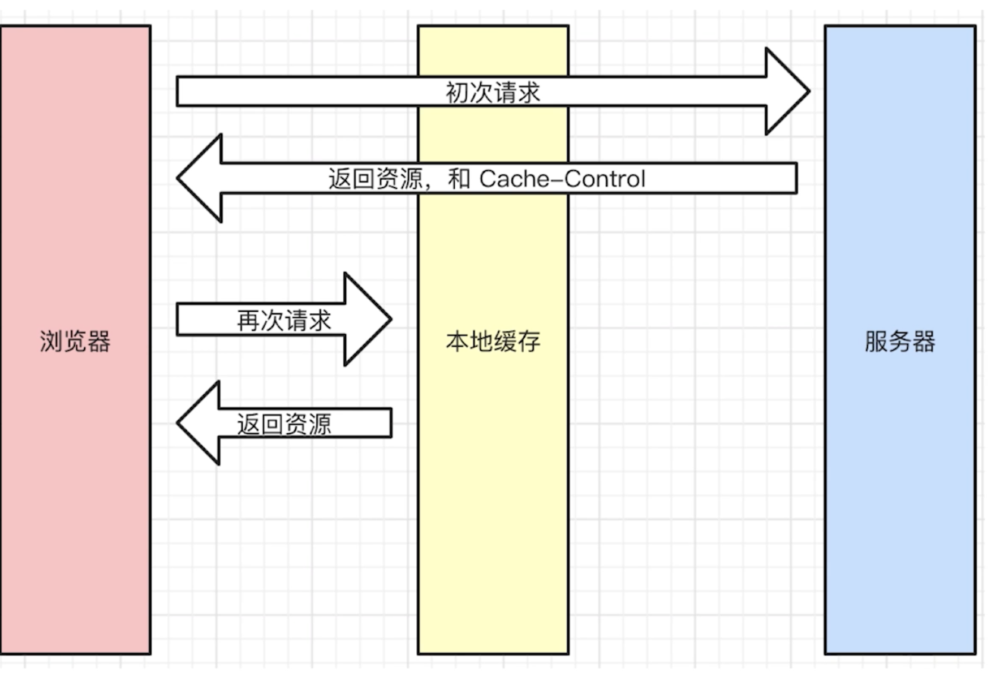

      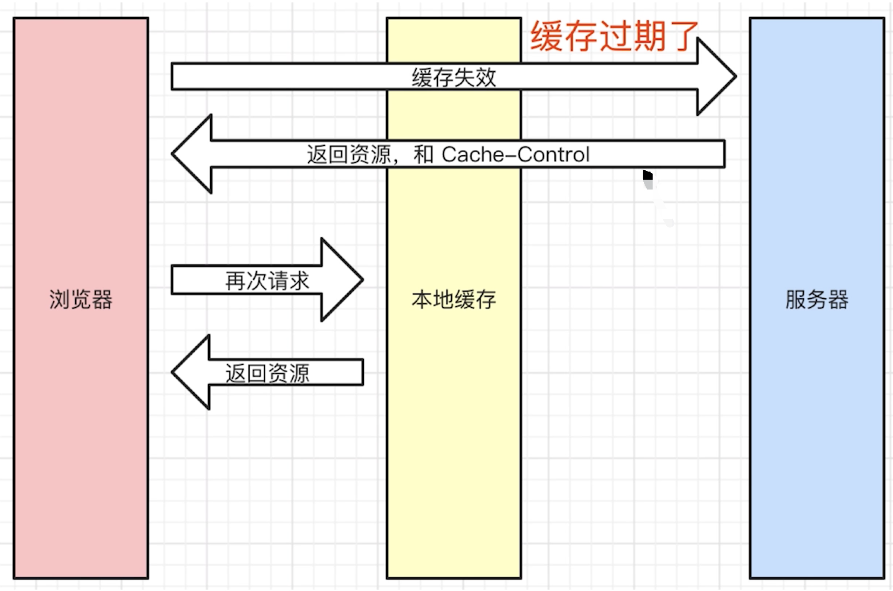

  - **协商缓存**

    - 服务端缓存策略
    - 服务端判断客户端资源，是否和服务端资源一样
    - 如果判断一致则返回`304`（不在返回`js`、图片内容等资源），否则返回`200`和最新资源
    - **服务端怎么判断客户端资源一样？** 根据资源标识

      - 在`Response Headers`中，有两种
      - `Last-Modified`和`Etag`会优先使用`Etag`，`Last-Modified`只能精确到秒级，如果资源被重复生成而内容不变，则`Etag`更准确
      - `Last-Modified` 服务端返回的资源的最后修改时间

        - `If-Modified-Since` 客户端请求时，携带的资源的最后修改时间（即`Last-Modified`的值）

          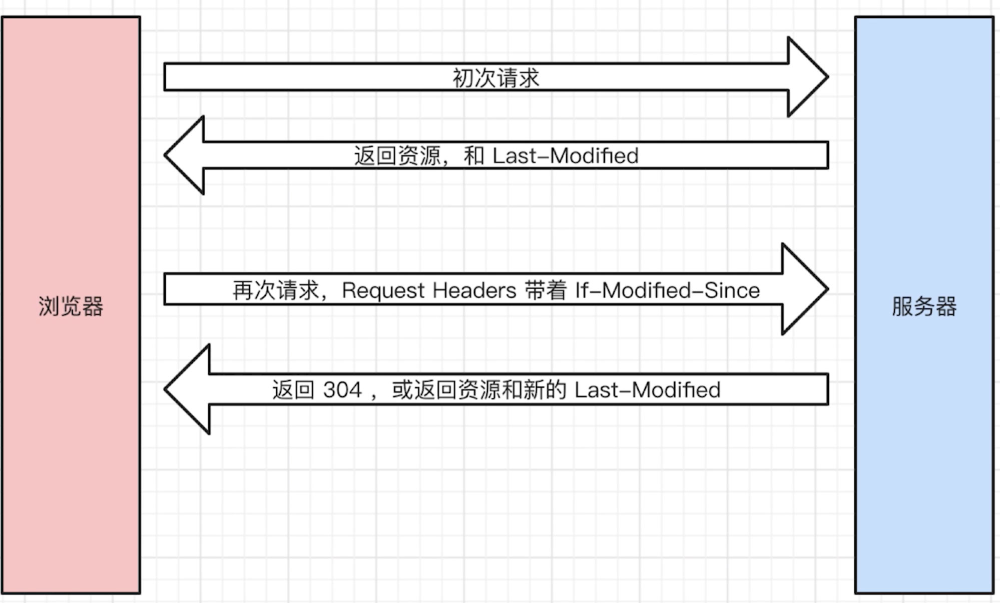

      - `Etag`服务端返回的资源的唯一标识（一个字符串，类似指纹）

        - `If-None-Matche` 客户端请求时，携带的资源的唯一标识（即`Etag`的值）

          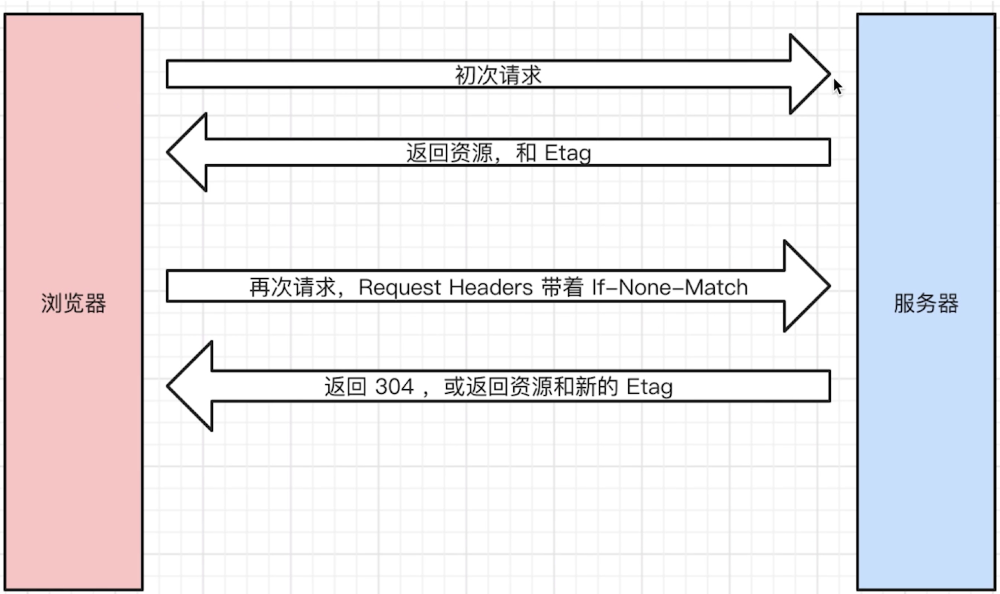

      - **Headers 示例**

        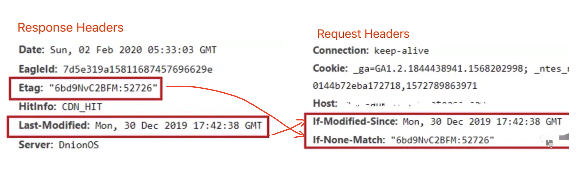

      - **请求示例** 通过`Etag`或`Last-Modified`命中缓存，没有返回资源，返回`304`，体积非常小

        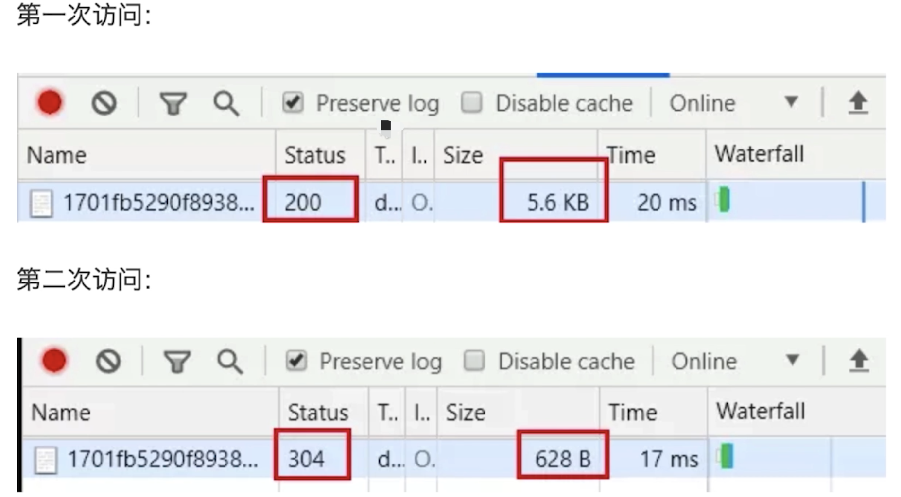

  - **HTTP 缓存总结**

    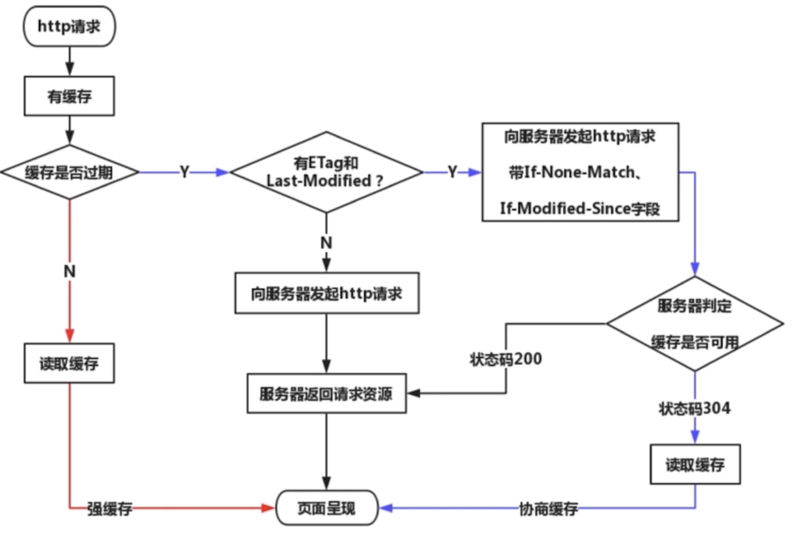

- **刷新操作方式，对缓存的影响**
  - 正常操作：地址栏输入`url`，跳转链接，前进后退
  - 手动操作：`F5`，点击刷新，右键菜单刷新
  - 强制刷新：`ctrl + F5` 或 `command + r`
- **不同刷新操作，不同缓存策略**
  - 正常操作：强缓存有效，协商缓存有效
  - 手动操作：强缓存失效，协商缓存有效
  - 强制刷新：强缓存失效，协商缓存失效
- **小结**
  - 强缓存`Cache-Contorl`、`Expired`（弃用）
  - 协商缓存`Last-Modified`/`If-Modified-Since`和`Etag`/`If-None-Matche`，`304`状态码
  - 完整流程图

## HTTP 协议 1.0 和 1.1 和 2.0 有什么区别

- **HTTP1.0**
  - 最基础的`HTTP`协议
  - 支持基本的`GET`、`POST`方法
- **HTTP1.1**
  - 缓存策略 `cache-control` `E-tag`
  - 支持长链接 `Connection:keep-alive` 一次`TCP`连接多次请求
  - 断点续传，状态码`206`
  - 支持新的方法 `PUT DELETE`等，可用于`Restful API`写法
- **HTTP2.0**
  - 可压缩`header`，减少体积
  - 多路复用，一次`TCP`连接中可以多个`HTTP`并行请求
  - 服务端推送（实际中使用`websocket`）

**连环问：HTTP 协议和 UDP 协议有什么区别**

- `HTTP`是应用层，`TCP`、`UDP`是传输层
- `TCP`有连接（三次握手），有断开（四次挥手），传输稳定
- `UDP`无连接，无断开不稳定传输，但效率高。如视频会议、语音通话

## WebSocket 和 HTTP 协议有什么区别

- 支持端对端通信
- 可由`client`发起，也可由`sever`发起
- 用于消息通知、直播间讨论区、聊天室、协同编辑

**WebSocket 连接过程**

- 先发起一个`HTTP`请求
- 成功之后在升级到`WebSocket`协议，再通讯

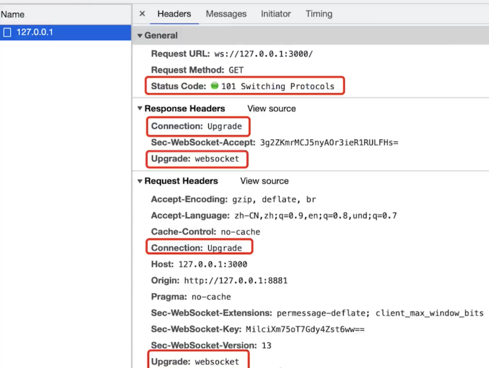

**WebSocket 和 HTTP 区别**

- `WebSocket`协议名是`ws://`，可双端发起请求（双端都可以`send`、`onmessage`）
- `WebSocket`没有跨域限制
- 通过`send`和`onmessage`通讯（`HTTP`通过`req`、`res`）

**WebSocket 和 HTTP 长轮询的区别**

> 长轮询：一般是由客户端向服务端发出一个设置较长网络超时时间的 `HTTP` 请求，并在`Http`连接超时前，不主动断开连接；待客户端超时或有数据返回后，再次建立一个同样的`HTTP`请求，重复以上过程

- `HTTP`长轮询：客户端发起请求，服务端阻塞，不会立即返回
  - `HTTP`长轮询需要处理`timeout`，即`timeout`之后重新发起请求
- `WebSocket`：客户端可发起请求，服务端也可发起请求

**ws 可升级为 wss（像 https）**

```js
import { createServer } from "https";
import { readFileSync } from "fs";
import { WebSocketServer } from "ws";

const server = createServer({
  cert: readFileSync("/path/to/cert.pem"),
  key: readFileSync("/path/to/key.pem")
});
const wss = new WebSocketServer({ server });
```

**实际项目中推荐使用 socket.io API 更简洁**

```js
io.on("connection", (sockert) => {
  // 发送信息
  socket.emit("request" /**/);
  // 广播事件到客户端
  io.emit("broadcast" /**/);
  // 监听事件
  socket.on("reply", () => {
    /**/
  });
});
```

**WebSocket 基本使用例子**

```js
    // server.js
    const { WebSocketServer } = require('ws') // npm i ws
    const wsServer = new WebSocketServer({ port: 3000 })

    wsServer.on('connection', ws => {
      console.info('connected')

      ws.on('message', msg => {
        console.info('收到了信息', msg.toString())

        // 服务端向客户端发送信息
        setTimeout(() => {
          ws.send('服务端已经收到了信息: ' + msg.toString())
        }, 2000)
      })
    })

    <!-- websocket main page -->
    <button id="btn-send">发送消息</button>

    <script>
      const ws = new WebSocket('ws://127.0.0.1:3000')
      ws.onopen = () => {
        console.info('opened')
        ws.send('client opened') }
        ws.onmessage = event => {
          console.info('收到了信息', event.data)
        }
        document.getElementById('btn-send').addEventListener('click', () => {
          console.info('clicked')
          ws.send('当前时间' + Date.now())
        })
    </script>
```

## 请描述 TCP 三次握手和四次挥手

**建立 TCP 连接**

- 先建立连接，确保双方都有收发消息的能力
- 再传输内容（如发送一个`get`请求）
- 网络连接是`TCP`协议，传输内容是`HTTP`协议

**三次握手-建立连接**

- `Client`发包，`Server`接收。`Server`就知道有`Client`要找我了
- `Server`发包，`Client`接收。`Client`就知道`Server`已经收到消息
- `Client`发包，`Server`接收。`Server`就知道`Client`要准备发送了
- 前两步确定双发都能收发消息，第三步确定双方都准备好了

**四次挥手-关闭连接**

- `Client`发包，`Server`接收。`Server`就知道`Client`已请求结束
- `Server`发包，`Client`接收。`Client`就知道`Server`已收到消息，我等待`server`传输完成了在关闭
- `Server`发包，`Client`接收。`Client`就知道`Server`已经传输完成了，可以关闭连接了
- `Client`发包，`Server`接收。`Server`就知道`Client`已经关闭了，`Server`可以关闭连接了

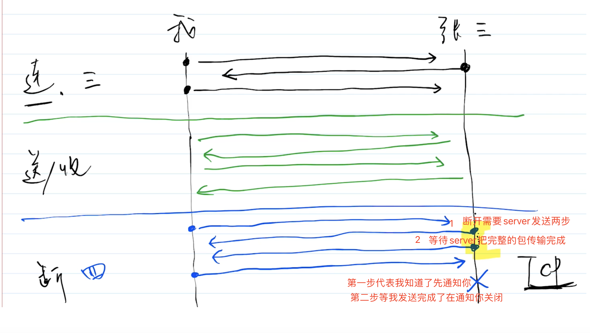

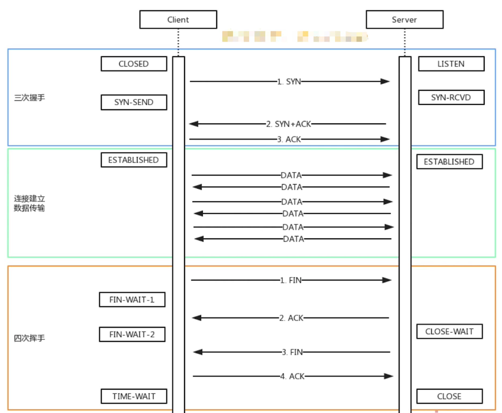

## HTTP 跨域请求时为什么要发送 options 请求

**跨域请求**

- 浏览器同源策略
- 同源策略一般限制`Ajax`网络请求，不能跨域请求`server`
- 不会限制`<link>` `` `<script>` `<iframe>` 加载第三方资源

**JSONP 实现跨域**

    <!-- aa.com网页 -->
    <script> window.onSuccess = function(data) { console.log(data) } </script>
    <script src="https://bb.com/api/getData"></script>

    // server端https://bb.com/api/getData
    onSuccess({ "name":"test", "age":12, "city":"shenzhen" });

**cors**

    response.setHeader('Access-Control-Allow-Origin', 'https://aa.com') // 或者*
    response.setHeader('Access-Control-Allow-Methods', 'GET, POST, PUT, DELETE, OPTIONS') // 允许的请求方法
    response.setHeader('Access-Control-Allow-Headers', 'X-Requested-With') // 允许的请求头
    response.setHeader（'Access-Control-Allow-Credentials', 'true'）// 允许跨域携带cookie

**多余的 options 请求**

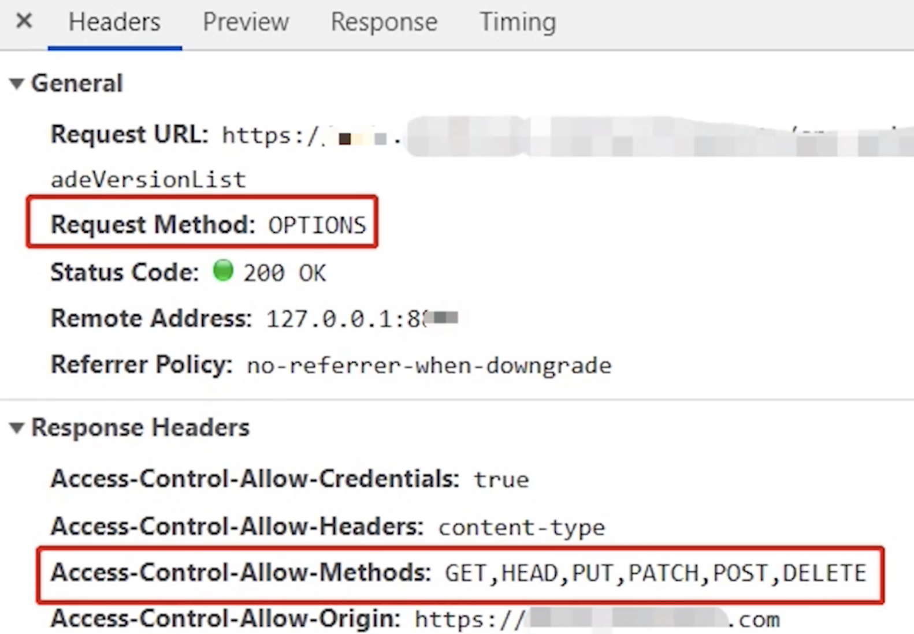

- `options`是跨域请求之前的预检查
- 浏览器自行发起的，无需我们干预
- 不会影响实际的功能

## HTTP 请求中 token、cookie、session 有什么区别

**cookie**

- `HTTP`无状态的，每次请求都要携带`cookie`,以帮助识别身份
- 服务端也可以向客户端`set-cookie`,`cookie`大小`4kb`
- 默认有跨域限制：不可跨域共享，不可跨域传递`cookie`（可通过设置`withCredential`跨域传递`cookie`）

**cookie 本地存储**

- `HTML5`之前`cookie`常被用于本地存储
- `HTML5`之后推荐使用`localStorage`和`sessionStorage`

**现代浏览器开始禁止第三方 cookie**

- 和跨域限制不同，这里是：禁止网页引入第三方 js 设置`cookie`
- 打击第三方广告设置`cookie`
- 可以通过属性设置 `SameSite:Strict/Lax/None`

**cookie 和 session**

- `cookie`用于登录验证，存储用户标识（`userId`）
- `session`在服务端，存储用户详细信息，和`cookie`信息一一对应
- `cookie+session`是常见的登录验证解决方案

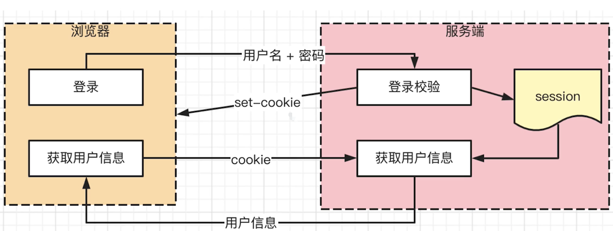

    // 登录：用户名 密码
    // 服务端set-cookie: userId=x1 把用户id传给浏览器存储在cookie中
    // 下次请求直接带上cookie:userId=x1 服务端根据userId找到哪个用户的信息

    // 服务端session集中存储所有的用户信息在缓存中
    const session = {
      x1: {
        username:'xx1',
        email:'xx1'
      },
      x2: { // 当下次来了一个用户x2也记录x2的登录信息,同时x1也不会丢失
        username:'xx2',
        email:'xx2'
      },
    }

**token 和 cookie**

- `cookie`是`HTTP`规范（每次请求都会携带），而`token`是自定义传递
- `cookie`会默认被浏览器存储，而`token`需自己存储
- `token`默认没有跨域限制

**JWT(json web token)**

- 前端发起登录，后端验证成功后，返回一个加密的`token`
- 前端自行存储这个`token`（其他包含了用户信息，加密的）
- 以后访问服务端接口，都携带着这个`token`，作为用户信息

**session 和 jwt 哪个更好？**

- **session 的优点**
  - 用户信息存储在服务端，可快速封禁某个用户
  - 占用服务端内存，成本高
  - 多进程多服务器时不好同步，需要使用`redis`缓存
  - 默认有跨域限制
- **JWT 的优点**
  - 不占用服务端内存，`token`存储在客户端浏览器
  - 多进程、多服务器不受影响
  - 没有跨域限制
  - 用户信息存储在客户端，无法快速封禁某用户（可以在服务端建立黑名单，也需要成本）
  - 万一服务端密钥被泄露，则用户信息全部丢失
  - `token`体积一般比`cookie`大，会增加请求的数据量
- 如严格管理用户信息（保密、快速封禁）推荐使用`session`
- 没有特殊要求，推荐使用`JWT`

**如何实现 SSO(Single Sign On)单点登录**

- 单点登录的`本质就是在多个应用系统中共享登录状态`，如果用户的登录状态是记录在 `Session` 中的，要实现共享登录状态，就要先共享 `Session`

- 所以实现单点登录的关键在于，如何让 `Session ID`（或 `Token`）在多个域中共享

- **主域名相同，基于 cookie 实现单点登录**

  - `cookie`默认不可跨域共享，但有些情况下可设置跨域共享
  - 主域名相同，如`www.baidu.com`、`image.baidu.com`
  - 设置`cookie domain`为主域`baidu.com`，即可共享`cookie`
  - 主域名不同，则`cookie`无法共享。可使用`sso`技术方案来做

- **主域名不同，基于 SSO 技术方案实现**

  - 系统`A`、`B`、`SSO`域名都是独立的
  - 用户访问系统`A`，系统`A`重定向到`SSO`登录（登录页面在`SSO`）输入用户名密码提交到`SSO`，验证用户名密码，将登录状态写入`SSO`的`session`，同时将`token`作为参数返回给客户端
  - 客户端携带`token`去访问系统`A`，系统`A`携带`token`去`SSO`验证，`SSO`验证通过返回用户信息给系统`A`
  - 用户访问`B`系统，`B`系统没有登录，重定向到`SSO`获取`token`（由于`SSO`已经登录了，不需要重新登录认证，之前在`A`系统登录过）,拿着`token`去`B`系统，`B`系统拿着`token`去`SSO`里面换取用户信息
  - 整个所有用户的登录、用户信息的保存、用户的`token`验证，全部都在`SSO`第三方独立的服务中处理

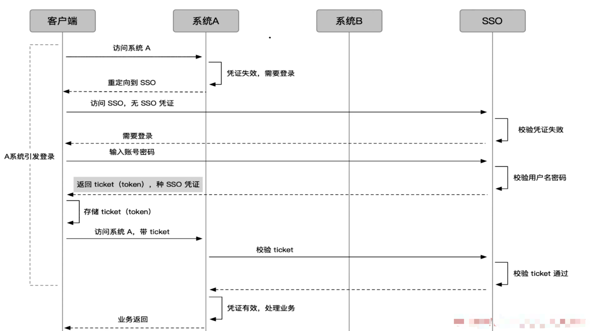

## 什么是 HTTPS 中间人攻击，如何预防（HTTPS 加密过程、原理）

**HTTPS 加密传输**

- `HTTP`是明文传输
- `HTTPS`加密传输 `HTTP + TLS/SSL`

**TLS 中的加密**

- **对称加密** 两边拥有相同的秘钥，两边都知道如何将密文加密解密。
- **非对称加密** 有公钥私钥之分，公钥所有人都可以知道，可以将数据用公钥加密，但是将数据解密必须使用私钥解密，私钥只有分发公钥的一方才知道

**对称密钥加密和非对称密钥加密它们有什么区别**

- 对称密钥加密是最简单的一种加密方式，它的加解密用的都是相同的密钥，这样带来的好处就是加解密效率很快，但是并不安全，如果有人拿到了这把密钥那谁都可以进行解密了。
- 而非对称密钥会有两把密钥，一把是私钥，只有自己才有；一把是公钥，可以发布给任何人。并且加密的内容只有相匹配的密钥才能解。这样带来的一个好处就是能保证传输的内容是安全的，因为例如如果是公钥加密的数据，就算是第三方截取了这个数据但是没有对应的私钥也破解不了。不过它也有缺点，一是公钥因为是公开的，谁都可以过去，如果内容是通过私钥加密的话，那拥有对应公钥的黑客就可以用这个公钥来进行解密得到里面的信息；二来公钥里并没有包含服务器的信息，也就是并不能确保服务器身份的合法性；并且非对称加密的时候要消耗一定的时间，减低了数据的传输效率。

**HTTPS 加密的过程**

1. 客户端请求`www.baidu.com`
2. 服务端存储着公钥和私钥
3. 服务器把`CA`数字证书（包含公钥）响应式给客户端
4. 客户端解析证书拿到公钥，并生成随机码`KEY`（加密的`key`没有任何意义，如`ABC`只有服务端的私钥才能解密出来，黑客劫持了`KEY`也是没用的）
5. 客户端把解密后的`KEY`传递给服务端，作为接下来对称加密的密钥
6. 服务端拿私钥解密随机码`KEY`，使用随机码`KEY` 对传输数据进行对称加密
7. 把对称加密后的内容传输给客户端，客户端使用之前生成的随机码`KEY`进行解密数据

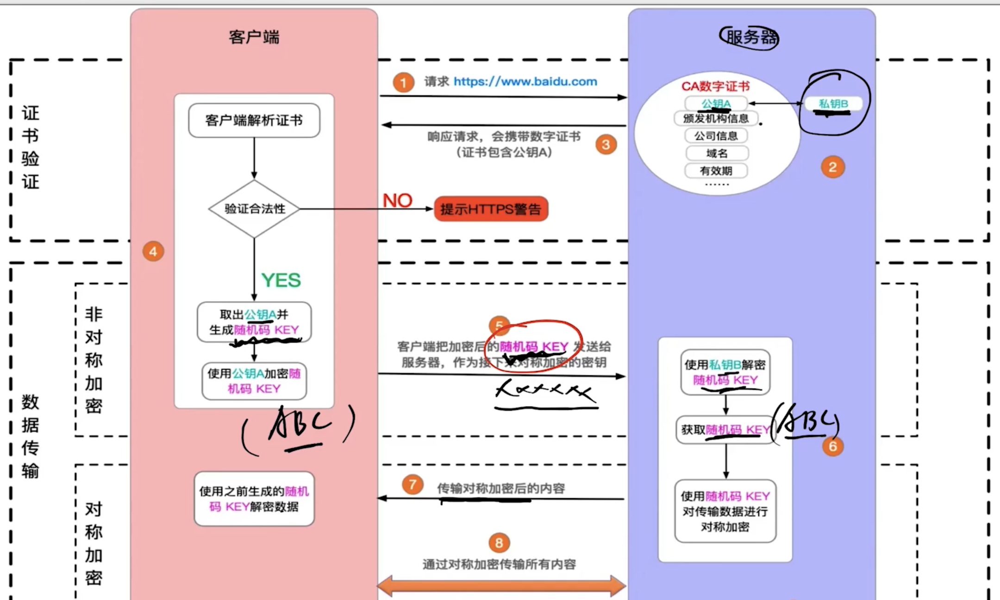

**介绍下 https 中间人攻击的过程**

这个问题也可以问成为什么需要 CA 认证机构颁发证书？

我们假设如果不存在认证机构，则人人都可以制造证书，这就带来了"中间人攻击"问题。

**中间人攻击的过程如下**

- 客户端请求被劫持，将所有的请求发送到中间人的服务器
- 中间人服务器返回自己的证书
- 客户端创建随机数，使用中间人证书中的公钥进行加密发送给中间人服务器，中间人使用私钥对随机数解密并构造对称加密，对之后传输的内容进行加密传输
- 中间人通过客户端的随机数对客户端的数据进行解密
- 中间人与服务端建立合法的 https 连接（https 握手过程），与服务端之间使用对称加密进行数据传输，拿到服务端的响应数据，并通过与服务端建立的对称加密的秘钥进行解密
- 中间人再通过与客户端建立的对称加密对响应数据进行加密后传输给客户端
- 客户端通过与中间人建立的对称加密的秘钥对数据进行解密

> 简单来说，中间人攻击中，中间人首先伪装成服务端和客户端通信，然后又伪装成客户端和服务端进行通信（如图）。 整个过程中，由于缺少了证书的验证过程，虽然使用了`https`，但是传输的数据已经被监听，客户端却无法得知

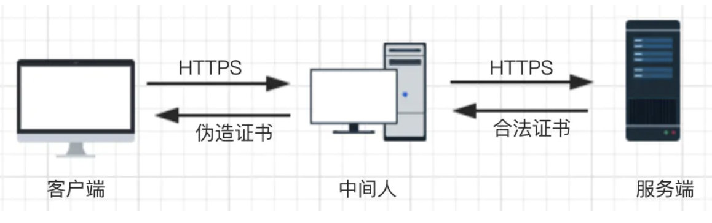

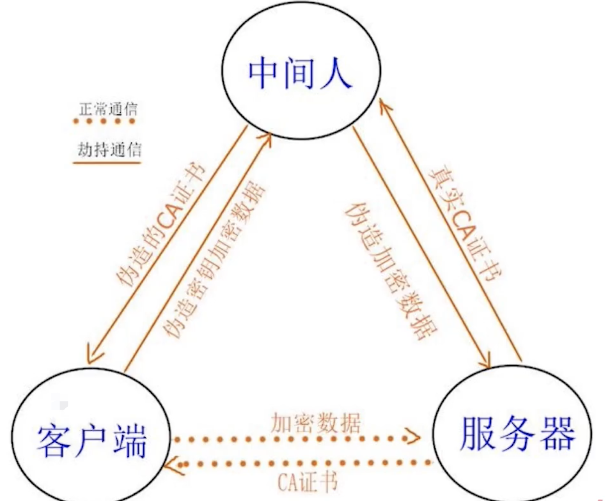

**预防中间人攻击**

> 使用正规厂商的证书，慎用免费的

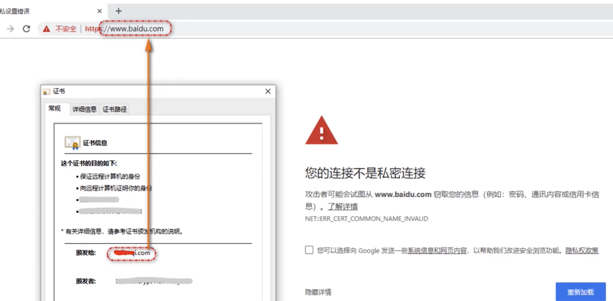
