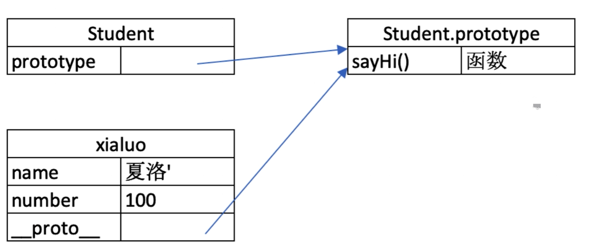
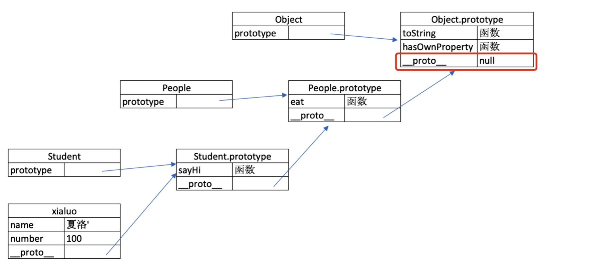
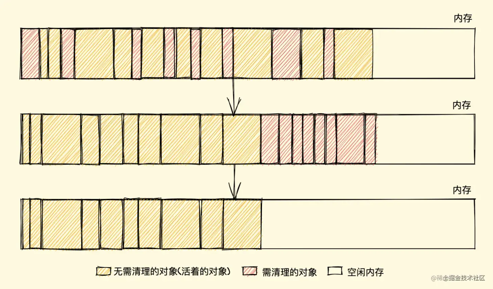
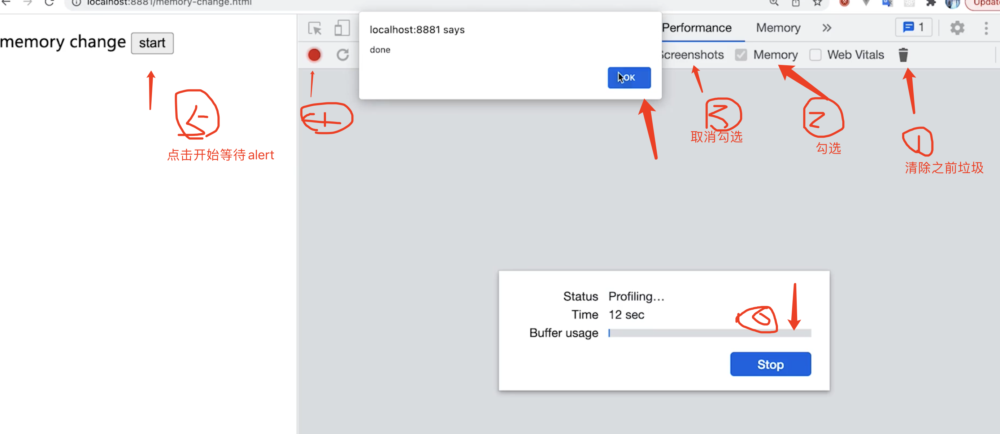
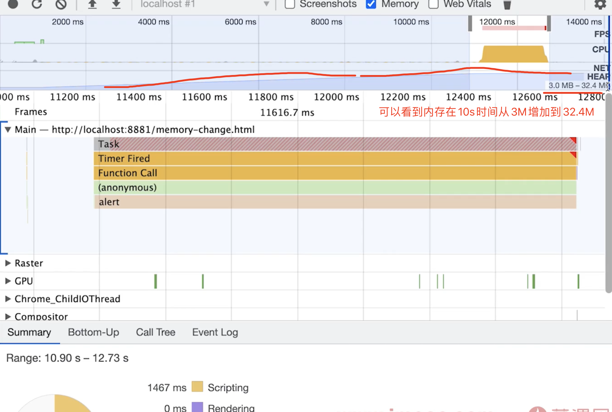
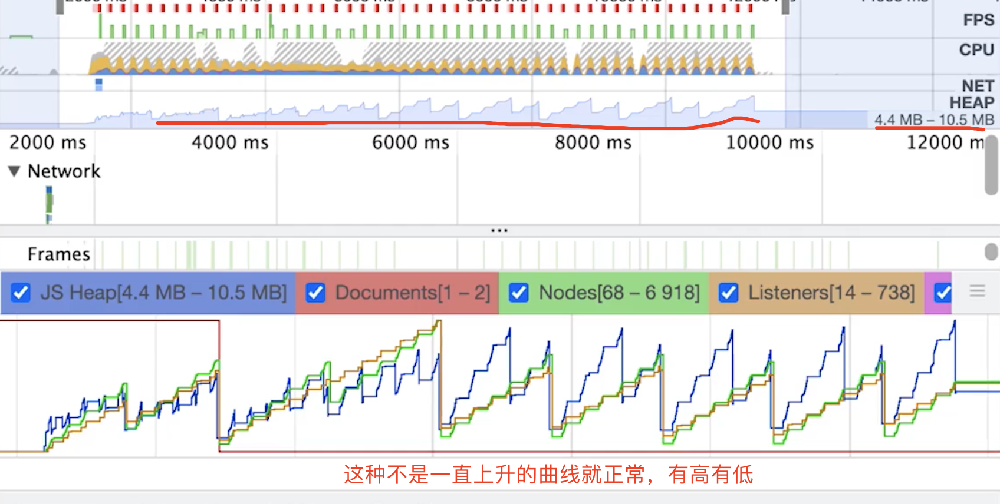
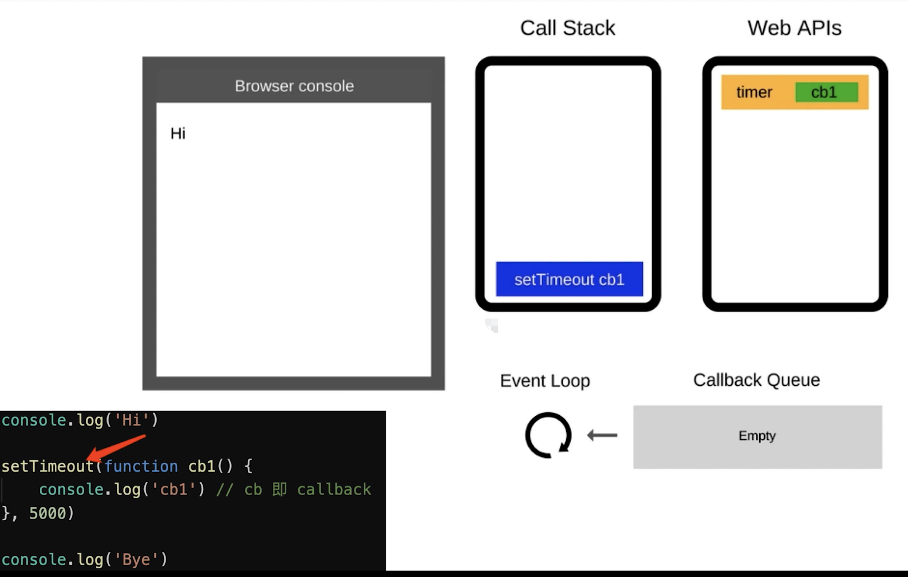
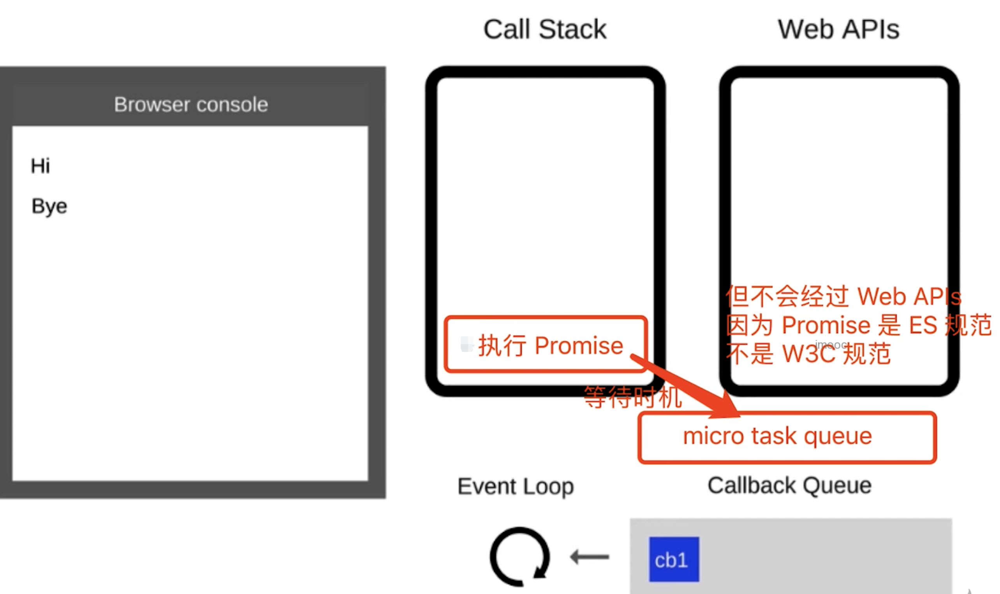
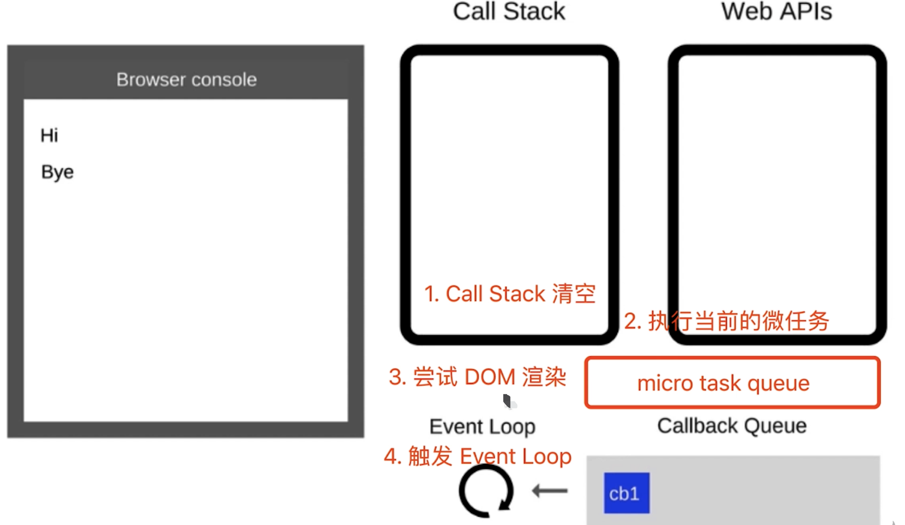
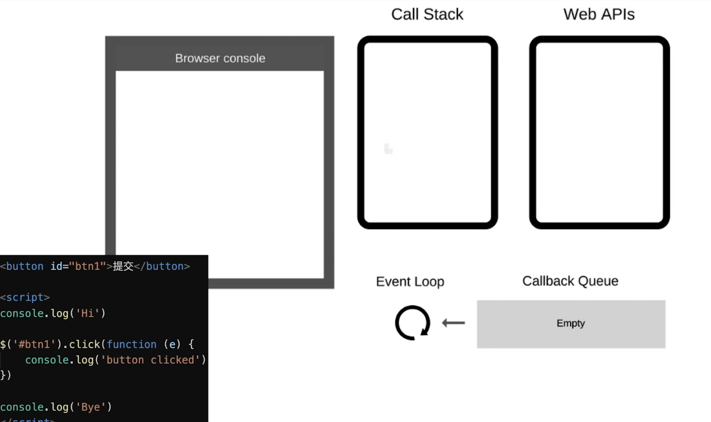

## typeof 类型判断

> `typeof` 是否能正确判断类型？`instanceof` 能正确判断对象的原理是什么

- `typeof` 对于原始类型来说，除了 `null` 都可以显示正确的类型

  typeof 1 // 'number' typeof '1' // 'string' typeof undefined // 'undefined' typeof true // 'boolean' typeof Symbol() // 'symbol'

`typeof` 对于对象来说，除了函数都会显示 `object`，所以说 `typeof` 并不能准确判断变量到底是什么类型

    typeof [] // 'object'
    typeof {} // 'object'
    typeof console.log // 'function'

如果我们想判断一个对象的正确类型，这时候可以考虑使用 `instanceof`，因为内部机制是通过原型链来判断的

    const Person = function() {}
    const p1 = new Person()
    p1 instanceof Person // true

    var str = 'hello world'
    str instanceof String // false

    var str1 = new String('hello world')
    str1 instanceof String // true

> 对于原始类型来说，你想直接通过 `instanceof`来判断类型是不行的

- `typeof`
  - 直接在计算机底层基于数据类型的值（二进制）进行检测
  - `typeof null`为`object` 原因是对象存在在计算机中，都是以`000`开始的二进制存储，所以检测出来的结果是对象
  - `typeof` 普通对象/数组对象/正则对象/日期对象 都是`object`
  - `typeof NaN === 'number'`
- `instanceof`
  - 检测当前实例是否属于这个类的
  - 底层机制：只要当前类出现在实例的原型上，结果都是 true
  - 不能检测基本数据类型
- `constructor`
  - 支持基本类型
  - `constructor`可以随便改，也不准
- `Object.prototype.toString.call([val])`
  - 返回当前实例所属类信息

**写一个 getType 函数，获取详细的数据类型**

- **获取类型**

  - 手写一个`getType`函数，传入任意变量，可准确获取类型
  - 如`number`、`string`、`boolean`等值类型
  - 引用类型`object`、`array`、`map`、`regexp`

```
    /\*\* _ 获取详细的数据类型 _ @param x x \*/
    function getType(x) {
      const originType = Object.prototype.toString.call(x) // '[object String]'
      const spaceIndex = originType.indexOf(' ')
      const type = originType.slice(spaceIndex + 1, -1) // 'String' -1 不要右边的]
      return type.toLowerCase() // 'string'
    }

    // 功能测试 console.info( getType(null) ) // null

    console.info( getType(undefined) ) // undefined

    console.info( getType(100) ) // number

    console.info( getType('abc') ) // string

    console.info( getType(true) ) // boolean

    console.info( getType(Symbol()) ) // symbol

    console.info( getType({}) ) // object

    console.info( getType([]) ) // array

    console.info( getType(() => {}) ) // function

    console.info( getType(new Date()) ) // date

    console.info( getType(new RegExp('')) ) // regexp

    console.info( getType(new Map()) ) // map

    console.info( getType(new Set()) ) // set

    console.info( getType(new WeakMap()) ) // weakmap

    console.info( getType(new WeakSet()) ) // weakset

    console.info( getType(new Error()) ) // error

    console.info( getType(new Promise(() => {})) ) // promise
```

## 类型转换

> 首先我们要知道，在 `JS` 中类型转换只有三种情况，分别是：

- 转换为布尔值
- 转换为数字
- 转换为字符串


**转 Boolean**

> 在条件判断时，除了 `undefined`，`null`， `false`， `NaN`， `''`， `0`， `-0`，其他所有值都转为 `true`，包括所有对象

**对象转原始类型**

> 对象在转换类型的时候，会调用内置的 `[[ToPrimitive]]` 函数，对于该函数来说，算法逻辑一般来说如下

- 如果已经是原始类型了，那就不需要转换了
- 调用 `x.valueOf()`，如果转换为基础类型，就返回转换的值
- 调用 `x.toString()`，如果转换为基础类型，就返回转换的值
- 如果都没有返回原始类型，就会报错

当然你也可以重写 `Symbol.toPrimitive`，该方法在转原始类型时调用优先级最高。

    let a = {
      valueOf() {
        return 0
      },
      toString() {
        return '1'
      },
      [Symbol.toPrimitive]() {
        return 2
      }
    }
    1 + a // => 3

**四则运算符**

> 它有以下几个特点：

- 运算中其中一方为字符串，那么就会把另一方也转换为字符串
- 如果一方不是字符串或者数字，那么会将它转换为数字或者字符串

  1 + '1' // '11' true + true // 2 4 + [1,2,3] // "41,2,3"

- 对于第一行代码来说，触发特点一，所以将数字 `1` 转换为字符串，得到结果 `'11'`
- 对于第二行代码来说，触发特点二，所以将 `true` 转为数字 `1`
- 对于第三行代码来说，触发特点二，所以将数组通过 `toString`转为字符串 `1,2,3`，得到结果 `41,2,3`

另外对于加法还需要注意这个表达式 `'a' + + 'b'`

    'a' + + 'b' // -> "aNaN"

- 因为 `+ 'b'` 等于 `NaN`，所以结果为 `"aNaN"`，你可能也会在一些代码中看到过 `+ '1'`的形式来快速获取 `number` 类型。
- 那么对于除了加法的运算符来说，只要其中一方是数字，那么另一方就会被转为数字

  4 _ '3' // 12 4 _ [] // 0 4 \* [1, 2] // NaN

**比较运算符**

- 如果是对象，就通过 `toPrimitive` 转换对象
- 如果是字符串，就通过 `unicode` 字符索引来比较

  let a = { valueOf() { return 0 }, toString() { return '1' } } a > -1 // true

> 在以上代码中，因为 `a` 是对象，所以会通过 `valueOf` 转换为原始类型再比较值。

## 闭包

闭包的定义其实很简单：函数 `A` 内部有一个函数 `B`，函数 `B` 可以访问到函数 `A` 中的变量，那么函数 `B` 就是闭包

    function A() {
      let a = 1
      window.B = function () {
        console.log(a)
      }
    }
    A()
    B() // 1

**闭包存在的意义就是让我们可以间接访问函数内部的变量** 经典面试题，循环中使用闭包解决 `var` 定义函数的问题

    for (var i = 1; i <= 5; i++) {
      setTimeout(function timer() {
        console.log(i)
      }, i * 1000)
    }

> 首先因为 `setTimeout` 是个异步函数，所以会先把循环全部执行完毕，这时候 `i`就是 `6` 了，所以会输出一堆 `6`

**解决办法有三种**

1. 第一种是使用闭包的方式

   for (var i = 1; i <= 5; i++) { ;(function(j) { setTimeout(function timer() { console.log(j) }, j \* 1000) })(i) }

> 在上述代码中，我们首先使用了立即执行函数将 `i` 传入函数内部，这个时候值就被固定在了参数 `j` 上面不会改变，当下次执行 `timer` 这个闭包的时候，就可以使用外部函数的变量 `j`，从而达到目的

2. 第二种就是使用 `setTimeout` 的第三个参数，这个参数会被当成 `timer` 函数的参数传入

   for (var i = 1; i <= 5; i++) { setTimeout( function timer(j) { console.log(j) }, i \* 1000, i ) }

3. 第三种就是使用 `let` 定义 `i` 了来解决问题了，这个也是最为推荐的方式

   for (let i = 1; i <= 5; i++) { setTimeout(function timer() { console.log(i) }, i \* 1000) }

## 原型与原型链

**原型关系**

- 每个`class`都有显示原型`prototype`
- 每个实例都有隐式原型`__proto__`
- 实例的`__proto__`指向`class`的`prototype`



    // 父类
    class People {
        constructor(name) {
          this.name = name
        }
        eat() {
          console.log(`${this.name} eat something`)
        }
    }

    // 子类
    class Student extends People {
      constructor(name, number) {
        super(name)
        this.number = number
      }
      sayHi() {
        console.log(`姓名 ${this.name} 学号 ${this.number}`)
      }
    }

    // 实例
    const xialuo = new Student('夏洛', 100)
    console.log(xialuo.name)
    console.log(xialuo.number)
    xialuo.sayHi()
    xialuo.eat()

**基于原型的执行规则**

获取属性`xialuo.name`或执行方法`xialuo.sayhi`时，先在自身属性和方法查找，找不到就去`__proto__`中找

**原型链**

    People.prototype === Student.prototype.__proto__



## 原型继承和 Class 继承

> 涉及面试题：原型如何实现继承？`Class` 如何实现继承？`Class` 本质是什么？

首先先来讲下 `class`，其实在 `JS`中并不存在类，`class` 只是语法糖，本质还是函数

    class Person {}
    Person instanceof Function // true

**组合继承** 组合继承是最常用的继承方式

    function Parent(value) {
      this.val = value
    }
    Parent.prototype.getValue = function() {
      console.log(this.val)
    }
    function Child(value) {
      Parent.call(this, value)
    }
    Child.prototype = new Parent()

    const child = new Child(1)

    child.getValue() // 1
    child instanceof Parent // true

- 以上继承的方式核心是在子类的构造函数中通过 `Parent.call(this)` 继承父类的属性，然后改变子类的原型为 `new Parent()` 来继承父类的函数。
- 这种继承方式优点在于构造函数可以传参，不会与父类引用属性共享，可以复用父类的函数，但是也存在一个缺点就是在继承父类函数的时候调用了父类构造函数，导致子类的原型上多了不需要的父类属性，存在内存上的浪费

**寄生组合继承** 这种继承方式对组合继承进行了优化，组合继承缺点在于继承父类函数时调用了构造函数，我们只需要优化掉这点就行了

    function Parent(value) {
      this.val = value
    }
    Parent.prototype.getValue = function() {
      console.log(this.val)
    }

    function Child(value) {
      Parent.call(this, value)
    }
    Child.prototype = Object.create(Parent.prototype, {
      constructor: {
        value: Child,
        enumerable: false,
        writable: true,
        configurable: true
      }
    })

    const child = new Child(1)

    child.getValue() // 1
    child instanceof Parent // true

> 以上继承实现的核心就是将父类的原型赋值给了子类，并且将构造函数设置为子类，这样既解决了无用的父类属性问题，还能正确的找到子类的构造函数。

**Class 继承** 以上两种继承方式都是通过原型去解决的，在 `ES6` 中，我们可以使用 `class` 去实现继承，并且实现起来很简单

    class Parent {
      constructor(value) {
        this.val = value
      }
      getValue() {
        console.log(this.val)
      }
    }
    class Child extends Parent {
      constructor(value) {
        super(value)
        this.val = value
      }
    }
    let child = new Child(1)
    child.getValue() // 1
    child instanceof Parent // true

> `class` 实现继承的核心在于使用 `extends` 表明继承自哪个父类，并且在子类构造函数中必须调用 `super`，因为这段代码可以看成 `Parent.call(this, value)`。

## 模块化

> 涉及面试题：为什么要使用模块化？都有哪几种方式可以实现模块化，各有什么特点？

使用一个技术肯定是有原因的，那么使用模块化可以给我们带来以下好处

- 解决命名冲突
- 提供复用性
- 提高代码可维护性

**立即执行函数** 在早期，使用立即执行函数实现模块化是常见的手段，通过函数作用域解决了命名冲突、污染全局作用域的问题

    (function(globalVariable){
       globalVariable.test = function() {}
       // ... 声明各种变量、函数都不会污染全局作用域
    })(globalVariable)

**AMD 和 CMD** 鉴于目前这两种实现方式已经很少见到，所以不再对具体特性细聊，只需要了解这两者是如何使用的。

    // AMD
    define(['./a', './b'], function(a, b) {
      // 加载模块完毕可以使用
      a.do()
      b.do()
    })
    // CMD
    define(function(require, exports, module) {
      // 加载模块
      // 可以把 require 写在函数体的任意地方实现延迟加载
      var a = require('./a')
      a.doSomething()
    })

**CommonJS** `CommonJS` 最早是 `Node` 在使用，目前也仍然广泛使用，比如在 `Webpack` 中你就能见到它，当然目前在 `Node` 中的模块管理已经和 `CommonJS`有一些区别了

    // a.js
    module.exports = {
        a: 1
    }
    // or
    exports.a = 1

    // b.js
    var module = require('./a.js')
    module.a // -> log 1

    ar module = require('./a.js')
    module.a
    // 这里其实就是包装了一层立即执行函数，这样就不会污染全局变量了，
    // 重要的是 module 这里，module 是 Node 独有的一个变量
    module.exports = {
        a: 1
    }

    // module 基本实现
    var module = {
      id: 'xxxx', // 我总得知道怎么去找到他吧
      exports: {} // exports 就是个空对象
    }
    // 这个是为什么 exports 和 module.exports 用法相似的原因
    var exports = module.exports
    var load = function (module) {
      // 导出的东西
      var a = 1
      module.exports = a
      return module.exports
    };
    // 然后当我 require 的时候去找到独特的id，然后将要使用的东西用立即执行函数包装下，over

> 虽然 `exports` 和 `module.exports` 用法相似，但是不能对 `exports` 直接赋值。因为 `var exports = module.exports` 这句代码表明了 `exports` 和 `module.exports`享有相同地址，通过改变对象的属性值会对两者都起效，但是**如果直接对 `exports` 赋值就会导致两者不再指向同一个内存地址，修改并不会对 `module.exports` 起效**

**ES Module**

> `ES Module` 是原生实现的模块化方案，与 `CommonJS` 有以下几个区别

1. `CommonJS` 支持动态导入，也就是 `require(${path}/xx.js)`，后者目前不支持，但是已有提案
2. `CommonJS` 是同步导入，因为用于服务端，文件都在本地，同步导入即使卡住主线程影响也不大。而后者是异步导入，因为用于浏览器，需要下载文件，如果也采用同步导入会对渲染有很大影响
3. `CommonJS` 在导出时都是值拷贝，就算导出的值变了，导入的值也不会改变，所以如果想更新值，必须重新导入一次。但是 `ES Module` 采用实时绑定的方式，导入导出的值都指向同一个内存地址，所以导入值会跟随导出值变化
4. `ES Module` 会编译成 `require/exports`来执行的

   // 引入模块 API import XXX from './a.js' import { XXX } from './a.js' // 导出模块 API export function a() {} export default function() {}

## 事件机制

> 涉及面试题：事件的触发过程是怎么样的？知道什么是事件代理嘛？

**1. 事件触发三阶段**

**事件触发有三个阶段**：

- `window`往事件触发处传播，遇到注册的捕获事件会触发
- 传播到事件触发处时触发注册的事件
- 从事件触发处往 `window` 传播，遇到注册的冒泡事件会触发

事件触发一般来说会按照上面的顺序进行，但是也有特例，如果给一个 `body` 中的子节点同时注册冒泡和捕获事件，事件触发会按照注册的顺序执行

    // 以下会先打印冒泡然后是捕获
    node.addEventListener(
      'click',
      event => {
        console.log('冒泡')
      },
      false
    )
    node.addEventListener(
      'click',
      event => {
        console.log('捕获 ')
      },
      true
    )

**2. 注册事件**

> 通常我们使用 `addEventListener` 注册事件，该函数的第三个参数可以是布尔值，也可以是对象。对于布尔值 `useCapture` 参数来说，该参数默认值为 `false` ，`useCapture` 决定了注册的事件是捕获事件还是冒泡事件。对于对象参数来说，可以使用以下几个属性

- `capture`：布尔值，和 `useCapture` 作用一样
- `once`：布尔值，值为 `true` 表示该回调只会调用一次，调用后会移除监听
- `passive`：布尔值，表示永远不会调用 `preventDefault`

一般来说，如果我们只希望事件只触发在目标上，这时候可以使用 `stopPropagation`来阻止事件的进一步传播。通常我们认为 `stopPropagation` 是用来阻止事件冒泡的，其实该函数也可以阻止捕获事件。`stopImmediatePropagation` 同样也能实现阻止事件，但是还能阻止该事件目标执行别的注册事件。

    node.addEventListener(
      'click',
      event => {
        event.stopImmediatePropagation()
        console.log('冒泡')
      },
      false
    )
    // 点击 node 只会执行上面的函数，该函数不会执行
    node.addEventListener(
      'click',
      event => {
        console.log('捕获 ')
      },
      true
    )

**3. 事件代理** 如果一个节点中的子节点是动态生成的，那么子节点需要注册事件的话应该注册在父节点上

    <ul id="ul">
    	<li>1</li>
        <li>2</li>
    	<li>3</li>
    	<li>4</li>
    	<li>5</li>
    </ul>
    <script>
      let ul = document.querySelector('#ul')
      ul.addEventListener('click', (event) => { console.log(event.target); })
    </script>

**事件代理的方式相较于直接给目标注册事件来说，有以下优点**：

- 节省内存
- 不需要给子节点注销事件

## 箭头函数

- 箭头函数不绑定 `arguments`，可以使用 `...args` 代替
- 箭头函数没有 `prototype` 属性，不能进行 `new` 实例化
- 箭头函数不能通过 `call`、`apply` 等绑定 `this`，因为箭头函数底层是使用`bind`永久绑定`this`了，`bind`绑定过的`this`不能修改
- 箭头函数的`this`指向创建时父级的`this`
- 箭头函数不能使用`yield`关键字，不能作为`Generator`函数

```
  const fn1 = () => {
    // 箭头函数中没有 arguments
    console.log('arguments', arguments)
  }
  fn1(100, 300)

  const fn2 = () => {
    // 这里的 this 指向 window，箭头函数的 this 指向创建时父级的 this
    console.log('this', this)
  }
  // 箭头函数不能修改 this
  fn2.call({x: 100})

  const obj = { name: 'poetry', getName2() {
    // 这里的 this 指向 obj
    return () => {
      // 这里的 this 指向 obj
      return this.name }
    }, getName: () => {
      // 1、不适用箭头函数的场景 1：对象方法
      // 这里不能使用箭头函数，否则箭头函数指向 window
      return this.name
      }
    }

  obj.prototype.getName3 = () => {
    // 2、不适用箭头函数的场景 2：对象原型
    // 这里不能使用箭头函数，否则 this 指向 window
    return this.name
  }

  const Foo = (name) => {
    // 3、不适用箭头函数的场景 3：构造函数
    this.name = name
  }
  const f = new Foo('poetry') // 箭头函数没有 prototype 属性，不能进行 new 实例化

  const btn1 = document.getElementById('btn1')
  btn1.addEventListener('click',()=>{
    // 4、不适用箭头函数的场景 4：动态上下文的回调函数
    // 这里不能使用箭头函数 this === window
    this.innerHTML = 'click'
    }
  )

  // Vue 组件本质上是一个 JS 对象，this 需要指向组件实例
  // vue 的生命周期和 method 不能使用箭头函数
  new Vue({
    data:{name:'poetry'},
    methods: {
      // 5、不适用箭头函数的场景 5：vue 的生命周期和 method
      getName: () => {
        // 这里不能使用箭头函数，否则 this 指向 window
        return this.name
        }
      },
    mounted:() => {
      // 这里不能使用箭头函数，否则 this 指向 window
      this.getName()
      }
    }
  )

  // React 组件（非 Hooks）它本质上是一个 ES6 class
  class Foo {
    constructor(name) {
      this.name = name
    }
    getName = () => {
      // 这里的箭头函数 this 指向实例本身没有问题的
      return this.name
    }
  }
  const f = new Foo('poetry')
  console.log(f.getName() )
```

**总结：不适用箭头函数的场景**

- 场景 1：对象方法
- 场景 2：对象原型
- 场景 3：构造函数
- 场景 4：动态上下文的回调函数
- 场景 5：vue 的生命周期和`method`

## JS 内存泄露如何检测？场景有哪些？

**内存泄漏**：当一个对象不再被使用，但是由于某种原因，它的内存没有被释放，这就是内存泄漏。

**1. 垃圾回收机制**

- 对于在 JavaScript 中的字符串，对象，数组是没有固定大小的，只有当对他们进行动态分配存储时，解释器就会分配内存来存储这些数据，当 JavaScript 的解释器消耗完系统中所有可用的内存时，就会造成系统崩溃。
- 内存泄漏，在某些情况下，不再使用到的变量所占用内存没有及时释放，导致程序运行中，内存越占越大，极端情况下可以导致系统崩溃，服务器宕机。
- JavaScript 有自己的一套垃圾回收机制，JavaScript 的解释器可以检测到什么时候程序不再使用这个对象了（数据），就会把它所占用的内存释放掉。
- 针对 JavaScript 的垃圾回收机制有以下两种方法（常用）：标记清除（现代），引用计数（之前）

**有两种垃圾回收策略：**

- **标记清除**：标记阶段即为所有活动对象做上标记，清除阶段则把没有标记（也就是非活动对象）销毁。
- **引用计数** ：它把对象是否不再需要简化定义为对象有没有其他对象引用到它。如果没有引用指向该对象（引用计数为 `0`），对象将被垃圾回收机制回收

**标记清除的缺点：**

- **内存碎片化**，空闲内存块是不连续的，容易出现很多空闲内存块，还可能会出现分配所需内存过大的对象时找不到合适的块。
- **分配速度慢** ，因为即便是使用 `First-fit` 策略，其操作仍是一个 `O(n)` 的操作，最坏情况是每次都要遍历到最后，同时因为碎片化，大对象的分配效率会更慢。

> 解决以上的缺点可以使用 **标记整理（Mark-Compact）算法** 标记结束后，标记整理算法会将活着的对象（即不需要清理的对象）向内存的一端移动，最后清理掉边界的内存（如下图）



**引用计数的缺点：**

- 需要一个计数器，所占内存空间大，因为我们也不知道被引用数量的上限。
- `解决不了循环引用导致的无法回收问题`
  - `IE 6、7`，`JS`对象和`DOM`对象循环引用，清除不了，导致内存泄露

> `V8` 的垃圾回收机制也是基于标记清除算法，不过对其做了一些优化。

- 针对新生区采用并行回收。
- 针对老生区采用增量标记与惰性回收

> **注意** ：`闭包不是内存泄露，闭包的数据是不可以被回收的`

**拓展：WeakMap、WeakMap 的作用**

- 作用是`防止内存泄露的`
- `WeakMap`、`WeakMap`的应用场景
  - 想临时记录数据或关系
  - 在`vue3`中大量使用了`WeakMap`
- `WeakMap`的`key`只能是对象，不能是基本类型

**2. 如何检测内存泄露**

内存泄露模拟

    <p>
      memory change
      <button id="btn1">start</button>
    </p>

    <script>
      const arr = []
      for (let i = 0; i < 10 * 10000; i++) {
        arr.push(i)
      }
      function bind() {
        // 模拟一个比较大的数据
        const obj = {
          str: JSON.stringify(arr) // 简单的拷贝
        }
        window.addEventListener('resize', () => {
          console.log(obj)
        })
      }
      let n = 0
      function start() {
        setTimeout(() => {
          bind() n++ // 执行 50 次
          if (n < 50) {
            start()
          } else {
            alert('done')
          }
        }, 200)
      }
      document.getElementById('btn1').addEventListener('click', () => { start() })
    </script>

打开开发者工具，选择 `Performance`，点击 `Record`，然后点击 `Stop`，在 `Memory` 选项卡中可以看到内存的使用情况。







**3. 内存泄露的场景（Vue 为例）**

- 被全局变量、函数引用，组件销毁时未清除
- 被全局事件、定时器引用，组件销毁时未清除
- 被自定义事件引用，组件销毁时未清除

    <template>
      <p>Memory Leak Demo</p>
    </template>

    <script> export default { name: 'Memory Leak Demo', data() { return { arr: [10, 20, 30], // 数组 对象 } }, methods: { printArr() { console.log(this.arr) } }, mounted() { // 全局变量 window.arr = this.arr window.printArr = ()=>{ console.log(this.arr) } // 定时器 this.intervalId = setInterval(() => { console.log(this.arr) }, 1000) // 全局事件 window.addEventListener('resize', this.printArr) // 自定义事件也是这样 }, // Vue2是beforeDestroy beforeUnmount() { // 清除全局变量 window.arr = null window.printArr = null // 清除定时器 clearInterval(this.intervalId) // 清除全局事件 window.removeEventListener('resize', this.printArr) }, } </script>

**4. 拓展 WeakMap WeakSet**

`weakmap` 和 `weakset` 都是弱引用，不会阻止垃圾回收机制回收对象。

    const map = new Map()
    function fn1() {
      const obj = { x: 100 }
      map.set('a', obj) // fn1执行完 map还引用着obj
    }
    fn1()

    const wMap = new WeakMap() // 弱引用
    function fn1() {
      const obj = { x: 100 }
      // fn1执行完 obj会被清理掉
      wMap.set(obj, 100) // weakMap 的 key 只能是引用类型，字符串数字都不行
    }
    fn1()

## async/await 异步总结

**知识点总结**

- `promise.then`链式调用，但也是基于回调函数
- `async/await`是同步语法，彻底消灭回调函数

**async/await 和 promise 的关系**

- 执行`async`函数，返回的是`promise`

```
  async function fn2() {
    return new Promise(() => {})
  }
  console.log( fn2() )

  async function fn1() {
    return 100
  }
  console.log( fn1() ) // 相当于 Promise.resolve(100)
```

- `await`相当于`promise`的`then`
- `try catch`可捕获异常，代替了`promise`的`catch`
- `await` 后面跟 `Promise` 对象：会阻断后续代码，等待状态变为 `fulfilled` ，才获取结果并继续执行
- `await` 后续跟非 `Promise` 对象：会直接返回

```
  (async function () {
    const p1 = new Promise(() => {})
    await p1 console.log('p1') // 不会执行
  })()

  (async function () {
    const p2 = Promise.resolve(100)
    const res = await p2
    console.log(res) // 100
  })()

  (async function () {
    const res = await 100
    console.log(res) // 100
  })()

  (async function () {
    const p3 = Promise.reject('some err') // rejected 状态，不会执行下面的
    then const res = await p3
    // await 相当于 then
    console.log(res) // 不会执行
  })()

 // `try...catch` 捕获 `rejected` 状态

  (async function () {
    const p4 = Promise.reject('some err')
    try {
      const res = await p4
      console.log(res)
    } catch (ex) {
      console.error(ex)
    }
  })()
```

**总结来看：**

- `async` 封装 `Promise`
- `await` 处理 `Promise` 成功
- `try...catch` 处理 `Promise` 失败

**异步本质**

`await` 是同步写法，但本质还是异步调用。

    async function async1 () {
      console.log('async1 start')
      await async2()
      console.log('async1 end') // 关键在这一步，它相当于放在 callback 中，最后执行
      // 类似于Promise.resolve().then(()=>console.log('async1 end'))
    }

    async function async2 () {
      console.log('async2')
    }

    console.log('script start')
    async1()
    console.log('script end')

    // 打印
    // script start
    // async1 start
    // async2
    // script end
    // async1 end

    async function async1 () {
      console.log('async1 start') // 2
      await async2()

      // await后面的下面三行都是异步回调callback的内容
      console.log('async1 end') // 5 关键在这一步，它相当于放在 callback 中，最后执行
      // 类似于Promise.resolve().then(()=>console.log('async1 end'))
      await async3()

      // await后面的下面1行都是异步回调callback的内容
      console.log('async1 end2') // 7
    }

    async function async2 () {
      console.log('async2') // 3
    }
    async function async3 () {
      console.log('async3') // 6
    }

    console.log('script start') // 1
    async1()
    console.log('script end') // 4

> 即，只要遇到了 `await` ，后面的代码都相当于放在 `callback`(微任务) 里。

**执行顺序问题**

网上很经典的面试题

    async function async1 () {
      console.log('async1 start')
      await async2() // 这一句会同步执行，返回 Promise ，其中的 `console.log('async2')` 也会同步执行
      console.log('async1 end') // 上面有 await ，下面就变成了"异步"，类似 cakkback 的功能（微任务）
    }

    async function async2 () {
      console.log('async2')
    }

    console.log('script start')

    setTimeout(function () { // 异步，宏任务
      console.log('setTimeout')
    }, 0)

    async1()

    new Promise (function (resolve) { // 返回 Promise 之后，即同步执行完成，then 是异步代码
      console.log('promise1') // Promise 的函数体会立刻执行
      resolve()
    }).then (function () { // 异步，微任务
      console.log('promise2')
    })

    console.log('script end')

    // 同步代码执行完之后，屡一下现有的异步未执行的，按照顺序
    // 1. async1 函数中 await 后面的内容 ------ 微任务（先注册先执行）
    // 2. setTimeout ------ 宏任务（先注册先执行）
    // 3. then ------ 微任务

    // 同步代码执行完毕（event loop - call stack被清空）
    // 执行微任务
    // 尝试DOM渲染
    // 触发event loop执行宏任务

    // 输出
    // script start
    // async1 start
    // async2
    // promise1
    // script end
    // async1 end
    // promise2
    // setTimeout

**关于 for...of**

- `for in`以及`forEach`都是常规的同步遍历
- `for of`用于异步遍历

```
  // 定时算乘法
  function multi(num) {
    return new Promise((resolve) => {
      setTimeout(() => {
        resolve(num \* num)
      }, 1000)
    })
  }


// 使用 forEach ，是 1s 之后打印出所有结果，即 3 个值是一起被计算出来的
function test1 () {
  const nums = [1, 2, 3];
  nums.forEach(async x => {
    const res = await multi(x);
     console.log(res); // 一次性打印
    })
  }
test1();

// 使用 for...of ，可以让计算挨个串行执行
async function test2 () {
  const nums = [1, 2, 3];
  for (let x of nums) {
    // 在 for...of 循环体的内部，遇到 await 会挨个串行计算
    const res = await multi(x)
    console.log(res) // 依次打印
  }
}
test2()
```

## Promise 异步总结

**知识点总结**

- **三种状态**
  - `pending`、`fulfilled`(通过`resolve`触发)、`rejected`(通过`reject`触发)
  - `pending => fulfilled`或者`pending => rejected`
  - 状态变化不可逆
- **状态的表现和变化**
  - `pending`状态，不会触发`then`和`catch`
  - `fulfilled`状态会触发后续的`then`回调
  - `rejected`状态会触发后续的`catch`回调
- **then 和 catch 对状态的影响（重要）**

  - `then`正常返回`fulfilled`，里面有报错返回`rejected`

```
    const p1 = Promise.resolve().then(()=>{
      return 100
    })
    console.log('p1', p1) // fulfilled 会触发后续 then 回调

    p1.then(()=>{
      console.log(123)
    }) // 打印 123

    const p2 = Promise.resolve().then(()=>{
      throw new Error('then error')
    })
    // p2 是 rejected 会触发后续 catch 回调
    p2.then(()=>{
      console.log(456)
    }).catch(err=>{
      console.log(789)
    }) // 打印 789

 //  `catch`正常返回`fulfilled`，里面有报错返回`rejected`

    const p1 = Promise.reject('my error').catch(()=>{
      console.log('catch error')
    })
    p1.then(()=>{
      console.log(1)
    }) // console.log(p1) p1 返回 fulfilled 触发 then 回调

    const p2 = Promise.reject('my error').catch(()=>{
      throw new Error('catch error')
    }) // console.log(p2) p2 返回 rejected 触发 catch 回调
    p2.then(()=>{
      console.log(2)
    }).catch(()=>{
      console.log(3)
    })
```

**promise then 和 catch 的链接**

    // 第一题
    Promise.resolve()
    .then(()=>console.log(1))// 状态返回fulfilled
    .catch(()=>console.log(2)) // catch中没有报错，状态返回fulfilled，后面的then会执行
    .then(()=>console.log(3)) // 1,3
    // 整个执行完没有报错，状态返回fulfilled

    // 第二题
    Promise.resolve()
    .then(()=>{ // then中有报错 状态返回rejected,后面的catch会执行
      console.log(1)
      throw new Error('error')
    })
    .catch(()=>console.log(2)) // catch中没有报错，状态返回fulfilled，后面的then会执行
    .then(()=>console.log(3)) // 1,2,3
    // 整个执行完没有报错，状态返回fulfilled

    // 第三题
    Promise.resolve()
    .then(()=>{//then中有报错 状态返回rejected，后面的catch会执行
      console.log(1)
      throw new Error('error')
    })
    .catch(()=>console.log(2)) // catch中没有报错，状态返回fulfilled，后面的catch不会执行
    .catch(()=>console.log(3)) // 1，2
    // 整个执行完没有报错，状态返回fulfilled

## Event Loop 执行机制过程







- 同步代码一行行放到`Call Stack`执行，执行完就出栈
- 遇到异步优先记录下，等待时机（定时、网络请求）
- 时机到了就移动到`Call Queue`(宏任务队列)
  - 如果遇到微任务（如`promise.then`）放到微任务队列
  - 宏任务队列和微任务队列是分开存放的
    - 因为微任务是`ES6`语法规定的
    - 宏任务(`setTimeout`)是浏览器规定的
- 如果`Call Stack`为空，即同步代码执行完，`Event Loop`开始工作
  - `Call Stack`为空，尝试先`DOM`渲染，在触发下一次`Event Loop`
- 轮询查找`Event Loop`，如有则移动到`Call Stack`
- 然后继续重复以上过程（类似永动机）

**DOM 事件和 Event Loop**

> `DOM`事件会放到`Web API中`等待用户点击，放到`Call Queue`，在移动到`Call Stack`执行



- `JS`是单线程的，异步(`setTimeout`、`Ajax`)使用回调，基于`Event Loop`
- `DOM`事件也使用回调，`DOM`事件非异步，但也是基于`Event Loop`实现

**宏任务和微任务**

- **介绍**

  - 宏任务：`setTimeout` 、`setInterval` 、`DOM`事件、`Ajax`
  - 微任务：`Promise.then`、`async/await`
  - 微任务比宏任务执行的更早

```
    console.log(100)
    setTimeout(() => {
      console.log(200)
    })
    Promise.resolve().then(() => {
      console.log(300)
    })
    console.log(400) // 100 400 300 200
```

- **event loop 和 DOM 渲染**

  - 每次`call stack`清空（每次轮询结束），即同步代码执行完。都是`DOM`重新渲染的机会，`DOM`结构如有改变重新渲染
  - 再次触发下一次`Event Loop`

```
    const $p1 = $('<p>一段文字</p>')
    const $p2 = $('<p>一段文字</p>')
    const $p3 = $('<p>一段文字</p>')
    $('#container').append($p1) .append($p2).append($p3)

    console.log('length', $('#container').children().length )
    alert('本次 call stack 结束，DOM 结构已更新，但尚未触发渲染')
    // （alert 会阻断 js 执行，也会阻断 DOM 渲染，便于查看效果）
    // 到此，即本次 call stack 结束后（同步任务都执行完了），浏览器会自动触发渲染，不用代码干预

    // 另外，按照 event loop 触发 DOM 渲染时机，setTimeout 时 alert ，就能看到 DOM 渲染后的结果了
    setTimeout(function () {
      alert('setTimeout 是在下一次 Call Stack ，就能看到 DOM 渲染出来的结果了')
    })
```

- **宏任务和微任务的区别**

  - 宏任务：`DOM` 渲染后再触发，如`setTimeout`
  - 微任务：`DOM` 渲染前会触发，如`Promise`

```
    // 修改 DOM
    const $p1 = $('<p>一段文字</p>')
    const $p2 = $('<p>一段文字</p>')
    const $p3 = $('<p>一段文字</p>')
    $('#container').append($p1) .append($p2).append($p3)


    // 微任务：渲染之前执行（DOM 结构已更新，看不到元素还没渲染）
    Promise.resolve().then(() => {
      const length = $('#container').children().length
      alert(`micro task ${length}`) // DOM 渲染了？No
    })

    // 宏任务：渲染之后执行（DOM 结构已更新，可以看到元素已经渲染）
    setTimeout(() => {
      const length = $('#container').children().length
      alert(`macro task ${length}`) // DOM 渲染了？Yes
    })
```

> 再深入思考一下：为何两者会有以上区别，一个在渲染前，一个在渲染后？

- **微任务** ：`ES` 语法标准之内，`JS` 引擎来统一处理。即，不用浏览器有任何干预，即可一次性处理完，更快更及时。
- **宏任务** ：`ES` 语法没有，`JS` 引擎不处理，浏览器（或 `nodejs`）干预处理。


总结：正确的一次 Event loop 顺序是这样

- 执行同步代码，这属于宏任务
- 执行栈为空，查询是否有微任务需要执行
- 执行所有微任务
- 必要的话渲染 `UI`
- 然后开始下一轮 `Event loop`，执行宏任务中的异步代码

> 通过上述的 `Event loop` 顺序可知，如果宏任务中的异步代码有大量的计算并且需要操作 `DOM` 的话，为了更快的响应界面响应，我们可以把操作 `DOM` 放入微任务中

```

```
