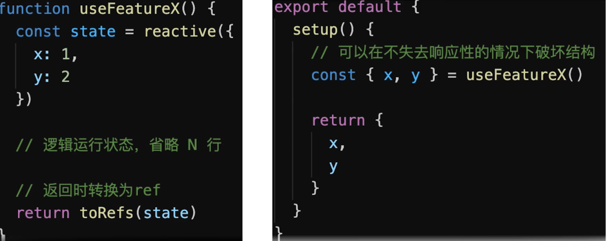
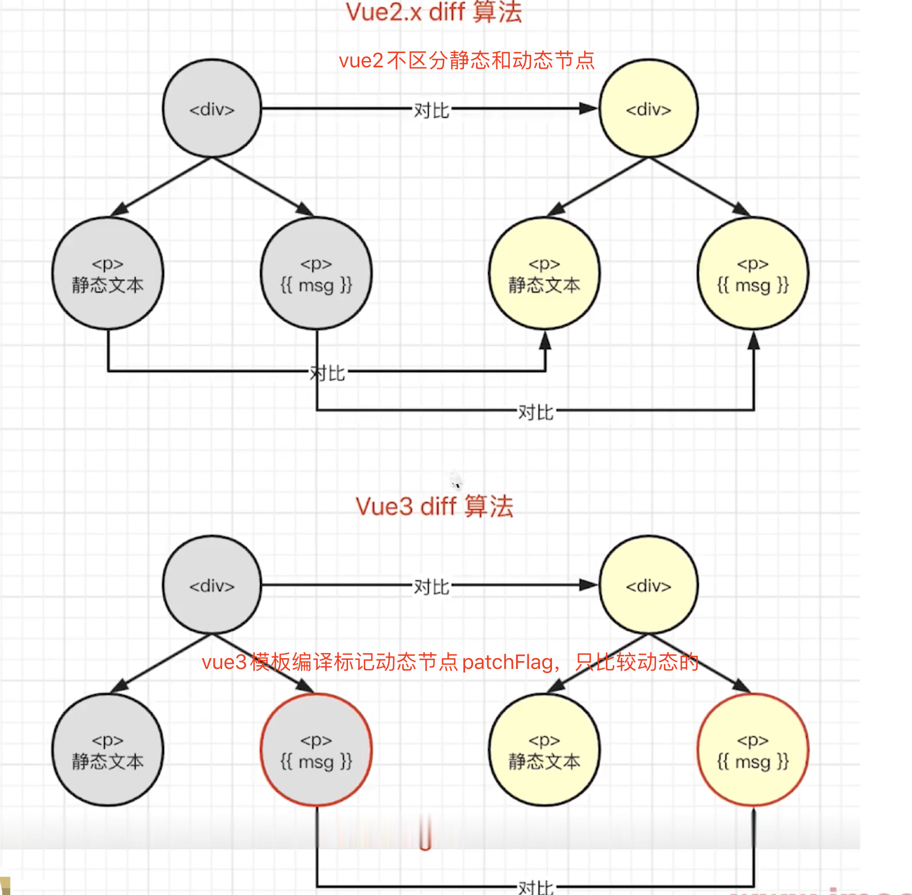

## vue3 对 vue2 有什么优势

- 性能更好（编译优化、使用`proxy`等）
- 体积更小
- 更好的`TS`支持
- 更好的代码组织
- 更好的逻辑抽离
- 更多新功能

## vue3 和 vue2 的生命周期有什么区别

**`Options API`生命周期**

- `beforeDestroy`改为`beforeUnmount`
- `destroyed`改为`umounted`
- 其他沿用`vue2`生命周期

**`Composition API`生命周期**

```js
import { onBeforeMount, onMounted, onBeforeUpdate, onUpdated, onBeforeUnmount, onUnmounted } from "vue";

export default {
  name: "LifeCycles",
  props: {
    msg: String
  },
  // setup等于 beforeCreate 和 created
  setup() {
    console.log("setup");

    onBeforeMount(() => {
      console.log("onBeforeMount");
    });
    onMounted(() => {
      console.log("onMounted");
    });
    onBeforeUpdate(() => {
      console.log("onBeforeUpdate");
    });
    onUpdated(() => {
      console.log("onUpdated");
    });
    onBeforeUnmount(() => {
      console.log("onBeforeUnmount");
    });
    onUnmounted(() => {
      console.log("onUnmounted");
    });
  },

  // 兼容vue2生命周期 options API和composition API生命周期二选一
  beforeCreate() {
    console.log("beforeCreate");
  },
  created() {
    console.log("created");
  },
  beforeMount() {
    console.log("beforeMount");
  },
  mounted() {
    console.log("mounted");
  },
  beforeUpdate() {
    console.log("beforeUpdate");
  },
  updated() {
    console.log("updated");
  },
  // beforeDestroy 改名
  beforeUnmount() {
    console.log("beforeUnmount");
  },
  // destroyed 改名
  unmounted() {
    console.log("unmounted");
  }
};
```

## 如何理解 Composition API 和 Options API

**composition API 对比 Option API**

- Composition API 带来了什么
  - 更好的代码组织
  - 更好的逻辑复用
  - 更好的类型推导
- Composition API 和 Options API 如何选择
  - 不建议共用，会引起混乱
  - 小型项目、业务逻辑简单，用`Option API`成本更小一些
  - 中大型项目、逻辑复杂，用`Composition API`

## ref 如何使用

**ref**

- 生成值类型的响应式数据
- 可用于模板和`reactive`
- 通过`.value`修改值

    <template>
        <p>ref demo {{ageRef}} {{state.name}}</p>
    </template>

    <script> import { ref, reactive } from 'vue' export default { name: 'Ref', setup() { const ageRef = ref(20) // 值类型 响应式 const nameRef = ref('test') const state = reactive({ name: nameRef }) setTimeout(() => { console.log('ageRef', ageRef.value) ageRef.value = 25 // .value 修改值 nameRef.value = 'testA' }, 1500); return { ageRef, state } } } </script>

    <!-- ref获取dom节点 -->
    <template>
        <p ref="elemRef">我是一行文字</p>
    </template>

    <script> import { ref, onMounted } from 'vue' export default { name: 'RefTemplate', setup() { const elemRef = ref(null) onMounted(() => { console.log('ref template', elemRef.value.innerHTML, elemRef.value) }) return { elemRef } } } </script>

## toRef 和 toRefs 如何使用和最佳方式

**toRef**

- 针对一个响应式对象（`reactive`封装的）的一个属性，创建一个`ref`，具有响应式
- 两者保持引用关系

**toRefs**

- 将响应式对象（`reactive`封装的）转化为普通对象
- 对象的每个属性都是对象的`ref`
- 两者保持引用关系

合成函数返回响应式对象



**最佳使用方式**

- 用`reactive`做对象的响应式，用`ref`做值类型响应式（基本类型）
- `setup`中返回`toRefs(state)`，或者`toRef(state, 'prop')`
- `ref`的变量命名都用`xxRef`
- 合成函数返回响应式对象时，使用`toRefs`，有助于使用方对数据进行解构时，不丢失响应式

    <template>
        <p>toRef demo - {{ageRef}} - {{state.name}} {{state.age}}</p>
    </template>

    <script> import { ref, toRef, reactive } from 'vue' export default { name: 'ToRef', setup() { const state = reactive({ age: 20, name: 'test' }) const age1 = computed(() => { return state.age + 1 }) // toRef 如果用于普通对象（非响应式对象），产出的结果不具备响应式 // const state = { // age: 20, // name: 'test' // } // 一个响应式对象state其中一个属性要单独拿出来实现响应式用toRef const ageRef = toRef(state, 'age') setTimeout(() => { state.age = 25 }, 1500) setTimeout(() => { ageRef.value = 30 // .value 修改值 }, 3000) return { state, ageRef } } } </script>

    <template>
        <p>toRefs demo {{age}} {{name}}</p>
    </template>

    <script> import { ref, toRef, toRefs, reactive } from 'vue' export default { name: 'ToRefs', setup() { const state = reactive({ age: 20, name: 'test' }) const stateAsRefs = toRefs(state) // 将响应式对象，变成普通对象 // const { age: ageRef, name: nameRef } = stateAsRefs // 每个属性，都是 ref 对象 // return { // ageRef, // nameRef // } setTimeout(() => { state.age = 25 }, 1500) return stateAsRefs } } </script>

## 深入理解为什么需要 ref、toRef、toRefs

**为什么需要用 ref**

- 返回值类型，会丢失响应式
- 如在`setup`、`computed`、合成函数，都有可能返回值类型
- `Vue`如不定义`ref`，用户将制造`ref`，反而更混乱

**为何 ref 需要.value 属性**

- `ref`是一个对象（不丢失响应式），`value`存储值
- 通过`.value`属性的`get`和`set`实现响应式
- 用于模板、`reactive`时，不需要`.value`，其他情况都要

**为什么需要 toRef 和 toRefs**

- **初衷** ：不丢失响应式的情况下，把对象数据 `分解/扩散`
- **前端** ：针对的是响应式对象（`reactive`封装的）非普通对象
- 注意：**不创造** 响应式，而是**延续**响应式

    <template>
        <p>why ref demo {{state.age}} - {{age1}}</p>
    </template>

    <script> import { ref, toRef, toRefs, reactive, computed } from 'vue' function useFeatureX() { const state = reactive({ x: 1, y: 2 }) return toRefs(state) } export default { name: 'WhyRef', setup() { // 解构不丢失响应式 const { x, y } = useFeatureX() const state = reactive({ age: 20, name: 'test' }) // computed 返回的是一个类似于 ref 的对象，也有 .value const age1 = computed(() => { return state.age + 1 }) setTimeout(() => { state.age = 25 }, 1500) return { state, age1, x, y } } } </script>

## vue3 升级了哪些重要功能

**1. createApp**

    // vue2
    const app = new Vue({/**选项**/})
    Vue.use(/****/)
    Vue.mixin(/****/)
    Vue.component(/****/)
    Vue.directive(/****/)

    // vue3
    const app = createApp({/**选项**/})
    app.use(/****/)
    app.mixin(/****/)
    app.component(/****/)
    app.directive(/****/)

**2. emits 属性**

    // 父组件
    <Hello :msg="msg" @onSayHello="sayHello">

    // 子组件
    export default {
        name: 'Hello',
        props: {
            msg: String
        },
        emits: ['onSayHello'], // 声明emits
        setup(props, {emit}) {
            emit('onSayHello', 'aaa')
        }
    }

**3. 多事件**

    <!-- 定义多个事件 -->
    <button @click="one($event),two($event)">提交</button>

**4. Fragment**

    <!-- vue2 -->
    <template>
        <div>
            <h2>{{title}}</h2>
            <p>test</p>
        </div>
    </template>

    <!-- vue3：不在使用div节点包裹 -->
    <template>
        <h2>{{title}}</h2>
        <p>test</p>
    </template>

**5. 移除.sync**

    <!-- vue2 -->
    <MyComponent :title.sync="title" />

    <!-- vue3 简写 -->
    <MyComponent v-model:title="title" />
    <!-- 非简写 -->
    <MyComponent :title="title" @update:title="title = $event" />

**.sync 用法**

父组件把属性给子组件，子组件修改了后还能同步到父组件中来

    <template>
      <button @click="close">关闭</button>
    </template>
    <script> export default { props: { isVisible: { type: Boolean, default: false } }, methods: { close () { this.$emit('update:isVisible', false); } } }; </script>

    <!-- 父组件使用 -->
    <chlid-component :isVisible.sync="isVisible"></chlid-component>

    <text-doc :title="doc.title" @update:title="doc.title = $event"></text-doc>

    <!-- 为了方便期间，为这种模式提供一个简写 .sync -->
    <text-doc :title.sync="doc.title" />

**6. 异步组件的写法**

    // vue2写法
    new Vue({
        components: {
            'my-component': ()=>import('./my-component.vue')
        }
    })

    // vue3写法
    import {createApp, defineAsyncComponent} from 'vue'

    export default {
        components: {
            AsyncComponent: defineAsyncComponent(()=>import('./AsyncComponent.vue'))
        }
    }

**7. 移除 filter**

    <!-- 以下filter在vue3中不可用了 -->

    <!-- 在花括号中 -->
    {message | capitalize}

    <!-- 在v-bind中 -->
    <div v-bind:id="rawId | formatId"></div>

**8. Teleport**

    <button @click="modalOpen = true">
     open
    </button>

    <!-- 通过teleport把弹窗放到body下 -->
    <teleport to="body">
     <div v-if="modalOpen" classs="modal">
       <div>
         teleport弹窗，父元素是body
         <button @click="modalOpen = false">close</button>
       </div>
     </div>
    </teleport>

**9. Suspense**

    <Suspense>
     <template>
        <!-- 异步组件 -->
       <Test1 />
     </template>
     <!-- fallback是一个具名插槽，即Suspense内部有两个slot，一个具名插槽fallback -->
     <template #fallback>
        loading...
     </template>
    </Suspense>

**10. Composition API**

- `reactive`
- `ref`
- `readonly`
- `watch`和`watchEffect`
- `setup`
- 生命周期钩子函数

## Composition API 如何实现逻辑复用

- 抽离逻辑代码到一个函数
- 函数命名约定为`useXx`格式（`React Hooks`也是）
- 在`setup`中引用`useXx`函数

```vue
<template>
  <p>mouse position {{ x }} {{ y }}</p>
</template>

<script>
import { reactive } from "vue";
import useMousePosition from "./useMousePosition";
// import useMousePosition2 from './useMousePosition'
export default {
  name: "MousePosition",
  setup() {
    const { x, y } = useMousePosition();
    return { x, y };
    // const state = useMousePosition2()
    // return { // state // }
  }
};
</script>
```

```js
    import { reactive, ref, onMounted, onUnmounted } from 'vue'
    function useMousePosition() { const x = ref(0) const y = ref(0)
        function update(e) {
            x.value = e.pageX
            y.value = e.pageY
        }
        onMounted(() => {
            console.log('useMousePosition mounted')
            window.addEventListener('mousemove', update)
        })
        onUnmounted(() => {
            console.log('useMousePosition unMounted')
            window.removeEventListener('mousemove', update)
        })
        // 合成函数尽量返回ref或toRefs(state) state = reactive({})
        // 这样在使用的时候可以解构但不丢失响应式
        return {
            x,
            y
        }
    }

    // function useMousePosition2() { // const state = reactive({ // x: 0, // y: 0 // })

    // function update(e) { // state.x = e.pageX // state.y = e.pageY // }

    // onMounted(() => { // console.log('useMousePosition mounted') // window.addEventListener('mousemove', update) // })

    // onUnmounted(() => { // console.log('useMousePosition unMounted') // window.removeEventListener('mousemove', update) // })

    // return state // }

    export default useMousePosition
    // export default useMousePosition2
```

## Vue3 如何实现响应式

- 回顾`vue2`的`Object.defineProperty`
- 缺点
  - 深度监听对象需要一次性递归
  - 无法监听新增属性、删除属性(`Vue.set`、`Vue.delete`)
  - 无法监听原生数组，需要特殊处理
- 学习`proxy`语法
- `Vue3`中如何使用`proxy`实现响应式

## Proxy 基本使用

    // const data = {
    // name: 'zhangsan',
    // age: 20,
    // }
    const data = ['a', 'b', 'c']

    const proxyData = new Proxy(data, {
        get(target, key, receiver) {
            // 只处理本身（非原型的）属性
            const ownKeys = Reflect.ownKeys(target)
            if (ownKeys.includes(key)) {
                console.log('get', key) // 监听
            }

            const result = Reflect.get(target, key, receiver)
            return result // 返回结果
        },
        set(target, key, val, receiver) {
            // 重复的数据，不处理
            if (val === target[key]) {
                return true
            }

            const result = Reflect.set(target, key, val, receiver)
            console.log('set', key, val)
            // console.log('result', result) // true
            return result // 是否设置成功
        },
        deleteProperty(target, key) {
            const result = Reflect.deleteProperty(target, key)
            console.log('delete property', key)
            // console.log('result', result) // true
            return result // 是否删除成功
        }
    })

## vue3 用 Proxy 实现响应式

- 深度监听，性能更好（获取到哪一层才触发响应式`get`，不是一次性递归）
- 可监听`新增/删除`属性
- 可监听数组变化

```js
// 创建响应式
function reactive(target = {}) {
  if (typeof target !== "object" || target == null) {
    // 不是对象或数组，则返回
    return target;
  }

  // 代理配置
  const proxyConf = {
    get(target, key, receiver) {
      // 只处理本身（非原型的）属性
      const ownKeys = Reflect.ownKeys(target);
      if (ownKeys.includes(key)) {
        console.log("get", key); // 监听
      }

      const result = Reflect.get(target, key, receiver);

      // 深度监听
      // 性能如何提升的？获取到哪一层才触发响应式get，不是一次性递归
      return reactive(result);
    },
    set(target, key, val, receiver) {
      // 重复的数据，不处理
      if (val === target[key]) {
        return true;
      }

      const ownKeys = Reflect.ownKeys(target);
      if (ownKeys.includes(key)) {
        console.log("已有的 key", key);
      } else {
        console.log("新增的 key", key);
      }

      const result = Reflect.set(target, key, val, receiver);
      console.log("set", key, val);
      // console.log('result', result) // true
      return result; // 是否设置成功
    },
    deleteProperty(target, key) {
      const result = Reflect.deleteProperty(target, key);
      console.log("delete property", key);
      // console.log('result', result) // true
      return result; // 是否删除成功
    }
  };

  // 生成代理对象
  const observed = new Proxy(target, proxyConf);
  return observed;
}

// 测试数据
const data = {
  name: "zhangsan",
  age: 20,
  info: {
    city: "shenshen",
    a: {
      b: {
        c: {
          d: {
            e: 100
          }
        }
      }
    }
  }
};

const proxyData = reactive(data);
```

## v-model 参数的用法

    <!-- UserInfo组件 -->
    <template>
        <input :value="name" @input="$emit('update:name', $event.target.value)"/>
        <input :value="age" @input="$emit('update:age', $event.target.value)"/>
    </template>

    <script> export default { name: 'UserInfo', props: { name: String, age: String } } </script>

    <!-- 使用 -->
    <user-info v-model:name="name" v-model:age="age" ></user-info>

## watch 和 watchEffect 的区别

- 两者都可以监听`data`属性变化
- `watch`需要明确监听哪个属性
- `watchEffect`会根据其中的属性，自动监听其变化

    <template>
        <p>watch vs watchEffect</p>
        <p>{{numberRef}}</p>
        <p>{{name}} {{age}}</p>
    </template>

    <script> import { reactive, ref, toRefs, watch, watchEffect } from 'vue' export default { name: 'Watch', setup() { const numberRef = ref(100) const state = reactive({ name: 'test', age: 20 }) watchEffect(() => { // 初始化时，一定会执行一次（收集要监听的数据） console.log('hello watchEffect') }) watchEffect(() => { console.log('state.name', state.name) }) watchEffect(() => { console.log('state.age', state.age) }) watchEffect(() => { console.log('state.age', state.age) console.log('state.name', state.name) }) setTimeout(() => { state.age = 25 }, 1500) setTimeout(() => { state.name = 'testA' }, 3000) // ref直接写 // watch(numberRef, (newNumber, oldNumber) => { // console.log('ref watch', newNumber, oldNumber) // } // // , { // // immediate: true // 初始化之前就监听，可选 // // } // ) // setTimeout(() => { // numberRef.value = 200 // }, 1500) // watch( // // 第一个参数，确定要监听哪个属性 // () => state.age, // // 第二个参数，回调函数 // (newAge, oldAge) => { // console.log('state watch', newAge, oldAge) // }, // // 第三个参数，配置项 // { // immediate: true, // 初始化之前就监听，可选 // // deep: true // 深度监听 // } // ) // setTimeout(() => { // state.age = 25 // }, 1500) // setTimeout(() => { // state.name = 'PoetryA' // }, 3000) return { numberRef, ...toRefs(state) } } } </script>

## setup 中如何获取组件实例

- 在`setup`和其他`composition API`中没有`this`
- 通过`getCurrentInstance`获取当前实例
- 若使用`options API`可以照常使用`this`

```js
import { onMounted, getCurrentInstance } from "vue";

export default {
  name: "GetInstance",
  data() {
    return {
      x: 1,
      y: 2
    };
  },
  setup() {
    // setup 是 beforeCreate created 合集 组件还没正式初始化

    console.log("this1", this); // undefined

    onMounted(() => {
      console.log("this in onMounted", this); // undefined
      console.log("x", instance.data.x); // 1 onMounted中组件已经初始化了
    });

    const instance = getCurrentInstance();
    console.log("instance", instance);
  },
  mounted() {
    console.log("this2", this);
    console.log("y", this.y);
  }
};
```

## Vue3 为何比 Vue2 快

- `proxy`响应式：深度监听，性能更好（获取到哪一层才触发响应式`get`，不是一次性递归）
- `PatchFlag` 动态节点做标志
- `HoistStatic` 将静态节点的定义，提升到父作用域，缓存起来。多个相邻的静态节点，会被合并起来
- `CacheHandler` 事件缓存
- `SSR`优化: 静态节点不走`vdom`逻辑，直接输出字符串，动态节点才走
- `Tree-shaking` 根据模板的内容动态`import`不同的内容，不需要就不`import`

## 什么是 PatchFlag

- 模板编译时，动态节点做标记
- 标记，分为不同类型，如`Text`、`PROPS`、`CLASS`
- `diff`算法时，可区分静态节点，以及不同类型的动态节点



```js
    <!-- https://vue-next-template-explorer.netlify.app 中打开查看编译结果 -->

    <div>
      <span>hello vue3</span>
      <span>{{msg}}</span>
      <span :class="name">poetry</span>
      <span :id="name">poetry</span>
      <span :id="name">{{msg}}</span>
      <span :id="name" :msg="msg">poetry</span>
    </div>

    // 编译后结果

    import { createElementVNode as _createElementVNode, toDisplayString as _toDisplayString, normalizeClass as _normalizeClass, openBlock as _openBlock, createElementBlock as _createElementBlock } from "vue"

    export function render(_ctx, _cache, $props, $setup, $data, $options) {
      return (_openBlock(), _createElementBlock("div", null, [
        _createElementVNode("span", null, "hello vue3"),
        _createElementVNode("span", null, _toDisplayString(_ctx.msg), 1 /* TEXT */), // 文本标记1
        _createElementVNode("span", {
          class: _normalizeClass(_ctx.name)
        }, "poetry", 2 /* CLASS */), // class标记2
        _createElementVNode("span", { id: _ctx.name }, "poetry", 8 /* PROPS */, ["id"]), // 属性props标记8
        _createElementVNode("span", { id: _ctx.name }, _toDisplayString(_ctx.msg), 9 /* TEXT, PROPS */, ["id"]), // 文本和属性组合标记9
        _createElementVNode("span", {
          id: _ctx.name,
          msg: _ctx.msg
        }, "poetry", 8 /* PROPS */, ["id", "msg"]) // 属性组合标记
      ]))
    }
```

## 什么是 HoistStatic 和 CacheHandler

**HoistStatic**

- 将静态节点的定义，提升到父作用域，缓存起来
- 多个相邻的静态节点，会被合并起来
- 典型的拿空间换时间的优化策略

```js
    <!-- https://vue-next-template-explorer.netlify.app 中打开查看编译结果：options开启hoistStatic -->
    <div>
      <span>hello vue3</span>
      <span>hello vue3</span>
      <span>hello vue3</span>
      <span>{{msg}}</span>
    </div>

  // 编译结果

  import { createElementVNode as _createElementVNode, toDisplayString as _toDisplayString, openBlock as _openBlock, createElementBlock as _createElementBlock } from "vue"

  // 之后函数怎么执行，这些变量都不会被重复定义一遍 const _hoisted_1 = /*#**PURE**_/
  _createElementVNode("span", null, "hello vue3", -1 _HOISTED_)
  const _hoisted_2 = /_#**PURE**_/
  _createElementVNode("span", null, "hello vue3", -1 _HOISTED_)
  const _hoisted_3 = /_#**PURE**_/
  _createElementVNode("span", null, "hello vue3", -1 _HOISTED_)

  export function render(_ctx, _cache, $props, $setup, $data, $options) { return (_openBlock(), _createElementBlock("div", null, [ _hoisted_1, _hoisted_2, _hoisted_3, _createElementVNode("span", null, _toDisplayString(_ctx.msg), 1 /* TEXT */) ])) }

    <!-- https://vue-next-template-explorer.netlify.app 中打开查看编译结果：options开启hoistStatic -->
    <!-- 当相同的节点达到一定阈值后会被vue3合并起来 -->
    <div>
      <span>hello vue3</span>
      <span>hello vue3</span>
      <span>hello vue3</span>
      <span>hello vue3</span>
      <span>hello vue3</span>
      <span>hello vue3</span>
      <span>hello vue3</span>
      <span>hello vue3</span>
      <span>hello vue3</span>
      <span>hello vue3</span>
      <span>{{msg}}</span>
    </div>

  // 编译之后

import { createElementVNode as _createElementVNode, toDisplayString as _toDisplayString, createStaticVNode as _createStaticVNode, openBlock as _openBlock, createElementBlock as _createElementBlock } from "vue"

  // 多个相邻的静态节点，会被合并起来 const _hoisted*1 = /*#**PURE**\
  _createStaticVNode("<span>hello vue3</span><span>hello vue3</span><span>hello vue3</span><span>hello vue3</span><span>hello vue3</span><span>hello vue3</span><span>hello vue3</span><span>hello vue3</span><span>hello vue3</span><span>hello vue3</span>", 10)

export function render(_ctx, _cache, $props, $setup, $data, $options) {
    return (
        _openBlock(),
        _createElementBlock("div", null, [ _hoisted_1, _createElementVNode("span", null, _toDisplayString(_ctx.msg), 1 /* TEXT */) ])
    )
}
```

**CacheHandler** 缓存事件

    <!-- https://vue-next-template-explorer.netlify.app 中打开查看编译结果：options开启cacheHandler -->
    <div>
      <span @click="clickHandler">hello vue3</span>
    </div>

    // 编译之后

    import { createElementVNode as _createElementVNode, openBlock as _openBlock, createElementBlock as _createElementBlock } from "vue"

    export function render(_ctx, _cache, $props, $setup, $data, $options) {
      return (_openBlock(), _createElementBlock("div", null, [
        _createElementVNode("span", {
          onClick: _cache[0] || (_cache[0] = (...args) => (_ctx.clickHandler && _ctx.clickHandler(...args)))
        }, "hello vue3")
      ]))
    }

## SSR 和 Tree-shaking 的优化

**SSR 优化**

- 静态节点直接输出，绕过了`vdom`
- 动态节点，还是需要动态渲染

```js
    <!-- https://vue-next-template-explorer.netlify.app 中打开查看编译结果：options开启ssr -->
    <div>
      <span>hello vue3</span>
      <span>hello vue3</span>
      <span>hello vue3</span>
      <span>{{msgs}}</span>
    </div>

  // 编译之后

  import { mergeProps as _mergeProps } from "vue" import { ssrRenderAttrs as _ssrRenderAttrs, ssrInterpolate as _ssrInterpolate } from "vue/server-renderer"

  export function ssrRender(_ctx, _push, _parent, _attrs, $props, $setup, $data, $options) {
    const _cssVars = { style: { color: _ctx.color }}
    _push(`<div${ _ssrRenderAttrs(_mergeProps(_attrs, _cssVars)) }><span>hello vue3</span><span>hello vue3</span><span>hello vue3</span><span>${
      // 静态节点直接输出
     _ssrInterpolate(_ctx.msgs) }</span></div>`)
    }
```

**Tree Shaking 优化** 编译时，根据不同的情况，引入不同的`API`，不会全部引用

```js
    <!-- https://vue-next-template-explorer.netlify.app 中打开查看编译结果 -->
    <div>
      <span v-if="msg">hello vue3</span>
      <input v-model="msg" />
    </div>

    // 编译之后

    // 模板编译会根据模板写法 指令 插值以及用了特别的功能去动态的import相应的接口，需要什么就import什么，这就是tree shaking
    import { openBlock as _openBlock, createElementBlock as _createElementBlock, createCommentVNode as _createCommentVNode, vModelText as _vModelText, createElementVNode as _createElementVNode, withDirectives as _withDirectives } from "vue"

    export function render(_ctx, _cache, $props, $setup, $data, $options) {
      return (_openBlock(), _createElementBlock("div", null, [
        (_ctx.msg)
          ? (_openBlock(), _createElementBlock("span", { key: 0 }, "hello vue3"))
          : _createCommentVNode("v-if", true),
        _withDirectives(_createElementVNode("input", {
          "onUpdate:modelValue": $event => ((_ctx.msg) = $event)
        }, null, 8 /* PROPS */, ["onUpdate:modelValue"]), [
          [_vModelText, _ctx.msg]
        ])
      ]))
    }
```

## Vite 为什么启动非常快

- 开发环境使用`Es6 Module`，无需打包，非常快
- 生产环境使用`rollup`，并不会快很多

**ES Module 在浏览器中的应用**

```html
<p>基本演示</p>
<script type="module">
  import add from './src/add.js' const res = add(1, 2) console.log('add res', res)
</script>
<script type="module">
  import { add, multi } from './src/math.js' console.log('add res', add(10, 20)) console.log('multi res', multi(10, 20))
</script>

<p>外链引用</p>
<script type="module" src="./src/index.js"></script>

<p>远程引用</p>
<script type="module">
  import { createStore } from "https://unpkg.com/redux@latest/es/redux.mjs"; // es module规范mjs console.log('createStore', createStore)
</script>

<p>动态引入</p>
<button id="btn1">load1</button>
<button id="btn2">load2</button>

<script type="module">
  document.getElementById("btn1").addEventListener("click", async () => {
    const add = await import("./src/add.js");
    const res = add.default(1, 2);
    console.log("add res", res);
  });
  document.getElementById("btn2").addEventListener("click", async () => {
    const { add, multi } = await import("./src/math.js");
    console.log("add res", add(10, 20));
    console.log("multi res", multi(10, 20));
  });
</script>
```

## Composition API 和 React Hooks 的对比

- 前者`setup`(相当于`created`、`beforeCreate`的合集)只会调用一次，而`React Hooks`函数在渲染过程中会被多次调用
- `Composition API`无需使用`useMemo`、`useCallback`，因为`setup`只会调用一次，在`setup`闭包中缓存了变量
- `Composition API`无需顾虑调用顺序，而`React Hooks`需要保证`hooks`的顺序一致（比如不能放在循环、判断里面）
- `Composition API`的`ref`、`reactive`比`useState`难理解
