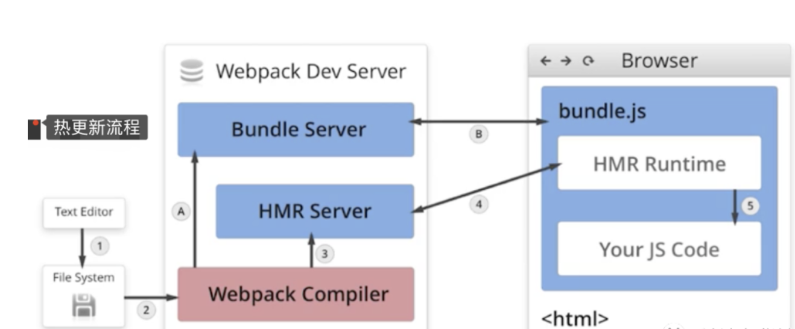
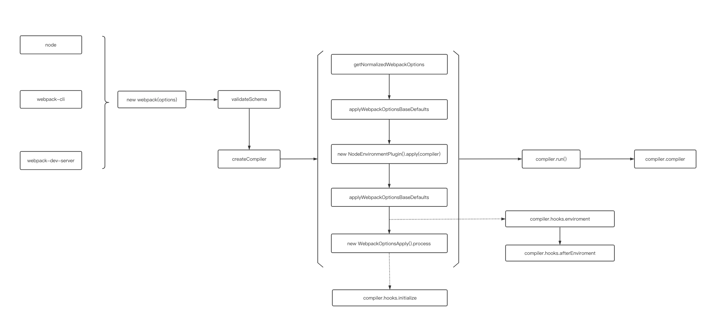
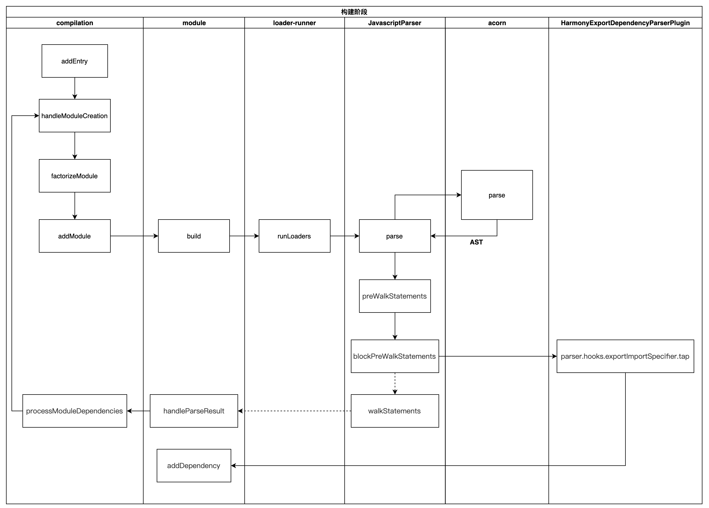
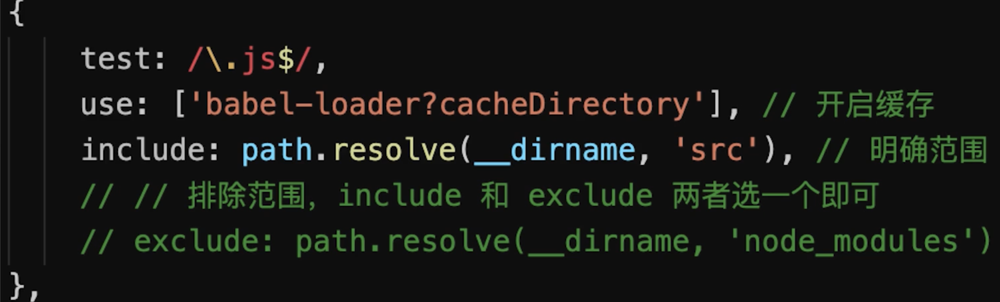
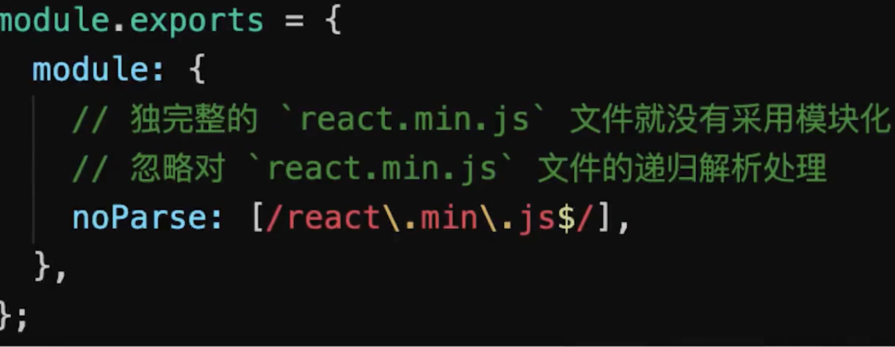
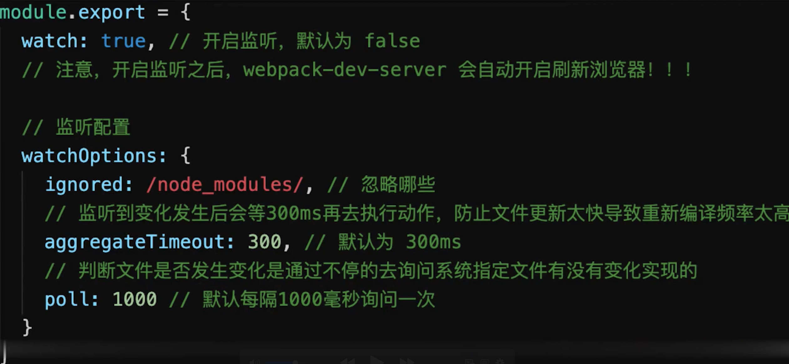
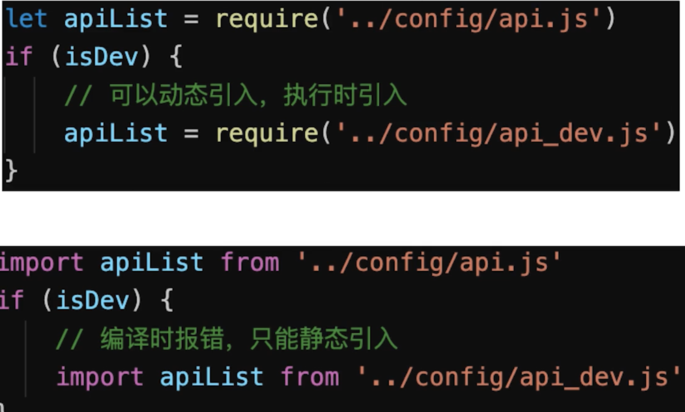
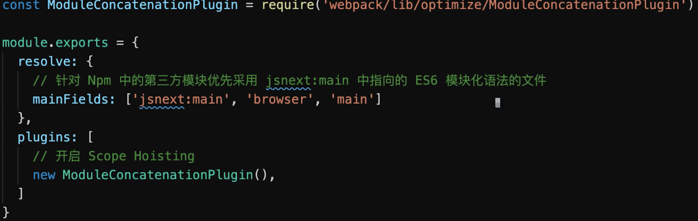

## hash、chunkhash、contenthash 区别

- 如果是`hash`的话，是和整个项目有关的，有一处文件发生更改则所有文件的`hash`值都会发生改变且它们共用一个`hash`值；
- 如果是`chunkhash`的话，只和`entry`的每个入口文件有关，也就是同一个`chunk`下的文件有所改动该`chunk`下的文件的`hash`值就会发生改变
- 如果是`contenthash`的话，和每个生成的文件有关，只有当要构建的文件内容发生改变时才会给该文件生成新的`hash`值，并不会影响其它文件。

## webpack 常用插件总结

**1. 功能类**

**1.1 html-webpack-plugin** 自动生成`html`，基本用法：

    new HtmlWebpackPlugin({
      filename: 'index.html', // 生成文件名
      template: path.join(process.cwd(), './index.html') // 模班文件
    })

**1.2 copy-webpack-plugin** 拷贝资源插件

    new CopyWebpackPlugin([
      {
        from: path.join(process.cwd(), './vendor/'),
        to: path.join(process.cwd(), './dist/'),
        ignore: ['*.json']
      }
    ])

**1.3 webpack-manifest-plugin \&\& assets-webpack-plugin**

> 俩个插件效果一致，都是生成编译结果的资源单，只是资源单的数据结构不一致而已

**webpack-manifest-plugin 基本用法**

    module.exports = {
      plugins: [
        new ManifestPlugin()
      ]
    }

**assets-webpack-plugin 基本用法**

    module.exports = {
      plugins: [
        new AssetsPlugin()
      ]
    }

**1.4 clean-webpack-plugin** 在编译之前清理指定目录指定内容

    // 清理目录
    const pathsToClean = [
      'dist',
      'build'
    ]

    // 清理参数
    const cleanOptions = {
      exclude:  ['shared.js'], // 跳过文件
    }
    module.exports = {
      // ...
      plugins: [
        new CleanWebpackPlugin(pathsToClean, cleanOptions)
      ]
    }

**1.5 compression-webpack-plugin** 提供带 `Content-Encoding` 编码的压缩版的资源

    module.exports = {
      plugins: [
        new CompressionPlugin()
      ]
    }

**1.6 progress-bar-webpack-plugin** 编译进度条插件

    module.exports = {
      //...
      plugins: [
        new ProgressBarPlugin()
      ]
    }

**2. 代码相关类**

**2.1 webpack.ProvidePlugin** 自动加载模块，如 `$` 出现，就会自动加载模块；`$` 默认为`'jquery'`的`exports`

    new webpack.ProvidePlugin({
      $: 'jquery',
    })

**2.2 webpack.DefinePlugin** 定义全局常量

    new webpack.DefinePlugin({
      'process.env': {
        NODE_ENV: JSON.stringify(process.env.NODE_ENV)
      }
    })

**2.3 mini-css-extract-plugin \&\& extract-text-webpack-plugin**

> 提取 css 样式，对比

- `mini-css-extract-plugin` 为`webpack4`及以上提供的`plugin`，支持`css chunk`
- `extract-text-webpack-plugin` 只能在`webpack3` 及一下的版本使用，不支持`css chunk`

**基本用法 extract-text-webpack-plugin**

    const ExtractTextPlugin = require("extract-text-webpack-plugin");

    module.exports = {
      module: {
        rules: [
          {
            test: /\.css$/,
            use: ExtractTextPlugin.extract({
              fallback: "style-loader",
              use: "css-loader"
            })
          }
        ]
      },
      plugins: [
        new ExtractTextPlugin("styles.css"),
      ]
    }

**基本用法 mini-css-extract-plugin**

    const MiniCssExtractPlugin = require("mini-css-extract-plugin");
    module.exports = {
        module: {
        rules: [
          {
            test: /\.css$/,
            use: [
              {
                loader: MiniCssExtractPlugin.loader,
                options: {
                  publicPath: '/'  // chunk publicPath
                }
              },
              "css-loader"
            ]
          }
        ]
      },
      plugins: [
        new MiniCssExtractPlugin({
          filename: "[name].css", // 主文件名
          chunkFilename: "[id].css"  // chunk文件名
        })
      ]
    }

**3. 编译结果优化类**

**3.1 wbepack.IgnorePlugin** 忽略`regExp`匹配的模块

    new webpack.IgnorePlugin(/^\.\/locale$/, /moment$/)

**3.2 uglifyjs-webpack-plugin** 代码丑化，用于 js 压缩

    module.exports = {
      //...
      optimization: {
        minimizer: [new UglifyJsPlugin({
          cache: true,   // 开启缓存
          parallel: true, // 开启多线程编译
          sourceMap: true,  // 是否sourceMap
          uglifyOptions: {  // 丑化参数
            comments: false,
            warnings: false,
            compress: {
              unused: true,
              dead_code: true,
              collapse_vars: true,
              reduce_vars: true
            },
            output: {
              comments: false
            }
          }
        }]
      }
    };

**3.3 optimize-css-assets-webpack-plugin** css 压缩，主要使用 `cssnano` 压缩器 https://github.com/cssnano/cssnano

    module.exports = {
      //...
      optimization: {
        minimizer: [new OptimizeCssAssetsPlugin({
          cssProcessor: require('cssnano'),   // css 压缩优化器
          cssProcessorOptions: { discardComments: { removeAll: true } } // 去除所有注释
        })]
      }
    };

**3.4 webpack-md5-hash** 使你的`chunk`根据内容生成`md5`，用这个`md5`取代 `webpack chunkhash`。

    var WebpackMd5Hash = require('webpack-md5-hash');

    module.exports = {
      // ...
      output: {
        //...
        chunkFilename: "[chunkhash].[id].chunk.js"
      },
      plugins: [
        new WebpackMd5Hash()
      ]
    };

**3.5 SplitChunksPlugin**

- `CommonChunkPlugin` 的后世，用于`chunk`切割。

`webpack` 把 `chunk` 分为两种类型，一种是初始加载`initial chunk`，另外一种是异步加载 `async chunk`，如果不配置`SplitChunksPlugin`，`webpack`会在`production`的模式下自动开启，默认情况下，`webpack`会将 `node_modules` 下的所有模块定义为异步加载模块，并分析你的 `entry`、动态加载（`import()`、`require.ensure`）模块，找出这些模块之间共用的`node_modules`下的模块，并将这些模块提取到单独的`chunk`中，在需要的时候异步加载到页面当中，其中默认配置如下

    module.exports = {
      //...
      optimization: {
        splitChunks: {
          chunks: 'async', // 异步加载chunk
          minSize: 30000,
          maxSize: 0,
          minChunks: 1,
          maxAsyncRequests: 5,
          maxInitialRequests: 3,
          automaticNameDelimiter: '~', // 文件名中chunk分隔符
          name: true,
          cacheGroups: {
            vendors: {
              test: /[\\/]node_modules[\\/]/,  //
              priority: -10
            },
            default: {
              minChunks: 2,  // 最小的共享chunk数
              priority: -20,
              reuseExistingChunk: true
            }
          }
        }
      }
    };

**4. 编译优化类**

**4.1 DllPlugin \&\& DllReferencePlugin \&\& autodll-webpack-plugin**

- `dllPlugin`将模块预先编译，`DllReferencePlugin` 将预先编译好的模块关联到当前编译中，当 `webpack` 解析到这些模块时，会直接使用预先编译好的模块。
- `autodll-webpack-plugin` 相当于 `dllPlugin` 和 `DllReferencePlugin` 的简化版，其实本质也是使用 `dllPlugin && DllReferencePlugin`，它会在第一次编译的时候将配置好的需要预先编译的模块编译在缓存中，第二次编译的时候，解析到这些模块就直接使用缓存，而不是去编译这些模块

**dllPlugin 基本用法：**

    const output = {
      filename: '[name].js',
      library: '[name]_library',
      path: './vendor/'
    }

    module.exports = {
      entry: {
        vendor: ['react', 'react-dom']  // 我们需要事先编译的模块，用entry表示
      },
      output: output,
      plugins: [
        new webpack.DllPlugin({  // 使用dllPlugin
          path: path.join(output.path, `${output.filename}.json`),
          name: output.library // 全局变量名， 也就是 window 下 的 [output.library]
        })
      ]
    }

**DllReferencePlugin 基本用法：**

    const manifest = path.resolve(process.cwd(), 'vendor', 'vendor.js.json')

    module.exports = {
      plugins: [
        new webpack.DllReferencePlugin({
          manifest: require(manifest), // 引进dllPlugin编译的json文件
          name: 'vendor_library' // 全局变量名，与dllPlugin声明的一致
        }
      ]
    }

**autodll-webpack-plugin 基本用法：**

    module.exports = {
      plugins: [
        new AutoDllPlugin({
          inject: true, // 与 html-webpack-plugin 结合使用，注入html中
          filename: '[name].js',
          entry: {
            vendor: [
              'react',
              'react-dom'
            ]
          }
        })
      ]
    }

**4.2 happypack \&\& thread-loader**

> 多线程编译，加快编译速度，`thread-loader`不可以和 `mini-css-extract-plugin` 结合使用

**happypack 基本用法**

    const HappyPack = require('happypack');
    const os = require('os');
    const happyThreadPool = HappyPack.ThreadPool({ size: os.cpus().length });
    const happyLoaderId = 'happypack-for-react-babel-loader';

    module.exports = {
      module: {
        rules: [{
          test: /\.jsx?$/,
          loader: 'happypack/loader',
          query: {
            id: happyLoaderId
          },
          include: [path.resolve(process.cwd(), 'src')]
        }]
      },
      plugins: [new HappyPack({
        id: happyLoaderId,
        threadPool: happyThreadPool,
        loaders: ['babel-loader']
      })]
    }

**thread-loader 基本用法**

    module.exports = {
      module: {
        rules: [
          {
            test: /\.js$/,
            include: path.resolve("src"),
            use: [
              "thread-loader",
              // your expensive loader (e.g babel-loader)
              "babel-loader"
            ]
          }
        ]
      }
    }

**4.3 hard-source-webpack-plugin \&\& cache-loader**

> 使用模块编译缓存，加快编译速度

**hard-source-webpack-plugin 基本用法**

    module.exports = {
      plugins: [
        new HardSourceWebpackPlugin()
      ]
    }

**cache-loader 基本用法**

    module.exports = {
      module: {
        rules: [
          {
            test: /\.ext$/,
            use: [
              'cache-loader',
              ...loaders
            ],
            include: path.resolve('src')
          }
        ]
      }
    }

**5. 编译分析类**

**5.1 webpack-bundle-analyzer** 编译模块分析插件

    new BundleAnalyzerPlugin({
      analyzerMode: 'server',
      analyzerHost: '127.0.0.1',
      analyzerPort: 8889,
      reportFilename: 'report.html',
      defaultSizes: 'parsed',
      generateStatsFile: false,
      statsFilename: 'stats.json',
      statsOptions: null,
      logLevel: 'info'
    }),

**5.2 stats-webpack-plugin \&\& PrefetchPlugin**

> `stats-webpack-plugin` 将构建的统计信息写入文件，该文件可在 http://webpack.github.io/analyse中上传进行编译分析，并根据分析结果，可使用 `PrefetchPlugin` 对部分模块进行预解析编译

**stats-webpack-plugin 基本用法：**

    module.exports = {
      plugins: [
        new StatsPlugin('stats.json', {
          chunkModules: true,
          exclude: [/node_modules[\\\/]react/]
        })
      ]
    };

**PrefetchPlugin 基本用法：**

    module.exports = {
      plugins: [
        new webpack.PrefetchPlugin('/web/', 'app/modules/HeaderNav.jsx'),
        new webpack.PrefetchPlugin('/web/', 'app/pages/FrontPage.jsx')
    ];
    }

**5.3 speed-measure-webpack-plugin** 统计编译过程中，各`loader`和`plugin`使用的时间

    const SpeedMeasurePlugin = require("speed-measure-webpack-plugin");

    const smp = new SpeedMeasurePlugin();

    const webpackConfig = {
      plugins: [
        new MyPlugin(),
        new MyOtherPlugin()
      ]
    }
    module.exports = smp.wrap(webpackConfig);

## webpack 热更新原理



- 当修改了一个或多个文件；
- 文件系统接收更改并通知 `webpack`；
- `webpack` 重新编译构建一个或多个模块，并通知 `HMR` 服务器进行更新；
- `HMR Server` 使用 `webSocket` 通知 `HMR runtime` 需要更新，`HMR` 运行时通过 `HTTP` 请求更新 `jsonp`
- `HMR` 运行时替换更新中的模块，如果确定这些模块无法更新，则触发整个页面刷新

## webpack 原理简述

**1.1 核心概念**

> JavaScript 的 模块打包工具 (module bundler)。通过分析模块之间的依赖，最终将所有模块打包成一份或者多份代码包 (bundler)，供 HTML 直接引用。实质上，Webpack 仅仅提供了 打包功能 和一套 文件处理机制，然后通过生态中的各种 Loader 和 Plugin 对代码进行预编译和打包。因此 Webpack 具有高度的可拓展性，能更好的发挥社区生态的力量。

- **Entry** : 入口文件，`Webpack`会从该文件开始进行分析与编译；
- **Output** : 出口路径，打包后创建 `bundler`的文件路径以及文件名；
- **Module** : 模块，在 `Webpack` 中任何文件都可以作为一个模块，会根据配置的不同的 `Loader` 进行加载和打包；
- **Chunk**: 代码块，可以根据配置，将所有模块代码合并成一个或多个代码块，以便按需加载，提高性能；
- **Loader**: 模块加载器，进行各种文件类型的加载与转换；
- **Plugin** : 拓展插件，可以通过 `Webpack` 相应的事件钩子，介入到打包过程中的任意环节，从而对代码按需修改；

**1.2 工作流程 (加载 - 编译 - 输出)**

1. 读取配置文件，按命令 初始化 配置参数，创建 `Compiler` 对象；
2. 调用插件的 `apply` 方法 挂载插件 监听，然后从入口文件开始执行编译；
3. 按文件类型，调用相应的 `Loader` 对模块进行 编译，并在合适的时机点触发对应的事件，调用 `Plugin` 执行，最后再根据模块 依赖查找 到所依赖的模块，递归执行第三步；
4. 将编译后的所有代码包装成一个个代码块 (`Chunk`)， 并按依赖和配置确定 输出内容。这个步骤，仍然可以通过 `Plugin` 进行文件的修改;
5. 最后，根据 `Output` 把文件内容一一写入到指定的文件夹中，完成整个过程；

**1.3 模块包装**

    (function(modules) {
    	// 模拟 require 函数，从内存中加载模块；
    	function __webpack_require__(moduleId) {
    		// 缓存模块
    		if (installedModules[moduleId]) {
    			return installedModules[moduleId].exports;
    		}

    		var module = installedModules[moduleId] = {
    			i: moduleId,
    			l: false,
    			exports: {}
    		};

    		// 执行代码；
    		modules[moduleId].call(module.exports, module, module.exports, __webpack_require__);

    		// Flag: 标记是否加载完成；
    		module.l = true;

    		return module.exports;
    	}

    	// ...

    	// 开始执行加载入口文件；
    	return __webpack_require__(__webpack_require__.s = "./src/index.js");
     })({
     	"./src/index.js": function (module, __webpack_exports__, __webpack_require__) {
    		// 使用 eval 执行编译后的代码；
    		// 继续递归引用模块内部依赖；
    		// 实际情况并不是使用模板字符串，这里是为了代码的可读性；
    		eval(` __webpack_require__.r(__webpack_exports__); // var _test__WEBPACK_IMPORTED_MODULE_0__ = __webpack_require__("test", ./src/test.js"); `);
    	},
    	"./src/test.js": function (module, __webpack_exports__, __webpack_require__) {
    		// ...
    	},
     })

**总结:**

- **模块机制** : `webpack`自己实现了一套模拟模块的机制，将其包裹于业务代码的外部，从而提供了一套模块机制；
- **文件编译** : `webpack`规定了一套编译规则，通过 `Loader` 和 `Plugin`，以管道的形式对文件字符串进行处理；

**1.4 webpack 的打包原理**

- `初始化参数`：从配置文件和 `Shell` 语句中读取与合并参数，得出最终的参数
- `开始编译`：用上一步得到的参数初始化 `Compiler` 对象，加载所有配置的插件，执行对象的 `run` 方法开始执行编译
- `确定入口`：根据配置中的 `entry` 找出所有的入口文件
- `编译模块`：从入口文件出发，调用所有配置的 `Loader` 对模块进行翻译，再找出该模块依赖的模块，再递归本步骤直到所有入口依赖的文件都经过了本步骤的处理
- `完成模块编译`：在经过第`4`步使用 `Loader` 翻译完所有模块后，得到了每个模块被翻译后的最终内容以及它们之间的依赖关系
- `输出资源`：根据入口和模块之间的依赖关系，组装成一个个包含多个模块的 `Chunk`，再把每个 `Chunk` 转换成一个单独的文件加入到输出列表，这步是可以修改输出内容的最后机会
- `输出完成`：在确定好输出内容后，根据配置确定输出的路径和文件名，把文件内容写入到文件系统

**1.5 webpack 的打包原理详细**

**相关问题**

- `webpack` 工作流程是怎样的
- `webpack` 在不同阶段做了什么事情

webpack 是一种模块打包工具，可以将各类型的资源，例如图片、CSS、JS 等，转译组合为 JS 格式的 `bundle` 文件

**webpack 构建的核心任务是完成内容转化和资源合并。主要包含以下 3 个阶段：**

1. 初始化阶段

- **初始化参数**：从配置文件、配置对象和 Shell 参数中读取并与默认参数进行合并，组合成最终使用的参数
- **创建编译对象** ：用上一步得到的参数创建 `Compiler` 对象。
- **初始化编译环境** ：包括注入内置插件、注册各种模块工厂、初始化 `RuleSet` 集合、加载配置的插件等

2. 构建阶段

- **开始编译** ：执行 `Compiler` 对象的 `run` 方法，创建 `Compilation` 对象。
- **确认编译入口** ：进入 `entryOption` 阶段，读取配置的 `Entries`，递归遍历所有的入口文件，调用 `Compilation.addEntry` 将入口文件转换为 Dependency 对象。
- **编译模块（make）** ： 调用 `normalModule` 中的 `build` 开启构建，从 `entry` 文件开始，调用 `loader` 对模块进行转译处理，然后调用 JS 解释器（`acorn`）将内容转化为 `AST` 对象，然后递归分析依赖，依次处理全部文件。
- **完成模块编译**：在上一步处理好所有模块后，得到模块编译产物和依赖关系图

3. 生成阶段

- **输出资源（seal）** ：根据入口和模块之间的依赖关系，组装成多个包含多个模块的 `Chunk`，再把每个 `Chunk` 转换成一个 `Asset` 加入到输出列表，这步是可以修改输出内容的最后机会。
- **写入文件系统（emitAssets）** ：确定好输出内容后，根据配置的 `output` 将内容写入文件系统

**知识点深入**

**1. webpack 初始化过程**

从 webpack 项目 `webpack.config.js` 文件 webpack 方法出发，可以看到初始化过程如下：



- 将命令行参数和用户的配置文件进行合并
- 调用 `getValidateSchema` 对配置进行校验
- 调用 `createCompiler` 创建 `Compiler` 对象

  - 将用户配置和默认配置进行合并处理
  - 实例化 `Compiler`
  - 实例化 `NodeEnvironmentPlugin`
  - 处理用户配置的 `plugins`，执行 `plugin` 的 `apply` 方法。
  - 触发 `environment` 和 `afterEnvironment` 上注册的事件。
  - 注册 `webpack` 内部插件。
  - 触发 `initialize` 事件

```js
    // lib/webpack.js 122 行 部分代码省略处理
    const create = () => {
      if (!webpackOptionsSchemaCheck(options)) {
        // 校验参数
        getValidateSchema()(webpackOptionsSchema, options);
      }
      // 创建 compiler 对象
      compiler = createCompiler(webpackOptions);
    };

    // lib/webpack.js 57 行
    const createCompiler = (rawOptions) => {
      // 统一合并处理参数
      const options = getNormalizedWebpackOptions(rawOptions);
      applyWebpackOptionsBaseDefaults(options);
      // 实例化
      compiler const compiler = new Compiler(options.context);
      // 把 options 挂载到对象上
      compiler.options = options;
      // NodeEnvironmentPlugin 是对 fs 模块的封装，用来处理文件输入输出等
      new NodeEnvironmentPlugin({ infrastructureLogging: options.infrastructureLogging, }).apply(compiler);
       // 注册用户配置插件
       if (Array.isArray(options.plugins)) {
        for (const plugin of options.plugins) {
          if (typeof plugin === "function") {
            plugin.call(compiler, compiler);
          } else {
            plugin.apply(compiler);
          }
        }
      }
      applyWebpackOptionsDefaults(options);
      // 触发 environment 和 afterEnvironment 上注册的事件
      compiler.hooks.environment.call();
      compiler.hooks.afterEnvironment.call();
      // 注册 webpack 内置插件
      new WebpackOptionsApply().process(options, compiler);
      compiler.hooks.initialize.call();
      return compiler;
    };
```

**2. webpack 构建阶段做了什么**

在 webpack 函数执行完之后，就到主要的构建阶段，首先执行 `compiler.run()`，然后触发一系列钩子函数，执行 `compiler.compile()`



- 在实例化 `compiler` 之后，执行 `compiler.run()`
- 执行 `newCompilation` 函数，调用 `createCompilation` 初始化 `Compilation` 对象
- 执行 `_addEntryItem` 将入口文件存入 `this.entries`（`map` 对象），遍历 `this.entries` 对象构建 `chunk`。
- 执行 `handleModuleCreation`，开始创建模块实例。
- 执行 `moduleFactory.create` 创建模块
  - 执行 `factory.hooks.factorize.call` 钩子，然后会调用 `ExternalModuleFactoryPlugin` 中注册的钩子，用于配置外部文件的模块加载方式
  - 使用 `enhanced-resolve` 解析模块和 `loader` 的真实绝对路径
  - 执行 `new NormalModule()` 创建 `module` 实例
- 执行 `addModule`，存储 `module`
- 执行 `buildModule`，添加模块到模块队列 `buildQueue`，开始构建模块, 这里会调用 `normalModule` 中的 `build` 开启构建
  - 创建 `loader` 上下文。
  - 执行 `runLoaders`，通过 `enhanced-resolve` 解析得到的模块和 `loader` 的路径获取函数，执行 `loader`。
  - 生成模块的 `hash`
- 所有依赖都解析完毕后，构建阶段结束

```js
      // 构建过程涉及流程比较复杂，代码会做省略

      // lib/webpack.js 1284行
      // 开启编译流程
      compiler.run((err, stats) => {
        compiler.close(err2 => {
          callback(err || err2, stats);
        });
      });

      // lib/compiler.js 1081行
      // 开启编译流程
      compile(callback) {
        const params = this.newCompilationParams();
        // 创建 Compilation 对象
        const Compilation = this.newCompilation(params);
      }

      // lib/Compilation.js 1865行
      // 确认入口文件
      addEntry() {
        this._addEntryItem();
      }

      // lib/Compilation.js 1834行
      // 开始创建模块流程，创建模块实例
      addModuleTree() {
        this.handleModuleCreation()
      }

      // lib/Compilation.js 1548行
      // 开始创建模块流程，创建模块实例
      handleModuleCreation() {
        this.factorizeModule()
      }

      // lib/Compilation.js 1712行
      // 添加到创建模块队列，执行创建模块
      factorizeModule(options, callback) {
        this.factorizeQueue.add(options, callback);
      }

      // lib/Compilation.js 1834行
      // 保存需要构建模块
      _addModule(module, callback) {
        this.modules.add(module);
      }

      // lib/Compilation.js 1284行
      // 添加模块进模块编译队列，开始编译
      buildModule(module, callback) {
        this.buildQueue.add(module, callback);
      }
```

**3. webpack 生成阶段做了什么**

> 构建阶段围绕 `module` 展开，生成阶段则围绕 `chunks` 展开。经过构建阶段之后，webpack 得到足够的模块内容与模块关系信息，之后通过 `Compilation.seal` 函数生成最终资源

**3.1 生成产物**

执行 `Compilation.seal` 进行产物的封装

- 构建本次编译的 `ChunkGraph` 对象，执行 `buildChunkGraph`，这里会将 `import()`、`require.ensure` 等方法生成的动态模块添加到 `chunks` 中
- 遍历 `Compilation.modules` 集合，将 `module` 按 **`entry`/动态引入** 的规则分配给不同的 `Chunk` 对象。
- 调用 `Compilation.emitAssets` 方法将 `assets` 信息记录到 `Compilation.assets` 对象中。
- 执行 `hooks.optimizeChunkModules` 的钩子，这里开始进行代码生成和封装。
  - 执行一系列钩子函数（`reviveModules`, `moduleId`, `optimizeChunkIds` 等）
  - 执行 `createModuleHashes` 更新模块 `hash`
  - 执行 `JavascriptGenerator` 生成模块代码，这里会遍历 `modules`，创建构建任务，循环使用 `JavascriptGenerator` 构建代码，这时会将 `import` 等模块引入方式替换为 `webpack_require` 等，并将生成结果存入缓存
  - 执行 `processRuntimeRequirements`，根据生成的内容所使用到的 `webpack_require` 的函数，添加对应的代码
  - 执行 `createHash` 创建 `chunk` 的 `hash`
  - 执行 `clearAssets` 清除 `chunk` 的 `files` 和 `auxiliary`，这里缓存的是生成的 `chunk` 的文件名，主要是清除上次构建产生的废弃内容

**3.2 文件输出**

回到 `Compiler` 的流程中，执行 `onCompiled` 回调。

- 触发 `shouldEmit` 钩子函数，这里是最后能优化产物的钩子。
- 遍历 `module` 集合，根据 `entry` 配置及引入资源的方式，将 `module` 分配到不同的 `chunk`。
- 遍历 `chunk` 集合，调用 `Compilation.emitAsset` 方法标记 `chunk` 的输出规则，即转化为 `assets` 集合。
- 写入本地文件，用的是 webpack 函数执行时初始化的文件流工具。
- 执行 `done` 钩子函数，这里会执行 `compiler.run()` 的回调，再执行 `compiler.close()`，然后执行持久化存储（前提是使用的 `filesystem` 缓存模式）

**1.6 总结**

1. **初始化参数** ：从配置文件和 `Shell` 语句中读取并合并参数，得出最终的配置参数。
2. **开始编译** ：从上一步得到的参数初始化 `Compiler` 对象，加载所有配置的插件，执行对象的 `run` 方法开始执行编译。
3. **确定入口** ：根 scope 据配置中的 `entry` 找出所有的入口文件。
4. **编译模块** ：从入口文件出发，调用所有配置的 `loader` 对模块进行翻译，再找出该模块依赖的模块，这个步骤是递归执行的，直至所有入口依赖的模块文件都经过本步骤的处理。
5. **完成模块编译** ：经过第 `4` 步使用 `loader` 翻译完所有模块后，得到了每个模块被翻译后的最终内容以及它们之间的依赖关系。
6. **输出资源** ：根据入口和模块之间的依赖关系，组装成一个个包含多个模块的 `chunk`，再把每个 `chunk` 转换成一个单独的文件加入到输出列表，这一步是可以修改输出内容的最后机会。
7. **输出完成**：在确定好输出内容后，根据配置确定输出的路径和文件名，把文件内容写入到文件系统。

## webpack 性能优化-构建速度

> 先分析遇到哪些问题，在配合下面的方法优化，不要上来就回答，让人觉得背面试题

- 优化`babel-loader`缓存

  

- `IgnorePlugin` 忽略某些包，避免引入无用模块（直接不引入，需要在代码中引入）

  - `import moment from 'moment'`
  - 默认会引入所有语言 JS 代码，代码过大

    import moment from 'moment' moment.locale('zh-cn') // 设置语言为中文

    // 手动引入中文语言包 import 'moment/locale/zh-cn'

    // webpack.prod.js pluins: [ // 忽略 moment 下的 /locale 目录 new webpack.IgnorePlugin(/\.\/locale/, /moment/), ]

- `noParse` 避免重复打包（引入但不打包）

  

- `happyPack`多线程打包

  - JS 单线程的，开启多进程打包
  - 提高构建速度(特别是多核`CPU`)

```js
        // webpack.prod.js
        const HappyPack = require('happypack')

        {
            module: {
                rules: [
                    // js
                    {
                        test: /\.js$/,
                        // 把对 .js 文件的处理转交给 id 为 babel 的 HappyPack 实例
                        use: ['happypack/loader?id=babel'],
                        include: srcPath,
                        // exclude: /node_modules/
                    },
                ]
            },
            plugins: [
                // happyPack 开启多进程打包
                new HappyPack({
                    // 用唯一的标识符 id 来代表当前的 HappyPack 是用来处理一类特定的文件
                    id: 'babel',
                    // 如何处理 .js 文件，用法和 Loader 配置中一样
                    loaders: ['babel-loader?cacheDirectory']
                }),
            ]
        }
```

- `parallelUglifyPlugin`多进程压缩`JS`

  - **关于多进程**

    - 项目较大，打包较慢，开启多进程能提高速度
    - 项目较小，打包很快，开启多进程反而会降低速度（进程开销）
    - 按需使用

```js
// webpack.prod.js
const ParallelUglifyPlugin = require("webpack-parallel-uglify-plugin");

{
  plugins: [
    // 使用 ParallelUglifyPlugin 并行压缩输出的 JS 代码
    new ParallelUglifyPlugin({
      // 传递给 UglifyJS 的参数
      // （还是使用 UglifyJS 压缩，只不过帮助开启了多进程）
      uglifyJS: {
        output: {
          beautify: false, // 最紧凑的输出
          comments: false // 删除所有的注释
        },
        compress: {
          // 删除所有的 `console` 语句，可以兼容 ie 浏览器
          drop_console: true,
          // 内嵌定义了但是只用到一次的变量
          collapse_vars: true,
          // 提取出出现多次但是没有定义成变量去引用的静态值
          reduce_vars: true
        }
      }
    })
  ];
}
```

- 自动刷新（开发环境）使用`dev-server`即可

  

- 热更新（开发环境）

  - 自动刷新：整个网页全部刷新，速度较慢，状态会丢失

  - 热更新：新代码生效，网页不刷新，状态不丢失

```js
        // webpack.dev.js
        const HotModuleReplacementPlugin = require('webpack/lib/HotModuleReplacementPlugin');

        entry: {
            // index: path.join(srcPath, 'index.js'),
            index: [
                'webpack-dev-server/client?http://localhost:8080/',
                'webpack/hot/dev-server',
                path.join(srcPath, 'index.js')
            ],
            other: path.join(srcPath, 'other.js')
        },
        devServer: {
            hot: true
        },
        plugins: [
            new HotModuleReplacementPlugin()
        ],

        // 代码中index.js

        // 增加，开启热更新之后的代码逻辑
        if (module.hot) {
            // 注册哪些模块需要热更新
            module.hot.accept(['./math'], () => {
                const sumRes = sum(10, 30)
                console.log('sumRes in hot', sumRes)
            })
        }
```

- `DllPlugin` 动态链接库（`dllPlugin`只适用于开发环境,因为生产环境下打包一次就完了,没有必要用于生产环境）

  - 前端框架如`react`、`vue`体积大，构建慢

  - 较稳定，不常升级版本，同一个版本只构建一次，不用每次都重新构建

  - `webpack`已内置`DllPlugin`，不需要安装

  - `DllPlugin`打包出`dll`文件

  - `DllReferencePlugin`引用`dll`文件

```js
        // webpack.common.js
        const path = require('path')
        const HtmlWebpackPlugin = require('html-webpack-plugin')
        const { srcPath, distPath } = require('./paths')

        module.exports = {
            entry: path.join(srcPath, 'index'),
            module: {
                rules: [
                    {
                        test: /\.js$/,
                        use: ['babel-loader'],
                        include: srcPath,
                        exclude: /node_modules/
                    },
                ]
            },
            plugins: [
                new HtmlWebpackPlugin({
                    template: path.join(srcPath, 'index.html'),
                    filename: 'index.html'
                })
            ]
        }

        // webpack.dev.js
        const path = require('path')
        const webpack = require('webpack')
        const { merge } = require('webpack-merge')
        const webpackCommonConf = require('./webpack.common.js')
        const { srcPath, distPath } = require('./paths')

        // 第一，引入 DllReferencePlugin
        const DllReferencePlugin = require('webpack/lib/DllReferencePlugin');

        module.exports = merge(webpackCommonConf, {
            mode: 'development',
            module: {
                rules: [
                    {
                        test: /\.js$/,
                        use: ['babel-loader'],
                        include: srcPath,
                        exclude: /node_modules/ // 第二，不要再转换 node_modules 的代码
                    },
                ]
            },
            plugins: [
                new webpack.DefinePlugin({
                    // window.ENV = 'production'
                    ENV: JSON.stringify('development')
                }),
                // 第三，告诉 Webpack 使用了哪些动态链接库
                new DllReferencePlugin({
                    // 描述 react 动态链接库的文件内容
                    manifest: require(path.join(distPath, 'react.manifest.json')),
                }),
            ],
            devServer: {
                port: 8080,
                progress: true,  // 显示打包的进度条
                contentBase: distPath,  // 根目录
                open: true,  // 自动打开浏览器
                compress: true,  // 启动 gzip 压缩

                // 设置代理
                proxy: {
                    // 将本地 /api/xxx 代理到 localhost:3000/api/xxx
                    '/api': 'http://localhost:3000',

                    // 将本地 /api2/xxx 代理到 localhost:3000/xxx
                    '/api2': {
                        target: 'http://localhost:3000',
                        pathRewrite: {
                            '/api2': ''
                        }
                    }
                }
            }
        })

        // webpack.prod.js
        const path = require('path')
        const webpack = require('webpack')
        const webpackCommonConf = require('./webpack.common.js')
        const { merge } = require('webpack-merge')
        const { srcPath, distPath } = require('./paths')

        module.exports = merge(webpackCommonConf, {
            mode: 'production',
            output: {
                filename: 'bundle.[contenthash:8].js',  // 打包代码时，加上 hash 戳
                path: distPath,
                // publicPath: 'http://cdn.abc.com' // 修改所有静态文件 url 的前缀（如 cdn 域名），这里暂时用不到
            },
            plugins: [
                new webpack.DefinePlugin({
                    // window.ENV = 'production'
                    ENV: JSON.stringify('production')
                })
            ]
        })

        // webpack.dll.js

        const path = require('path')
        const DllPlugin = require('webpack/lib/DllPlugin')
        const { srcPath, distPath } = require('./paths')

        module.exports = {
        mode: 'development',
        // JS 执行入口文件
        entry: {
            // 把 React 相关模块的放到一个单独的动态链接库
            react: ['react', 'react-dom']
        },
        output: {
            // 输出的动态链接库的文件名称，[name] 代表当前动态链接库的名称，
            // 也就是 entry 中配置的 react 和 polyfill
            filename: '[name].dll.js',
            // 输出的文件都放到 dist 目录下
            path: distPath,
            // 存放动态链接库的全局变量名称，例如对应 react 来说就是 _dll_react
            // 之所以在前面加上 _dll_ 是为了防止全局变量冲突
            library: '_dll_[name]',
        },
        plugins: [
            // 接入 DllPlugin
            new DllPlugin({
            // 动态链接库的全局变量名称，需要和 output.library 中保持一致
            // 该字段的值也就是输出的 manifest.json 文件 中 name 字段的值
            // 例如 react.manifest.json 中就有 "name": "_dll_react"
            name: '_dll_[name]',
            // 描述动态链接库的 manifest.json 文件输出时的文件名称
            path: path.join(distPath, '[name].manifest.json'),
            }),
        ],
        }

        "scripts": {
            "dev": "webpack serve --config build/webpack.dev.js",
            "dll": "webpack --config build/webpack.dll.js"
        },
```

**优化打包速度完整代码**

```js
// webpack.common.js

const path = require("path");
const HtmlWebpackPlugin = require("html-webpack-plugin");
const { srcPath, distPath } = require("./paths");

module.exports = {
  entry: {
    index: path.join(srcPath, "index.js"),
    other: path.join(srcPath, "other.js")
  },
  module: {
    rules: [
      // babel-loader
    ]
  },
  plugins: [
    // new HtmlWebpackPlugin({
    // template: path.join(srcPath, 'index.html'),
    // filename: 'index.html'
    // })

    // 多入口 - 生成 index.html
    new HtmlWebpackPlugin({
      template: path.join(srcPath, "index.html"),
      filename: "index.html",
      // chunks 表示该页面要引用哪些 chunk （即上面的 index 和 other），默认全部引用
      chunks: ["index", "vendor", "common"] // 要考虑代码分割
    }),
    // 多入口 - 生成 other.html
    new HtmlWebpackPlugin({
      template: path.join(srcPath, "other.html"),
      filename: "other.html",
      chunks: ["other", "vendor", "common"] // 考虑代码分割
    })
  ]
};

// webpack.dev.js
const path = require("path");
const webpack = require("webpack");
const webpackCommonConf = require("./webpack.common.js");
const { smart } = require("webpack-merge");
const { srcPath, distPath } = require("./paths");
const HotModuleReplacementPlugin = require("webpack/lib/HotModuleReplacementPlugin");

module.exports = smart(webpackCommonConf, {
  mode: "development",
  entry: {
    // index: path.join(srcPath, 'index.js'),
    index: ["webpack-dev-server/client?http://localhost:8080/", "webpack/hot/dev-server", path.join(srcPath, "index.js")],
    other: path.join(srcPath, "other.js")
  },
  module: {
    rules: [
      {
        test: /\.js$/,
        loader: ["babel-loader?cacheDirectory"],
        include: srcPath
        // exclude: /node_modules/
      },
      // 直接引入图片 url
      {
        test: /\.(png|jpg|jpeg|gif)$/,
        use: "file-loader"
      },
      // {
      // test: /\.css$/,
      // // loader 的执行顺序是：从后往前
      // loader: ['style-loader', 'css-loader']
      // },
      {
        test: /\.css$/,
        // loader 的执行顺序是：从后往前
        loader: ["style-loader", "css-loader", "postcss-loader"] // 加了 postcss
      },
      {
        test: /\.less$/,
        // 增加 'less-loader' ，注意顺序
        loader: ["style-loader", "css-loader", "less-loader"]
      }
    ]
  },
  plugins: [
    new webpack.DefinePlugin({
      // window.ENV = 'production'
      ENV: JSON.stringify("development")
    }),
    new HotModuleReplacementPlugin()
  ],
  devServer: {
    port: 8080,
    progress: true, // 显示打包的进度条
    contentBase: distPath, // 根目录
    open: true, // 自动打开浏览器
    compress: true, // 启动 gzip 压缩

    hot: true,

    // 设置代理
    proxy: {
      // 将本地 /api/xxx 代理到 localhost:3000/api/xxx
      "/api": "http://localhost:3000",

      // 将本地 /api2/xxx 代理到 localhost:3000/xxx
      "/api2": {
        target: "http://localhost:3000",
        pathRewrite: {
          "/api2": ""
        }
      }
    }
  }
  // watch: true, // 开启监听，默认为 false
  // watchOptions: {
  // ignored: /node_modules/, // 忽略哪些
  // // 监听到变化发生后会等300ms再去执行动作，防止文件更新太快导致重新编译频率太高
  // // 默认为 300ms
  // aggregateTimeout: 300,
  // // 判断文件是否发生变化是通过不停的去询问系统指定文件有没有变化实现的
  // // 默认每隔1000毫秒询问一次
  // poll: 1000
  // }
});

// webpack.prod.js
const path = require("path");
const webpack = require("webpack");
const { smart } = require("webpack-merge");
const { CleanWebpackPlugin } = require("clean-webpack-plugin");
const MiniCssExtractPlugin = require("mini-css-extract-plugin");
const TerserJSPlugin = require("terser-webpack-plugin");
const OptimizeCSSAssetsPlugin = require("optimize-css-assets-webpack-plugin");
const HappyPack = require("happypack");
const ParallelUglifyPlugin = require("webpack-parallel-uglify-plugin");
const webpackCommonConf = require("./webpack.common.js");
const { srcPath, distPath } = require("./paths");

module.exports = smart(webpackCommonConf, {
  mode: "production",
  output: {
    // filename: 'bundle.[contentHash:8].js', // 打包代码时，加上 hash 戳
    filename: "[name].[contentHash:8].js", // name 即多入口时 entry 的 key
    path: distPath
    // publicPath: 'http://cdn.abc.com' // 修改所有静态文件 url 的前缀（如 cdn 域名），这里暂时用不到
  },
  module: {
    rules: [
      // js
      {
        test: /\.js$/,
        // 把对 .js 文件的处理转交给 id 为 babel 的 HappyPack 实例
        use: ["happypack/loader?id=babel"],
        include: srcPath
        // exclude: /node_modules/
      },
      // 图片 - 考虑 base64 编码的情况
      {
        test: /\.(png|jpg|jpeg|gif)$/,
        use: {
          loader: "url-loader",
          options: {
            // 小于 5kb 的图片用 base64 格式产出
            // 否则，依然延用 file-loader 的形式，产出 url 格式
            limit: 5 * 1024,

            // 打包到 img 目录下
            outputPath: "/img1/"

            // 设置图片的 cdn 地址（也可以统一在外面的 output 中设置，那将作用于所有静态资源）
            // publicPath: 'http://cdn.abc.com'
          }
        }
      },
      // 抽离 css
      {
        test: /\.css$/,
        loader: [
          MiniCssExtractPlugin.loader, // 注意，这里不再用 style-loader
          "css-loader",
          "postcss-loader"
        ]
      },
      // 抽离 less
      {
        test: /\.less$/,
        loader: [
          MiniCssExtractPlugin.loader, // 注意，这里不再用 style-loader
          "css-loader",
          "less-loader",
          "postcss-loader"
        ]
      }
    ]
  },
  plugins: [
    new CleanWebpackPlugin(), // 会默认清空 output.path 文件夹
    new webpack.DefinePlugin({
      // window.ENV = 'production'
      ENV: JSON.stringify("production")
    }),

    // 抽离 css 文件
    new MiniCssExtractPlugin({
      filename: "css/main.[contentHash:8].css"
    }),

    // 忽略 moment 下的 /locale 目录
    new webpack.IgnorePlugin(/\.\/locale/, /moment/),

    // happyPack 开启多进程打包
    new HappyPack({
      // 用唯一的标识符 id 来代表当前的 HappyPack 是用来处理一类特定的文件
      id: "babel",
      // 如何处理 .js 文件，用法和 Loader 配置中一样
      loaders: ["babel-loader?cacheDirectory"]
    }),

    // 使用 ParallelUglifyPlugin 并行压缩输出的 JS 代码
    new ParallelUglifyPlugin({
      // 传递给 UglifyJS 的参数
      // （还是使用 UglifyJS 压缩，只不过帮助开启了多进程）
      uglifyJS: {
        output: {
          beautify: false, // 最紧凑的输出
          comments: false // 删除所有的注释
        },
        compress: {
          // 删除所有的 `console` 语句，可以兼容ie浏览器
          drop_console: true,
          // 内嵌定义了但是只用到一次的变量
          collapse_vars: true,
          // 提取出出现多次但是没有定义成变量去引用的静态值
          reduce_vars: true
        }
      }
    })
  ],

  optimization: {
    // 压缩 css
    minimizer: [new TerserJSPlugin({}), new OptimizeCSSAssetsPlugin({})],

    // 分割代码块
    splitChunks: {
      chunks: "all",
      /** * initial 入口chunk，对于异步导入的文件不处理 async 异步chunk，只对异步导入的文件处理 all 全部chunk */

      // 缓存分组
      cacheGroups: {
        // 第三方模块
        vendor: {
          name: "vendor", // chunk 名称
          priority: 1, // 权限更高，优先抽离，重要！！！
          test: /node_modules/,
          minSize: 0, // 大小限制
          minChunks: 1 // 最少复用过几次
        },

        // 公共的模块
        common: {
          name: "common", // chunk 名称
          priority: 0, // 优先级
          minSize: 0, // 公共模块的大小限制
          minChunks: 2 // 公共模块最少复用过几次
        }
      }
    }
  }
});
```

## webpack 性能优化-产出代码（线上运行）

**前言**

- 体积更小
- 合理分包，不重复加载
- 速度更快、内存使用更少

**产出代码优化**

- 小图片`base64`编码，减少`http`请求

```js
// 图片 - 考虑 base64 编码的情况
module: {
  rules: [
    {
      test: /\.(png|jpg|jpeg|gif)$/,
      use: {
        loader: "url-loader",
        options: {
          // 小于 5kb 的图片用 base64 格式产出
          // 否则，依然延用 file-loader 的形式，产出 url 格式 limit: 5 \* 1024,
          // 打包到 img 目录下
          outputPath: "/img1/"

          // 设置图片的 cdn 地址（也可以统一在外面的 output 中设置，那将作用于所有静态资源）
          // publicPath: 'http://cdn.abc.com'
        }
      }
    }
  ];
}
```

- `bundle`加`contenthash`，有利于浏览器缓存
- 懒加载`import()`语法，减少首屏加载时间
- 提取公共代码（第三方代码`Vue`、`React`、`loadash`等）没有必要多次打包，可以提取到`vendor`中
- `IgnorePlugin`忽略不需要的包（如`moment`多语言），减少打包的代码
- 使用`CDN`加速，减少资源加载时间

```js
      output: {
        filename: '[name].[contentHash:8].js', // name 即多入口时 entry 的 key
        path: path.join(__dirname, '..', 'dist'),
        // 修改所有静态文件 url 的前缀（如 cdn 域名）
        // 这样index.html中引入的js、css、图片等资源都会加上这个前缀
        publicPath: 'http://cdn.abc.com'
      },
```

- `webpack`使用`production`模式，`mode: 'production'`

  - 自动压缩代码
  - 启动`Tree Shaking`

    - `ES6`模块化，`import`和`export`，`webpack`会自动识别，才会生效
    - `Commonjs`模块化，`require`和`module.exports`，`webpack`无法识别，不会生效
    - **ES6 模块和 Commonjs 模块区别**

      - `ES6`模块是静态引入，编译时引入
      - `Commonjs`是动态引入，执行时引入
      - 只有`ES6 Module`才能静态分析，实现`Tree Shaking`

        

- `Scope Hoisting`：是`webpack3`引入的一个新特性，它会分析出模块之间的依赖关系，尽可能地把打散的模块合并到一个函数中去，减少代码间的引用，从而减少代码体积
  - 减少代码体积
  - 创建函数作用域更少
  - 代码可读性更好 
