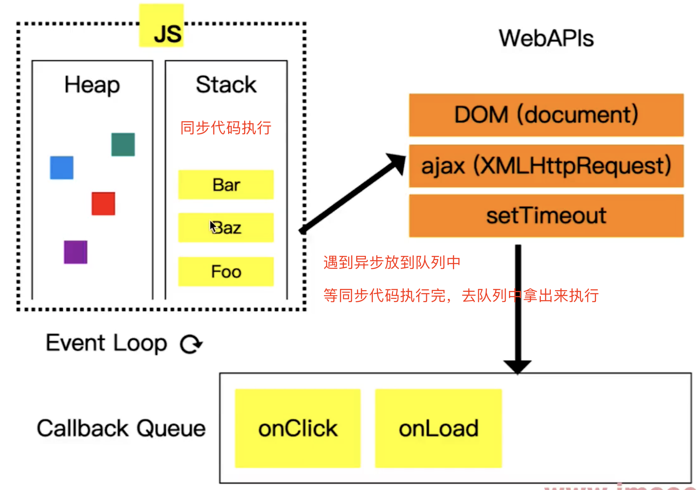
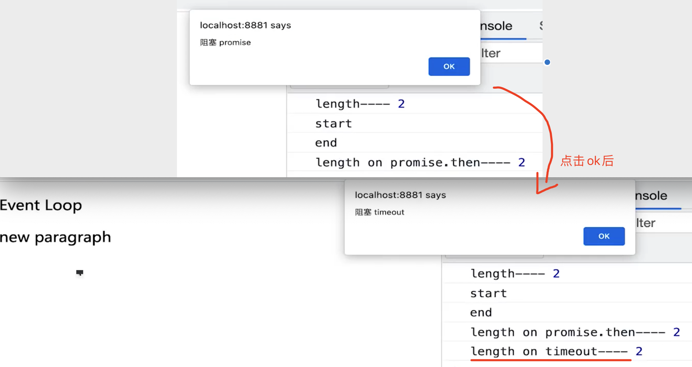
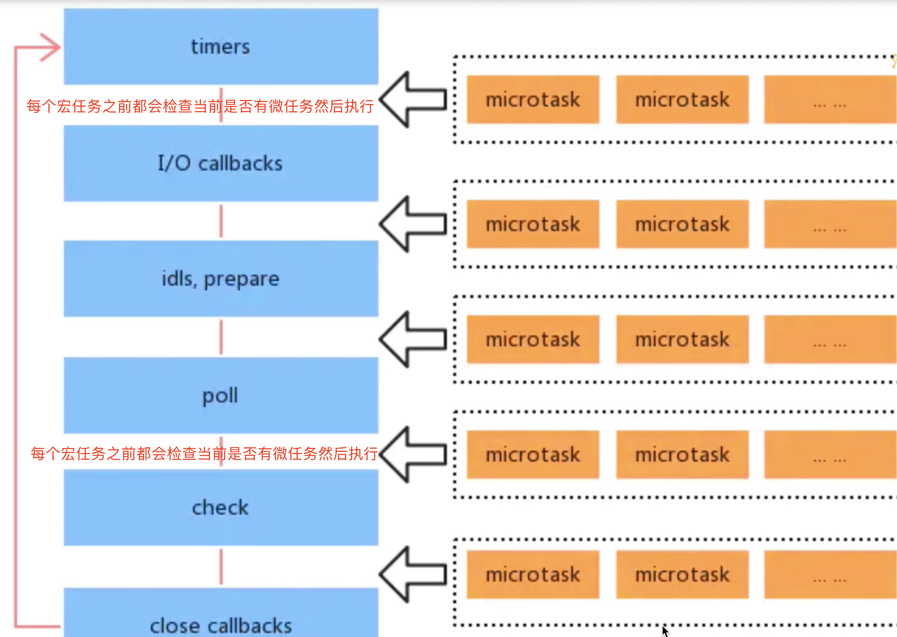
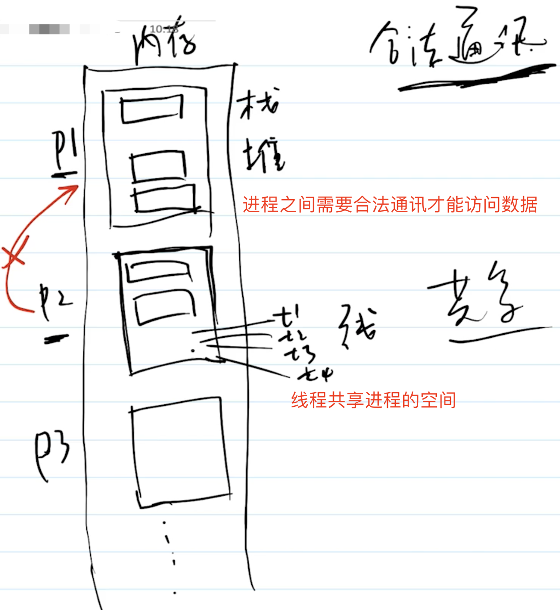

## 浏览器和 nodejs 事件循环（Event Loop）有什么区别

**单线程和异步**

- JS 是单线程的，无论在浏览器还是在 nodejs
- 浏览器中 JS 执行和 DOM 渲染共用一个线程，是互斥的
- 异步是单线程的解决方案

**1. 浏览器中的事件循环**

**异步里面分宏任务和微任务**

- 宏任务：`setTimeout`，`setInterval`，`setImmediate`，`I/O`，`UI`渲染，网络请求
- 微任务：`Promise`，`process.nextTick`，`MutationObserver`、`async/await`
- 宏任务和微任务的区别：微任务的优先级高于宏任务，微任务会在当前宏任务执行完毕后立即执行，而宏任务会在下一个事件循环中执行
  - 宏任务在`页面渲染之后`执行
  - 微任务在`页面渲染之前`执行
  - 也就是微任务在下一轮`DOM`渲染之前执行，宏任务在`DOM`渲染之后执行



```js
    console.log('start')
    setTimeout(() => {
      console.log('timeout')
    })
    Promise.resolve().then(() => {
      console.log('promise then')
    })
    console.log('end')

    // 输出
    // start
    // end
    // promise then
    // timeout

    // 分析

    // 等同步代码执行完后，先从微任务队列中获取（微任务队列优先级高），队列先进先出

    // 宏任务 MarcoTask 队列
    // 如setTimeout 1000ms到1000ms后才会放到队列中
    const MarcoTaskQueue = [
      () => {
        console.log('timeout')
      },
      fn // ajax回调放到宏任务队列中等待
    ]

    ajax(url, fn) // ajax 宏任务 如执行需要300ms


    // ********** 宏任务和微任务中间隔着 【DOM 渲染】 ****************

    // 微任务 MicroTask 队列
    const MicroTaskQueue = [
      () => {
        console.log('promise then')
      }
    ]

    // 等宏任务和微任务执行完后 Event Loop 继续监听（一旦有任务到了宏任务微任务队列就会立马拿过来执行）...

    <p>Event Loop</p>

    <script>
      const p = document.createElement('p')
      p.innerHTML = 'new paragraph'
      document.body.appendChild(p)
      const list = document.getElementsByTagName('p')
      console.log('length----', list.length)
      // 2 console.log('start')
      // 宏任务在页面渲染之后执行
      setTimeout(() => {
        const list = document.getElementsByTagName('p')
        console.log('length on timeout----', list.length)
        // 2 alert('阻塞 timeout')
        // 阻塞JS执行和渲染
      })
      // 微任务在页面渲染之前执行
      Promise.resolve().then(() => {
        const list = document.getElementsByTagName('p')
        console.log('length on promise.then----', list.length)
        // 2 alert('阻塞 promise')
        // 阻塞JS执行和渲染
      })
      console.log('end') </script>
```



**2. nodejs 中的事件循环**

- nodejs 也是单线程，也需要异步
- 异步任务也分为：宏任务 + 微任务
- 但是，它的宏任务和微任务分为不同的类型，有不同的优先级
- 和浏览器的主要区别就是`类型`和`优先级`，理解了这里就理解了 nodejs 的事件循环

**宏任务类型和优先级**

> 类型分为 6 个，优先级从高到底执行

- **Timer** ：`setTimeout`、`setInterval`
- **I/O callbacks**：处理网络、流、TCP 的错误回调
- **Idle,prepare**：闲置状态（nodejs 内部使用）
- **Poll 轮询** ：执行`poll`中的`I/O`队列
- **Check 检查** ：存储`setImmediate`回调
- **Close callbacks** ：关闭回调，如`socket.on('close')`

> **注意** ：`process.nextTick`优先级最高，`setTimeout`比`setImmediate`优先级高

**执行过程**

- 执行同步代码
- 执行微任务（`process.nextTick`优先级最高）
- 按顺序执行 6 个类型的宏任务（每个开始之前都执行当前的微任务）



**总结**

- 浏览器和 nodejs 的事件循环流程基本相同
- **nodejs 宏任务和微任务分类型，有优先级。浏览器里面的宏任务和微任务是没有类型和优先级的**
- node17 之后推荐使用`setImmediate`代替`process.nextTick`（如果使用`process.nextTick`执行复杂任务导致后面的卡顿就得不偿失了，尽量使用低优先级的 api 去执行异步）

```js
console.info("start");
setImmediate(() => {
  console.info("setImmediate");
});
setTimeout(() => {
  console.info("timeout");
});
Promise.resolve().then(() => {
  console.info("promise then");
});
process.nextTick(() => {
  console.info("nextTick");
});
console.info("end");

// 输出
// start
// end
// nextTick
// promise then
// timeout
// setImmediate
```

## nodejs 如何开启多进程，进程如何通讯

**进程 process 和线程 thread 的区别**

- 进程，`OS`进行资源分配和调度的最小单位，有独立的内存空间
- 线程，`OS`进程运算调度的最小单位，共享进程内存空间
- JS 是单线程的，但可以开启多进程执行，如`WebWorker`



**为何需要多进程**

- 多核 CPU，更适合处理多进程
- 内存较大，多个进程才能更好利用（单进程有内存上限）
- 总之，压榨机器资源，更快、更节省

**如何开启多进程**

- 开启子进程 `child_process.fork`和`cluster.fork`
  - `child_process.fork`用于单个计算量较大的计算
  - `cluster`用于开启多个进程，多个服务
- 使用`send`和`on`传递消息

**使用 child_process.fork 方式**

```js
const http = require("http");
const fork = require("child_process").fork;

const server = http.createServer((req, res) => {
  if (req.url === "/get-sum") {
    console.info("主进程 id", process.pid);

    // 开启子进程 计算结果返回
    const computeProcess = fork("./compute.js");
    computeProcess.send("开始计算"); // 发送消息给子进程开始计算，在子进程中接收消息调用计算逻辑，计算完成后发送消息给主进程

    computeProcess.on("message", (data) => {
      console.info("主进程接收到的信息：", data);
      res.end("sum is " + data);
    });

    computeProcess.on("close", () => {
      console.info("子进程因报错而退出");
      computeProcess.kill(); // 关闭子进程
      res.end("error");
    });
  }
});
server.listen(3000, () => {
  console.info("localhost: 3000");
});

// compute.js

/** * @description 子进程，计算 */

function getSum() {
  let sum = 0;
  for (let i = 0; i < 10000; i++) {
    sum += i;
  }
  return sum;
}

process.on("message", (data) => {
  console.log("子进程 id", process.pid);
  console.log("子进程接收到的信息: ", data);

  const sum = getSum();

  // 发送消息给主进程
  process.send(sum);
});
```

**使用 cluster 方式**

```js
const http = require("http");
const cpuCoreLength = require("os").cpus().length;
const cluster = require("cluster");

// 主进程
if (cluster.isMaster) {
  for (let i = 0; i < cpuCoreLength; i++) {
    cluster.fork(); // 根据核数 开启子进程
  }

  cluster.on("exit", (worker) => {
    console.log("子进程退出");
    cluster.fork(); // 进程守护
  });
} else {
  // 多个子进程会共享一个 TCP 连接，提供一份网络服务
  const server = http.createServer((req, res) => {
    res.writeHead(200);
    res.end("done");
  });
  server.listen(3000);
}

// 工作中 使用PM2开启进程守护更方便
```
