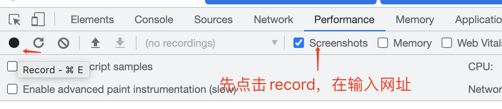

## 你们的工作流程是怎么样的

**流程图**

下图是完整的大厂前端项目研发流程图


**项目角色**

- 项目委员会：这是一个很虚的角色，即能确定项目是否要做的那帮人，有时候可能就是一个高级经理就能拍板确定。和我们实际开发没啥关系，不用去关心他。
- `PM`：产品经理，也是一个项目的推动者，即兼职项目经理的角色。
- `UE`：交互设计师，负责页面布局、交互的设计，不负责视图的细节。
- `UI`：视觉设计师，交互确定之后，设计页面样式。注意，很多情况下，`UE` 和 `UI` 是一个人。
- `RD`：后端开发人员。
- `CRD`：客户端开发人员，安卓和 `ios` 都是。
- `FE`：前端开发人员。
- `QA`：测试人员。
- `OP`：服务器运维人员，一般负责审批上线单

**主要流程**

**项目立项**

- 主要是各个部门的 `leader` 确定项目要做了，就是"拍板儿"确定。此时不需要工程师参与，因为决定权在于他们。项目立项时没有任何详细的信息，如需求、设计图等，都要后面继续做。
- **编写需求和需求评审**
  - `PM` 根据项目的背景和目标，编写需求文档，画原型图（不是 `UI` 设计图），然后叫各个角色开会评审。
  - 你如果作为 `FE` 角色去参与评审，要积极提出自己的问题和建议。需求评审不一定一次通过。
  - 如果此时 `PM` 跟你要工作排期，你不要立即回复。回去跟你的 `leader` 商量之后，给一个谨慎的排期。
- **编写技术方案**
  - 需求指导设计，设计指导开发。先做技术方案设计，写文档，待评审之后再开发。
- **技术方案评审**
  - 技术方案写完之后，要叫 `leader` ，以及其他技术角色人员一起评审。
    - 第一，和其他技术人员确定接口格式，是否都能认同
    - 第二，让 `leader` 或者架构师确定这个设计有没有漏洞、安全问题等
- **交互视觉设计和评审**
  - 需求评审通过之后，`UE` 和 `UI` 就开始出设计稿。做完设计稿之后，会叫相关开发人员参与评审。和需求评审一样，你要提出自己的问题和建议。
- **开发**
  - 上述评审都结束之后，才可以进入开发阶段。开发时要注意开发规范，及时 `code review`，写单元测试。
- **视觉联调**
  - 网页界面开发完成之后，要找 `UI` 人员来视觉联调，让他们确认是否可以。如果不可以，就直接修改，直到评审通过。
  - 这一步要尽早执行，不要等待临上线了，再去调整 `UI` 界面。
- **程序联调**
  - 代码功能开发完之后，要和其他相关技术人员（`RD`、`CRD`）进行接口联调。就是在开发环境下，先把系统对接起来，看看会不会出错。
  - 注意，接口联调不是测试，不用太过于项目，能把最基本的功能跑通即可。
- **自测**
  - 对于自己开发的功能，一定要自己按照需求测试一遍。不要求测试的很详细，至少也把基本功能跑通。
  - 这一步是为了防止提测之后被 `QA` 发现基本功能不可用，就很尴尬。人家会觉得你不靠谱。
- **提测**
  - 自测完成之后，即可把代码提测给 `QA` 。这一步很关键，要发邮件，抄送给项目组的相关成员。
- **测试**
  - `QA` 进行详细的功能测试。测试期间会有 `bug` 反馈，要及时修复 `bug` ，并及时让 `QA` 回归测试。
  - 测试期间要积极和 `QA` 沟通，最好每天都开一个站会。
- **上线 \& 回归测试**
  - `QA` 测试完成会发邮件全体通报测试通过，测试就可以准备上线。
  - 上线之后要及时和 `QA` 组织回归测试，待回归测试完成之后才可以通知：上线完成
- **项目总结（可选）**
  - 回顾一下经过，总结一下得失，积累一点经验，这样才能慢慢成长

## 工作中遇到过哪些项目难点，是如何解决的

**遇到问题要注意积累**

- 每个人都会遇到问题，总有几个问题让你头疼
- 日常要注意积累，解决了问题要自己写文章复盘

**如果之前没有积累**

- 回顾一下半年之内遇到的难题
- 思考当时解决方案，以及解决之后的效果
- 写一篇文章记录一下，答案就有了

**答案模板**

- 描述问题：背景 + 现象 + 造成的影响
- 问题如何被解决：分析 + 解决
- 自己的成长：学到了什么 + 以后如何避免

**一个示例**

- 问题：编辑器只能回显 JSON 格式的数据，而不支持老版本的 HTML 格式
- 解决：将老版本的 HTML 反解析成 JSON 格式即可解决
- 成长：要考虑完整的输入输出 + 考虑旧版本用户 + 参考其他产品

## 前端性能优化

**前言**

- 是一个综合性问题，没有标准答案，但要求尽量全面
- 某些细节可能会问：防抖、节流等

**性能优化原则**

- 多使用内存、缓存或其他方法
- 减少`CPU`计算量，减少网络加载耗时

**从何入手**

- **让加载更快**

  - 减少资源体积：压缩代码
  - 减少访问次数：合并代码，`SSR`服务端渲染，缓存

    - **SSR**
      - 服务端渲染：将网页和数据一起加载，一起渲染
      - 非`SSR`模式（前后端分离）：先加载网页，在加载数据，在渲染数据
    - **缓存**

      - 静态资源加`hash`后缀，根据文件内容计算`hash`
      - 文件内容不变，则`hash`不变，则`url`不变
      - `url`和文件不变，则会自动触发`http`缓存机制，返回`304`

        

  - 减少请求时间：`DNS`预解析，`CDN`，`HTTP2`

    - **DNS 预解析**
      - `DNS`解析：将域名解析为`IP`地址
      - `DNS`预解析：提前解析域名，将域名解析为`IP`地址
      - `DNS`预解析的方式：`<link rel="dns-prefetch" href="//www.baidu.com">`
    - **CDN**

      - `CDN`：内容分发网络，将资源分发到离用户最近的服务器上
      - `CDN`的优点：加快资源加载速度，减少服务器压力
      - `CDN`的缺点：增加了网络延迟，增加了服务器成本

        

    - **HTTP2**
      - `HTTP2`：`HTTP`协议的下一代版本
      - `HTTP2`的优点：多路复用，二进制分帧，头部压缩，服务器推送

- **让渲染更快**

  - `CSS`放在`head`，`JS`放在`body`下面
  - 尽早开始执行`JS`，用`DOMContentLoaded`触发

```js
window.addEventListener("load", function () {
  // 页面的全部资源加载完才会执行，包括图片、视频等
});
window.addEventListener("DOMContentLoaded", function () {
  // DOM 渲染完才执行，此时图片、视频等可能还没有加载完
});
```

- 懒加载（图片懒加载，上滑加载更多） 

- 对`DOM`查询进行缓存

  

- 频繁`DOM`操作，合并到一起插入到`DOM`结构

  

- 节流、防抖，让渲染更流畅

  - **防抖**

    - 防抖动是将多次执行变为`最后一次执行`
    - 适用于：`input`、`click`等

```js
const input = document.getElementById("input");
// 防抖
function debounce(fn, delay = 500) {
  // timer 是闭包中的
  let timer = null;
  // 这里返回的函数是每次用户实际调用的防抖函数
  // 如果已经设定过定时器了就清空上一次的定时器
  // 开始一个新的定时器，延迟执行用户传入的方法
  return function () {
    if (timer) {
      clearTimeout(timer);
    }
    timer = setTimeout(() => {
      fn.apply(this, arguments);
      timer = null;
    }, delay);
  };
}
input.addEventListener(
  "keyup",
  debounce(function (e) {
    console.log(e.target);
    console.log(input.value);
  }, 600)
);
```

    - **节流**

      - 节流是将多次执行变成`每隔一段时间执行`
      - 适用于：`resize`、`scroll`、`mousemove`等

```js
const div = document.getElementById("div"); // 节流
function throttle(fn, delay = 100) {
  let timer = null;

  return function () {
    if (timer) {
      // 当前有任务了，直接返回
      return;
    }
    timer = setTimeout(() => {
      fn.apply(this, arguments);
      timer = null;
    }, delay);
  };
} // 拖拽
div.addEventListener(
  "drag",
  throttle(function (e) {
    console.log(e.offsetX, e.offsetY);
  })
);
```

## 前端常用的设计模式和使用场景

- **工厂模式**
  - 用一个工厂函数来创建实例，使用的时候隐藏`new`，可在工厂函数中使用`new`（`function factory(a,b,c) {return new Foo()}`）
  - 如`jQuery`的`$`函数：`$`等于是在内部使用了`new JQuery`实例（用工厂函数`$`包裹了一下），可以直接使用`$(div)`
  - `react`的`createElement`
- **单例模式**

  - 全局唯一的实例（无法生成第二个）
  - 如`Vuex`、`Redux`的`store`
  - 如全局唯一的`dialog`、`modal`
  - 演示

```js
        // 通过class实现单例构造器
        class Singleton {
          private static instance
          private contructor() {}
          public static getInstance() {
            if(!this.instance) {
              this.instance = new Singleton()
            }
            return this.instance
          },
          fn1() {}
          fn2() {}
        }

        // 通过闭包实现单例构造器
        const Singleton = (function () {
          // 隐藏Class的构造函数，避免多次实例化
          function FooService() {}

          // 未初始化的单例对象
          let fooService;

          return {
            // 创建/获取单例对象的函数
            // 通过暴露一个 getInstance() 方法来创建/获取唯一实例
            getInstance: function () {
              if (!fooService) {
                fooService = new FooService();
              }
              return fooService;
            }
          }
        })();
        // 使用
        const s1 = Singleton.getInstance()
        const s2 = Singleton.getInstance()
        // s1 === s2 // 都是同一个实例
```

- **代理模式**

  - 使用者不能直接访问对象，而是访问一个代理层
  - 在代理层可以监听`get` `set`做很多事
  - 如`ES6 Proxy`实现`Vue3`响应式

```js
var obj = new Proxy(
  {},
  {
    get: function (target, key, receiver) {
      return Refect.get(target, key, receiver);
    },
    set: function (target, key, value, receiver) {
      return Refect.set(target, key, value, receiver);
    }
  }
);
```

- **观察者模式**

  - 观察者模式（基于发布订阅模式）有观察者，也有被观察者
  - **观察者需要放到被观察者中，被观察者的状态变化需要通知观察者** 我变化了，内部也是基于发布订阅模式，收集观察者，状态变化后要主动通知观察者

```js
class Subject {
  // 被观察者 学生
  constructor(name) {
    this.state = "happy";
    this.observers = [];
    // 存储所有的观察者
  }
  // 收集所有的观察者
  attach(o) {
    // Subject. prototype. attch
    this.observers.push(o);
  }
  // 更新被观察者 状态的方法
  setState(newState) {
    this.state = newState;
    // 更新状态
    // this 指被观察者 学生
    this.observers.forEach((o) => o.update(this));
    // 通知观察者 更新它们的状态
  }
}

class Observer {
  // 观察者 父母和老师
  constructor(name) {
    this.name = name;
  }
  update(student) {
    console.log("当前" + this.name + "被通知了", "当前学生的状态是" + student.state);
  }
}

let student = new Subject("学生");
let parent = new Observer("父母");
let teacher = new Observer("老师");

// 被观察者存储观察者的前提，需要先接纳观察者
student.attach(parent);
student.attach(teacher);
student.setState("被欺负了");
```

- **发布订阅模式**

  - 发布订阅者模式，一种对象间一对多的依赖关系，当一个对象的状态发生改变时，所依赖它的对象都将得到状态改变的通知。
  - **主要的作用(优点)：**
    - 广泛应用于异步编程中(替代了传递回调函数)
    - 对象之间松散耦合的编写代码
  - **缺点：**
    - 创建订阅者本身要消耗一定的时间和内存
    - 多个发布者和订阅者嵌套一起的时候，程序难以跟踪维护
  - **发布订阅者模式和观察者模式的区别？**

    - 发布/订阅模式是观察者模式的一种变形，两者区别在于，**发布/订阅模式在观察者模式的基础上，在目标和观察者之间增加一个调度中心。**
    - **观察者模式** 是由具体目标调度，比如当事件触发，`Subject` 就会去调用观察者的方法，所以观察者模式的订阅者与发布者之间是存在依赖的（互相认识的）。
    - **发布/订阅模式** 由统一调度中心调用，因此发布者和订阅者不需要知道对方的存在（`publisher`和`subscriber`是不认识的，中间有个`Event Channel`隔起来了）
    - 总结一下：

      - 观察者模式：`Subject`和`Observer`直接绑定，没有中间媒介。如`addEventListener`直接绑定事件
      - 发布订阅模式：`publisher`和`subscriber`互相不认识，需要有中间媒介`Event Channel`。如`EventBus`自定义事件

        

  - **实现的思路：**

    - 创建一个对象(缓存列表)
    - `on`方法用来把回调函数`fn`都加到缓存列表中
    - `emit` 根据`key`值去执行对应缓存列表中的函数
    - `off`方法可以根据`key`值取消订阅

```js
class EventEmiter {
  constructor() {
    // 事件对象，存放订阅的名字和事件
    this._events = {};
  }
  // 订阅事件的方法
  on(eventName, callback) {
    if (!this._events) {
      this._events = {};
    }
    // 合并之前订阅的 cb
    this._events[eventName] = [...(this._events[eventName] || []), callback];
  }
  // 触发事件的方法
  emit(eventName, ...args) {
    if (!this._events[eventName]) {
      return;
    }
    // 遍历执行所有订阅的事件
    this._events[eventName].forEach((fn) => fn(...args));
  }
  off(eventName, cb) {
    if (!this._events[eventName]) {
      return;
    }
    // 删除订阅的事件
    this._events[eventName] = this._events[eventName].filter((fn) => fn != cb && fn.l != cb);
  }
  // 绑定一次 触发后将绑定的移除掉 再次触发掉
  once(eventName, callback) {
    const one = (...args) => {
      // 等 callback 执行完毕在删除
      callback(args);
      this.off(eventName, one);
    };
    one.l = callback;
    // 自定义属性
    this.on(eventName, one);
  }
}

// 测试用例
let event = new EventEmiter();

let login1 = function (...args) {
  console.log("login success1", args);
};
let login2 = function (...args) {
  console.log("login success2", args);
};
// event.on('login',login1) event.once('login',login2) event.off('login',login1)
// 解除订阅 event.emit('login', 1,2,3,4,5) event.emit('login', 6,7,8,9) event.emit('login', 10,11,12)
```

- **装饰器模式**
  - 原功能不变，增加一些新功能（`AOP`面向切面编程）
  - `ES`和`TS`的`Decorator`语法就是装饰器模式

> 经典设计模式有`23` 个，这是基于后端写的，前端不是都常用

## 如果一个 H5 很慢，如何排查性能问题

- 通过前端性能指标分析
- 通过`Performance`、`lighthouse`分析
- 持续跟进，持续优化

**前端性能指标**

- `FP(First Paint)`：首次绘制，即首次绘制任何内容到屏幕上
- `FCP(First Content Paint)`：首次内容绘制，即首次绘制非空白内容到屏幕上
- `FMP(First Meaning Paint)`：首次有意义绘制，即首次绘制有意义的内容到屏幕上-已弃用，改用`LCP`
  - `FMP`业务指标，没有统一标准
- `LCP(Largest Contentful Paint)`：最大内容绘制，即最大的内容绘制到屏幕上
- `TTI(Time to Interactive)`：可交互时间，即页面加载完成，可以进行交互的时间
- `TBT(Total Blocking Time)`：总阻塞时间，即页面加载过程中，主线程被占用的时间
- `CLS(Cumulative Layout Shift)`：累计布局偏移，即页面加载过程中，元素位置发生变化的程度
- `FCP`、`LCP`、`TTI`、`TBT`、`CLS`都是`web-vitals`库提供的指标
- `DCL(DOM Content Loaded)`：`DOM`加载完成，即页面`DOM`结构加载完成的时间
- `L(Load)`：页面完全加载完成的时间


**通过 Chrome Performance 分析**

> 打开浏览器无痕模式，点击`Performance > ScreenShot`



如果加载很快就会很快就到达`FP`，在分析`FCP、LCP、DCL、L`看渲染时间


国内访问 GitHub 可以看到加载到`FP`非常慢，但是渲染很快


`network > show overview` 查看每个资源的加载时间，或者从`waterfall`查看


**使用 lighthouse 分析**


    # 通过node使用
    npm i lighthouse -g

    # 需要稍等一会就分析完毕输出报告
    lighthouse https://baidu.com --view --preset=desktop

**通过工具就可以识别到问题**

- 加载慢？
  - 优化服务器硬件配置，使用`CDN`
  - 路由懒加载，大组件异步加载--减少主包体积
  - 优化`HTTP`缓存策略
- 渲染慢
  - 优化服务端接口（如`Ajax`获取数据慢）
  - 继续分析，优化前端组件内部逻辑（参考`vue`、`react`优化）
  - 服务端渲染`SSR`

> 性能优化是一个循序渐进的过程，不像 bug 一次解决。持续跟进统计结果，再逐步分析性能瓶颈，持续优化。可使用第三方统计服务，如百度统计

## 后端一次性返回十万条数据，你该如何渲染

- **设计不合理**
  - 后端返回十万条数据，本身技术方案设计就不合理（一般情况都是分页返回，返回十万条浏览器渲染是一个问题，十万条数据加载也需要一个过程）
  - 后端的问题，要用后端的思维去解决-中间层
- 浏览器能否处理十万条数据？
  - 渲染到`DOM`上会非常卡顿
- **方案 1：自定义中间层**
  - 自定义`nodejs`中间层，获取并拆分这十万条数据
  - 前端对接`nodejs`中间层，而不是服务端
  - 成本比较高
- **方案 2：虚拟列表**
  - 只创建可视区的`DOM`（比如前十条数据），其他区域不显示，根据数据条数计算每条数据的高度，用`div`撑起高度
  - 随着浏览器的滚动，创建和销毁`DOM`
  - 虚拟列表实现起来非常复杂，工作中可使用第三方库（`vue-virtual-scroll-list`、`react-virtualiszed`）
  - 虚拟列表只是无奈的选择，实现复杂效果而效果不一定好（低配手机）


## H5 页面如何进行首屏优化

- **路由懒加载**
  - 适用于单页面应用
  - 路由拆分，优先保证首页加载
- **服务端渲染 SSR**
  - `SSR`渲染页面过程简单，性能好
  - 纯`H5`页面，`SSR`是性能优化的终极方案，但对服务器成本也高
- **分页**
  - 针对列表页，默认只展示第一页内容
  - 上划加载更多
- **图片懒加载 lazyLoad**
  - 针对详情页，默认只展示文本内容，然后触发图片懒加载
  - 注意：提前设置图片尺寸，尽量只重绘不重排
- **Hybrid**
  - 提前将`HTML JS CSS`下载到`App`内部，省去我们从网上下载静态资源的时间
  - 在`App webview`中使用`file://`协议加载页面文件
  - 再用`Ajax`获取内容并展示
- 性能优化要配合分析、统计、评分等，做了事情要有结果有说服力
- 性能优化也要配合体验，如骨架屏、`loading`动画等

**图片懒加载演示**

```html
<head>
  <style>
    .item-container {
      border-top: 1px solid #ccc;
      margin-bottom: 30px;
    }
    .item-container img {
      width: 100%;
      border: 1px solid #eee;
      border-radius: 10px;
      overflow: hidden;
    }
  </style>
</head>
<body>
  <h1>img lazy load</h1>

  <div class="item-container">
    <p>新闻标题</p>
    
  </div>

  <div class="item-container">
    <p>新闻标题</p>
    
  </div>

  <div class="item-container">
    <p>新闻标题</p>
    
  </div>

  <div class="item-container">
    <p>新闻标题</p>
    
  </div>

  <div class="item-container">
    <p>新闻标题</p>
    
  </div>

  <div class="item-container">
    <p>新闻标题</p>
    
  </div>

  <script src="https://cdn.bootcdn.net/ajax/libs/lodash.js/4.17.21/lodash.min.js"></script>
  <script>
    function mapImagesAndTryLoad() {
      const images = document.querySelectorAll('img[data-src]')
      if (images.length === 0) return
      images.forEach(img => {
        const rect = img.getBoundingClientRect()
        if (rect.top < window.innerHeight) {
          // 漏出来
          // console.info('loading img', img.dataset.src)
          img.src = img.dataset.src img.removeAttribute('data-src')
          // 移除 data-src 属性，为了下次执行时减少计算成本
          }
        })
      }
      window.addEventListener('scroll', _.throttle(() => { mapImagesAndTryLoad() }, 100))
      mapImagesAndTryLoad()
  </script>
</body>
```

## 请描述 js-bridge 的实现原理

**什么是 JS Bridge**

- `JS`无法直接调用`native API`
- 需要通过一些特定的格式来调用
- 这些格式就统称`js-bridge`，例如微信`JSSKD`


**JS Bridge 的常见实现方式**

- 注册全局`API`
- `URL Scheme`（推荐）

```js
    <!-- <iframe id="iframe1"></iframe> -->

    <script>
      // const version = window.getVersion()
      // 异步
      // const iframe1 = document.getElementById('iframe1')
      // iframe1.onload = () => {
        // const content = iframe1.contentWindow.document.body.innerHTML
        // console.info('content', content)
        // }
        // iframe1.src = 'my-app-name://api/getVersion'
        // app识别协议my-app-name:
        //，在app内处理返回给webview，而不是直接发送网络请求
        // URL scheme
        // 使用iframe 封装 JS-bridge
        const sdk = {
          invoke(url, data = {}, onSuccess, onError) {
            const iframe = document.createElement('iframe')
            iframe.style.visibility = 'hidden'
            // 隐藏iframe
            document.body.appendChild(iframe)
            iframe.onload = () => {
              const content = iframe1.contentWindow.document.body.innerHTML
              onSuccess(JSON.parse(content)) iframe.remove()

            }
            iframe.onerror = () => {
              onError()
              iframe.remove()
            }
            iframe.src = `my-app-name://${url}?data=${JSON.stringify(data)}`
          },
          fn1(data, onSuccess, onError) {
            this.invoke('api/fn1', data, onSuccess, onError)
          },
          fn2(data, onSuccess, onError) {
            this.invoke('api/fn2', data, onSuccess, onError)
          },
          fn3(data, onSuccess, onError) {
            this.invoke('api/fn3', data, onSuccess, onError)
          },
        }
      </script>
```

## 从零搭建开发环境需要考虑什么

- 代码仓库，发布到哪个`npm`仓库（如有需要）
- 技术选型，`Vue`或`React`
- 代码目录规范
- 打包构建`webpack`等，做打包优化
- `eslint`、`prettier`、`commit-lint`
- `pre-commit` 提交前检查（在调用`git commit` 命令时自动执行某些脚本检测代码,若检测出错,则阻止`commit`代码,也就无法`push`）
- 单元测试
- `CI/CD`流程（如搭建`jenkins`部署项目）
- 开发环境、预发布环境
- 编写开发文档

## 如果你是项目前端技术负责人，将如何做技术选型（常考）

- **技术选型，选什么？**
  - 前端框架（`Vue React Nuxt.hs Next.js` 或者`nodejs`框架）
  - 语言（`JavaScript`或`Typescript`）
  - 其他（构建工具、`CI/CD`等）
- **技术选型的依据**
  - 社区是否足够成熟
  - 公司已经有了经验积累
  - 团队成员的学习成本
  - 要站在公司角度，而非个人角度
- **要全面考虑各种成本**
  - 学习成本
  - 管理成本（如用`TS`遍地都是`any`怎么办）
  - 运维成本（如用`ssr`技术）

## 高效的字符串前缀匹配如何做

- 有一个英文单词库（数组），里面有几十个英文单词
- 输入一个字符串，快速判断是不是某一个单词的前缀
- 说明思路，不用写代码

**思路分析**

- 常规思路
  - 遍历单词库数组
  - `indexOf`判断前缀
  - 实际复杂度超过了`O(n)`，因为每一步遍历要考虑`indexOf`的计算量
- 优化
  - 英文字母一共`26`个，可以提前把单词库数组拆分为`26`个
  - 第一层拆分为`26`个，第二第三层也可以继续拆分
  - 最后把单词库拆分为一颗树
  - 如`array`拆分为`{a:{r:{r:{a:{y:{}}}}}}` 查询的时候这样查`obj.a.r.r.a.y` 时间复杂度就是`O(1)`
  - 转为为树的过程我们不用管，单词库更新频率一般都是很低的，我们执行一次提前转换好，通过哈希表（对象）查询`key`非常快
- 性能分析
  - 如遍历数组，时间复杂度至少`O(n)`起步（`n`是数组长度）
  - 改为树，时间复杂度从大于`O(n)`降低到`O(m)`（`m`是单词的长度）
  - 哈希表（对象）通过`key`查询，时间复杂度是`O(1)`

## 前端路由原理

**hash 的特点**

- `hash`变化会触发网页跳转，即浏览器的前进和后退
- `hash`变化不会刷新页面，`SPA`必须的特点
- `hash`永远不会提交到`server`端
- 通过`onhashchange`监听

**H5 History**

- 用`url`规范的路由，但跳转时不刷新页面
- 通过`history.pushState`和`history.onpopstate`监听
- `H5 History`需要后端支持

  - 当我们进入到子路由时刷新页面，`web`容器没有相对应的页面此时会出现`404`
  - 所以我们只需要配置将任意页面都重定向到 `index.html`，把路由交由前端处理
  - 对`nginx`配置文件`.conf`修改，添加`try_files $uri $uri/ /index.html;`

    server { listen 80; server_name www.xxx.com;

        location / {
          index /data/dist/index.html;
          try_files $uri $uri/ /index.html;
        }

    }

**两者选择**

- `to B`系统推荐使用 hash，简单易用，对`url`规范不敏感
- `to C`系统，可以考虑使用`H5 History`，但需要服务端支持
- 能选择简单的，就别用复杂的，要考虑成本和收益

```js
  // hash 变化，包括：
  // a. JS 修改 url
  // b. 手动修改 url 的 hash
  // c. 浏览器前进、后退
  window.onhashchange = (event) => { console.log('old url', event.oldURL) console.log('new url', event.newURL)
        console.log('hash:', location.hash)
  }

  // 页面初次加载，获取 hash
  document.addEventListener('DOMContentLoaded', () => { console.log('hash:', location.hash) })

  // JS 修改 url
  document.getElementById('btn1').addEventListener('click', () => { location.href = '#/user' })

  // history API

  // 页面初次加载，获取 path
  document.addEventListener('DOMContentLoaded', () => { console.log('load', location.pathname) })

  // 打开一个新的路由 // 【注意】用 pushState 方式，浏览器不会刷新页面
  document.getElementById('btn1').addEventListener('click', () => {
    const state = { name: 'page1' }
    console.log('切换路由到', 'page1')
    history.pushState(state, '', 'page1')
    // 重要！！
  })

  // 监听浏览器前进、后退
  window.onpopstate = (event) => {
    // 重要！！
    console.log('onpopstate', event.state, location.pathname)
  }

  // 需要 server 端配合，可参考 // https://router.vuejs.org/zh/guide/essentials/history-mode.html#%E5%90%8E%E7%AB%AF%E9%85%8D%E7%BD%AE%E4%BE%8B%E5%AD%90
```

## 首屏渲染优化

- `css` / `js` 分割，使首屏依赖的文件体积最小，内联首屏关键 `css` / `js`；
- 非关键性的文件尽可能的 异步加载和懒加载，避免阻塞首页渲染；
- 使用`dns-prefetch` / `preconnect` / `prefetch` / preload 等浏览器提供的资源提示，加快文件传输；
- 谨慎控制好 Web 字体，一个大字体包足够让你功亏一篑
  - 控制字体包的加载时机；
  - 如果使用的字体有限，那尽可能只将使用的文字单独打包，能有效减少体积； 合理利用 `Localstorage` / `services worker` 等存储方式进行 数据与资源缓存
- **分清轻重缓急**
  - 重要的元素优先渲染；
  - 视窗内的元素优先渲染
- **服务端渲染(SSR)** :
  - 减少首屏需要的数据量，剔除冗余数据和请求；
  - 控制好缓存，对数据/页面进行合理的缓存；
  - 页面的请求使用流的形式进行传递；
- **优化用户感知**
  - 利用一些动画 过渡效果，能有效减少用户对卡顿的感知；
  - 尽可能利用 骨架屏(`Placeholder`) / `Loading` 等减少用户对白屏的感知；
  - 动画帧数尽量保证在 `30帧` 以上，低帧数、卡顿的动画宁愿不要；
  - js 执行时间避免超过 `100ms`，超过的话就需要做
    - 寻找可 缓存 的点
    - 任务的 分割异步 或 `web worker` 执行

**移动端的性能优化**

1. 首屏加载和按需加载，懒加载
2. 资源预加载
3. 图片压缩处理，使用`base64`内嵌图片
4. 合理缓存`dom`对象
5. 使用`touchstart`代替`click`（`click 300`毫秒的延迟）
6. 利用`transform:translateZ(0)`，开启硬件 GUP 加速
7. 不滥用`web`字体，不滥用`float`（布局计算消耗性能），减少`font-size`声明
8. 使用`viewport`固定屏幕渲染，加速页面渲染内容
9. 尽量使用事件代理，避免直接事件绑定

## interface 和 type 的区别（常考）

在 TypeScript 中，`interface`和`type`都用于定义类型，但它们有一些区别：

1. 语法差异：

- `interface`：使用`interface`关键字来定义接口，例如：`interface Person { name: string; age: number; }`
- `type`：使用`type`关键字来定义类型别名，例如：`type Person = { name: string; age: number; }`

2. 可扩展性：

- `interface`：接口可以通过继承或合并来扩展，可以在定义接口时使用`extends`关键字继承其他接口，也可以使用`&`运算符合并多个接口。
- `type`：类型别名不支持继承或合并，它只能用于定义现有类型的别名。

3. 表达能力：

- `interface`：接口可以描述对象、函数、类等复杂类型，还可以定义可选属性、只读属性、函数类型等。
- `type`：类型别名可以描述对象、联合类型、交叉类型等，但不支持定义类和接口。

4. 使用场景：

- `interface`：适用于定义对象的形状和结构，以及类的实现。
- `type`：适用于定义复杂类型别名、联合类型、交叉类型等。

总的来说，`interface`更适合用于定义对象的形状和结构，而`type`更适合用于定义复杂类型别名和联合类型。在实际使用中，可以根据具体需求选择使用哪种方式。
