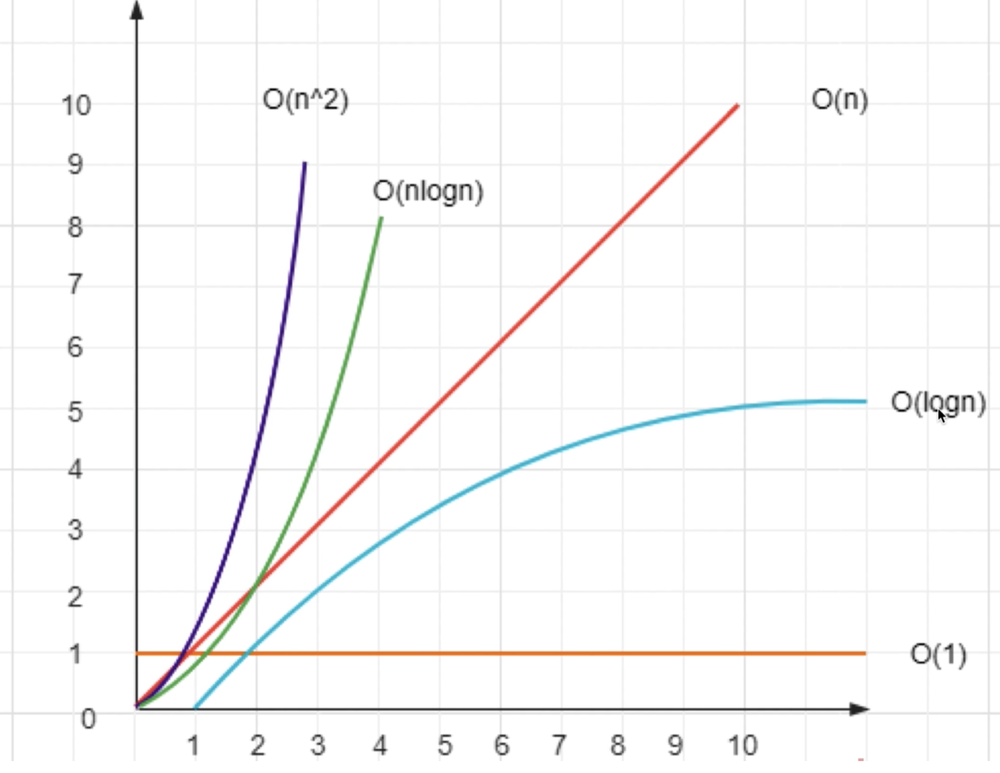
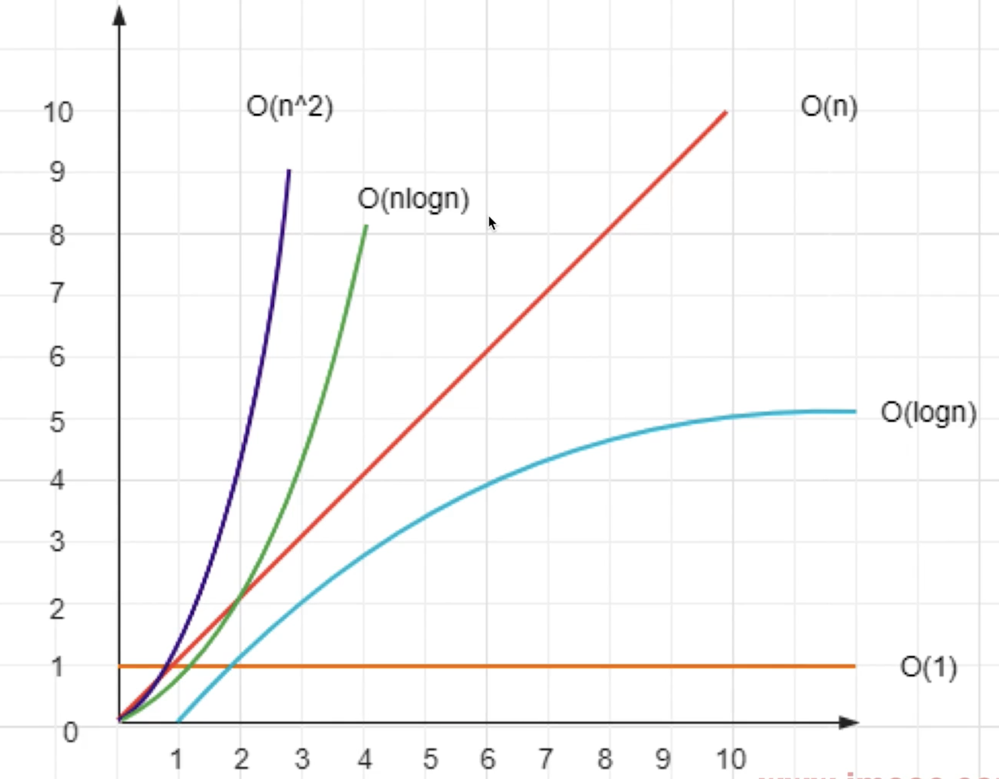
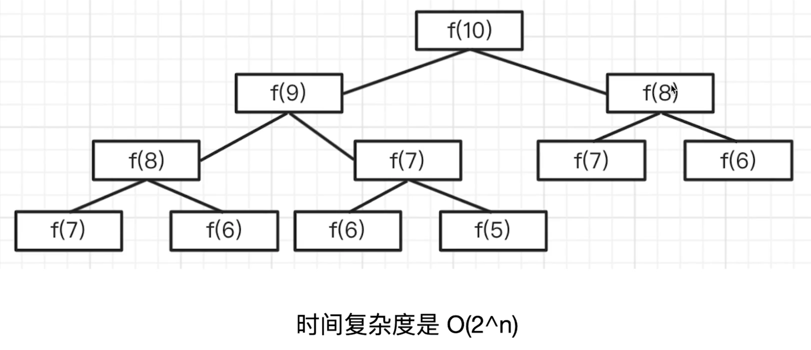
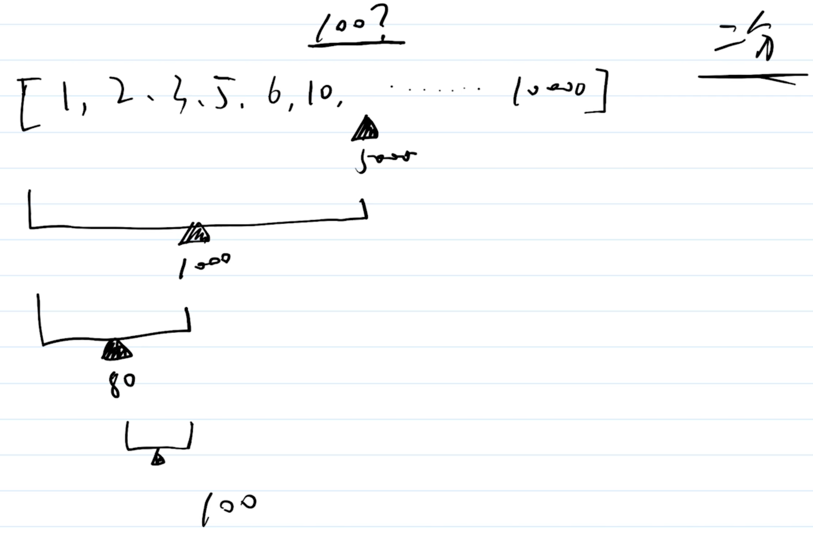
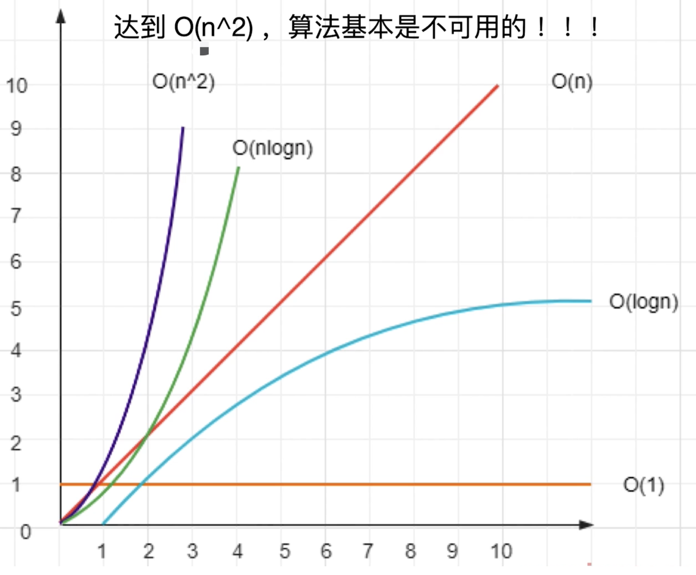
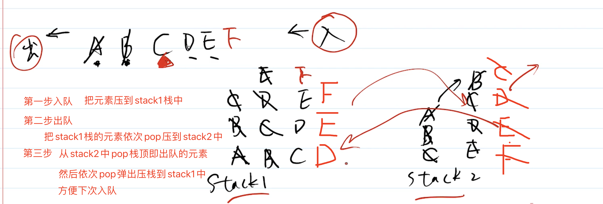
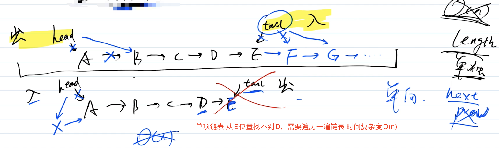

## 时间复杂度与空间复杂度基本概念

**什么是复杂度**

- 程序执行需要的计算量和内存空间
- 复杂度是数量级（方便记忆推广）不是具体的数字
- 一般针对一个具体的算法，而非一个完整的系统



**时间复杂度-程序执行时需要的计算量（CPU）**

- `O(n)`一次就够（数量级）
- `O(n)`和传输的数据一样（数量级）
- `O(n^2)`数据量的平方（数量级）
- `O(logn)`数据量的对数（数量级）
- `O(n*logn)`数据量\*数据量的对数（数量级）

  function fn1(obj) { // O(1) return obj.a + obj.b }

  function fn2(arr) { // O(n) for(let i = 0;i<arr.length;i++) { // 一层 for 循环 } }

  function fn3(arr) { // O(n^2) for(let i = 0;i<arr.length;i++) { for(let j = 0;i<arr.length;j++) { // 二层 for 循环 } } }

  function fn4(arr) { // 二分 O(logn) for() {

      }

  }

**空间复杂度-程序执行时需要的内存空间**

- `O(1)`有限的、可数的空间（数量级）
- `O(n)`和输入的数据量相同的空间（数量级）

## 实现数字千分位格式化

- 将数字千分位格式化，输出字符串
- 如输入数字`13050100`输出`13,050,100`
- 注意：逆序判断（从后往前判断）

**思路分析**

- 转化为数组，`reverse`，每三位拆分
- 使用正则表达式
- 使用字符串拆分

**性能分析**

- 使用数组，转化影响性能
- 使用正则表达式，性能较差
- 使用字符串性能较好，推荐答案

**划重点**

- 顺序，从尾到头
- 尽量不要转化数据结构
- 慎用正则表达式，性能较慢

  /\*\* _ 千分位格式化（使用数组） _ @param n number \*/ function format1(n) { n = Math.floor(n) // 只考虑整数

      const s = n.toString() // 13050100
      const arr = s.split('').reverse() // 反转数组逆序判断，从尾到头 00105031
      return arr.reduce((prev, val, index) => {
        // 分析
        // index = 0 prev = '' val = '0' return '0'
        // index = 1 prev = '0' val = '0' return '00'
        // index = 2 prev = '00' val = '1' return '100'
        // index = 3 prev = '100' val = '0' return '0,100'
        // index = 4 prev = '0,100' val = '5' return '50,100'
        // index = 5 prev = '50,100' val = '0' return '050,100'
        // index = 6 prev = '050,100' val = '3' return '3,050,100'
        // index = 7 prev = '3,050,100' val = '1' return '13,050,100'
        if (index % 3 === 0) { //每隔三位加一个逗号
          if (prev) {
            return val + ',' + prev
          } else {
            return val
          }
        } else {
          return val + prev
        }
      }, '')

  }

**获取 1-10000 之前所有的对称数（回文数）**

- 求`1-10000`之间所有的对称数（回文）
- 例如：`0,1,2,11,22,101,232,1221...`

**思路分析**

- 思路 1：使用数组反转比较
  - 数字转为字符串，在转为数组
  - 数组`reverse`，在`join`为字符串
  - 前后字符串进行对比
  - 看似是`O(n)`,但数组转换、操作都需要时间，所以慢
- 思路 2：字符串前后比较
  - 数字转为字符串
  - 字符串头尾字符比较
  - 思路 2 vs 思路 3，直接操作数字更快
- 思路 3：生成翻转数
  - 使用`%`和`Math.floor()`生成翻转数
  - 前后数字进行对比
  - 全程操作数字，没有字符串类型

**总结**

- 尽量不要转换数据结构，尤其是数组这种有序结构
- 尽量不要用内置 API，如`reverse`等不好识别复杂度
- 数字操作最快，其次是字符串

  /\*\* _ 查询 1-max 的所有对称数（数组反转） _ @param max 最大值 \*/ function findPalindromeNumbers1(max) { const res = [] if (max <= 0) return res

      for (let i = 1; i <= max; i++) {
        // 转换为字符串，转换为数组，再反转，比较
        const s = i.toString()
        if (s === s.split('').reverse().join('')) { // 反过来看是否和之前的一样就是回文
          res.push(i)
        }
      }

      return res

  }

## 实现快速排序并说明时间复杂度

**思路分析**

- 找到中间位置`midValue`
- 遍历数组，小于`midValue`放在`left`，否则放在`right`
- 继续递归，最后`concat`拼接返回
- 使用`splice`会修改原数组，使用`slice`不会修改原数组（推荐）
- 一层遍历+二分的时间复杂度是`O(nlogn)`



**快速排序（使用 splice）**

    /** * 快速排序（使用 splice） * @param arr:number[] number arr */
    function quickSort1(arr) {
      const length = arr.length
      if (length === 0) return arr

      // 获取中间的数
      const midIndex = Math.floor(length / 2)
      const midValue = arr.splice(midIndex, 1)[0] // splice会修改原数组，传入开始位置和长度是1

      const left = []
      const right = []

      // 注意：这里不用直接用 length ，而是用 arr.length 。因为 arr 已经被 splice 给修改了
      for (let i = 0; i < arr.length; i++) {
        const n = arr[i]
        if (n < midValue) {
          // 小于 midValue ，则放在 left
          left.push(n)
        } else {
          // 大于 midValue ，则放在 right
          right.push(n)
        }
      }

      return quickSort1(left).concat([midValue], quickSort1(right))
    }

**快速排序（使用 slice）**

    /** * 快速排序（使用 slice） * @param arr number arr */
    function quickSort2(arr) {
      const length = arr.length
      if (length === 0) return arr

      // 获取中间的数
      const midIndex = Math.floor(length / 2)
      const midValue = arr.slice(midIndex, midIndex + 1)[0] // 使用slice不会修改原数组，传入开始位置和结束位置

      const left = []
      const right = []

      for (let i = 0; i < length; i++) {
        if (i !== midIndex) { // 这里要忽略掉midValue
          const n = arr[i]
          if (n < midValue) {
            // 小于 midValue ，则放在 left
            left.push(n)
          } else {
            // 大于 midValue ，则放在 right
            right.push(n)
          }
        }
      }

      return quickSort2(left).concat([midValue], quickSort2(right))
    }

    // 功能测试
    const arr1 = [1, 6, 2, 7, 3, 8, 4, 9, 5]
    console.info(quickSort2(arr1))

    // 性能测试

    // 快速排序（使用 splice）
    const arr1 = []
    for (let i = 0; i < 10 * 10000; i++) {
      arr1.push(Math.floor(Math.random() * 1000))
    }
    console.time('quickSort1')
    quickSort1(arr1)
    console.timeEnd('quickSort1') // 74ms

    // 快速排序（使用 slice）
    const arr2 = []
    for (let i = 0; i < 10 * 10000; i++) {
      arr2.push(Math.floor(Math.random() * 1000))
    }
    console.time('quickSort2')
    quickSort2(arr2)
    console.timeEnd('quickSort2') // 82ms

## 将数组中的 0 移动到末尾

- 如输入 `[1,0,3,0,11,0]` 输出 `[1,3,11,0,0,0]`
- 只移动`0`其他顺序不变
- 必须在原数组进行操作

如果不限制"必须在原数组进行操作"

- 定义`part1,part2`两个数组
- 遍历数组，非`0` `push`到`part1`,`0` `push`到`part2`
- 返回合并`part1.concat(part2)`

**思路分析**

- 嵌套循环：传统思路
  - 遇到`0` `push`到数组末尾
  - 用`splice`截取当前元素
  - 时间复杂度是`O(n^2)` 算法基本不可用(`splice`移动数组元素复杂度是`O(n)`，`for`循环遍历数组复杂度是`O(n)`，整体是`O(n^2)`)
  - 数组是连续存储空间，要慎用`shift`、`unshift`、`splice`等 API
- 双指针方式：解决嵌套循环的一个非常有效的方式
  - 定义`j`指向第一个`0`，`i`指向`j`后面的第一个非`0`
  - 交换`i`和`j`的值，继续向后移动
  - 只遍历一次，所以时间复杂度是`O(n)`

**移动 0 到数组的末尾（嵌套循环）**

    /** * 移动 0 到数组的末尾（嵌套循环） * @param arr:number[] number arr */
    function moveZero1(arr) {
      const length = arr.length
      if (length === 0) return

      let zeroLength = 0

      // 时间复杂度O(n^2)
      // 
      for (let i = 0; i < length - zeroLength; i++) {
        if (arr[i] === 0) {
          arr.push(0) // 放到结尾
          arr.splice(i, 1) // 在i的位置删除一个元素 splice本身就有 O(n) 复杂度
          // [1,0,0,0,1,0] 截取了0需要把i重新回到1的位置
          i-- // 数组截取了一个元素，i 要递减，否则连续 0 就会有错误
          zeroLength++ // 累加 0 的长度
        }
      }
    }

**移动 0 到数组末尾（双指针）**

    /** * 移动 0 到数组末尾（双指针） * @param arr:number[] number arr */
    function moveZero2(arr) {
      const length = arr.length
      if (length === 0) return

      // 
      // [1,0,0,1,1,0] j指向0 i指向j后面的第一个非0（1），然后j和i交换位置，同时移动指针
      let i // i指向j后面的第一个非0
      let j = -1 // 指向第一个 0，索引未知先设置为-1

      for (i = 0; i < length; i++) {
        // 第一个 0
        if (arr[i] === 0) {
          if (j < 0) {
            j = i // j一开始指向第一个0，后面不会执行这里了
          }
        }

        // arr[i]不是0的情况
        if (arr[i] !== 0 && j >= 0) {
          // 交换数值
          const n = arr[i] // 临时变量，指向非0的值
          arr[i] = arr[j] // 把arr[j]指向0的值交换给arr[i]
          arr[j] = n // 把arr[i]指向非0的值交换给arr[j]

          j++ // 指针向后移动
        }
      }
    }

    // 功能测试
    const arr = [1, 0, 3, 4, 0, 0, 11, 0]
    moveZero2(arr)
    console.log(arr)

    // 性能测试

    // 移动 0 到数组的末尾（嵌套循环）
    const arr1 = []
    for (let i = 0; i < 20 * 10000; i++) {
      if (i % 10 === 0) {
        arr1.push(0)
      } else {
        arr1.push(i)
      }
    }
    console.time('moveZero1')
    moveZero1(arr1)
    console.timeEnd('moveZero1') // 262ms

    // 移动 0 到数组末尾（双指针）
    const arr2 = []
    for (let i = 0; i < 20 * 10000; i++) {
      if (i % 10 === 0) {
        arr2.push(0)
      } else {
        arr2.push(i)
      }
    }
    console.time('moveZero2')
    moveZero2(arr2)
    console.timeEnd('moveZero2') // 3ms

    // 结论：双指针方式优于嵌套循环方式

## 求斐波那契数列的第 n 值

- 计算斐波那契数列的第 n 值
- 注意时间复杂度

**分析**

- `f(0) = 0`
- `f(1) = 1`
- `f(n) = f(n - 1) + f(n - 2)` 结果=前一个数+前两个数 0 1 1 2 3 5 8 13 21 34 ...

**1. 斐波那契数列（递归）**

- 递归，大量重复计算，时间复杂度`O(2^n)`，`n`越大越慢可能崩溃，完全不可用



```js
/** * 斐波那契数列（递归）时间复杂度O(2^n)，n越大越慢可能崩溃 * @param n:number n */
function fibonacci(n) {
  if (n <= 0) return 0;
  if (n === 1) return 1;

  return fibonacci(n - 1) + fibonacci(n - 2);
}

// 功能测试
console.log(fibonacci(10)); // 55
// 如果是递归的话n越大 可能会崩溃
```

**拓展-动态规划**

- 把一个大问题拆为一个小问题，逐级向下拆解 `f(n) = f(n - 1) + f(n - 2)`
- 用递归的思路去分析问题，再改为循环来实现
- 算法三大思维：贪心、二分、动态规划

**2. 拓展：青蛙跳台阶**

- 一只青蛙，一次可跳一级，也可跳两级
- 请问：青蛙一次跳上 n 级台阶，有多少种方式

**用动态归还分析问题**

- `f(1) = 1` 一次跳一级
- `f(2) = 2` 一次跳二级
- `f(n) = f(n - 1) + f(n - 2)` 跳`n`级

**3. 斐波那契数列（循环）**

- 不用递归，用循环
- 记录中间结果
- 优化后时间复杂度`O(n)`

  /\*\* _ 斐波那契数列（循环） _ @param n:number n \*/ function fibonacci(n) { if (n <= 0) return 0 if (n === 1) return 1

      // 
      let n1 = 1 // 记录 n-1 的结果
      let n2 = 0 // 记录 n-2 的结果
      // n1、n2整体往后移动
      let res = 0 // 记录当前累加结果

      // 从2开始才能计算和相加 0 1是固定的
      for (let i = 2; i <= n; i++) {
        res = n1 + n2 // 计算当前结果

        // 记录中间结果，下一次循环使用
        n2 = n1 // 更新n2的值为n1的 往后移动累加
        n1 = res // n1是累加的结果
      }

      return res

  }

  // 功能测试 console.log(fibonacci(10)) // 55 // 不会导致崩溃

## 给一个数组，找出其中和为 n 的两个元素（两数之和）

- 有一个递增数组`[1,2,4,7,11,15]`和一个`n=15`
- 数组中有两个数，和是`n`。即`4 + 11 = 15`
- 写一个函数，找出这两个数

**思路分析**

- 嵌套循环，找到一个数，然后去遍历下一个数，求和判断，时间复杂度是 `O(n^2)` 基本不可用
- 双指针方式，时间复杂度降低到`O(n)`
  - 定义`i`指向头
  - 定义`j`指向尾
  - 求`arr[i] + arr[j]`的和，如果大于`n`，则 j 向前移动`j--`，如果小于`n`，则`i`向后移动`i++`
- 优化`嵌套循环`，可以考虑`双指针`

**寻找和为 n 的两个数（嵌套循环）**

    /** * 寻找和为 n 的两个数（嵌套循环） * @param arr arr：number[] * @param n n：number */
    function findTowNumbers1(arr, n) {
      const res = []

      const length = arr.length
      if (length === 0) return res

      // 时间复杂度 O(n^2)
      for (let i = 0; i < length - 1; i++) {
        const n1 = arr[i]
        let flag = false // 是否得到了结果(两个数加起来等于n)

        // j从i + 1开始，获取第二个数n2
        for (let j = i + 1; j < length; j++) {
          const n2 = arr[j]

          if (n1 + n2 === n) {
            res.push(n1)
            res.push(n2)
            flag = true
            break // 调出循环
          }
        }

        // 调出循环
        if (flag) break
      }

      return res
    }

**查找和为 n 的两个数（双指针）** 随便找两个数，如果和大于`n`的话，则需要向前寻找，如果小于`n`的话，则需要向后寻找 -- `二分的思想`

    /** * 查找和为 n 的两个数（双指针） * @param arr arr:number[] * @param n n:number */
    function findTowNumbers2(arr, n) {
      const res = []

      const length = arr.length
      if (length === 0) return res

      // 
      let i = 0 // 定义i指向头
      let j = length - 1 // 定义j指向尾
      // 求arr[i] + arr[j]的和，如果大于n，则j向前移动j--，如果小于n，则i向后移动i++

      // 时间复杂度 O(n)
      while (i < j) {
        const n1 = arr[i]
        const n2 = arr[j]
        const sum = n1 + n2

        if (sum > n) { //sum 大于 n ，则 j 要向前移动
          j--
        } else if (sum < n) { // sum 小于 n ，则 i 要向后移动
          i++
        } else {
          // 相等
          res.push(n1)
          res.push(n2)
          break
        }
      }

      return res
    }

    // 功能测试
    const arr = [1, 2,1, 2,1, 2,1, 2,1, 2,1, 2,1, 2,1, 2,1, 2,1, 2,1, 2,1, 2,1, 2,1, 2, 4, 7, 11, 15]
    console.info(findTowNumbers2(arr, 15))

    // 性能测试

    // 寻找和为 n 的两个数（嵌套循环）
    console.time('findTowNumbers1')
    for (let i = 0; i < 100 * 10000; i++) {
        findTowNumbers1(arr, 15)
    }
    console.timeEnd('findTowNumbers1') // 730ms

    // 查找和为 n 的两个数（双指针）
    console.time('findTowNumbers2')
    for (let i = 0; i < 100 * 10000; i++) {
        findTowNumbers2(arr, 15)
    }
    console.timeEnd('findTowNumbers2') // 102ms

    // 结论：双指针性能优于嵌套循环方式

## 实现二分查找并分析时间复杂度

**思路分析**

二分查找，每次都取`1/2`，缩小范围，直到找到那个数为止



- 递归，代码逻辑更加清晰
- 非递归，性能更好
- 二分查找时间复杂度 `O(logn)` 非常快



**总结**

- 只要是可排序的，都可以用二分查找
- 只要用二分的思想，时间复杂度必包含`O(logn)`

**二分查找（循环）**

    /** * 二分查找（循环） * @param arr arr:number[] * @param target target:number 查找的目标值的索引 */
    function binarySearch1(arr, target) {
      const length = arr.length
      if (length === 0) return -1 // 找不到

      // 
      // startIndex、endIndex当前查找区域的开始和结束
      let startIndex = 0 // 查找的开始位置
      let endIndex = length - 1 // 查找的结束位置

      // startIndex和endIndex还没有相交，还是有查找的范围的
      while (startIndex <= endIndex) {
        const midIndex = Math.floor((startIndex + endIndex) / 2)
        const midValue = arr[midIndex] // 获取中间值
        if (target < midValue) { // 查找的目标值小于中间值
          // 目标值较小，则继续在左侧查找
          endIndex = midIndex - 1
        } else if (target > midValue) { // 查找的目标值大于中间值
          // 目标值较大，则继续在右侧查找
          startIndex = midIndex + 1
        } else {
          // 相等，返回目标值的索引
          return midIndex
        }
      }

      return -1 // startIndex和endIndex相交后还是找不到返回-1
    }

**二分查找（递归）**

    /** * 二分查找（递归） * @param arr arr:number[] * @param target target:number 查找的目标值的索引 * @param startIndex?:number start index 二分查找区间的开始位置 * @param endIndex?:number end index 二分查找区间的结束位置 */
    function binarySearch2(arr, target, startIndex, endIndex) {
      const length = arr.length
      if (length === 0) return -1

      // 开始和结束的范围
      if (startIndex == null) startIndex = 0
      if (endIndex == null) endIndex = length - 1

      // 如果 start 和 end 相遇，则结束
      if (startIndex > endIndex) return -1

      // 中间位置
      const midIndex = Math.floor((startIndex + endIndex) / 2)
      const midValue = arr[midIndex] // 中间值

      if (target < midValue) {
        // 目标值较小，则继续在左侧查找 endIndex = midIndex - 1 往左移动一点
        return binarySearch2(arr, target, startIndex, midIndex - 1)
      } else if (target > midValue) {
        // 目标值较大，则继续在右侧查找 startIndex = midIndex + 1 往右移动一点
        return binarySearch2(arr, target, midIndex + 1, endIndex)
      } else {
        // 相等，返回
        return midIndex
      }
    }

    // 功能测试
    const arr = [10, 20, 30, 40, 50, 60, 70, 80, 90, 100, 110, 120]
    const target = 40
    console.info(binarySearch2(arr, target))

    // 性能测试

    // 二分查找（循环）
    console.time('binarySearch1')
    for (let i = 0; i < 100 * 10000; i++) {
      binarySearch1(arr, target)
    }
    console.timeEnd('binarySearch1') // 17ms

    // 二分查找（递归）
    console.time('binarySearch2')
    for (let i = 0; i < 100 * 10000; i++) {
      binarySearch2(arr, target)
    }
    console.timeEnd('binarySearch2') // 34ms

    // 结论：二分查找（循环）比二分查找（递归）性能更好，递归过程多次调用函数导致性能慢一点

## 实现队列功能

**1. 请用两个栈，实现一个队列功能**

> 功能 `add/delete/length`

- 数组实现队列，队列特点：先进先出
- 队列是逻辑结构，抽象模型，简单的可以用数组、链表来实现



    /** * @description 两个栈实现 - 一个队列功能 */

    class MyQueue {
        stack1 = []
        stack2 = []

        /** * 入队 * @param n n */
        add(n) {
          this.stack1.push(n)
        }

        /** * 出队 */
        delete() {
          let res

          const stack1 = this.stack1
          const stack2 = this.stack2

          // 第一步：将 stack1 所有元素移动到 stack2 中
          while(stack1.length) {
              const n = stack1.pop()
              if (n != null) {
                  stack2.push(n)
              }
          }

          // 第二步：stack2 pop 出栈
          res = stack2.pop()

          // 第三步：将 stack2 所有元素"还给"stack1
          while(stack2.length) {
              const n = stack2.pop()
              if (n != null) {
                  stack1.push(n)
              }
          }

          return res || null
        }

        // 通过属性.length方式调用
        get length() {
          return this.stack1.length
        }
    }

    // 功能测试
    const q = new MyQueue()
    q.add(100)
    q.add(200)
    q.add(300)
    console.info(q.length)
    console.info(q.delete())
    console.info(q.length)
    console.info(q.delete())
    console.info(q.length)

> 性能分析：时间复杂度：`add O(1)`、`delate O(n)` 空间复杂度整体是`O(n)`

**2. 使用链表实现队列**

**可能追问：链表和数组，哪个实现队列更快？**

- 数组是连续存储，`push`很快，`shift`很慢
- 链表：查询慢（把链表全部遍历一遍查询）时间复杂度：`O(n)`，新增和删除快（修改指针指向）时间复杂度：`O(1)`
- 数组：查询快（根据下标）时间复杂度：`O(1)`，新增和删除慢（移动元素）时间复杂度：`O(n)`
- 结论：`链表实现队列更快`

**思路分析**



- 使用单项链表，但要同时记录`head`和`tail`
- 要从`tail`入队，从`head`出队，否则出队时`tail`不好定位
- `length`要实时记录单独存储，不可遍历链表获取`length`（否则遍历时间复杂度是`O(n)`）

```js
  // 用链表实现队列

  // 节点数据结构 interface IListNode { value: number next: IListNode | null }

  class MyQueue { head = null // 头节点，从 head 出队 tail = null // 尾节点，从 tail 入队 len = 0 // 链表长度

      /** * 入队，在 tail 位置入队 * @param n number */
      add(n) {
        const newNode = {
          value: n,
          next: null,
        }

        // 处理 head，当前队列还是空的
        if (this.head == null) {
          this.head = newNode
        }

        // 处理 tail，把tail指向新的节点
        const tailNode = this.tail // 当前最后一个节点
        if (tailNode) {
          tailNode.next = newNode // 当前最后一个节点的next指向新的节点
        }
        // 
        // 把当前最后一个节点断开，指向新的节点
        this.tail = newNode

        // 记录长度
        this.len++
      }

      /** * 出队，在 head 位置出队 */
      delete() {
        const headNode = this.head
        if (headNode == null) return null
        if (this.len <= 0) return null

        // 取值
        const value = headNode.value

        // 处理 head指向下一个节点
        // 
        this.head = headNode.next

        // 记录长度
        this.len--

        return value
      }

      get length() {
        // length 要单独存储，不能遍历链表来获取（否则时间复杂度太高 O(n)）
        return this.len
      }

  }

  // 功能测试

  const q = new MyQueue()
  q.add(100)
  q.add(200)
  q.add(300)

  console.info('length1', q.length)
  console.log(q.delete())
  console.info('length2', q.length)
  console.log(q.delete())
  console.info('length3', q.length)
  console.log(q.delete())
  console.info('length4', q.length)
  console.log(q.delete())
  console.info('length5', q.length)

  // 性能测试

  var q1 = new MyQueue()
  console.time('queue with list')
  for (let i = 0; i < 10 _ 10000; i++) {
    q1.add(i)
  }

  for (let i = 0; i < 10 _ 10000; i++) {
    q1.delete()
  }
  console.timeEnd('queue with list') // 12ms

  // 数组模拟入队出队
  var q2 = []
  console.time('queue with array')
  for (let i = 0; i < 10 _ 10000; i++) {
    q2.push(i) // 入队
  }

  for (let i = 0; i < 10 _ 10000; i++) {
    q2.shift() // 出队
  }
  console.timeEnd('queue with array') // 425ms

  // 结论：同样的计算量，用数组和链表实现相差很多，数据量越大相差越多
```

## 手写判断一个字符串"{a(b\[c]d)e}f"是否括号匹配

```js
/** * 判断是否括号匹配 * @param str str */
function matchBracket(str) {
  const length = str.length;
  if (length === 0) return true;

  const stack = [];

  const leftSymbols = "{[(";
  const rightSymbols = "}])";

  for (let i = 0; i < length; i++) {
    const s = str[i];

    if (leftSymbols.includes(s)) {
      // 左括号，压栈
      stack.push(s);
    } else if (rightSymbols.includes(s)) {
      // 右括号，判断栈顶（是否出栈）
      const top = stack[stack.length - 1];
      if (isMatch(top, s)) {
        stack.pop();
      } else {
        return false;
      }
    }
  }

  return stack.length === 0;
}

/** * 判断左右括号是否匹配 * @param left 左括号 * @param right 右括号 */
function isMatch(left, right) {
  if (left === "{" && right === "}") return true;
  if (left === "[" && right === "]") return true;
  if (left === "(" && right === ")") return true;
  return false;
}

// 功能测试
// const str = '{a(b[c]d)e}f'
// console.log(matchBracket(str))
```

> 利用栈先进后出的思想实现括号匹配，时间复杂度`O(n)`，空间复杂度`O(n)`
