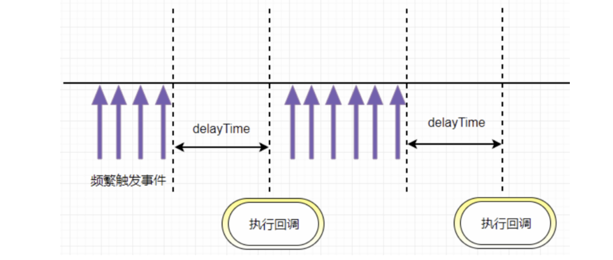
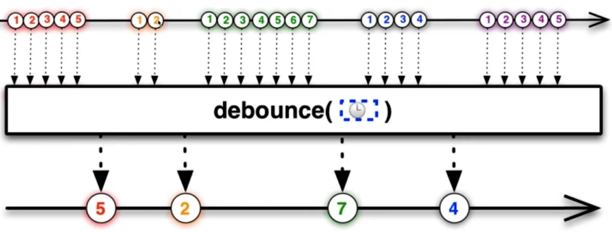
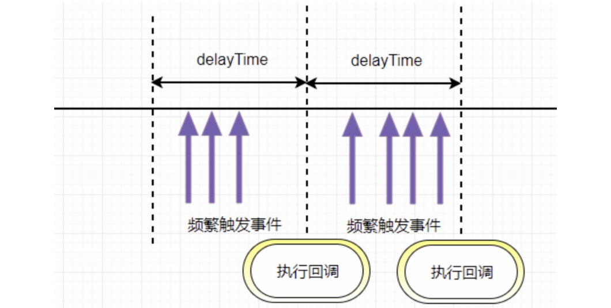
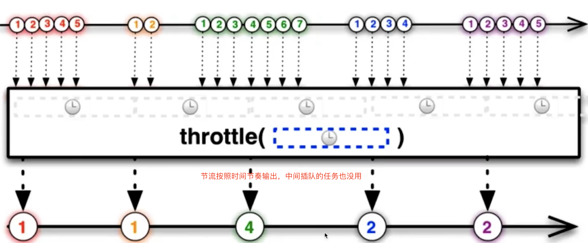
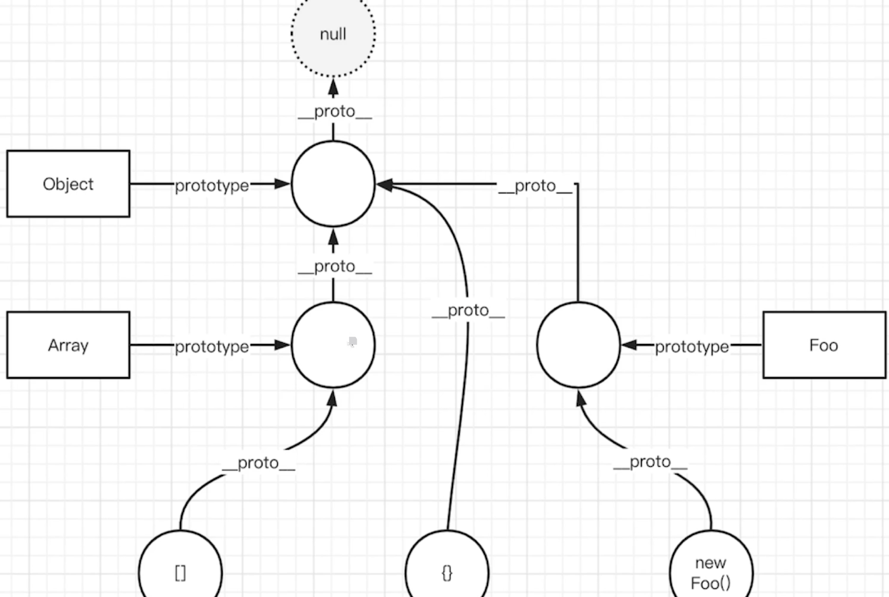
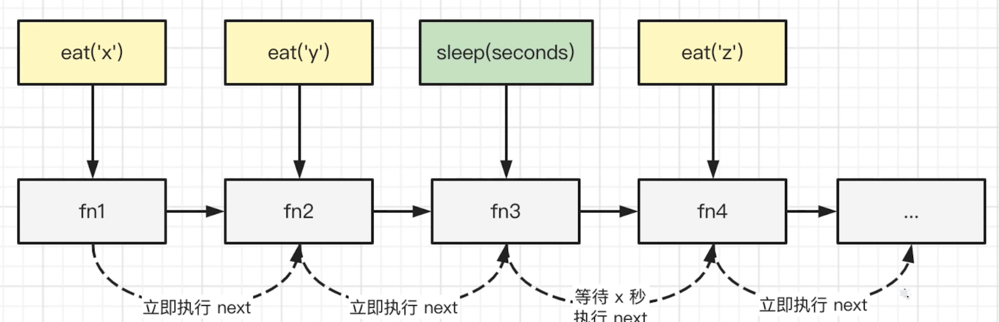
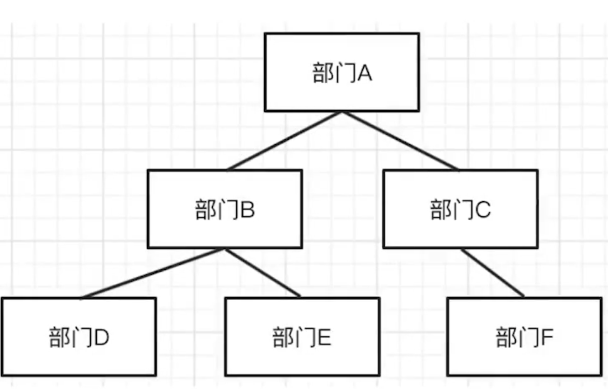
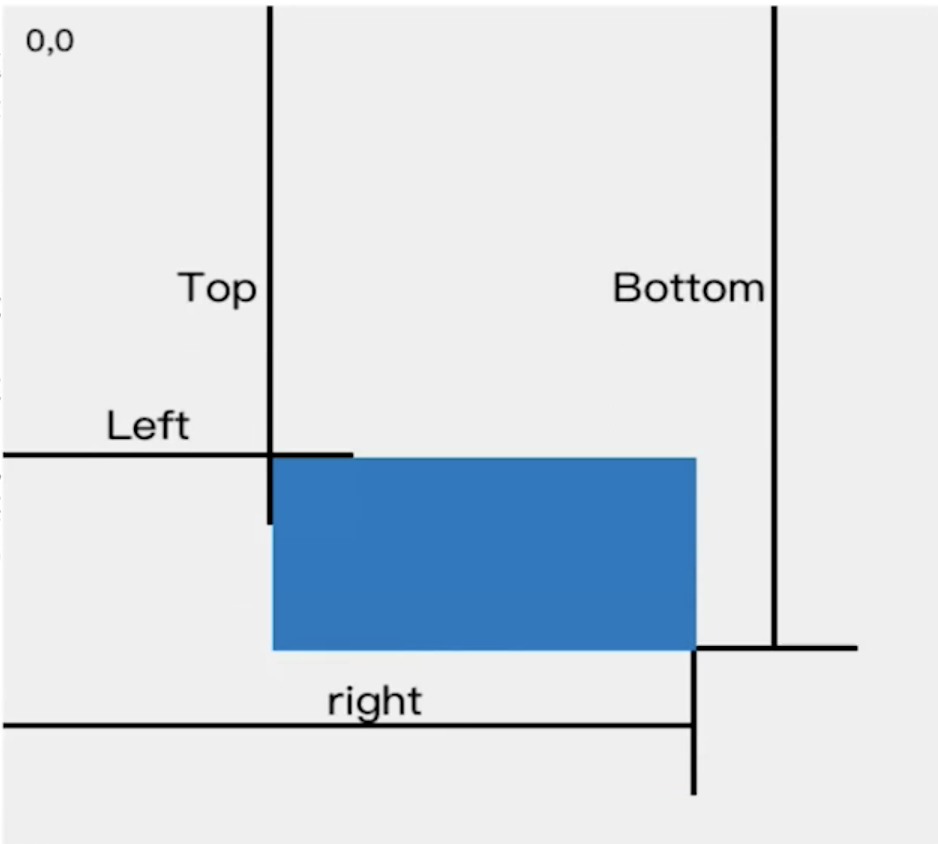

## 防抖

> 防抖函数原理：**把触发非常频繁的事件合并成一次去执行** 在指定时间内只执行一次回调函数，如果在指定的时间内又触发了该事件，则回调函数的执行时间会基于此刻重新开始计算





防抖动和节流本质是不一样的。**防抖动是将多次执行变为`最后一次执行`，节流是将多次执行变成`每隔一段时间执行`**

> eg. 像百度搜索，就应该用防抖，当我连续不断输入时，不会发送请求；当我一段时间内不输入了，才会发送一次请求；如果小于这段时间继续输入的话，时间会重新计算，也不会发送请求。

**手写简化版:**

```js
// func是用户传入需要防抖的函数
// wait是等待时间
const debounce = (func, wait = 50) => {
  // 缓存一个定时器id
  let timer = 0;
  // 这里返回的函数是每次用户实际调用的防抖函数
  // 如果已经设定过定时器了就清空上一次的定时器
  // 开始一个新的定时器，延迟执行用户传入的方法
  return function (...args) {
    if (timer) clearTimeout(timer);
    timer = setTimeout(() => {
      func.apply(this, args);
    }, wait);
  };
};
```

**适用场景：**

- 文本输入的验证，连续输入文字后发送 AJAX 请求进行验证，验证一次就好
- 按钮提交场景：防止多次提交按钮，只执行最后提交的一次
- 服务端验证场景：表单验证需要服务端配合，只执行一段连续的输入事件的最后一次，还有搜索联想词功能类似

## 节流

> 节流函数原理:指频繁触发事件时，只会在指定的时间段内执行事件回调，即触发事件间隔大于等于指定的时间才会执行回调函数。总结起来就是：**事件，按照一段时间的间隔来进行触发**。





> 像 dom 的拖拽，如果用消抖的话，就会出现卡顿的感觉，因为只在停止的时候执行了一次，这个时候就应该用节流，在一定时间内多次执行，会流畅很多

**手写简版**

使用时间戳的节流函数会在第一次触发事件时立即执行，以后每过 `wait` 秒之后才执行一次，并且最后一次触发事件不会被执行

**时间戳方式：**

```js
// func是用户传入需要防抖的函数
// wait是等待时间
const throttle = (func, wait = 50) => {
  // 上一次执行该函数的时间
  let lastTime = 0;
  return function (...args) {
    // 当前时间
    let now = Date.now();
    // 将当前时间和上一次执行函数时间对比
    // 如果差值大于设置的等待时间就执行函数
    if (now - lastTime > wait) {
      lastTime = now;
      func.apply(this, args);
    }
  };
};

setInterval(
  throttle(() => {
    console.log(1);
  }, 500),
  1
);
```

**定时器方式：** 使用定时器的节流函数在第一次触发时不会执行，而是在 delay 秒之后才执行，当最后一次停止触发后，还会再执行一次函数

```js
function throttle(func, delay) {
  var timer = 0;
  return function () {
    var context = this;
    var args = arguments;
    if (timer) return; // 当前有任务了，直接返回
    timer = setTimeout(function () {
      func.apply(context, args);
      timer = 0;
    }, delay);
  };
}
```

**适用场景：**

- 拖拽场景：固定时间内只执行一次，防止超高频次触发位置变动。`DOM` 元素的拖拽功能实现（`mousemove`）
- 缩放场景：监控浏览器`resize`
- 滚动场景：监听滚动`scroll`事件判断是否到页面底部自动加载更多
- 动画场景：避免短时间内多次触发动画引起性能问题

**总结**

- **函数防抖** ：`限制执行次数，多次密集的触发只执行一次`
  - 将几次操作合并为一次操作进行。原理是维护一个计时器，规定在`delay`时间后触发函数，但是在`delay`时间内再次触发的话，就会取消之前的计时器而重新设置。这样一来，只有最后一次操作能被触发。
- **函数节流** ：`限制执行的频率，按照一定的时间间隔有节奏的执行`
  - 使得一定时间内只触发一次函数。原理是通过判断是否到达一定时间来触发函数。

## New 的过程

**new 操作符做了这些事：**

- 创建一个全新的对象`obj`，继承构造函数的原型：这个对象的`__proto__`要指向构造函数的原型`prototype`
- 执行构造函数，使用 `call/apply` 改变 `this` 的指向（将`obj`作为`this`）
- 返回值为`object`类型则作为`new`方法的返回值返回，否则返回上述全新对象`obj`

```js
function myNew(constructor, ...args) {
  // 1. 基于原型链 创建一个新对象，继承构造函数 constructor 的原型对象（Person.prototype）上的属性
  let newObj = Object.create(constructor.prototype);
  // 添加属性到新对象上 并获取 obj 函数的结果
  // 调用构造函数，将 this 调换为新对象，通过强行赋值的方式为新对象添加属性
  // 2. 将 newObj 作为 this，执行 constructor ，传入参数
  let res = constructor.apply(newObj, args);
  // 改变 this 指向新创建的对象

  // 3. 如果函数的执行结果有返回值并且是一个对象, 返回执行的结果, 否则, 返回新创建的对象地址
  return typeof res === "object" ? res : newObj;
}

// 用法
function Person(name, age) {
  this.name = name;
  this.age = age;

  // 如果构造函数内部，return 一个引用类型的对象，则整个构造函数失效，而是返回这个引用类型的对象，而不是返回 this
  // 在实例中就没法获取 Person 原型上的 getName 方法
}
Person.prototype.say = function () {
  console.log(this.age);
};
let p1 = myNew(Person, "poety", 18);
console.log(p1.name);
console.log(p1);
p1.say();
```

## instanceOf 原理

**思路：**

- 步骤 1：先取得当前类的原型，当前实例对象的原型链
- 步骤 2：一直循环（执行原型链的查找机制）
  - 取得当前实例对象原型链的原型链（`proto = proto.__proto__`，沿着原型链一直向上查找）
  - 如果当前实例的原型链`__proto__`上找到了当前类的原型`prototype`，则返回 `true`
  - 如果一直找到`Object.prototype.__proto__ == null`，`Object`的基类(`null`)上面都没找到，则返回 `false`



```js
// 实例.__ptoto__ === 构造函数.prototype
function _instanceof(instance, classOrFunc) {
  // 由于instance要检测的是某对象，需要有一个前置判断条件
  //基本数据类型直接返回false
  if (typeof instance !== "object" || instance == null) return false;

  let proto = Object.getPrototypeOf(instance); // 等价于 instance.__ptoto__
  while (proto) {
    // 当proto == null时，说明已经找到了Object的基类null 退出循环
    // 实例的原型等于当前构造函数的原型
    if (proto == classOrFunc.prototype) return true;
    // 沿着原型链__ptoto__一层一层向上查
    proto = Object.getPrototypeof(proto); // 等价于 proto.__ptoto__
  }

  return false;
}

console.log("test", _instanceof(null, Array)); // false
console.log("test", _instanceof([], Array)); // true
console.log("test", _instanceof("", Array)); // false
console.log("test", _instanceof({}, Object)); // true
```

## 实现 call 方法

**call 做了什么:**

- 将函数设为对象的属性
- 执行和删除这个函数
- 指定`this`到函数并传入给定参数执行函数
- 如果不传入参数，默认指向 `window`

**分析：如何在函数执行时绑定 this**

- 如`var obj = {x:100,fn() { this.x }}`
- 执行`obj.fn()` ,此时`fn`内部的`this`就指向了`obj`
- 可借此来实现函数绑定`this`

原生`call`、`apply`传入的`this`如果是值类型，会被`new Object`（如`fn.call('abc')`）

```js
//实现call方法

// 相当于在obj上调用fn方法，this指向obj
// var obj = {fn: function(){console.log(this)}}
// obj.fn() fn内部的this指向obj
// call就是模拟了这个过程
// context 相当于obj

Function.prototype.myCall = function (context = window, ...args) {
  if (typeof context !== "object") context = new Object(context); // 值类型，变为对象

  // args 传递过来的参数
  // this 表示调用call的函数fn
  // context 是call传入的this

  // 在context上加一个唯一值，不会出现属性名称的覆盖
  let fnKey = Symbol();
  // 相等于 obj[fnKey] = fn
  context[fnKey] = this; // this 就是当前的函数

  // 绑定了this
  let result = context[fnKey](...args); // 相当于 obj.fn()执行 fn内部this指向context(obj)

  // 清理掉 fn ，防止污染（即清掉obj上的fnKey属性）
  delete context[fnKey];

  // 返回结果
  return result;
};

//用法：f.call(this,arg1)

function f(a, b) {
  console.log(a + b);
  console.log(this.name);
}
let obj = {
  name: 1
};
f.myCall(obj, 1, 2); // 不传obj，this指向window
```

## 实现 apply 方法

思路: 利用`this`的上下文特性。`apply`其实就是改一下参数的问题

```js
Function.prototype.myApply = function (context = window, args) {
  // 这里传参和call传参不一样
  if (typeof context !== "object") context = new Object(context); // 值类型，变为对象

  // args 传递过来的参数
  // this 表示调用call的函数
  // context 是apply传入的this

  // 在context上加一个唯一值，不会出现属性名称的覆盖
  let fnKey = Symbol();
  context[fnKey] = this; // this 就是当前的函数

  // 绑定了this
  let result = context[fnKey](...args);

  // 清理掉 fn ，防止污染
  delete context[fnKey];

  // 返回结果
  return result;
};

// 使用
function f(a, b) {
  console.log(a, b);
  console.log(this.name);
}
let obj = {
  name: "张三"
};
f.myApply(obj, [1, 2]);
```

## 实现 bind 方法

> `bind` 的实现对比其他两个函数略微地复杂了一点，涉及到参数合并(类似函数柯里化)，因为 `bind` 需要返回一个函数，需要判断一些边界问题，以下是 `bind` 的实现

- `bind` 返回了一个函数，对于函数来说有两种方式调用，一种是直接调用，一种是通过 `new` 的方式，我们先来说直接调用的方式
- 对于直接调用来说，这里选择了 `apply` 的方式实现，但是对于参数需要注意以下情况：因为 `bind` 可以实现类似这样的代码 `f.bind(obj, 1)(2)`，所以我们需要将两边的参数拼接起来
- 最后来说通过 `new` 的方式，对于 `new` 的情况来说，不会被任何方式改变 `this`，所以对于这种情况我们需要忽略传入的 `this`
- 箭头函数的底层是`bind`，无法改变`this`，只能改变参数

**简洁版本**

- 对于普通函数，绑定`this`指向
- 对于构造函数，要保证原函数的原型对象上的属性不能丢失

```js
Function.prototype.myBind = function (context = window, ...args) {
  // context 是 bind 传入的 this
  // args 是 bind 传入的各个参数
  // this 表示调用 bind 的函数
  let self = this;
  // fn.bind(obj) self 就是 fn

  //返回了一个函数，...innerArgs为实际调用时传入的参数
  let fBound = function (...innerArgs) {
    //this instanceof fBound为true表示构造函数的情况。如new func.bind(obj)
    // 当作为构造函数时，this 指向实例，此时 this instanceof fBound 结果为 true，可以让实例获得来自绑定函数的值
    // 当作为普通函数时，this 默认指向 window，此时结果为 false，将绑定函数的 this 指向 context
    return self.apply(
      // 函数执行
      this instanceof fBound ? this : context,
      args.concat(innerArgs) // 拼接参数
    );
  };

  // 如果绑定的是构造函数，那么需要继承构造函数原型属性和方法：保证原函数的原型对象上的属性不丢失
  // 实现继承的方式: 使用Object.create
  fBound.prototype = Object.create(this.prototype);
  return fBound;
};

// 测试用例

function Person(name, age) {
  console.log("Person name：", name);
  console.log("Person age：", age);
  console.log("Person this：", this);
  // 构造函数 this 指向实例对象
}

// 构造函数原型的方法
Person.prototype.say = function () {
  console.log("person say");
};

// 普通函数
function normalFun(name, age) {
  console.log("普通函数 name：", name);
  console.log("普通函数 age：", age);
  console.log("普通函数 this：", this);
  // 普通函数 this 指向绑定 bind 的第一个参数 也就是例子中的 obj
}

var obj = { name: "poetries", age: 18 };

// 先测试作为构造函数调用
var bindFun = Person.myBind(obj, "poetry1");
// undefined var a = new bindFun(10)
// Person name: poetry1、Person age: 10、Person this: fBound {} a.say()
// person say

// 再测试作为普通函数调用
var bindNormalFun = normalFun.myBind(obj, "poetry2");
// undefined bindNormalFun(12)
// 普通函数 name: poetry2
// 普通函数 age: 12
// 普通函数 this: {name: 'poetries', age: 18}
```

> **注意** ： `bind`之后不能再次修改`this`的指向（箭头函数的底层实现原理依赖`bind`绑定 this 后不能再次修改`this`的特性），`bind`多次后执行，函数`this`还是指向第一次`bind`的对象

## 发布订阅模式

**简介：**

发布订阅者模式，一种对象间一对多的依赖关系，但一个对象的状态发生改变时，所依赖它的对象都将得到状态改变的通知。

**主要的作用(优点)：**

1. 广泛应用于异步编程中(替代了传递回调函数)
2. 对象之间松散耦合的编写代码

**缺点：**

- 创建订阅者本身要消耗一定的时间和内存
- 多个发布者和订阅者嵌套一起的时候，程序难以跟踪维护

**实现的思路：**

- 创建一个对象(缓存列表)
- `on`方法用来把回调函数`fn`都加到缓存列表中
- `emit` 根据`key`值去执行对应缓存列表中的函数
- `off`方法可以根据`key`值取消订阅

```js
class EventEmiter {
  constructor() {
    // 事件对象，存放订阅的名字和事件
    this._events = {};
  }
  // 订阅事件的方法
  on(eventName, callback) {
    if (!this._events) {
      this._events = {};
    }
    // 合并之前订阅的 cb
    this._events[eventName] = [...(this._events[eventName] || []), callback];
  }
  // 触发事件的方法
  emit(eventName, ...args) {
    if (!this._events[eventName]) {
      return;
    }
    // 遍历执行所有订阅的事件
    this._events[eventName].forEach((fn) => fn(...args));
  }
  off(eventName, cb) {
    if (!this._events[eventName]) {
      return;
    }
    // 删除订阅的事件
    this._events[eventName] = this._events[eventName].filter((fn) => fn != cb && fn.l != cb);
  }
  // 绑定一次 触发后将绑定的移除掉 再次触发掉
  once(eventName, callback) {
    const one = (...args) => {
      // 等 callback 执行完毕在删除
      callback(args);
      this.off(eventName, one);
    };
    one.l = callback;
    // 自定义属性
    this.on(eventName, one);
  }
}
```

**测试用例**

```js
let event = new EventEmiter();

let login1 = function (...args) {
  console.log("login success1", args);
};
let login2 = function (...args) {
  console.log("login success2", args);
};
// event.on('login',login1)
event.once("login", login2);
event.off("login", login1); // 解除订阅
event.emit("login", 1, 2, 3, 4, 5);
event.emit("login", 6, 7, 8, 9);
event.emit("login", 10, 11, 12);
```

**发布订阅者模式和观察者模式的区别？**

- 发布/订阅模式是观察者模式的一种变形，两者区别在于，**发布/订阅模式在观察者模式的基础上，在目标和观察者之间增加一个调度中心。**
- **观察者模式** 是由具体目标调度，比如当事件触发，`Subject` 就会去调用观察者的方法，所以观察者模式的订阅者与发布者之间是存在依赖的。
- **发布/订阅模式**由统一调度中心调用，因此发布者和订阅者不需要知道对方的存在。

## 手写 JS 深拷贝-考虑各种数据类型和循环引用

- **使用 JSON.stringify**
  - 无法转换函数
  - 无法转换`Map`和`Set`
  - 无法转换循环引用
- **普通深拷贝**
  - 只考虑`Object`和`Array`
  - 无法转换`Map`、`Set`和循环引用
  - 只能应对初级要求的技术一面

**普通深拷贝 - 只考虑了简单的数组、对象**

```js
/** * 普通深拷贝 - 只考虑了简单的数组、对象 * @param obj obj */
function cloneDeep(obj) {
  if (typeof obj !== "object" || obj == null) return obj;

  let result;
  if (obj instanceof Array) {
    result = [];
  } else {
    result = {};
  }

  for (let key in obj) {
    if (obj.hasOwnProperty(key)) {
      result[key] = cloneDeep(obj[key]); // 递归调用
    }
  }

  return result;
}

// 功能测试
const a: any = {
  set: new Set([10, 20, 30]),
  map: new Map([
    ["x", 10],
    ["y", 20]
  ])
};
a.self = a;
console.log(cloneDeep(a)); // 无法处理 Map Set 和循环引用
```

**深拷贝-考虑数组、对象、Map、Set、循环引用**

```js
/** * 深拷贝 * @param obj obj * @param map weakmap 为了避免循环引用、避免导致内存泄露的风险 */
function cloneDeep(obj, map = new WeakMap()) {
  if (typeof obj !== "object" || obj == null) return obj;

  // 避免循环引用
  const objFromMap = map.get(obj);
  if (objFromMap) return objFromMap;

  let target = {};
  map.set(obj, target);

  // Map
  if (obj instanceof Map) {
    target = new Map();
    obj.forEach((v, k) => {
      const v1 = cloneDeep(v, map);
      const k1 = cloneDeep(k, map);
      target.set(k1, v1);
    });
  }

  // Set
  if (obj instanceof Set) {
    target = new Set();
    obj.forEach((v) => {
      const v1 = cloneDeep(v, map);
      target.add(v1);
    });
  }

  // Array
  if (obj instanceof Array) {
    target = obj.map((item) => cloneDeep(item, map));
  }

  // Object
  for (const key in obj) {
    target[key] = cloneDeep(obj[key], map);
  }

  return target;
}

// 功能测试
const a: any = {
  set: new Set([10, 20, 30]),
  map: new Map([
    ["x", 10],
    ["y", 20]
  ]),
  info: {
    city: "shenzhen"
  },
  fn: () => {
    console.info(100);
  }
};
a.self = a;
console.log(cloneDeep(a));
```

## 用 JS 实现一个 LRU 缓存

- **什么是 LRU 缓存**
  - `LRU（Least Recently Used）` 最近最少使用
  - 假如我们有一块内存，专门用来缓存我们最近访问的网页，访问一个新网页，我们就会往内存中添加一个网页地址，随着网页的不断增加，内存存满了，这个时候我们就需要考虑删除一些网页了。这个时候我们找到内存中最早访问的那个网页地址，然后把它删掉。这一整个过程就可以称之为 `LRU` 算法
  - 核心两个`API`，`get`和`set`
- **分析**

  - 用哈希表存储数据，这样`get` `set`才够快，时间复杂度`O(1)`
  - 必须是有序的，常用数据放在前面，沉水数据放在后面
  - 哈希表 + 有序，就是`Map`

```js
class LRUCache {
  constructor(length) {
    this.length = length;
    // 存储长度
    this.data = new Map();
    // 存储数据
  }
  // 存储数据，通过键值对的方式
  set(key, value) {
    const data = this.data;

    // 有的话 删除 重建放到map最前面
    if (data.has(key)) {
      data.delete(key);
    }

    data.set(key, value);

    // 如果超出了容量，则需要删除最久的数据
    if (data.size > this.length) {
      // 删除map最老的数据
      const delKey = data.keys().next().value;
      data.delete(delKey);
    }
  }
  // 获取数据
  get(key) {
    const data = this.data;
    // 未找到
    if (!data.has(key)) {
      return null;
    }
    const value = data.get(key);
    // 获取元素
    data.delete(key);
    // 删除元素
    data.set(key, value);
    // 重新插入元素到 map 最前面

    return value; // 返回获取的值
  }
}

// 测试

const lruCache = new LRUCache(2);
lruCache.set(1, 1);
// {1=1} lruCache.set(2, 2)
// {1=1, 2=2} console.info(lruCache.get(1))
// 1 {2=2, 1=1} lruCache.set(3, 3)
// {1=1, 3=3} console.info(lruCache.get(2))
// null lruCache.set(4, 4)
// {3=3, 4=4} console.info(lruCache.get(1))
// null console.info(lruCache.get(3))
// 3 {4=4, 3=3} console.info(lruCache.get(4))
// 4 {3=3, 4=4}
```

## 手写 curry 函数，实现函数柯里化

**分析**

- `curry`返回的是一个函数`fn`
- 执行`fn`，中间状态返回函数，如`add(1)`或者`add(1)(2)`
- 最后返回执行结果，如`add(1)(2)(3)`

```js
  // 实现函数柯里化

  function curry(fn) { const fnArgsLength = fn.length // 传入函数的参数长度 let args = []

        function calc(...newArgs) {
            // 积累参数保存到闭包中
            args = [
                ...args,
                ...newArgs
            ]
            // 积累的参数长度跟传入函数的参数长度对比
            if (args.length < fnArgsLength) {
                // 参数不够，返回函数
                return calc
            } else {
                // 参数够了，返回执行结果
                return fn.apply(this, args.slice(0, fnArgsLength)) // 传入超过fnArgsLength长度的参数没有意义
            }
        }

        // 返回一个函数
        return calc

  }

  // 测试

  function add(a, b, c) { return a + b + c } // add(10, 20, 30) // 60

  var curryAdd = curry(add) var res = curryAdd(10)(20)(30) // 60 console.info(res)
```

## 手写一个 LazyMan，实现 sleep 机制

- 支持`sleep`和`eat`两个方法
- 支持链式调用

```js
  // LazyMan 示例

  const me = new LazyMan('张三') me.eat('苹果').eat('香蕉').sleep(5).eat('葡萄')

  // 打印 // 张三 eat 苹果 // 张三 eat 香蕉 // 等待 5 秒 // 张三 eat 葡萄
```

**思路**

- 由于有`sleep`功能，函数不能直接在调用时触发
- 初始化一个列表，把函数注册进去
- 由每个`item`触发`next`执行（遇到`sleep`则异步触发，使用`setTimeout`）



```js
/** * @description lazy man */

class LazyMan {
  constructor(name) {
    this.name = name;

    this.tasks = []; // 任务列表

    // 等注册完后在初始执行next
    setTimeout(() => {
      this.next();
    });
  }

  next() {
    const task = this.tasks.shift(); // 取出当前 tasks 的第一个任务
    if (task) task();
  }

  eat(food) {
    const task = () => {
      console.info(`${this.name} eat ${food}`);
      this.next(); // 立刻执行下一个任务
    };
    this.tasks.push(task);

    return this; // 链式调用
  }

  sleep(seconds) {
    const task = () => {
      console.info(`${this.name} 开始睡觉`);
      setTimeout(() => {
        console.info(`${this.name} 已经睡完了 ${seconds}s，开始执行下一个任务`);
        this.next(); // xx 秒之后再执行下一个任务
      }, seconds * 1000);
    };
    this.tasks.push(task);

    return this; // 链式调用
  }
}

// 测试

const me = new LazyMan("张三");
me.eat("苹果").eat("香蕉").sleep(2).eat("葡萄").eat("西瓜").sleep(2).eat("橘子");
```

## 手写一个 getType 函数，获取详细的数据类型

- **获取类型**

  - 手写一个`getType`函数，传入任意变量，可准确获取类型
  - 如`number`、`string`、`boolean`等值类型
  - 引用类型`object`、`array`、`map`、`regexp`

```js
/\*\* _ 获取详细的数据类型 _ @param x x \*/;
function getType(x) {
  const originType = Object.prototype.toString.call(x);
  // '[object String]'
  const spaceIndex = originType.indexOf(" ");
  const type = originType.slice(spaceIndex + 1, -1); // 'String' -1 不要右边的]
  return type.toLowerCase(); // 'string'
}

// 功能测试
console.info(getType(null)); // null
console.info(getType(undefined)); // undefined
console.info(getType(100)); // number
console.info(getType("abc")); // string
console.info(getType(true)); // boolean
console.info(getType(Symbol())); // symbol
console.info(getType({})); // object
console.info(getType([])); // array
console.info(getType(() => {})); // function
console.info(getType(new Date())); // date
console.info(getType(new RegExp(""))); // regexp
console.info(getType(new Map())); // map
console.info(getType(new Set())); // set
console.info(getType(new WeakMap())); // weakmap
console.info(getType(new WeakSet())); // weakset
console.info(getType(new Error())); // error
console.info(getType(new Promise(() => {}))); // promise
```

## 手写一个 JS 函数，实现数组扁平化 Array Flatten

- 写一个 JS 函数，实现数组扁平化，只减少一次嵌套
- 如输入`[1,[2,[3]],4]` 输出`[1,2,[3],4]`

**思路**

- 定义空数组`arr=[]` 遍历当前数组
- 如果`item`非数组，则累加到`arr`
- 如果`item`是数组，则遍历之后累加到`arr`

```js
/** _ 数组扁平化，使用 push _ @param arr arr */
function flatten1(arr) {
  const res = [];

  arr.forEach((item) => {
    if (Array.isArray(item)) {
      item.forEach((n) => res.push(n));
    } else {
      res.push(item);
    }
  });

  return res;
}

/\*\* _ 数组扁平化，使用 concat _ @param arr arr \*/;
function flatten2(arr) {
  let res = [];

  arr.forEach((item) => {
    res = res.concat(item);
  });

  return res;
}

// 功能测试
const arr = [1, [2, [3], 4], 5];
console.info(flatten2(arr));
```

**连环问：手写一个 JS 函数，实现数组深度扁平化**

- 如输入`[1, [2, [3]], 4]` 输出`[1,2,3,4]`

**思路**

- 先实现一级扁平化，然后递归调用，直到全部扁平化

```js
/** _ 数组深度扁平化，使用 push _ @param arr arr */
function flattenDeep1(arr) {
  const res = [];

  arr.forEach((item) => {
    if (Array.isArray(item)) {
      const flatItem = flattenDeep1(item); // 递归
      flatItem.forEach((n) => res.push(n));
    } else {
      res.push(item);
    }
  });

  return res;
}

/** _ 数组深度扁平化，使用 concat _ @param arr arr */
function flattenDeep2(arr) {
  let res = [];

  arr.forEach((item) => {
    if (Array.isArray(item)) {
      const flatItem = flattenDeep2(item); // 递归
      res = res.concat(flatItem);
    } else {
      res = res.concat(item);
    }
  });

  return res;
}

// 功能测试
const arr = [1, [2, [3, ["a", [true], "b"], 4], 5], 6];
console.info(flattenDeep2(arr));
```

## 把一个数组转换为树

    const arr = [
      {id:1, name: '部门A', parentId: 0},
      {id:2, name: '部门B', parentId: 1},
      {id:3, name: '部门C', parentId: 1},
      {id:4, name: '部门D', parentId: 2},
      {id:5, name: '部门E', parentId: 2},
      {id:6, name: '部门F', parentId: 3},
    ]



**树节点**

    interface ITreeNode {
      id:number
      name: string
      children?: ITreeNode[] // 子节点
    }

**思路**

- 遍历数组
- 每个元素生成`TreeNode`
- 找到`parentNode`，并加入它的`children`

  - 如何找到`parentNode`

    - 遍历数组去查找太慢
    - 可用一个`Map`来维护关系，便于查找

```js
/** _ @description array to tree _*/

// 数据结构 interface ITreeNode { id: number name: string children?: ITreeNode[] }

function arr2tree(arr) {
  // 用于 id 和 treeNode 的映射
  const idToTreeNode = new Map();

  let root = null; // 返回一棵树 tree rootNode

  arr.forEach((item) => {
    const { id, name, parentId } = item;

    // 定义 tree node 并加入 map
    const treeNode = { id, name };
    idToTreeNode.set(id, treeNode);

    // 找到 parentNode 并加入到它的 children
    const parentNode = idToTreeNode.get(parentId);
    if (parentNode) {
      if (parentNode.children == null) {
        parentNode.children = [];
      }
      parentNode.children.push(treeNode); // 把treeNode加入到parentNode下
    }

    // 找到根节点
    if (parentId === 0) {
      root = treeNode;
    }
  });

  return root;
}

const arr = [
  { id: 1, name: "部门 A", parentId: 0 },
  // 0 代表顶级节点，无父节点
  { id: 2, name: "部门 B", parentId: 1 },
  { id: 3, name: "部门 C", parentId: 1 },
  { id: 4, name: "部门 D", parentId: 2 },
  { id: 5, name: "部门 E", parentId: 2 },
  { id: 6, name: "部门 F", parentId: 3 }
];
const tree = arr2tree(arr);
console.info(tree);
```

**连环问：把一个树转换为数组**

- **思路**

  - 遍历树节点（广度优先：一层层去遍历，结果是`ABCDEF`）而深度优先是（`ABDECF`）
  - 将树节点转为`Array Item`，`push`到数组中
  - 根据父子关系，找到`Array Item`的`parentId`

    - 如何找到`parentId`
      - 遍历树查找太慢
      - 可用一个`Map`来维护关系，便于查找

```js
    /** _ @description tree to arr _*/

    // 数据结构
    interface ITreeNode { id: number name: string children?: ITreeNode[] }

    function tree2arr(root) {
    // Map
    const nodeToParent = new Map() // 映射当前节点和父节点关系

    const arr = []

    // 广度优先遍历，queue
    const queue = [] queue.unshift(root) // 根节点 入队

    while (queue.length > 0) {
    const curNode = queue.pop() // 出队
    if (curNode == null) break

        const { id, name, children = [] } = curNode

        // 创建数组 item 并 push
        const parentNode = nodeToParent.get(curNode)
        const parentId = parentNode?.id || 0
        const item = { id, name, parentId }
        arr.push(item)

        // 子节点入队
        children.forEach(child => {
          // 映射 parent
          nodeToParent.set(child, curNode)
          // 入队
          queue.unshift(child)
        })

    }

    return arr
  }

    const obj = {
      id: 1, name: '部门 A', children: [
        {
          id: 2,
          name: '部门 B',
          children: [
            {
              id: 4,
              name: '部门 D'
            },
            {
              id: 5,
              name: '部门 E'
            }
          ]
        },
        {
          id: 3,
          name: '部门 C',
          children: [
            {
              id: 6,
              name: '部门 F'
            }
          ]
        }
      ]
    }
    const arr = tree2arr(obj) console.info(arr)
```

## 获取当前页面 URL 参数

```js
// 传统方式
function query(name) {
  // search: '?a=10&b=20&c=30'
  const search = location.search.substr(1); // 去掉前面的？ 类似 array.slice(1)
  const reg = new RegExp(`(^|&)${name}=([^&]*)(&|$)`, "i");
  const res = search.match(reg);
  if (res === null) {
    return null;
  }
  return res[2];
}
query("a"); // 10

// 使用URLSearchParams方式
function query(name) {
  const search = location.search;
  const p = new URLSearchParams(search);
  return p.get(name);
}
console.log(query("b")); // 20
```

**将 URL 参数解析为 JSON 对象**

```js
// 传统方式，分析search
function queryToObj() {
  const res = {};
  // search: '?a=10&b=20&c=30'
  const search = location.search.substr(1); // 去掉前面的？
  search.split("&").forEach((paramStr) => {
    const arr = paramStr.split("=");
    const key = arr[0];
    const val = arr[1];
    res[key] = val;
  });
  return res;
}

// 使用URLSearchParams方式
function queryToObj() {
  const res = {};
  const pList = new URLSearchParams(location.search);
  pList.forEach((val, key) => {
    res[key] = val;
  });
  return res;
}
```

## 手写 Promise 加载一张图片

```js
function loadImg(src) {
  return new Promise((resolve, reject) => {
    const img = document.createElement("img");
    img.onload = () => {
      resolve(img);
    };
    img.onerror = () => {
      const err = new Error(`图片加载失败 ${src}`);
      reject(err);
    };
    img.src = src;
  });
}

// 测试

const url = "https://s.poetries.work/uploads/2022/07/ee7310c4f45b9bd6.png";
loadImg(url)
  .then((img) => {
    console.log(img.width);
    return img;
  })
  .then((img) => {
    console.log(img.height);
  })
  .catch((ex) => console.error(ex));

const url1 = "https://s.poetries.work/uploads/2022/07/ee7310c4f45b9bd6.png";
const url2 = "https://s.poetries.work/images/20210414100319.png";

loadImg(url1)
  .then((img1) => {
    console.log(img1.width);
    return img1; // 普通对象
  })
  .then((img1) => {
    console.log(img1.height);
    return loadImg(url2); // promise 实例
  })
  .then((img2) => {
    console.log(img2.width);
    return img2;
  })
  .then((img2) => {
    console.log(img2.height);
  })
  .catch((ex) => console.error(ex));
```

## 两个数组求交集和并集

```js
// 交集
function getIntersection(arr1, arr2) {
  const res = new Set();
  const set2 = new Set(arr2);
  for (let item of arr1) {
    if (set2.has(item)) {
      // 考虑性能：这里使用set的has比数组的includes快很多
      res.add(item);
    }
  }
  return Array.from(res); // 转为数组返回
}

// 并集
function getUnion(arr1, arr2) {
  const res = new Set(arr1);
  for (let item of arr2) {
    res.add(item); // 利用set的去重功能
  }
  return Array.from(res); // 转为数组返回
}

// 测试

const arr1 = [1, 3, 4, 6, 7];
const arr2 = [2, 5, 3, 6, 1];
console.log("交集", getIntersection(arr1, arr2)); // 1,3,6
console.log("并集", getUnion(arr1, arr2)); // 1,3,4,6,7,2,5
```

## JS 反转字符串

实现字符串`A1B2C3`反转为`3C2B1A`

```js
// 方式1：str.split('').reverse().join('')

// 方式2：使用栈来实现
function reverseStr(str) {
  const stack = [];
  for (let c of str) {
    stack.push(c); // 入栈
  }
  let newStr = "";
  let c = "";
  while ((c = stack.pop())) {
    // 出栈
    newStr += c; // 出栈再拼接
  }
  return newStr;
}

// 测试
console.log(reverseStr("A1B2C3")); // 3C2B1A
```

## 设计实现一个 H5 图片懒加载

- **分析**
  - 定义 ``
  - 页面滚动时，图片露出，将`data-src`赋值给`src`
  - 滚动要节流
- **获取图片定位**

  - 元素的位置`ele.getBoundingClientRect`

    

  - 图片`top > window.innerHeight`没有露出，`top < window.innerHeight`露出

```html
<!-- 图片拦截加载 -->
<div class="item-container">
  <p>新闻标题</p>
  
</div>
<div class="item-container">
  <p>新闻标题</p>
  
</div>
<div class="item-container">
  <p>新闻标题</p>
  
</div>
<div class="item-container">
  <p>新闻标题</p>
  
</div>
<div class="item-container">
  <p>新闻标题</p>
  
</div>
<div class="item-container">
  <p>新闻标题</p>
  
</div>
<script src="https://cdn.bootcdn.net/ajax/libs/lodash.js/4.17.21/lodash.min.js"></script>
<script>
  function mapImagesAndTryLoad() {
    const images = document.querySelectorAll("img[data-src]");
    if (images.length === 0) return;
    images.forEach((img) => {
      const rect = img.getBoundingClientRect();
      if (rect.top < window.innerHeight) {
        // 可视区域内
        // console.info('loading img', img.dataset.src)
        img.src = img.dataset.src;
        img.removeAttribute("data-src");
        // 移除 data-src 属性，为了下次执行时减少计算成本
      }
    });
  }
  // 滚动需要节流
  window.addEventListener(
    "scroll",
    _.throttle(() => {
      mapImagesAndTryLoad();
    }, 100)
  );
  // 初始化默认执行一次
  mapImagesAndTryLoad();
</script>
```

## 手写 Vue3 基本响应式原理

```js
// 简单实现

var fns = new Set();
var activeFn;

function reactive(obj) {
  return new Proxy(obj, {
    get(target, key, receiver) {
      const res = Reflect.get(target, key, receiver); // 相当于target[key]

      // 懒递归 取值才执行
      if (typeof res === "object" && res != null) {
        return reactive(res);
      }

      if (activeFn) fns.add(activeFn);

      return res;
    },
    set(target, key, value, receiver) {
      fns.forEach((fn) => fn()); // 触发effect订阅的回调函数的执行
      return Reflect.set(target, key, value, receiver);
    }
  });
}

function effect(fn) {
  activeFn = fn;
  fn(); // 执行一次去取值，触发proxy get
}

// 测试

var user = reactive({ name: "poetries", info: { age: 18 } });
effect(() => {
  console.log("name", user.name);
});
// 修改属性，自动触发effect内部函数执行
user.name = "张三";
// user.info.age = 10 // 修改深层次对象
setTimeout(() => {
  user.name = "李四";
});
```

## 实现一个简洁版的 promise

```js
    // 三个常量用于表示状态
    const PENDING = 'pending'
    const RESOLVED = 'resolved'
    const REJECTED = 'rejected'

    function MyPromise(fn) {
        const that = this
        this.state = PENDING

        // value 变量用于保存 resolve 或者 reject 中传入的值
        this.value = null

        // 用于保存 then 中的回调，因为当执行完 Promise 时状态可能还是等待中，这时候应该把 then 中的回调保存起来用于状态改变时使用
        that.resolvedCallbacks = []
        that.rejectedCallbacks = []


        function resolve(value) {
             // 首先两个函数都得判断当前状态是否为等待中
            if(that.state === PENDING) {
                that.state = RESOLVED
                that.value = value

                // 遍历回调数组并执行
                that.resolvedCallbacks.map(cb=>cb(that.value))
            }
        }
        function reject(value) {
            if(that.state === PENDING) {
                that.state = REJECTED
                that.value = value
                that.rejectedCallbacks.map(cb=>cb(that.value))
            }
        }

        // 完成以上两个函数以后，我们就该实现如何执行 Promise 中传入的函数了
        try {
            fn(resolve,reject)
        }cach(e){
            reject(e)
        }
    }

    // 最后我们来实现较为复杂的 then 函数
    MyPromise.prototype.then = function(onFulfilled,onRejected){
      const that = this

      // 判断两个参数是否为函数类型，因为这两个参数是可选参数
      onFulfilled = typeof onFulfilled === 'function' ? onFulfilled : v=>v
      onRejected = typeof onRejected === 'function' ? onRejected : e=>throw e

      // 当状态不是等待态时，就去执行相对应的函数。如果状态是等待态的话，就往回调函数中 push 函数
      if(this.state === PENDING) {
          this.resolvedCallbacks.push(onFulfilled)
          this.rejectedCallbacks.push(onRejected)
      }
      if(this.state === RESOLVED) {
          onFulfilled(that.value)
      }
      if(this.state === REJECTED) {
          onRejected(that.value)
      }
    }
```
