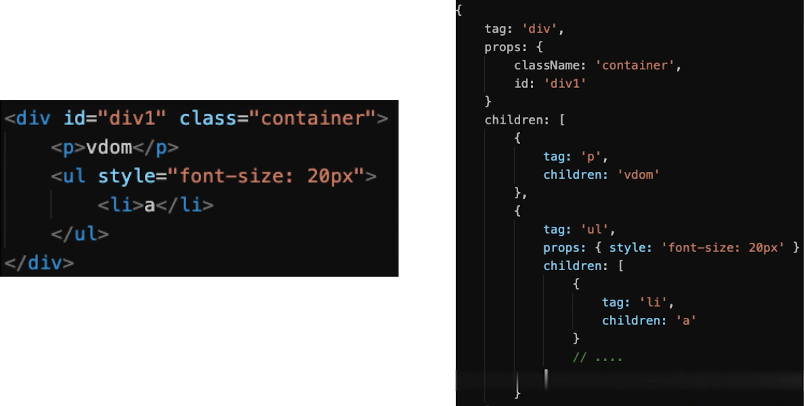
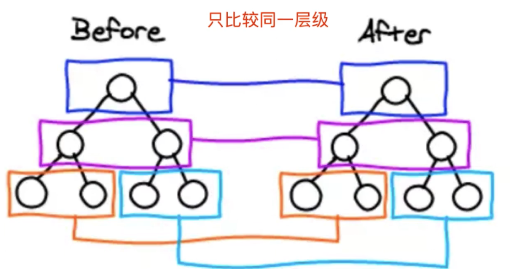
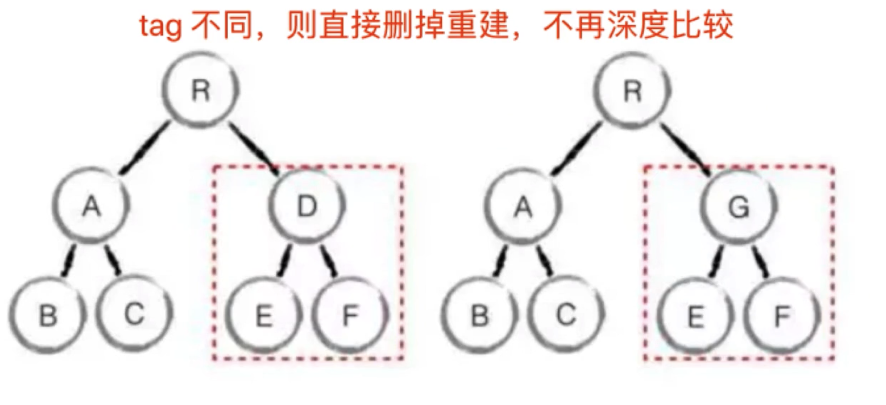
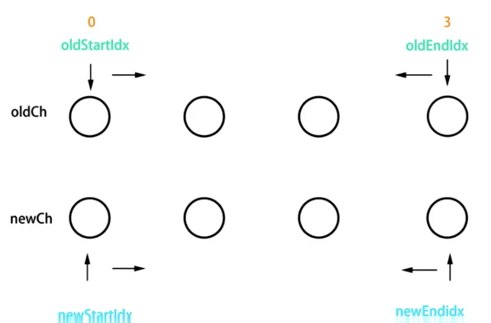
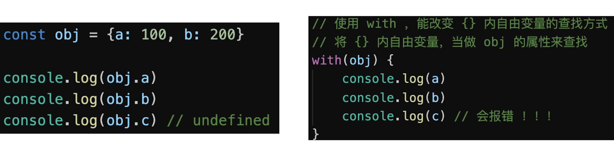
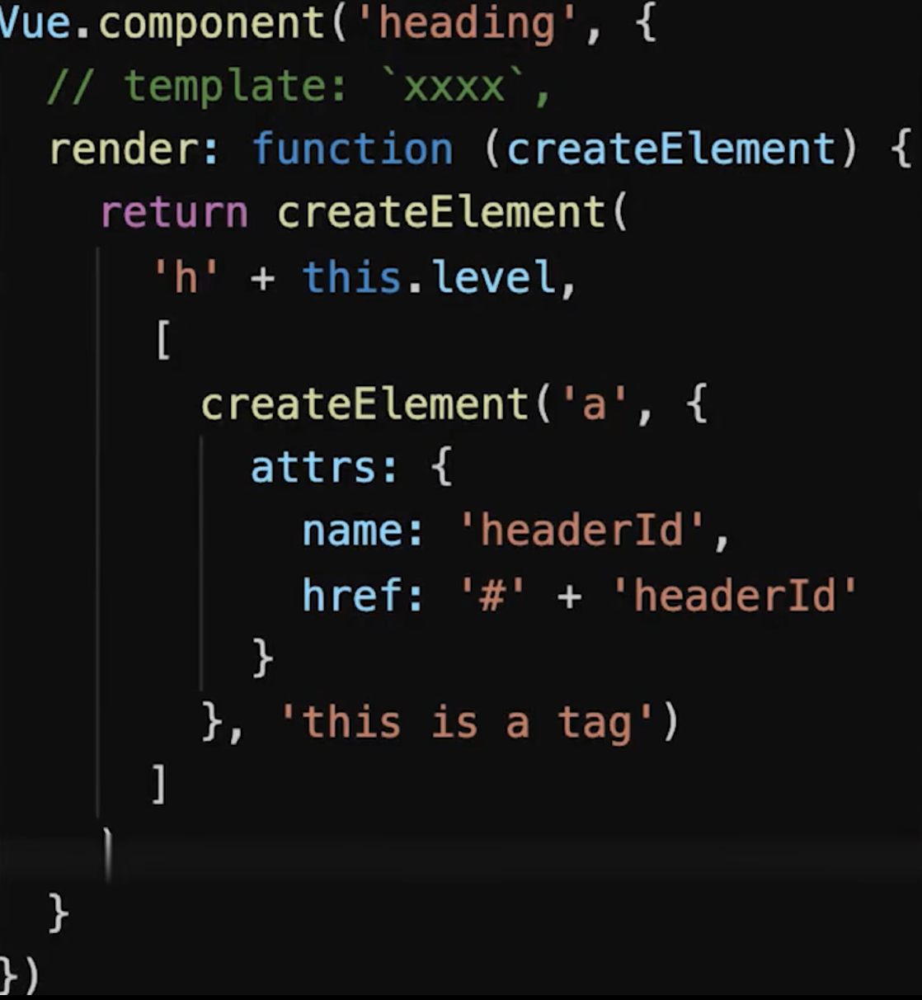
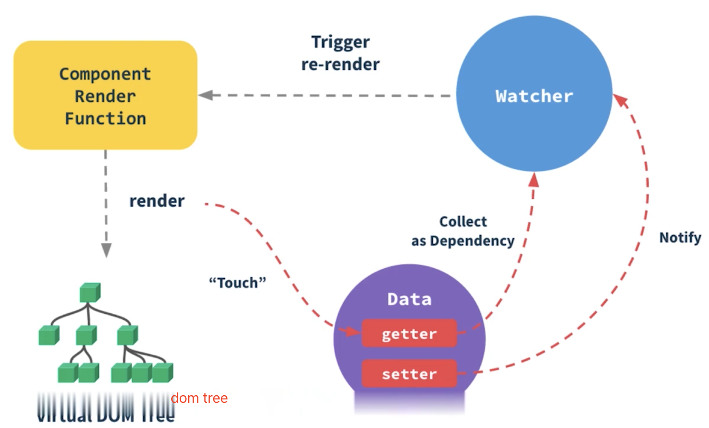
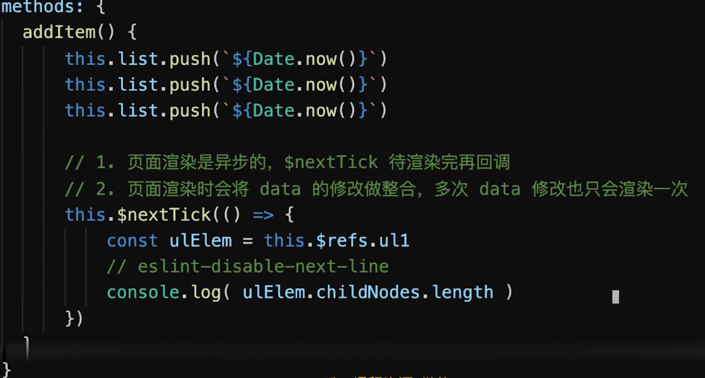
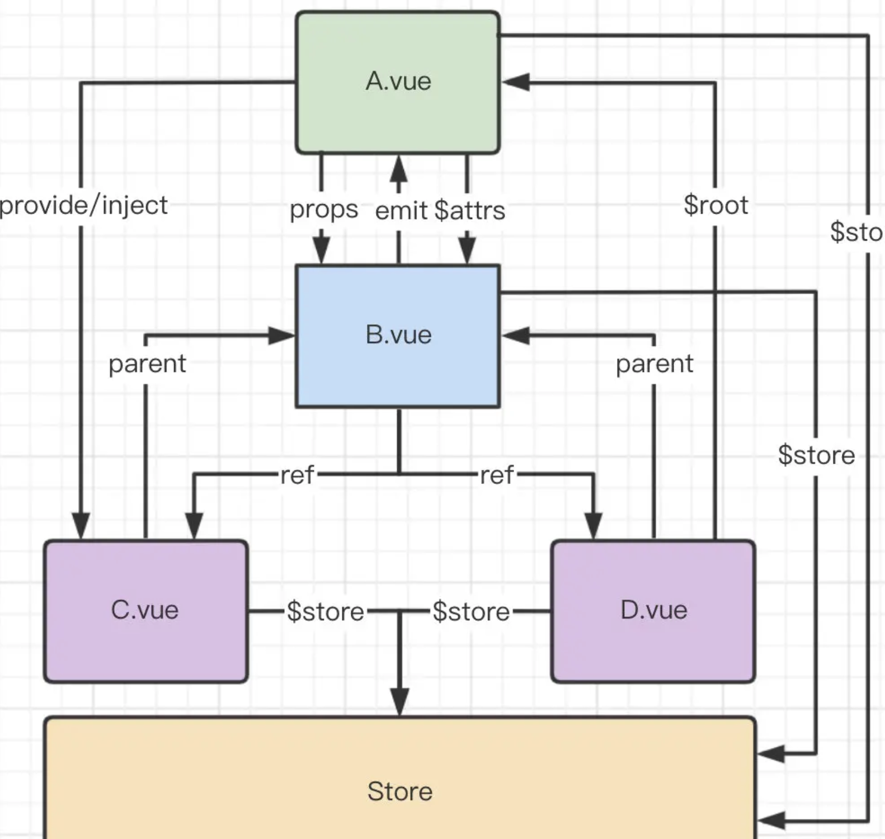

## 响应式原理

**响应式**

- 组件`data`数据一旦变化，立刻触发视图的更新
- 实现数据驱动视图的第一步
- 核心`API`：`Object.defineProperty`

  - **缺点**

    - 深度监听，需要递归到底，一次计算量大
    - 无法监听新增属性、删除属性（使用`Vue.set`、`Vue.delete`可以）
    - 无法监听原生数组，需要重写数组原型

```
   // 触发更新视图
   function updateView() {
     console.log('视图更新')
   }

   // 重新定义数组原型
   const oldArrayProperty = Array.prototype

   // 创建新对象，原型指向 oldArrayProperty ，再扩展新的方法不会影响原型

   const arrProto = Object.create(oldArrayProperty);
   ['push', 'pop', 'shift', 'unshift', 'splice'].forEach(methodName => {
     arrProto[methodName] = function () {
       updateView()
       // 触发视图更新
       oldArrayProperty[methodName].call(this, ...arguments)
       Array.prototype.push.call(this, ...arguments)
     }
   })
```

    // 重新定义属性，监听起来 function defineReactive(target, key, value) { // 深度监听 observer(value)

        // 核心 API
        Object.defineProperty(target, key, {
            get() {
                return value
            },
            set(newValue) {
                if (newValue !== value) {
                    // 深度监听
                    observer(newValue)

                    // 设置新值
                    // 注意，value 一直在闭包中，此处设置完之后，再 get 时也是会获取最新的值
                    value = newValue

                    // 触发更新视图
                    updateView()
                }
            }
        })

    }

    // 监听对象属性 function observer(target) { if (typeof target !== 'object' || target === null) { // 不是对象或数组 return target }

        // 污染全局的 Array 原型
        // Array.prototype.push = function () {
        // updateView()
        // ...
        // }

        if (Array.isArray(target)) {
            target.__proto__ = arrProto
        }

        // 重新定义各个属性（for in 也可以遍历数组）
        for (let key in target) {
            defineReactive(target, key, target[key])
        }

    }

    // 准备数据 const data = { name: 'zhangsan', age: 20, info: { address: 'shenzhen' // 需要深度监听 }, nums: [10, 20, 30] }

    // 监听数据 observer(data)

    // 测试 // data.name = 'lisi' // data.age = 21 // // console.log('age', data.age) // data.x = '100' // 新增属性，监听不到 ------ 所以有 Vue.set // delete data.name // 删除属性，监听不到 ------ 所有有 Vue.delete // data.info.address = '上海' // 深度监听 data.nums.push(4) // 监听数组

    // proxy-demo

    // const data = { // name: 'zhangsan', // age: 20, // } const data = ['a', 'b', 'c']

    const proxyData = new Proxy(data, { get(target, key, receiver) { // 只处理本身（非原型的）属性 const ownKeys = Reflect.ownKeys(target) if (ownKeys.includes(key)) { console.log('get', key) // 监听 }

            const result = Reflect.get(target, key, receiver)
            return result // 返回结果
        },
        set(target, key, val, receiver) {
            // 重复的数据，不处理
            if (val === target[key]) {
                return true
            }

            const result = Reflect.set(target, key, val, receiver)
            console.log('set', key, val)
            // console.log('result', result) // true
            return result // 是否设置成功
        },
        deleteProperty(target, key) {
            const result = Reflect.deleteProperty(target, key)
            console.log('delete property', key)
            // console.log('result', result) // true
            return result // 是否删除成功
        }

    })

## vdom 和 diff 算法

**1. vdom**

- **背景**
  - `DOM`操作非常耗时
  - 以前用`jQuery`，可以自行控制`DOM`操作时机，手动调整
  - `Vue`和`React`是数据驱动视图，如何有效控制`DOM`操作
- **解决方案 VDOM**
  - 有了一定的复杂度，想减少计算次数比较难
  - 能不能把计算，更多的转移为 JS 计算？因为`JS`执行速度很快
  - `vdom` 用`JS`模拟`DOM`结构，计算出最小的变更，操作`DOM`
- **用 JS 模拟 DOM 结构**

  

- **通过 snabbdom 学习 vdom**
  - 简洁强大的`vdom`库
  - `vue2`参考它实现的`vdom`和`diff`
  - **snabbdom**
    - `h`函数
    - `vnode`数据结构
    - `patch`函数
- **vdom 总结**
  - 用`JS`模拟`DOM`结构（`vnode`）
  - 新旧`vnode`对比，得出最小的更新范围，有效控制`DOM`操作
  - 数据驱动视图模式下，有效控制`DOM`操作

**2. diff 算法**

- `diff`算法是`vdom`中最核心、最关键的部分
- `diff`算法能在日常使用`vue` `react`中体现出来（如`key`）

**树的 diff 的时间复杂度 O(n\^3)**

- 第一，遍历`tree1`
- 第二，遍历`tree2`
- 第三，排序
- `1000`个节点，要计算`10`亿次，算法不可用

**优化时间复杂度到 O(n)**

- 只比较同一层级，不跨级比较
- `tag`不相同，则直接删掉重建，不再深度比较
- `tag`和`key`相同，则认为是相同节点，不再深度比较





**diff 过程细节**

- 新旧节点都有`children`，执行`updateChildren` `diff`对比

  

  - 开始和开始对比--头头
  - 结束和结束对比--尾尾
  - 开始和结束对比--头尾
  - 结束和开始对比--尾头
  - 以上四个都未命中：拿新节点 `key` ，能否对应上 `oldCh` 中的某个节点的 `key`

- 新`children`有，旧`children`无：清空旧`text`节点，新增新`children`节点
- 旧`children`有，新`children`无：移除旧`children`
- 否则旧`text`有，设置`text`为空

**vdom 和 diff 算法总结**

- 细节不重要，`updateChildren`的过程也不重要，不要深究
- `vdom`的核心概念很重要：`h`、`vnode`、`patch`、`diff`、`key`
- `vdom`存在的价值更重要，数据驱动视图，控制`dom`操作

```js
  // snabbdom 源码位于 src/snabbdom.ts /_ global module, document, Node _/
  import { Module } from './modules/module';
  import vnode, { VNode } from './vnode';
  import * as is from './is';
  import htmlDomApi, { DOMAPI } from './htmldomapi';

  type NonUndefined<T> = T extends undefined ? never : T;

  function isUndef (s: any): boolean {
    return s === undefined;
  }

  function isDef<A> (s: A): s is NonUndefined<A> {
    return s !== undefined;
  }

  type VNodeQueue = VNode[];

  const emptyNode = vnode('', {}, [], undefined, undefined);

  function sameVnode (vnode1: VNode, vnode2: VNode): boolean {
    // key 和 sel 都相等
    // undefined === undefined
    // true
    return vnode1.key === vnode2.key && vnode1.sel === vnode2.sel;
  }

  function isVnode (vnode: any): vnode is VNode { return vnode.sel !== undefined; }

  type KeyToIndexMap = {[key: string]: number};

  type ArraysOf<T> = { [K in keyof T]: Array<T[K]>; }

  type ModuleHooks = ArraysOf<Module>;

  function createKeyToOldIdx (children: VNode[], beginIdx: number, endIdx: number): KeyToIndexMap {
    const map: KeyToIndexMap = {};
    for (let i = beginIdx; i <= endIdx; ++i) {
      const key = children[i]?.key;
      if (key !== undefined) {
        map[key] = i;
      }
    }
    return map;
  }

  const hooks: Array<keyof Module> = ['create', 'update', 'remove', 'destroy', 'pre', 'post'];

  export { h } from './h';
  export { thunk } from './thunk';

  export function init (modules: Array<Partial<Module>>, domApi?: DOMAPI) {
    let i: number, j: number, cbs = ({} as ModuleHooks);

      const api: DOMAPI = domApi !== undefined ? domApi : htmlDomApi;

      for (i = 0; i < hooks.length; ++i) {
        cbs[hooks[i]] = [];
        for (j = 0; j < modules.length; ++j) {
          const hook = modules[j][hooks[i]];
          if (hook !== undefined) {
            (cbs[hooks[i]] as any[]).push(hook);
          }
        }
      }

      function emptyNodeAt (elm: Element) {
        const id = elm.id ? '#' + elm.id : '';
        const c = elm.className ? '.' + elm.className.split(' ').join('.') : '';
        return vnode(api.tagName(elm).toLowerCase() + id + c, {}, [], undefined, elm);
      }

      function createRmCb (childElm: Node, listeners: number) {
        return function rmCb () {
          if (--listeners === 0) {
            const parent = api.parentNode(childElm);
            api.removeChild(parent, childElm);
          }
        };
      }

      function createElm (vnode: VNode, insertedVnodeQueue: VNodeQueue): Node {
        let i: any, data = vnode.data;
        if (data !== undefined) {
          const init = data.hook?.init;
          if (isDef(init)) {
            init(vnode);
            data = vnode.data;
          }
        }
        let children = vnode.children, sel = vnode.sel;
        if (sel === '!') {
          if (isUndef(vnode.text)) {
            vnode.text = '';
          }
          vnode.elm = api.createComment(vnode.text!);
        } else if (sel !== undefined) {
          // Parse selector
          const hashIdx = sel.indexOf('#');
          const dotIdx = sel.indexOf('.', hashIdx);
          const hash = hashIdx > 0 ? hashIdx : sel.length;
          const dot = dotIdx > 0 ? dotIdx : sel.length;
          const tag = hashIdx !== -1 || dotIdx !== -1 ? sel.slice(0, Math.min(hash, dot)) : sel;
          const elm = vnode.elm = isDef(data) && isDef(i = data.ns)
            ? api.createElementNS(i, tag)
            : api.createElement(tag);
          if (hash < dot) elm.setAttribute('id', sel.slice(hash + 1, dot));
          if (dotIdx > 0) elm.setAttribute('class', sel.slice(dot + 1).replace(/\./g, ' '));
          for (i = 0; i < cbs.create.length; ++i) cbs.create[i](emptyNode, vnode);
          if (is.array(children)) {
            for (i = 0; i < children.length; ++i) {
              const ch = children[i];
              if (ch != null) {
                api.appendChild(elm, createElm(ch as VNode, insertedVnodeQueue));
              }
            }
          } else if (is.primitive(vnode.text)) {
            api.appendChild(elm, api.createTextNode(vnode.text));
          }
          const hook = vnode.data!.hook;
          if (isDef(hook)) {
            hook.create?.(emptyNode, vnode);
            if (hook.insert) {
              insertedVnodeQueue.push(vnode);
            }
          }
        } else {
          vnode.elm = api.createTextNode(vnode.text!);
        }
        return vnode.elm;
      }

      function addVnodes (
        parentElm: Node, before: Node | null, vnodes: VNode[], startIdx: number, endIdx: number, insertedVnodeQueue: VNodeQueue
      ) {
        for (; startIdx <= endIdx; ++startIdx) {
          const ch = vnodes[startIdx];
          if (ch != null) {
            api.insertBefore(parentElm, createElm(ch, insertedVnodeQueue), before);
          }
        }
      }

      function invokeDestroyHook (vnode: VNode) {
        const data = vnode.data;
        if (data !== undefined) {
          data?.hook?.destroy?.(vnode);
          for (let i = 0; i < cbs.destroy.length; ++i) cbs.destroy[i](vnode);
          if (vnode.children !== undefined) {
            for (let j = 0; j < vnode.children.length; ++j) {
              const child = vnode.children[j];
              if (child != null && typeof child !== "string") {
                invokeDestroyHook(child);
              }
            }
          }
        }
      }

      function removeVnodes (parentElm: Node, vnodes: VNode[], startIdx: number, endIdx: number): void {
        for (; startIdx <= endIdx; ++startIdx) {
          let listeners: number, rm: () => void, ch = vnodes[startIdx];
          if (ch != null) {
            if (isDef(ch.sel)) {
              invokeDestroyHook(ch); // hook 操作

              // 移除 DOM 元素
              listeners = cbs.remove.length + 1;
              rm = createRmCb(ch.elm!, listeners);
              for (let i = 0; i < cbs.remove.length; ++i) cbs.remove[i](ch, rm);
              const removeHook = ch?.data?.hook?.remove;
              if (isDef(removeHook)) {
                removeHook(ch, rm);
              } else {
                rm();
              }
            } else { // Text node
              api.removeChild(parentElm, ch.elm!);
            }
          }
        }
      }

      // diff算法核心
      function updateChildren (parentElm: Node, oldCh: VNode[], newCh: VNode[], insertedVnodeQueue: VNodeQueue) {
        let oldStartIdx = 0, newStartIdx = 0;
        let oldEndIdx = oldCh.length - 1;
        let oldStartVnode = oldCh[0];
        let oldEndVnode = oldCh[oldEndIdx];
        let newEndIdx = newCh.length - 1;
        let newStartVnode = newCh[0];
        let newEndVnode = newCh[newEndIdx];
        let oldKeyToIdx: KeyToIndexMap | undefined;
        let idxInOld: number;
        let elmToMove: VNode;
        let before: any;

        while (oldStartIdx <= oldEndIdx && newStartIdx <= newEndIdx) {
          if (oldStartVnode == null) {
            oldStartVnode = oldCh[++oldStartIdx]; // Vnode might have been moved left
          } else if (oldEndVnode == null) {
            oldEndVnode = oldCh[--oldEndIdx];
          } else if (newStartVnode == null) {
            newStartVnode = newCh[++newStartIdx];
          } else if (newEndVnode == null) {
            newEndVnode = newCh[--newEndIdx];

          // 开始和开始对比--头头
          } else if (sameVnode(oldStartVnode, newStartVnode)) {
            patchVnode(oldStartVnode, newStartVnode, insertedVnodeQueue);
            oldStartVnode = oldCh[++oldStartIdx];
            newStartVnode = newCh[++newStartIdx];

          // 结束和结束对比--尾尾
          } else if (sameVnode(oldEndVnode, newEndVnode)) {
            patchVnode(oldEndVnode, newEndVnode, insertedVnodeQueue);
            oldEndVnode = oldCh[--oldEndIdx];
            newEndVnode = newCh[--newEndIdx];

          // 开始和结束对比--头尾
          } else if (sameVnode(oldStartVnode, newEndVnode)) { // Vnode moved right
            patchVnode(oldStartVnode, newEndVnode, insertedVnodeQueue);
            api.insertBefore(parentElm, oldStartVnode.elm!, api.nextSibling(oldEndVnode.elm!));
            oldStartVnode = oldCh[++oldStartIdx];
            newEndVnode = newCh[--newEndIdx];

          // 结束和开始对比--尾头
          } else if (sameVnode(oldEndVnode, newStartVnode)) { // Vnode moved left
            patchVnode(oldEndVnode, newStartVnode, insertedVnodeQueue);
            api.insertBefore(parentElm, oldEndVnode.elm!, oldStartVnode.elm!);
            oldEndVnode = oldCh[--oldEndIdx];
            newStartVnode = newCh[++newStartIdx];

          // 以上四个都未命中
          } else {
            if (oldKeyToIdx === undefined) {
              oldKeyToIdx = createKeyToOldIdx(oldCh, oldStartIdx, oldEndIdx);
            }
            // 拿新节点 key ，能否对应上 oldCh 中的某个节点的 key
            idxInOld = oldKeyToIdx[newStartVnode.key as string];

            // 没对应上
            if (isUndef(idxInOld)) { // New element
              api.insertBefore(parentElm, createElm(newStartVnode, insertedVnodeQueue), oldStartVnode.elm!);
              newStartVnode = newCh[++newStartIdx];

            // 对应上了
            } else {
              // 对应上 key 的节点
              elmToMove = oldCh[idxInOld];

              // sel 是否相等（sameVnode 的条件）
              if (elmToMove.sel !== newStartVnode.sel) {
                // New element
                api.insertBefore(parentElm, createElm(newStartVnode, insertedVnodeQueue), oldStartVnode.elm!);

              // sel 相等，key 相等
              } else {
                patchVnode(elmToMove, newStartVnode, insertedVnodeQueue);
                oldCh[idxInOld] = undefined as any;
                api.insertBefore(parentElm, elmToMove.elm!, oldStartVnode.elm!);
              }
              newStartVnode = newCh[++newStartIdx];
            }
          }
        }
        if (oldStartIdx <= oldEndIdx || newStartIdx <= newEndIdx) {
          if (oldStartIdx > oldEndIdx) {
            before = newCh[newEndIdx + 1] == null ? null : newCh[newEndIdx + 1].elm;
            addVnodes(parentElm, before, newCh, newStartIdx, newEndIdx, insertedVnodeQueue);
          } else {
            removeVnodes(parentElm, oldCh, oldStartIdx, oldEndIdx);
          }
        }
      }

      function patchVnode (oldVnode: VNode, vnode: VNode, insertedVnodeQueue: VNodeQueue) {
        // 执行 prepatch hook
        const hook = vnode.data?.hook;
        hook?.prepatch?.(oldVnode, vnode);

        // 设置 vnode.elem
        const elm = vnode.elm = oldVnode.elm!;

        // 旧 children
        let oldCh = oldVnode.children as VNode[];
        // 新 children
        let ch = vnode.children as VNode[];

        if (oldVnode === vnode) return;

        // hook 相关
        if (vnode.data !== undefined) {
          for (let i = 0; i < cbs.update.length; ++i) cbs.update[i](oldVnode, vnode);
          vnode.data.hook?.update?.(oldVnode, vnode);
        }

        // vnode.text === undefined （vnode.children 一般有值）
        if (isUndef(vnode.text)) {
          // 新旧都有 children
          if (isDef(oldCh) && isDef(ch)) {
            if (oldCh !== ch) updateChildren(elm, oldCh, ch, insertedVnodeQueue);
          // 新 children 有，旧 children 无 （旧 text 有）
          } else if (isDef(ch)) {
            // 清空 text
            if (isDef(oldVnode.text)) api.setTextContent(elm, '');
            // 添加 children
            addVnodes(elm, null, ch, 0, ch.length - 1, insertedVnodeQueue);
          // 旧 child 有，新 child 无
          } else if (isDef(oldCh)) {
            // 移除 children
            removeVnodes(elm, oldCh, 0, oldCh.length - 1);
          // 旧 text 有
          } else if (isDef(oldVnode.text)) {
            api.setTextContent(elm, '');
          }

        // else : vnode.text !== undefined （vnode.children 无值）
        } else if (oldVnode.text !== vnode.text) {
          // 移除旧 children
          if (isDef(oldCh)) {
            removeVnodes(elm, oldCh, 0, oldCh.length - 1);
          }
          // 设置新 text
          api.setTextContent(elm, vnode.text!);
        }
        hook?.postpatch?.(oldVnode, vnode);
      }

      return function patch (oldVnode: VNode | Element, vnode: VNode): VNode {
        let i: number, elm: Node, parent: Node;
        const insertedVnodeQueue: VNodeQueue = [];
        // 执行 pre hook
        for (i = 0; i < cbs.pre.length; ++i) cbs.pre[i]();

        // 第一个参数不是 vnode
        if (!isVnode(oldVnode)) {
          // 创建一个空的 vnode ，关联到这个 DOM 元素
          oldVnode = emptyNodeAt(oldVnode);
        }

        // 相同的 vnode（key 和 sel 都相等）
        if (sameVnode(oldVnode, vnode)) {
          // vnode 对比
          patchVnode(oldVnode, vnode, insertedVnodeQueue);

        // 不同的 vnode ，直接删掉重建
        } else {
          elm = oldVnode.elm!;
          parent = api.parentNode(elm);

          // 重建
          createElm(vnode, insertedVnodeQueue);

          if (parent !== null) {
            api.insertBefore(parent, vnode.elm!, api.nextSibling(elm));
            removeVnodes(parent, [oldVnode], 0, 0);
          }
        }

        for (i = 0; i < insertedVnodeQueue.length; ++i) {
          insertedVnodeQueue[i].data!.hook!.insert!(insertedVnodeQueue[i]);
        }
        for (i = 0; i < cbs.post.length; ++i) cbs.post[i]();
        return vnode;
      };

  }
```

## 模板编译

**前置知识**

- 模板是`vue`开发中最常用的，即与使用相关联的原理
- 它不是`HTML`，有指令、插值、JS 表达式，能实现循环、判断，因此模板一定转为`JS`代码，即模板编译
- 面试不会直接问，但会通过`组件渲染和更新过程`考察

**模板编译**

- `vue template compiler`将模板编译为`render`函数
- 执行`render`函数，生成`vnode`
- 基于`vnode`在执行`patch`和`diff`
- 使用`webpack vue-loader`插件，会在开发环境下编译模板

**with 语法**



- 改变`{}`内自由变量的查找规则，当做`obj`属性来查找
- 如果找不到匹配的`obj`属性，就会报错
- `with`要慎用，它打破了作用域规则，易读性变差

**vue 组件中使用 render 代替 template**



    // 执行 node index.js

    const compiler = require('vue-template-compiler')

    // 插值
    const template = `<p>{message}</p>`
    with(this){return _c('p', [_v(_s(message))])}
    // this就是vm的实例, message等变量会从vm上读取，触发getter
    // _c => createElement 也就是h函数 => 返回vnode
    // _v => createTextVNode
    // _s => toString
    // 也就是这样 with(this){return createElement('p',[createTextVNode(toString(message))])}

    // h -> vnode
    // createElement -> vnode

    // 表达式
    const template = `<p>{{flag ? message : 'no message found'}}</p>`
    // with(this){return _c('p',[_v(_s(flag ? message : 'no message found'))])}

    // 属性和动态属性
    const template = ` <div id="div1" class="container">  </div> `
    with(this){return _c('div',
         {staticClass:"container",attrs:{"id":"div1"}},
         [
             _c('img',{attrs:{"src":imgUrl}})])}

    // 条件
    const template = ` <div> <p v-if="flag === 'a'">A</p> <p v-else>B</p> </div> `
    with(this){return _c('div',[(flag === 'a')?_c('p',[_v("A")]):_c('p',[_v("B")])])}

    // 循环
    const template = ` <ul> <li v-for="item in list" :key="item.id">{{item.title}}</li> </ul> `
    with(this){return _c('ul',_l((list),function(item){return _c('li',{key:item.id},[_v(_s(item.title))])}),0)}

    // 事件
    const template = ` <button @click="clickHandler">submit</button> `
    with(this){return _c('button',{on:{"click":clickHandler}},[_v("submit")])}

    // v-model
    const template = `<input type="text" v-model="name">`
    // 主要看 input 事件
    with(this){return _c('input',{directives:[{name:"model",rawName:"v-model",value:(name),expression:"name"}],attrs:{"type":"text"},domProps:{"value":(name)},on:{"input":function($event){if($event.target.composing)return;name=$event.target.value}}})}

    // render 函数
    // 返回 vnode
    // patch

    // 编译
    const res = compiler.compile(template)
    console.log(res.render)

    // ---------------分割线--------------

    // 从 vue 源码中找到缩写函数的含义
    function installRenderHelpers (target) {
        target._o = markOnce;
        target._n = toNumber;
        target._s = toString;
        target._l = renderList;
        target._t = renderSlot;
        target._q = looseEqual;
        target._i = looseIndexOf;
        target._m = renderStatic;
        target._f = resolveFilter;
        target._k = checkKeyCodes;
        target._b = bindObjectProps;
        target._v = createTextVNode;
        target._e = createEmptyVNode;
        target._u = resolveScopedSlots;
        target._g = bindObjectListeners;
        target._d = bindDynamicKeys;
        target._p = prependModifier;
    }

## Vue 组件渲染过程

**前言**

- 一个组件渲染到页面，修改`data`触发更新（数据驱动视图）
- 其背后原理是什么，需要掌握哪些点
- 考察对流程了解的全面程度

**回顾三大核心知识点**

- **响应式** ：监听`data`属性`getter`、`setter`（包括数组）
- **模板编译** ：模板到`render`函数，再到`vnode`
- **vdom** ：两种用法
  - `patch(elem,vnode)` 首次渲染`vnode`到`container`上
  - `patch(vnode、newVnode)` 新的`vnode`去更新旧的`vnode`
- 搞定这三点核心原理，`vue`原理不是问题

**组件渲染更新过程**

- **1. 初次渲染过程**

  - 解析模板为`render`函数（或在开发环境已经完成`vue-loader`模板编译）
  - 触发响应式，监听`data`属性`getter`、`setter`
  - 执行`render`函数（执行`render`函数过程中，会获取`data`的属性触发`getter`），生成`vnode`，在执行`patch(elem,vnode)` `elem`组件对应的`dom`节点

    - `const template = <p>{message}</p>`
    - 编译为`render`函数 `with(this){return _c('p', [_v(_s(message))])}`
    - `this`就是`vm`的实例, `message`等变量会从`vm`上读取，触发`getter`进行依赖收集

      export default { data() { return { message: 'hello' // render 函数执行过程中会获取 message 变量值，触发 getter } } }

- **2. 更新过程**
  - 修改`data`，触发`setter`（此前在`getter`中已被监听）
  - 重新执行`render`函数，生成`newVnode`
  - 在调用`patch(oldVnode, newVnode)`算出最小差异，进行更新
- **3. 完成流程图**

  

**异步渲染**

- 汇总`data`的修改，一次更新视图
- 减少`DOM`操作次数，提高性能



    methods: {
        addItem() {
            this.list.push(`${Date.now()}`)
            this.list.push(`${Date.now()}`)
            this.list.push(`${Date.now()}`)

            // 1.页面渲染是异步的，$nextTick待渲染完在回调
            // 2.页面渲染时会将data的修改做整合，多次data修改也只会渲染一次
            this.$nextTick(()=>{
                const ulElem = this.$refs.ul
                console.log(ulElem.childNotes.length)
            })
        }
    }

**总结**

- 渲染和响应式的关系
- 渲染和模板编译的关系
- 渲染和`vdom`的关系

## Vue 组件之间通信方式有哪些

> Vue 组件间通信是面试常考的知识点之一，这题有点类似于开放题，你回答出越多方法当然越加分，表明你对 Vue 掌握的越熟练。**Vue 组件间通信只要指以下 3 类通信** ：`父子组件通信`、`隔代组件通信`、`兄弟组件通信`，下面我们分别介绍每种通信方式且会说明此种方法可适用于哪类组件间通信

**组件传参的各种方式**



**组件通信常用方式有以下几种**

- `props / $emit` **适用 父子组件通信**
  - 父组件向子组件传递数据是通过 `prop` 传递的，子组件传递数据给父组件是通过`$emit` 触发事件来做到的
- `ref` 与 `$parent / $children(vue3废弃)` **适用 父子组件通信**
  - `ref`：如果在普通的 `DOM` 元素上使用，引用指向的就是 `DOM` 元素；如果用在子组件上，引用就指向组件实例
  - `$parent / $children`：访问父组件的属性或方法 / 访问子组件的属性或方法
- `EventBus （$emit / $on）` **适用于 父子、隔代、兄弟组件通信**
  - 这种方法通过一个空的 `Vue` 实例作为中央事件总线（事件中心），用它来触发事件和监听事件，从而实现任何组件间的通信，包括父子、隔代、兄弟组件
- `$attrs / $listeners(vue3废弃)` **适用于 隔代组件通信**
  - `$attrs`：包含了父作用域中不被 `prop` 所识别 (且获取) 的特性绑定 ( `class` 和 `style` 除外 )。当一个组件没有声明任何 `prop` 时，这里会包含所有父作用域的绑定 ( `class` 和 `style` 除外 )，并且可以通过 `v-bind="$attrs"` 传入内部组件。通常配合 `inheritAttrs` 选项一起使用，多余的属性不会被解析到标签上
  - `$listeners`：包含了父作用域中的 (不含 `.native` 修饰器的) `v-on` 事件监听器。它可以通过 `v-on="$listeners"` 传入内部组件
- `provide / inject` **适用于 隔代组件通信**
  - 祖先组件中通过 `provider` 来提供变量，然后在子孙组件中通过 `inject` 来注入变量。 `provide / inject` API 主要解决了跨级组件间的通信问题，**不过它的使用场景，主要是子组件获取上级组件的状态**，跨级组件间建立了一种主动提供与依赖注入的关系
- `$root` **适用于 隔代组件通信** 访问根组件中的属性或方法，是根组件，不是父组件。`$root`只对根组件有用
- `Vuex` **适用于 父子、隔代、兄弟组件通信**
  - `Vuex` 是一个专为 `Vue.js` 应用程序开发的状态管理模式。每一个 `Vuex` 应用的核心就是 `store`（仓库）。"store" 基本上就是一个容器，它包含着你的应用中大部分的状态 ( `state` )
  - `Vuex` 的状态存储是响应式的。当 `Vue` 组件从 `store` 中读取状态的时候，若 `store` 中的状态发生变化，那么相应的组件也会相应地得到高效更新。
  - 改变 `store` 中的状态的唯一途径就是显式地提交 (`commit`) `mutation`。这样使得我们可以方便地跟踪每一个状态的变化。

**根据组件之间关系讨论组件通信最为清晰有效**

- 父子组件：`props`/`$emit`/`$parent`/`ref`
- 兄弟组件：`$parent`/`eventbus`/`vuex`
- 跨层级关系：`eventbus`/`vuex`/`provide+inject`/`$attrs + $listeners`/`$root`

## Vue 的生命周期方法有哪些

1. `Vue` 实例有一个完整的生命周期，也就是从`开始创建`、`初始化数据`、`编译模版`、`挂载Dom -> 渲染`、`更新 -> 渲染`、`卸载`等一系列过程，我们称这是`Vue`的生命周期
2. `Vue`生命周期总共分为 8 个阶段`创建前/后`，`载入前/后`，`更新前/后`，`销毁前/后`

> `beforeCreate` =\> `created` =\> `beforeMount` =\> `Mounted` =\> `beforeUpdate` =\> `updated` =\> `beforeDestroy` =\> `destroyed`。`keep-alive`下：`activated` `deactivated`

| 生命周期 vue2   | 生命周期 vue3   | 描述                                                                                                                                               |
| --------------- | --------------- | -------------------------------------------------------------------------------------------------------------------------------------------------- |
| `beforeCreate`  | `beforeCreate`  | 在实例初始化之后，数据观测(`data observer`) 之前被调用。                                                                                           |
| `created`       | `created`       | 实例已经创建完成之后被调用。在这一步，实例已完成以下的配置：数据观测(`data observer`)，属性和方法的运算， `watch/event` 事件回调。这里没有`$el`    |
| `beforeMount`   | `beforeMount`   | 在挂载开始之前被调用：相关的 `render` 函数首次被调用                                                                                               |
| `mounted`       | `mounted`       | `el` 被新创建的 `vm.$el` 替换，并挂载到实例上去之后调用该钩子                                                                                      |
| `beforeUpdate`  | `beforeUpdate`  | 组件数据更新之前调用，发生在虚拟 `DOM` 打补丁之前                                                                                                  |
| `updated`       | `updated`       | 由于数据更改导致的虚拟 `DOM` 重新渲染和打补丁，在这之后会调用该钩子                                                                                |
| `beforeDestroy` | `beforeUnmount` | 实例销毁之前调用。在这一步，实例仍然完全可用                                                                                                       |
| `destroyed`     | `unmounted`     | 实例销毁后调用。调用后， `Vue` 实例指示的所有东西都会解绑定，所有的事件监听器会被移除，所有的子实例也会被销毁。 该钩子在服务器端渲染期间不被调用。 |

其他几个生命周期

| 生命周期 vue2   | 生命周期 vue3     | 描述                                       |
| --------------- | ----------------- | ------------------------------------------ |
| `activated`     | `activated`       | `keep-alive`专属，组件被激活时调用         |
| `deactivated`   | `deactivated`     | `keep-alive`专属，组件被销毁时调用         |
| `errorCaptured` | `errorCaptured`   | 捕获一个来自子孙组件的错误时被调用         |
| -               | `renderTracked`   | 调试钩子，响应式依赖被收集时调用           |
| -               | `renderTriggered` | 调试钩子，响应式依赖被触发时调用           |
| -               | `serverPrefetch`  | `ssr only`，组件实例在服务器上被渲染前调用 |

3. **要掌握每个生命周期内部可以做什么事**

- `beforeCreate` 初始化`vue`实例，进行数据观测。执行时组件实例还未创建，通常用于插件开发中执行一些初始化任务
- `created` 组件初始化完毕，可以访问各种数据，获取接口数据等
- `beforeMount` 此阶段`vm.el`虽已完成`DOM`初始化，但并未挂载在`el`选项上
- `mounted` 实例已经挂载完成，可以进行一些`DOM`操作
- `beforeUpdate` 更新前，可用于获取更新前各种状态。此时`view`层还未更新，可用于获取更新前各种状态。可以在这个钩子中进一步地更改状态，这不会触发附加的重渲染过程。
- `updated` 完成`view`层的更新，更新后，所有状态已是最新。可以执行依赖于 `DOM` 的操作。然而在大多数情况下，你应该避免在此期间更改状态，因为这可能会导致更新无限循环。 该钩子在服务器端渲染期间不被调用。
- `destroyed` 可以执行一些优化操作,清空定时器，解除绑定事件
- vue3 `beforeunmount`：实例被销毁前调用，可用于一些定时器或订阅的取消
- vue3 `unmounted`：销毁一个实例。可清理它与其它实例的连接，解绑它的全部指令及事件监听器


```vue
<div id="app">{{name}}</div>
<script>
const vm = new Vue({
  data() {
    return {
      name: "poetries"
    };
  },
  el: "#app",
  beforeCreate() {
    // 数据观测(data observer) 和 event/watcher 事件配置之前被调用。
    console.log("beforeCreate");
  },
  created() {
    // 属性和方法的运算， watch/event 事件回调。这里没有$el
    console.log("created");
  },
  beforeMount() {
    // 相关的 render 函数首次被调用。
    console.log("beforeMount");
  },
  mounted() {
    // 被新创建的 vm.$el 替换
    console.log("mounted");
  },
  beforeUpdate() {
    // 数据更新时调用，发生在虚拟 DOM 重新渲染和打补丁之前。
    console.log("beforeUpdate");
  },
  updated() {
    // 由于数据更改导致的虚拟 DOM 重新渲染和打补丁，在这之后会调用该钩子。
    console.log("updated");
  },
  beforeDestroy() {
    // 实例销毁之前调用 实例仍然完全可用
    console.log("beforeDestroy");
  },
  destroyed() {
    // 所有东西都会解绑定，所有的事件监听器会被移除
    console.log("destroyed");
  }
});
setTimeout(() => {
  vm.name = "poetry";
  setTimeout(() => {
    vm.$destroy();
  }, 1000);
}, 1000);
</script>
```

4. 组合式 API 生命周期钩子

你可以通过在生命周期钩子前面加上 "`on`" 来访问组件的生命周期钩子。

下表包含如何在 `setup()` 内部调用生命周期钩子：

| 选项式 API        | Hook inside setup   |
| ----------------- | ------------------- |
| `beforeCreate`    | 不需要\*            |
| `created`         | 不需要\*            |
| `beforeMount`     | `onBeforeMount`     |
| `mounted`         | `onMounted`         |
| `beforeUpdate`    | `onBeforeUpdate`    |
| `updated`         | `onUpdated`         |
| `beforeUnmount`   | `onBeforeUnmount`   |
| `unmounted`       | `onUnmounted`       |
| `errorCaptured`   | `onErrorCaptured`   |
| `renderTracked`   | `onRenderTracked`   |
| `renderTriggered` | `onRenderTriggered` |

因为 `setup` 是围绕 `beforeCreate` 和 `created` 生命周期钩子运行的，所以不需要显式地定义它们。换句话说，在这些钩子中编写的任何代码都应该直接在 `setup` 函数中编写

    export default {
      setup() {
        // mounted
        onMounted(() => {
          console.log('Component is mounted!')
        })
      }
    }

**`setup`和`created`谁先执行？**

- `beforeCreate`:组件被创建出来，组件的`methods`和`data`还没初始化好
- `setup`：在`beforeCreate`和`created`之前执行
- `created`:组件被创建出来，组件的`methods`和`data`已经初始化好了

由于在执行`setup`的时候，`created`还没有创建好，所以在`setup`函数内我们是无法使用`data`和`methods`的。所以`vue`为了让我们避免错误的使用，直接将`setup`函数内的`this`执行指向`undefined`

    import { ref } from "vue"
    export default {
      // setup函数是组合api的入口函数，注意在组合api中定义的变量或者方法，要在template响应式需要return{}出去
      setup(){
        let count = ref(1)
        function myFn(){
          count.value +=1
        }
        return {count,myFn}
      },

    }

5. 其他问题

- **什么是 vue 生命周期？** Vue 实例从创建到销毁的过程，就是生命周期。从开始创建、初始化数据、编译模板、挂载 Dom→ 渲染、更新 → 渲染、销毁等一系列过程，称之为 `Vue` 的生命周期。
- **vue 生命周期的作用是什么？** 它的生命周期中有多个事件钩子，让我们在控制整个 Vue 实例的过程时更容易形成好的逻辑。
- **vue 生命周期总共有几个阶段？** 它可以总共分为`8`个阶段：创建前/后、载入前/后、更新前/后、销毁前/销毁后。
- **第一次页面加载会触发哪几个钩子？** 会触发下面这几个`beforeCreate`、`created`、`beforeMount`、`mounted` 。
- **你的接口请求一般放在哪个生命周期中？** 接口请求一般放在`mounted`中，但需要注意的是服务端渲染时不支持`mounted`，需要放到`created`中
- **DOM 渲染在哪个周期中就已经完成？** 在`mounted`中，

  - 注意 **`mounted` 不会承诺所有的子组件也都一起被挂载** 。如果你希望等到整个视图都渲染完毕，可以用 `vm.$nextTick` 替换掉 `mounted`

        mounted: function () {
          this.$nextTick(function () {
              // Code that will run only after the
              // entire view has been rendered
          })
        }

## 如何统一监听 Vue 组件报错

- **window.onerror**
  - 全局监听所有`JS`错误，包括异步错误
  - 但是它是`JS`级别的，识别不了`Vue`组件信息，`Vue`内部的错误还是用`Vue`来监听
  - 捕捉一些`Vue`监听不到的错误
- **errorCaptured 生命周期**
  - 监听所有**下级组件**的错误
  - 返回`false`会阻止向上传播到`window.onerror`
- **errorHandler 配置**
  - `Vue`全局错误监听，所有组件错误都会汇总到这里
  - 但`errorCaptured`返回`false`，不会传播到这里
  - `window.onerror`和`errorHandler`互斥，`window.onerror`不会在被触发，这里都是全局错误监听了
- **异步错误**
  - 异步回调里的错误，`errorHandler`监听不到
  - 需要使用`window.onerror`
- **总结**

  - 实际工作中，三者结合使用
  - `promise`（`promise`没有被`catch`的报错，使用`onunhandledrejection`监听）和`setTimeout`异步，`vue`里面监听不了

```js
window.addEventListener("unhandledrejection", (event) => {
  // 捕获 Promise 没有 catch 的错误
  console.info("unhandledrejection----", event);
});
Promise.reject("错误信息").catch((e) => console.info(e)); // catch 住了，就不会被 unhandledrejection 捕获
```

- `errorCaptured`监听一些重要的、有风险组件的错误
- `window.onerror`和`errorCaptured`候补全局监听

```js
// main.js const app = createApp(App)

// 所有组件错误都会汇总到这里
// window.onerror 和 errorHandler 互斥，window.onerror 不会在被触发，这里都是全局错误监听了
// 阻止向 window.onerror 传播
app.config.errorHandler = (error, vm, info) => {
  console.info("errorHandler----", error, vm, info);
};
```

```js
// 在 app.vue 最上层中监控全局组件
export default {
  mounted() {
    /\*\* _ msg:错误的信息 _ source:哪个文件 _ line:行 _ column:列 _ error:错误的对象 _/
    // 可以监听一切 js 的报错， try...catch 捕获的error ，无法被 window.onerror 监听到
    window.onerror = function (msg, source, line, column, error) {
      console.info('window.onerror----', msg, source, line, column, error)
    }
    // 用 addEventListener 跟window.onerror 效果一样，参数不一样
    window.addEventListener('error', event => {
      console.info('window error', event)
    })
  }, errorCaptured: (errInfo, vm, info) => {
    console.info('errorCaptured----', errInfo, vm, info)
    // 返回 false 会阻止向上传播到 window.onerror
    // 返回 false 会阻止传播到 errorHandler
    return false
    },
  }
  // ErrorDemo.vue
  export default {
    name:'ErrorDemo',
    data() {
      return {
        num: 100
      }
    },
    methods: {
      clickHandler() {
        try {
          this.num()
          // 报错
        } catch (ex) {
          console.error('catch.....', ex)
          // try...catch 捕获的 error ，无法被 window.onerror监听到
        }
        this.num() // 报错
      }
    },
    mounted() {
      // 被 errorCaptured 捕获
      // throw new Error('mounted 报错')
      //异步报错，errorHandler、errorCaptured监听不到，vue对异步报错监听不了，需要使用window.onerror来做 //
      setTimeout(() => {
        throw new Error('setTimeout 报错')
       }, 1000)
      },
    }
```

## 在实际工作中，你对 Vue 做过哪些优化

- **v-if 和 v-show**
  - `v-if`彻底销毁组件
  - `v-show`使用`dispaly`切换`block/none`
  - 实际工作中大部分情况下使用`v-if`就好，不要过渡优化
- **v-for 使用 key**
  - `key`不要使用`index`
- **使用 computed 缓存**
- **keep-alive 缓存组件**
  - 频繁切换的组件 `tabs`
  - 不要乱用，缓存会占用更多的内存
- **异步组件**

  - 针对体积较大的组件，如编辑器、复杂表格、复杂表单
  - 拆包，需要时异步加载，不需要时不加载
  - 减少主包体积，首页会加载更快
  - 演示

      <!-- index.vue -->
      <template>
        <Child></Child>
      </template>
      <script> import { defineAsyncComponent } from 'vue' export default { name: 'AsyncComponent', components: { // child体积大 异步加载才有意义 // defineAsyncComponent vue3的写法 Child: defineAsyncComponent(() => import(/* webpackChunkName: "async-child" */ './Child.vue')) } } <!-- child.vue --> <template> <p>async component child</p> </template> <script> export default { name: 'Child', } </script>

- **路由懒加载**

  - 项目比较大，拆分路由，保证首页先加载
  - 演示

```js
    const routes = [
      {
        path: '/',
        name: 'Home',
        component: Home // 直接加载
        },
      {
        path: '/about',
        name: 'About',
        // route level code-splitting
        // this generates a separate chunk (about.[hash].js) for this route
        // which is lazy-loaded when the route is visited.
        // 路由懒加载
        component: () => import(/_ webpackChunkName: "about" _/ '../views/About.vue')
      }
    ]

```

- **服务端 SSR**
  - 可使用`Nuxt.js`
  - 按需优化，使用`SSR`成本比较高
- 实际工作中你遇到积累的业务的优化经验也可以说

**连环问：你在使用 Vue 过程中遇到过哪些坑**

- **内存泄露**
  - 全局变量、全局事件、全局定时器没有销毁
  - 自定义事件没有销毁
- **Vue2 响应式的缺陷(vue3 不在有)**
  - `data`后续新增属性用`Vue.set`
  - `data`删除属性用`Vue.delete`
  - `Vue2`并不支持数组下标的响应式。也就是说`Vue2`检测不到通过下标更改数组的值 `arr[index] = value`
- **路由切换时 scroll 会重新回到顶部**
  - 这是`SPA`应用的通病，不仅仅是`vue`
  - 如，列表页滚动到第二屏，点击详情页，再返回列表页，此时列表页组件会重新渲染回到了第一页
  - **解决方案**
    - 在列表页缓存翻页过的数据和`scrollTop`的值
    - 当再次返回列表页时，渲染列表组件，执行`scrollTo(xx)`
    - 终极方案：`MPA`(多页面) + `App WebView`(可以打开多个页面不会销毁之前的)
- 日常遇到问题记录总结，下次面试就能用到## 4 Vue2
