### Python 基础

## Python 语法图

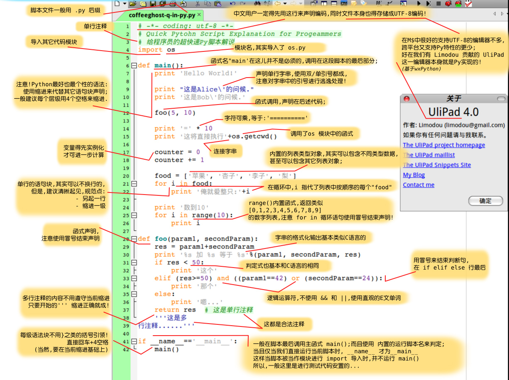

## 基础知识一

## 基础知识二

## 数据类型

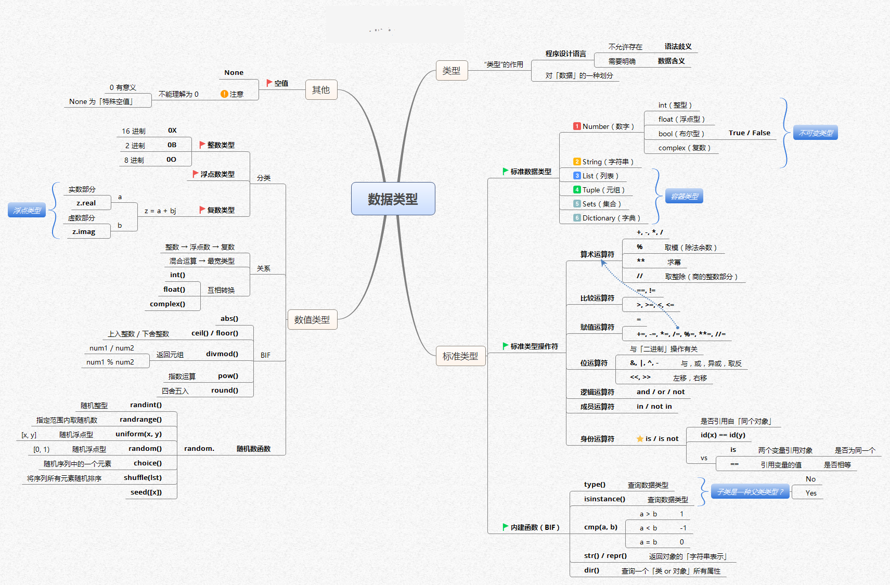

## 列表元组

## 序列

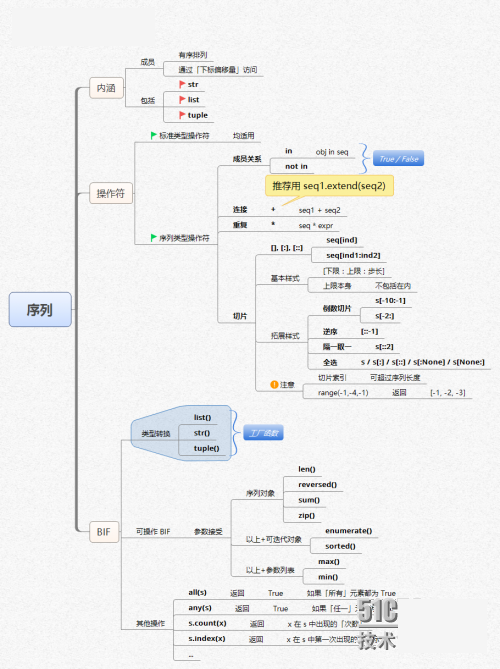

## 字符串

## 字典集合

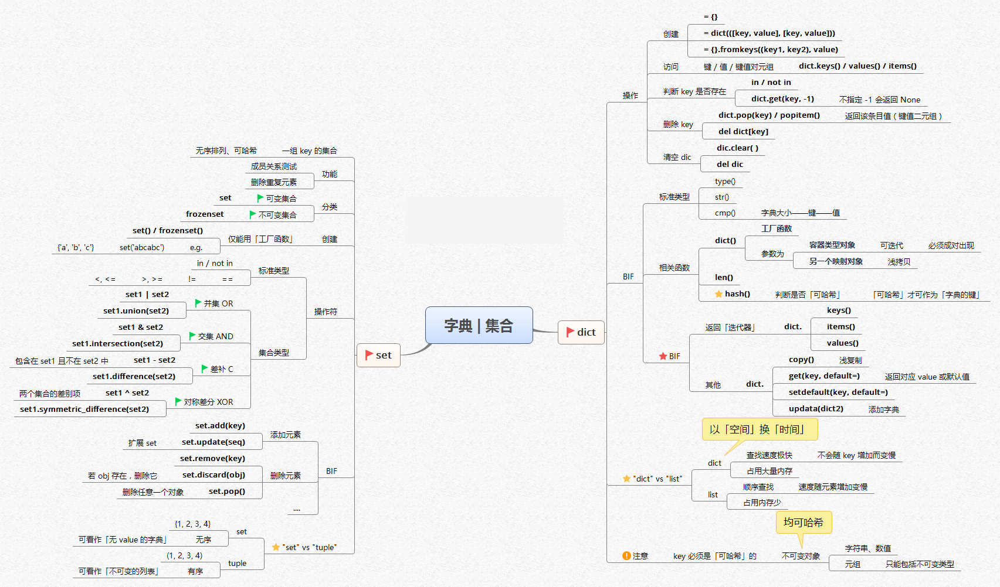

## 模块

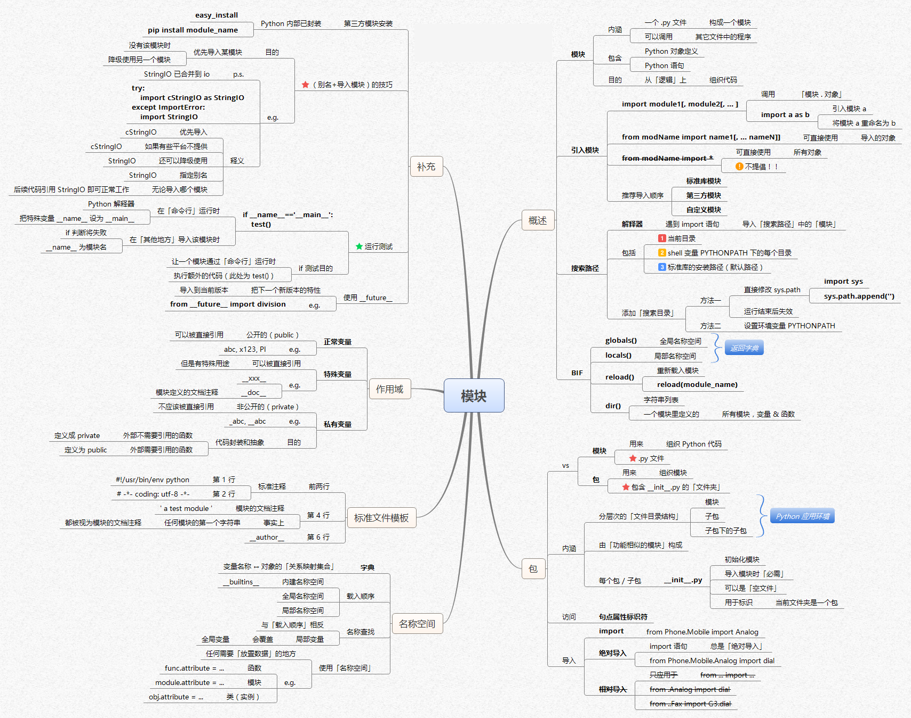

## 条件循环

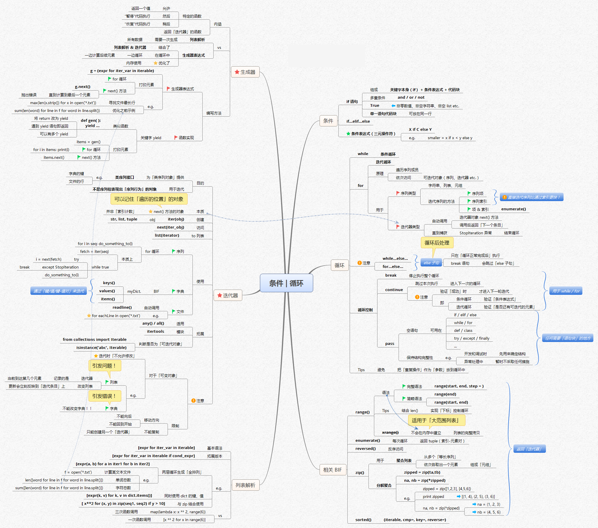

## 函数一

## 函数二

## 面向对象编程

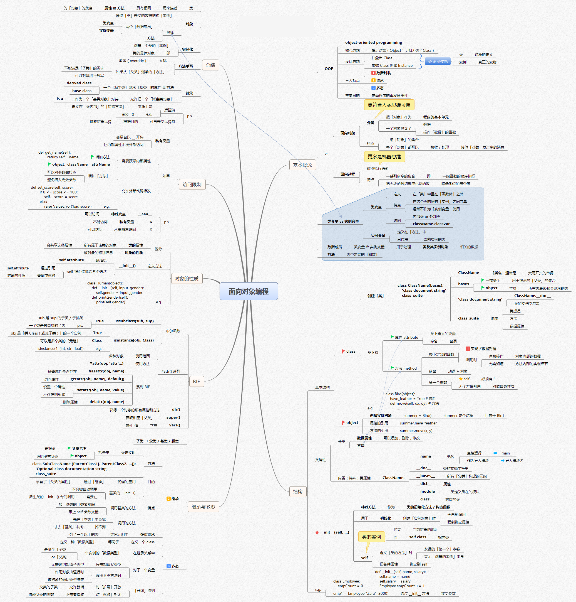

## 文件对象

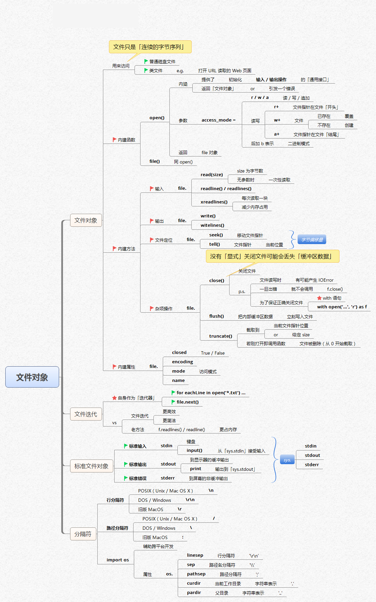

## 错误异常

## 综合其他

### 变量和数据类型

### 循环语句

### Dict 和 Set 类型

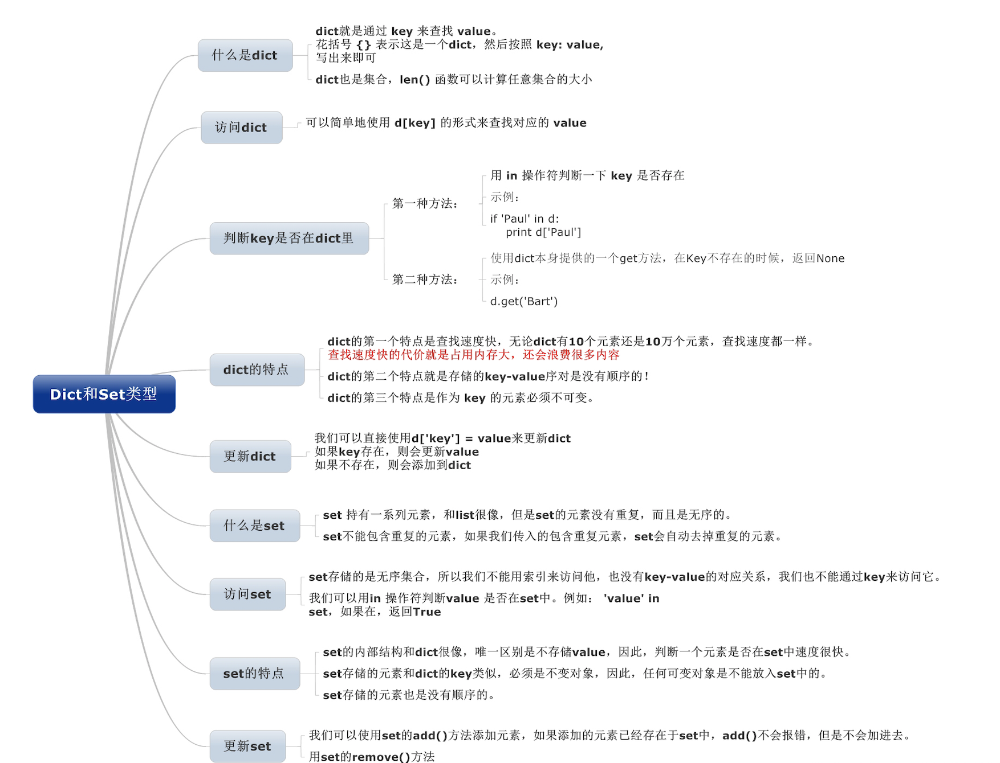

### List 和 Tuple 类型

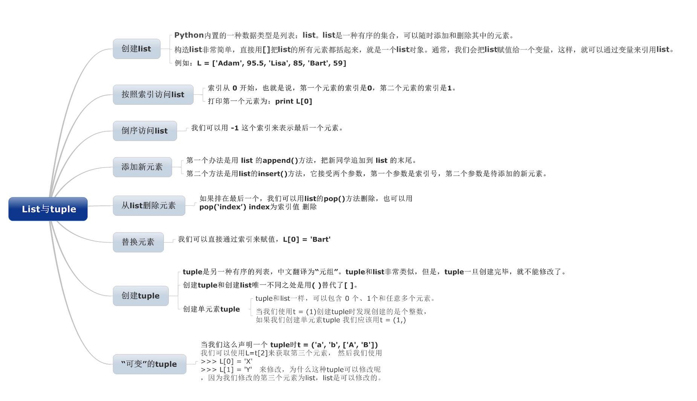

### Python 列表生成式

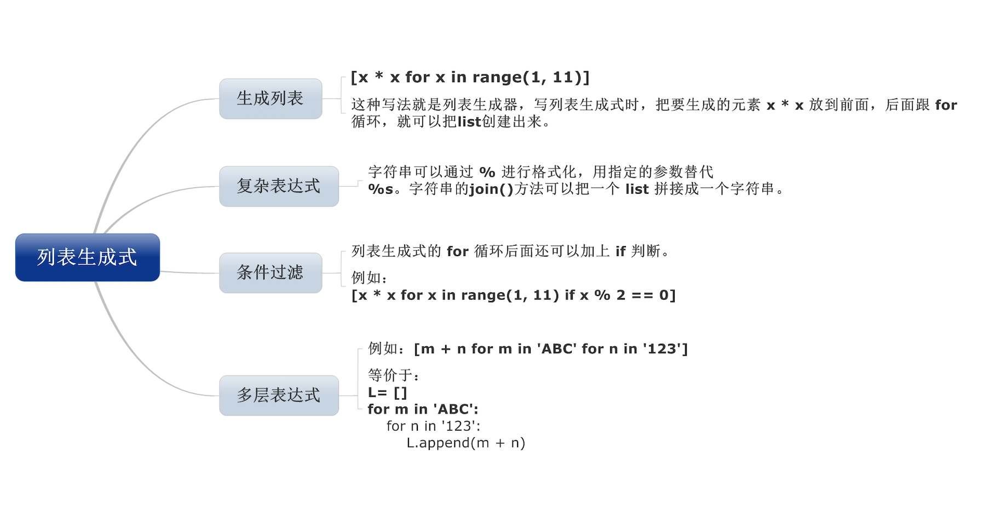

### Python 迭代

### Python 返回函数和闭包

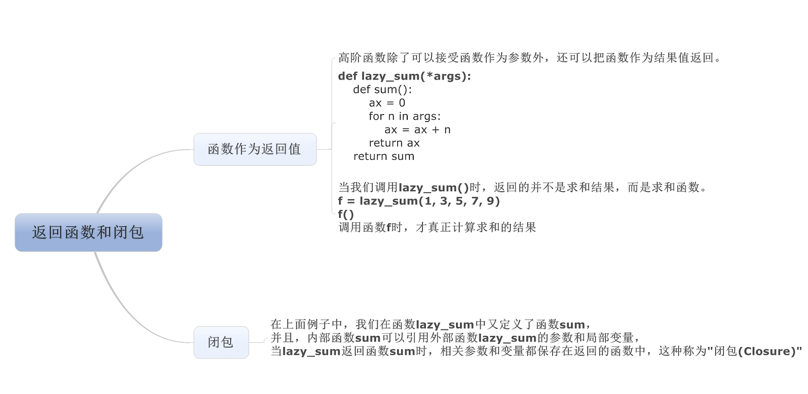

### Python 函数

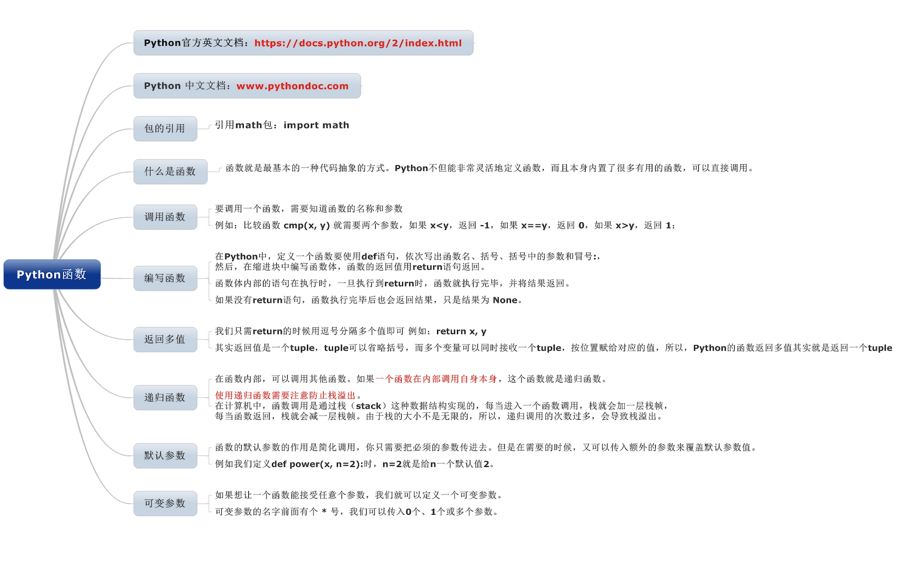

### Python 高阶函数

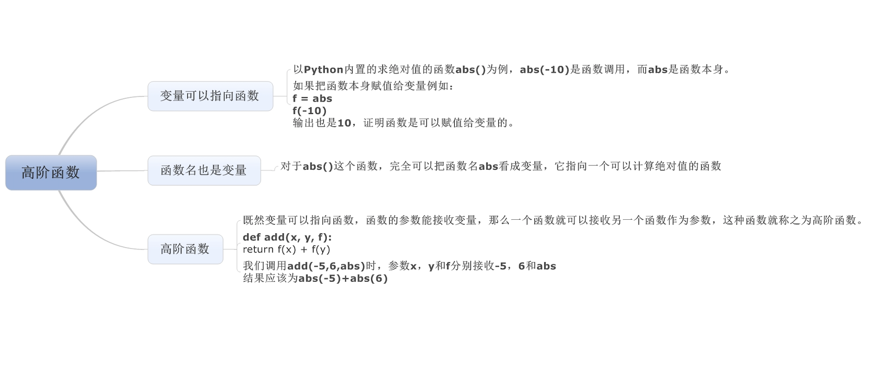

### Python 切片

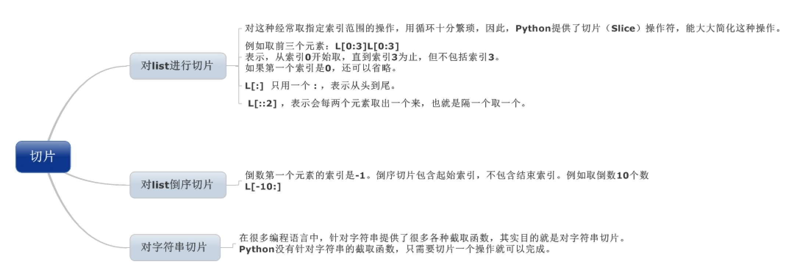

### Python 生成器

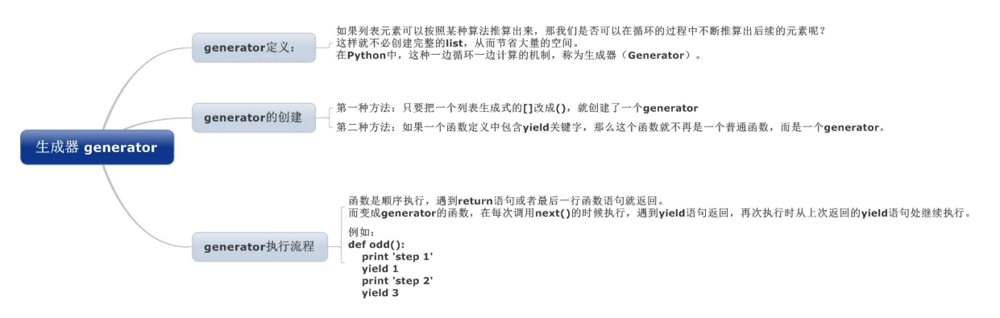
