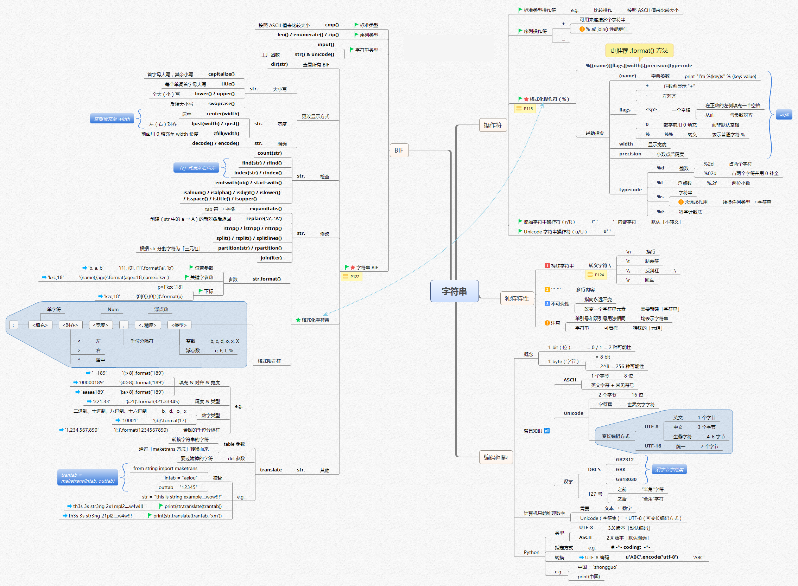
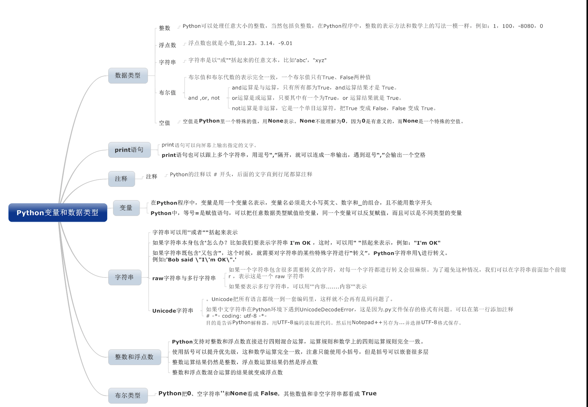
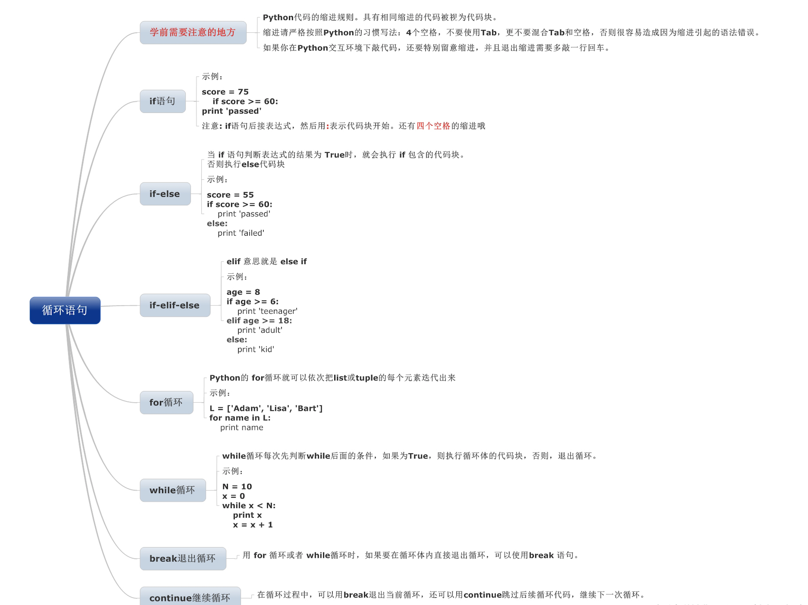
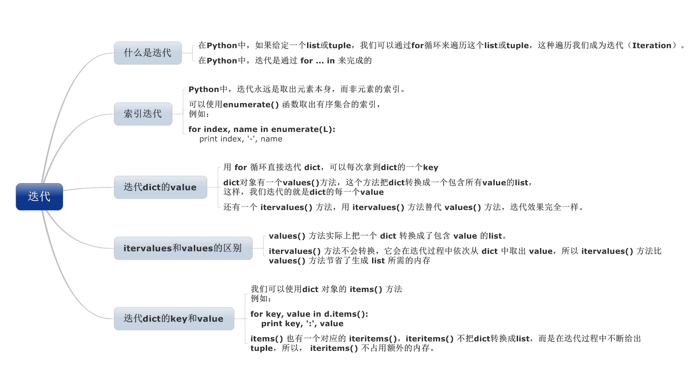

### Python 基础

## Python 语法图

## 基础知识一

## 基础知识二

## 数据类型

## 列表元组

## 序列

## 字符串

## 字典集合

## 模块

## 条件循环

## 函数一

## 函数二

## 面向对象编程

## 文件对象

## 错误异常

## 综合其他

### 变量和数据类型

### 循环语句

### Dict 和 Set 类型

### List 和 Tuple 类型

### Python 列表生成式

### Python 迭代

### Python 返回函数和闭包

### Python 函数

### Python 高阶函数

### Python 切片

### Python 生成器

