### 1-项目目录

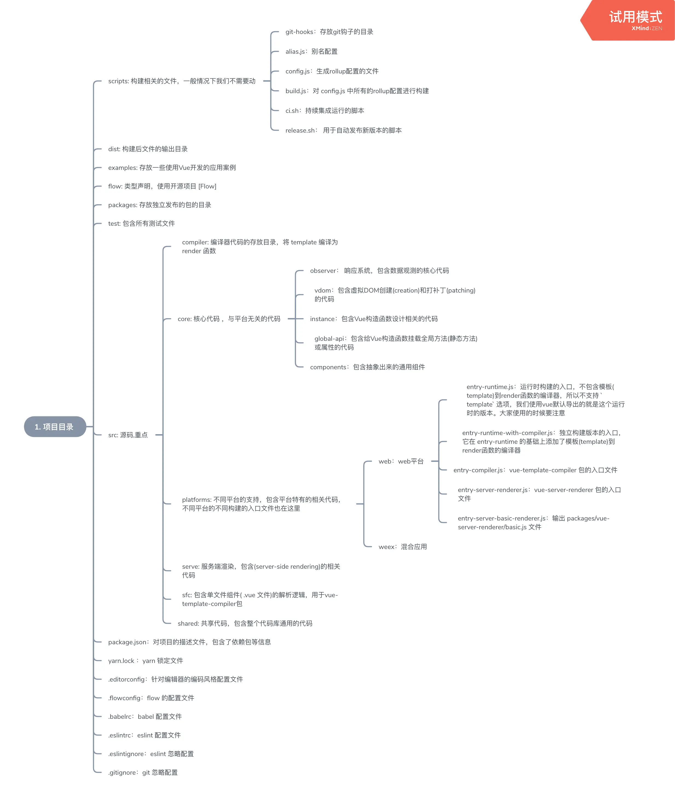

### 2-源码构建

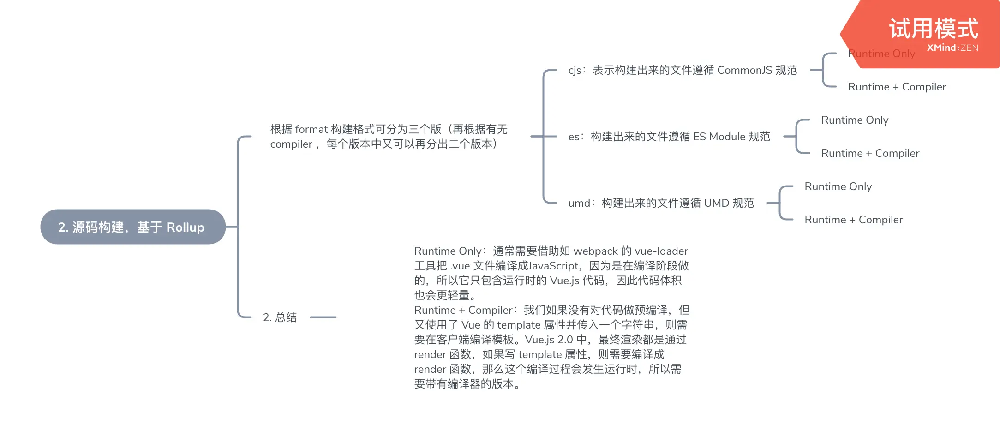

### 3-组件本质

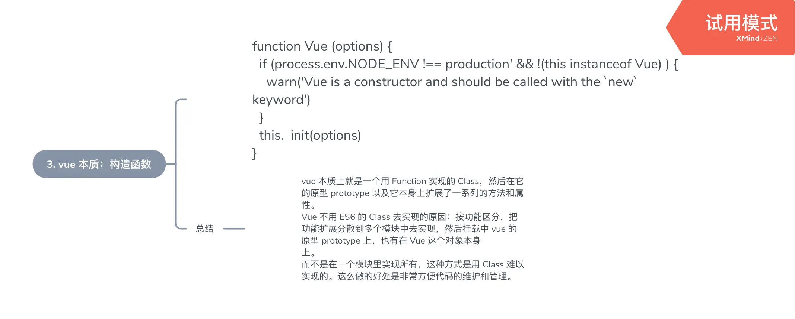

### 4-数据驱动

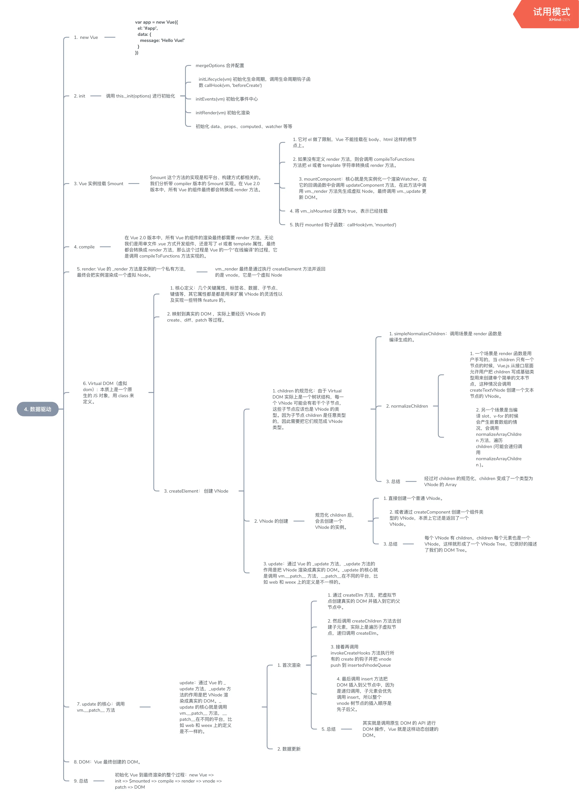

### 5-组件化

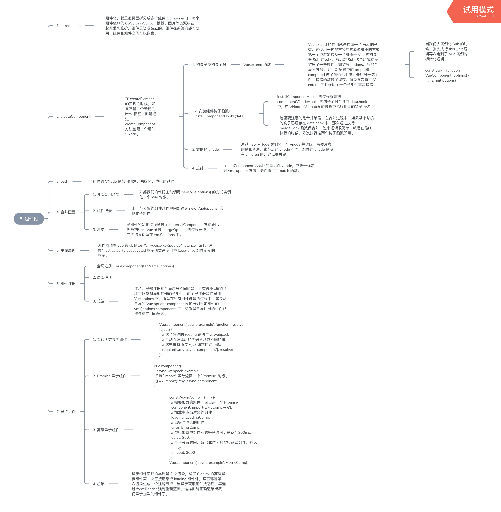

### 6-深入响应式原理

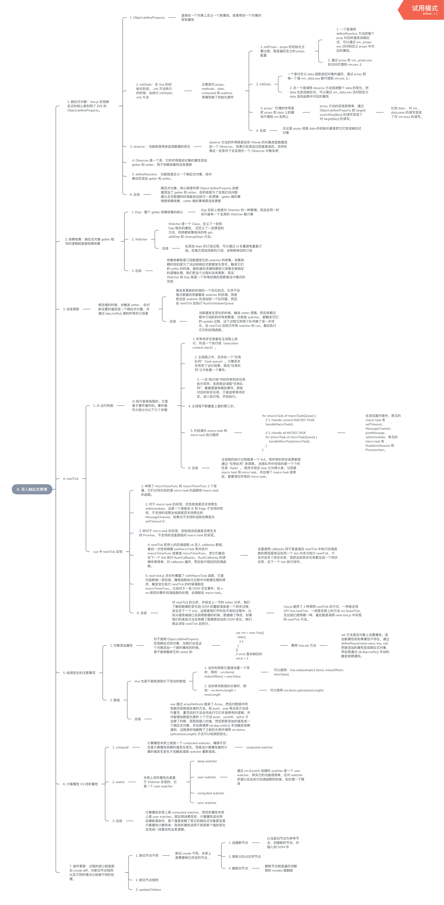

### 7-编译

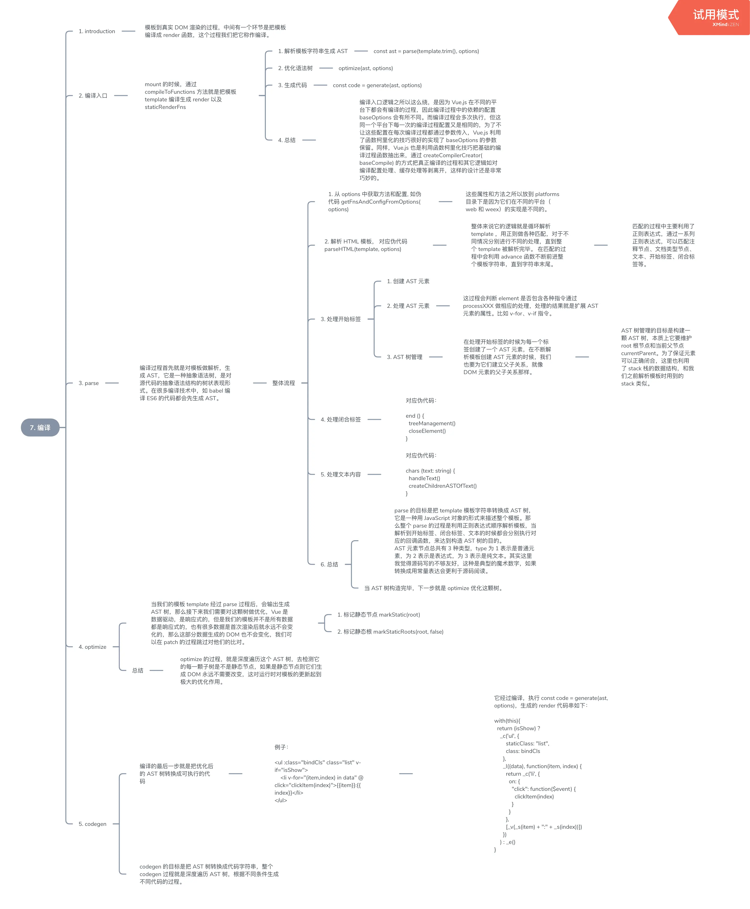

### 8-拓展

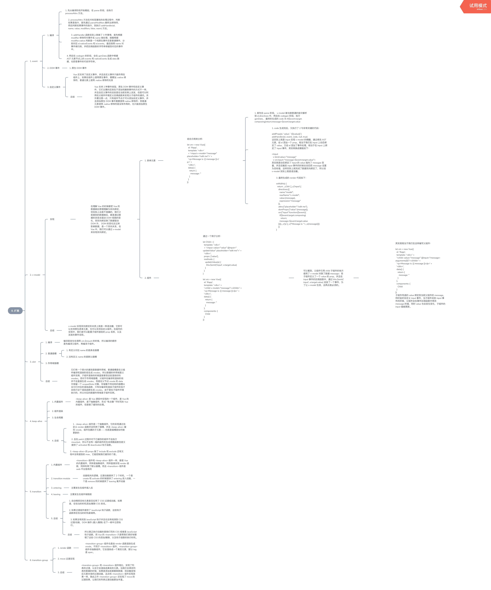

### 9-vue-router

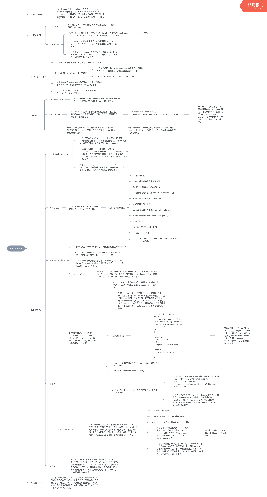

### 10-vuex

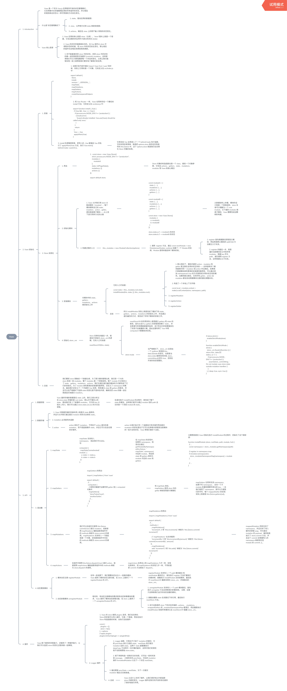

### 11-其他

## 生命周期

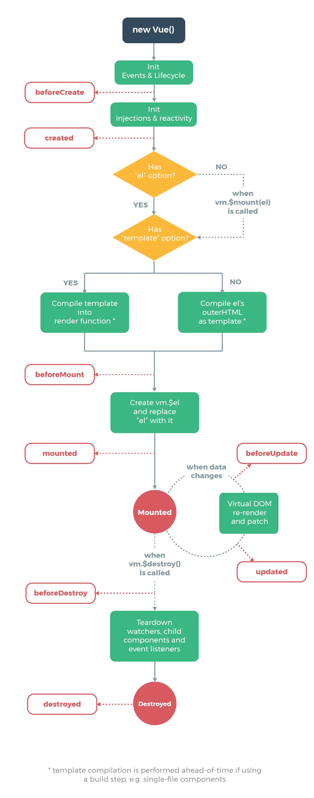

## 响应式

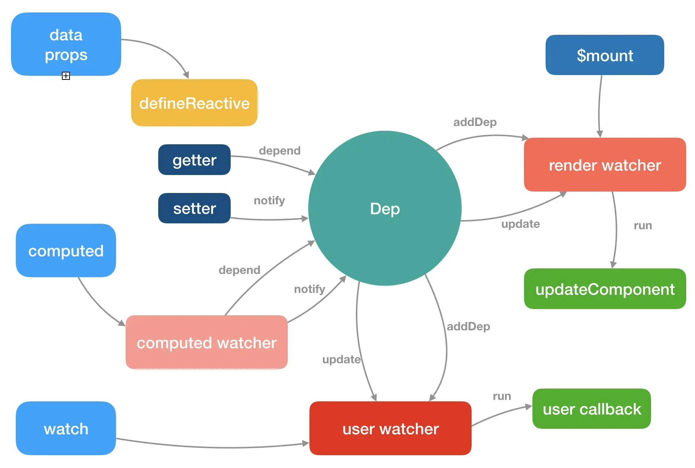

## 编译阶段 parse HTML 过程

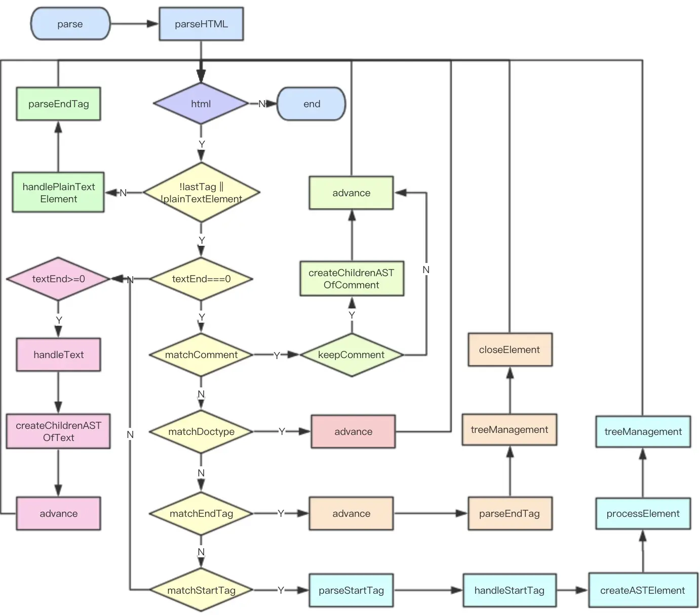
