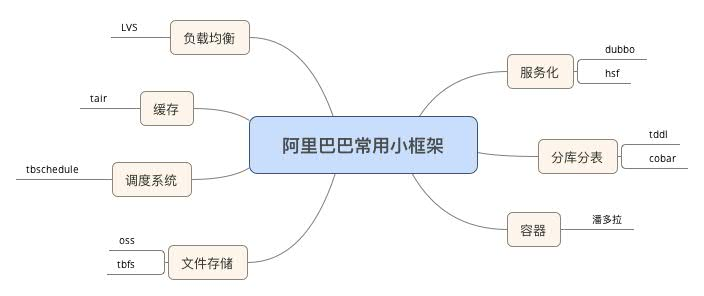
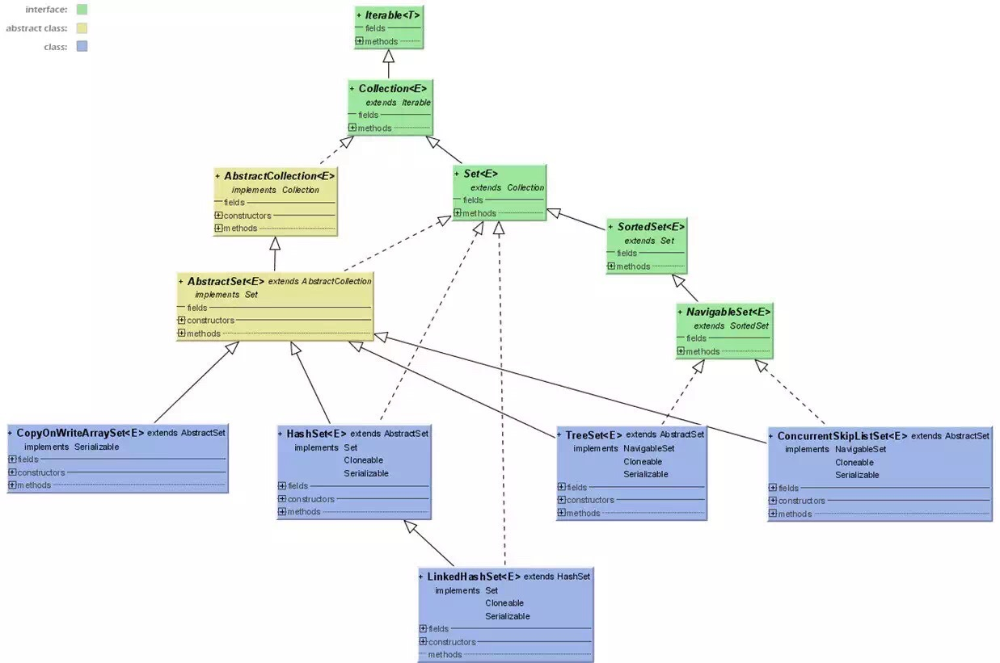

### 1.1 架构师图谱

### 1.2Java 架构师图谱

### 1.3 微服务架构秘籍

### 1.4 一致性图谱

### 1.5 互联网大流量的方法

### 1.6 安全秘籍

### 1.7 阿里巴巴常用小框架

### 1.8 架构方法论图谱

### 1.9 设计模式秘籍图谱

### 2.1JVM 垃圾回图谱

### 2.2Java 并发图谱

### 2.3Java 集合图谱

### 2.4Java 集合类图

### 2.5Java List 类图

### 2.6Java Map 类图

### 2.7Java Set 类图

### 3.1Hadoop 技能图谱

### 4.2 云计算技能图谱

### 5.1IOS 技能图谱

### 5.2OpenResty 技能图谱

### 5.4 容器技能图谱

### 5.5 嵌入式开发技能图谱

### 5.6 开发语言宝典

### 5.7 移动端测试图谱

### 5.8 运维技能图谱

