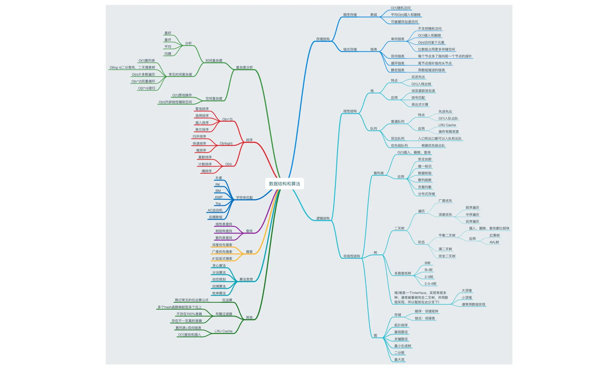

### 数据结构

## 数据结构和算法

## 数据结构知识框架

<iframe src="web/mind-map/_media/0e1ff90b6af64572ad193461f3d24693.pdf" width="100%" height="800" ></iframe>

### 操作系统

<iframe src="web/mind-map/_media/25291ec31e52460fa15935039984462e.pdf" width="100%" height="800" ></iframe>
