## 写在前面

谈到 node 断点调试，目前主要有三种方式，通过`node内置调试工具`、`通过IDE（如vscode）`、`通过node-inspector`，三者本质上差不多。本文着重点在于介绍 **如何在本地通过 node-inspector 调试远程服务器上的 node 代码**。

在进入主题之前，首先会对三种调试方式进行入门讲解，方便新手理解后面的内容。至于老司机们，可以直接跳到主题去。

## 方式一：内置 debug 功能

#### 进入调试模式（在第 1 行断点）

    node debug app.js

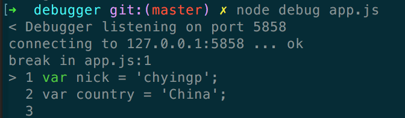

#### 进入调试模式（在第 n 行断点）

比如要在第 3 行断点。

方式一：通过`debugger`

![clipboard.png][clipboard.png 1]

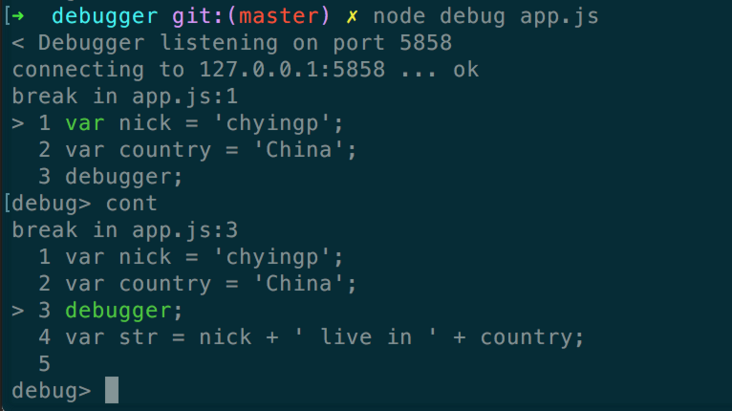

方式二：通过`sb(line)`。

![clipboard.png][clipboard.png 2]

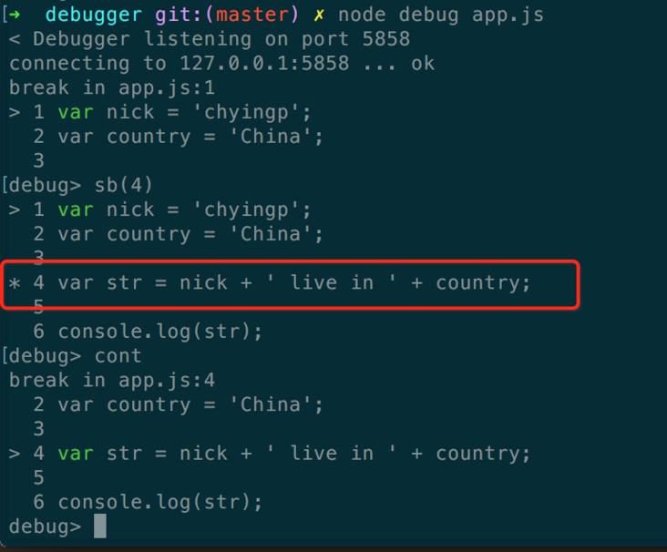

#### 执行下一步

通过`next`命令。

![clipboard.png][clipboard.png 3]

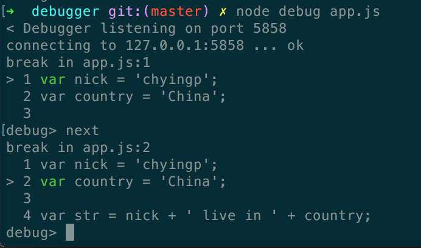

#### 跳到下一个断点

通过`cont`命令。

![clipboard.png][clipboard.png 4]

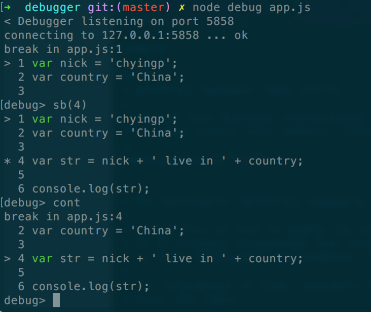

#### 查看某个变量的值

输入`repl`命令后，再次输入变量名，就可以看到变量对应的值。如果想继续执行代码，可以按`ctrl+c`退出。

![clipboard.png][clipboard.png 5]

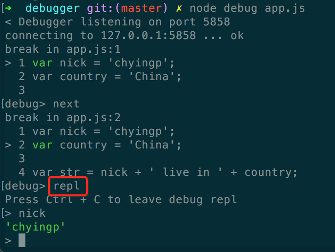

#### 添加/删除 watch

- 通过`watch(expr)`来添加监视对象。
- 通过`watchers`查看当前所有的监视对象。
- 通过`unwatch(expr)`来删除监视对象。

添加 watch：

![clipboard.png][clipboard.png 6]

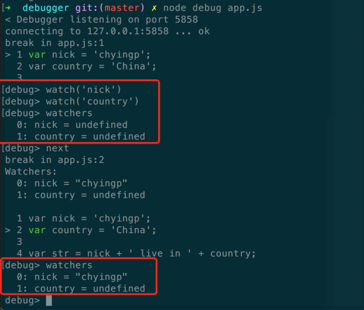

删除 watch：

![clipboard.png][clipboard.png 7]

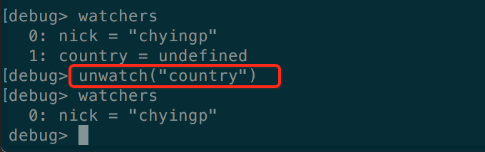

#### 进入/跳出函数（step in、step out）

- 进入函数：通过`step`或者`s`。
- 跳出函数：通过`out`或者`o`。

示例代码如下，假设代码运行到`logger(str);`这一行，首先跳进函数内部，再跳出函数。

    var nick = 'chyingp';
    var country = 'China';

    var str = nick + ' live in ' + country;

    var logger = function(msg){
        console.log(msg); // 这里
        console.log('这行会跳过'); // 跳过这行
    };

    logger(str);  // 假设运行到这里，想要进入logger方法

    console.log(str);

示例截图如下：

![clipboard.png][clipboard.png 8]

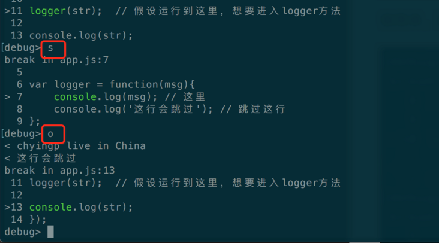

#### 多个文件断点

通过`setBreakpoint('script.js', 1), sb(...)`，在某个文件某一行添加断点。反正我是没成功过。。。怎么看都是 bug。。。

#### 重新运行

每次都退出然后`node debug app.js`相当烦。直接用`restart`

![clipboard.png][clipboard.png 9]

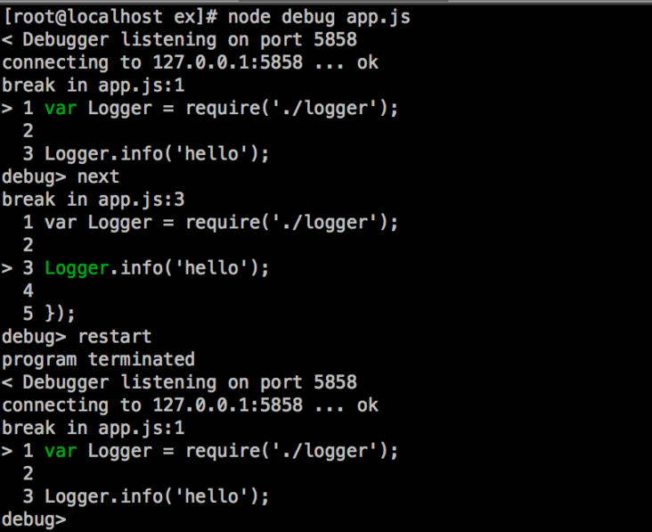

#### 远程调试

比如远程机器 ip 是`192.168.1.126`，在远程机器上进入调试模式

    [root@localhost ex]# node --debug-brk app.js
    Debugger listening on port 5858

然后，在本地机器通过`node debug 192.168.1.126:5858`连接远程机器进行调试。

    node debug 192.168.1.126:5858

如下：

    ➜  /tmp node debug 192.168.1.126:5858
    connecting to 192.168.1.126:5858 ... ok
    break in /tmp/ex/app.js:1
    > 1 var Logger = require('./logger');
      2
      3 Logger.info('hello');
    debug> n
    break in /tmp/ex/app.js:3
      1 var Logger = require('./logger');
      2
    > 3 Logger.info('hello');
      4
      5 });

当然，还可以通过 pid 进行远程调试，这里就不举例。

参考：https://nodejs.org/api/debugger.htmldebugger\_advanced\_usage

## 方式二：通过 IDE(vscode)

首先，在 vscode 里打开项目

![clipboard.png][clipboard.png 10]

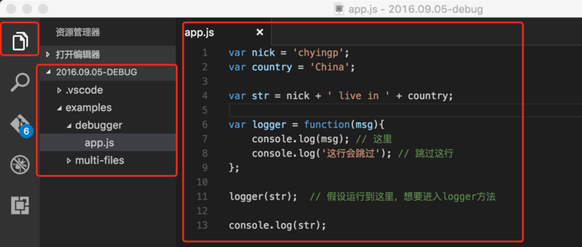

然后，添加调试配置。主要需要修改的是可执行文件的路径。

![clipboard.png][clipboard.png 11]

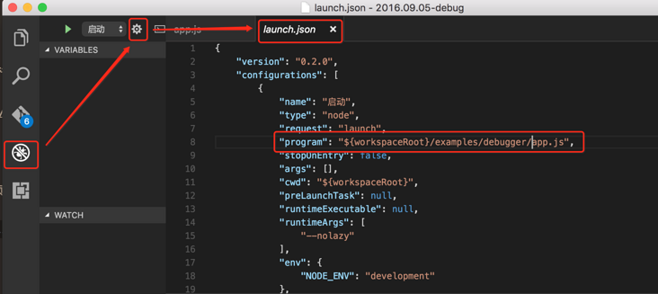

点击代码左侧添加断点。

![clipboard.png][clipboard.png 12]

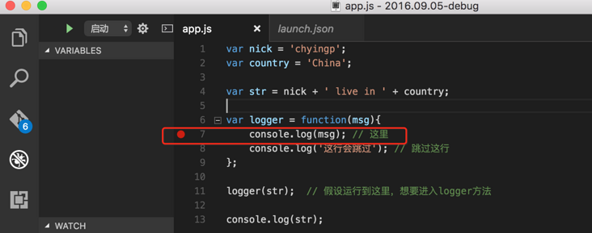

开始调试

![clipboard.png][clipboard.png 13]

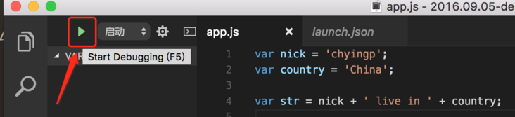

顺利断点，左侧的变量、监视对象，右侧的调试工具栏，用过`chrome dev tool`的同学应该很熟悉，不赘述。

![clipboard.png][clipboard.png 14]

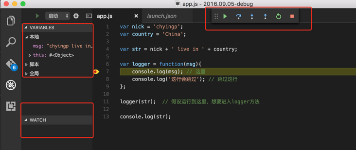

## 方式三：通过 node-inspector

首先，安装`node-inspector`。

    npm install -g node-inspector

#### 方式一：通过`node-debug`启动调试

启动调试，它会自动帮你在浏览器里打开调试界面。

    ➜  debugger git:(master) ✗ node-debug app.js
    Node Inspector v0.12.8
    Visit http://127.0.0.1:8080/?port=5858 to start debugging.
    Debugging `app.js`

    Debugger listening on port 5858

调试界面如下，简直不能更亲切。

![clipboard.png][clipboard.png 15]

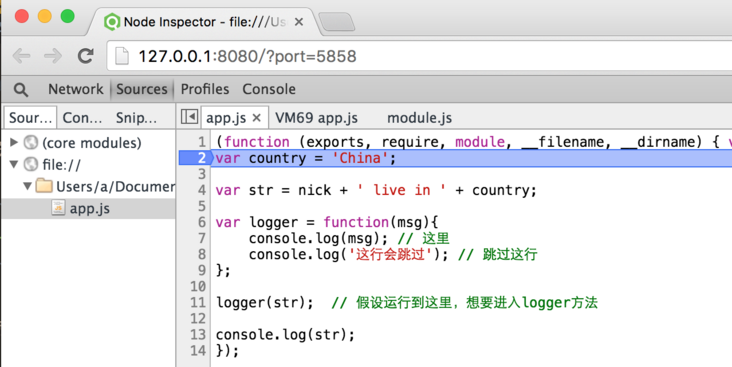

#### 方式二：更加灵活的方式

步骤 1：通过`node-inspector`启动 Node Inspector Server

    ➜  debugger git:(master) ✗ node-inspector
    Node Inspector v0.12.8
    Visit http://127.0.0.1:8080/?port=5858 to start debugging.

步骤 2：通过传统方式启动调试。加入`--debug-brk`，好让代码在第一行断住。

    ➜  debugger git:(master) ✗ node --debug-brk app.js
    Debugger listening on port 5858

步骤 3：在浏览器里打开调试 UI 界面。就是步骤 1 里打印出来的地址 http://127.0.0.1:8080/?port=5858。成功

![clipboard.png][clipboard.png 16]

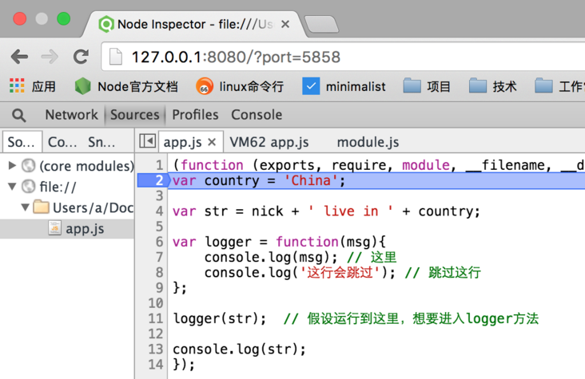

#### 实现原理

从上面的例子不难猜想到。（不负责任猜想）

- 通过`node --debug-brk`启动调试，监听`5858`端口。
- `node-inspector`启动服务，监听 8080 端口。
- 在浏览器里访问`http://127.0.0.1:8080/?port=5858`。可以看到`port=5858`这个参数。结合之前讲到的 node 内置远程调试的功能，可以猜想，在返回 UI 调试界面的同时，服务内部通过`5858`端口开始了断点调试。

另外，从下面截图可以看出，UI 调试工具（其实是个网页）跟 `inspector服务` 之间通过`websocket`进行通信。

用户在界面上操作时，比如设置断点，就向 `inspector服务` 发送一条消息，`inspector服务` 在内部通过 v8 调试器来实现代码的断点。

![clipboard.png][clipboard.png 17]

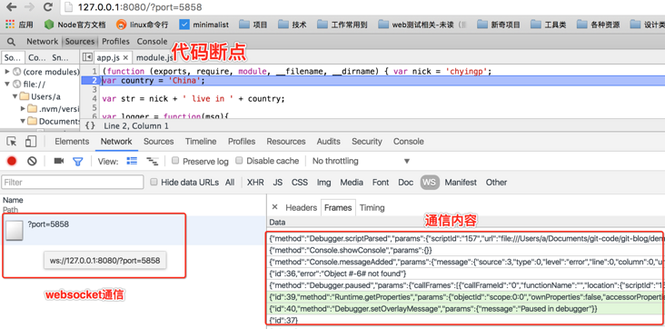

可以看到，用到了`v8-debug`，这个就待深挖了。

![clipboard.png][clipboard.png 18]

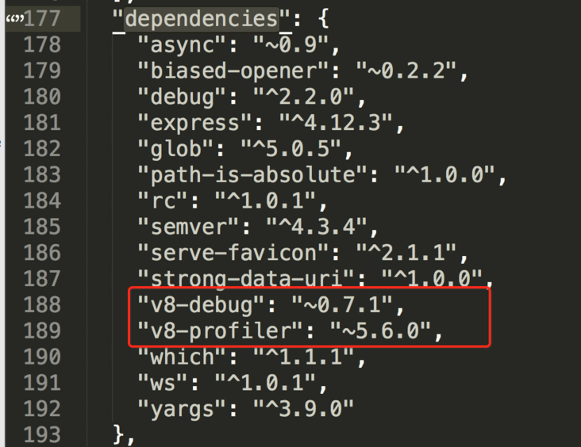

## 通过 node-inspector 调试远程代码

细心的同学可能会发现，node 远程调试其实在上面`node-inspector`章节的讲解里已经覆盖到了。这里还是来个实际的例子。

假设我们的 node 代码`app.js`运行在阿里云的服务器上，服务器 ip 是`xxx.xxx.xxx.xxx`。

首先，服务器上启动 node-inspector 服务

    [root@iZ94wb7tioqZ ~]# node-inspector
    Node Inspector v0.12.8
    Visit http://127.0.0.1:8080/?port=5858 to start debugging.

其次，通过`--debug-brk`参数，进入调试模式

    [root@iZ94wb7tioqZ ex]# node --debug-brk app.js
    Debugger listening on port 5858

最后，在本地通过 ip 地址愉快的访问调试界面。是不是很简单捏。

![clipboard.png][clipboard.png 19]

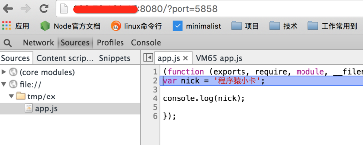

#### 常见问题：安全限制

远程调试常见的问题就是请求被拒绝。这是服务器安全策略的限制。遇到这种情况，开放端口就完事了。

![clipboard.png][clipboard.png 20]

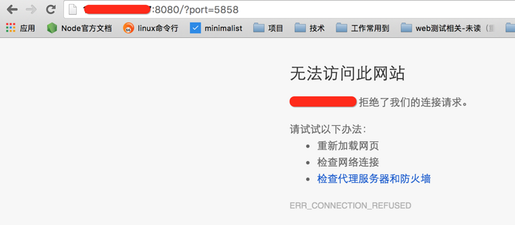

在我们的云主机上，默认安装了`firewall-cmd`，可以通过`--add-port`选项来开放`8080`端口的开放。如果本机没有安装`firewall-cmd`，也可以通过`iptables`来实现同样的功能。

    [root@iZ94wb7tioqZ ex]# firewall-cmd --add-port=8080/tcp
    success

然后，就可以愉快的远程调试了。

![clipboard.png][clipboard.png 21]

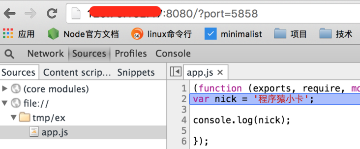

## 相关链接

[Node Debugger][]

[How Does a C Debugger Work?][how does a c debugger work]

[How debuggers work: Part 2 - Breakpoints][how debuggers work_ part 2 - breakpoints]

[clipboard.png]: https://segmentfault.com/img/bVCNET
[clipboard.png 1]: https://segmentfault.com/img/bVCNE6
[clipboard.png 2]: https://segmentfault.com/img/bVCNE7
[clipboard.png 3]: https://segmentfault.com/img/bVCNE9
[clipboard.png 4]: https://segmentfault.com/img/bVCNFa
[clipboard.png 5]: https://segmentfault.com/img/bVCNFb
[clipboard.png 6]: https://segmentfault.com/img/bVCNFc
[clipboard.png 7]: https://segmentfault.com/img/bVCNFd
[clipboard.png 8]: https://segmentfault.com/img/bVCNFh
[clipboard.png 9]: https://segmentfault.com/img/bVCNFi
[clipboard.png 10]: https://segmentfault.com/img/bVCNFl
[clipboard.png 11]: https://segmentfault.com/img/bVCNFm
[clipboard.png 12]: https://segmentfault.com/img/bVCNFp
[clipboard.png 13]: https://segmentfault.com/img/bVCNFr
[clipboard.png 14]: https://segmentfault.com/img/bVCNFs
[clipboard.png 15]: https://segmentfault.com/img/bVCNFt
[clipboard.png 16]: https://segmentfault.com/img/bVCNFu
[clipboard.png 17]: https://segmentfault.com/img/bVCNFC
[clipboard.png 18]: https://segmentfault.com/img/bVCNFD
[clipboard.png 19]: https://segmentfault.com/img/bVCNFF
[clipboard.png 20]: https://segmentfault.com/img/bVCNHD
[clipboard.png 21]: https://segmentfault.com/img/bVCNHE
[node debugger]: https://nodejs.org/api/debugger.html
[how does a c debugger work]: http://blog.0x972.info/?d=2014/11/13/10/40/50-how-does-a-debugger-work
[how debuggers work_ part 2 - breakpoints]: http://eli.thegreenplace.net/2011/01/27/how-debuggers-work-part-2-breakpoints/
