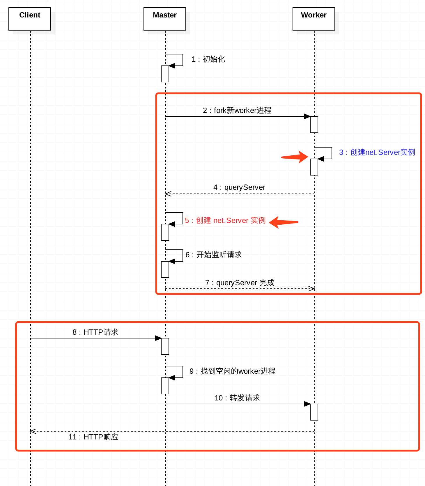

## cluster 模块概览

node 实例是单线程作业的。在服务端编程中，通常会创建多个 node 实例来处理客户端的请求，以此提升系统的吞吐率。对这样多个 node 实例，我们称之为 cluster（集群）。

借助 node 的 cluster 模块，开发者可以在几乎不修改原有项目代码的前提下，获得集群服务带来的好处。

集群有以下两种常见的实现方案，而 node 自带的 cluster 模块，采用了方案二。

### 方案一：多个 node 实例+多个端口

集群内的 node 实例，各自监听不同的端口，再由反向代理实现请求到多个端口的分发。

- 优点：实现简单，各实例相对独立，这对服务稳定性有好处。
- 缺点：增加端口占用，进程之间通信比较麻烦。

### 方案二：主进程向子进程转发请求

集群内，创建一个主进程(master)，以及若干个子进程(worker)。由 master 监听客户端连接请求，并根据特定的策略，转发给 worker。

- 优点：通常只占用一个端口，通信相对简单，转发策略更灵活。
- 缺点：实现相对复杂，对主进程的稳定性要求较高。

## 入门实例

在 cluster 模块中，主进程称为 master，子进程称为 worker。

例子如下，创建与 CPU 数目相同的服务端实例，来处理客户端请求。注意，它们监听的都是同样的端口。

    // server.js
    var cluster = require('cluster');
    var cpuNums = require('os').cpus().length;
    var http = require('http');

    if(cluster.isMaster){
      for(var i = 0; i < cpuNums; i++){
        cluster.fork();
      }
    }else{
      http.createServer(function(req, res){
        res.end(`response from worker ${process.pid}`);
      }).listen(3000);

      console.log(`Worker ${process.pid} started`);
    }

创建批处理脚本：./req.sh。

    #!/bin/bash

    # req.sh
    for((i=1;i<=4;i++)); do
      curl http://127.0.0.1:3000
      echo ""
    done

输出如下。可以看到，响应来自不同的进程。

    response from worker 23735
    response from worker 23731
    response from worker 23729
    response from worker 23730

## cluster 模块实现原理

了解 cluster 模块，主要搞清楚 3 个问题：

1.  master、worker 如何通信？
2.  多个 server 实例，如何实现端口共享？
3.  多个 server 实例，来自客户端的请求如何分发到多个 worker？

下面会结合示意图进行介绍，源码级别的介绍，可以参考 [笔者的 github][github]。

## 问题 1：master、worker 如何通信

这个问题比较简单。master 进程通过 cluster.fork() 来创建 worker 进程。cluster.fork() 内部 是通过 child_process.fork() 来创建子进程。

也就是说：

1.  master 进程、worker 进程是父、子进程的关系。
2.  master 进程、woker 进程可以通过 IPC 通道进行通信。（重要）

## 问题 2：如何实现端口共享

在前面的例子中，多个 woker 中创建的 server 监听了同个端口 3000。通常来说，多个进程监听同个端口，系统会报错。

为什么我们的例子没问题呢？

秘密在于，net 模块中，对 listen() 方法进行了特殊处理。根据当前进程是 master 进程，还是 worker 进程：

1.  master 进程：在该端口上正常监听请求。（没做特殊处理）
2.  worker 进程：创建 server 实例。然后通过 IPC 通道，向 master 进程发送消息，让 master 进程也创建 server 实例，并在该端口上监听请求。当请求进来时，master 进程将请求转发给 worker 进程的 server 实例。

归纳起来，就是：master 进程监听特定端口，并将客户请求转发给 worker 进程。

如下图所示：

### 问题 3：如何将请求分发到多个 worker

每当 worker 进程创建 server 实例来监听请求，都会通过 IPC 通道，在 master 上进行注册。当客户端请求到达，master 会负责将请求转发给对应的 worker。

具体转发给哪个 worker？这是由转发策略决定的。可以通过环境变量 NODE_CLUSTER_SCHED_POLICY 设置，也可以在 cluster.setupMaster(options)时传入。

默认的转发策略是轮询（SCHED_RR）。

当有客户请求到达，master 会轮询一遍 worker 列表，找到第一个空闲的 worker，然后将该请求转发给该 worker。

## master、worker 内部通信小技巧

在开发过程中，我们会通过 process.on('message', fn) 来实现进程间通信。

前面提到，master 进程、worker 进程在 server 实例的创建过程中，也是通过 IPC 通道进行通信的。那会不会对我们的开发造成干扰呢？比如，收到一堆其实并不需要关心的消息？

答案肯定是不会？那么是怎么做到的呢？

当发送的消息包含`cmd`字段，且改字段以`NODE_`作为前缀，则该消息会被视为内部保留的消息，不会通过`message`事件抛出，但可以通过监听'internalMessage'捕获。

以 worker 进程通知 master 进程创建 server 实例为例子。worker 伪代码如下：

    // woker进程
    const message = {
      cmd: 'NODE_CLUSTER',
      act: 'queryServer'
    };
    process.send(message);

master 伪代码如下：

    worker.process.on('internalMessage', fn);

## 相关链接

官方文档：[https://nodejs.org/api/cluster.html][https_nodejs.org_api_cluster.html]

Node 学习笔记：[https://github.com/chyingp/nodejs-learning-guide][github]

[github]: https://github.com/chyingp/nodejs-learning-guide
[4c1692183865cb201df83f8ee357d070.png]: https://www.chyingp.com/wp-content/uploads/2018/04/4c1692183865cb201df83f8ee357d070.png
[https_nodejs.org_api_cluster.html]: https://nodejs.org/api/cluster.html
