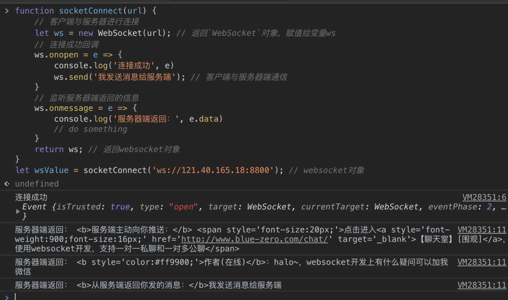
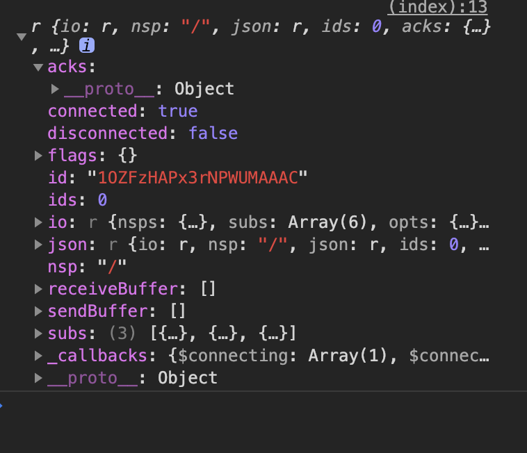
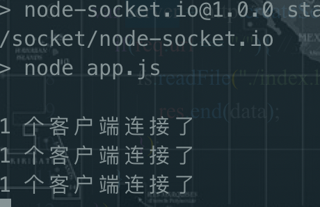
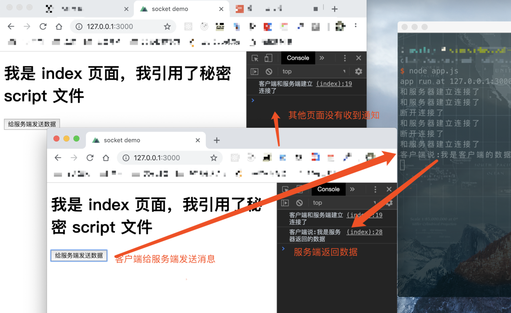
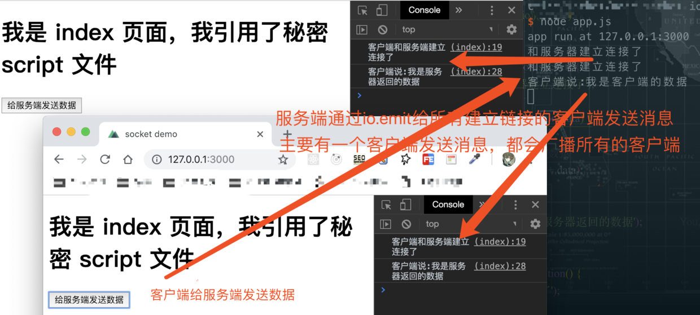
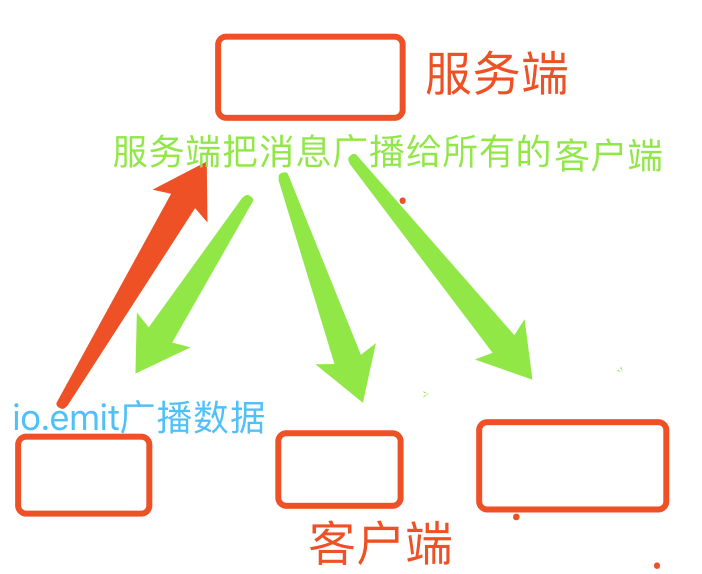

## WebSocket

### 一、WebSocket 解决了什么问题

- 客户端(浏览器)和服务器端进行通信，只能由客户端发起`ajax`请求，才能进行通信，服务器端无法主动向客户端推送信息
- 当出现类似体育赛事、聊天室、实时位置之类的场景时，客户端要获取服务器端的变化，就只能通过轮询(定时请求)来了解服务器端有没有新的信息变化

轮询效率低，非常浪费资源(需要不断发送请求，不停链接服务器)

> `WebSocket`的出现，让服务器端可以主动向服务器端发送信息，使得浏览器具备了实时双向通信的能力,这就是`WebSocket`解决的问题

**一个超简单例子**

> 新建一个`html`文件，将本栗子找个地方跑一下试试，即可轻松入门`WebSocket`

    function socketConnect(url) {
        // 客户端与服务器进行连接
        let ws = new WebSocket(url); // 返回`WebSocket`对象，赋值给变量ws
        // 连接成功回调
        ws.onopen = e => {
            console.log('连接成功', e)
            ws.send('我发送消息给服务端'); // 客户端与服务器端通信
        }
        // 监听服务器端返回的信息
        ws.onmessage = e => {
            console.log('服务器端返回：', e.data)
            // do something
        }
        return ws; // 返回websocket对象
    }
    let wsValue = socketConnect('ws://121.40.165.18:8800'); // websocket对象

> 上述栗子中`WebSocket`的接口地址出自：`WebSocket` 在线测试，在开发的时候也可以用于测试后端给的地址是否可用

### 二、webSocket 的 class 类

> 当项目中很多地方使用`WebSocket`，把它封成一个`class`类，是更好的选择

    class WebSocketClass {
        /** * @description: 初始化实例属性，保存参数 * @param {String} url ws的接口 * @param {Function} msgCallback 服务器信息的回调传数据给函数 * @param {String} name 可选值 用于区分ws，用于debugger */
        constructor(url, msgCallback, name = 'default') {
            this.url = url;
            this.msgCallback = msgCallback;
            this.name = name;
            this.ws = null;  // websocket对象
            this.status = null; // websocket是否关闭
        }
        /** * @description: 初始化 连接websocket或重连webSocket时调用 * @param {*} 可选值 要传的数据 */
        connect(data) {
            // 新建 WebSocket 实例
            this.ws = new WebSocket(this.url);
            this.ws.onopen = e => {
                // 连接ws成功回调
                this.status = 'open';
                console.log(`${this.name}连接成功`, e)
                // this.heartCheck();
                if (data !== undefined) {
                    // 有要传的数据,就发给后端
                    return this.ws.send(data);
                }
            }
            // 监听服务器端返回的信息
            this.ws.onmessage = e => {
                // 把数据传给回调函数，并执行回调
                // if (e.data === 'pong') {
                // this.pingPong = 'pong'; // 服务器端返回pong,修改pingPong的状态
                // }
                return this.msgCallback(e.data);
            }
            // ws关闭回调
            this.ws.onclose = e => {
                this.closeHandle(e); // 判断是否关闭
            }
            // ws出错回调
            this.onerror = e => {
                this.closeHandle(e); // 判断是否关闭
            }
        }
        // heartCheck() {
        // // 心跳机制的时间可以自己与后端约定
        // this.pingPong = 'ping'; // ws的心跳机制状态值
        // this.pingInterval = setInterval(() => {
        // if (this.ws.readyState === 1) {
        // // 检查ws为链接状态 才可发送
        // this.ws.send('ping'); // 客户端发送ping
        // }
        // }, 10000)
        // this.pongInterval = setInterval(() => {
        // this.pingPong = false;
        // if (this.pingPong === 'ping') {
        // this.closeHandle('pingPong没有改变为pong'); // 没有返回pong 重启webSocket
        // }
        // // 重置为ping 若下一次 ping 发送失败 或者pong返回失败(pingPong不会改成pong)，将重启
        // console.log('返回pong')
        // this.pingPong = 'ping'
        // }, 20000)
        // }
        // 发送信息给服务器
        sendHandle(data) {
            console.log(`${this.name}发送消息给服务器:`, data)
            return this.ws.send(data);
        }
        closeHandle(e = 'err') {
            // 因为webSocket并不稳定，规定只能手动关闭(调closeMyself方法)，否则就重连
            if (this.status !== 'close') {
                console.log(`${this.name}断开，重连websocket`, e)
                // if (this.pingInterval !== undefined && this.pongInterval !== undefined) {
                // // 清除定时器
                // clearInterval(this.pingInterval);
                // clearInterval(this.pongInterval);
                // }
                this.connect(); // 重连
            } else {
                console.log(`${this.name}websocket手动关闭`)
            }
        }
        // 手动关闭WebSocket
        closeMyself() {
            console.log(`关闭${this.name}`)
            this.status = 'close';
            return this.ws.close();
        }
    }
    function someFn(data) {
        console.log('接收服务器消息的回调：', data);
    }
    // const wsValue = new WebSocketClass('ws://121.40.165.18:8800', someFn, 'wsName'); // 这个链接一天只能发送消息50次
    const wsValue = new WebSocketClass('wss://echo.websocket.org', someFn, 'wsName'); // 阮一峰老师教程链接
    wsValue.connect('立即与服务器通信'); // 连接服务器
    // setTimeout(() => {
    // wsValue.sendHandle('传消息给服务器')
    // }, 1000);
    // setTimeout(() => {
    // wsValue.closeMyself(); // 关闭ws
    // }, 10000)

> 可以把`class`放在一个 js 文件里面,`export`出去，然后在需要用的地方再`import`进来，把参数传进去就可以用了

### 三、WebSocket 不稳定

> `WebSocket`并不稳定，在使用一段时间后，可能会断开连接，貌似至今没有一个为何会断开连接的公论，所以我们需要让`WebSocket`保持连接状态，这里推荐两种方法

#### 3.1 WebSocket 设置变量，判断是否手动关闭连接

> `class`类中就是用的这种方式:设置一个变量，在`webSocket`关闭/报错的回调中，判断是不是手动关闭的，如果不是的话，就重新连接，这样做的优缺点如下

- 优点：请求较少(相对于心跳连接)，易设置。
- 缺点：可能会导致丢失数据,在断开重连的这段时间中，恰好双方正在通信

### 3.2 WebSocket 心跳机制

> 因为第一种方案的缺点，并且可能会有其他一些未知情况导致断开连接而没有触发 Error 或 Close 事件。这样就导致实际连接已经断开了，而客户端和服务端却不知道，还在傻傻的等着消息来

- 想出了一种叫做心跳机制的解决方法：
- 客户端就像心跳一样每隔固定的时间发送一次 ping，来告诉服务器，我还活着，而服务器也会返回 pong，来告诉客户端，服务器还活着。
- 具体的实现方法，在上面`class`的注释中，将其打开，即可看到效果

### 四、关于 WebSocket

#### 4.1 WebSocket 的当前状态:`WebSocket.readyState`

**下面是 WebSocket.readyState 的四个值(四种状态)：**

- `0`: 表示正在连接
- `1`: 表示连接成功，可以通信了
- `2`: 表示连接正在关闭
- `3`: 表示连接已经关闭，或者打开连接失败

> 我们可以利用当前状态来做一些事情，比如上面栗子中当`WebSocket`链接成功后，才允许客户端发`送ping`

    if (this.ws.readyState === 1) {
        // 检查ws为链接状态 才可发送
        this.ws.send('ping'); // 客户端发送ping
    }

#### 4.2 `WebSocket`还可以发送/接收 二进制数据

> 二进制数据包括：`blob`对象和`Arraybuffer`对象，所以我们需要分开来处理

    // 接收数据
    ws.onmessage = function(event){
        if(event.data instanceof ArrayBuffer){
            // 判断 ArrayBuffer 对象
        }

        if(event.data instanceof Blob){
            // 判断 Blob 对象
        }
    }

    // 发送 Blob 对象的例子
    let file = document.querySelector('input[type="file"]').files[0];
    ws.send(file);

    // 发送 ArrayBuffer 对象的例子
    var img = canvas_context.getImageData(0, 0, 400, 320);
    var binary = new Uint8Array(img.data.length);
    for (var i = 0; i < img.data.length; i++) {
        binary[i] = img.data[i];
    }
    ws.send(binary.buffer);

> 如果你要发送的二进制数据很大的话，如何判断发送完毕：

    webSocket.bufferedAmount属性，表示还有多少字节的二进制数据没有发送出去：

    var data = new ArrayBuffer(10000000);
    socket.send(data);
    if (socket.bufferedAmount === 0) {
        // 发送完毕
    } else {
        // 发送还没结束
    }

### 五、WebSocket 的优点

- 双向通信
- 数据格式比较轻量，性能开销小，通信高效

  - 协议控制的数据包头部较小，而`HTTP`协议每次通信都需要携带完整的头部

- 更好的二进制支持
- 没有同源限制，客户端可以与任意服务器通信
- 与 `HTTP` 协议有着良好的兼容性。默认端口也是`80`和`443`，并且握手阶段采用 `HTTP` 协议，因此握手时不容易屏蔽，能通过各种 `HTTP` 代理服务器

## socket.io

### 一、原生 Node 与 socket.io 通信

> 原生`nodejs`结合`Socket.io`实现服务器和客户端的相互通信

> 官方文档 https://socket.io

#### 1.1 搭建服务

    # 新建目录
    mkdir socket && cd socket

    # 生成package.json
    npm init -y

    # 安装socket
    npm install socket.io

    // app.js

    var http = require("http");

    var server = http.createServer(function(req,res){
        if(req.url == "/"){ //显示首页
            fs.readFile("./index.html",function(err,data){
                res.end(data);
            });
        }
    });

    var io = require('socket.io')(server);

    //监听连接事件
    io.on("connection",function(socket){
        console.log("1 个客户端连接了");
    })

    server.listen(3000,"127.0.0.1",function(){
        console.log('app run at 127.0.0.1:3000')
    });

    // 写完这句话之后，你就会发现，http://127.0.0.1:3000/socket.io/socket.io.js 就是一个 js 文件 的地址了

#### 1.2 新建页面

> 现在需要制作一个`index`页面，这个页面中，必须引用秘密`js`文件。调用`io`函数，取得`socket` 对象

    <!DOCTYPE html> <html lang="en"> <head>
    <meta charset="UTF-8">
    <title>Document</title> </head>
    <body>

    <h1>我是 index 页面，我引用了秘密 script 文件</h1>

     

    </body>
    </html>

> 至此，服务器和客户端都有 `socket` 对象了。服务器的 `socket` 对象:

> `socket对象`

#### 1.3 服务器端通过 emit 广播，通过 on 接收广播

    // app.js

    var http = require("http");

    var server = http.createServer(function(req,res){
        if(req.url == "/"){ //显示首页
            fs.readFile("./index.html",function(err,data){
                res.end(data);
            });
        }
    });

    var io = require('socket.io')(server);

    //监听连接事件
    io.on('connection',function(socket) {
        console.log('和服务器建立连接了');

        socket.on('to-server',function(data) {

            // 接收客户端传过来的数据
            console.log('客户端说:' + data);

            // 向客户端发送数据
            // socket 只给当前发送消息给服务端的客户端发送消息
            socket.emit('to-client','我是服务器返回的数据');

        })
        socket.on('disconnect',function() {
            console.log('断开连接了');
        })
    })

    server.listen(3000,"127.0.0.1",function(){
        console.log('app run at 127.0.0.1:3000')
    });

> 每一个连接上来的用户，都有一个 `socket`。由于我们的 `emit` 语句，是 `socket.emit()`发 出的，所以指的是向这个客户端发出语句。 广播，就是给所有当前连接的用户发送信息:

    var io = require('socket.io')(server);

    io.on('connection',function(socket) {

        console.log('和服务器建立连接了')

        socket.on('to-server',function(data) {

            console.log('客户端说:' + data);

            // io 给所有建立连接的客户端发送数据，不管是哪个客户端发送消息，都会对所有客户端进行广播一次
            io.emit('to-client','我是服务器返回的数据');
        })
        socket.on('disconnect',function() {
            console.log('断开连接了');
        })
    })

- `io.emit()`可以实现聊天室消息群发
- `socket.emit()`可以实现聊天机器人，一对一发送

#### 1.4 客户端端通过 emit 广播，通过 on 接收广播

    // index.html
    <!DOCTYPE html>
    <html lang="en">
    <head>
        <meta charset="UTF-8">
        <title>socket demo</title>
    </head>
    <body>

    <h1>我是 index 页面，我引用了秘密 script 文件</h1>
    <button id="btn">给服务端发送数据</button>

     

    </body>
    </html>

### 二、聊天室、智能机器人实现原理

#### 2.1 express 简单例子

> `Express` 结合 `Socket.io` 实现服务器和客户 端的相互通信、聊天室、智能机器人实现 原理

> - [express 文档][express]
> - [socket.io 文档][socket.io]

**1. Server (app.js)**

    var app = require('express')();
    var server = require('http').Server(app);
    var io = require('socket.io')(server);

    server.listen(80);
    // WARNING: app.listen(80) will NOT work here!

    app.get('/', function (req, res) {
      res.sendFile(__dirname + '/index.html');
    });

    io.on('connection', function (socket) {
      socket.emit('news', { hello: 'world' });
      socket.on('my other event', function (data) {
        console.log(data);
      });
    });

**2. Client (index.html)**

    
    

#### 2.2 express 实现智能机器人

    <!--views/index.ejx-->
    <html>
    <head>
      <title></title>

        

        
    </head>
    <body>

        <input type="text" id="msg"/>

         
         

        <button id="send">发送</button>

    </body>
    </html>

    

    // app.js

    var express=require('express');

    var app=express();

    /*第一步*/
    var server = require('http').Server(app);
    var io = require('socket.io')(server);

    app.set('view engine','ejs');
    app.use(express.static('public'));

    app.get('/',function(req,res){
        //res.send('首页');
        res.render('index');
    })

    app.get('/news',function(req,res){
        res.send('news');

    })

    //2.监听端口
    server.listen(8000,'127.0.0.1');   /*改ip*/

    //3、写socket的代码

    io.on('connection', function (socket) {
      console.log('建立链接')

        socket.on('message',function(data){

            console.log(data);

            //io.emit 广播 --- 聊天室
            //socket.emit 谁给我发的信息我回返回给谁 --- 智能机器人

            //io.emit('servermessage',data); /*服务器给客户端发送数据*/

            if(data==1){

                var msg='您当前的话费有2元'
            }else if(data==2){
                var msg='您当前的流量有200M'

            }else{
                var msg='请输入正确的信息'
            }

            socket.emit('servermessage',msg);

        })
    });

> [完整代码][link 1]

#### 2.3 express 结合`socket.io`及数据库实现智能机器人

> 跨域也可以访问`socket.io`

    // app.js

    var express=require('express');

    var app=express();

    var DB=require('./module/db.js');

    /*第一步*/
    var server = require('http').Server(app);
    var io = require('socket.io')(server);

    app.set('view engine','ejs');
    app.use(express.static('public'));

    app.get('/',function(req,res){
        //res.send('首页');
        res.render('index');
    })

    app.get('/news',function(req,res){
        res.send('news');

    })

    //2.监听端口
    server.listen(8000,'127.0.0.1', function () {
        console.log('app run at 127.0.0.1:8000')
    });   /*改ip*/

    //3、写socket的代码

    io.on('connection', function (socket) {
        console.log('建立链接')

        socket.on('message',function(data){

            console.log(data)
            //socket.emit('servermessage',msg);

            var msg=data.msg||'';  /*获取客户端的数据*/

            //去服务器查询数据

            DB.find('article',{'title':{$regex:new RegExp(msg)}},{'title':1},function(err,data){

                console.log(data);

                socket.emit('servermessage',{
                    result:data
                });
            })

        })
    });

    <!DOCTYPE> <html>
    <head>
        <title></title>
        

        
        
    </head>
    <body>

        

            

                

                

                

                

            

            

                <input type="text" id="msg" />
                <input type="button" id="send" value="发送"/>
            

        

    </body>
    </html>

    

> [完整代码][link 2]

### 三、Koa 中 Socket.io 的使用

**1. 服务端配置**

    # 1 安装
    cnpm i -S koa-socket

    // app.js

    // 2 引入
    const IO = require( 'koa-socket' )

    // 3 实例化
    const io = new IO()

    io.attach( app )

    // 4 配置服务端

    app._io.on( 'connection', socket => {

    console.log('建立连接了');
    })

**2. 客户端代码**

    
     

> [完整代码][link 3]

[389.png]: https://s.poetries.work/gitee/2019/10/389.png
[390.png]: https://s.poetries.work/gitee/2019/10/390.png
[391.png]: https://s.poetries.work/gitee/2019/10/391.png
[392.png]: https://s.poetries.work/gitee/2019/10/392.png
[393.png]: https://s.poetries.work/gitee/2019/10/393.png
[394.png]: https://s.poetries.work/gitee/2019/10/394.png
[express]: http://www.expressjs.com.cn/starter/generator.html
[socket.io]: https://socket.io/docs
[link 1]: https://github.com/poetries/socket.io-demo/tree/master/express-socket-chat
[link 2]: https://github.com/poetries/socket.io-demo/tree/master/express-socket-chat-use-db
[link 3]: https://github.com/poetries/socket.io-demo/tree/master/koa-socket.io
