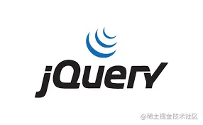
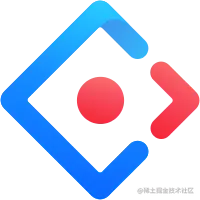
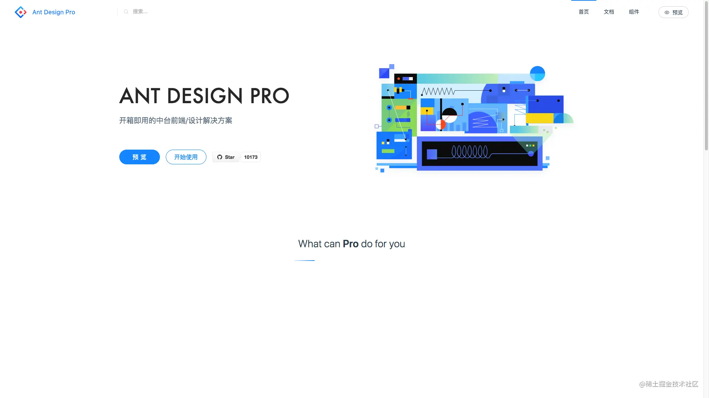

# 以史为鉴：前端开发的四个时代

在前端整体进入组件化开发时代后，手写各种 UI 组件成为了许多前端工程师入门后的第一课。而对于工作了几年的资深工程师来说，手写组件已经不再是问题，但对于如何帮助团队提升整体开发效率以及个人接下来的技术成长方向却开始变得非常迷茫。

> 以铜为鉴，可以正衣冠；以人为鉴，可以明得失；以史为鉴，可以知兴替。

想要摆脱对未来的迷茫，最好的方法就是向后看，看一路走来前端开发是如何从服务端主导的静态网站一步步发展到现在由客户端主导的单页应用。只有了解了过去前端分别在不同的阶段解决了怎样的问题，才能更好地看清楚未来要向哪里去。

## 四个时代

### 黑铁时代 - 插件化

在前端界大名鼎鼎的 [jQuery][] 诞生于 2006 年，那时还没有 [Google Chrome][]，微软刚刚发布了直到现在还在令许多前端开发者头疼的 [IE 7][]。

jQuery 作为试图抹平不同浏览器之间 API 差异的先锋进入了人们的视野，并在之后很长的一段时间内占据了 Web 开发领域统治性的地位。那时开发一个网站并不需要先配置一个复杂的脚手架，只需要新建一个 HTML 文件即可，开发者们也远未意识到未来前端开发究竟会复杂到什么样的程度，以页面为单位的开发方式在当时看起来并没有什么问题。

**那时还没有人提出组件的概念，基于 jQuery 的 UI 组件都被称为 jQuery 插件（plugin），代表着在任何浏览器环境下都可以即插即用。**

项目的开发速度完全取决于页面数量的多少及布局的复杂程度，所有的变量都挂载在全局之下，引用的各个插件之间相互独立，这样的开发方式似乎并没有给开发者们留下多少可以优化的空间。

### 青铜时代 - 模块化

随着 [Ajax][] 等技术的普及，客户端 JavaScript 的代码量也越来越大，开发者们开始无法忍受全局变量带来的命名冲突，各个插件之间虽然相互独立但多个插件之间的依赖关系却也变得越来越复杂。这时前端开发对于模块化的需求变得非常强烈，于是便涌现出了 [RequireJS][] 和 [Sea.js][] 两大专注于解决前端模块化问题的类库，以 Sea.js 发布 1.0 正式版的时间为参考，那时是 2011 年 7 月。

**解决了命名空间和文件依赖的问题，前端终于可以轻装上阵。配合着日趋成熟的各种 UI 插件库，这时前端项目的开发速度有了第一次质的提升。**

摆脱了全局变量的限制，越来越多的前端插件被沉淀了下来。页面数量虽然依然被作为衡量开发量的一个重要指标，但在开发流程中各个模块之间已经开始了协作，开发一个新页面的工作量也不再完全等于页面本身。与此同时，[npm][] 的出现也让这些沉淀下来的前端插件有了栖身之处，却也为今天前端类库**小而分散**的现状埋下了隐患。

### 白银时代 - 组件化

在前端模块化进行得如火如荼的同时，由谷歌开发的 [AngularJS][] 也于 2010 年 10 月发布，这是第一次 JavaScript 框架试图接管所有的 DOM 操作。不过由于在当时过于超前的设计和后续断崖式的升级，AngularJS 一直没能打破 jQuery 在前端开发界的统治地位，直到 2013 年 Facebook 发布 [React][]。

专注于 View 层的 React 虽然提出了 [JSX][] 这样不符合传统前端开发习惯的新概念，但基于[虚拟 DOM][dom] 的重绘效率确实要比 AngularJS 的[脏检查][link 1]高出一个数量级。这着实吸引了许多前端开发者的目光，也让前端开发真正进入了组件化时代。

**摆脱了 DOM 的限制，组件与组件之间的数据传递第一次变得如此轻松，这让开发功能强大的大型复杂组件及沉淀能够覆盖大部分底层需求的 UI 组件库变为了可能。**

过去的几年中，以 [ant-design][]、[material-ui][] 等为代表的优秀的开源前端组件库如雨后春笋般冒了出来，MVVM 框架配合其生态内的组件库成为了现代前端开发的标配。与此同时，前端工程化的浪潮也汹涌袭来，以 [Babel][]、[webpack][] 和 [TypeScript][] 等为代表的 JavaScript 增强工具帮助 JavaScript 摆脱了脚本语言的定位，JavaScript 也开始成为编写大型工程项目的可选项。

但这时开发者们突然发现，以前只需要打开 [Notepad++][notepad] 就可以轻松写前端的日子不在了，开始一个前端项目变得异常复杂。在组件库的帮助下，虽然项目的复杂度被大幅降低了，但花在写代码上的时间却一点也没有减少，用组件拼出一个个页面的世界似乎并没有想象中那么美好。

### 黄金时代 - 专业化

时间来到 2017 年，作为前端组件库界标杆的 ant-design 先后发布了 [ant-design-mobile][] 及 [ant-design-pro][]，淘宝系也发布了[飞冰][link 2]（以下称为 ice）。

其中 ant-design-mobile 是一套专注于移动端混合应用开发的前端组件库，现在又推出了 React Native 的版本。曾经在前端开发界流行过一段时间响应式设计的风潮，即一套代码适配所有终端。但慢慢大家发现，一套代码支持所有终端终究只是一个美丽的梦想，移动端和桌面端之间页面尺寸及操作交互的巨大差异，导致二者都需要更专业的解决方案来应对。

ant-design-mobile 想要解决的是移动端的问题，而 ant-design-pro 想要解决的则是企业中后台管理系统搭建这样一个问题。这些被抽象出来后针对中后台系统优化的组件并不能够直接用于搭建前台项目，但牺牲了通用性所换来的专业性也代表着前端在向着细分领域的专业化解决方案靠拢。ice 与 ant-design-pro 类似，所不同的是 ice 还集成了项目的脚手架部分，致力于实现一套纯 GUI 的前端开发模式。

这里我们先按下这些垂直领域的解决方案是否能够解决相应的问题不表，但我们从这些事例中可以看出的趋势是清晰的：**区别于之前大力建设作为前端基础设施的组件库，前端的下一个方向就是要在这些基础设施之上同时向多个细分领域进军，如上面提到的移动端、企业中后台，又如富文本编辑、数据可视化等这些对于专业深度要求更高的领域。**

## 资深工程师的下一站

随着我们对未来的认知越来越清晰问题也随之而来：在这么多的细分领域中应该专攻哪一个呢？

对于这个问题我们很难给出一个确定的答案，因为每个人所擅长的领域都不尽相同。但有一点可以确定的是，对于资深工程师来说，除了抽象 UI 组件的能力，对业务组件的良好抽象也是一个非常值得去培养的能力。有人可能会提出异议：“我每天写的不就是业务组件？业务组件因为其本身复用价值比较低所以不值得去抽象难道不是前端开发界的共识吗？”

如果你也有着同样的困惑，那么你很可能走入了一个认知误区，即业务组件等同于商品详情页这样具体的需求。事实并不是这样，对业务的抽象代表的是页面的布局、应用的鉴权、产品的国际化等这些更高维度上的问题，只有解决好了这些问题，配合上基础组件库才可以真正做到保质保量地完成一个又一个前端项目，最终推动公司业务向前发展。

## 小结

在本节中我们一起回顾了从 2006 年至今 12 年来前端开发所走过的四个阶段，即**插件化**、**模块化**、**组件化**和**专业化**。在前端专业化的趋势逐渐清晰的今天，抛去跨领域、跨学科的新技术不谈，希望继续在前端领域深耕的资深工程师培养自己对于复杂业务的抽象能力就变得尤为重要。

我们将以**企业管理系统**为切入点，一起来探讨如何从布局、权限、菜单、通知、多语言等五个方面提升自己抽象复杂业务逻辑的能力。而在这之前，让我们先一起来看一下企业管理系统的前世今生，以及前端组件库为什么不是解决企业管理系统这样一个历史难题的[银弹][link 3]。

[202202221058309.png]: https://s.poetries.work/images/202202221058309.png
[jquery]: https://jquery.com/
[google chrome]: https://en.wikipedia.org/wiki/Google_Chrome
[ie 7]: https://en.wikipedia.org/wiki/Internet_Explorer_7
[202202221058475.png]: https://s.poetries.work/images/202202221058475.png
[ajax]: https://en.wikipedia.org/wiki/Ajax_%28programming%29
[requirejs]: http://requirejs.org/
[sea.js]: https://github.com/seajs/seajs
[npm]: https://en.wikipedia.org/wiki/Npm_%28software%29
[202202221058740.png]: https://s.poetries.work/images/202202221058740.png
[angularjs]: https://angularjs.org/
[react]: https://reactjs.org/
[jsx]: https://reactjs.org/docs/introducing-jsx.html
[dom]: https://reactjs.org/docs/faq-internals.html
[link 1]: https://docs.angularjs.org/guide/scope#scope-life-cycle
[ant-design]: https://ant.design/
[material-ui]: https://material-ui.com/
[babel]: https://babeljs.io/
[webpack]: https://webpack.js.org/
[typescript]: https://www.typescriptlang.org/
[notepad]: https://notepad-plus-plus.org/
[202202221059155.png]: https://s.poetries.work/images/202202221059155.png
[ant-design-mobile]: https://mobile.ant.design/
[ant-design-pro]: https://pro.ant.design/
[link 2]: https://alibaba.github.io/ice/
[link 3]: https://zh.wikipedia.org/wiki/%E6%B2%A1%E6%9C%89%E9%93%B6%E5%BC%B9
