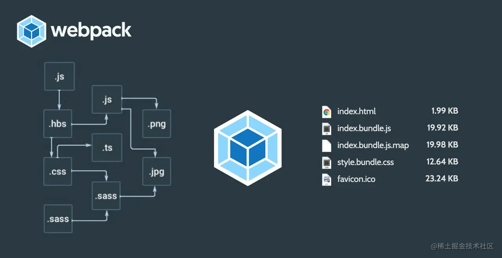
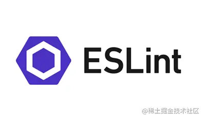
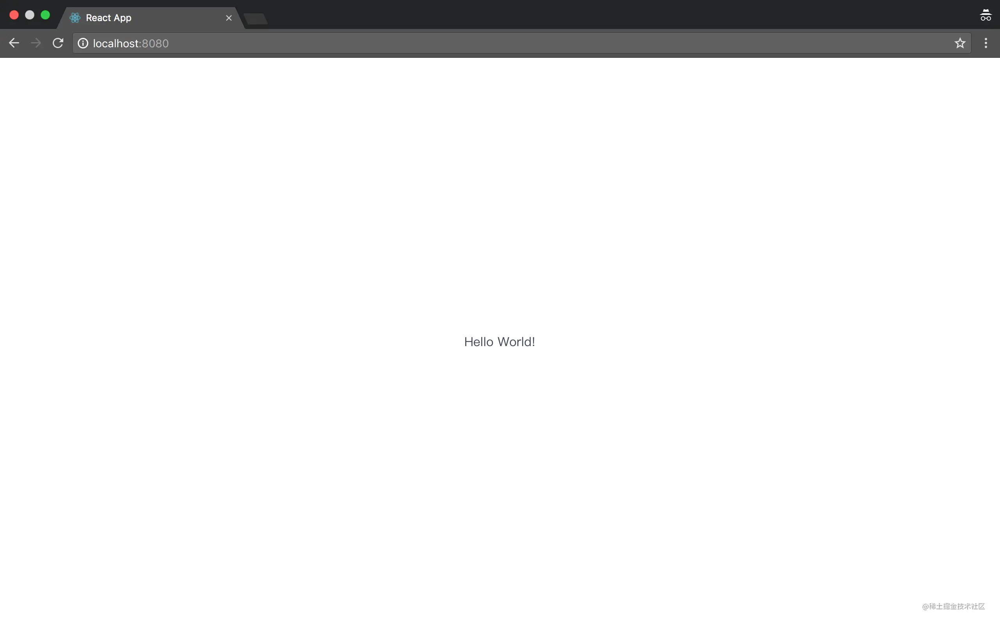
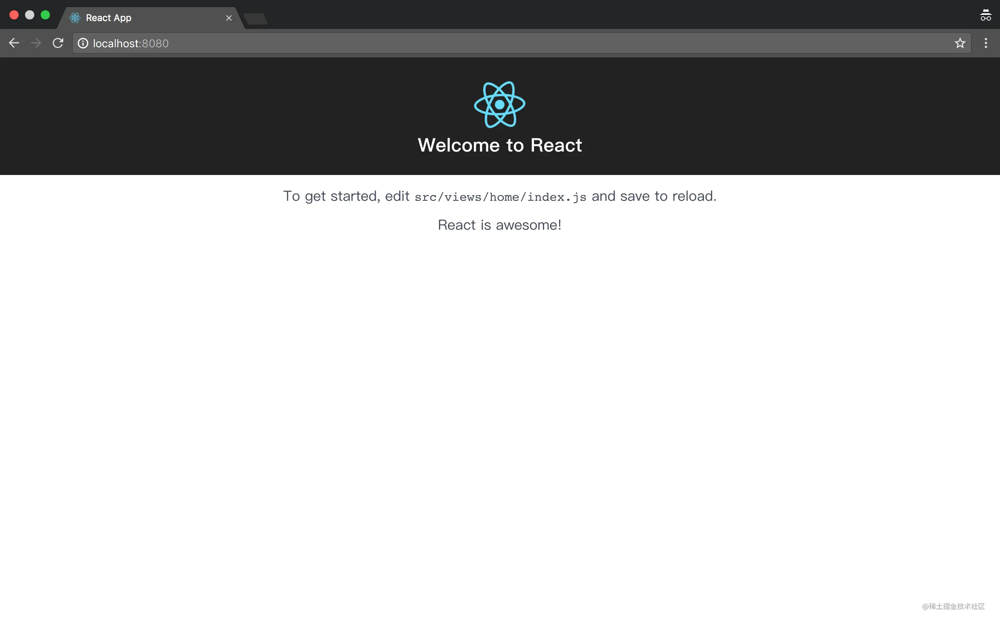

# 实战篇 02：项目脚手架

> 本节参考代码：  
> [react-boilerplate][]

经过了刀耕火种的插件化时代，伴随着越来越繁荣的 [npm][] 生态，近几年来前端开发的三大件 HTML、CSS 及 JavaScript 都发生了不同程度上的进化，这也让开发或选择一个合适的项目脚手架（boilerplate）成为了前端项目的第一个难点。在 React 生态中，虽然已经有了像 [`create-react-app`][create-react-app] 这样官方指定的脚手架项目，但为了深入理解一个前端脚手架所需要承担的责任与能够解决的问题，不妨让我们删繁就简一起来搭建一个只包含最少依赖的功能齐全的项目脚手架。

## HTML 部分

在 JavaScript 框架接管了所有 DOM 相关的操作与更新后，HTML 方面的工作量就大量地减少了，很多时候只需要为框架提供一个可以注入 DOM 元素的根节点即可。

    <!DOCTYPE html>
    <html>
      <head>
        <meta charset="utf-8">
      </head>
      <body>
        

        

      </body>
    </html>

为了让页面的缩放比例与当前用户设备的屏幕尺寸保持一致，我们可以在模板中添加 HTML5 新引入的 [`viewport`][viewport] 属性，这对于需要支持移动端的项目非常重要。

    <meta name="viewport" content="width=device-width, initial-scale=1.0">

接下来再在 HTML 中添加应用标题 `title`，这里需要注意的是，因为我们不希望采用硬编码的方式来处理应用标题，而是希望将应用标题作为 webpack 插件中的一个变量注入到 HTML 模板中，所以需要选择一个模板语言来增强普通 HTML 的功能。这里我们以 [EJS][] 为例讲解如何实现变量注入。

    <title><%= htmlWebpackPlugin.options.title %></title>

除了 `title` 部分，我们还需要将 webpack 编译完成后的 JavaScript 与 CSS 的文件路径也注入到 HTML 模板中。

    <% for (var chunk in htmlWebpackPlugin.files.css) { %>
      <link rel="preload" href="<%= htmlWebpackPlugin.files.css[chunk] %>" as="style">
    <% } %>
    <% for (var chunk in htmlWebpackPlugin.files.chunks) { %>
      <link rel="preload" href="<%= htmlWebpackPlugin.files.chunks[chunk].entry %>" as="script">
    <% } %>

除去变量注入外，EJS 等这类 HTML 模板语言还支持条件判断等编程语言的功能，如下面这段代码就实现了根据 webpack 配置来决定应用是否可以被搜索引擎检索。

    <% if (htmlWebpackPlugin.options.IS_SEO_ENABLED) { %>
    <meta name="robots" content="index, follow">
    <% } else { %>
    <meta name="robots" content="noindex, nofollow">
    <% } %>

根据项目的需要我们还可以在模板中定义应用 `favicon` 等传统 HTML 支持的属性，这里不再赘述。

## CSS 部分

相较于 HTML，CSS 作为前端应用的另一核心组成部分受到 JavaScript 发展的冲击要小得多。以 [Sass][]、[Less][] 为代表的 CSS 预处理工具极大地增强了 CSS 的功能，也让 CSS 保持了自己原先独立的地位。

但为了打通基于 webpack 的整体项目编译流程，我们也需要在 webpack 中合理地配置 CSS 的编译方式，使得 Sass（Less）、CSS 及 webpack 可以无缝衔接。

### 区别对待项目中的 CSS 与 node_modules 中的 CSS

#### 项目中的 CSS：

    {
      test: /\.scss$/,
      exclude: /node_modules/,
      use: IS_PROD ? [
        MiniCssExtractPlugin.loader,
        {
          loader: 'css-loader',
          options: { minimize: true },
        },
        {
          loader: 'postcss-loader',
          options: {
            plugins: () => [autoprefixer({ browsers: 'last 5 versions' })],
            sourceMap: true,
          },
        },
        {
          loader: 'sass-loader',
          options: {
            includePaths: [
              SOURCE_DIR,
            ],
          },
        },
      ] : [
        {
          loader: 'style-loader',
          options: { singleton: true },
        },
        'css-loader',
        {
          loader: 'postcss-loader',
          options: {
            plugins: () => [autoprefixer({ browsers: 'last 5 versions' })],
            sourceMap: true,
          },
        },
        {
          loader: 'sass-loader',
          options: {
            includePaths: [
              SOURCE_DIR,
            ],
          },
        },
      ],
    }

这里需要注意的有两点，一是 `sass-loader` 的 `includePaths` 设置为 `src/` 目录，这是为了项目中的 scss 文件可以方便地使用绝对路径相互引用，而不需要使用较为繁琐且不利用重构的相对路径。二是开发时使用 `style-loader` 而不是 `css-loader` 来加载 CSS，这是为了结合 `webpack-dev-server` 的热更新（hot reload）功能，在本地开发时将所有的 CSS 都直接内嵌至 HTML 中以加快热更新的速度。

#### node_modules 中的 CSS：

    {
      test: /\.css$/,
      include: /node_modules/,
      use: [
        MiniCssExtractPlugin.loader,
        'css-loader',
        {
          loader: 'postcss-loader',
          options: {
            plugins: () => [autoprefixer({ browsers: 'last 5 versions' })],
            sourceMap: true,
          },
        },
      ],
    }

在项目开发的过程中，我们很有可能还需要引入一些包含 CSS 的第三方库。这里需要注意的是，为了避免有些第三方库提供的 CSS 没有做浏览器兼容性处理，我们在加载 `node_moduels` 中的 CSS 之前还要使用 `postcss-loader` 再统一处理一遍，以确保所有进入生产环境的 CSS 都经过了相应的浏览器兼容性处理。

### 样式变量与 mixin

正如前文中所提到的，CSS 作为独立的一部分一直以来受到前端工程化的影响都比较小。但与此同时许多开发者一味地追求开发效率，很多时候忽略了应该以一门编程语言的态度去对待 CSS。

最常见的例子就是对于 CSS 中颜色的处理，许多开发者都是直接复制设计稿中的十六进制代码，丝毫没有考虑到不同颜色在整体项目中的复用性与统一性。对于 mixin 的使用也是一样，例如卡片阴影等这些需要多个 CSS 属性组合的样式，很多时候也都是采取复制粘贴 CSS 代码的方式解决。

这些都是我们在实际开发中应该尽量去避免出现的问题。在样式表的根目录 `styles/` 文件夹中我们完全可以将这些通用的变量与 mixin 提前定义好：

    // variables.scss
    $grey-1: #ffffff !default;
    $grey-2: #fafafa !default;
    $grey-3: #f5f5f5 !default;
    $grey-4: #e8e8e8 !default;
    $grey-5: #d9d9d9 !default;
    $grey-6: #bfbfbf !default;
    $grey-7: #8c8c8c !default;
    $grey-8: #595959 !default;
    $grey-9: #262626 !default;
    $grey-10: #000000 !default;

    $blue-1: #e6f7ff !default;
    $blue-2: #bae7ff !default;
    $blue-3: #91d5ff !default;
    $blue-4: #69c0ff !default;
    $blue-5: #40a9ff !default;
    $blue-6: #1890ff !default;
    $blue-7: #096dd9 !default;
    $blue-8: #0050b3 !default;
    $blue-9: #003a8c !default;
    $blue-10: #002766 !default;

    $red-1: #fff1f0 !default;
    $red-2: #ffccc7 !default;
    $red-3: #ffa39e !default;
    $red-4: #ff7875 !default;
    $red-5: #ff4d4f !default;
    $red-6: #f5222d !default;
    $red-7: #cf1322 !default;
    $red-8: #a8071a !default;
    $red-9: #820014 !default;
    $red-10: #5c0011 !default;

    // mixins.scss
    @mixin text-ellipsis() {
      overflow: hidden;
      white-space: nowrap;
      text-overflow: ellipsis;
    }

并在编写具体的页面样式时坚持不使用任何硬编码的值来保证项目样式的统一性，为后续维护中的样式变更打下良好的基础。

## JavaScript 部分

JavaScript 作为近几年来变化最大的一部分，总结下来的改变主要集中在三个方面：一是需要将使用 ES2015、ES2016、ES2017 特性的 JavaScript 代码编译至大多数浏览器普遍支持的 ES5（对应工具为 Babel），二是需要将编译好的 JavaScript、CSS 及 HTML 整合起来，也就是我们常说的打包（对应工具为 webpack），三是需要对代码风格及规范进行检查（对应工具为 ESLint）。

### Babel 配置

`.babelrc` 作为 Babel 的配置文件，最核心的两部分就是 `presets` 以及 `plugins`。

`presets` 代表了 Babel 配置的核心部分。其中 `babel-preset-env` 整合了 `es2015`、`es2016`、`es2017` 三个原先独立的 `preset`，开发者只需要引入 `env` 这样一个 `preset` 就可以安全地使用上述三个版本中包含的 JavaScript 新特性。

`plugins` 更像是对 `presets` 的一个补充，供开发者们去自定义一些 `presets` 之外的功能，其中比较常用的如对象扩展符 `...` 就需要引入 `babel-plugin-transform-object-rest-spread` 开启。除了 JavaScript 部分的扩展外，Babel 对 React 也有着相应的支持，如将 JSX 编译为 React 原生的 `React.createElement` 方法以及为 React 组件添加 `displayName` 属性等。

Babel 作为一个基于插件系统打造的 JavaScript 编译工具，其可定制度是非常高的，开发者们完全可以根据自己的使用需要与编码习惯去选择或开发合适的插件以达到提升开发效率的效果。

### webpack 配置

webpack 作为现在最流行的前端打包工具，其一路走来的发展史也是许多前端开发者的血泪史。webpack 1 到 webpack 2 时破坏式的升级导致了许多前端项目直到今天都仍然停留在 webpack 1，而 webpack 3 到 webpack 4 时彻底重构了的内部插件系统又导致了第二次断崖式升级。但值得庆幸的是，webpack 在最新的 4+ 版本中终于承认了「约定大于配置」并大幅减少了在功能与插件方面配置代码的数量。

webpack 配置的核心一是源代码的入口（entry）与打包后代码的出口（output），二是不同资源的加载器（loader），三是插件，常用的如处理 CSS 的 `mini-css-extract-plugin`，处理 HTML 的 `html-webpack-plugin` 等。具体实用的 webpack 配置大家可以参考示例项目 [`react-boilerplate`][react-boilerplate] 中的 [`webpack.config.js`][webpack.config.js] 部分。

### ESLint 配置

相较于 Babel 与 webpack，ESLint 更像是一个可选项，因为它并不会直接影响最终编译完成的代码，而是在编写阶段对开发者的编码风格进行约束，帮助开发者写出更好的 JavaScript 代码。

写代码是一门手艺，对于手艺人来说从资深手艺人那里学来的经验就是自己成长路上最宝贵的财富。ESLint 让你可以不需要师从哪一位或哪几位优秀的程序员，只需要遵守他们定下的代码规范就可以写出和他们一样优秀的代码。现在市面上最流行的 ESLint 配置就是由 Airbnb 所提供的，我们只需要在 `.eslintrc` 中配置 `extends` 为 `airbnb` 就可以开启 Airbnb 的 JavaScript 编写规范。当然，为了满足自定义的需求，在 `.eslintrc` 的 `rules` 中我们也可以独立地开启或关闭任意一条代码检查规则。

## 文件目录

介绍完了 HTML、CSS、JavaScript 三个部分后，项目脚手架已经初见雏形，让我们先来写一个 Hello World。

脚手架除了能够帮助团队一次性地解决上述提到的这些技术栈配置问题外，还有一个重要的责任就是梳理项目的标准目录组织结构。从通用的角度来讲，一般一个完整的前端项目都至少需要包含以下九个部分：

1.  `layouts/`: 存放布局级别的组件
2.  `views/`: 存放页面级别的组件
3.  `components/`: 存放业务级别的 UI 组件
4.  `hocs/`: 存放业务级别的逻辑组件（看情况可与 `components/` 合并，但建议分开）
5.  `app/`: 存放应用级别的配置信息，如菜单、路由等，以及应用初始化的相关代码，如初始化 redux store 等
6.  `utils/`: 存放通用的功能性函数，如数据聚合、处理等
7.  `styles/`: 存放全局的 CSS 样式、变量、mixins 等
8.  `assets/`: 存放静态资源，如图标、图片等
9.  `i18n/`: 存放应用国际化需要的多语言文件

在将这些文件夹都添加到我们的脚手架后，让我们来写一个复杂点的页面。

最后关于 redux 部分的设置，根据业务需要可能会有所区别，大家可以参考以下的几个条件渐进式地选择数据流工具。

#### redux

- 我需要一个全局数据源且其他组件可以直接获取/改变全局数据源中的数据
- 我需要全程跟踪/管理 action 的分发过程/顺序

#### redux-thunk

- 我需要一个全局数据源且其他组件可以直接获取/改变全局数据源中的数据
- 我需要全程跟踪/管理 action 的分发过程/顺序
- **我需要组件对同步或异步的 action 无感，调用异步 action 时不需要显式地传入 dispatch**

#### redux-saga

- 我需要一个全局数据源且其他组件可以直接获取/改变全局数据源中的数据
- 我需要全程跟踪/管理 action 的分发过程/顺序
- 我需要组件对同步或异步的 action 无感，调用异步 action 时不需要显式地传入 dispatch
- **我需要声明式地来表述复杂异步数据流（如长流程表单、请求失败后重试等），命令式的 thunk 对于复杂异步数据流的表现力有限**

## 脚手架的维护

虽然在设计脚手架时的一大原则就是尽可能少地引入第三方依赖，但因为 React 并不是一个大而全的框架，所以在搭建脚手架时还是难免需要引入 redux、react-router、babel、webpack 等这些必需的第三方依赖。而在后续维护中，根据业务场景的不同我们可以有以下两种不同的维护方式。

一是稳定压倒一切，即不更新依赖，使用搭建完成的脚手架直到不能够满足业务的需要时再推倒重来。二是及时更新，即对脚手架所有的第三方依赖进行定期（半个月或一个月）的升级，保证脚手架所使用的第三方依赖永远都是最新的稳定版本。对于业务场景并不复杂的企业来说，稳定压倒一切是提升生产力的不二法门。而对于大厂或者说业务场景较为复杂的企业来说，及时更新却是必须的。做好技术基础设施建设是解决未来不可预见的技术难题的基础，技术项目的落后很多时候是一步落后，步步落后，在遇到具体问题时再去寻求完美的解决方案是不现实的。

## 小结

在本节中我们从 HTML、CSS、JavaScript 三个方面分析了近年来前端开发界发生的变化以及如何使用最新的技术栈搭建出一个扩展性良好的自研脚手架。

在下一节中我们将正式进入企业管理系统搭建的讨论，从页面的基础布局开始一步步剖析企业管理系统中的痛点与解决方案。

如果你想参与到文章中内容的讨论，欢迎在下面的评论区留言，期待与大家的交流。

[react-boilerplate]: https://github.com/AlanWei/react-boilerplate
[npm]: https://www.npmjs.com/
[create-react-app]: https://github.com/facebook/create-react-app
[viewport]: https://www.w3schools.com/css/css_rwd_viewport.asp
[ejs]: http://ejs.co/
[sass]: https://sass-lang.com/
[less]: http://lesscss.org/
[202202221104553.png]: https://s.poetries.work/images/202202221104553.png
[202202221104919.png]: https://s.poetries.work/images/202202221104919.png
[webpack.config.js]: https://github.com/AlanWei/react-boilerplate/blob/master/webpack.config.js
[202202221104294.png]: https://s.poetries.work/images/202202221104294.png
[202202221104246.png]: https://s.poetries.work/images/202202221104246.png
[202202221104403.png]: https://s.poetries.work/images/202202221104403.png
