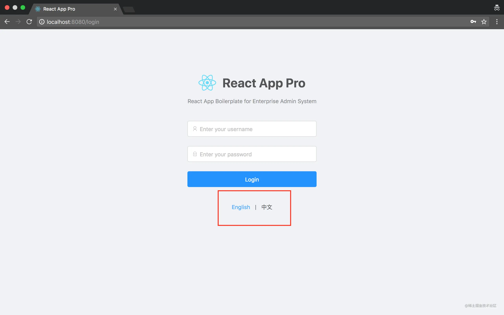
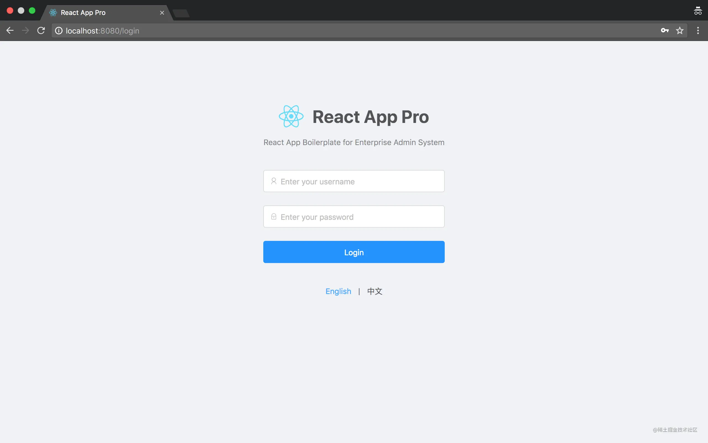
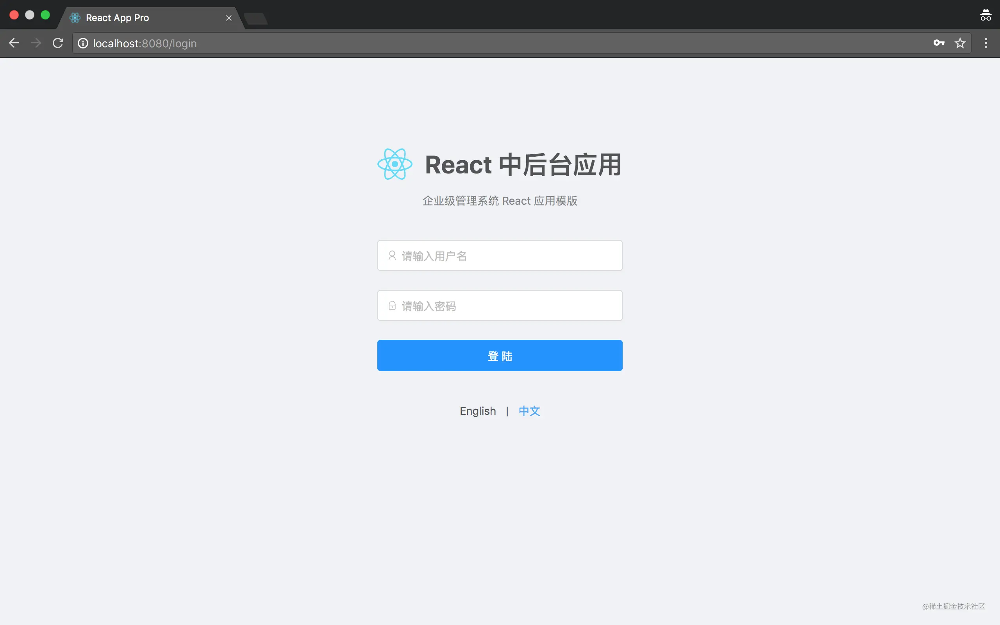

# 实战篇 07：多语言支持

> 本节参考代码：
>
> 1.  [react-intl-context][]
> 2.  [react-boilerplate-pro/src/app/init/router.js][react-boilerplate-pro_src_app_init_router.js]
> 3.  [react-boilerplate-pro/src/views/login/index.js][react-boilerplate-pro_src_views_login_index.js]

随着国内市场的逐渐饱和越来越多的中国公司开始将目光投向了国际市场，其中竞争最为激烈的莫过于东南亚。拥有 6.5 亿人口的东南亚，整个地区的 GDP 总和高达 2.6 万亿美元，作为一个互联网行业刚刚进入快速发展阶段的市场其未来的想象空间十分巨大。但与此同时，在这块面积并不算庞大的土地上却分布着大大小小 11 个国家，说着印尼语、马来语、英语、泰语、越南语、中文等几十种不同的语言。

互联网作为一个规模效应非常明显的行业天然就带有扩张的属性，但许多中国公司在出海后面临的第一个挑战就是产品不支持多种语言无法直接进入相应国家的市场。又因为现有系统在架构初期并没有将多语言支持的需求考虑进去，所以临时增加这个功能就变成了一件牵一发而动全身的事情，最后往往无功而返只得重新再做一个新的国际版，也就在这样来来回回的反复中白白浪费掉了许多宝贵的竞争机会。在吃过了这样的亏后，许多公司现在在开始一个新项目时就非常重视产品国际化的需求，希望能在架构初期就打下坚实的基础以至于在需要时可以轻松地产出多个不同语言的版本。

## 语言文件

语言文件，顾名思义就是一套对应不同语言翻译的键值对匹配。如果我们要把多语言支持的工作放在前端来做的话，最简单的一个方法就是以 JSON 的格式存储这些语言文件以方便应用在运行时读取相应的翻译值。

`locale.json`

    {
      "en-us": {
        "appName": "React App Pro",
        "siderMenu_dashboard": "Dashboard",
        "siderMenu_analysis": "Analysis",
        ...
      },
      "zh-cn": {
        "appName": "React 中后台应用",
        "siderMenu_dashboard": "仪表盘",
        "siderMenu_analysis": "分析页",
        ...
      }
    }

在存储方面对于追求开发效率的团队来说，将语言文件直接 commit 到项目的代码仓库是一种可行的做法。但如果有条件的话还是应该将下载语言文件这一步放在项目[持续集成][link 1]的流程中，每一次构建项目时从存放语言文件的远端服务器拉取最新的版本，以保证发布到生产环境中的语言文件永远是最新的。

## 多语言版本切换 vs. 多语言版本构建

在讨论具体的产品国际化方案前，首先要明确的一点是，多语言支持这样一个需求根据具体的产品形态可以有两种不同的解决方案。

一是**多语言版本切换**，也就是在同一个应用中支持用户切换产品的不同语言版本。

二是**多语言版本构建**，即将同一个应用打包成不同语言的版本，分别发布到不同的生产环境中，但在应用内部不支持多语言切换。

对于多语言版本切换来说，因为在运行时可能会用到所有不同的语言，所以建议将所有语言的翻译都存在同一个 JSON 文件中，这里我们暂且将它命名为 `locale.json`，并将不同语言的区域码设置为第一层的 key 值，第二层则为具体页面占位符的 key 值，命名时建议采取`页面_模块_值（login_loginPanel_usernameplaceholder）`的方式扁平化地存储这些值以加快查询时的速度。如果有跨平台需求的话，也可以在页面前面加上平台，如 `web_login_loginPanel_usernamePlaceholder`、`mobileWeb_login_loginPanel_usernamePlaceholder`，便于统一管理不同平台之间语言文件的 key 值。

对于多语言版本构建来说就没有必要把所有的语言翻译都存在一个文件中了，可以将不同的翻译分别存在各自的语言文件中。

`en-us.json`

    {
      "appName": "React App Pro",
      "siderMenu_dashboard": "Dashboard",
      "siderMenu_analysis": "Analysis",
      ...
    }

`zh-cn.json`

    {
      "appName": "React 中后台应用",
      "siderMenu_dashboard": "仪表盘",
      "siderMenu_analysis": "分析页",
      ...
    }

### 在应用构建过程中加载语言文件

准备好了语言文件，下一步就是将它集成到由 webpack 主导的应用构建过程中。

首先将语言文件 import 到 `webpack.config.js` 中，然后再通过 webpack 本身提供的 `webpack.DefinePlugin` 将它注入为应用的一个全局常量。

    const localeMessages = require('./src/i18n/locale.json');

    new webpack.DefinePlugin({
      'process.env.BUILD_LOCALE_MESSAGES': JSON.stringify(localeMessages),
    })

在这里，上面提到的多语言版本切换以及多语言版本构建的区别就体现出来了。对于多语言版本切换来说，像上面这样直接将唯一的语言文件注入为应用常量即可。但如果我们想要构建多个不同语言版本应用的话，又该怎么做呢？

为了解决这一问题，让我们再引入一个应用构建时的配置文件，称为 `buildConfig.js`。

    module.exports = {
      'PROD-US': {
        locale: 'en-us',
      },
      'PROD-CN': {
        locale: 'zh-cn',
      },
      localhost: {
        locale: 'zh-cn',
      },
    };

并在 `package.json` 中分别配置不同语言版本的构建命令。

    "scripts": {
      "build:PROD-US": "cross-env NODE_ENV=production BUILD_DOMAIN=PROD-US webpack -p --progress --colors",
      "build:PROD-CN": "cross-env NODE_ENV=production BUILD_DOMAIN=PROD-CN webpack -p --progress --colors",
    }

这样就可以在 webpack 的配置中读取到当前要构建的目标版本语言，然后再据此去匹配相应的语言文件，如 `en-us.json`。

    const BUILD_DOMAIN = process.env.BUILD_DOMAIN || 'localhost';
    const config = buildConfig[BUILD_DOMAIN];
    const localeMessages = require(`./src/i18n/${config.locale}.json`);

    new webpack.DefinePlugin({
      'process.env.BUILD_LOCALE_MESSAGES': JSON.stringify(localeMessages),
    })

### 在应用初始化时读取语言文件

在成功通过 webpack 将语言文件注入为全局常量后，我们就可以在应用中读取到构建时传入的语言文件了。这里为了方便其他文件引用构建配置及语言文件，我们可以提供一个统一的接口。

`src/app/config/buildConfig.js`

    const buildConfig = process.env.BUILD_CONFIG;
    const messages = process.env.BUILD_LOCALE_MESSAGES;

    export {
      messages,
      buildConfig,
    };

`src/app/init/router.js`

    import { messages, buildConfig } from '../config/buildConfig';

    const { locale } = buildConfig;

    const Router = props => (
      <ConnectedRouter history={props.history}>
        <MultiIntlProvider
          defaultLocale={locale}
          messageMap={messages}
        >
          ...
        </MultiIntlProvider>
      </ConnectedRouter>
    );

### 在页面中注入翻译值

React 在 16.3 版本中引入了新的声明式、可透传 props 的 [Context API][]。受益于这次改动 React 开发者们终于拥有了一个官方提供的安全稳定的 global store，子组件跨层级获取父组件数据及后续的更新都不再是问题。

语言文件注入恰巧就是一个非常适合使用 Context API 来解决的用例，因为：第一，语言文件需要能够跨层级传递到每一个组件中因为每一个组件中都可能存在需要翻译的部分；第二，语言文件并不会经常更新。这里的不经常更新指的是在应用运行时而不是开发过程中不经常更新，于是也就避免了 Context 中的数据变化引起应用整体重绘所带来的性能问题。

让我们先来创建一个存放语言文件的 Context。

    import React from 'react';

    const { Provider, Consumer } = React.createContext({
      locale: '',
      messages: {},
      formatMessage: () => {},
    });

    export {
      Provider,
      Consumer,
    };

再将通过 props 传入的国家码、语言文件及读取语言文件中某一个 key 值的函数注入到 Context 的 `value` 对象中。

    import { Provider } from './IntlContext';

    class IntlProvider extends Component {
      constructor(props) {
        super(props);

        this.state = {
          value: {
            locale: props.locale,
            messages: props.messages,
            formatMessage: this.formatMessage,
          },
        };
      }

      formatMessage = (config) => {
        const { id } = config;
        const message = this.state.value.messages[id];

        if (message === undefined) {
          console.warn(`[react-intl-context]: Message key ${id} is undefined. Fallback to empty string.`);
          return '';
        }

        return message;
      }

      render() {
        return (
          <Provider value={this.state.value}>
            {this.props.children}
          </Provider>
        );
      }
    }

然后再写一个高阶组件作为 Context 的 Consumer。

    import React from 'react';
    import { Consumer } from './IntlContext';

    const injectIntl = (WrappedComponent) => {
      const InjectIntl = props => (
        <Consumer>
          {value => <WrappedComponent {...props} intl={value} />}
        </Consumer>
      );

      return InjectIntl;
    };

    export default injectIntl;

最后我们只需要将页面组件包裹在 `injectIntl` 这个高阶组件中，页面组件就可以多接收到一个名为 `intl` 的 props，直接调用 `this.props.intl.formatMessage` 并传入相应的占位符 key 值即可读取到语言文件中的相应翻译。

    import { injectIntl } from 'react-intl-context';

    class OutletDetail extends Component {
      render() {
        const { intl } = this.props;

        return (
          

            <Button>
              {intl.formatMessage({ id: 'outletDetail_showNotification' })}
            </Button>
          

        );
      }
    }

    export default injectIntl(OutletDetail);

在读取语言文件 key 值的方法上，多语言版本切换与多语言版本构建之间也有着细微的差别，具体的处理方法可以参考 [react-intl-context][] 中的 [MultiIntlProvider][] 和 [IntlProvider][]。

来看一下最终的效果。

英文：

中文：

## 组合式开发：多语言支持

在处理多语言支持这样一个需求时，我们再次印证了组合式开发其实是一个**赋能**的过程，即在增加了某一层或某一个模块后，实际上为其下游使用者赋予了某种没有副作用的能力。如多语言支持中的 `formatMessage` 方法，在页面有国际化的需求时可以随时调用它来获取翻译值，而在页面没有国际化的需求时又可以安全地忽略它。甚至在抽掉 `IntlContext` 后其下属的页面层虽然失去了获取翻译的能力，却并不会影响到页面层原先拥有的其他能力。

这也就是组合式开发思想的精髓所在，它不需要外部为了它去进行复杂的适配而是通过自身向外部赋能。如果应用中的每一个模块都可以达到可组合、可插拔的程度，那么很多时候我们解决一个问题的方式就会从增加一个新模块变为灵活地组合已有模块，这将大大减少所需要的开发时间并降低 bug 出现的几率。

## 小结

在本节中我们剖析了多语言版本切换及多语言版本构建之间的相同与不同，为搭建一个支持多种语言的前端应用打下了良好的基础。

如果你想参与到文章中内容的讨论，欢迎在下面的评论区留言，期待与大家的交流。

[react-intl-context]: https://github.com/AlanWei/react-intl-context
[react-boilerplate-pro_src_app_init_router.js]: https://github.com/AlanWei/react-boilerplate-pro/blob/master/src/app/init/router.js
[react-boilerplate-pro_src_views_login_index.js]: https://github.com/AlanWei/react-boilerplate-pro/blob/master/src/views/login/index.js
[202202221108228.png]: https://s.poetries.work/images/202202221108228.png
[link 1]: https://baike.baidu.com/item/%E6%8C%81%E7%BB%AD%E9%9B%86%E6%88%90
[202202221108189.png]: https://s.poetries.work/images/202202221108189.png
[context api]: https://github.com/facebook/react/pull/11818
[multiintlprovider]: https://github.com/AlanWei/react-intl-context/blob/master/src/MultiIntlProvider.jsx
[intlprovider]: https://github.com/AlanWei/react-intl-context/blob/master/src/IntlProvider.jsx
[202202221108684.png]: https://s.poetries.work/images/202202221108684.png
[202202221109218.png]: https://s.poetries.work/images/202202221109218.png
