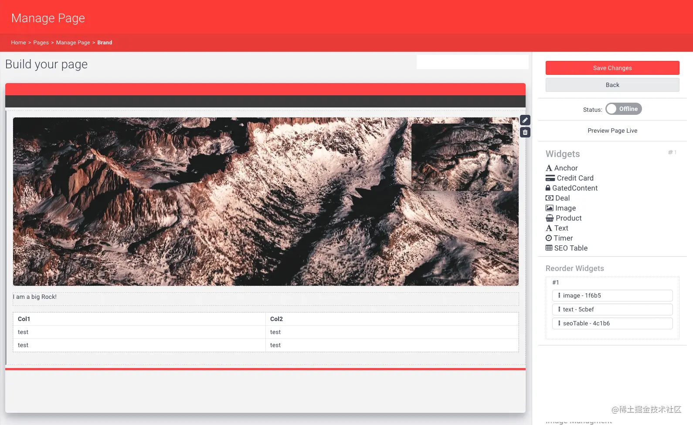
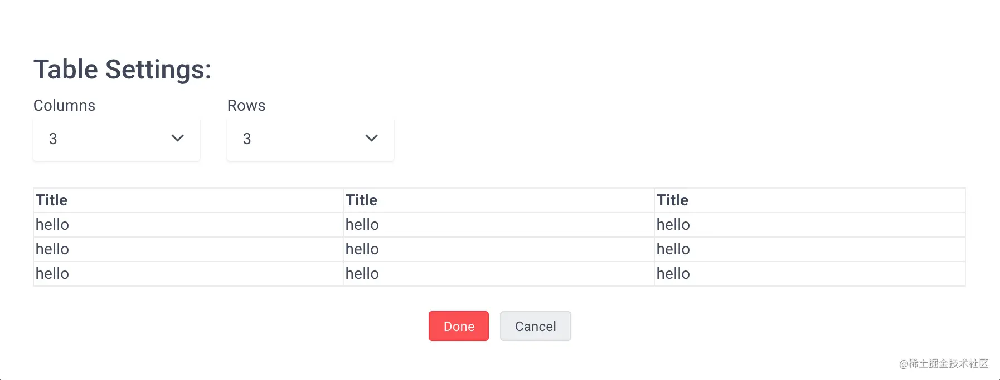

在人们的传统印象中，前端一直都是**很薄**的一层，向上不能影响后端数据，向下不能改变产品设计，只是相当于数据与界面之间的一个连接层，单独拿出来后就将失去其大部分的价值。但随着单页应用的普及，越来越多的重型前端应用被开发了出来并逐渐成为了人们常用的生产力工具中重要的组成部分。

这其中最经典的一个应用莫过于「可视化页面搭建工具」。

对于任何一家有运营需求的公司，「可视化页面搭建工具」都是一个刚需，我们很难想象有哪家公司的前端工程师每天的工作就是做生命周期只有几天甚至几小时的活动页。所以一直以来「可视化页面搭建工具」在前端开发界都不是一个新鲜的议题。从 20 年前的 [Dreamweaver][] 开始，一直到最近淘宝推出的 [飞冰（ice）][ice]，其本质上的思路都是类似的，即基于组件的模块化页面搭建。

## 三个阶段

在讨论具体的页面搭建工具之前，我们首先要明确一个问题，那就是谁是页面搭建工具的目标用户以及页面搭建工具能够帮助这些目标用户解决什么问题？

结合目前市面上已经推出的产品，可视化页面搭建工具的目标用户大致可以分为两类：一类是非技术的运营（产品）人员，主要使用场景为更新较为频繁的促销页、活动页等；另一类是非前端开发的技术人员，主要使用场景为简单的内部管理系统搭建。而根据不同的使用场景及需求，页面搭建工具最终交付的成品也不尽相同。

### 静态页面

常见的可视化页面搭建工具一般都会包含**页面预览区**、**组件选择区**及**布局调整区**（如调整组件顺序等）等三个部分。在从组件选择区选择了某几个组件后，每个被选用的组件还会有各自的属性编辑界面，一般为弹窗的形式，如下图所示的表格组件编辑界面。

最终的产出就是一段描述当前页面布局与内容的 [DSL][]，通常以 JSON 的格式存储。

    {
      "pageId": 1,
      "pageUrl": "/11-11-promo/electronics",
      "pageTitle": "双十一大促 - 家电专场",
      "layout": "two-columns",
      "components": {
        "two-columns": {
          "firstCol": [{
            "componentName": "list",
            "componentProps": [{
              "title": "促销家电列表",
              "data": [{
                "name": "电视机"
              }, {
                "name": "洗衣机"
              }, {
                "name": "冰箱"
              }]
            }]
          }],
          "secondCol": [{
            "componentName": "list",
            "componentProps": [{
              "title": "促销家电列表",
              "data": [{
                "name": "电视机"
              }, {
                "name": "洗衣机"
              }, {
                "name": "冰箱"
              }]
            }]
          }]
        }
      }
    }

与之相配合的在客户端代码中还需要有两个解析器。第一个解析器是路由解析器，即根据当前页面路径向后端发送请求拿到对应页面的 DSL 数据。第二个解析器是在拿到这段 DSL 数据后对 `components` 字段进行解析然后按照设置的布局逐个渲染配置好的组件。

这种架构非常适合处理内容展示页面的需求，从技术角度来讲也很适合做服务端渲染因为每个页面的渲染结果完全是数据驱动的，后端返回的服务端渲染结果就是最终前端展示的 HTML。但这种方案的局限性在于无法动态更新页面数据，因为数据和组件的配置是完全绑定的想要更新页面数据就需要去更改组件的配置。

### 动态页面

为了实现动态更新数据的需求，我们需要将组件的数据源与组件的配置解耦，也就是说我们需要将原先组件中配置好的数据替换为一个后端的数据接口，让后端的数据接口可以直接与组件进行对接。这样就实现了数据与配置之间的解耦，即不需要更新组件的配置就可以直接更新组件的展示数据。这样的灵活性对于促销页、活动页等数据变动频繁的业务场景来说是非常有帮助的。

    {
      "pageId": 1,
      "pageUrl": "/11-11-promo/electronics",
      "pageTitle": "双十一大促 - 家电专场",
      "layout": "two-columns",
      "components": {
        "two-columns": {
          "firstCol": [{
            "componentName": "list",
            "componentApi": "/api/11-11-promo/electronics/list",
            "componentProps": [{
              "title": "促销家电列表"
            }]
          }],
          "secondCol": [{
            "componentName": "list",
            "componentApi": "/api/11-11-promo/electronics/list",
            "componentProps": [{
              "title": "促销家电列表"
            }]
          }]
        }
      }
    }

除了直接配置数据接口外，另一种常见的做法是将数据接口统一处理为数据资产，在使用者配置组件的数据源时，让其可以在所有相关的数据资产中选择需要的部分，然后再转化为具体的数据接口，保存在组件配置中。

但在引入了异步数据之后，有一个必须要解决的问题就是何时发出这些数据请求。这里推荐使用**高阶组件**的方法来解决这一问题，即抽象出一个专门根据组件的 `componentApi` 属性发送请求的高阶组件，并将它包裹在所有需要发送异步请求的组件之上。

    function fetchData(WrappedComponent) {
      class FetchData extends Component {
        state = {
          data: {},
        }

        componentDidMount() {
          const { componentApi } = this.props;
          api.get(componentApi)
            .then((response) => {
              this.setState({
                data: response,
              });
            });
        }

        render() {
          return <WrappedComponent {...props} data={this.state.data} />;
        }
      }

      return FetchData;
    }

### 动态可交互页面

上面提到的动态页面虽然做到了动态更新数据，但组件与组件之间却仍是独立工作的沙盒模式无法交换数据，也无法感知或响应其他组件的变化。

为了实现组件之间的通信与简单交互，我们需要将不同的组件通过一些自定义的钩子 hook 起来。如下面这个例子中，list 组件 `componentQuery` 中的 `type` 字段就来自于 dropdown 组件的 `activeKey`。用户在改变 dropdown 组件的 `activeKey` 时，也会更新 list 组件获取数据所调用的 API，如 `"/api/11-11-promo/electronics/list?type=kitchen"` 或 `"/api/11-11-promo/electronics/list?type=living"` 等。

    {
      "pageId": 1,
      "pageUrl": "/11-11-promo/electronics",
      "pageTitle": "双十一大促 - 家电专场",
      "layout": "two-columns",
      "components": {
        "two-columns": {
          "firstCol": [{
            "componentName": "dropdown",
            "componentProps": [{
              "title": "选择家电种类",
              "defaultActiveKey": "kitchen",
              "data": [{
                "key": "kitchen",
                "value": "厨房"
              }, {
                "key": "living",
                "value": "客厅"
              }, {
                "key": "bedroom",
                "value": "卧室"
              }]
            }]
          }],
          "secondCol": [{
            "componentName": "list",
            "componentApi": "/api/11-11-promo/electronics/list",
            "componentQuery": {
              "type": "dropdown_activeKey"
            },
            "componentProps": [{
              "title": "促销家电列表"
            }]
          }]
        }
      }
    }

这样我们就实现了组件与组件之间的联动，大大拓展了页面搭建工具可覆盖的需求范围。在达到了这个阶段之后，我们甚至可以说使用页面搭建工具搭建出来的页面与日常工程师手写的页面之间区别已经不大了。但与此同时随着业务需求的复杂程度越来越高，使用页面搭建工具生成的 DSL 也会越来越复杂，它的表现力相较于代码究竟孰优孰劣，这就很考验平台设计者的内功了。

## 动态路由

可视化页面搭建工具的核心价值就是以最小的代价快速创建大量时效性较强的页面，在创建页面不再是一个问题后，如何管理这些被创建出来的页面成为了下一个待解决的问题。

假设我们现在已经创建了一个营销页面的 MongoDB 集合，每个页面都有一个自己的 uuid 如 `580d69e57f038c01cc41127e` 。最简单的情况下，我们可以在应用中创建一个例如 `/promotion/:id` 这样的路由，然后根据每个页面的 uuid 来获取页面的 DSL 数据。这样的做法非常简洁，但存在的问题是所有营销页的 url 都是无含义的 uuid，既不利于 SEO，也不利于用户以输入 url 的方式到达页面。

针对这个问题，我们需要在页面的 url 和 uuid 之间再建立起一个一一对应的关系，即后端除了要提供获取页面 DSL 数据的接口外，还需要再提供一个处理动态路由的接口。如 `580d69e57f038c01cc41127e` 对应的页面 url 为 `/double11-promotion`，那么在用户到达 `/double11-promotion` 页面后，前端需要先将页面的 url 发送至后端的动态路由接口以拿到页面真正的 uuid，然后再调用获取页面 DSL 数据的接口拿到页面中配置好的组件数据并渲染。

这时另一个问题出现了，前端如何区分 `/double11-promotion` 这种动态路由和 `/home` 这种固定路由呢？在前文中我们提到过 react-router 是按照所有路由定义的顺序逐一去匹配路由的，如果当前的页面路径和所有的路由都匹配不上的话，则会渲染在最后定义的 404 页面。换句话说，在简单的应用中路由只分为两种，一种是定义好的固定路由，另一种是会由 404 页面统一处理的其他路由。

    const Router = ({ history }) => (
      <ConnectedRouter history={history}>
        

          <Route path="/home" component={Home} />
          <Route path="/login" component={Login} />
          <Route path="/store/:id" component={Store} />
          <Route path="/404" component={NotFound} />
          <Route component={DynamicRoute} /> // try to query the url from backend
        

      </ConnectedRouter>
    );

但在引入了动态路由后，第三种路由就出现了，首先它需要和定义好的固定路由之间没有冲突，即如果应用中已经定义了 `/home` 的话，由页面搭建平台搭建出来的页面的 url 就不能够再是 `/home`。否则的话因为固定路由 `/home` 的匹配优先级较高，用户在到达 `/home` 页面后永远都只会看到固定路由 `/home` 的界面。其次在和所有固定路由尝试匹配失败后，我们不再直接将当前 url 交给 404 页面处理，而是交给动态路由组件，由动态路由组件尝试将当前 url 发送至后端的路由服务，查找当前 url 是否是页面集合中的一个有效 url，如果是则返回页面的 uuid，如果不是则返回查找失败再由前端主动地将页面 url 替换为 `/404` 并渲染 404 页面。也就是说，对于所有无法和固定路由相匹配的 url，我们都先假定它是一个动态路由，尝试调用后端的路由服务来获取页面数据，如果后端的路由服务也查找不到它的话，再将其认定为是 404 的情况。

### 后端路由服务的意义

在前后端分离架构的背景下，前端已经逐渐代替后端接管了所有固定路由的判断与处理，但在动态路由这样一个场景下，我们会发现单纯前端路由服务的灵活度是远远不够的。在用户到达某个页面后，可供下一步逻辑判断的依据就只有当前页面的 url，而根据 url 后端的路由服务是可以返回非常丰富的数据的。

常见的例子如页面的类型。假设应用中营销页和互动页的渲染逻辑并不相同，那么在页面的 DSL 数据之外，我们就还需要获取到页面的类型以进行相应的渲染。再比如页面的 SEO 数据，创建和更新时间等等，这些数据都对应用能够在前端灵活地展示页面，处理业务逻辑有着巨大的帮助。

甚至我们还可以推而广之，彻底抛弃掉由 react-router 等提供的前端路由服务，转而写一套自己的路由分发器，即根据页面类型的不同分别调用不同的页面渲染服务，以多种类型页面的方式来组成一个完整的前端应用。

## 展望未来

在了解了可视化页面搭建工具大体的工作流程后，我们不得不承认目前的可视化页面搭建工具仍存在着诸多不足。尤其是在搭建动态可交互页面方面，组件之间烦琐的依赖关系甚至比源代码更难管理，出了问题之后 debug 的过程也非常令人头痛。另一方面，上述提到的这种页面搭建方式最终都要落地到一个具体的包含两个特殊解析器的应用中，再加上应用本身的构建和部署过程全程无专业前端开发参与几乎是不可能的。

为了解决这一问题，许多专业的前端团队也在尝试着从工程的角度出发，将项目脚手架部分也一并 GUI 化，提供可视化的操作界面并覆盖项目构建、打包、发布的全过程。但这让整个工具的使用复杂度又上升了一个等级，虽然拥有了对于最终产出结果源码级别的控制能力，但对非技术人员非常不友好，极大地限制了工具可以覆盖到的用户群体。

关于这一问题，笔者这里提供另一种不成熟的思路供各位一起讨论。

其实从本质上讲，项目脚手架及后续的打包、发布与页面搭建之间是没有直接的联系的，也就是说我们能不能将二者完全拆分开来当成两个独立的工具分别开发？让页面的归页面，应用的归应用。再结合小册中一直强调的组合式开发的理念，假设我们现在已经拥有了一个可以很好地解决独立页面开发的工具，使用者在配置完了应用中所有的页面（只包含页面的具体内容，不包含菜单、页眉、页脚等全局组件）后，再使用另一个应用构建工具将配置好的页面嵌入应用路由中，然后选择性地开启一些全局功能，如页面布局、权限配置、菜单管理等，并最终将配置好的应用通过 webpack 等打包工具编译成生产环境中可以运行的 HTML、CSS 和 JavaScript，再通过持续集成工具打上版本 tag 发布到服务器上。

当然，目前这些都仍只是抽象的想法，具体落地时一定还会遇到各种各样的问题。但简而言之，软件工程行业与传统行业最大的区别就是软件工程行业从不重复自己，我们坚信同样的事情在第二次做时受益于第一次积累下来的经验，我们一定会做得比上一次更好。

[202202221110628.png]: https://s.poetries.work/images/202202221110628.png
[dreamweaver]: https://link.juejin.cn/?target=https%3A%2F%2Fen.wikipedia.org%2Fwiki%2FAdobe_Dreamweaver
[ice]: https://link.juejin.cn/?target=https%3A%2F%2Falibaba.github.io%2Fice%2F
[202202221110048.png]: https://s.poetries.work/images/202202221110048.png
[202202221110094.png]: https://s.poetries.work/images/202202221110094.png
[dsl]: https://link.juejin.cn/?target=https%3A%2F%2Fen.wikipedia.org%2Fwiki%2FDomain-specific_language
[202202221111083.png]: https://s.poetries.work/images/202202221111083.png
