## 一、Taro 的安装与使用

### 1.1 安装

    $ npm install -g @tarojs/cli

    taro -V

### 1.2 使用

使用命令创建模板项目

    $ taro init myApp

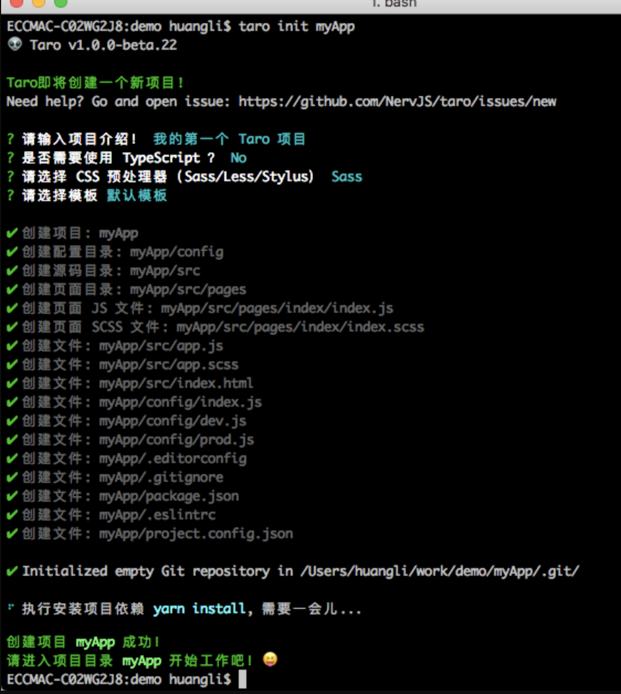

#### 1.2.1 微信小程序

> 选择微信小程序模式，需要自行下载并打开微信开发者工具，然后选择项目根目录进行预览

微信小程序编译预览及打包

    # npm script
    $ npm run dev:weapp
    $ npm run build:weapp

#### 1.2.2 百度小程序

> 选择百度小程序模式，需要自行下载并打开[百度开发者工具(opens new window)][opens new window]，然后在项目编译完后选择项目根目录下 dist 目录进行预览

百度小程序编译预览及打包

    # npm script
    $ npm run dev:swan
    $ npm run build:swan

#### 1.2.3 支付宝小程序

> 选择支付宝小程序模式，需要自行下载并打开[支付宝小程序开发者工具(opens new window)][opens new window 1]，然后在项目编译完后选择项目根目录下 dist 目录进行预览

支付宝小程序编译预览及打包：

    # npm script
    $ npm run dev:alipay
    $ npm run build:alipay

#### 1.2.4 H5

H5 编译预览及打包：

    # npm script
    $ npm run dev:h5

    # 仅限全局安装
    $ taro build --type h5 --watch

#### 1.2.5 React Native

> `React Native` 端运行需执行如下命令，`React Native` 端相关的运行说明请参见 `React Native` [教程(opens new window)][opens new window 2]

    # npm script
    $ npm run dev:rn

### 1.3 更新 Taro

> `Taro` 提供了更新命令来更新 `CLI`工具自身和项目中 `Taro` 相关的依赖。

更新 `taro-cli` 工具

    # taro
    $ taro update self
    # npm

> 更新项目中 `Taro` 相关的依赖，这个需要在你的项目下执行

    $ taro update project

## 二、Taro 开发说明与注意事项

### 2.1 微信小程序开发工具的配置

> 由于 `Taro` 编译后的代码已经经过了转义和压缩，因此还需要注意微信开发者工具的项目设置

- 设置关闭 `ES6` 转 `ES5` 功能
- 设置关闭上传代码时样式自动补全
- 设置关闭代码压缩上传

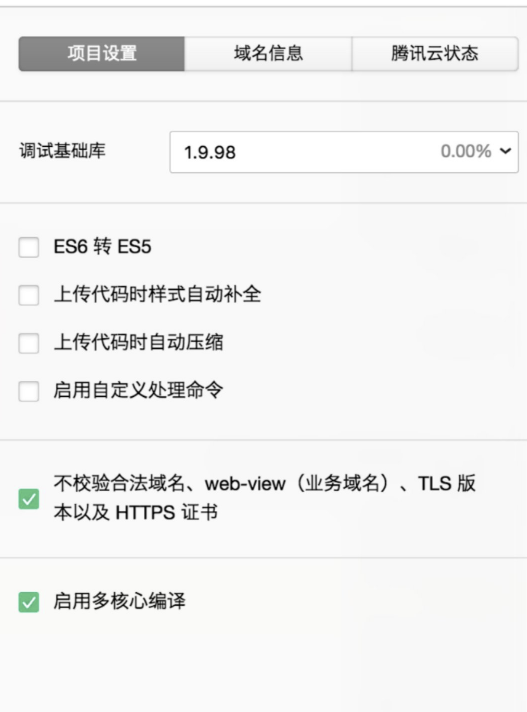

### 2.2 Taro 与 React 的差异

> 由于微信小程序的限制，`React` 中某些写法和特性在 `Taro` 中还未能实现，后续将会逐渐完善。 截止到本小册发布前，`Taro` 的最新版本为 `1.1`，因此以下讲解默认版本为 `1.1`

#### 2.2.1 暂不支持在 render() 之外的方法定义 JSX

> 由于微信小程序的 `template` 不能动态传值和传入函数，`Taro` 暂时也没办法支持在类方法中定义 `JSX`

无效情况

    class App extends Component {
      _render() {
        return <View />
      }
    }

    class App extends Component {
      renderHeader(showHeader) {
        return showHeader && <Header />
      }
    }

    class App extends Component {
      renderHeader = (showHeader) => {
        return showHeader& & <Header />
      }
    }...

**解决方案**

在 `render` 方法中定义

    class App extends Component {

      render () {
        const { showHeader, showMain } = this.state
        const header = showHeader && <Header />
        const main = showMain && <Main />
        return (
          <View> {header} {main} </View>
        )
      }
    }...

#### 2.2.2 不能在包含 JSX 元素的 map 循环中使用 if 表达式

无效情况

    numbers.map((number) => {
      let element = null
      const isOdd = number % 2
      if (isOdd) {
        element = <Custom />
      }
      return element
    })

    numbers.map((number) => {
      let isOdd = false
      if (number % 2) {
        isOdd = true
      }
      return isOdd && <Custom />
    })...

**解决方案**

尽量在 `map` 循环中使用条件表达式或逻辑表达式。

    numbers.map((number) => {
      const isOdd = number % 2
      return isOdd ? <Custom /> : null
    })

    numbers.map((number) => {
      const isOdd = number % 2
      return isOdd && <Custom />
    })...

#### 2.2.3 不能使用 Array.map 之外的方法操作 JSX 数组

> Taro 在小程序端实际上把 JSX 转换成了字符串模板，而一个原生 `JSX` 表达式实际上是一个 `React/Nerv` 元素(react - element)的构造器，因此在原生 JSX 中你可以对任何一组 React 元素进行操作。但在 Taro 中你只能使用 map 方法，Taro 转换成小程序中 `wx:for`...

无效情况

    test.push(<View />)

    numbers.forEach(numbers => {
      if (someCase) {
        a = <View />
      }
    })

    test.shift(<View />)

    components.find(component => {
      return component === <View />
    })

    components.some(component => component.constructor.__proto__ === <View />.constructor)

    numbers.filter(Boolean).map((number) => {
      const element = <View />
      return <View />
    })...

**解决方案**

先处理好需要遍历的数组，然后再用处理好的数组调用 map 方法。

    numbers.filter(isOdd).map((number) => <View />)

    for (let index = 0; index < array.length; index++) {
      // do you thing with array
    }

    const element = array.map(item => {
      return <View />
    })...

#### 2.2.4 不能在 JSX 参数中使用匿名函数

无效情况

    <View onClick={() => this.handleClick()} />

    <View onClick={(e) => this.handleClick(e)} />

    <View onClick={() => ({})} />

    <View onClick={function () {}} />

    <View onClick={function (e) {this.handleClick(e)}} />...

**解决方案**

使用 `bind` 或 类参数绑定函数。

    <View onClick={this.props.hanldeClick.bind(this)} />

#### 2.2.5 不能在 JSX 参数中使用对象展开符

> 微信小程序组件要求每一个传入组件的参数都必须预先设定好，而对象展开符则是动态传入不固定数量的参数。所以 `Taro` 没有办法支持该功能

无效情况

    <View {...this.props} />

    <View {...props} />

    <Custom {...props} />

**解决方案**

开发者自行赋值：

    render () {
        const { id, title } = obj
        return <View id={id} title={title} />
    }...

#### 2.2.6 不允许在 JSX 参数（props）中传入 JSX 元素

> 由于微信小程序内置的组件化的系统不能通过属性（props） 传函数，而 props 传递函数可以说是 React 体系的根基之一，我们只能自己实现一套组件化系统。而自制的组件化系统不能使用内置组件化的 slot 功能。两权相害取其轻，我们暂时只能不支持该功能...

无效情况

    <Custom child={<View />} />

    <Custom child={() => <View />} />

    <Custom child={function () { <View /> }} />

    <Custom child={ary.map(a => <View />)} />...

**解决方案**

> 通过 `props` 传值在 `JSX` 模板中预先判定显示内容，或通过 `props.children` 来嵌套子组件

#### 2.2.7 不支持无状态组件（Stateless Component)

> 由于微信的 `template` 能力有限，不支持动态传值和函数，`Taro` 暂时只支持一个文件自定义一个组件。为了避免开发者疑惑，暂时不支持定义 `Stateless Component`

无效情况

    function Test () {
      return <View />
    }

    function Test (ary) {
      return ary.map(() => <View />)
    }

    const Test = () => {
      return <View />
    }

    const Test = function () {
      return <View />
    }...

**解决方案**

使用 `class` 定义组件。

    class App extends Component {
      render () {
        return (
          <View />
        )
      }
    }

### 2.3 命名规范

> Taro 函数命名使用驼峰命名法，如`onClick`，由于微信小程序的 WXML 不支持传递函数，函数名编译后会以字符串的形式绑定在 WXML 上，囿于 WXML 的限制，函数名有三项限制

- 方法名不能含有数字
- 方法名不能以下划线开头或结尾
- 方法名的长度不能大于 `20`

请遵守以上规则，否则编译后的代码在微信小程序中会报以下错误

### 2.4 推荐安装 ESLint 编辑器插件

> Taro 有些写法跟 React 有些差异，可以通过安装 ESLint 相关的编辑器插件来获得人性化的提示。由于不同编辑器安装的插件有所不同，具体安装方法请自行搜索，这里不再赘述。 如下图，就是安装插件后获得的提示

### 2.5 最佳编码方式

**组件传递函数属性名以 on 开头**

> 在 `Taro` 中，父组件要往子组件传递函数，属性名必须以`on` 开头

    // 调用 Custom 组件，传入 handleEvent 函数，属性名为 `onTrigger`
    class Parent extends Component {

      handleEvent () {

      }

      render () {
        return (
          <Custom onTrigger={this.handleEvent}></Custom>
        )
      }
    }...

> 这是因为，微信小程序端组件化是不能直接传递函数类型给子组件的，在 Taro 中是借助组件的事件机制来实现这一特性，而小程序中传入事件的时候属性名写法为 `bindmyevent` 或者 `bind:myevent`

    <!-- 当自定义组件触发“myevent”事件时，调用“onMyEvent”方法 -->
    <component-tag-name bindmyevent="onMyEvent" />
    <!-- 或者可以写成 -->
    <component-tag-name bind:myevent="onMyEvent" />

> 所以 `Taro`中约定组件传递函数属性名以 `on` 开头，同时这也和内置组件的事件绑定写法保持一致了...

**小程序端不要在组件中打印传入的函数**

> 前面已经提到小程序端的组件传入函数的原理，所以在小程序端不要在组件中打印传入的函数，因为拿不到结果，但是 `this.props.onXxx && this.props.onXxx()` 这种判断函数是否传入来进行调用的写法是完全支持的...

**小程序端不要将在模板中用到的数据设置为 undefined**

- 由于小程序不支持将 `data` 中任何一项的 `value` 设为 `undefined` ，在 `setState` 的时候也请避免这么用。你可以使用 `null` 来替代。
- 小程序端不要在组件中打印 `this.props.children` 在微信小程序端是通过`<slot />` 来实现往自定义组件中传入元素的，而 `Taro` 利用 `this.props.children` 在编译时实现了这一功能， `this.props.children` 会直接被编译成 `<slot />` 标签，所以它在小程序端属于语法糖的存在，请不要在组件中打印它...

**组件 state 与 props 里字段重名的问题**

> 不要在 `state`与 `props` 上用同名的字段，因为这些被字段在微信小程序中都会挂在 `data` 上

**小程序中页面生命周期 componentWillMount 不一致问题**

> 由于微信小程序里页面在 `onLoad` 时才能拿到页面的路由参数，而页面 `onLoad` 前组件都已经 `attached` 了。因此页面的 `componentWillMount` 可能会与预期不太一致。例如：

    // 错误写法
    render () {
      // 在 willMount 之前无法拿到路由参数
      const abc = this.$router.params.abc
      return <Custom adc={abc} />
    }

    // 正确写法
    componentWillMount () {
      const abc = this.$router.params.abc
      this.setState({
        abc
      })
    }
    render () {
      // 增加一个兼容判断
      return this.state.abc && <Custom adc={abc} />
    }

对于不需要等到页面 `willMount` 之后取路由参数的页面则没有任何影响...

**JS 编码必须用单引号**

> 在 `Taro` 中，`JS` 代码里必须书写单引号，特别是 `JSX` 中，如果出现双引号，可能会导致编译错误

**process.env 的使用**

> 不要以解构的方式来获取通过 `env`配置的 `process.env` 环境变量，请直接以完整书写的方式 `process.env.NODE_ENV`来进行使用

    // 错误写法，不支持
    const { NODE_ENV = 'development' } = process.env
    if (NODE_ENV === 'development') {
      ...
    }

    // 正确写法
    if (process.env.NODE_ENV === 'development') {

    }...

**预加载**

> 在微信小程序中，从调用 `Taro.navigateTo`、`Taro.redirectTo` 或 `Taro.switchTab` 后，到页面触发`componentWillMount` 会有一定延时。因此一些网络请求可以提前到发起跳转前一刻去请求

Taro 提供了 `componentWillPreload` 钩子，它接收页面跳转的参数作为参数。可以把需要预加载的内容通过 `return` 返回，然后在页面触发 `componentWillMount` 后即可通过 `this.$preloadData` 获取到预加载的内容。...

    class Index extends Component {
      componentWillMount () {
        console.log('isFetching: ', this.isFetching)
        this.$preloadData
          .then(res => {
            console.log('res: ', res)
            this.isFetching = false
          })
      }

      componentWillPreload (params) {
        return this.fetchData(params.url)
      }

      fetchData () {
        this.isFetching = true
        ...
      }
    }...

## 三、Taro 设计思想及架构

> 在 Taro 中采用的是编译原理的思想，所谓编译原理，就是一个对输入的源代码进行语法分析，语法树构建，随后对语法树进行转换操作再解析生成目标代码的过程。

### 3.1 抹平多端差异

> 基于编译原理，我们已经可以将 Taro 源码编译成不同端上可以运行的代码了，但是这对于实现多端开发还是远远不够。因为不同的平台都有自己的特性，每一个平台都不尽相同，这些差异主要体现在不同的组件标准与不同的 API 标准以及不同的运行机制上

以小程序和 Web 端为例

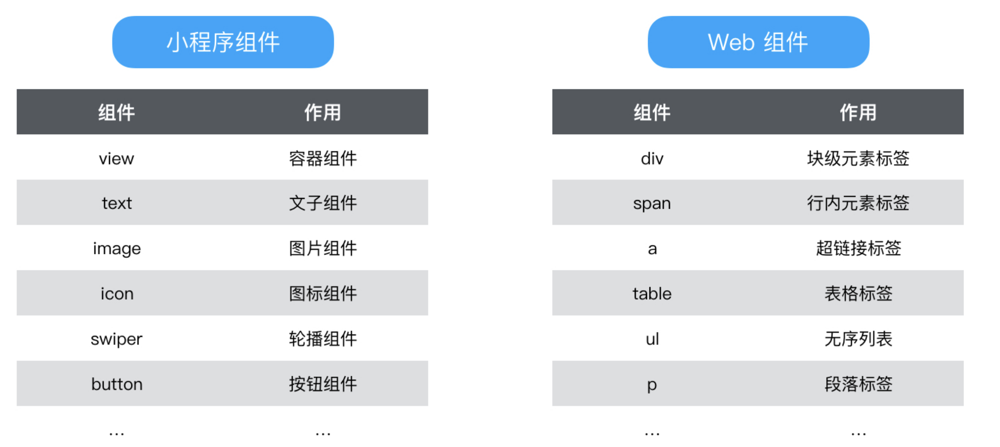

- 可以看出小程序和 Web 端上组件标准与 API 标准有很大差异，这些差异仅仅通过代码编译手段是无法抹平的，例如你不能直接在编译时将小程序的 `<view />` 直接编译成 `
`，因为他们虽然看上去有些类似，但是他们的组件属性有很大不同的，仅仅依靠代码编译，无法做到一致，同理，众多 `API` 也面临一样的情况。针对这样的情况，`Taro` 采用了定制一套运行时标准来抹平不同平台之间的差异。
- 这一套标准主要以三个部分组成，包括标准运行时框架、标准基础组件库、标准端能力 API，其中运行时框架和 API 对应 `@taro/taro`，组件库对应 `@tarojs/components`，通过在不同端实现这些标准，从而达到去差异化的目的...

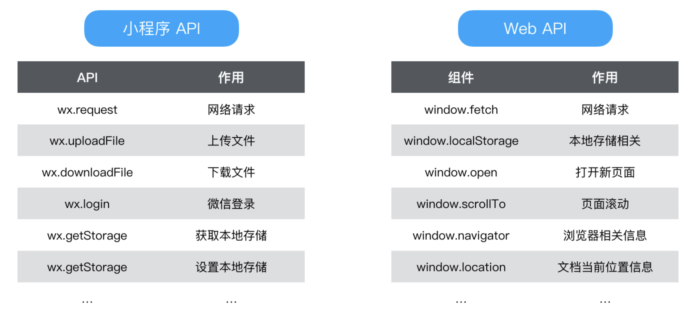

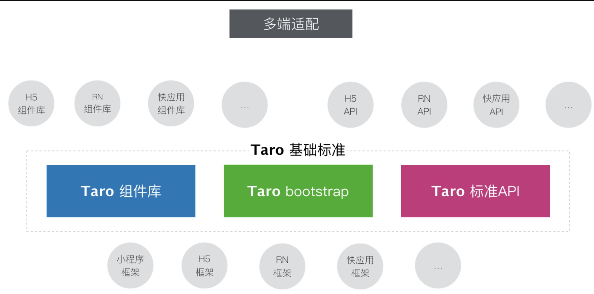

## 四、CLI 原理及不同端的运行机制

### 4.1 taro-cli 包

#### 4.1.1 Taro 命令

> `taro-cli` 包位于 `Taro` 工程的 `Packages` 目录下，通过 `npm install -g @tarojs/cli` 全局安装后，将会生成一个 `Taro` 命令。主要负责项目初始化、编译、构建等。直接在命令行输入 `Taro` ，会看到如下提示...

    ➜ taro
    👽 Taro v0.0.63

      Usage: taro <command> [options]

      Options:

        -V, --version       output the version number
        -h, --help          output usage information

      Commands:

        init [projectName]  Init a project with default templete
        build               Build a project with options
        update              Update packages of taro
        help [cmd]          display help for [cmd]...

里面包含了 Taro 所有命令用法及作用。

#### 4.1.2 包管理与发布

- 首先，我们需要了解 `taro-cli` 包与 `Taro` 工程的关系。
- 将 `Taro` 工程 `Clone` 之后，可以看到工程的目录结构如下，整体结构还是比较清晰的：

  .
  ├── CHANGELOG.md
  ├── LICENSE
  ├── README.md
  ├── build
  ├── docs
  ├── lerna-debug.log
  ├── lerna.json // Lerna 配置文件
  ├── package.json
  ├── packages
  │   ├── eslint-config-taro
  │   ├── eslint-plugin-taro
  │   ├── postcss-plugin-constparse
  │   ├── postcss-pxtransform
  │   ├── taro
  │   ├── taro-async-await
  │   ├── taro-cli
  │   ├── taro-components
  │   ├── taro-components-rn
  │   ├── taro-h5
  │   ├── taro-plugin-babel
  │   ├── taro-plugin-csso
  │   ├── taro-plugin-sass
  │   ├── taro-plugin-uglifyjs
  │   ├── taro-redux
  │   ├── taro-redux-h5
  │   ├── taro-rn
  │   ├── taro-rn-runner
  │   ├── taro-router
  │   ├── taro-transformer-wx
  │   ├── taro-weapp
  │   └── taro-webpack-runner
  └── yarn.lock...

> `Taro` 项目主要是由一系列 `NPM` 包组成，位于工程的 `Packages` 目录下。它的包管理方式和 `Babel` 项目一样，将整个项目作为一个 `monorepo` 来进行管理，并且同样使用了包管理工具 `Lerna`

`Packages` 目录下十几个包中，最常用的项目初始化与构建的命令行工具 `Taro CLI` 就是其中一个。在 `Taro` 工程根目录运行 `lerna publish` 命令之后，`lerna.json` 里面配置好的所有的包会被发布到 `NPM` 上

#### 4.1.3 taro-cli 包的目录结构如下

    ./
    ├── bin        // 命令行
    │   ├── taro              // taro 命令
    │   ├── taro-build        // taro build 命令
    │   ├── taro-update       // taro update 命令
    │   └── taro-init         // taro init 命令
    ├── package.json
    ├── node_modules
    ├── src
    │   ├── build.js        // taro build 命令调用，根据 type 类型调用不同的脚本
    │   ├── config
    │   │   ├── babel.js        // Babel 配置
    │   │   ├── babylon.js      // JavaScript 解析器 babylon 配置
    │   │   ├── browser_list.js // autoprefixer browsers 配置
    │   │   ├── index.js        // 目录名及入口文件名相关配置
    │   │   └── uglify.js
    │   ├── creator.js
    │   ├── h5.js       // 构建h5 平台代码
    │   ├── project.js  // taro init 命令调用，初始化项目
    │   ├── rn.js       // 构建React Native 平台代码
    │   ├── util        // 一系列工具函数
    │   │   ├── index.js
    │   │   ├── npm.js
    │   │   └── resolve_npm_files.js
    │   └── weapp.js        // 构建小程序代码转换
    ├── templates           // 脚手架模版
    │   └── default
    │       ├── appjs
    │       ├── config
    │       │   ├── dev
    │       │   ├── index
    │       │   └── prod
    │       ├── editorconfig
    │       ├── eslintrc
    │       ├── gitignor...

> 通过上面的目录树可以发现，`taro-cli` 工程的文件并不算多，主要目录有：`/bin`、`/src`、`/template`

### 4.2 用到的核心库

- [tj/commander.js(opens new window)][tj_commander.js_opens new window] Node.js - 命令行接口全面的解决方案
- [jprichardson/node-fs-extra(opens new window)][jprichardson_node-fs-extra_opens new window] \- 在 Node.js 的 fs 基础上增加了一些新的方法，更好用，还可以拷贝模板。
- [chalk/chalk(opens new window)][chalk_chalk_opens new window] \- 可以用于控制终端输出字符串的样式
- [SBoudrias/Inquirer.js - Node.js(opens new window)][sboudrias_inquirer.js - node.js_opens new window] 命令行交互工具，通用的命令行用户界面集合，可以和用户进行交互
- [sindresorhus/ora(opens new window)][sindresorhus_ora_opens new window] \- 实现加载中的状态是一个 Loading 加前面转起来的小圈圈，成功了是一个 Success 加前面一个小钩钩
- [SBoudrias/mem-fs-editor(opens new window)][sboudrias_mem-fs-editor_opens new window] \- 提供一系列 API，方便操作模板文件
- [shelljs/shelljs (opens new window)][shelljs_shelljs _opens new window] \- ShellJS 是 Node.js 扩展，用于实现 Unix shell 命令执行。

### 4.3 Taro Init

> 当我们全局安装 `taro-cli` 包之后，我们的命令行里就有了 Taro 命令

- 那么 `Taro` 命令是怎样添加进去的呢？其原因在于 `package.json` 里面的 `bin`字段：

  "bin": {
  "taro": "bin/taro"
  }

上面代码指定，Taro 命令对应的可执行文件为 `bin/taro` 。NPM 会寻找这个文件，在 `[prefix]/bin` 目录下建立符号链接。在上面的例子中，Taro 会建立符号链接 `[prefix]/bin/taro`。由于 `[prefix]/bin`目录会在运行时加入系统的 PATH 变量，因此在运行 NPM 时，就可以不带路径，直接通过命令来调用这些脚本。

- 关于`prefix`，可以通过`npm config get prefix`获取。

  $ npm config get prefix
  /usr/local

通过下列命令可以更加清晰的看到它们之间的符号链接...

    $ ls -al `which taro`
    lrwxr-xr-x  1 chengshuai  admin  40  6 15 10:51 /usr/local/bin/taro -> ../lib/node_modules/@tarojs/cli/bin/taro...

#### 4.3.1 命令关联与参数解析

> 这里就不得不提到一个有用的包：`tj/commander.js` ，`Node.js` 命令行接口全面的解决方案，灵感来自于 Ruby's commander。可以自动的解析命令和参数，合并多选项，处理短参等等，功能强大，上手简单

更主要的，`commander` 支持 `Git` 风格的子命令处理，可以根据子命令自动引导到以特定格式命名的命令执行文件，文件名的格式是 `[command]-[subcommand]`，例如

- `taro init` => `taro-init`
- `taro build` => `taro-build`
- `/bin/taro` 文件内容不多，核心代码也就那几行 `.command()` 命令：

  #! /usr/bin/env node

  const program = require('commander')
  const {getPkgVersion} = require('../src/util')

  program
  .version(getPkgVersion())
  .usage('<command> [options]')
  .command('init [projectName]', 'Init a project with default templete')
  .command('build', 'Build a project with options')
  .command('update', 'Update packages of taro')
  .parse(process.argv)...

> 通过上面代码可以发现，`init`，`build` ，`update`等命令都是通过`.command(name, description)`方法定义的，然后通过 `.parse(arg)` 方法解析参数

#### 4.3.2 参数解析及与用户交互

- `commander` 包可以自动解析命令和参数，在配置好命令之后，还能够自动生成 `help`（帮助）命令和`version`（版本查看） 命令。并且通过`program.args`便可以获取命令行的参数，然后再根据参数来调用不同的脚本。
- 但当我们运行 `taro init` 命令后，如下所示的命令行交互又是怎么实现的呢？...

  $ taro init taroDemo
  Taro 即将创建一个新项目!
  Need help? Go and open issue: https://github.com/NervJS/taro/issues/new

  Taro v0.0.50

  ? 请输入项目介绍！
  ? 请选择模板 默认模板...

这里使用的是 `SBoudrias/Inquirer.js` 来处理命令行交互。

用法其实很简单

    const inquirer = require('inquirer')  // npm i inquirer -D

    if (typeof conf.description !== 'string') {
          prompts.push({
            type: 'input',
            name: 'description',
            message: '请输入项目介绍！'
          })
    }...

- `prompt()`接受一个问题对象的数据，在用户与终端交互过程中，将用户的输入存放在一个答案对象中，然后返回一个`Promise`，通过`then()`获取到这个答案对象。 借此，新项目的名称、版本号、描述等信息可以直接通过终端交互插入到项目模板中，完善交互流程。
- 当然，交互的问题不仅限于此，可以根据自己项目的情况，添加更多的交互问题。`inquirer.js`强大的地方在于，支持很多种交互类型，除了简单的 input，还有`confirm`、`list`、`password`、`checkbox`等，具体可以参见项目的工程 README。 此外，你在执行异步操作的过程中，还可以使用 `sindresorhus/ora` 来添加一下 `Loading` 效果。使用 `chalk/chalk` 给终端的输出添加各种样式...

#### 4.3.3 模版文件操作

**最后就是模版文件操作了，主要分为两大块：**

- 将输入的内容插入到模板中
- 根据命令创建对应目录结构，copy 文件
- 更新已存在文件内容

> 这些操作基本都是在 `/template/index.js` 文件里。 这里还用到了 `shelljs/shelljs` 执行 `shell` 脚本，如初始化 `Git： git init`，项目初始化之后安装依赖 `npm install`等

**拷贝模板文件**

> 拷贝模版文件主要是使用 `jprichardson/node-fs-extra`的 `copyTpl()`方法，此方法使用 `ejs` 模板语法，可以将输入的内容插入到模版的对应位置：

    this.fs.copyTpl(
      project,
      path.join(projectPath, 'project.config.json'),
      {description, projectName}
    );...

### 4.4 Taro Build

- `taro build` 命令是整个 `Taro` 项目的灵魂和核心，主要负责多端代码编译（H5，小程序，`React Native`等）。
- `Taro` 命令的关联，参数解析等和 `taro init` 其实是一模一样的，那么最关键的代码转换部分是怎样实现的呢？...

#### 4.4.1 编译工作流与抽象语法树（AST）

> Taro 的核心部分就是将代码编译成其他端（H5、小程序、React Native 等）代码。一般来说，将一种结构化语言的代码编译成另一种类似的结构化语言的代码包括以下几个步骤

首先是 `Parse`，将代码解析（`Parse`）成抽象语法树（Abstract Syntex Tree），然后对 `AST`进行遍历（`traverse`）和替换(`replace`)（这对于前端来说其实并不陌生，可以类比 `DOM` 树的操作），最后是生成（`generate`），根据新的 `AST` 生成编译后的代码...

#### 4.4.2 Babel 模块

`Babel` 是一个通用的多功能的 JavaScript 编译器，更确切地说是源码到源码的编译器，通常也叫做转换编译器（transpiler）。 意思是说你为 Babel 提供一些 JavaScript 代码，Babel 更改这些代码，然后返回给你新生成的代码...

#### 4.4.3 解析页面 Config 配置

> 在业务代码编译成小程序的代码过程中，有一步是将页面入口 JS 的 Config 属性解析出来，并写入 `*.json` 文件，供小程序使用。那么这一步是怎么实现的呢？这里将这部分功能的关键代码抽取出来：

    // 1. babel-traverse方法， 遍历和更新节点
    traverse(ast, {
      ClassProperty(astPath) { // 遍历类的属性声明
        const node = astPath.node
        if (node.key.name === 'config') { // 类的属性名为 config
          configObj = traverseObjectNode(node)
          astPath.remove() // 将该方法移除掉
        }
      }
    })

    // 2. 遍历，解析为 JSON 对象
    function traverseObjectNode(node, obj) {
      if (node.type === 'ClassProperty' || node.type === 'ObjectProperty') {
        const properties = node.value.properties
          obj = {}
          properties.forEach((p, index) => {
            obj[p.key.name] = traverseObjectNode(p.value)
          })
          return obj
      }
      if (node.type === 'ObjectExpression') {
        const properties = node.properties
        obj = {}
        properties.forEach((p, index) => {
          // const t = require('babel-types') AST 节点的 Lodash 式工具库
          const key = t.isIdentifier(p.key) ? p.key.name : p.key.value
          obj[key] = traverseObjectNode(p.value)
        })
        return obj
      }
      if (node.type === 'ArrayExpression') {
        return node.elements.map(item => traverseObjectNode(item))
     ...

## 五、Taro 组件库及 API 的设计与适配

### 5.1 多端差异

#### 5.1.1 组件差异

小程序、H5 以及快应用都可以划分为 XML 类，React Native 归为 JSX 类，两种语言风牛马不相及，给适配设置了非常大的障碍。XML 类有个明显的特点是关注点分离（Separation of Concerns），即语义层（XML）、视觉层（CSS）、交互层（JavaScript）三者分离的松耦合形式，JSX 类则要把三者混为一体，用脚本来包揽三者的工作...

**不同端的组件的差异还体现在定制程度上**

- H5 标签（组件）提供最基础的功能——布局、表单、媒体、图形等等；
- 小程序组件相对 H5 有了一定程度的定制，我们可以把小程序组件看作一套类似于 H5 的 UI 组件库；
- React Native 端组件也同样如此，而且基本是专“组”专用的，比如要触发点击事件就得用 Touchable 或者 Text 组件，要渲染文本就得用 Text 组件（虽然小程序也提供了 Text 组件，但它的文本仍然可以直接放到 view 之类的组件里）...

#### 5.1.2 API 差异

**各端 API 的差异具有定制化、接口不一、能力限制的特点**

- 定制化：各端所提供的 API 都是经过量身打造的，比如小程序的开放接口类 API，完全是针对小程序所处的微信环境打造的，其提供的功能以及外在表现都已由框架提供实现，用户上手可用，毋须关心内部实现。
- 接口不一：相同的功能，在不同端下的调用方式以及调用参数等也不一样，比如 `socket`，小程序中用 `wx.connectSocket` 来连接，`H5` 则用 `new WebSocket()` 来连接，这样的例子我们可以找到很多个。
- 能力限制：各端之间的差异可以进行定制适配，然而并不是所有的 `API`（此处特指小程序 `API`，因为多端适配是向小程序看齐的）在各个端都能通过定制适配来实现，因为不同端所能提供的端能力“大异小同”，这是在适配过程中不可抗拒、不可抹平的差异...

### 5.2 多端适配

#### 5.2.1 样式处理

H5 端使用官方提供的 WEUI 进行适配，React Native 端则在组件内添加样式，并通过脚本来控制一些状态类的样式，框架核心在编译的时候把源代码的 class 所指向的样式通过 css-to-react-native 进行转译，所得 StyleSheet 样式传入组件的 style 参数，组件内部会对样式进行二次处理，得到最终的样式...

**为什么需要对样式进行二次处理？**

> 部分组件是直接把传入 `style` 的样式赋给最外层的 `React Native` 原生组件，但部分经过层层封装的组件则不然，我们要把容器样式、内部样式和文本样式离析。为了方便解释，我们把这类组件简化为以下的形式：

    <View style={wrapperStyle}>
      <View style={containerStyle}>
        <Text style={textStyle}>Hello World</Text>
      </View>
    </View>

> 假设组件有样式 `margin-top`、`background-color` 和 `font-size`，转译传入组件后，就要把分别把它们传到`wrapperStyle`、`containerStyle` 和 `textStyle`，可参考 `ScrollView` 的 `style` 和 `contentContainerStyle`...

#### 5.2.2 组件封装

> 组件的封装则是一个“仿制”的过程，利用端提供的原材料，加工成通用的组件，暴露相对统一的调用方式。我们用 `<Button />` 这个组件来举例，在小程序端它也许是长这样子的

    <button size="mini" plain={{plain}} loading={{loading}} hover-class="you-hover-me"></button>

> 如果要实现 `H5` 端这么一个按钮，大概会像下面这样，在组件内部把小程序的按钮特性实现一遍，然后暴露跟小程序一致的调用方式，就完成了 `H5` 端一个组件的设计

    <button {...omit(this.props, ['hoverClass', 'onTouchStart', 'onTouchEnd'])} className={cls} style={style} onClick={onClick} disabled={disabled} onTouchStart={_onTouchStart} onTouchEnd={_onTouchEnd} >
      {loading && <i class='weui-loading' />}
      {children}
    </button>...

- 其他端的组件适配相对 H5 端来说会更曲折复杂一些，因为 H5 跟小程序的语言较为相似，而其他端需要整合特定端的各种组件，以及利用端组件的特性来实现，比如在 React Native 中实现这个按钮，则需要用到 `<Touchable* />`、`<View />`、`<Text />`，要实现动画则需要用上 `<Animated.View />`，还有就是相对于 H5 和小程序比较容易实现的 touch 事件，在 React Native 中则需要用上 PanResponder 来进行“仿真”，总之就是，因“端”制宜，一切为了最后只需一行代码通行多端！
- 除了属性支持外，事件回调的参数也需要进行统一，为此，需要在内部进行处理，比如 Input 的 `onInput` 事件，需要给它造一个类似小程序相同事件的回调参数，比如 `{ target: { value: text }`, `detail: { value: text }` \}，这样，开发者们就可以像下面这样处理回调事件，无需关心中间发生了什么...

  function onInputHandler ({ target, detail }) {
  console.log(target.value, detail.value)
  }

## 六、JSX 转换微信小程序模板的实现

### 6.1 代码的本质

> 不管是任意语言的代码，其实它们都有两个共同点

- 它们都是由字符串构成的文本
- 它们都要遵循自己的语言规范

第一点很好理解，既然代码是字符串构成的，我们要修改/编译代码的最简单的方法就是使用字符串的各种正则表达式。例如我们要将 `JSON` 中一个键名 `foo` 改为 `bar`，只要写一个简单的正则表达式就能做到：

    jsonStr.replace(/(?<=")foo(?="\s*:)/i, 'bar')...

> 编译就是把一段字符串改成另外一段字符串

### 6.2 Babel

> `JavaScript` 社区其实有非常多 `parser` 实现，比如 `Acorn`、`Esprima`、`Recast`、`Traceur`、`Cherow` 等等。但我们还是选择使用 `Babel`，主要有以下几个原因

- `Babel` 可以解析还没有进入 ECMAScript 规范的语法。例如装饰器这样的提案，虽然现在没有进入标准但是已经广泛使用有一段时间了；
- `Babel` 提供插件机制解析 `TypeScript`、`Flow`、`JSX`这样的 `JavaScript` 超集，不必单独处理这些语言；
- `Babel` 拥有庞大的生态，有非常多的文档和样例代码可供参考； 除去 `parser` 本身，`Babel` 还提供各种方便的工具库可以优化、生成、调试代码...

**Babylon（ @babel/parser）**

> `Babylon` 就是 `Babel` 的 `parser`。它可以把一段符合规范的 JavaScript 代码输出成一个符合 Esprima 规范的 `AST`。 大部分 `parser` 生成的 `AST` 数据结构都遵循 Esprima 规范，包括 ESLint 的 `parser` ESTree。这就意味着我们熟悉了 Esprima 规范的 `AST` 数据结构还能去写 ESLint 插件。

我们可以尝试解析 `n * n` 这句简单的表达式：

    import * as babylon from "babylon";

    const code = `n * n`;

    babylon.parse(code);...

最终 `Babylon` 会解析成这样的数据结构：

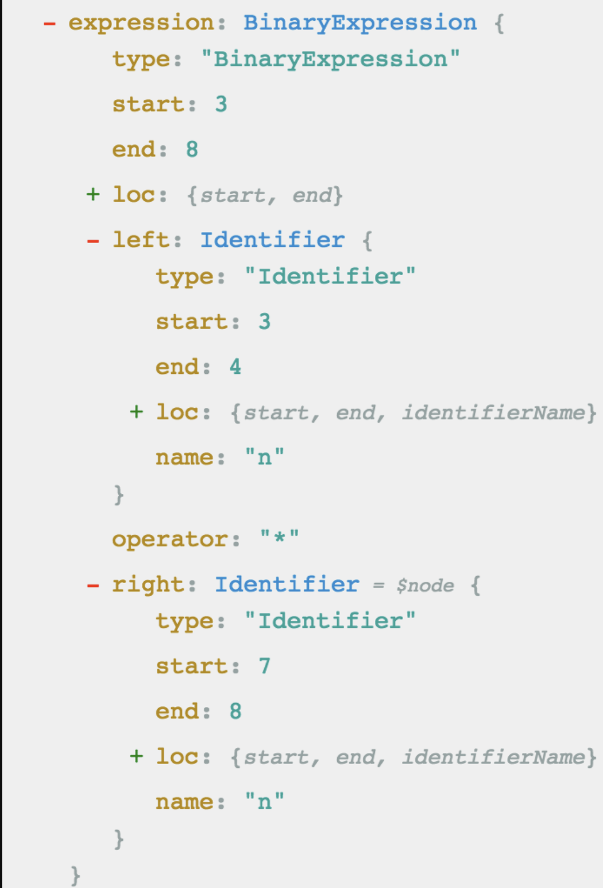

> 你也可以使用 [ASTExploroer(opens new window)][astexploroer_opens new window] 快速地查看代码的 `AST`

**Babel-traverse (@babel/traverse)**

> `babel-traverse` 可以遍历由 Babylon 生成的抽象语法树，并把抽象语法树的各个节点从拓扑数据结构转化成一颗路径（Path）树，Path 表示两个节点之间连接的响应式（Reactive）对象，它拥有添加、删除、替换节点等方法。当你调用这些修改树的方法之后，路径信息也会被更新。除此之外，Path 还提供了一些操作作用域（Scope） 和标识符绑定（Identifier Binding） 的方法可以去做处理一些更精细复杂的需求。可以说 `babel-traverse` 是使用 Babel 作为编译器最核心的模块...

让我们尝试一下把一段代码中的 `n * n` 变为 `x * x`

    import * as babylon from "@babel/parser";
    import traverse from "babel-traverse";

    const code = `function square(n) { return n * n; }`;

    const ast = babylon.parse(code);

    traverse(ast, {
      enter(path) {
        if (
          path.node.type === "Identifier" &&
          path.node.name === "n"
        ) {
          path.node.name = "x";
        }
      }
    });...

**Babel-types（@babel/types）**

> `babel-types` 是一个用于 `AST` 节点的 `Lodash` 式工具库，它包含了构造、验证以及变换 `AST`节点的方法。 该工具库包含考虑周到的工具方法，对编写处理 `AST` 逻辑非常有用。例如我们之前在 `babel-traverse`中改变标识符 n 的代码可以简写为：

    import traverse from "babel-traverse";
    import * as t from "babel-types";

    traverse(ast, {
      enter(path) {
        if (t.isIdentifier(path.node, { name: "n" })) {
          path.node.name = "x";
        }
      }
    });

> 可以发现使用 `babel-types`能提高我们转换代码的可读性，在配合 TypeScript 这样的静态类型语言后，`babel-types` 的方法还能提供类型校验的功能，能有效地提高我们转换代码的健壮性和可靠性...

### 6.3 实践例子

以一个简单 `Page` 页面为例：

    import Taro, { Component } from '@tarojs/taro'
    import { View, Text } from '@tarojs/components'

    class Home extends Component {

      config = {
        navigationBarTitleText: '首页'
      }

      state = {
        numbers: [1, 2, 3, 4, 5]
      }

      handleClick = () => {
        this.props.onTest()
      }

      render () {
        const oddNumbers = this.state.numbers.filter(number => number & 2)
        return (
          <ScrollView className='home' scrollTop={false}>
            奇数：
            {
              oddNumbers.map(number => <Text onClick={this.handleClick}>{number}</Text>)
            }
            偶数：
            {
              numbers.map(number => number % 2 === 0 && <Text onClick={this.handleClick}>{number}</Text>)
            }
          </ScrollView>
        )
      }
    }...

#### 6.3.1 设计思路

- Taro 的结构主要分两个方面：运行时和编译时。运行时负责把编译后到代码运行在本不能运行的对应环境中，你可以把 Taro 运行时理解为前端开发当中 `polyfill`。举例来说，小程序新建一个页面是使用 `Page` 方法传入一个字面量对象，并不支持使用类。如果全部依赖编译时的话，那么我们要做到事情大概就是把类转化成对象，把 `state` 变为 `data`，把生命周期例如 componentDidMount 转化成 `onReady`，把事件由可能的类函数（`Class method`）和类属性函数(`Class property function`) 转化成字面量对象方法（Object `property function`）等等。
- 但这显然会让我们的编译时工作变得非常繁重，在一个类异常复杂时出错的概率也会变高。但我们有更好的办法：实现一个 `createPage` 方法，接受一个类作为参数，返回一个小程序 `Page` 方法所需要的字面量对象。这样不仅简化了编译时的工作，我们还可以在 `createPage` 对编译时产出的类做各种操作和优化。通过运行时把工作分离了之后，再编译时我们只需要在文件底部加上一行代码 `Page(createPage(componentName))` 即可...

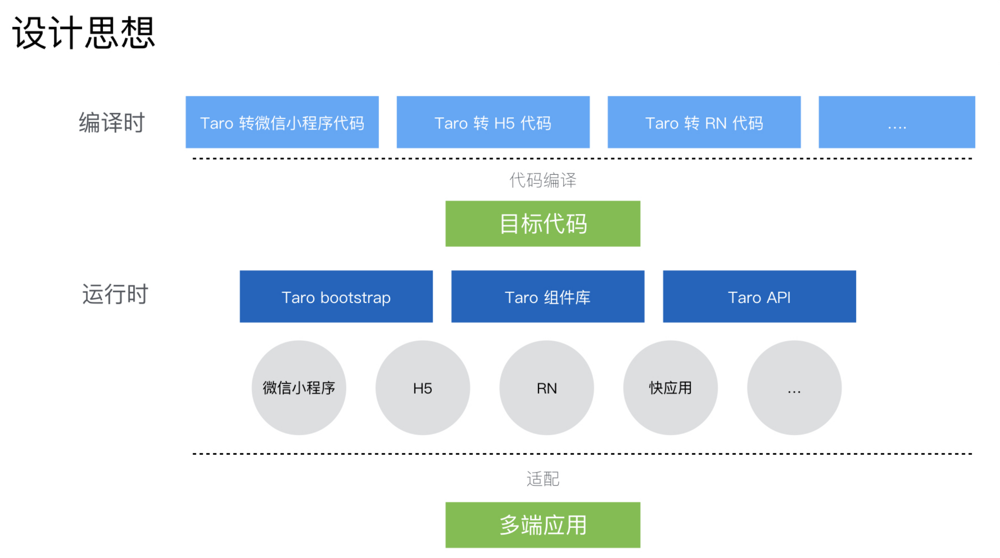

- 回到一开始那段代码，我们定义了一个类属性 `config`，`config` 是一个对象表达式（Object Expression），这个对象表达式只接受键值为标识符（Identifier）或字符串，而键名只能是基本类型。这样简单的情况我们只需要把这个对象表达式转换为 `JSON` 即可。另外一个类属性 `state` 在 `Page` 当中有点像是小程序的 `data`，但它在多数情况不是完整的 `data`。这里我们不用做过多的操作，`babel`的插件 `transform-class-proerties` 会把它编译到类的构造器中。函数 `handleClick` 我们交给运行时处理，有兴趣的同学可以跳到 Taro 运行时原理查看具体技术细节。
- 再来看我们的 `render()`函数，它的第一行代码通过 `filter` 把数字数组的所有偶数项都过滤掉，真正用来循环的是 `oddNumbers`，而 `oddNumbers` 并没有在 `this.state` 中，所以我们必须手动把它加入到 `this.state`。和 `React 一样，Taro 每次更新都会调用 render 函数，但和 React 不同的是，React 的 render` 是一个创建虚拟 DOM 的方法，而 Taro 的 render 会被重命名为 `_createData`，它是一个创建数据的方法：在 `JSX` 使用过的数据都在这里被创建最后放到小程序 `Page` 或 `Component` 工厂方法中的 `data`。最终我们的 `render` 方法会被编译为...

  \_createData() {
  this.**state = arguments[0] || this.state || {};
  this.**props = arguments[1] || this.props || {};

  const oddNumbers = this.**state.numbers.filter(number => number & 2);
  Object.assign(this.**state, {
  oddNumbers: oddNumbers
  });
  return this.\_\_state;
  }...

#### 6.3.2 WXML 和 JSX

在 Taro 里 `render` 的所有 `JSX`元素都会在 JavaScript 文件中被移除，它们最终将会编译成小程序的 `WXML`。每个 `WXML` 元素和 `HTML` 元素一样，我们可以把它定义为三种类型：`Element`、`Text`、`Comment`。其中 `Text` 只有一个属性: 内容（`content`），它对应的 `AST` 类型是 `JSXText`，我们只需要将前文源码中对应字符串的奇数和偶数转换成 Text 即可。而对于 `Comment`而言我们可以将它们全部清除，不参与 WXML 的编译。Element 类型有它的名字（`tagName`）、`children`、属性（`attributes`），其中 `children` 可能是任意 `WXML` 类型，属性是一个对象，键值和键名都是字符串。我们将把重点放在如何转换成为 `WXML` 的 `Element`类型。

首先我们可以先看 `<View className='home'>`，它在 `AST`中是一个 `JSXElement，它的结构和我们定义`Element `类型差不多。我们先将 JSXElement 的`ScrollView 从驼峰式的 JSX 命名转化为短横线（kebab case）风格，className 和 `scrollTop`的值分别代表了 `JSXAttribute` 值的两种类型：`StringLiteral` 和 `JSXExpressionContainer`，`className` 是简单的 `StringLiteral` 处理起来很方便，`scrollTop` 处理起来稍微麻烦点，我们需要用两个花括号`{}` 把内容包起来...

接下来我们再思考一下每一个 JSXElement 出现的位置，你可以发现其实它的父元素只有几种可能性：return、循环、条件（逻辑）表达式。而在上一篇文章中我们提到，babel-traverse 遍历的 AST 类型是响应式的——也就是说只要我们按照 JSXElement 父元素类型的顺序穷举处理这几种可能性，把各种可能性大结果应用到 JSX 元素之后删除掉原来的表达式，最后就可以把一个复杂的 JSX 表达式转换为一个简单的 WXML 数据结构。...

我们先看第一个循环：

    oddNumbers.map(number => <Text onClick={this.handleClick}>{number}</Text>)

Text 的父元素是一个 map 函数（CallExpression），我们可以把函数的 callee: oddNumbers 作为 wx:for 的值，并把它放到 state 中，匿名函数的第一个参数是 wx:for-item 的值，函数的第二个参数应该是 wx:for-index 的值，但代码中没有传所以我们可以不管它。然后我们把这两个 wx: 开头的参数作为 attribute 传入 Text 元素就完成了循环的处理。而对于 onClick 而言，在 Taro 中 on 开头的元素参数都是事件，所以我们只要把 this. 去掉即可。Text 元素的 children 是一个 JSXExpressionContainer，我们按照之前的处理方式处理即可。最后这行我们生成出来的数据结构应该是这样...

    {
      type: 'element',
      tagName: 'text',
      attributes: [
        { bindtap: 'handleClick' },
        { 'wx:for': '{{oddNumbers}}' },
        { 'wx:for-item': 'number' }
      ],
      children: [
        { type: 'text', content: '{{number}}' }
      ]
    }...

有了这个数据结构生成一段 WXML 就非常简单了

再来看第二个循环表达式：

    numbers.map(number => number % 2 === 0 && <Text onClick={this.handleClick}>{number}</Text>)...

它比第一个循环表达式多了一个逻辑表达式（Logical Operators），我们知道 expr1 && expr2 意味着如果 expr1 能转换成 true 则返回 expr2，也就是说我们只要把 number % 2 === 0 作为值生成一个键名 wx:if 的 JSXAttribute 即可。但由于 wx:if 和 wx:for 同时作用于一个元素可能会出现问题，所以我们应该生成一个 block 元素，把 wx:if 挂载到 block 元素，原元素则全部作为 children 传入 block 元素中。这时 babel-traverse 会检测到新的元素 block，它的父元素是一个 map 循环函数，因此我们可以按照第一个循环表达式的处理方法来处理这个表达式。

这里我们可以思考一下 `this.props.text || this.props.children` 的解决方案。当用户在 JSX 中使用 || 作为逻辑表达式时很可能是 this.props.text 和 this.props.children 都有可能作为结果返回。这里 Taro 将它编译成了 `this.props.text ? this.props.text: this.props.children`，按照条件表达式（三元表达式）的逻辑，也就是说会生成两个 block，一个 `wx:if` 和一个 `wx:else`：

    <block wx:if="{{text}}">{{text}}</block>
    <block wx:else>
        <slot></slot>
    </block>

## 七、小程序运行时

为了使 `Taro` 组件转换成小程序组件并运行在小程序环境下， `Taro` 主要做了两个方面的工作：编译以及运行时适配。编译过程会做很多工作，例如：将 JSX 转换成小程序 `.wxml` 模板，生成小程序的配置文件、页面及组件的代码等等。编译生成好的代码仍然不能直接运行在小程序环境里，那运行时又是如何与之协同工作的呢？...

### 7.1 注册程序、页面以及自定义组件

在小程序中会区分程序、页面以及组件，通过调用对应的函数，并传入包含生命周期回调、事件处理函数等配置内容的 object 参数来进行注册：

    Component({
      data: {},
      methods: {
        handleClick () {}
      }
    })

而在 `Taro`里，它们都是一个组件类：

    class CustomComponent extends Component {
      state = { }
      handleClick () { }
    }...

- 那么 `Taro` 的组件类是如何转换成小程序的程序、页面或组件的呢？
- 例如，有一个组件：`customComponent`，编译过程会在组件底部添加一行这样的代码（此处代码作示例用，与实际项目生成的代码不尽相同）：

  Component(createComponent(customComponent))

- `createComponent` 方法是整个运行时的入口，在运行的时候，会根据传入的组件类，返回一个组件的配置对象

> 在小程序里，程序的功能及配置与页面和组件差异较大，因此运行时提供了两个方法 `createApp` 和 `createComponent` 来分别创建程序和组件（页面）。`createApp` 的实现非常简单

**createComponent 方法主要做了这样几件事情**：

- 将组件的`state`转换成小程序组件配置对象的 `data`
- 将组件的生命周期对应到小程序组件的生命周期
- 将组件的事件处理函数对应到小程序的事件处理函数

### 7.2 组件 state 转换

其实在 Taro（React） 组件里，除了组件的 `state`，`JSX` 里还可以访问`props` 、`render` 函数里定义的值、以及任何作用域上的成员。而在小程序中，与模板绑定的数据均来自对应页面（或组件）的 `data`。因此 `JSX` 模板里访问到的数据都会对应到小程序组件的 `data` 上。接下来我们通过列表渲染的例子来说明`state`和 `data`是如何对应的...

**在 JSX 里访问 state**

> 在小程序的组件上使用 `wx:for` 绑定一个数组，就可以实现循环渲染。例如，在 Taro 里你可能会这么写：

    {
      state = {
        list: [1, 2, 3]
      }
      render () {
        return (
          <View>
            {this.state.list.map(item => <View>{item}</View>)}
          </View>
        )
      }
    }

编译后的小程序组件模板：

    <view>
      <view wx:for="{{list}}" wx:for-item="item">{{item}}</view>
    </view>

其中 `state.list` 只需直接对应到小程序（页面）组件的 `data.list` 上即可...

**在 render 里生成了新的变量**

然而事情通常没有那么简单，在 Taro 里也可以这么用

    {
      state = {
        list = [1, 2, 3]
      }
      render () {
        return (
          <View>
            {this.state.list.map(item => ++item).map(item => <View>{item}</View>)}
          </View>
        )
      }
    }

编译后的小程序组件模板是这样的：

    <view>
      <view wx:for="{{$anonymousCallee__1}}" wx:for-item="item">{{item}}</view>
    </view>...

> 在编译时会给 Taro 组件创建一个 `_createData`的方法，里面会生成 `$anonymousCallee__1` 这个变量， $`anonymousCallee__1` 是由编译器生成的，对 `this.state.list` 进行相关操作后的变量。 `$anonymousCallee\_\_1` 最终会被放到组件的 data 中给模板调用：

    var $anonymousCallee__1 = this.state.list.map(function (item) {
      return ++item;
    });

> `render` 里 `return`之前的所有定义变量或者对 `props`、`state` 计算产生新变量的操作，都会被编译到 `_createData` 方法里执行，这一点在前面 JSX 编译成小程序模板的相关文章中已经提到。每当 Taro 调用 `this.setState` API 来更新数据时，都会调用生成的 `_createData`来获取最新数据...

### 7.3 将组件的生命周期对应到小程序组件的生命周期

> 初始化过程里的生命周期对应很简单，在小程序的生命周期回调函数里调用 Taro 组件里对应的生命周期函数即可，例如：小程序组件 `ready` 的回调函数里会调用 Taro 组件的 `componentDidMount` 方法。它们的执行过程和对应关系如下图...

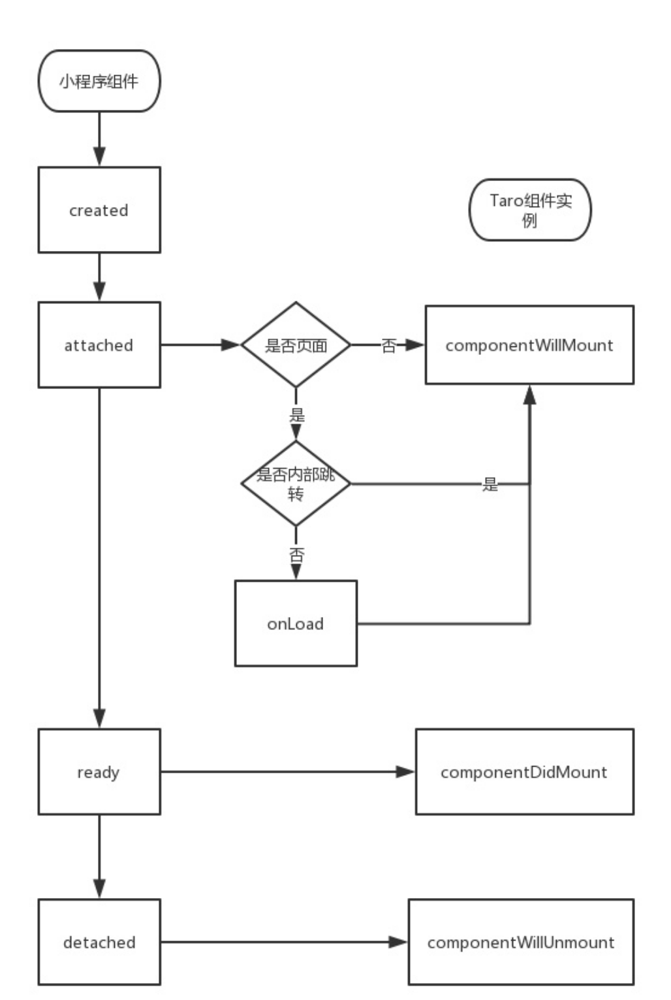

> 小程序页面的`componentWillMount` 有一点特殊，会有两种初始化方式。由于小程序的页面需要等到 `onLoad` 之后才可以获取到页面的路由参数，因此如果是启动页面，会等到 `onLoad` 时才会触发。而对于小程序内部通过 `navigateTo`等 API 跳转的页面，Taro 做了一个兼容，调用 `navigateTo` 时将页面参数存储在一个全局对象中，在页面 `attached` 的时候从全局对象里取到，这样就不用等到页面 `onLoad` 即可获取到路由参数，触发 `componentWillMount`生命周期...

**状态更新**

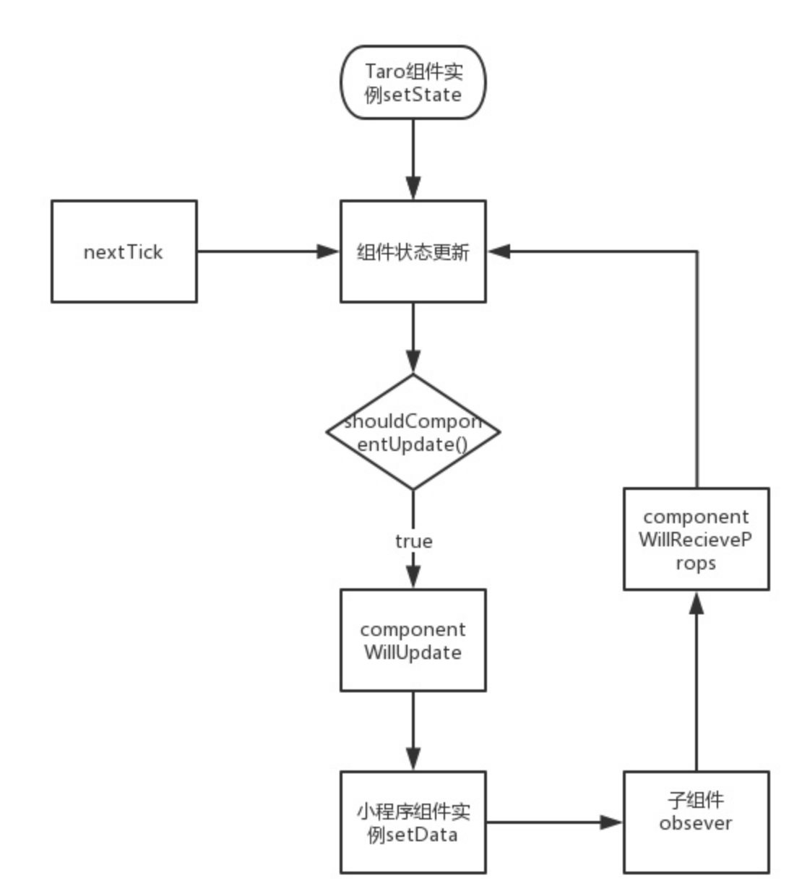

- Taro 组件的 `setState` 行为最终会对应到小程序的`setData`。Taro 引入了如 `nextTick` ，编译时识别模板中用到的数据，在 setData 前进行数据差异比较等方式来提高 `setState`的性能。
- 如上图，组件调用 `setState` 方法之后，并不会立刻执行组件更新逻辑，而是会将最新的 `state` 暂存入一个数组中，等 `nextTick` 回调时才会计算最新的 `state` 进行组件更新。这样即使连续多次的调用`setState` 并不会触发多次的视图更新。在小程序中 `nextTick` 是这么实现的...

  const nextTick = (fn, ...args) => {
  fn = typeof fn === 'function' ? fn.bind(null, ...args) : fn
  const timerFunc = wx.nextTick ? wx.nextTick : setTimeout
  timerFunc(fn)
  }...

> 除了计算出最新的组件 `state` ，在组件状态更新过程里还会调用前面提到过的 `_createData` 方法，得到最终小程序组件的 `data`，并调用小程序的 `setData` 方法来进行组件的更新

### 7.4 事件处理函数对应

在小程序的组件里，事件响应函数需要配置在 methods 字段里。而在 JSX 里，事件是这样绑定的：

    <View onClick={this.handleClick}></View>

编译的过程会将 JSX 转换成小程序模板：

    <view bindclick="handleClick"></view>...

在`createComponent` 方法里，会将事件响应函数 `handleClick` 添加到 `methods` 字段中，并且在响应函数里调用真正的 `this.handleClick`方法。

在编译过程中，会提取模板中绑定过的方法，并存到组件的 `$events` 字段里，这样在运行时就可以只将用到的事件响应函数配置到小程序组件的 `methods` 字段中。

在运行时通过 `processEvent` 这个方法来处理事件的对应，省略掉处理过程，就是这样的...

    function processEvent (eventHandlerName, obj) {
      obj[eventHandlerName] = function (event) {
        // ...
    	scope[eventHandlerName].apply(callScope, realArgs)
      }
    }

> 这个方法的核心作用就是解析出事件响应函数执行时真正的作用域 `callScope` 以及传入的参数。在 `JSX`里，我们可以像下面这样通过 `bind`传入参数：

    <View onClick={this.handleClick.bind(this, arga, argb)}></View>

> 小程序不支持通过 `bind` 的方式传入参数，但是小程序可以用 `data` 开头的方式，将数据传递到 `event.currentTarget.dataset` 中。编译过程会将 `bind` 方式传递的参数对应到`dataset` 中，`processEvent` 函数会从 `dataset` 里取到传入的参数传给真正的事件响应函数。

至此，经过编译之后的 Taro 组件终于可以运行在小程序环境里了...

### 7.5 对 API 进行 Promise 化的处理

> Taro 对小程序的所有 API 进行了一个分类整理，将其中的异步 API 做了一层 `Promise`化的封装。例如，`wx.getStorage`经过下面的处理对应到`Taro.getStorage`(此处代码作示例用，与实际源代码不尽相同)

    Taro['getStorage'] = options => {
      let obj = Object.assign({}, options)
      const p = new Promise((resolve, reject) => {
    	['fail', 'success', 'complete'].forEach((k) => {
    	  obj[k] = (res) => {
    	    options[k] && options[k](res)
    	    if (k === 'success') {
    		  resolve(res)
    	    } else if (k === 'fail') {
    		  reject(res)
    	    }
    	  }
    	})
    	wx['getStorage'](obj)
      })
      return p
    }...

就可以这么调用了：

    // 小程序的调用方式
    Taro.getStorage({
      key: 'test',
      success() {

      }
    })
    // 在 Taro 里也可以这样调用
    Taro.getStorage({
      key: 'test'
    }).then(() => {
      // success
    })...

## 八、H5 运行时

### 8.1 H5 运行时解析

> 首先，我们选用`Nerv`作为 `Web` 端的运行时框架。你可能会有问题：同样是类`React`框架，为何我们不直接用`React`，而是用`Nerv`呢？

为了更快更稳。开发过程中前端框架本身有可能会出现问题。如果是第三方框架，很有可能无法得到及时的修复，导致整个项目的进度受影响。Nerv 就不一样。作为团队自研的产品，出现任何问题我们都可以在团队内部快速得到解决。与此同时，Nerv 也具有与 React 相同的 API，同样使用 Virtual DOM 技术进行优化，正常使用与 React 并没有区别，完全可以满足我们的需要。

使用 Taro 之后，我们书写的是类似于下图的代码...

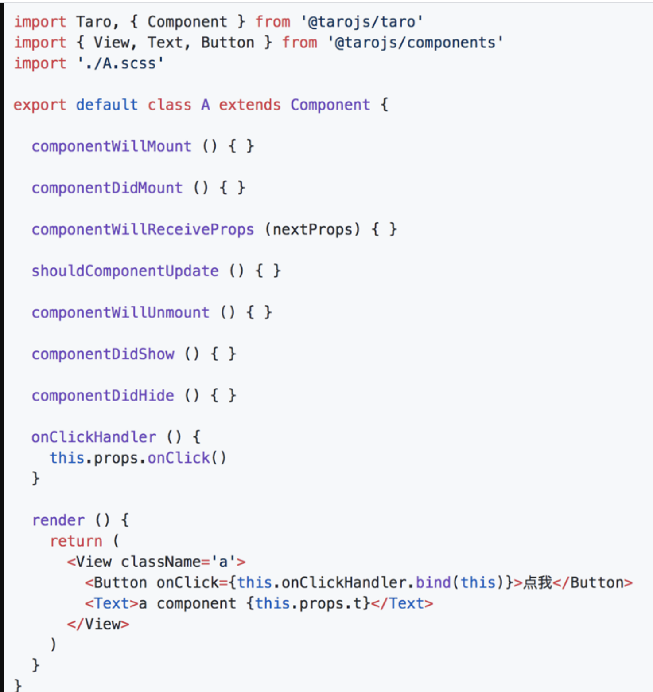

> 我们注意到，就算是转换过的代码，也依然存在着`view`、`button`等在 `Web` 开发中并不存在的组件。如何在 `Web` 端正常使用这些组件？这是我们碰到的第一个问题

#### 8.1.1 组件实现

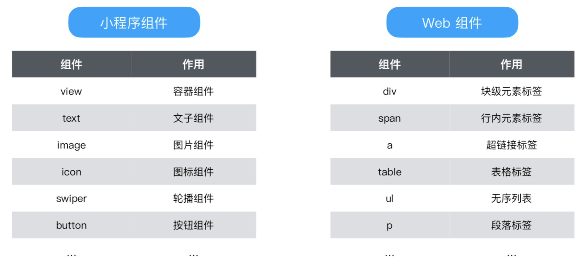

作为开发者，你第一反应或许会尝试在编译阶段下功夫，尝试直接使用效果类似的 Web 组件替代：用`div`替代`view`，用`img`替代`image`，以此类推。

费劲心机搞定标签转换之后，上面这个差异似乎是解决了。但很快你就会碰到一些更加棘手的问题：`hover-start-time`、`hover-stay-time`等等这些常规 Web 开发中并不存在的属性要如何处理？

回顾一下：在前面讲到多端转换的时候，我们说到了`babel`。在 Taro 中，我们使用`babylon`生成 `AST`，`babel-traverse`去修改和移动 `AST` 中的节点。但 babel 所做的工作远远不止这些。

我们不妨去`babel`的 `playground` 看一看代码在转译前后的对比：在使用了`@babel/preset-env`的`BUILT-INS`之后，简单的一句源码`new Map()`，在`babel`编译后却变成了好几行代码...

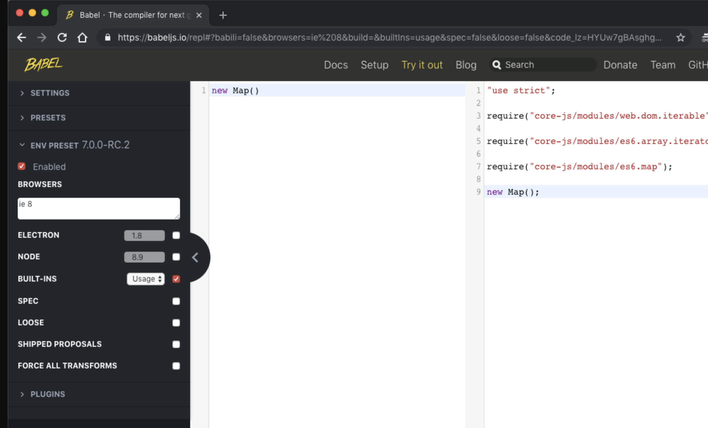

注意看这几个文件：`core-js/modules/web.dom.iterable`，`core-js/modules/es6.array.iterator`，`core-js/modules/es6.map`。我们可以在`core-js`的 `Git` 仓库找到他们的真身。很明显，这几个模块就是对应的 es 特性运行时的实现。

从某种角度上讲，我们要做的事情和 babel 非常像。babel 把基于新版 ECMAScript 规范的代码转换为基于旧 `ECMAScript` 规范的代码，而 Taro 希望把基于 React 语法的代码转换为小程序的语法。我们从 babel 受到了启发：既然`babel`可以通过运行时框架来实现新特性，那我们也同样可以通过运行时代码，实现上面这些 Web 开发中不存在的功能。

举个例子。对于`view`组件，首先它是个普通的类 `React` 组件，它把它的子组件如实展示出来...

    import Nerv, { Component } from 'nervjs';

    class View extends Component {
      render() {
        return (
          
{this.props.children}

        );
      }
    }...

> 接下来，我们需要对`hover-start-time`做处理。与 Taro 其他地方的命名规范一致，我们这个`View`组件接受的属性名将会是驼峰命名法：`hoverStartTime`。`hoverStartTime`参数决定我们将在`View`组件触发`touch`事件多久后改变组件的样式...

    // 示例代码
    render() {
      const {
        hoverStartTime = 50,
        onTouchStart
      } = this.props;

      const _onTouchStart = e => {
        setTimeout(() => {
          // @TODO 触发touch样式改变
        }, hoverStartTime);
        onTouchStart && onTouchStart(e);
      }
      return (
        

          {this.props.children}
        

      );
    }...

> 再稍加修饰，我们就能得到一个功能完整的`Web`版 `View`组件

`view`可以说是小程序最简单的组件之一了。`text`的实现甚至比上面的代码还要简单得多。但这并不说明组件的实现之路上就没有障碍。复杂如`swiper`，`scroll-view`，`tabbar`，我们需要花费大量的精力分析小程序原生组件的 `API`，交互行为，极端值处理，接受的属性等等，再通过 Web 技术实现。...

### 8.2 API 适配

> 除了组件，小程序下有一些 API 也是 Web 开发中所不具备的。比如小程序框架内置的`wx.request/wx.getStorage`等 API；但在 Web 开发中，我们使用的是`fetch/localStorage`等内置的函数或者对象

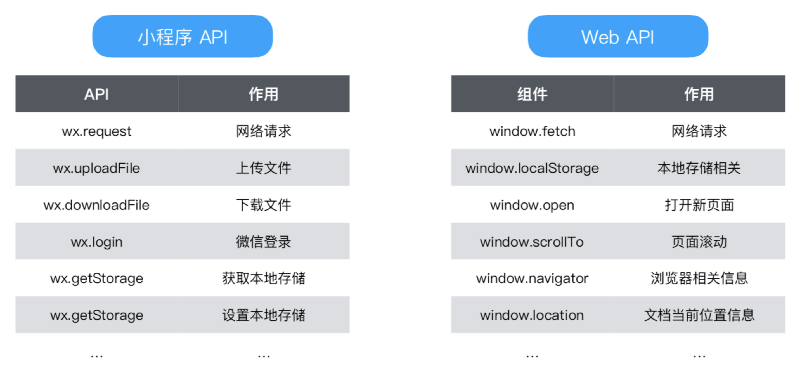

小程序的 API 实现是个巨大的黑盒，我们仅仅知道如何使用它，使用它会得到什么结果，但对它内部的实现一无所知。

如何让 Web 端也能使用小程序框架中提供的这些功能？既然已经知道这个黑盒的入参出参情况，那我们自己打造一个黑盒就好了。

换句话说，我们依然通过运行时框架来实现这些 Web 端不存在的能力。

具体说来，我们同样需要分析小程序原生 API，最后通过 Web 技术实现。有兴趣可以在 Git 仓库中看到这些原生 API 的实现。下面以`wx.setStorage`为例进行简单解析。

`wx.setStorage`是一个异步接口，可以把`key: value`数据存储在本地缓存。很容易联想到，在 Web 开发中也有类似的数据存储概念，这就是`localStorage`。到这里，我们的目标已经十分明确：我们需要借助`于localStorage`，实现一个与`wx.setStorage`相同的 API。...

> 而在 Web 中，如果我们需要往本地存储写入数据，使用的 API 是`localStorage.setItem(key, value)`。我们很容易就可以构思出这个函数的雏形

    /* 示例代码 */
    function setStorage({ key, value }) {
      localStorage.setItem(key, value);
    }

我们顺手做点优化，把基于异步回调的 API 都给做了一层 Promise 包装，这可以让代码的流程处理更加方便。所以这段代码看起来会像下面这样：

    /* 示例代码 */
    function setStorage({ key, value }) {
      localStorage.setItem(key, value);
      return Promise.resolve({ errMsg: 'setStorage:ok' });
    }...

看起来很完美，但开发的道路不会如此平坦。我们还需要处理其余的入参：success、fail 和 complete。success 回调会在操作成功完成时调用，fail 会在操作失败的时候执行，complete 则无论如何都会执行。setStorage 函数只会在 key 值是 String 类型时有正确的行为，所以我们为这个函数添加了一个简单的类型判断，并在异常情况下执行 fail 回调。经过这轮变动，这段代码看起来会像下面这样...

    /* 示例代码 */
    function setStorage({ key, value, success, fail, complete }) {
      let res = { errMsg: 'setStorage:ok' }
      if (typeof key === 'string') {
        localStorage.setItem(key, value);
        success && success(res);
      } else {
        fail && fail(res);
        return Promise.reject(res);
      }
      complete && complete(res);
      return Promise.resolve({ errMsg: 'setStorage:ok' });
    }...

把这个 API 实现挂载到 Taro 模块之后，我们就可以通过`Taro.setStorage`来调用这个 API 了。

当然，也有一些 API 是 Web 端无论如何无法实现的，比如`wx.login`，又或者`wx.scanCode`。我们维护了一个 API 实现情况的列表，在实际的多端项目开发中应该尽可能避免使用它们...

### 8.3 路由

> 作为小程序的一大能力，小程序框架中以栈的形式维护了当前所有的页面，由框架统一管理。用户只需要调用`wx.navigateTo`,`wx.navigateBack`,`wx.redirectTo`等官方 API，就可以实现页面的跳转、回退、重定向，而不需要关心页面栈的细节。但是作为多端项目，当我们...

小程序的路由比较轻量。使用时，我们先通过`app.json`为小程序配置页面列表：

    {
      "pages": [
        "pages/index/index",
        "pages/logs/logs"
      ],
      // ...
    }

> 在运行时，小程序内维护了一个页面栈，始终展示栈顶的页面（`Page`对象）。当用户进行跳转、后退等操作时，相应的会使页面栈进行入栈、出栈等操作

同时，在页面栈发生路由变化时，还会触发相应页面的生命周期

**对于 Web 端单页应用路由，我们则以 react-router 为例进行说明**

- 首先，`react-router`开始通过`history`工具监听页面路径的变化。
- 在页面路径发生变化时，`react-router`会根据新的`location`对象，触发 UI 层的更新。
- 至于 UI 层如何更新，则是取决于我们在 Route 组件中对页面路径和组件的绑定，甚至可以实现嵌套路由。
- 可以说，`react-router`的路由方案是组件级别的。
- 具体到`Taro`，为了保持跟小程序的行为一致，我们不需要细致到组件级别的路由方案，但需要为每次路由保存完整的页面栈。
- 实现形式上，我们参考`react-router`：监听页面路径变化，再触发`UI` 更新。这是`React`的精髓之一，单向数据流...

> `@tarojs/router`包中包含了一个轻量的`history`实现。`history`中维护了一个栈，用来记录页面历史的变化。对历史记录的监听，依赖两个事件：`hashchange`和`popstate`。

    /* 示例代码 */
    window.addEventListener('hashchange', () => {});
    window.addEventListener('popstate', () => {})

- 对于使用 `Hash`模式的页面路由，每次页面跳转都会依次触发`popstate`和`hashchange`事件。由于在`popstate`的回调中可以取到当前页面的 `state`，我们选择它作为主要跳转逻辑的容器。
- 作为 UI 层，`@tarojs/router`包提供了一个`Router`组件，维护页面栈。与小程序类似，用户不需要手动调用`Router`组件，而是由 Taro 自动处理。
- 对于历史栈来说，无非就是三种操作：`push`, `pop`，还有`replace`。在历史栈变动时触发`Router`的回调，就可以让`Router`也同步变化。这就是 Taro 中路由的基本原理...

### 8.4 Redux 处理

- 每当提到 React 的数据流，我们就不得不提到 Redux。通过合并 Reducer，Redux 可以让大型应用中的数据流更加规则、可预测。
- 我们在 Taro 中加入了 Redux 的支持，通过导入`@tarojs/redux`，即可在小程序端使用 Redux 的功能。
- 对于 Web 端，我们尝试直接使用`nerv-redux`包提供支持，但这会带来一些问题...

  import Nerv from 'nervjs'
  import { connect } from 'nerv-redux'

  @connect(() => {})
  class Index extends Nerv.Componnet {
  componentDidShow() { console.log('didShow') }
  componentDidMount() { console.log('didMount') }
  render() { return '' }
  }...

- 回想一下前面讲的`componentDidShow`的实现：我们继承，并且改写 `componentDidMount`。
- 但是对于使用 Redux 的页面来说，我们继承的类，是经过`@connect`修饰过的一个高阶组件。
- 问题就出在这里：这个高阶组件的签名里并没有`componentDidShow`这一个函数。所以我们的 `componentDidMount` 内，理所当然是取不到`componentDidShow`的。
- 为了解决这个问题，我们对`react-redux`代码进行了一些小改装，这就是`@taro/redux-h5`的由来...

## 九、更多参考

- [Taro 官方文档(opens new window)][taro_opens new window]

[Image 1]:
[opens new window]: https://smartprogram.baidu.com/docs/develop/devtools/show_sur/
[opens new window 1]: https://docs.alipay.com/mini/developer/getting-started/
[opens new window 2]: https://nervjs.github.io/taro/docs/react-native.html
[tj_commander.js_opens new window]: https://github.com/tj/commander.js/
[jprichardson_node-fs-extra_opens new window]: https://github.com/jprichardson/node-fs-extra
[chalk_chalk_opens new window]: https://github.com/chalk/chalk
[SBoudrias_Inquirer.js - Node.js_opens new window]: https://github.com/SBoudrias/Inquirer.js/
[sindresorhus_ora_opens new window]: https://github.com/sindresorhus/ora
[SBoudrias_mem-fs-editor_opens new window]: https://github.com/sboudrias/mem-fs-editor
[shelljs_shelljs _opens new window]: https://github.com/shelljs/shelljs
[ASTExploroer_opens new window]: https://astexplorer.net/
[Taro_opens new window]: https://nervjs.github.io/taro/docs/GETTING-STARTED.html
