> 软件开发的时间通常是这样的：一开始的 90% 开发工作用掉了整个计划 90% 的时间，剩下的 10% 同样需要整个计划 90% 的时间，而最终发布前的修改也是如此。—— 汤姆 · 嘉吉

当你看到这里，相信你已经做好了准备（一台折腾得起的电脑和一颗肯行动的心），准备跟着我一同进入 `Uniapp` 的世界。

正所谓工欲善其事，必先利其器（这句话我经常说:>），我们要开发微信小程序和 app，有两个工具是必不可少的：

1.  微信开发者工具
2.  HbuilderX

注意：配置与安装方法 windows 系统一致。

## 微信开发者工具

我们要做的应用需要编译成小程序，因此也要[下载微信开发者工具][link 1]进行编译预览效果。

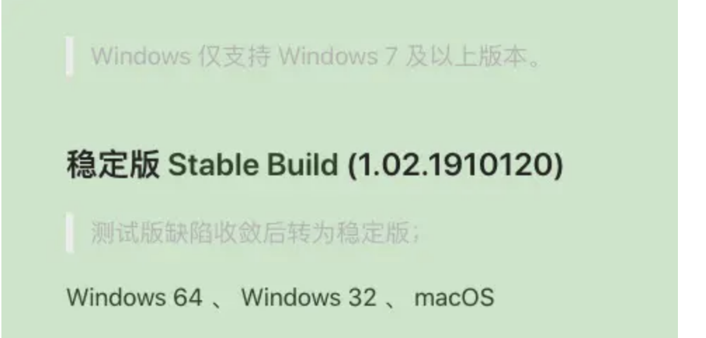

找到对应版本，下载安装，完成打开

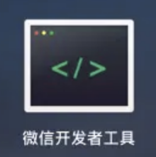

这里先做个配置，找到菜单 【设置】 >> 【安全设置】，该配置可以使 Uniapp 使用命令行调用微信开发者工具，实现项目的预览与热更新

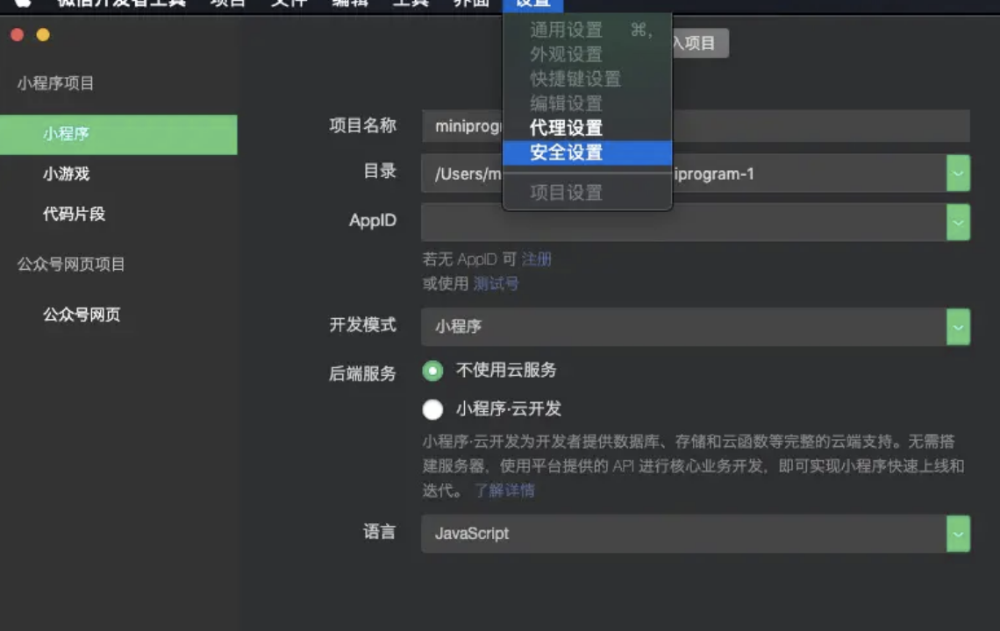

把服务端口选择开启即可

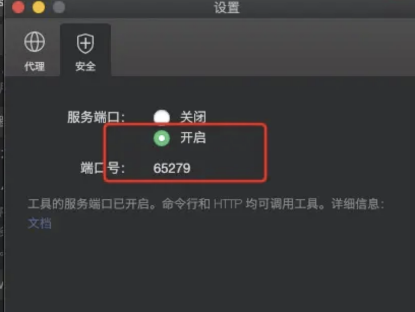

这里如果不开启，接下来的调试会报以下错

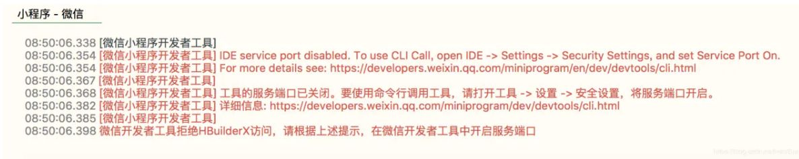

## HbuilderX

打开 [HbuilderX 官方][hbuilderx]，使用 Uniapp 框架开发项目搭配官方的编辑器 HBuilderX 开发，编辑器集成了 node，添加了很多底层配置。无需复杂的安装，开箱即用并且搭配了可视化界面，可以轻松编辑。

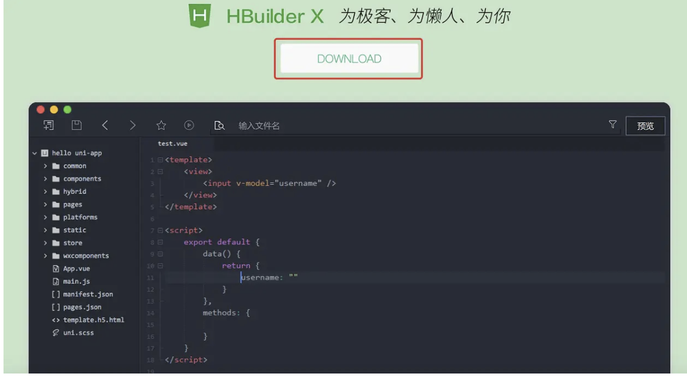

下载对应安装包（我的是 Mac 机），下载选择一个 App 开发版本（App 开发版已集成相关插件、开箱即用），下载成功后直接解压：

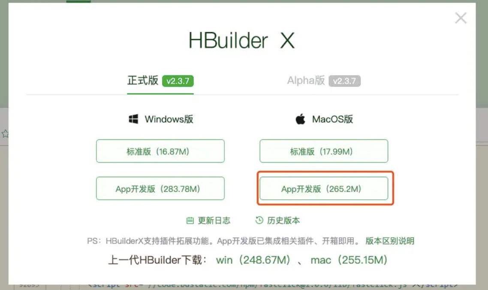

一顿操作后找到这个图标打开，打开基本上可以达到秒开。

如果你熟悉了其他大众化的编译器，完全可以无缝衔接过来，因为可以快捷键切换，这样还是同样的配方，熟悉的味道，不用再次学习。打开编译器，空白区域可看快捷键方案设置，点击选择即可。

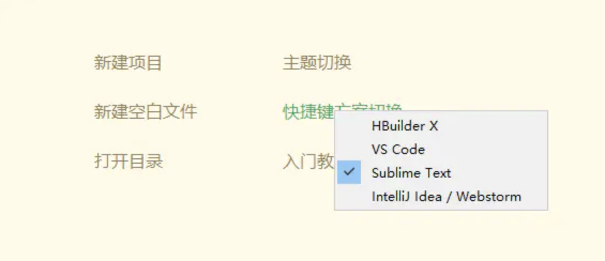

然后修改主题 【工具】>>【主题】>>【酷黑】，即可看到熟悉的 IDE 的界面。

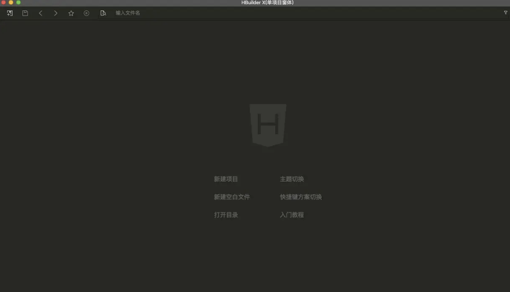

## 新建项目

【选择新建项目】 >> 【uni-app】 >> 【默认模板】 >> 【创建】；选择 uni-app(U) 创建项目是为了开发者编写一套代码，可发布到 iOS、Android、H5、以及各种小程序。

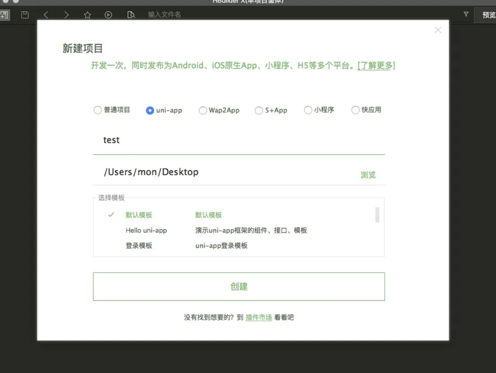

一秒创建成功

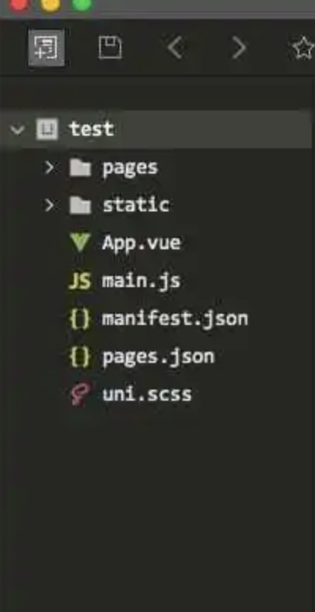

目录结构：

- pages 业务页面文件存放的目录
- static 静态文件目录(images 之类)
- App.vue App 全局应用配置
- main.js 初始化入口文件
- manifest.json 多端配置信息
- pages.json 配置页面路由、导航等信息，类似原生小程序的 app.json

## 插件配置

选择菜单 【工具】 >> 【插件安装】

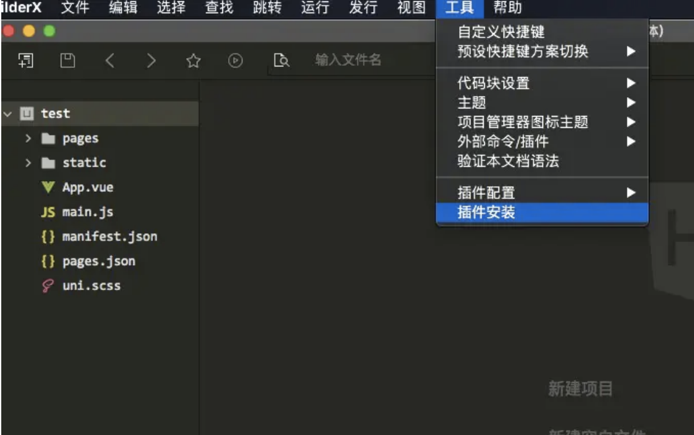

建议安装这些：

- NPM
- 内置浏览器
- 内置终端
- App 真机运行
- uni-app 编译
- Git 插件
- js-beautify
- prettier
- htmlhint
- stylelint
- eslint-plugin-vue
- eslint-js
- js 压缩
- css 压缩
- scss/sass 编译
- es6 编译

其余根据自己需要安装。

## 运行 Uniapp 项目

上面的配置插件完成之后，就可以小试一下刚才的项目了，运行 Uniapp 项目主要有 3 种方式：

- 浏览器
- 小程序
- 手机 App

由于手机预览调试操作介绍内容比较长，我们会在后面章节小程序、app 调试环境配置中展开细说。这里简单说一下浏览器预览。

HBuilder 可能检测不到的浏览器所在位置，所有的运行配置都需要对应上你在本机安装的浏览器的安装路径才能进行命令行启动预览。小程序，手机的运行配置一致。 选择菜单【工具】>>【设置】>>【运行配置】：

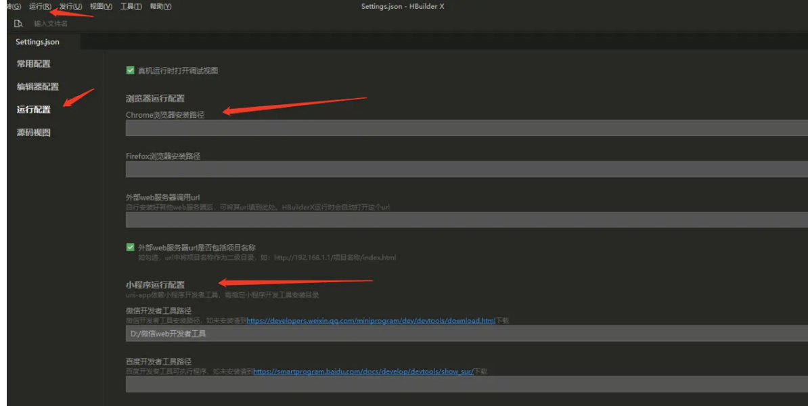

完成 chrome 等浏览器运行配置，操作 【运行】>>【运行到浏览器】>>【chrome】，HBuilder 会在底部开启终端，实行项目更新与热编译的检测：

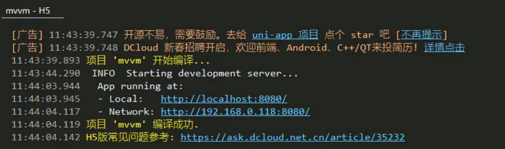

## Git

项目开发中，源码管理工具必不可少，比如 Git，但这里我不想花太多篇幅去讲解如何安装配置 Git 以及它的基础概念，这里有一篇更棒的文章很好地解释了 Git：[Git 简明指南][git]。

## FAQ

有人会说，官方文档写得足够详细了，为什么还要看你的呢？这么说吧，官方文档更像一份新华字典，大而全，可以反复查阅，而我的章节更像一份干货小结，来源于项目用于项目。本课程基于官方文档，但是高于官方文档。

## 小结

磨刀不误砍柴工，只有刀磨锋利，接下来才会更顺手。

[link 1]: https://developers.weixin.qq.com/miniprogram/dev/devtools/download.html
[image-20210215142448474]: https://s.poetries.work/images/image-20210215142448474.png
[image-20210215142500753]: https://s.poetries.work/images/image-20210215142500753.png
[image-20210215142513328]: https://s.poetries.work/images/image-20210215142513328.png
[image-20210215142524587]: https://s.poetries.work/images/image-20210215142524587.png
[image-20210215142537280]: https://s.poetries.work/images/image-20210215142537280.png
[hbuilderx]: https://www.dcloud.io/hbuilderx.html
[image-20210215142551362]: https://s.poetries.work/images/image-20210215142551362.png
[image-20210215142603246]: https://s.poetries.work/images/image-20210215142603246.png
[image-20210215142616773]: https://s.poetries.work/images/image-20210215142616773.png
[image-20210215142632695]: https://s.poetries.work/images/image-20210215142632695.png
[image-20210215142647183]: https://s.poetries.work/images/image-20210215142647183.png
[image-20210215142700433]: https://s.poetries.work/images/image-20210215142700433.png
[image-20210215142711714]: https://s.poetries.work/images/image-20210215142711714.png
[image-20210215142725132]: https://s.poetries.work/images/image-20210215142725132.png
[image-20210215142735096]: https://s.poetries.work/images/image-20210215142735096.png
[image-20210215142754363]: https://s.poetries.work/images/image-20210215142754363.png
[image-20210215142805646]: https://s.poetries.work/images/image-20210215142805646.png
[git]: http://rogerdudler.github.io/git-guide/index.zh.html
