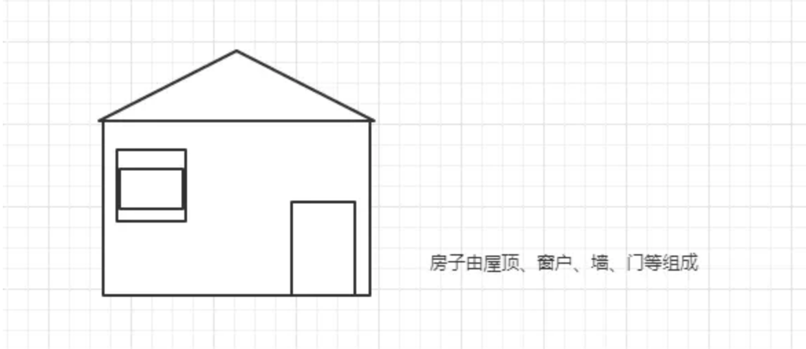
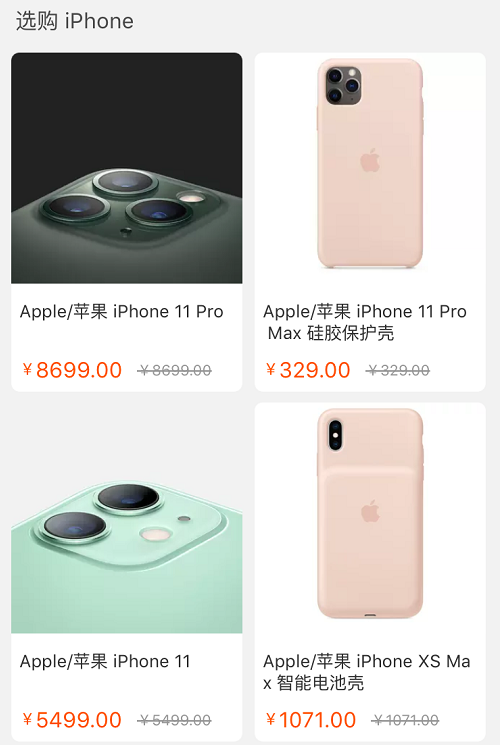

## 什么是组件？

开篇我们先简单聊一下前端组件化。什么是组件化？在前端界，特别是现在 React，Vue，Angular 几大流行开发框架的盛行的时代下，已经把组件化的设计思想推向了一个新的高度了，出现了框架与组件共同繁荣的景象。

组件简单的来说就是可实现独立的功能的单一整体代码片段，无论把这个片段放在哪里，它还是保持着原有的功能和样式，从而可以实现复用，这种整体独立化的设计思想就是组件化，而这样设计出来的单一整体代码片段叫做组件。这样的设计可以非常灵活的使用在项目中，项目设计更具系统性，从而提高了项目管理开发效率。

如果上面说的比较拗口，来点简单的。比如一座房子，把房子看成一个独立的整体由屋顶、窗户、门，墙等组成。

用代码来表示就是：

    <template>
        <!-- 这是一个房子 -->
        <view>
            <!-- 屋顶 -->
            <roof></roof>
            <!-- 墙 -->
            <wall></wall>
            <!-- 窗户 -->
            <window></window>
            <!-- 门 -->
            <door></door>
        </view>
    </template>

那么换成一个页面呢？一个完整的页面由页头，内容，页脚等组成：

    <template>
        <view>
            <!-- 页头 -->
            <page-header></page-header>
            <!-- 内容 -->
            <content></content>
            <!-- 页脚 -->
            <pager-footer></pager-footer>
        </view>
    </template>

那我们在开发页面的时候，头部和尾部都是固定不变的，只要内容更改就行。在开发框架中，页面其实也是作为组件化的一部分，但是我们组件更多关注的是页面的每个部件，比如头部，内容区，弹出框甚至确认按钮都可以作为一个组件，每个组件有独立的 HTML、css、js 代码。

## 基础组件

Uniapp 根据多端的特性以 Vue 语法糖 + 小程序的 API 打造了一大批组件，这些组件在开发的时候以 HBuliderX 为 IDE，生产的时候把那些代码编译转换为各个平台特性的语法与 API。

Uniapp 框架根据组件的设计思想为我们设计提供了一系列的基础组件，我们可以通过组合这些基础组件进行快速开发。每一个基础组件都独立定义了样式与功能， 这些基础组件中比如 button 组件，你可以设置按钮的大小，文字样式，里面的回调时机，这个按钮组件具有独立的并且有完整的多样化功能，相当于我们以参数的形式去定义这个按钮。

Uniapp 基础组件分为以下八大类：

- 视图容器（View Container）
- 基础内容（Basic Content）
- 表单组件（Form）
- 导航（Navigation）
- 媒体组件（Media）
- 地图（Map）
- 画布（Canvas）
- webview（Web-view）

这些基础的组件可以让我们快速的开发项目，由于每个人都处理的业务功能都不一样，就需要根据自己的业务情况去定制一个组件。如果 Uniapp 基础组件没有你想要的组件，而你又需要一个代码片段来实现功能的复用，那么你可以根据组件规范来注册属于自己自定义的组件。

## 自定义组件

在数据绑定的三大框架 Angular、React、Vue 中，所有的元素都可以细分为一个组件，甚至是一个页面。这个组件可以重复的复用，组件的使用也造就了当今的前端的繁华的原因之一，当然现在使用的 Uniapp 也不例外，合成小程序，weex，h5 等的共有特性。

一个组件由三大部分组成：template 模板，js 数据交互和 css 样式层：

    <template>
        <view class="content">
           <image class="logo" src="/static/logo.png"></image>
           <button @tap="getMsg">{{title}}</button>
        </view>
    </template>

    

    

可以看到上面主要由三个主要元素组成 `template` ， `script` ，`style`。

1.  html 部分由 `template` 标签元素闭合组成，其余 `view`, `image` 元素遵循[小程序的元素][link 1]定义组成，需要注意的是组件元素必须有一个根元素（root element）包裹，不然会报错编译失败。
2.  `script` 部分由 ES6 的 `export default` 导出整个页面模块，可以在其他页面引入该组件。

- `props` 是申明需要从父组件接收的数据
- `data` 数据部分是一个函数，返回该页面实例下的所有数据引用，data 必须声明为返回一个初始数据对象的函数；否则该组件关闭时，数据不会自动销毁，再次打开该组件时，会显示上次数据。

      //正确用法，使用函数返回对象
      data() {
          return {
              title: 'Hello'
          }
      }

      //错误写法，会导致再次打开页面时，显示上次数据
      data: {
          title: 'Hello'
      }

  `props` 中声明的数据与组件 `data` 函数 `return` 的数据主要区别就是 `props` 的来自父级，而 `data` 中的是组件自己的数据，作用域是组件本身，这两种数据都可以在模板 `template` 及计算属性 `computed` 和方法 `methods` 中使用。

- `created` 组件生命周期函数, 还有 `beforeCreate` , `beforeMount` 等生命周期与 Vue 标准组件的生命周期相同，但没有页面级的 onLoad 等生命周期。
- `methods` 是事件处理函数对象，包含整个页面交互及逻辑处理的函数。在上面例子中我定义了一个 tap 事件在 methods 中，当用户触碰（tap）的时候就会打印这个文字。
- `this.$emit('getMsg', this)` 这一句是该组件通过 `this.$emit()` 派发事件，引用这个组件的地方可以利用 $on 对事件进行监听，实现参数的传递与事件向上传递，当前的 this 指的是该组件本身，指针指向当前组件。通俗的话就是，我传递一个叫 `getMsg` 事件并当前所有的参数内容出去，你只要在外面接收就可以了。

1.  css 部分由 `style` 标签组成，这里面样式只作用当前的元素。style 支持 css3 标准，不用再写多余的 hack，比如 `-webkit-` 前缀等，已经由整个框架完成 hask 编译, 可以看到 style 标签有个 `lang="scss"`,说明里面的样式表可以直接以 [scss][] 形式书写，当然 `lang` 的属性值还可以是 [less][],[stylus][]，找到合适自己的 css 预编译期可以事半功倍。

父子组件（组件引用者与组件）的关系可以总结为 props 向下传递，事件向上传递。父组件通过 props 给子组件下发数据，子组件通过事件给父组件发送消息。

注意：

1.  所有组件与属性名都是小写，单词之间以连字符-连接。
2.  根节点为 `<template>`，这个 `<template>` 下只能有一个根 `<view>` 组件。

Uniapp 并没有限制使用 HTML 标签，如果开发者写了 div 等标签，在编译到非 H5 平台时也会被编译器转换为 view 标签，类似的还有 span 转 text 、a 转 navigator 等，包括 css 里的元素选择器也会转。但为了管理方便、策略统一，新写代码时仍然建议使用 view 等组件。

## 自定义完成一个商品卡片组件

一个商品信息由商品图片，商品名称，商品价格，商品参考价组成。

实现步骤：

1. 建立组件模板。  2. 准备组件的数据输入，定义 props 里面的数据、类型。  3. 准备好组件的数据输出。即根据组件逻辑，做好要暴露出来的方法。  4. 封装完成，进行命名调用。

在 components 文件夹创建 song.vue 文件:

    <template>
        <view class="song">
            <image class="img" :src="imgSrc"></image>
            <view class="desc">{{ title }}</view>
            <view class="flex-box">
                <view class="price">￥{{price}}</view>
                <view class="market-price">{{marketPrice}}</view>
            </view>
        </view>
    </template>

    
    

上面的组件的图片路径、商品名称、价格、市场价都经过 props 定义，只要在引用这个组件的页面里传值就行。

这样我们在首页 /pages/index.vue 就可以引用这个组件了

    <template>
        <view class="content">
            <song
                :imgSrc="song.img"
                :title="song.title"
                :price="song.price"
                :marketPrice="song.marketPrice"
            />
        </view>
    </template>

    

    

课程代码里面有列表数据循环，父子组件之间事件的传递的代码示例。

## 全局组件

Uniapp 支持配置全局组件，需在 `main.js` 里进行全局注册，注册后就可在所有页面里使用该组件。

### 但是

- Vue.component 的第一个参数必须是静态的字符串。
- nvue 页面暂不支持全局组件 注：建议统一用按需页面引入组件

`main.js`里进行全局导入和注册

    import Vue from 'vue'
    import pageHead from './components/page-head.vue'
    Vue.component('page-head', pageHead)

index.vue 里可直接使用组件

    <template>
      <view>
        <page-head></page-head>
      </view>
    </template>

## 非 H5 端不支持列表

Uniapp 只支持 Vue 单文件组件（ .vue 组件）。其他的诸如：动态组件，自定义 render 和 `<script type="text/x-template">` 字符串模版等，在非 H5 端不支持。

- Slot（scoped 暂时还没做支持）
- 动态组件
- 异步组件
- inline-template
- X-Templates
- keep-alive
- transition （可使用 animation 或 CSS 动画替代）
- 老的非自定义组件编译模式不支持在组件引用时，在组件上定义 click 等原生事件、v-show（可用 v-if 代替）和 class style 等样式属性(例：`<card class="class-name"> </card>` 样式是不会生效的)。建议更新为自定义组件模式。
- 老的非自定义组件编译模式组件里使用 slot 嵌套的其他组件时不支持 v-for。建议更新为自定义组件模式。

注意

在 Uniapp 中有些关键字做了保留，不可作为组件名，所以建议自定义组件时加上前缀，类似 `xm-button`。

## 小结

1.  组件是可实现独立的功能的单一整体代码片段，无论把这个片段放在哪里，它还是保持着原有的功能和样式，从而可以实现复用，这种整体独立化的设计思想就是组件化，而这样设计出来的单一整体代码片段叫做组件；
2.  如果框架的功能组件满足不了你，你就需要根据组件的规范自己定义一个组件；
3.  全局组件可以挂在到 Vue 实例中，作用在每一个页面文件上；
4.  本章代码 [uni-course-components][]

[image-20210215143641799]: https://s.poetries.work/images/image-20210215143641799.png
[link 1]: https://developers.weixin.qq.com/miniprogram/dev/component/
[scss]: https://www.sass.hk/
[less]: http://lesscss.cn/
[stylus]: https://stylus-lang.net/
[img]: https://s.poetries.work/images/16e71e5e856e06c3.png
[uni-course-components]: https://github.com/front-end-class/uniapp-music-code/blob/master/uni-course-components.zip
