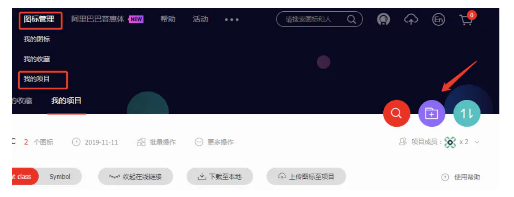
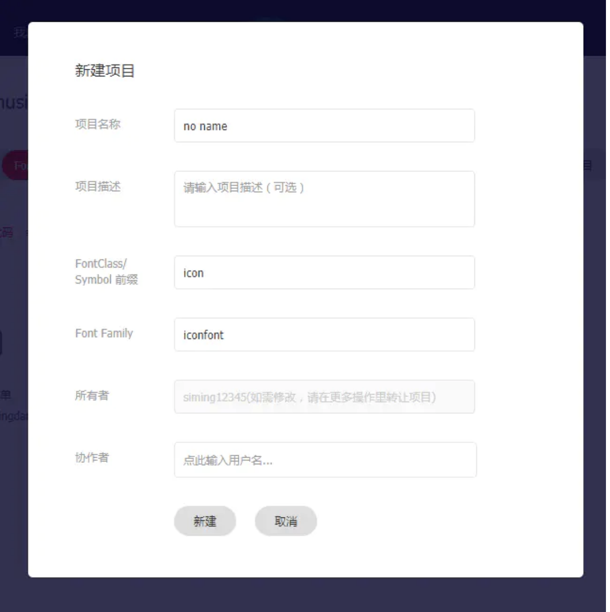
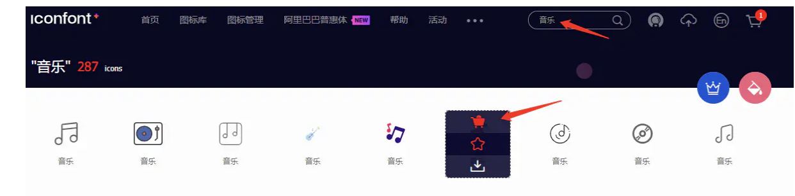
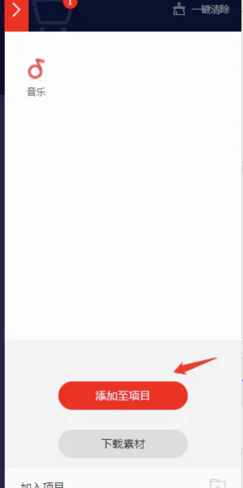
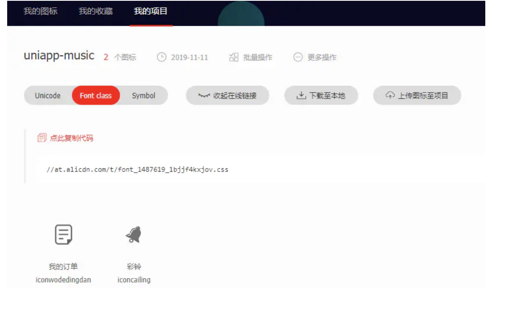
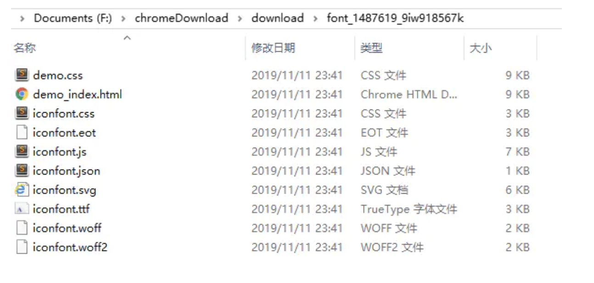
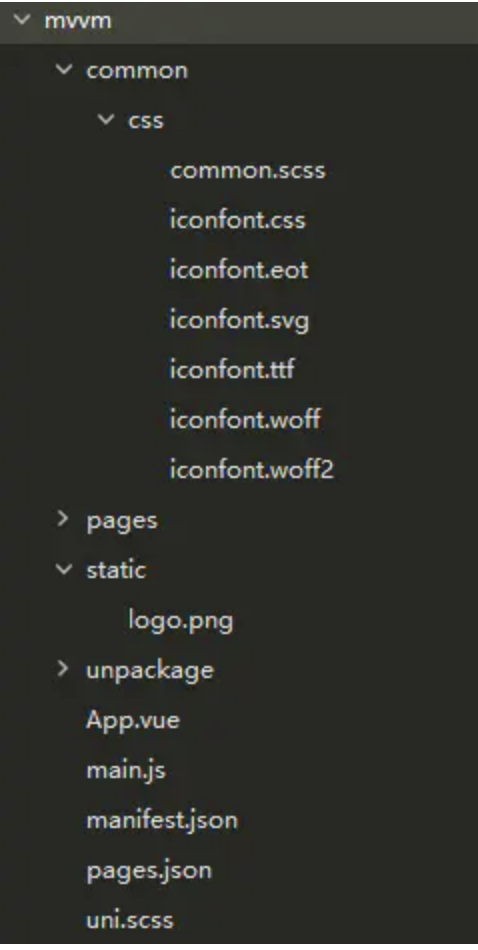
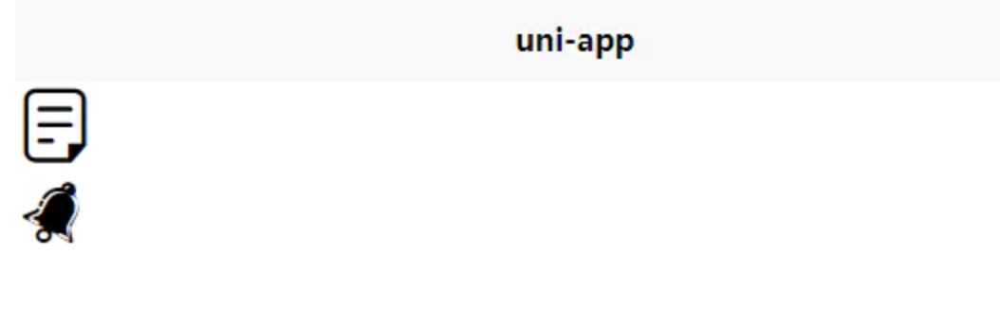
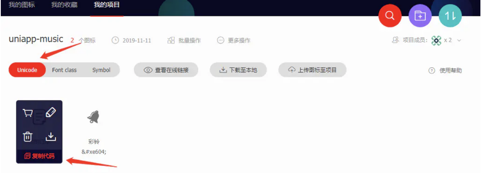
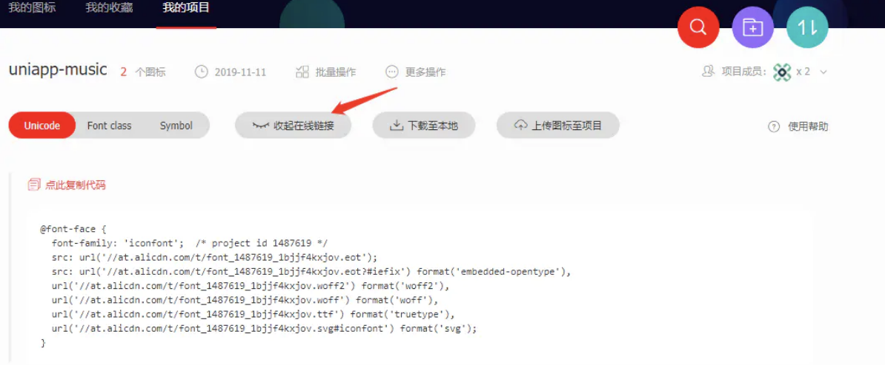

---

## sidebarDepth: 2

本章主要讲解如何建立图标库，并在 Uniapp 中应用字体图标。

我们在做项目的时候，使用的图标会很多，全都以图片形式加载的话，整个文件体积会变得非常大，不仅会增加额外的 http 请求，还会有图片放大后失真的问题，在小程序开发当中，整个小程序所有代码量大小不超过 12M。如果没有很合理的运用与优化，加载速度也会大打折扣。

## 为什么要使用字体图标

- 字体图标是矢量图标，可进行无限缩放不失真，一旦字体加载了，图标就会马上渲染出来，不需要下载一个个图像
- 加载字体图标无需 http 请求，字体图标体积更小，相较图片加载速度更快
- 兼容性方面，字体图标支持现代浏览器，甚至是低版本的 IE 浏览器
- 可以像页面中的文字一样，通过 font-size 属性来对其进行大小的设置，而且还可以添加各种文字效果，如 color、hover、filter、text-shadow、transform 等效果

这里安利我常用的字体图标库，[Iconfont-阿里巴巴矢量图标库][iconfont-]\-国内功能很强大且图标内容很丰富的矢量图标库,提供矢量图标下载、在线存储、格式转换等功能。阿里巴巴体验团队倾力打造,设计和前端开发的便捷工具。

## 使用 iconfont 图标库

在阿里图标库里，可以找到非常多各式各样的字体图标，并且可以私人上传定制图标库，与团队协同开发管理图标。首次登录需要先捆绑账号，支持 github 及新浪微博快捷入口登录。登录后点击【图标管理】>>【我的项目】进入项目页面：

进入页面点击右侧紫色的添加图标新建一个项目，点进出现弹窗，在弹出的弹窗中填好项目名称及项目描述，然后点击新建：

回到图标库，在搜索框中输入自己想要的图标，并鼠标悬浮到具体图标中，点击购物车（添加入库），此时你的购物车会添加 1：

找到所有想要的图标并添加进购物车后，点击右上角购物车的图标，将购物车里的图标添加至项目，选择刚才新建的项目：

回到我的项目页面，点击**下载至本地**按钮，解压即可：

## 在项目中使用 iconfont

第一步，解压文件

将上面下载的文件解压缩后可以看到以下内容，woff，woff2，ttf，eot 后缀名的等都是字体文件：

查看 iconfont.css 样式表中如何引用这些字体文件，并且可以清楚知道，引用了四个字体文件加上一个 svg 文件：

    @font-face {font-family: "iconfont";
      src: url('iconfont.eot?t=1573520590765'); /* IE9 */
      src: url('iconfont.eot?t=1573520590765#iefix') format('embedded-opentype'), /* IE6-IE8 */
      url('data:application/x-font-woff2;charset=utf-8;base64,d0...') format('woff2'),
      url('iconfont.woff?t=1573520590765') format('woff'),
      url('iconfont.ttf?t=1573520590765') format('truetype'), /* chrome, firefox, opera, Safari, Android, iOS 4.2+ */
      url('iconfont.svg?t=1573520590765#iconfont') format('svg'); /* iOS 4.1- */
    }

第二步，引入文件

将上面提到的 5 个文件放入到新建文件夹 common/css 中，放在这里的原因是字体属于全局文件，可以统一管理：

要想在所有页面上生效，就要在 App.vue 引入：

    <!-- App.vue -->
    

**注意：引用字体文件的时候注意使用相对路径，避免查找失败。**

第三步，在页面中使用

    <template>
    	<view class="content">
    		<view class="iconfont"></view>
    		<view class="iconfont"></view>
    	</view>
    </template>

然后就可以在浏览器，小程序上预览效果了：

可能有小伙伴会有疑问，为什么这样做会生效？其实我们在 App.vue 引入 iconfont.css 的时候，样式表`font-family`属性指定了字体文件，作用于`iconfont`命名的元素，并且在字体库中查找对应的 code（以 `iconfont` 命名的元素包裹的字符）：

    <!-- iconfont.css -->
    .iconfont {
      font-family: 'iconfont' !important;
      font-size: 28rpx;
      font-style: normal;
      -webkit-font-smoothing: antialiased;
      -moz-osx-font-smoothing: grayscale;
    }

以 `iconfont` 命名的元素包裹的字符从哪里来呢？就是在 iconfont 项目中把字体图标显示以 Unicode 的形式显示，鼠标悬浮可复制代码：

如果你不想每次都这么麻烦，添加一个图标然后又重复以上操作，你可以使用生成的 cdn 地址：

代码修改调整：

    <!-- iconfont.css -->
    @font-face {
      font-family: 'iconfont';
      src: url('https://at.alicdn.com/t/font_1487619_1bjjf4kxjov.eot');
      src: url('https://at.alicdn.com/t/font_1487619_1bjjf4kxjov.eot?#iefix') format('embedded-opentype'),
      url('https://at.alicdn.com/t/font_1487619_1bjjf4kxjov.woff2') format('woff2'),
      url('https://at.alicdn.com/t/font_1487619_1bjjf4kxjov.woff') format('woff'),
      url('https://at.alicdn.com/t/font_1487619_1bjjf4kxjov.ttf') format('truetype'),
      url('https://at.alicdn.com/t/font_1487619_1bjjf4kxjov.svg#iconfont') format('svg');
    }

注意：小程序不能自动配对 https 的，必须手动添加 `https:`，将 iconfont.css 文件内 url 路径转换为在线路径，加上 `https:`。

### 小结

1.  有效利用字体图标的优势，让你臃肿的项目可以缩小不少，并优化速度；
2.  iconfont 的引入能让你有效的管理图标库；
3.  本章代码 [uni-course-iconfont][]。

[iconfont-]: https://www.iconfont.cn/
[image-20210215145102087]: https://s.poetries.work/images/image-20210215145102087.png
[image-20210215145115364]: https://s.poetries.work/images/image-20210215145115364.png
[image-20210215145128487]: https://s.poetries.work/images/image-20210215145128487.png
[image-20210215145146585]: https://s.poetries.work/images/image-20210215145146585.png
[image-20210215145206187]: https://s.poetries.work/images/image-20210215145206187.png
[image-20210215145221504]: https://s.poetries.work/images/image-20210215145221504.png
[image-20210215145235326]: https://s.poetries.work/images/image-20210215145235326.png
[image-20210215145249407]: https://s.poetries.work/images/image-20210215145249407.png
[image-20210215145302868]: https://s.poetries.work/images/image-20210215145302868.png
[image-20210215145315433]: https://s.poetries.work/images/image-20210215145315433.png
[uni-course-iconfont]: https://github.com/front-end-class/uniapp-music-code/blob/master/uni-course-iconfont.zip
