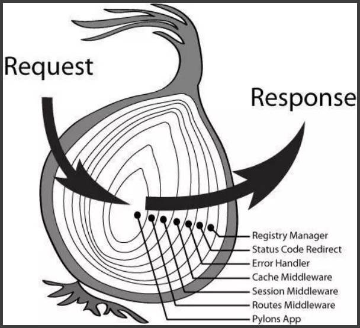
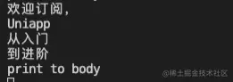
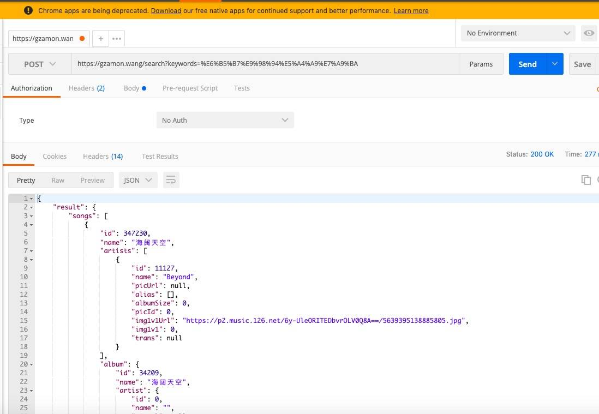
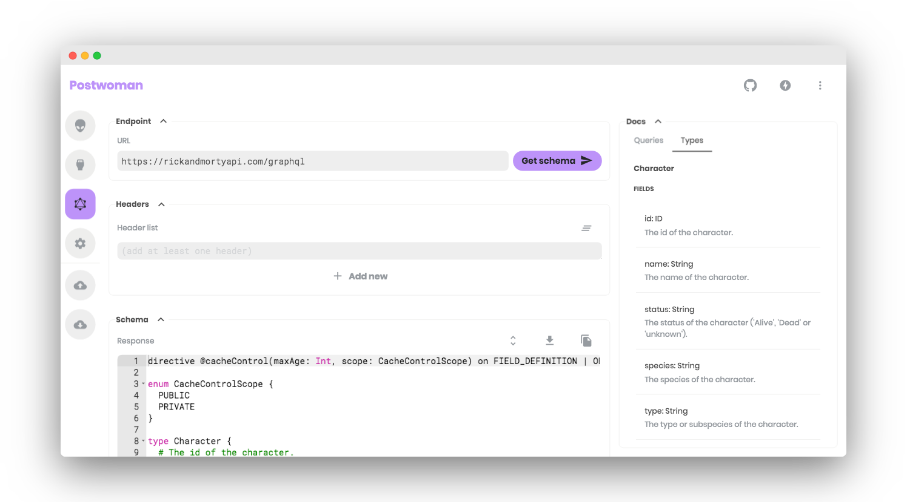

这章内容内容包括：

- Koa.js 框架快速入门
- Koa 极简实现
- 常用 Koa 中间件
- 认识 Restful Api
- 实现简单的 Restful API

## Koa.js 框架快速入门

Koa 是一个 web 框架，由 Express 幕后的原班人马打造， 致力于成为 web 应用和 API 开发领域中的一个更小、更富有表现力、更健壮的基石。 通过利用 async/await 函数，摆脱回调地狱，并有力地增强错误处理。Koa 并没有捆绑任何中间件，而是提供了一套优雅的中间件方法，让你自由的按需加载，这种作法褒贬不一，各大厂都会根据团队需求来封装自己 node 框架，衍生出的比较有名的有 Egg.js、nest.js、thinkjs 和 hapi，有兴趣的可以自行搜索相关资料。

Koa 应用程序是一个包含一组中间件函数的对象，它是按照类似堆栈的方式组织和执行的。 Koa 类似于其他中间件系统，然而，一个关键的设计点是在其低级中间件层中提供高级`语法糖`。 尽管提供了相当多的有用的方法 Koa 仍保持了一个很小的体积，因为没有捆绑中间件。

还是那个 Hello Uniapp 应用:

    const Koa = require('koa');
    const app = new Koa();

    app.use(async ctx => {
      ctx.body = 'Hello Uniapp';
    });

    app.listen(3000);

Koa 中间件以更传统的方式级联，使用 async 功能，我们可以实现 “真实” 的中间件。

Koa 中间件包含两个参数 ctx 和 next。参数 next 是一个函数，它的作用是将处理控制权交给下一中间件。Koa 中间件采用级联代码方式执行。其中间件参数 next 的级联执行逻辑如图所示。

Koa 中间件执行顺序原理图

> 执行流程，事件从最外层逐层触发，每层都会一进一出穿过两次，且最先穿入的一层最后穿出，到达最后一层最后冒泡返回。好比水分进出洋葱一样，洋葱的每层相当于中间件，水分输入相当于请求，水分输出相当于相应。

下面以`欢迎订阅，Uniapp从入门到进阶`的响应作为示例，请求开始进入中间件 1，打印`欢迎订阅，`，当遇到第一个 next() 则该函数暂停并将控制传递给定义的下一个中间件 2，打印`Uniapp`，遇到第二个 next() 发现没有更多的中间件执行了，于是返回打印`从入门`，再向上打印`到进阶`，然后跳出中间往下执行其他代码。

    const Koa = require('koa');
    const app = new Koa();
    // 中间件 1
    app.use(async (ctx, next) => {
    	console.log('欢迎订阅，')
        await next();
    	console.log('到进阶')
    });
    // 中间件 2
    app.use(async (ctx, next) => {
        ctx.body = 'Uniapp';
    	await next();
    	console.log('从入门')
    });
    app.listen(3000, () => {
        console.log('server is running at http://localhost:3000')
    });

## Koa 极简实现

有的朋友可能之前已经了解过 Koa 的组成，网上也有很多的源码分析，我打算来简单的实现一个 mini 版本。麻雀虽小，但是核心依然是入口 Application 和 上下文 Context。

各模块的核心：

- Application：`use()`，`listen()`，`callback()`，`compose()`
- Context：整合 `req`，`res` 到 `ctx` 对象中

接下来实现入口 Application.js：

    const http = require('http') // 利用 http 模块
    const Context = require('./Context') // 导入 Context 模块

    module.exports = class Application {
        constructor() {
            this.middlewares = [] // 保存所有的中间件函数
        }

        // 构建ctx，传入到中间件集合，执行next递归
        callback() {
            return async(req, res) => {

                // 初始化ctx
                const ctx = new Context(req, res);

                //调用 compose 函数，依次处理所有中间件函数
                const fn = this.compose(this.middlewares);
                await fn(ctx)
                // 最后返回res body
                this.responseBody(ctx)
            }
        }

        // 简单粗暴处理res body
        responseBody(ctx) {
            const content = ctx.body;
            ctx.res.end(content);
            console.log(content)

            // 可加入类型判断，error错误处理流程
            // ...
        }

        // 核心：递归中间件，即所谓的 `next()` 方法，先执行第一个
        compose(middlewares) {
            return ctx => {
                const useMiddleware = i => {
                    let fn = middlewares[i] //遍历中间件集合
                    if (!fn) {
                        return
                    }
                    return fn(ctx, () => useMiddleware(i + 1)) //递归执行中间件方法，并且传到一下层
                }
                return useMiddleware(0)
            }
        }

        // 挂载中间件
        use(middleware) {
            //打包中间件集合，middleware实则是个方法
            this.middlewares.push(middleware)
        }

        // 启动服务器
        listen(...args) {
            const server = http.createServer(this.callback())
            server.listen(...args)
        }

    }

Context.js 暂且简单做个代理：

    module.exports = class Context {
        constructor(req, res) {
            this.req = req
            this.res = res
        }
    }

借用上小节的代码测试：

    const MiniKoa = require('./Application.js');
    const app = new MiniKoa();
    // 中间件 1
    app.use(async(ctx, next) => {
        console.log('欢迎订阅，')
        await next();
        console.log('到进阶')
        ctx.body = 'print to body';
    });
    // 中间件 2
    app.use(async(ctx, next) => {
        console.log('Uniapp')
        await next();
        console.log('从入门')
    });
    app.listen(3000, () => {
        console.log('启动 http://localhost:3000')
    });

可以看到网页显示：“print to body”

查看终端，显示和预想一样：

## 常用 Koa 中间件

随着 ES6 的普及，async/await 的语法受到更多开发者的青睐，Koa 作为比较早支持使用该语法的 Node 框架越来越受到大家的喜爱，虽然 Koa 本身支持的功能很有限，但官方和社区提供了很多各种功能的中间件。

- [koa-router][]
- [koa-bodyparser][]
- [koa-multer][]
- [koa-views][]
- [koa-static][]
- [koa-session][]
- [koa-jwt][]
- [koa-helmet][]
- [koa-compress][]
- [koa-logger][]
- [@koa/cors@2][koa_cors_2]

更多 Koa 插件可以到 [github.com/koajs/koa/w…][github.com_koajs_koa_w] 获取。

## 认识 Restful Api

### Rest

- Rest 即表述性状态传递，Representational State Transfer 的简称；
- Rest 是一种软件架构风格；
- Rest 是一组架构约束条件和原则；
- Rest 通常基于使用 HTTP，URI，和 XML 以及 HTML 这些现有的广泛流行的协议和标准；
- Rest 通常使用 JSON 数据格式；
- Rest 是设计风格而不是标准。

### Restful

- 满足这些约束条件和原则的应用程序或设计就是 Restful

> 总结 REST 有两个最重要的原则： 1.分离性；交互的客户端和服务器除了 Restful-API 没有其他的依赖关系，限制了整个系统的复杂性，促进了各个部分的独立性。 2.无状态性：客户端和服务器之间的交互在请求之间是无状态的，从客户端到服务器的每个请求都必须包含理解请求所必需的信息。基于 Rest 架构的 Web Services 即是 Restful。

### Restful Api

- 满足上面规范的 API 接口就是 Restful-API。客户端常常通过 HTTP 方法(GET、POST、PUT、DELETE 等)，来发送 API 请求；服务端常常以 JSON 数据作为响应。

> Rest 基本架构的四个 HTTP 方法： GET - 用于获取数据。 PUT - 用于更新或添加数据。 DELETE - 用于删除数据。 POST - 用于添加数据

## 实现简单的 Restful API

接下来，我尝试搭建简单的 Restful Api，这里直接列出代码，通过注释讲解：

    const Koa = require('koa');
    const logger = require('koa-logger');
    const Router = require('koa-router');
    const cors = require('@koa/cors');
    const app = new Koa();

    //加入中间件
    //记录日志
    app.use(logger());

    //支持跨域请求
    app.use(cors());

    // 主页
    let routerHome = new Router();
    routerHome.get('/', async (ctx, next) => {
        ctx.body = 'Hello Uniapp';
    })

    let routerRest = new Router();
    routerRest.get('/list', async (ctx, next) => { // 请求 /list 路由
        ctx.body = {
            code: 200,
            msg: '请求成功',
            data: 'list列表数据'
        };
    }).post('/detail/:id', async (ctx, next) => { // 请求 /detail 路由 参数 id: 10086
        ctx.body = {
            code: 200,
            msg: '请求成功',
            data: 'detail详情数据'
        };
    })

    // 装载所有路由
    let router = new Router();
    router.use('/', routerHome.routes(), routerHome.allowedMethods());
    router.use('/rest', routerRest.routes(), routerRest.allowedMethods());
    app.use(router.routes(), router.allowedMethods());

    //监听3000端口
    app.listen(3000, () => {
        console.log('server is running at http://localhost:3000')
    });

使用 curl 命令测试 Restful Api

##### GET 请求

    $curl http://localhost:3000/rest/list
    打印出：
    {
    	code: 200,
    	msg: '请求成功
    	data: 'list列表数据'
    }

##### POST 请求

    $curl http://localhost:3000/rest/detail -X POST -H "Content-Type:application/json" -d '{"id": 10086}'
    打印出：
    {
    	code: 200,
    	msg: '请求成功',
    	data: 'detail详情数据'
    }

## 接口调试工具

目前最受大众欢迎的 API 接口调试工具：[postman][]，免费的基本够用，当然你要高级的功能是收费的。

因此，最近出现了一款 postman 的“老婆”：[postwoman][]，免费开源、轻量级、快速的 API 调试工具，有兴趣的可以自己去尝试 ：）

## 小结

1.  本章通过介绍 Koajs 框架，实现一个简易 Koajs 和 Restful 风格，并且实现简单 Restful Api，目的是让你对写后端接口有个"傻瓜式"的入门，下一章我会基于 [NeteaseCloudMusicApi][] 这个项目，来为每个入口页面提供接口。
2.  本章代码 [mini-koa][]。

[img]: https://s.poetries.work/images/16ed107ee61bf775.jpeg
[202202231350073.png]: https://s.poetries.work/images/202202231350073.png
[koa-router]: https://github.com/ZijianHe/koa-router
[koa-bodyparser]: https://github.com/koajs/bodyparser
[koa-multer]: https://github.com/koa-modules/multer
[koa-views]: https://github.com/queckezz/koa-views
[koa-static]: https://github.com/koajs/static
[koa-session]: https://github.com/koajs/session
[koa-jwt]: https://github.com/koajs/jwt
[koa-helmet]: https://github.com/venables/koa-helmet
[koa-compress]: https://github.com/koajs/compress
[koa-logger]: https://github.com/koajs/logger
[koa_cors_2]: https://github.com/koajs/cors
[github.com_koajs_koa_w]: https://github.com/koajs/koa/wiki
[postman]: https://www.getpostman.com/
[img 1]: https://s.poetries.work/images/16f0d43611914f7b.jpeg
[postwoman]: https://github.com/liyasthomas/postwoman
[img 2]: https://s.poetries.work/images/16f0d43a8b2a4289.png
[neteasecloudmusicapi]: https://binaryify.github.io/NeteaseCloudMusicApi
[mini-koa]: https://github.com/front-end-class/mini-koa
